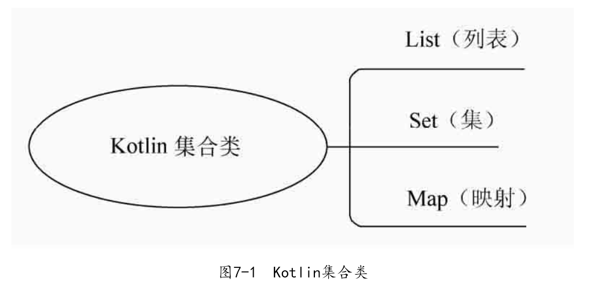
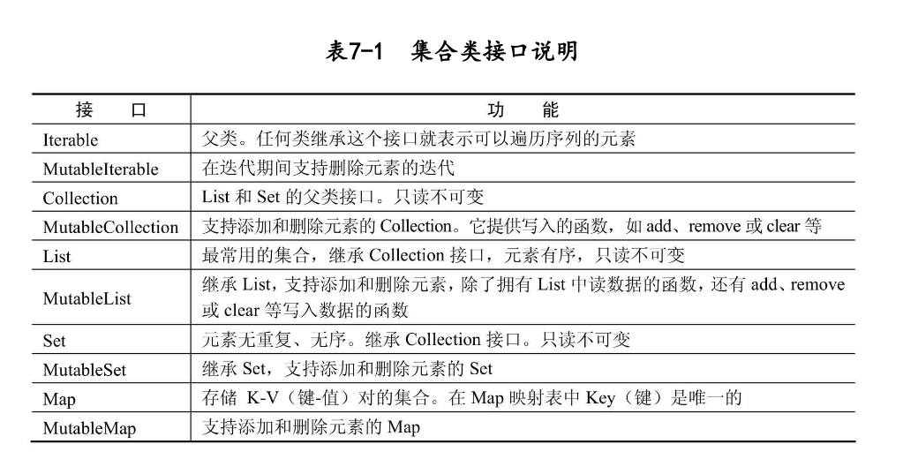
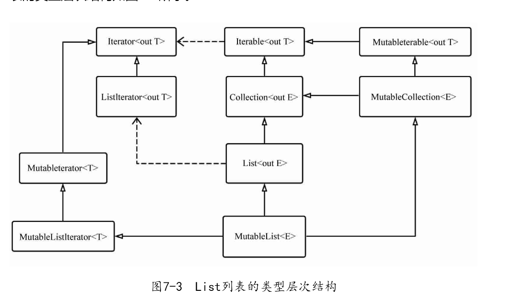
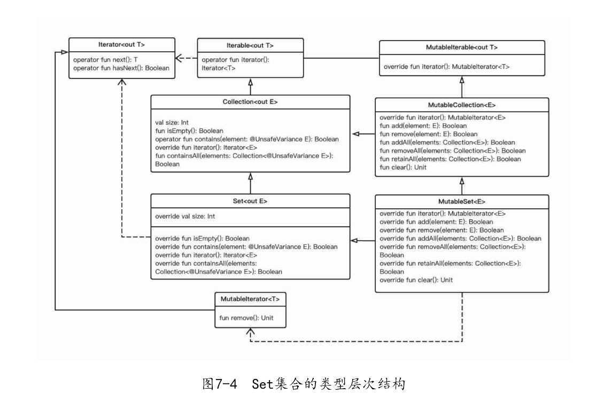
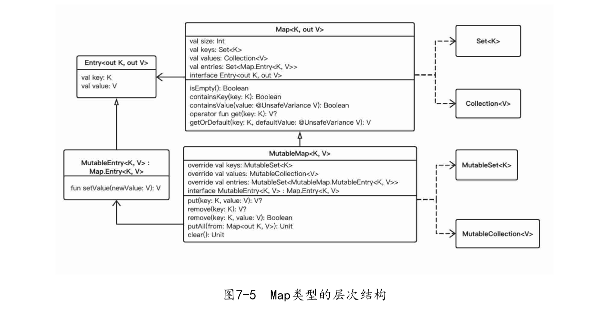
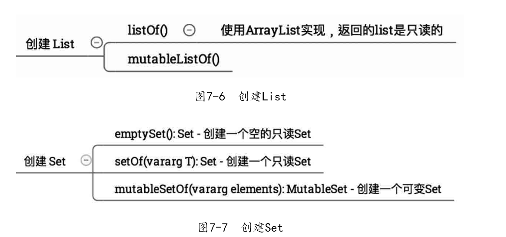
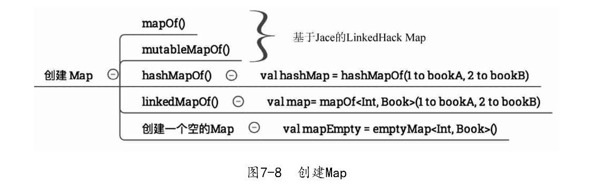

# 一 Kotlin 基本认识

- 官网：https://kotlinlang.org/
- 中文官网：https://www.kotlincn.net/

## 1.1 概述


`Kotlin `是一种在 Java 虚拟机上运行的静态类型编程语言，被称之为` Android` 世界的`Swift`，由 `JetBrains` 设计开发并开源。
`Kotlin` 可以编译成`Java`字节码，也可以编译成 `JavaScript`，方便在没有 JVM 的设备上运行。
在`Google I/O 2017`中，`Google `宣布`Kotlin`成为 `Android `官方开发语言。

## 1.2 优势

- 与 Java 完全兼容，可以与 Java 代码无缝互通
- 代码更简洁，更容易阅读
- 减少了很多样板代码
- 支持扩展函数
- 支持 Lambda 表达式
- 支持空安全
- 支持函数式编程
- 支持集合过滤操作
- 支持属性代理
- 支持字符串模板
- 支持协程
- 支持类型推断
- 支持高阶函数
- 支持数据类
- 支持密封类
- 支持代数数据类型

## 1.3 跨平台

- Kotlin/Native：可以编译成本地代码，可以在嵌入式设备上运行，也可以编译成 iOS 和 MacOS 上的应用程序。
- Kotlin/JS：可以编译成 JavaScript 代码，可以在浏览器中运行，也可以编译成 Node.js 应用程序。
- Kotlin/JVM：可以编译成 Java 字节码，可以在 Java 虚拟机上运行，也可以编译成 Android 应用程序。

## 1.4 安装

- 下载地址：https://kotlinlang.org/docs/command-line.html#install-the-compiler


- 配置环境变量


- 验证（`kotlinc -version`）


## 1.5 Idea 选择 Kotlinc 项目


## 1.6 为啥要学习 Kotlin

参考视频：https://www.bilibili.com/video/BV1SY411y7T8/?spm_id_from=333.337.search-card.all.click

- 进阶安卓开发
- 了解新技术，提升自己
- 看看 Kotlin 的优势，是否可以用在自己的项目中，与 Java 相比，是否有优势

# 二 基本语法


## 2.1 Hello World

```kotlin
/**
 * @description: 程序入口
 * @author: shu
 * @createDate: 2023/7/31 13:08
 * @version: 1.0
 */
// 总结：
// 1. main函数的参数是一个字符串数组
// 2. main函数的返回值是Unit类型，相当于Java中的void
// 3. main函数的参数可以通过命令行传递
// 4. main函数可以省略不写

fun main(args: Array<String>) {
    println(args.contentToString())
}

//fun main() {
//    println("Hello World!")
//}
```


对比，Java 的 Hello World 代码如下：

```java
public class HelloWorld {
    public static void main(String[] args) {
        System.out.println("Hello World!");
    }
}
```

我们可以看到，Kotlin 的代码比 Java 的代码简洁很多，而且 Kotlin 的代码更加符合人类的思维，更加容易阅读，下面我们来看看 Kotlin 的基本语法。

## 2.2 变量

- 变量（数据名称）标识一个对象的地址，我们称之为标识符。而具体存放的数据占用内存的大小和存放的形式则由其类型来决定。
- 在 Kotlin 中，所有的变量类型都是引用类型。Kotlin 的变量分为 val（不可变的）和 var（可变的）。可以简单理解为：val 是只读的，仅能一次赋值，后面就不能被重新赋值；　 var 是可写的，在它生命周期中可以被多次赋值。
- 基本语法：`var 变量名: 变量类型 = 变量值`

```kotlin
/**
 * @description:
 * @author: shu
 * @createDate: 2023/7/31 14:15
 * @version: 1.0
 */
class VariableTest {
    // 总结：
    // 1. 变量的格式：var 变量名: 变量类型 = 变量值
    // 2. 变量的类型可以省略不写，由编译器自动推断
    // 3. 变量的类型可以省略不写，但是变量的值不能省略不写
    // 4. 变量的类型可以省略不写，但是变量的值不能省略不写，变量的值可以通过后面的赋值语句赋值


    var name: String = "张三"
    var age: Int = 18
    var height: Double = 1.75
    var isMarried: Boolean = false
}

fun main(args: Array<String>) {
    val variableTest = VariableTest()
    println("姓名：${variableTest.name}")
    println("年龄：${variableTest.age}")
    println("身高：${variableTest.height}")
    println("婚否：${variableTest.isMarried}")
    // 不指定类型，由编译器自动推断
    var name = "李四"
    var age = 20
    var height = 1.80
    var isMarried = true
    // 指定类型，不允许修改
    val name1: String = "王五"
    val age1: Int = 22
    val height1: Double = 1.85
    val isMarried1: Boolean = false
    println("姓名：${name}")
    println("年龄：${age}")
    println("身高：${height}")
    println("婚否：${isMarried}")
    println("姓名：${name1}")
    println("年龄：${age1}")
    println("身高：${height1}")
    println("婚否：${isMarried1}")
    // 指定类型，不赋值，由编译器自动推断
    val name2: String
    val age2: Int
    val height2: Double
    val isMarried2: Boolean
    name2 = "赵六"
    age2 = 24
    height2 = 1.90
    isMarried2 = true
    println("姓名：${name2}")
    println("年龄：${age2}")
    println("身高：${height2}")
    println("婚否：${isMarried2}")
}
```


我们可以对比一下 Java 的变量定义：

```java
// 定义变量
String name = "张三";
int age = 18;
double height = 1.75;
boolean isMarried = false;
// 定义常量
final String name1 = "李四";
final int age1 = 20;
final double height1 = 1.80;
final boolean isMarried1 = true;
```

我们可以一发现变量的定义，Kotlin 比 Java 的代码简洁很多，而且 Kotlin 的代码更加符合人类的思维，更加容易阅读，但是这只是正对学习 Kotlin 的人来说，对于 Java 开发者来说，Java 的代码更加容易阅读。

注意点：

只要可以，应尽量在 Kotlin 中首选使用 val 不变值。因为在程序中大部分地方只需要使用不可变的变量，而使用 val 变量可以带来可预测的行为和线程安全等优点。

## 2.3 关键字与修饰符

- 关键字：通常情况下，编程语言中都有一些具有特殊意义的标识符是不能用作变量名的，这些具有特殊意义的标识符叫做关键字（又称保留字），编译器需要针对这些关键字进行词法分析，这是编译器对源码进行编译的基础步骤之一。
- 修饰符：Kotlin 中的修饰符关键字主要分为：类修饰符、成员修饰符、访问权限修饰符、协变逆变修饰符、函数修饰符、属性修饰符、参数修饰符、具体化类型修饰符等。


关键字：


## 2.4 控制流程

流程控制语句是编程语言中的核心之一，可分为：

- 分支语句（if、when）
- 循环语句（for、while）
- 跳转语句（return、break、continue、throw）

### 2.4.1 If 语句

- 概念：`if` 语句用于基于给定的布尔表达式的真假来执行代码块。
- 语法： `if (布尔表达式) { 代码块 }`
- 说明：如果布尔表达式的值为 `true`，则执行 `if` 代码块中的代码，否则执行 `if` 代码块后面的代码。

```kotlin
package Controller

/**
 * @description:
 * @author: shu
 * @createDate: 2023/7/31 21:12
 * @version: 1.0
 */
class IF {

    /**
     * if语句
     */
    fun isScore(score: Int): String {
        return if (score >= 90) {
            "优秀"
        } else if (score >= 80) {
            "良好"
        } else if (score >= 70) {
            "中等"
        } else if (score >= 60) {
            "及格"
        } else {
            "不及格"
        }
    }
}

fun main() {
    val iF = IF()
    println(iF.isScore(90))
}

```

### 2.4.2 when 语句

- 概念：`when` 语句用于取代 `if-else if` 和 `switch` 语句，`when` 语句类似其他语言的 `switch` 操作符。
- 语法：`when` 语句有点类似其他语言的 `switch` 操作符。其最简单的形式如下：

```kotlin
when (变量) {
    取值1 -> 代码块1
    取值2 -> 代码块2
    取值3 -> 代码块3
    ...
    else -> 代码块n
}
```

- in 运算符：`in` 运算符用于检测某个变量是否属于某个区间，`in` 运算符会检测变量是否在指定的区间内，如果在区间内，返回 `true`，否则返回 `false`。
- !in 运算符：`!in` 运算符用于检测某个变量是否不属于某个区间，`!in` 运算符会检测变量是否不在指定的区间内，如果不在区间内，返回 `true`，否则返回 `false`。
- is 运算符：`is` 运算符用于检测某个变量是否属于某个类型，`is` 运算符会检测变量是否是指定的类型，如果是指定的类型，返回 `true`，否则返回 `false`。
- !is 运算符：`!is` 运算符用于检测某个变量是否不属于某个类型，`!is` 运算符会检测变量是否不是指定的类型，如果不是指定的类型，返回 `true`，否则返回 `false`。
- 说明：`when` 语句会从上到下依次判断每个条件是否满足，如果满足，执行对应的代码块，如果不满足，继续判断下一个条件，如果所有条件都不满足，执行 `else` 代码块。

```kotlin
when (x) {
    in 1..10 -> print("x is in the range")
    in validNumbers -> print("x is valid")
    !in 10..20 -> print("x is outside the range")
    else -> print("none of the above")
}
```

```kotlin
package Controller

/**
 * @description:
 * @author: shu
 * @createDate: 2023/7/31 22:30
 * @version: 1.0
 */
class WhenTest {

        /**
        * when语句
        */
        fun isScore(score: Int): String {
            return when(score) {
                90 -> "优秀"
                80 -> "良好"
                70 -> "中等"
                60 -> "及格"
                else -> "不及格"
            }
        }

        /**
        * when语句
        */
        fun isScore2(score: Int): String {
            return when(score) {
                in 90..100 -> "优秀"
                in 80..89 -> "良好"
                in 70..79 -> "中等"
                in 60..69 -> "及格"
                else -> "不及格"
            }
        }

        /**
        * when语句
        */
        fun isScore3(score: Int): String {
            return when(score) {
                90, 100 -> "优秀"
                80, 89 -> "良好"
                70, 79 -> "中等"
                60, 69 -> "及格"
                else -> "不及格"
            }
        }

        /**
        * when语句
        */
        fun isScore4(score: Int): String {
            return when(score) {
                90, 100 -> "优秀"
                80, 89 -> "良好"
                70, 79 -> "中等"
                60, 69 -> "及格"
                else -> {
                    println("else")
                    "不及格"
                }
            }
        }

        /**
        * when语句
        */
        fun isScore5(score: Int): String {
            return when(score) {
                90, 100 -> "优秀"
                80, 89 -> "良好"
                70, 79 -> "中等"
                60, 69 -> "及格"
                else -> {
                    println("else")
                    "不及格"
                }
            }
        }

        /**
        * when语句
        */
        fun isScore6(score: Int): String {
            return when (score) {
                90, 100 -> "优秀"
                80, 89 -> "良好"
                70, 79 -> "中等"
                60, 69 -> "及格"
                else -> {
                    println("else")
                    "不及格"
                }
            }
        }
}

fun main() {
    val whenTest = WhenTest()
    println(whenTest.isScore(90))
    println(whenTest.isScore2(90))
    println(whenTest.isScore3(90))
    println(whenTest.isScore4(90))
    println(whenTest.isScore5(90))
    println(whenTest.isScore6(90))
}
```

### 2.4.3 for 循环

- 概念：`for` 循环用于对任何类型的集合进行遍历。
- 语法：`for` 循环的语法格式如下：

```kotlin
for (item in 集合) {
    代码块
}
```

- 说明：`for` 循环会遍历集合中的每个元素，将元素赋值给变量 `item`，然后执行 `for` 循环中的代码块。
- `for` 循环的 `item` 变量可以省略，如果省略，那么 `for` 循环中的代码块就不能使用 `item` 变量。
- `for` 循环的 `item` 变量可以使用 `val` 或 `var` 修饰，如果使用 `val` 修饰，那么 `item` 变量就是只读变量，不能修改，如果使用 `var` 修饰，那么 `item` 变量就是可读写变量，可以修改。
- `for` 循环的 `item` 变量的类型可以省略不写，由编译器自动推断，也可以显式指定类型。

```kotlin
package Controller

/**
 * @description:
 * @author: shu
 * @createDate: 2023/7/31 22:33
 * @version: 1.0
 */
class ForTest {

    // for循环
    fun forTest() {
        for (i in 1..10) {
            println(i)
        }
    }
    // 数组遍历
    fun forTest2() {
        val arr = arrayOf(1, 2, 3, 4, 5)
        for (i in arr) {
            println(i)
        }
    }
    // withIndex
    fun forTest3() {
        val arr = arrayOf(1, 2, 3, 4, 5)
        for ((index, value) in arr.withIndex()) {
            println("下标：$index, 值：$value")
        }
    }

}

fun main() {
    val forTest = ForTest()
    forTest.forTest()
    forTest.forTest2()
    forTest.forTest3()
}

```

### 2.4.4 while 循环

- 概念：`while` 循环用于重复执行一段代码，直到指定的条件不满足为止。
- 语法：`while` 循环的语法格式如下：

```kotlin
while (布尔表达式) {
    代码块
}
```

- 说明：`while` 循环会重复执行 `while` 循环中的代码块，直到布尔表达式的值为 `false` 为止。
- `while` 循环的布尔表达式可以省略不写，如果省略不写，那么 `while` 循环的布尔表达式的值就是 `true`，这样 `while` 循环就会无限循环下去，直到程序崩溃。
- `while` 循环的布尔表达式可以使用 `val` 或 `var` 修饰，如果使用 `val` 修饰，那么布尔表达式就是只读变量，不能修改，如果使用 `var` 修饰，那么布尔表达式就是可读写变量，可以修改。
- `while` 循环的布尔表达式的类型可以省略不写，由编译器自动推断，也可以显式指定类型。

```kotlin
package Controller

/**
 * @description:
 * @author: shu
 * @createDate: 2023/7/31 22:35
 * @version: 1.0
 */
class WhileTest {

        /**
        * while循环
        */
        fun whileTest() {
            var i = 1
            while (i <= 10) {
                println(i)
                i++
            }
        }

        /**
        * do...while循环
        */
        fun doWhileTest() {
            var i = 1
            do {
                println(i)
                i++
            } while (i <= 10)
        }

}

fun main() {
    val whileTest = WhileTest()
    whileTest.whileTest()
    whileTest.doWhileTest()
}
```

- 说明：i++ 和 ++i 的区别：i++ 表示先使用 i 的值，然后再让 i 加 1，++i 表示先让 i 加 1，然后再使用 i 的值。

### 2.4.5 返回与跳转

Kotlin 有三种结构化跳转表达式：
return 默认从最直接包围它的函数或者匿名函数返回。
break 终止最直接包围它的循环。
continue 继续下一次最直接包围它的循环。
所有这些表达式都可以用作更大表达式的一部分：

```kotlin
val s = person.name ?: return
```

```kotlin
fun foo() {
    listOf(1, 2, 3, 4, 5).forEach {
        if (it == 3) return // 非局部直接返回到 foo() 的调用者
        print(it)
    }
    println("this point is unreachable")
}
```

```kotlin
fun foo() {
    listOf(1, 2, 3, 4, 5).forEach lit@{
        if (it == 3) return@lit // 局部返回到该 lambda 表达式的调用者，即 forEach 循环
        print(it)
    }
    print(" done with explicit label")
}
```

```kotlin
fun foo() {
    listOf(1, 2, 3, 4, 5).forEach {
        if (it == 3) return@forEach // 隐式标签更方便。该 lambda 表达式的隐式标签是 foo
        print(it)
    }
    print(" done with implicit label")
}
```

```kotlin
fun foo() {
    run loop@{
        listOf(1, 2, 3, 4, 5).forEach {
            if (it == 3) return@loop // 从传入 run 的 lambda 表达式非局部返回
            print(it)
        }
    }
    print(" done with nested loop")
}
```

```kotlin
fun foo() {
    listOf(1, 2, 3, 4, 5).forEach(fun(value: Int) {
        if (value == 3) return  // 局部返回到匿名函数的调用者，即 forEach 循环
        print(value)
    })
    print(" done with anonymous function")
}
```

break 和 continue 标签
在 Kotlin 中任何表达式都可以用标签（label）来标记。 标签的格式为标识符后跟 @ 符号，例如：abc@、fooBar@都是有效的标签。 要为一个表达式加标签，我们只要在其前加标签即可。

```kotlin
loop@ for (i in 1..100) {
    // ……
}
```

现在，我们可以用标签限制 break 或者 continue：

```kotlin
loop@ for (i in 1..100) {
    for (j in 1..100) {
        if (……) break@loop
    }
}
```

标签限制的 break 跳转到刚好位于该标签指定的循环后面的执行点。 continue 继续标签指定的循环的下一次迭代。

### 2.4.6 异常

- Kotlin 中所有异常类继承自 Throwable 类。 每个异常都有消息、堆栈回溯信息以及可选的原因。
- Kotlin 中的所有异常都是不可检查的，即它们不会在函数签名中声明。 Kotlin 中有两种异常：可检查异常和不可检查异常。
- 可检查异常：可检查异常是指在函数签名中声明的异常，这种异常必须在函数签名中声明，调用这种函数时，必须使用 `try-catch` 语句处理这种异常，否则程序就会编译失败。

```kotlin
package Controller

/**
 * @description:
 * @author: shu
 * @createDate: 2023/7/31 22:42
 * @version: 1.0
 */
class CatchTest {
    // try...catch
    fun tryCatchTest() {
        try {
            val a = 10 / 0
        } catch (e: Exception) {
            println(e.message)
        }
    }
}

fun main() {
    val catchTest = CatchTest()
    catchTest.tryCatchTest()
}
```

- 不可检查异常：不可检查异常是指在函数签名中没有声明的异常，这种异常不需要在函数签名中声明，调用这种函数时，可以使用 `try-catch` 语句处理这种异常，也可以不处理，如果不处理，那么程序就会崩溃。

**try...catch...finally**

```kotlin
package Controller

/**
 * @description:
 * @author: shu
 * @createDate: 2023/7/31 22:42
 * @version: 1.0
 */
class CatchTest {
    // try...catch
    fun tryCatchTest() {
        try {
            val a = 10 / 0
        } catch (e: Exception) {
            println(e.message)
        }finally {
            println("finally")
        }
    }
}

fun main() {
    val catchTest = CatchTest()
    catchTest.tryCatchTest()
}
```

try 是一个表达式，即它可以有一个返回值：

```kotlin
val a: Int? = try { input.toInt() } catch (e: NumberFormatException) { null }
```

try-表达式的返回值是 try 块中的最后一个表达式或者是（所有）catch 块中的最后一个表达式。 finally 块中的内容不会影响表达式的结果。

### 2.4.7 标签

在 Kotlin 中任何表达式都可以用标签（label）来标记。标签的格式为标识符后跟@符号，如 abc@、\_isOK@都是有效的标签。我们可以用 Label 标签来控制 return、break 或 continue 语句的跳转（jump）行为。

```kotlin
package Controller

/**
 * @description:
 * @author: shu
 * @createDate: 2023/8/2 14:40
 * @version: 1.0
 */
class LableTest {

    fun  test(){
        loop@ for (i in 1..100){
            for (j in 1..100){
                if (j == 50){
                    break@loop
                }
            }
        }
    }
}

fun main() {
    val lableTest = LableTest()
    lableTest.test()
}
```

## 2.5 重载与操作符

- Kotlin 允许我们为自己的类型提供预定义的一组操作符的实现。这些操作符具有固定的符号表示（如“+”或“\*”）和固定的优先级


具体使用跟 Java 一样我就不多介绍了

## 2.6 包声明

- 我们在\*.kt 源文件开头声明 package 命名空间。


## 2.7 基本类型


基本数据类型与引用数据类型在创建时，内存存储方式区别如下：

- 基本数据类型在被创建时，在栈上给其划分一块内存，将数值直接存储在栈上（性能高）
- 引用数据类型在被创建时，首先在栈上给其引用（句柄）分配一块内存，而对象的具体信息存储在堆内存上，然后由栈上面的引用指向堆中对象的地址。
- Kotlin 中去掉了原始类型，只有包装类型，编译器在编译代码的时候，会自动优化性能，把对应的包装类型拆箱为原始类型。Kotlin 系统类型分为可空类型和不可空类型。
- Kotlin 中引入了可空类型，把有可能为 null 的值单独用可空类型来表示。这样就在可空引用与不可空引用之间划分出一条明确的、显式的“界线”。


Kotlin 中对应的可空数字类型就相当于 Java 中的装箱数字类型：


### 2.7.1 字符串

- Kotlin 中字符串用 `String` 类型表示。 通常，字符串值是双引号（`"`）中的字符序列

  ```kotlin
  val str = "abcd 123"
  ```

- 字符串是不可变的。 一旦初始化了一个字符串，就不能改变它的值或者给它赋新值。 所有转换字符串的操作都以一个新的 `String` 对象来返回结果，而保持原始字符串不变

- 字符串可以包含模板表达式 ，即一些小段代码，会求值并把结果合并到字符串中。 模板表达式以美元符（`$`）开头，由一个简单的名字构成

  ```kotlin
  val i = 10
  val s = "i = $i" // 求值结果为 "i = 10"
  ```

- 或者用花括号括起来的任意表达式

  ```kotlin
  val s = "abc"
  val str = "$s.length is ${s.length}" // 求值结果为 "abc.length is 3"
  ```

- 原始字符串使用三个引号（`"""`）分界符括起来，内部没有转义并且可以包含换行以及任何其他字符

  ```kotlin
  val text = """
  for (c in "foo")
      print(c)
  """
  ```

- 字符串字面值可以包含以下特殊字符：

  - 转义字符：`\t`、`\b`、`\n`、`\r`、`\'`、`\"`、`\\` 以及 `\$`
  - 字符字面值：任何其他字符都可以按照字面值来使用，例如：`fun main() { val s = "abc"; println("$s.length is ${s.length}") }`
  - 字符串模板：字符串可以包含模板表达式 ，即一些小段代码，会求值并把结果合并到字符串中。 模板表达式以美元符（`$`）开头，由一个简单的名字构成，或者用花括号括起来的任意表达式，例如：`fun main() { val i = 10; val s = "i = $i"; println(s) }`

- 字符串基本方法，例如：字符串的长度，取反，截取，去掉空格，等等方法

```kotlin
/**
 * @description:
 * @author: shu
 * @createDate: 2023/7/31 15:32
 * @version: 1.0
 */
class StringTest {

    var name:String="Hello World 哈哈红红火火恍恍惚惚!"

    fun printInfo(){
        println(name)
    }
    // 基本方法
    fun baseMethod(){
        // 长度
        println("字符串长度：${name.length}")
        // 判断是否为空
        println("字符串是否为空：${name.isEmpty()}")
        // 判断是否为空白
        println("字符串是否为空白：${name.isBlank()}")
        // 判断不为空
        println("字符串是否不为空：${name.isNotEmpty()}")
        // 判断不为空白
        println("字符串是否不为空白：${name.isNotBlank()}")
        // 判断是否包含某个字符
        println("字符串是否包含：${name.contains("Hello")}")
        // 判断是否包含,忽略大小写
        println("字符串是否包含：${name.contains("Hello",true)}")
        // 判断是否以指定字符串开头
        println("字符串是否以Hello开头：${name.startsWith("Hello")}")
        // 判断是否以指定字符串开头,忽略大小写
        println("字符串是否以Hello开头：${name.startsWith("Hello",true)}")
        // 判断是否以指定字符串结尾
        println("字符串是否以World!结尾：${name.endsWith("World!")}")
        // 判断是否以指定字符串结尾,忽略大小写
        println("字符串是否以World!结尾：${name.endsWith("World!",true)}")
        // 截取
        println("截取字符串：${name.substring(0,5)}")
        println("截取字符串：${name.substring(0 until 5)}")
        // 反转
        println("反转字符串：${name.reversed()}")
        // 替换
        println("替换字符串：${name.replace("Hello","你好")}")
        // 分割
        println("分割字符串：${name.split(" ")}")
        // 去除空格
        println("去除空格：${name.trim()}")
        println("去除左侧空格：${name.trimStart()}")
        println("去除右侧空格：${name.trimEnd()}")
        // 去除指定字符
        println("去除指定字符：${name.trim('H','!')}")
        println("去除左侧指定字符：${name.trimStart('H','!')}")
        println("去除右侧指定字符：${name.trimEnd('H','!')}")

    }
}

fun main() {
    val stringTest = StringTest()
    stringTest.printInfo()
    stringTest.baseMethod()
}
```


### 2.7.2 数字

Kotlin 提供了一组表示数字的内置类型。 对于整数，有四种不同大小的类型，因此值的范围也不同：

| 类型    | 大小（比特数） | 最小值                            | 最大值                              |
| ------- | -------------- | --------------------------------- | ----------------------------------- |
| `Byte`  | 8              | -128                              | 127                                 |
| `Short` | 16             | -32768                            | 32767                               |
| `Int`   | 32             | -2,147,483,648 (-231)             | 2,147,483,647 (231 - 1)             |
| `Long`  | 64             | -9,223,372,036,854,775,808 (-263) | 9,223,372,036,854,775,807 (263 - 1) |

当初始化一个没有显式指定类型的变量时，编译器会自动推断为足以表示该值的最小类型。 如果不超过 `Int` 的表示范围，那么类型是 `Int`。 如果超过了， 那么类型是 `Long`。 如需显式指定 `Long` 值，请给该值追加后缀 `L`。 显式指定类型会触发编译器检测该值是否超出指定类型的表示范围。

对于实数，Kotlin 提供了浮点类型 `Float` 与 `Double` 类型，遵循 [IEEE 754 标准](https://zh.wikipedia.org/wiki/IEEE_754)。 `Float` 表达 IEEE 754 _单精度_，而 `Double` 表达*双精度*。

这两个类型的大小不同，并为两种不同精度的浮点数提供存储：

| 类型     | 大小（比特数） | 有效数字比特数 | 指数比特数 | 十进制位数 |
| -------- | -------------- | -------------- | ---------- | ---------- |
| `Float`  | 32             | 24             | 8          | 6-7        |
| `Double` | 64             | 53             | 11         | 15-16      |

```kotlin
/**
 * @description:
 * @author: shu
 * @createDate: 2023/7/31 15:47
 * @version: 1.0
 */
class NumberTest {
    // 十进制
    var a: Int = 100
    // 十六进制
    var b: Int = 0x100
    // 二进制
    var c: Int = 0b100
    // Long类型需要加L
    var d: Long = 100L
    // Float类型需要加f
    var e: Float = 100.0f
    // Double类型可以不加
    var f: Double = 100.0
    // Short类型
    var g: Short = 100
    // Byte类型
    var h: Byte = 100

}
fun main(){
    var numberTest = NumberTest()
    println(numberTest.a)
    println(numberTest.b)
    println(numberTest.c)
    println(numberTest.d)
    println(numberTest.e)
    println(numberTest.f)
    println(numberTest.g)
    println(numberTest.h)
}
```

注意：与一些其他语言不同，Kotlin 中的数字没有隐式拓宽转换。 例如，具有 `Double` 参数的函数只能对 `Double` 值调用，而不能对 `Float`、 `Int` 或者其他数字值调用

**Java 中的面试题？**

```kotlin
fun main() {
//sampleStart
    val a: Int = 100
    val boxedA: Int? = a
    val anotherBoxedA: Int? = a

    val b: Int = 10000
    val boxedB: Int? = b
    val anotherBoxedB: Int? = b

    println(boxedA === anotherBoxedA) // true
    println(boxedB === anotherBoxedB) // false
//sampleEnd
}
```

由于 JVM 对 `-128` 到 `127` 的整数（`Integer`）应用了内存优化，因此，`a` 的所有可空引用实际上都是同一对象。但是没有对 `b` 应用内存优化，所以它们是不同对象。

**所有数字类型都支持转换为其他类型**

```kotlin
/**
 * @description:
 * @author: shu
 * @createDate: 2023/7/31 15:47
 * @version: 1.0
 */
class NumberTest {
    // 十进制
    var a: Int = 100
    // 十六进制
    var b: Int = 0x100
    // 二进制
    var c: Int = 0b100
    // Long类型需要加L
    var d: Long = 100L
    // Float类型需要加f
    var e: Float = 100.0f
    // Double类型可以不加
    var f: Double = 100.0
    // Short类型
    var g: Short = 100
    // Byte类型
    var h: Byte = 100

}
fun main(){
    var numberTest = NumberTest()
//    println(numberTest.a)
//    println(numberTest.b)
//    println(numberTest.c)
//    println(numberTest.d)
//    println(numberTest.e)
//    println(numberTest.f)
//    println(numberTest.g)
//    println(numberTest.h)
    // 所有数字类型都支持转换为其他类型
    println(numberTest.a.toLong())
    println(numberTest.a.toFloat())
    println(numberTest.a.toDouble())
    println(numberTest.a.toShort())
    println(numberTest.a.toByte())

}
```

所有数字类型都支持转换为其他类型：

- `toByte(): Byte`
- `toShort(): Short`
- `toInt(): Int`
- `toLong(): Long`
- `toFloat(): Float`
- `toDouble(): Double`

**数字运算**

- Kotlin 支持数字运算的标准集，运算被定义为相应的类成员（但编译器会将函数调用优化为相应的指令）
- 对于位运算，没有特殊字符来表示，而只可用中缀方式调用具名函数，例如：`shl`（位左移）、`shr`（位右移）、`ushr`（无符号位右移）、`and`（位与）、`or`（位或）、`xor`（位异或）和 `inv`（位非）

```kotlin
/**
 * @description:
 * @author: shu
 * @createDate: 2023/7/31 15:47
 * @version: 1.0
 */
class NumberTest {
    // 十进制
    var a: Int = 100
    // 十六进制
    var b: Int = 0x100
    // 二进制
    var c: Int = 0b100
    // Long类型需要加L
    var d: Long = 100L
    // Float类型需要加f
    var e: Float = 100.0f
    // Double类型可以不加
    var f: Double = 100.0
    // Short类型
    var g: Short = 100
    // Byte类型
    var h: Byte = 100

}
fun main(){
    var numberTest = NumberTest()
//    println(numberTest.a)
//    println(numberTest.b)
//    println(numberTest.c)
//    println(numberTest.d)
//    println(numberTest.e)
//    println(numberTest.f)
//    println(numberTest.g)
//    println(numberTest.h)
    // 所有数字类型都支持转换为其他类型
    println(numberTest.a.toLong())
    println(numberTest.a.toFloat())
    println(numberTest.a.toDouble())
    println(numberTest.a.toShort())
    println(numberTest.a.toByte())
    // 数字运算
    println(numberTest.a + numberTest.b)
    println(numberTest.a - numberTest.b)
    println(numberTest.a * numberTest.b)
    println(numberTest.a / numberTest.b)
    println(numberTest.a % numberTest.b)
    // 位运算
    println(numberTest.a and numberTest.b)
    println(numberTest.a or numberTest.b)
    println(numberTest.a xor numberTest.b)
    println(numberTest.a shl 2)
    println(numberTest.a shr 2)
    println(numberTest.a ushr 2)
    println(numberTest.a.inv())
    // 比较运算
    println(numberTest.a > numberTest.b)
    println(numberTest.a < numberTest.b)
    println(numberTest.a >= numberTest.b)
    println(numberTest.a <= numberTest.b)
    println(numberTest.a == numberTest.b)
    println(numberTest.a != numberTest.b)
    // 逻辑运算
    println(numberTest.a > numberTest.b && numberTest.a < numberTest.b)
    println(numberTest.a > numberTest.b || numberTest.a < numberTest.b)
    println(!numberTest.a.equals(numberTest.b))
}
```

### 2.7.3 字串

字符可以以转义反斜杠 `\` 开始。 支持这几个转义序列：

- `\t`——制表符
- `\b`——退格符
- `\n`——换行（LF）
- `\r`——回车（CR）
- `\'`——单引号
- `\"`——双引号
- `\\`——反斜杠
- `\$`——美元符

```kotlin
println("Hello\tWorld!")
println("Hello\bWorld!")
println("Hello\nWorld!")
println("Hello\rWorld!")
println("Hello\'World!")
println("Hello\"World!")
println("Hello\\World!")
println("Hello\$World!")
```

### 2.7.4 布尔

布尔用 `Boolean` 类型表示，它有两个值：`true` 和 `false`。
布尔值的内置运算有：
||——析取（逻辑或）
&&——合取（逻辑与）
!——否定（逻辑非）
|| 与 && 都是惰性（短路）的。

```kotlin
val b = true
val c = false
println(b || c)
println(b && c)
println(!b)
```

### 2.7.5 数组

数组在 Kotlin 中使用 `Array` 类来表示，它定义了 `get` 和 `set` 函数（按照运算符重载约定这会转变为 `[]`）以及 `size` 属性，以及一些其他有用的成员函数：

```kotlin
/**
 * @description:
 * @author: shu
 * @createDate: 2023/7/31 16:10
 * @version: 1.0
 */
class ArrayTest {

    // 数组的创建
    var arr1 = arrayOf(1, 2, 3, 4, 5)
    var arr2 = arrayOfNulls<Int>(5)
    var arr3 = Array(5) { i -> (i * 2) }
    // 数组的遍历
    fun printArray() {
        for (i in arr1) {
            println(i)
        }
        for (i in arr2) {
            println(i)
        }
        for (i in arr3) {
            println(i)
        }
    }
    // 原生类型数组
    var intArr = intArrayOf(1, 2, 3, 4, 5)
    var charArr = charArrayOf('a', 'b', 'c')
    var longArr = longArrayOf(1, 2, 3, 4, 5)
    var doubleArr = doubleArrayOf(1.0, 2.0, 3.0, 4.0, 5.0)
    var booleanArr = booleanArrayOf(true, false, true)
    // 数组的遍历
    fun printArray2() {
        for (i in intArr) {
            println(i)
        }
        for (i in charArr) {
            println(i)
        }
        for (i in longArr) {
            println(i)
        }
        for (i in doubleArr) {
            println(i)
        }
        for (i in booleanArr) {
            println(i)
        }
    }
}

fun main() {
    var arrayTest = ArrayTest()
    arrayTest.printArray()
    arrayTest.printArray2()
}
```

- `arrayOf()` 函数用于创建一个指定元素的数组，这个函数的返回值是一个数组，数组的元素类型是根据传递的参数来决定的，如果传递的是整数，那么数组的元素类型就是 `Int`，如果传递的是字符串，那么数组的元素类型就是 `String`，以此类推。
- `arrayOfNulls()` 函数用于创建一个指定元素的数组，这个函数的返回值是一个数组，数组的元素类型是根据传递的参数来决定的，如果传递的是整数，那么数组的元素类型就是 `Int`，如果传递的是字符串，那么数组的元素类型就是 `String`，以此类推。与 `arrayOf()` 函数不同的是，`arrayOfNulls()` 函数创建的数组的元素都是 `null`。
- `Array()` 函数用于创建一个指定元素的数组，这个函数的返回值是一个数组，数组的元素类型是根据传递的参数来决定的，如果传递的是整数，那么数组的元素类型就是 `Int`，如果传递的是字符串，那么数组的元素类型就是 `String`，以此类推。与 `arrayOf()` 函数不同的是，`Array()` 函数创建的数组的元素都是 `null`。
- `intArrayOf()` 函数用于创建一个指定元素的 `Int` 数组，这个函数的返回值是一个 `Int` 数组。
- `charArrayOf()` 函数用于创建一个指定元素的 `Char` 数组，这个函数的返回值是一个 `Char` 数组。
- `longArrayOf()` 函数用于创建一个指定元素的 `Long` 数组，这个函数的返回值是一个 `Long` 数组。
- `doubleArrayOf()` 函数用于创建一个指定元素的 `Double` 数组，这个函数的返回值是一个 `Double` 数组。
- `booleanArrayOf()` 函数用于创建一个指定元素的 `Boolean` 数组，这个函数的返回值是一个 `Boolean` 数组。
- 数组的遍历，可以使用 `for` 循环，也可以使用 `forEach()` 函数，`forEach()` 函数的参数是一个函数，这个函数的参数是数组的元素，这个函数的返回值是 `Unit`，`Unit` 相当于 Java 中的 `void`。

### 2.7.6 无符号类型

Kotlin 提供了一组无符号类型，用来改善对数字溢出的处理。这些类型在 Kotlin/JVM 中不可用。

| 类型     | 大小（比特数） | 最小值 | 最大值 |
| -------- | -------------- | ------ | ------ |
| `UByte`  | 8              | 0      | 255    |
| `UShort` | 16             | 0      | 65535  |
| `UInt`   | 32             | 0      | 2^32-1 |
| `ULong`  | 64             | 0      | 2^64-1 |

无符号类型的字面值分为两类：十进制和十六进制。对于十进制，没有前缀；对于十六进制，前缀是 `0x`。例如：

```kotlin
val a: UInt = 23u
val b: ULong = 23uL
val c: ULong = 0xCAFEBABEu
```

无符号类型支持常用的算术运算，以及位运算。请注意，无符号类型不支持有符号类型的减法或者除法。

```kotlin
val a: UInt = 23u
val b: UInt = 22u
val c: UInt = a + b
val d: UInt = a shl 2
```

无符号类型支持转换为有符号类型，反之亦然。转换时，有符号类型的负数会被转换为大的无符号类型。例如：

```kotlin
val x: Int = -1
val y: Long = x.toULong()
```

### 2.7.7 类型判断与转换

使用 `is` 操作符或其否定形式 `!is` 在运行时检测对象是否符合给定类型

```kotlin
/**
 * @description: is 类型判断
 * @author: shu
 * @createDate: 2023/7/31 21:03
 * @version: 1.0
 */
class IsTypeTest {

    /**
     * 判断是否是String类型
     */
    fun isString(obj: Any): Boolean {
        return obj is String
    }

    /**
     * 判断是否不是Int类型
     */
    fun notIsInt(obj: Any): Boolean {
        return obj !is Int
    }
}

fun main() {
    val isTypeTest = IsTypeTest()
    println(isTypeTest.isString("abc"))
    println(isTypeTest.notIsInt("abc"))
}
```

**智能替换**

大多数场景都不需要在 Kotlin 中使用显式转换操作符，因为编译器跟踪不可变值的 `is`-检测以及[显式转换](https://book.kotlincn.net/text/typecasts.html#不安全的转换操作符)，并在必要时自动插入（安全的）转换

```kotlin
/**
 * @description: is 类型判断
 * @author: shu
 * @createDate: 2023/7/31 21:03
 * @version: 1.0
 */
class IsTypeTest {

    /**
     * 判断是否是String类型
     */
    fun isString(obj: Any): Boolean {
        return obj is String
    }

    /**
     * 判断是否不是Int类型
     */
    fun notIsInt(obj: Any): Boolean {
        return obj !is Int
    }

    /**
     * 判断是否是String类型
     */
    fun isType(obj: Any) {
        when(obj) {
            is String -> println("obj is String")
            is Int -> println("obj is Int")
            is Long -> println("obj is Long")
            is Boolean -> println("obj is Boolean")
            is Array<*> -> println("obj is Array")
            is Char -> println("obj is Char")
            is Float -> println("obj is Float")
            is Double -> println("obj is Double")
            is Short -> println("obj is Short")
            is Byte -> println("obj is Byte")
            else -> println("obj is not know")

        }
    }

}

fun main() {
    val isTypeTest = IsTypeTest()
//    println(isTypeTest.isString("abc"))
//    println(isTypeTest.notIsInt("abc"))
    isTypeTest.isType("abc")
}
```

请注意，当编译器能保证变量在检测和使用之间不可改变时，智能转换才有效。 更具体地，智能转换适用于以下情形：

- `val` 局部变量——总是可以，[局部委托属性除外](https://book.kotlincn.net/text/delegated-properties.html)。
- `val` 属性——如果属性是 private 或 internal，或者该检测在声明属性的同一[模块](https://book.kotlincn.net/text/visibility-modifiers.html#模块)中执行。智能转换不能用于 open 的属性或者具有自定义 getter 的属性。
- `var` 局部变量——如果变量在检测和使用之间没有修改、没有在会修改它的 lambda 中捕获、并且不是局部委托属性。
- `var` 属性——决不可能（因为该变量可以随时被其他代码修改）。

### 2.7.8 可空类型

或许 Java 和 Android 开发者早已厌倦了空指针异常（Null Pointer Exception）。因为其在运行时总会在某个意想不到的地方忽然出现，让开发者感到措手不及。

Java

```java
package Controller;

import java.util.Optional;

/**
 * @description:
 * @author: shu
 * @createDate: 2023/8/2 15:01
 * @version: 1.0
 */
public class OptionalTest {
    public static void main(String[] args) {
         Optional<String> optional = Optional.of("hello");
         System.out.println(optional.isPresent());
         System.out.println(optional.get());
         System.out.println(optional.orElse("world"));
         optional.ifPresent(s -> System.out.println(s.charAt(0)));
    }
}
```

Kotlin

```kotlin
package Controller

import java.util.*

/**
 * @description:
 * @author: shu
 * @createDate: 2023/8/2 15:01
 * @version: 1.0
 */
object OptionalTest {
    @JvmStatic
    fun main(args: Array<String>) {
       // ? 来表达非空
        val str: String? = null
        println(str?.length)

    }
}
```

### 2.7.9 非空判断

- Kotlin 中提供了断言操作符`!!`，使得可空类型对象可以调用成员方法或者属性（但遇见 null，就会导致空指针异常）
- 使用 Elvis 操作符`?:`来给定一个在 null 情况下的替代值

```kotlin
package Controller

import java.util.*

/**
 * @description:
 * @author: shu
 * @createDate: 2023/8/2 15:01
 * @version: 1.0
 */
object OptionalTest {
    @JvmStatic
    fun main(args: Array<String>) {
       // ? 来表达非空
        val str: String? = null
        println(str?.length)
        // ！！ 表示非空断言
        println(str!!.length)
        // ?: 默认值
        println(str?.length ?: -1)
    }
}

```

# 三 类与对象

## 3.1 类

- 概念：类是具有相同属性和方法的对象的集合，它定义了该集合中每个对象所共有的属性和方法。对象是类的实例。
- 语法：类的语法格式如下：

```kotlin
class 类名 {
    属性
    方法
}
```

- 类声明由类名、类头（指定其类型参数、主构造函数等）以及由花括号包围的类体构成。类头与类体都是可选的； 如果一个类没有类体，可以省略花括号。

### 3.1.1 构造函数

- 概念：构造函数是用于初始化类的新对象的特殊函数。
- 语法：构造函数的语法格式如下：

```kotlin
class 类名(参数列表) {
    属性
    方法
}
```

- 说明：构造函数的参数列表可以省略不写，如果省略不写，那么构造函数的参数列表就是空的，如果省略不写，那么构造函数的 `()` 可以省略不写。
- 说明：构造函数的参数列表可以使用 `val` 或 `var` 修饰，如果使用 `val` 修饰，那么构造函数的参数就是只读变量，不能修改，如果使用 `var` 修饰，那么构造函数的参数就是可读写变量，可以修改。
- 主构造函数：类的主构造函数是类头的一部分：它跟在类名（与可选的类型参数）后。 如果主构造函数没有任何注解或者可见性修饰符，可以省略这个 constructor 关键字。

```kotlin
/**
 * @description:
 * @author: shu
 * @createDate: 2023/8/1 14:11
 * @version: 1.0
 */
class Person @Inject constructor(var name: String, var age: Int) {
    init {
        println("init")
    }
}
```

- 主构造函数不能包含任何的代码。初始化的代码可以放到以 init 关键字作为前缀的初始化块（initializer blocks）中：

```kotlin
class Person constructor(firstName: String) {
    init {
        println("FirstName is $firstName")
    }
}
```

### 3.1.2 次构造函数

- 概念：次构造函数是类中定义的其他构造函数，次构造函数的作用是为了扩展类的构造函数。
- 语法：次构造函数的语法格式如下：

```kotlin
class 类名 {
    constructor(参数列表) {
        // 构造函数的函数体
    }
}
```

- 说明：次构造函数的参数列表可以省略不写，如果省略不写，那么次构造函数的参数列表就是空的，如果省略不写，那么次构造函数的 `()` 可以省略不写。
- 说明：次构造函数的参数列表可以使用 `val` 或 `var` 修饰，如果使用 `val` 修饰，那么次构造函数的参数就是只读变量，不能修改，如果使用 `var` 修饰，那么次构造函数的参数就是可读写变量，可以修改。
- 如果类有一个主构造函数，每个次构造函数需要委托给主构造函数， 可以直接委托或者通过别的次构造函数间接委托。委托到同一个类的另一个构造函数用 this 关键字即可

```kotlin
package Class

/**
 * @description:
 * @author: shu
 * @createDate: 2023/8/1 14:11
 * @version: 1.0
 */
class Person (var name: String, var age: Int) {
    constructor(name: String) : this(name, 0) {
        println("constructor")
    }
    init {
        println("init")
    }
}

fun main() {
    val person = Person("Alice", 20)
    println(person.name)
    println(person.age)
    println("-----------")
    val person1 = Person("Alice01")
    println(person1.name)
}
```


### 3.1.3 创建类实例

- 概念：创建类实例是指使用类的构造函数创建类的对象。
- 语法：创建类实例的语法格式如下：

```kotlin
val 对象名 = 类名(参数列表)
```

### 3.1.4 类的成员

- 概念：类的成员是指类中定义的属性和方法。
- 说明：类的成员分为两种：属性和方法。
- 属性：类的属性是指类中定义的变量，类的属性分为两种：字段和属性。
- 字段：字段是指类中定义的变量，字段分为两种：成员变量和局部变量。
- 成员变量：成员变量是指类中定义的变量，成员变量分为两种：实例变量和静态变量。
- 实例变量：实例变量是指类中定义的变量，实例变量是属于对象的，每个对象都有一份实例变量的拷贝，修改其中一个对象的实例变量，不会影响其他对象的实例变量。
- 静态变量：静态变量是指类中定义的变量，静态变量是属于类的，所有对象共享一份静态变量，修改其中一个对象的静态变量，会影响其他对象的静态变量。
- 局部变量：局部变量是指类中定义的变量，局部变量是属于方法的，只有在方法的作用域内才能使用局部变量。
- 方法：类的方法是指类中定义的函数，类的方法分为两种：实例方法和静态方法。
- 实例方法：实例方法是指类中定义的函数，实例方法是属于对象的，只有通过对象才能调用实例方法。
- 静态方法：静态方法是指类中定义的函数，静态方法是属于类的，只能通过类名调用静态方法。

## 3.2 抽象类

抽象类用来表征问题领域的抽象概念。所有编程语言都提供抽象机制。机器语言是对机器的模仿抽象，汇编语言是对机器语言的高层次抽象，高级语言（Fortran、C、BASIC 等）是对汇编的高层次抽象。而我们这里所说的面向对象编程语言是对过程函数的高层次封装。

### 3.2.1 抽象类与接口

抽象是相对于具象而言的。例如，设计一个图形编辑软件，问题领域中存在着长方形（Rectangle）、圆形（Circle）、三角形（Triangle）等一些具体概念，它们是具象。但是它们又都属于形状（Shape）这个抽象的概念。


```kotlin
package Class

/**
 * @description:
 * @author: shu
 * @createDate: 2023/8/2 20:46
 * @version: 1.0
 */
abstract class Shape {
    abstract fun draw()
    abstract fun erase()
}
```

```kotlin
package Class

/**
 * @description:
 * @author: shu
 * @createDate: 2023/8/1 15:16
 * @version: 1.0
 */
class Rectangle: Shape() {
    override fun draw() {
        println("绘制矩形")
    }

    override fun erase() {
        println("擦除矩形")
    }
}

fun main() {
    val rectangle = Rectangle()
    rectangle.draw()
    rectangle.erase()
}
```

```kotlin
package Class

/**
 * @description:
 * @author: shu
 * @createDate: 2023/8/2 20:48
 * @version: 1.0
 */
class Circle: Shape() {
    override fun draw() {
        println("绘制圆形")
    }

    override fun erase() {
        println("擦除圆形")
    }

}
fun main() {
    val circle = Circle()
    circle.draw()
    circle.erase()
}
```

现在我们有了抽象类，但是没有成员。通常，一个类的成员包括属性和函数。抽象类的成员也必须是抽象的，需要使用 abstract 关键字修饰。下面我们声明一个抽象类 Shape，并带有 width、heigth、radius 属性

```kotlin
package Class

/**
 * @description:
 * @author: shu
 * @createDate: 2023/8/2 20:46
 * @version: 1.0
 */
abstract class Shape {
    abstract var wight: Double
    abstract var height: Double
    abstract var radius: Double
    abstract fun draw()
    abstract fun erase()
}
```

构造函数实现

```kotlin
package Class

/**
 * @description:
 * @author: shu
 * @createDate: 2023/8/1 15:16
 * @version: 1.0
 */
class Rectangle(override var wight: Double, override var height: Double, override var radius: Double) : Shape() {
    override fun draw() {
        println("绘制矩形")
    }

    override fun erase() {
        println("擦除矩形")
    }
}

fun main() {
    val rectangle = Rectangle(1.0, 2.0, 3.0)
    rectangle.draw()
    rectangle.erase()
}
```

```kotlin
package Class

/**
 * @description:
 * @author: shu
 * @createDate: 2023/8/2 20:48
 * @version: 1.0
 */
class Circle(override var wight: Double, override var height: Double, override var radius: Double) : Shape() {
    override fun draw() {
        println("绘制圆形")
    }

    override fun erase() {
        println("擦除圆形")
    }

}
fun main() {
    val circle = Circle(1.0, 2.0, 3.0)
    circle.draw()
    circle.erase()
}
```

当子类继承了某个类之后，便可以使用父类中的成员变量，但并不是完全继承父类的所有成员变量。具体的原则如下：

- 能够继承父类的 public 和 protected 成员变量
- 不能继承父类的 private 成员变量
- 对于父类的包访问权限成员变量，如果子类和父类在同一个包下，则子类能够继承；否则，子类不能继承；
- 对于子类可以继承的父类成员变量，如果在子类中出现了同名称的成员变量，则会发生隐藏现象，即子类的成员变量会屏蔽掉父类的同名成员变量。
- 如果要在子类中访问父类中的同名成员变量，需要使用 super 关键字进行引用。

### 3.2.2 接口

接口是一种比抽象类更加抽象的“类”。接口本身代表的是一种“类型”的概念。但在语法层面，接口本身不是类，不能实例化接口，只能实例化它的实现类。

- 概念：接口是指具有相同属性和方法的对象的集合，它定义了该集合中每个对象所共有的属性和方法。对象是接口的实例。
- Kotlin 的接口可以既包含抽象方法的声明也包含实现。与抽象类不同的是，接口无法保存状态。它可以有属性但必须声明为抽象或提供访问器实现。
- 语法：接口的语法格式如下：

```kotlin
interface 接口名 {
    属性
    方法
}
```

接口是没有构造函数的。我们使用冒号“:”语法来实现一个接口，如果有多个接口，用“，”逗号隔开：

- 语法：实现接口的语法格式如下：

```kotlin
class 类名 : 接口名 {
    属性
    方法
}
```

- 说明：实现接口的类必须实现接口中的所有抽象方法，如果不实现，那么类必须声明为抽象类。
- 案例：定义一个 `Person` 接口，定义一个 `Student` 类，实现 `Person` 接口。

```kotlin
package Interface

/**
 * @description: 接口是指具有相同属性和方法的对象的集合，它定义了该集合中每个对象所共有的属性和方法。对象是接口的实例。
 * Kotlin 的接口可以既包含抽象方法的声明也包含实现。与抽象类不同的是，接口无法保存状态。它可以有属性但必须声明为抽象或提供访问器实现。
 * @createDate: 2023/8/1 15:31
 * @version: 1.0
 */
interface Person {
    /**
     * 定义一个方法
     */
    fun eat(name: String)
}

class Student : Person {
    /**
     * 实现接口中的方法
     */
    override fun eat(name: String) {
        println("$name is eating. ")
    }
}

fun main(args: Array<String>) {
    val student = Student()
    student.eat("shu")
}
```

### 3.2.3 接口中的属性

- 可以在接口中定义属性。在接口中声明的属性要么是抽象的，要么提供访问器的实现。在接口中声明的属性不能有幕后字段（backing field），因此接口中声明的访问器不能引用它们
- 语法：接口中的属性的语法格式如下：

```kotlin
interface 接口名 {
    var/val 属性名: 属性类型
}
```

```kotlin
package Interface

/**
 * @description: 接口是指具有相同属性和方法的对象的集合，它定义了该集合中每个对象所共有的属性和方法。对象是接口的实例。
 * Kotlin 的接口可以既包含抽象方法的声明也包含实现。与抽象类不同的是，接口无法保存状态。它可以有属性但必须声明为抽象或提供访问器实现。
 * @createDate: 2023/8/1 15:31
 * @version: 1.0
 */
interface Person {
    /**
     * 定义一个属性
     */
    var name: String
    /**
     * 定义一个方法
     */
    fun eat(name: String)
}

class Student : Person {
    /**
     * 实现接口中的属性
     */
    override var name: String = "shu"
    /**
     * 实现接口中的方法
     */
    override fun eat(name: String) {
        println("$name is eating. ")
    }
}

fun main(args: Array<String>) {
    val student = Student()
    student.eat("shu")
    println(student.name)
}
```

### 3.2.4 接口继承

- 概念：接口继承是指使用 `:` 关键字继承接口的接口。
- 语法：接口继承的语法格式如下：

```kotlin
interface 子接口名 : 父接口名 {
    属性
    方法
}
```

- 说明：接口继承的接口必须实现接口中的所有抽象方法，如果不实现，那么接口必须声明为抽象接口。

```kotlin
package Interface

/**
 * @createDate: 2023/8/1 15:31
 * @version: 1.0
 */

interface Person {
    /**
     * 定义一个属性
     */
    var name: String
    /**
     * 定义一个方法
     */
    fun eat(name: String)

}

interface Student : Person {
    /**
     * 定义一个属性
     */
    var age: Int
    /**
     * 定义一个方法
     */
    fun study(name: String)
}

class StudentImpl : Student {
    /**
     * 实现接口中的属性
     */
    override var name: String = "shu"
    /**
     * 实现接口中的属性
     */
    override var age: Int = 20
    /**
     * 实现接口中的方法
     */
    override fun eat(name: String) {
        println("$name is eating. ")
    }
    /**
     * 实现接口中的方法
     */
    override fun study(name: String) {
        println("$name is studying. ")
    }
}

fun main(args: Array<String>) {
    val student = StudentImpl()
    student.eat("shu")
    println(student.name)
    student.study("shu")
    println(student.age)
}
```

### 3.2.5 函数式接口

- 概念：函数式接口是指只有一个抽象方法的接口。
- 只有一个抽象方法的接口称为函数式接口或 单一抽象方法（SAM）接口。函数式接口可以有多个非抽象成员，但只能有一个抽象成员。
  可以用 fun 修饰符在 Kotlin 中声明一个函数式接口。

```kotlin
fun interface KRunnable {
   fun invoke()
}
```

- 语法：函数式接口的语法格式如下：

```kotlin
fun interface 函数式接口名 {
    fun 方法名(参数列表): 返回值类型
}
```

- 说明：函数式接口的抽象方法可以有默认实现，也可以没有默认实现。
- 案例：定义一个 `KRunnable` 函数式接口，定义一个 `KThread` 类，实现 `KRunnable` 函数式接口。

```kotlin
package Interface

/**
 * @description:
 * @createDate: 2023/8/1 15:31
 * @version: 1.0
 */

fun interface KRunnable {
    fun invoke()

}

class KThread : KRunnable {
    override fun invoke() {
        println("KThread is running. ")
    }
}

fun main(args: Array<String>) {
    val kThread = KThread()
    kThread.invoke()
}
```

## 3.3 Object 对象

单例模式是一种常用的软件设计模式。例如，Spring 中的 Bean 默认就是单例。通过单例模式可以保证系统中一个类只有一个实例。即一个类只有一个对象实例。

Kotlin 中没有静态属性和方法，但是可以使用关键字 object 声明一个 object 单例对象：

```kotlin
package Class

/**
 * @description:
 * @author: shu
 * @createDate: 2023/8/2 21:03
 * @version: 1.0
 */
object User {
    var name: String = "shu"
    var age: Int = 18
    fun eat() {
        println("eat")
    }
}
fun main() {
    println(User.name)
    println(User.age)
    User.eat()
}
```

Kotlin 中还提供了伴生对象，用 companion object 关键字声明，一个类只能有一个伴生对象。

```kotlin
package Class

/**
 * @description:
 * @author: shu
 * @createDate: 2023/8/1 15:02
 * @version: 1.0
 */
open class Person {

    open var name: String = "shu"
    /**
     * 定义一个方法
     */
    open fun eat(name: String) {
        println("$name is eating. ")
    }

    companion object {
        @JvmStatic
        fun main(args: Array<String>) {
            val person = Person()
            person.eat("shu")
        }
    }
}
```

## 3.4 数据类

数据类就是只存储数据，不包含操作行为的类。Kotlin 中的数据类可以为我们节省大量的样板代码（Java 中强制我们要去写一堆 getter、setter 代码，而实际上这些方法都是“不言自明”的），这样最终的代码更易于理解，便于维护。

数据类有如下限制：

- 主构造函数至少包含一个参数
- 参数必须标识为 val 或者 var
- 不能为 abstract、open、sealed 或者 inner；
- 不能继承其他类（但可以实现接口）。

格式：

```kotlin
    data class LoginUser(val username: String, val password: String)
```

```kotlin
package Class

/**
 * @description:
 * @author: shu
 * @createDate: 2023/8/2 21:14
 * @version: 1.0
 */
data class LoginUser(val username: String, val password: String)
fun main(){
    val loginUser = LoginUser("shu", "123456")
    println(loginUser)
}

```

Kotlin 标准库提供了 Pair 和 Triple 数据类，分别表示二元组和三元组对象。它们的定义分别如下：

```kotlin
public data class Pair<out A, out B>(public val first: A, public val second: B) : Serializable {
    override fun toString(): String = "($first, $second)"
}

public data class Triple<out A, out B, out C>(
    public val first: A,
    public val second: B,
    public val third: C
) : Serializable {
    override fun toString(): String = "($first, $second, $third)"
}
```

```kotlin
package Class

/**
 * @description:
 * @author: shu
 * @createDate: 2023/8/2 21:14
 * @version: 1.0
 */
data class LoginUser(val username: String, val password: String)
fun main(){
    val loginUser = LoginUser("shu", "123456")
    println(loginUser)

    // 二元
    Pair("shu", "123456").let {
        println(it)
    }

    // 三元
    Triple("shu", "123456", "123456").let {
        println(it)
    }
}

```

## 3.5 枚举类

Kotlin 中使用 enum class 关键字来声明一个枚举类。

相比于字符串常量，使用枚举能够实现类型安全。枚举类有两个内置的属性：name，ordinal

```kotlin
package Class

/**
 * @description:
 * @author: shu
 * @createDate: 2023/8/3 9:31
 * @version: 1.0
 */
enum class Color {
    RED, GREEN, BLUE, ORANGE, YELLOW, INDIGO, VIOLET
}

fun main() {
    println(Color.RED)
    println(Color.GREEN)
    println(Color.BLUE)
    println(Color.ORANGE)
    println(Color.YELLOW)
    println(Color.INDIGO)
    println(Color.VIOLET)
}
```

## 3.6 内部类

Kotlin 中，类可以嵌套。一个类可以嵌套在其他类中，而且可以嵌套多层。

如果一个类 Inner 想要访问外部类 Outer 中的成员，可以在这个类前面添加修饰符 inner，内部类会带有一个对外部类的对象引用。

```kotlin
package Class

/**
 * @description:
 * @author: shu
 * @createDate: 2023/8/3 9:34
 * @version: 1.0
 */
class NestClass {
    inner class InnerClass {
        fun getOuterReference(): NestClass = this@NestClass
    }

    class NestedClass {
        fun getOuterReference(): NestClass = NestClass()
    }
}

fun main() {
    val nestClass = NestClass()
    val innerClass = nestClass.InnerClass()
    val nestedClass = NestClass.NestedClass()
    println(innerClass.getOuterReference())
    println(nestedClass.getOuterReference())
}
```

匿名内部类就是没有名字的内部类。匿名内部类也可以访问外部类的变量。

```kotlin
package Class

/**
 * @description:
 * @author: shu
 * @createDate: 2023/8/3 9:37
 * @version: 1.0
 */
object AnonymousClass {
    @JvmStatic
    fun main(args: Array<String>) {
        // 匿名类
        Thread { println("匿名类") }.start()

        // lambda表达式
        Thread { println("lambda表达式") }.start()
    }
}

```

# 四 函数

函数式编程是关于不变性和函数组合的编程范式。函数式编程有如下特征。

- 一等函数支持（first-class function）：函数也是一种数据类型，可以作为参数传入另一个函数中，同时函数也可以返回一个函数。
- 纯函数（pure function）和不变性（immutable）：纯函数指的是没有副作用的函数（函数不去改变外部的数据状态）。例如，一个编译器就是一个广义上的纯函数。在函数式编程中，倾向于使用纯函数编程。正因为纯函数不会去修改数据，同时又使用不可变的数据，所以程序不会去修改一个已经存在的数据结构，而是根据一定的映射逻辑创建一份新的数据。函数式编程是转换数据而非修改原始数据。
- 函数的组合（compose function）：在面向对象编程中是通过对象之间发送消息来构建程序逻辑的；而在函数式编程中是通过不同函数的组合来构建程序逻辑的。

## 4.1 函数的声明

Kotlin 中使用 fun 关键字来声明函数


```kotlin
package Fun

/**
 * @description:
 * @author: shu
 * @createDate: 2023/8/3 9:44
 * @version: 1.0
 */
class FunTest {

    fun Test(){
        println("""fun main(){""")
    }
}

fun main(){
    val funTest = FunTest()
    funTest.Test()
    println("""}""")
}
```

## 4.2 Lambda 表达式

学过 Java 的都用该知道

```kotlin
package Fun

/**
 * @description:
 * @author: shu
 * @createDate: 2023/8/3 9:46
 * @version: 1.0
 */
class Lambda {

    val sum = { x: Int, y: Int -> x + y }

    val sum2: (Int, Int) -> Int = { x, y -> x + y }
}

fun main() {
    val lambda = Lambda()
    println(lambda.sum(1, 2))
    println(lambda.sum2(1, 2))
}
```

## 4.3 Kotlin 中的特殊函数

本节我们介绍 Kotlin 中的 run()、apply()、let()、also()和 with()这 5 个特殊的函数。

```kotlin
package Fun

import Class.User.age
import Class.User.eat
import Class.User.name

/**
 * @description:
 * @author: shu
 * @createDate: 2023/8/3 10:11
 * @version: 1.0
 */
class PersonDemo(var name: String, var age: Int) {

    fun eat() {
        println("吃柠檬")
    }

    fun work(hour: Int): Int {
        println("work $hour hour,earn ￥${hour * 60}")
        return hour * 60
    }
}


fun main() {
    testWith()
    testRun()
    testApply()
    testAlso()
}

// 测试with函数
// with函数是一个顶层函数，它的定义如下：
// public inline fun <T, R> with(receiver: T, block: T.() -> R): R = receiver.block()
// with函数的作用是将某对象作为函数的参数，在函数块内可以通过this指代该对象。返回值为函数块的最后一行或指定return表达式。
// with()函数是一个内联函数，它把传入的对象作为接受者，在该函数内可以使用this指代该对象来访问其公有的属性和方法。
// 该函数的返回值为函数块最后一行或指定的return表示式。
fun testWith() {
    val person = PersonDemo("张三", 18)
    val result = with(person) {
        println("name:$name,age:$age")
        eat()
        work(8)
    }
    // 最后一行是返回值
    println(result)
}


// 测试run函数
// run函数是一个扩展函数，它的定义如下：
// public inline fun <T, R> T.run(block: T.() -> R): R = block()
// run函数的作用是将某对象作为函数的参数，在函数块内可以通过this指代该对象。返回值为函数块的最后一行或指定return表达式。
// run()函数是with()和let()函数的结合体，它可以像with()函数一样直接在函数块中使用this指代该对象，也可以像let()函数一样为对象做统一的判空处理。

fun testRun() {
    val person = PersonDemo("张三", 18)
    person.run {
        println("name:$name,age:$age")
        eat()
        work(8)
    }
}

// 测试apply函数
// apply函数是一个扩展函数，它的定义如下：
// public inline fun <T> T.apply(block: T.() -> Unit): T { block(); return this }
// apply函数的作用是将某对象作为函数的参数，在函数块内可以通过this指代该对象。返回值为该对象自己。
// apply()函数和run()函数相似，不同的是，run()函数是以闭包形式返回最后一行代码的值，而apply()函数返回的是传入的对象本身。

fun testApply() {
    val person = PersonDemo("张三", 18)
   val result=person.apply {
        println("name:$name,age:$age")
        eat()
        work(8)
    }
    println(result)
}

// 测试also函数
// also函数是一个扩展函数，它的定义如下：
// public inline fun <T> T.also(block: (T) -> Unit): T { block(this); return this }
// also()函数和apply()函数相似，不同的是，also()函数在函数块中使用it指代该对象，而apply()函数在函数块中使用this指代该对象。

fun testAlso() {
    val person = PersonDemo("张三", 18)
  val result= person.also {
        println("name:${it.name},age:${it.age}")
        it.eat()
        it.work(8)
    }
    println(result)
}

// 测试let函数
// let函数是一个扩展函数，它的定义如下：
// public inline fun <T, R> T.let(block: (T) -> R): R = block(this)
// let()函数是一个扩展对象函数，它可以对被扩展的对象做统一的判空处理，在函数块内使用it来指代该对象，可以访问对象的公有属性和方法。let()函数的返回值和with()函数一样，为函数块最后一行或指定的return表示式

fun testLet() {
    val person = PersonDemo("张三", 18)
    val result = person.let {
        println("name:${it.name},age:${it.age}")
        it.eat()
        it.work(8)
    }
    println(result)
}
```

## 4.4 扩展函数

- 概念：扩展函数是指在不改变原类的基础上，为类添加新的函数。
- 语法：扩展函数的语法格式如下：

```kotlin
fun 类名.方法名(参数列表): 返回值类型 {
    方法体
}
```

- 案例，下面为 String 类添加一个扩展函数：

```kotlin
package Fun

/**
 * @description: 扩展函数是指在不改变原类的基础上，为类添加新的函数。
 * @createDate: 2023/8/3 10:11
 * @version: 1.0
 */

fun String.addExt(): String {
    return "shu"
}

fun main() {
    println("".addExt())
}
```

- 说明：扩展函数的作用域是在当前文件中，如果想要在其他文件中使用扩展函数，需要导入扩展函数所在的文件。

## 4.5 扩展属性

- 概念：扩展属性是指在不改变原类的基础上，为类添加新的属性。
- 语法：扩展属性的语法格式如下：

```kotlin
val 类名.属性名: 属性类型
    get() = 属性的get方法
    set(value) = 属性的set方法
```

- 案例，下面为 String 类添加一个扩展属性：

```kotlin
package Fun

/**
 * @description: 扩展属性是指在不改变原类的基础上，为类添加新的属性。
 * @createDate: 2023/8/3 10:11
 * @version: 1.0
 */

val String.addExt: String
    get() = "shu"

fun main() {

    println("".addExt)
}
```

- 注意：扩展属性不能有幕后字段（backing field），因此扩展属性不能被初始化，只能通过显示提供的 getter/setter 访问器来定义。

# 五 集合类

在 Java 类库中有一套相当完整的容器集合类来持有对象。Kotlin 没有去重复造轮子（Scala 则是自己实现了一套集合类框架），而是在 Java 类库的基础上进行了改造和扩展，引入了不可变集合类，同时扩展了大量方便实用的功能，这些功能的 API 都在 kotlin.collections 包下面。

## 5.1 概述

集合类存放的都是对象的引用，而非对象本身，我们通常说的集合中的对象指的是集合中对象的引用（reference)。Kotlin 的集合类分为：可变集合类（Mutable）与不可变集合类（Immutable）。

集合类主要有 3 种：`List（列表）、Set（集）和Map（映射）`，List 容器中的元素以线性方式存储，集合中可以存放重复对象。列表中的元素是有序地排列。





## 5.2 不可变集合

List 列表分为只读不可变的 List 和可变 MutableList（可写入、删除数据）



Set 集也分为不可变 Set 和可变 MutableSet（可写入、删除数据）



Kotlin 中的 Map 与 List、Set 一样，Map 也分为只读 Map 和可变 MutableMap（可写入、删除数据）。Map 没有继承于 Collection 接口



## 5.3 创建集合

Kotlin 中分别使用 listOf()、setOf()、mapOf()函数创建不可变的 List 列表容器、Set 集容器、Map 映射容器；使用 mutableListOf()、mutableSetOf()、mutableMapOf()函数来创建可变的 MutableList 列表容器、MutableSet 集容器、MutableMap 映射容器





### 5.3.1 List 集合

```kotlin
package Fun

/**
 * @description:
 * @author: shu
 * @createDate: 2023/8/3 21:04
 * @version: 1.0
 */
class ListTest {
    // 1. 创建一个不可变集合
    val list = listOf("apple", "banana", "orange", "pear", "grape")
    // 2. 创建一个可变集合
    val mutableList = mutableListOf("apple", "banana", "orange", "pear", "grape")
    // 3. 创建一个空集合
    val emptyList = emptyList<String>()
    // 4. 创建一个单元素集合
}
```

etOf()、mapOf()分析同理，下面我们来分析集合的方法

- 集合遍历

```kotlin

    fun traverseList() {
        // 1.1 for循环遍历
        for (fruit in list) {
            println(fruit)
        }
        // 1.2 forEach遍历
        list.forEach { fruit ->
            println(fruit)
        }
        // 1.3 forEachIndexed遍历
        list.forEachIndexed { index, fruit ->
            println("$index : $fruit")
        }
        // 1.4 迭代器遍历
        val iterator = list.iterator()
        while (iterator.hasNext()) {
            println(iterator.next())
        }
    }
```

- 转换方法

```kotlin
 // 2. 集合转换
    fun transformList() {
        // 2.1 map转换
        val newList = list.map { fruit ->
            fruit.toUpperCase()
        }
        println(newList)
        // 2.2 mapIndexed转换
        val newList2 = list.mapIndexed { index, fruit ->
            "$index : $fruit"
        }
        println(newList2)
        // 2.3 mapNotNull转换
        val newList3 = list.mapNotNull { fruit ->
            if (fruit.length > 5) {
                fruit.toUpperCase()
            } else {
                null
            }
        }
        println(newList3)
        // 2.4 flatMap转换
        val newList4 = list.flatMap { fruit ->
            fruit.toList()
        }
        println(newList4)
        // 2.5 flatMapIndexed转换
        val newList5 = list.flatMapIndexed { index, fruit ->
            "$index : $fruit".toList()
        }
        println(newList5)
        // 2.6 zip转换
        val newList6 = list.zip(listOf("苹果", "香蕉", "橘子", "梨", "葡萄"))
        println(newList6)
        // 2.7 zipWithNext转换
        val newList7 = list.zipWithNext()
        println(newList7)
    }

```

- 过滤函数

```kotlin
// 7.6　过滤函数

    fun Filter(){
        // 7.6.1　过滤函数
        list.filter { fruit ->
            fruit.length > 5
        }.forEach { fruit ->
            println(fruit)
        }
        // 7.6.2　过滤函数
        list.filterIndexed { index, fruit ->
            index > 2 && fruit.length > 5
        }.forEach { fruit ->
            println(fruit)
        }

        list.filterNot { fruit ->
            fruit.length > 5
        }.forEach { fruit ->
            println(fruit)
        }

        list.filterNotNull().forEach { fruit ->
            println(fruit)
        }

        list.filterIndexedTo(mutableList) { index, fruit ->
            index > 2 && fruit.length > 5
        }

        list.filterNotTo(mutableList) { fruit ->
            fruit.length > 5
        }

        list.filterNotNullTo(mutableList)

    }

```

- 排序函数

```kotlin
    // 排序函数

    fun Sort(){
        // 7.7.1　排序函数
        list.sorted().forEach { fruit ->
            println(fruit)
        }
        // 7.7.2　排序函数
        list.sortedBy { fruit ->
            fruit.length
        }.forEach { fruit ->
            println(fruit)
        }
        // 7.7.3　排序函数
        list.sortedDescending().forEach { fruit ->
            println(fruit)
        }
        // 7.7.4　排序函数
        list.sortedByDescending { fruit ->
            fruit.length
        }.forEach { fruit ->
            println(fruit)
        }
        // 7.7.5　排序函数
        list.sortedWith(compareBy { fruit ->
            fruit.length
        }).forEach { fruit ->
            println(fruit)
        }
        // 7.7.6　排序函数
        list.sortedWith(compareByDescending { fruit ->
            fruit.length
        }).forEach { fruit ->
            println(fruit)
        }
        // 7.7.7　排序函数
        list.reversed().forEach { fruit ->
            println(fruit)
        }
        // 7.7.8　排序函数
        list.asReversed().forEach { fruit ->
            println(fruit)
        }
    }
```

- 去重函数

```kotlin

    // 去重

    fun distinct() {
        list.distinct().forEach { fruit ->
            println(fruit)
        }
    }
```

其他参考：http://kotlinlang.org/api/latest/jvm/stdlib/kotlin.collections/index.html。

# 六 泛型

- 含义：泛型是指在定义类、接口或方法时，不预先指定具体的类型，而在使用时再指定具体类型的一种特性。
- 作用：泛型的作用是为了在类、接口或方法中使用类型参数，这些类型参数在使用时才能确定。
- 语法：泛型的语法格式如下：

```kotlin
class 类名<泛型名1, 泛型名2, ...> {
    // 类体
}
```

```kotlin
package Fun

/**
 * @description: 泛型是指在定义类、接口或方法时，不预先指定具体的类型，而在使用时再指定具体类型的一种特性。
 * @createDate: 2023/8/3 21:04
 * @version: 1.0
 */

class Generic<T>(t: T) {
    var value = t
}

fun main() {
    val generic = Generic("shu")
    println(generic.value)
}
```

## 6.1 泛型类

- 概念：泛型类是指在类中定义泛型的类。、
- 语法：泛型类的语法格式如下：

```kotlin
class 类名<泛型名1, 泛型名2, ...> {
    // 类体
}
```

- 案例：定义一个泛型类，使用泛型类创建对象。

```kotlin

package Fun

/**
 * @description: 泛型是指在定义类、接口或方法时，不预先指定具体的类型，而在使用时再指定具体类型的一种特性。
 * @createDate: 2023/8/3 21:04
 * @version: 1.0
 */

class Generic<T>(t: T) {
    var value = t

    fun getValue(): T {
        return value
    }

    fun setValue(value: T) {
        this.value = value
    }

}

fun main() {
    val generic = Generic("shu")
    println(generic.value)
    generic.setValue("shu2")
    println(generic.value)
}
```

## 6.2 泛型函数

- 概念：泛型函数是指在函数中定义泛型的函数。

- 语法：泛型函数的语法格式如下：

```kotlin
fun 函数名<泛型名1, 泛型名2, ...>(参数列表): 返回值类型 {
    // 函数体
}
```

- 案例：定义一个泛型函数，使用泛型函数。

```kotlin
package Fun

/**
 * @description: 泛型是指在定义类、接口或方法时，不预先指定具体的类型，而在使用时再指定具体类型的一种特性。
 * @createDate: 2023/8/3 21:04
 * @version: 1.0
 */

class Generic<T>(t: T) {
    var value = t

    fun getValue(): T {
        return value
    }

    fun setValue(value: T) {
        this.value = value
    }

}


fun <T> getValue(value: T): T {
    return value
}

fun main() {
    val generic = Generic("shu")
    println(generic.value)
    generic.setValue("shu2")
    println(generic.value)
    println(getValue("shu"))
}
```

## 6.3 泛型约束

- 概念：泛型约束是指对泛型的类型上限或下限进行约束。
- 语法：泛型约束的语法格式如下：

```kotlin

fun <T : 上限> 函数名(参数列表): 返回值类型 {
    // 函数体
}
```

- 上限：指泛型的类型上限，表示泛型必须是指定的类型或者是指定类型的子类。
- 下限：指泛型的类型下限，表示泛型必须是指定的类型或者是指定类型的父类。

- 案例：定义一个泛型约束的泛型函数，使用泛型约束的泛型函数。

```kotlin
package Fun

/**
 * @description: 泛型是指在定义类、接口或方法时，不预先指定具体的类型，而在使用时再指定具体类型的一种特性。
 * @createDate: 2023/8/3 21:04
 * @version: 1.0
 */

class Generic<T>(t: T) {
    var value = t

    fun getValue(): T {
        return value
    }

    fun setValue(value: T) {
        this.value = value
    }

}


fun <T : Number> getValue(value: T): T {
    return value
}

fun main() {
    val generic = Generic("shu")
    println(generic.value)
    generic.setValue("shu2")
    println(generic.value)
    println(getValue("shu"))
}
```

## 6.4 outT 与 inT

而 Kotlin 抛弃了这个通配符，直接实现了前面所讲的 PECS 的规则。Kotlin 中引入了投射类型 out T 代表生产者对象，投射类型 in T 代表消费者对象，使用投射类型(projected type)out T 和 in T 来实现与类型通配符同样的功能。

- out T：out T 代表生产者对象，只能生产（返回）T 类型的对象，不能消费 T 类型的对象。
- in T：in T 代表消费者对象，只能消费 T 类型的对象，不能生产 T 类型的对象。

- 案例：定义一个 out T 类型的泛型类，使用 out T 类型的泛型类。

```kotlin
package Fun

/**
 * @description: 泛型是指在定义类、接口或方法时，不预先指定具体的类型，而在使用时再指定具体类型的一种特性。
 * @createDate: 2023/8/3 21:04
 * @version: 1.0
 */

class Generic<out T>(t: T) {
    var value = t

    fun getValue(): T {
        return value
    }

}

fun main() {
    val generic = Generic("shu")
    println(generic.value)
    println(generic.getValue())
}
```

- 案例：定义一个 in T 类型的泛型类，使用 in T 类型的泛型类。

```kotlin

package Fun

/**
 * @description: 泛型是指在定义类、接口或方法时，不预先指定具体的类型，而在使用时再指定具体类型的一种特性。
 * @createDate: 2023/8/3 21:04
 * @version: 1.0
 */

class Generic<in T>(t: T) {
    var value = t

    fun setValue(value: T) {
        this.value = value
    }

}

fun main() {
    val generic = Generic("shu")
    println(generic.value)
    generic.setValue("shu2")
    println(generic.value)
}
```

在 Kotlin 中，我们把只能保证读取数据时类型安全的对象叫做生产者，用 out T 标记；把只能保证写入数据安全时类型安全的对象叫做消费者，用 in T 标记。可以这么记：out T 等价于? extends T；in T 等价于? super T。
