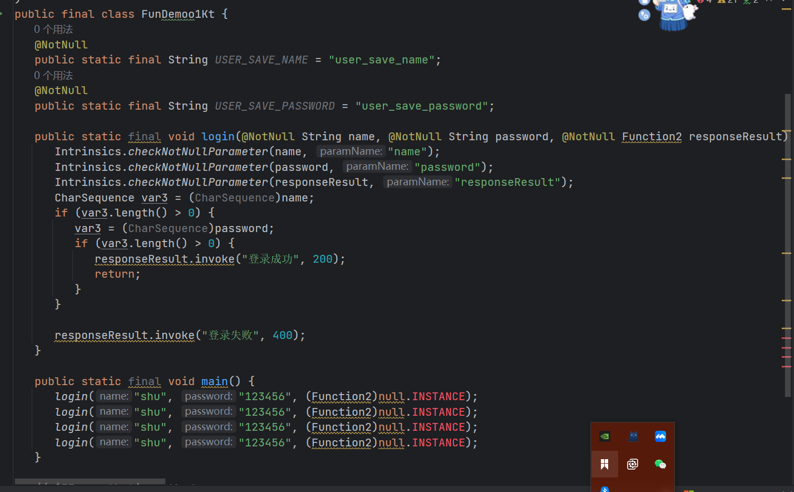
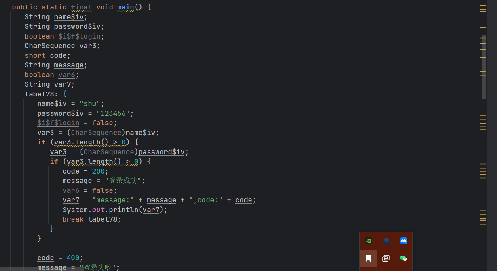
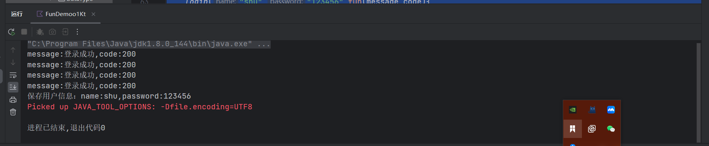
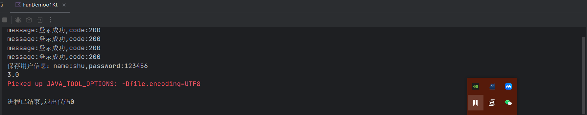

# 一 Lambda表达式
## 1.1 Lambda表达式的基本语法
```kotlin
{参数列表 -> 函数体}
```
下面我们以登录功能为例，来看一下Lambda表达式的使用：
```kotlin
package 函数

/**
 * @description:
 * @author: shu
 * @createDate: 2023/8/6 16:11
 * @version: 1.0
 */

const val USER_SAVE_NAME = "user_save_name"
const val USER_SAVE_PASSWORD = "user_save_password"


// 解读： responseResult:(String, Int) -> Unit
// 就这相当于在Java的回调接口：public interface ResponseResult{
//    void onResult(String message,int code);
// }
// 但是在kotlin中，我们可以直接使用函数类型来代替接口

/**
 * 登录
 * @param name 用户名
 * @param password 密码
 * @param responseResult 接口回调
 */
fun login(name: String, password: String, responseResult: (String, Int) -> Unit) {
    // 不为null
    if (name.isNotEmpty() && password.isNotEmpty()) {
        // 登录成功
        responseResult("登录成功", 200)
    } else {
        // 登录失败
        responseResult("登录失败", 400)
    }
}


fun main(){
    login("shu","123456"){message,code->
        println("message:$message,code:$code")
    }

    login("shu","123456",{message,code->
        println("message:$message,code:$code")
    })

    login("shu","123456",fun(message,code){
        println("message:$message,code:$code")
    })

    login("shu","123456",responseResult={
        message,code->
        println("message:$message,code:$code")
    })

}
```
在这里我们可以看到，我们使用Lambda表达式的时候，我们可以直接使用函数类型来代替接口，这样就可以省去我们定义接口的麻烦，而且代码也更加简洁。

下面是我们在Java中使用接口的方式：
```java
package 函数;

/**
 * @description: Java中使用接口的方式来实现回调函数的功能
 * @createDate: 2023/8/6 16:11
 * @version: 1.0
 */

interface ResponseResult{
    void onResult(String message,int code);
}

```

```java

package 函数;

/**
 * @description: Java中使用接口的方式来实现回调函数的功能
 * @createDate: 2023/8/6 16:11
 * @version: 1.0
 */

public class JavaTest {
    public static void main(String[] args) {
        login("shu","123456", new ResponseResult() {
            @Override
            public void onResult(String message, int code) {
                System.out.println("message:"+message+",code:"+code);
            }
        });
    }

    /**
     * 登录
     * @param name 用户名
     * @param password 密码
     * @param responseResult 接口回调
     */
    public static void login(String name, String password, ResponseResult responseResult){
        // 不为null
        if (name != null && password != null) {
            // 登录成功
            responseResult.onResult("登录成功", 200);
        } else {
            // 登录失败
            responseResult.onResult("登录失败", 400);
        }
    }

}

```

## 1.2 内联函数
在Kotlin中，我们可以使用内联函数来提高Lambda表达式的性能，下面我们来看一下内联函数的使用：
```kotlin
package 函数

/**
 * @description: 内联函数的使用
 * @createDate: 2023/8/6 16:11
 * @version: 1.0
 */

const val USER_SAVE_NAME = "user_save_name"
const val USER_SAVE_PASSWORD = "user_save_password"


// 解读： responseResult:(String, Int) -> Unit
// 就这相当于在Java的回调接口：public interface ResponseResult{
//    void onResult(String message,int code);
// }
// 但是在kotlin中，我们可以直接使用函数类型来代替接口

/**
 * 登录
 * @param name 用户名
 * @param password 密码
 * @param responseResult 接口回调
 */
inline fun login(name: String, password: String, responseResult: (String, Int) -> Unit) {
    // 不为null
    if (name.isNotEmpty() && password.isNotEmpty()) {
        // 登录成功
        responseResult("登录成功", 200)
    } else {
        // 登录失败
        responseResult("登录失败", 400)
    }
}

```
- 在上面的代码中，我们可以看到，我们在login函数前面加上了inline关键字，这样就可以将login函数变成内联函数了。
- 作用：内联函数的作用就是将函数调用的地方直接替换成函数体，这样就可以减少函数调用的开销，提高程序的性能。
- 如果此函数没有使用inline关键字，那么我们在调用login函数的时候，会将login函数的函数体复制到调用的地方，这样就会增加代码的体积，但是会减少函数调用的开销。

未使用inline之前反编译



使用inline之后反编译


我们可以发现，使用inline之后，login函数的函数体被复制到了调用的地方，这样就减少了函数调用的开销。

## 1.3 函数的引用
- 在Kotlin中，我们可以使用::来引用一个函数，这样就可以将函数作为参数传递给另一个函数。
- 案例
```kotlin
package 函数

import Class.User.name
import sun.security.jgss.GSSUtil.login

/**
 * @description:
 * @author: shu
 * @createDate: 2023/8/6 16:11
 * @version: 1.0
 */

const val USER_SAVE_NAME = "user_save_name"
const val USER_SAVE_PASSWORD = "user_save_password"


// 解读： responseResult:(String, Int) -> Unit
// 就这相当于在Java的回调接口：public interface ResponseResult{
//    void onResult(String message,int code);
// }
// 但是在kotlin中，我们可以直接使用函数类型来代替接口

/**
 * 登录
 * @param name 用户名
 * @param password 密码
 * @param responseResult 接口回调
 */
inline fun login(name: String, password: String, responseResult: (String, Int) -> Unit) {
    // 不为null
    if (name.isNotEmpty() && password.isNotEmpty()) {
        // 登录成功
        responseResult("登录成功", 200)
    } else {
        // 登录失败
        responseResult("登录失败", 400)
    }
}


/**
 * 保存用户信息
 * @param name 用户名
 * @param password 密码
 */

fun saveUserInfo(name: String, password: String) {
    println("保存用户信息：name:$name,password:$password")
}


fun main(){
    login("shu","123456"){message,code->
        println("message:$message,code:$code")
    }

    login("shu","123456",{message,code->
        println("message:$message,code:$code")
    })

    login("shu","123456",fun(message,code){
        println("message:$message,code:$code")
    })

    login("shu","123456",responseResult={
        message,code->
        println("message:$message,code:$code")
    })

    // 函数对象的引用
    val saveUserInfo = ::saveUserInfo

    saveUserInfo("shu","123456")

}
```


## 1.4 函数作为返回值
- 在Kotlin中，我们可以将函数作为返回值，这样就可以实现函数的嵌套调用。
- 案例
```kotlin
package 函数

import Class.User.name
import sun.security.jgss.GSSUtil.login
import java.lang.Double.sum

/**
 * @description:
 * @author: shu
 * @createDate: 2023/8/6 16:11
 * @version: 1.0
 */

const val USER_SAVE_NAME = "user_save_name"
const val USER_SAVE_PASSWORD = "user_save_password"


// 解读： responseResult:(String, Int) -> Unit
// 就这相当于在Java的回调接口：public interface ResponseResult{
//    void onResult(String message,int code);
// }
// 但是在kotlin中，我们可以直接使用函数类型来代替接口

/**
 * 登录
 * @param name 用户名
 * @param password 密码
 * @param responseResult 接口回调
 */
inline fun login(name: String, password: String, responseResult: (String, Int) -> Unit) {
    // 不为null
    if (name.isNotEmpty() && password.isNotEmpty()) {
        // 登录成功
        responseResult("登录成功", 200)
    } else {
        // 登录失败
        responseResult("登录失败", 400)
    }
}


/**
 * 保存用户信息
 * @param name 用户名
 * @param password 密码
 */

fun saveUserInfo(name: String, password: String) {
    println("保存用户信息：name:$name,password:$password")
}

/**
 * 测试函数返回函数
 */
fun testFunReturnFun(): (Double, Double) -> Double {
    return ::sum
}


fun main(){
    login("shu","123456"){message,code->
        println("message:$message,code:$code")
    }

    login("shu","123456",{message,code->
        println("message:$message,code:$code")
    })

    login("shu","123456",fun(message,code){
        println("message:$message,code:$code")
    })

    login("shu","123456",responseResult={
        message,code->
        println("message:$message,code:$code")
    })

    // 函数对象的引用
    val saveUserInfo = ::saveUserInfo

    saveUserInfo("shu","123456")

    // 函数返回函数

    val sum = testFunReturnFun()
    println(sum(1.0,2.0))

}
```



# 