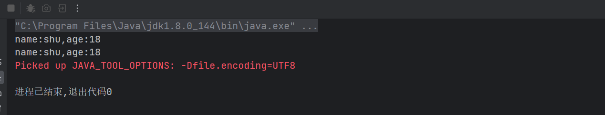

# 一 Lambda表达式
## 1.1 Lambda表达式的基本语法

Lambda表达式是`Kotlin`编程语言中的一个重要特性，它使得函数可以像数据一样被传递，这对于函数式编程和简化代码非常有用。Lambda表达式通常用于在函数的参数中定义匿名函数。

在`Kotlin`中，`Lambda`表达式的一般语法如下：

```
{ 参数列表 -> 函数体 }
```

其中，参数列表是一个由参数名称和参数类型组成的列表，用于定义Lambda表达式的参数。函数体是Lambda表达式要执行的代码块。

以下是一个简单的示例，演示如何在`Kotlin`中使用`Lambda`表达式：

```kotlin
fun main() {
    // Lambda表达式作为参数传递给函数
    val result = calculate(5, 10) { a, b -> a + b }
    println("Result: $result")
}

fun calculate(a: Int, b: Int, operation: (Int, Int) -> Int): Int {
    return operation(a, b)
}
```

在这个例子中，`calculate`函数接受三个参数：`a`和`b`是整数，`operation`是一个接受两个整数并返回一个整数的Lambda表达式。在`main`函数中，我们传递了一个Lambda表达式 `{ a, b -> a + b }` 作为 `operation` 参数，它表示将`a`和`b`相加的操作。

执行此程序将输出：

```
Result: 15
```

这是因为Lambda表达式 `{ a, b -> a + b }` 在`calculate`函数内部被执行，将传递的参数相加并返回结果。

除了使用显式的参数名称（例如`a`和`b`），你还可以使用特殊的默认参数名称`it`，当Lambda表达式只有一个参数时，`it`可以代替该参数。以下是一个使用`it`的示例：

```kotlin
fun main() {
    val numbers = listOf(1, 2, 3, 4, 5)

    // 使用Lambda表达式筛选出偶数
    val evenNumbers = numbers.filter { it % 2 == 0 }
    println(evenNumbers) // 输出: [2, 4]
}
```

在这个例子中，`filter`函数接受一个Lambda表达式，它将对列表中的每个元素进行检查，`it`代表当前元素。我们使用Lambda表达式`{ it % 2 == 0 }`筛选出了列表中的偶数。

Lambda表达式使得在Kotlin中编写简洁、灵活且易读的代码变得更加容易。它们在集合操作、回调处理和事件监听等场景下特别有用。

下面我们以登录功能为例，来看一下Lambda表达式的使用：
```kotlin
package 函数

/**
 * @description:
 * @author: shu
 * @createDate: 2023/8/6 16:11
 * @version: 1.0
 */

const val USER_SAVE_NAME = "user_save_name"
const val USER_SAVE_PASSWORD = "user_save_password"


// 解读： responseResult:(String, Int) -> Unit
// 就这相当于在Java的回调接口：public interface ResponseResult{
//    void onResult(String message,int code);
// }
// 但是在kotlin中，我们可以直接使用函数类型来代替接口

/**
 * 登录
 * @param name 用户名
 * @param password 密码
 * @param responseResult 接口回调
 */
fun login(name: String, password: String, responseResult: (String, Int) -> Unit) {
    // 不为null
    if (name.isNotEmpty() && password.isNotEmpty()) {
        // 登录成功
        responseResult("登录成功", 200)
    } else {
        // 登录失败
        responseResult("登录失败", 400)
    }
}


fun main(){
    login("shu","123456"){message,code->
        println("message:$message,code:$code")
    }

    login("shu","123456",{message,code->
        println("message:$message,code:$code")
    })

    login("shu","123456",fun(message,code){
        println("message:$message,code:$code")
    })

    login("shu","123456",responseResult={
        message,code->
        println("message:$message,code:$code")
    })

}
```
在这里我们可以看到，我们使用Lambda表达式的时候，我们可以直接使用函数类型来代替接口，这样就可以省去我们定义接口的麻烦，而且代码也更加简洁。

下面是我们在Java中使用接口的方式：
```java
package 函数;

/**
 * @description: Java中使用接口的方式来实现回调函数的功能
 * @createDate: 2023/8/6 16:11
 * @version: 1.0
 */

interface ResponseResult{
    void onResult(String message,int code);
}

```

```java

package 函数;

/**
 * @description: Java中使用接口的方式来实现回调函数的功能
 * @createDate: 2023/8/6 16:11
 * @version: 1.0
 */

public class JavaTest {
    public static void main(String[] args) {
        login("shu","123456", new ResponseResult() {
            @Override
            public void onResult(String message, int code) {
                System.out.println("message:"+message+",code:"+code);
            }
        });
    }

    /**
     * 登录
     * @param name 用户名
     * @param password 密码
     * @param responseResult 接口回调
     */
    public static void login(String name, String password, ResponseResult responseResult){
        // 不为null
        if (name != null && password != null) {
            // 登录成功
            responseResult.onResult("登录成功", 200);
        } else {
            // 登录失败
            responseResult.onResult("登录失败", 400);
        }
    }

}

```

## 1.2 内联函数

在Kotlin中，内联函数（Inline Functions）是一种特殊类型的函数，它在被调用的地方直接将函数体的代码插入到调用处，而不是通过普通的函数调用进行调用。这样的优化可以减少函数调用的开销，特别是对于一些高阶函数和Lambda表达式的使用，使得代码在执行时更加高效。

内联函数的声明使用关键字`inline`，在函数定义时加上`inline`关键字即可将该函数定义为内联函数。

在`Kotlin`中，我们可以使用内联函数来提高Lambda表达式的性能，下面我们来看一下内联函数的使用：
```kotlin
package 函数

/**
 * @description: 内联函数的使用
 * @createDate: 2023/8/6 16:11
 * @version: 1.0
 */

const val USER_SAVE_NAME = "user_save_name"
const val USER_SAVE_PASSWORD = "user_save_password"


// 解读： responseResult:(String, Int) -> Unit
// 就这相当于在Java的回调接口：public interface ResponseResult{
//    void onResult(String message,int code);
// }
// 但是在kotlin中，我们可以直接使用函数类型来代替接口

/**
 * 登录
 * @param name 用户名
 * @param password 密码
 * @param responseResult 接口回调
 */
inline fun login(name: String, password: String, responseResult: (String, Int) -> Unit) {
    // 不为null
    if (name.isNotEmpty() && password.isNotEmpty()) {
        // 登录成功
        responseResult("登录成功", 200)
    } else {
        // 登录失败
        responseResult("登录失败", 400)
    }
}

```
- 在上面的代码中，我们可以看到，我们在login函数前面加上了inline关键字，这样就可以将login函数变成内联函数了。
- 作用：内联函数的作用就是将函数调用的地方直接替换成函数体，这样就可以减少函数调用的开销，提高程序的性能。
- 如果此函数没有使用`inline`关键字，那么我们在调用login函数的时候，会将login函数的函数体复制到调用的地方，这样就会增加代码的体积，但是会减少函数调用的开销。

未使用`inline`之前反编译


使用`inline`之后反编译


我们可以发现，使用`inline`之后，login函数的函数体被复制到了调用的地方，这样就减少了函数调用的开销。

## 1.3 函数的引用

在Kotlin中，函数引用是一种允许你将函数作为值传递和存储的特性。它允许你直接访问现有函数的引用，而不是通过Lambda表达式来表示函数的调用。函数引用提供了一种更简洁和直观的方式来处理函数作为参数、返回值或者存储在变量中的情况。

在Kotlin中，有三种类型的函数引用：

1. 顶层函数引用：引用顶层函数（不属于任何类或对象）。
2. 成员函数引用：引用类的成员函数。
3. 局部函数引用：引用局部函数（在函数内部定义的函数）。

函数引用的语法使用双冒号`::`，后跟函数的名称。

- 在Kotlin中，我们可以使用::来引用一个函数，这样就可以将函数作为参数传递给另一个函数。
- 案例
```kotlin
package 函数

import Class.User.name
import sun.security.jgss.GSSUtil.login

/**
 * @description:
 * @author: shu
 * @createDate: 2023/8/6 16:11
 * @version: 1.0
 */

const val USER_SAVE_NAME = "user_save_name"
const val USER_SAVE_PASSWORD = "user_save_password"


// 解读： responseResult:(String, Int) -> Unit
// 就这相当于在Java的回调接口：public interface ResponseResult{
//    void onResult(String message,int code);
// }
// 但是在kotlin中，我们可以直接使用函数类型来代替接口

/**
 * 登录
 * @param name 用户名
 * @param password 密码
 * @param responseResult 接口回调
 */
inline fun login(name: String, password: String, responseResult: (String, Int) -> Unit) {
    // 不为null
    if (name.isNotEmpty() && password.isNotEmpty()) {
        // 登录成功
        responseResult("登录成功", 200)
    } else {
        // 登录失败
        responseResult("登录失败", 400)
    }
}


/**
 * 保存用户信息
 * @param name 用户名
 * @param password 密码
 */

fun saveUserInfo(name: String, password: String) {
    println("保存用户信息：name:$name,password:$password")
}


fun main(){
    login("shu","123456"){message,code->
        println("message:$message,code:$code")
    }

    login("shu","123456",{message,code->
        println("message:$message,code:$code")
    })

    login("shu","123456",fun(message,code){
        println("message:$message,code:$code")
    })

    login("shu","123456",responseResult={
        message,code->
        println("message:$message,code:$code")
    })

    // 函数对象的引用
    val saveUserInfo = ::saveUserInfo

    saveUserInfo("shu","123456")

}
```


## 1.4 函数作为返回值

在Kotlin中，函数可以作为返回值。这是函数式编程的一个重要概念，允许函数返回另一个函数。通过将函数作为返回值，你可以创建更加灵活和可复用的代码结构。

以下是一个简单的示例，展示了如何在Kotlin中使用函数作为返回值：

```kotlin
fun getOperationFunction(operator: String): (Int, Int) -> Int {
    return when (operator) {
        "+" -> { a, b -> a + b }
        "-" -> { a, b -> a - b }
        "*" -> { a, b -> a * b }
        "/" -> { a, b -> a / b }
        else -> throw IllegalArgumentException("Unknown operator: $operator")
    }
}

fun main() {
    val addFunction = getOperationFunction("+")
    val subtractFunction = getOperationFunction("-")

    val result1 = addFunction(5, 3) // 结果: 8
    val result2 = subtractFunction(10, 6) // 结果: 4

    println("Result1: $result1")
    println("Result2: $result2")
}
```

在上面的例子中，我们定义了一个名为`getOperationFunction`的函数，它接受一个字符串参数`operator`，并返回一个接受两个整数并返回一个整数的函数。在`main`函数中，我们通过调用`getOperationFunction`函数获得了加法和减法的函数，然后使用这些函数来执行相应的操作。

输出结果为：

```
Result1: 8
Result2: 4
```

- 在Kotlin中，我们可以将函数作为返回值，这样就可以实现函数的嵌套调用。
- 案例
```kotlin
package 函数

import Class.User.name
import sun.security.jgss.GSSUtil.login
import java.lang.Double.sum

/**
 * @description:
 * @author: shu
 * @createDate: 2023/8/6 16:11
 * @version: 1.0
 */

const val USER_SAVE_NAME = "user_save_name"
const val USER_SAVE_PASSWORD = "user_save_password"


// 解读： responseResult:(String, Int) -> Unit
// 就这相当于在Java的回调接口：public interface ResponseResult{
//    void onResult(String message,int code);
// }
// 但是在kotlin中，我们可以直接使用函数类型来代替接口

/**
 * 登录
 * @param name 用户名
 * @param password 密码
 * @param responseResult 接口回调
 */
inline fun login(name: String, password: String, responseResult: (String, Int) -> Unit) {
    // 不为null
    if (name.isNotEmpty() && password.isNotEmpty()) {
        // 登录成功
        responseResult("登录成功", 200)
    } else {
        // 登录失败
        responseResult("登录失败", 400)
    }
}


/**
 * 保存用户信息
 * @param name 用户名
 * @param password 密码
 */

fun saveUserInfo(name: String, password: String) {
    println("保存用户信息：name:$name,password:$password")
}

/**
 * 测试函数返回函数
 */
fun testFunReturnFun(): (Double, Double) -> Double {
    return ::sum
}


fun main(){
    login("shu","123456"){message,code->
        println("message:$message,code:$code")
    }

    login("shu","123456",{message,code->
        println("message:$message,code:$code")
    })

    login("shu","123456",fun(message,code){
        println("message:$message,code:$code")
    })

    login("shu","123456",responseResult={
        message,code->
        println("message:$message,code:$code")
    })

    // 函数对象的引用
    val saveUserInfo = ::saveUserInfo

    saveUserInfo("shu","123456")

    // 函数返回函数

    val sum = testFunReturnFun()
    println(sum(1.0,2.0))

}
```


## 1.5 匿名函数与具名函数

在`Kotlin`中，函数可以分为匿名函数和具名函数。

1. 具名函数：
具名函数就是我们通常所定义的普通函数，使用`fun`关键字来声明并命名函数。具名函数具有一个函数名称和函数体，可以通过函数名称直接调用。

```kotlin
fun add(a: Int, b: Int): Int {
    return a + b
}
```

在上面的示例中，`add`是一个具名函数，它接受两个整数参数 `a` 和 `b`，并返回它们的和。

2. 匿名函数：
匿名函数是没有函数名称的函数，它通常用于作为函数的参数传递。在匿名函数中，我们使用`fun`关键字来声明函数，但没有为函数指定名称，因此称为匿名函数。

匿名函数可以像Lambda表达式一样传递给接受函数作为参数的函数。与Lambda表达式相比，匿名函数的主要区别在于它具有显式的参数声明，而不使用`it`关键字。

以下是一个使用匿名函数的示例：

```kotlin
fun main() {
    val add: (Int, Int) -> Int = fun(a: Int, b: Int): Int {
        return a + b
    }

    val result = add(3, 5)
    println("Result: $result")
}
```

在上面的示例中，我们声明了一个名为`add`的匿名函数，并将其赋值给变量。该匿名函数接受两个整数参数，并返回它们的和。

```kotlin
package 函数

/**
 * @description: 匿名函数与具名函数的区别
 * @author: shu
 * @createDate: 2023/8/6 19:54
 * @version: 1.0
 */

inline fun showPerson(name: String, age: Int, showResult: (String) -> Unit) {
   val result = "name:$name,age:$age"
    showResult(result)
}


fun showPersonImpl(result: String) {
    println(result)
}


fun main(args: Array<String>) {
    // 匿名函数
    showPerson("shu", 18) { result ->
        println(result)
    }
    // 具名函数
    showPerson("shu", 18, ::showPersonImpl)

}
```


