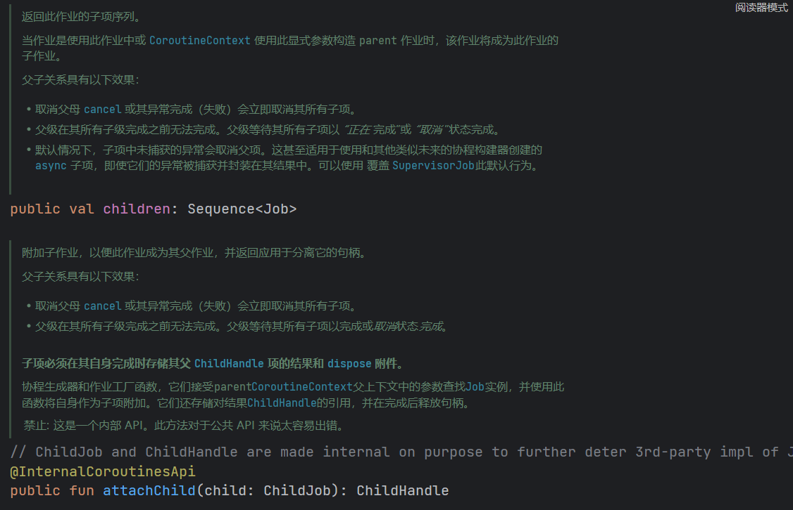

:::info

参考网站：https://www.kotlincn.net/docs/reference/coroutines/basics.html

参考文章：https://juejin.cn/post/7018380135103463438#heading-18

:::

# 一 结构化并发
什么是结构化并发，简单来说就是带有结构和层级的并发，这里的结构和层次指的就是协程的父子关系，而并发操作指的就是前一篇文章我们所说的cancel等操作。(简单理解：结构化并发就是协程的父子关系)
## 1.1 父子协程

:::sussess

子协程的生命周期受父协程的影响，父协程取消，子协程也会取消
当一个协程被其它协程在 CoroutineScope 中启动的时候， 它将通过 CoroutineScope.coroutineContext 来承袭上下文，并且这个新协程的 Job 将会成为父协程作业的 子 作业。当一个父协程被取消的时候，所有它的子协程也会被递归的取消。

:::

- 案例
```kotlin
package model

import kotlinx.coroutines.delay
import kotlinx.coroutines.launch
import kotlinx.coroutines.runBlocking

/**
 * @description:
 * @author: shu
 * @createDate: 2023/8/14 9:34
 * @version: 1.0
 */

// 结构化并发
fun main() = runBlocking {
    val parentJob = launch {
        val child1 = launch {
            println("子协程1执行")
            delay(1000)
            println("子协程1完成")
        }

        val child2 = launch {
            println("子协程2执行")
            delay(1500)
            println("子协程2完成")
        }

        // 等待所有子协程完成
        joinAll(child1, child2)
        println("所有子协程完成")
    }

    parentJob.join()
    println("父协程完成")
}

// 测试
fun main() {
    println("main: Now I can quit.")
    main
}


```

- 从源码的角度看



可以看到**每个Job对象都会有一个`children`属性**，它的类型是`Sequence`，是一个惰性集合

在 Kotlin 协程中，如果你在一个协程内部使用 `launch` 或 `async` 函数来创建新的协程，那么新的协程会成为当前协程的子协程。这种关系会在协程的取消操作中起作用。当父协程被取消时，所有的子协程也会被自动取消，从而避免内存泄漏和资源浪费。

# 二 关键字

## 2.1 suspend(挂起函数)

:::sussess

- 挂起函数，是指把协程代码挂起不继续执行的函数，也叫协程被函数挂起了。协程中调用挂起函数时，协程所在的线程不会挂起也不会阻塞，但是协程被挂起了。

- 也就是说，协程内挂起函数之后的代码停止执行了，直到挂起函数完成后恢复协程，协程才继续执行后续的代码。所有挂起函数都会通过`suspend`修饰符修饰。

:::

`suspend` 关键字是 Kotlin 编程语言中的一个重要概念。由于您的用户配置文件是 "你是Java代码辅助开发"，因此我假设您对 Java 有一些了解。`suspend` 关键字用于在 Kotlin 协程中声明挂起函数，这是一种异步编程的技术，类似于 Java 中的多线程。Kotlin 协程允许您以一种更加顺畅和可读性更高的方式处理异步操作。

在 Kotlin 中，当您在函数声明前加上 `suspend` 关键字时，您就创建了一个挂起函数。挂起函数可以在不阻塞主线程的情况下暂停执行，等待一些耗时的操作完成。这使得编写异步代码更加容易，而不需要显式地创建线程或处理复杂的回调。

以下是一个简单的示例，展示了如何在 Kotlin 中使用 `suspend` 关键字来定义一个挂起函数：

```kotlin
import kotlinx.coroutines.*

suspend fun fetchDataFromNetwork(): String {
    delay(1000) // 模拟耗时操作
    return "Data from network"
}

fun main() {
    // 启动一个协程
    GlobalScope.launch {
        println("Fetching data...")
        val data = fetchDataFromNetwork()
        println("Data received: $data")
    }

    // 阻塞主线程，以便协程有足够的时间执行
    Thread.sleep(2000)
}
```

在上面的例子中，`fetchDataFromNetwork` 函数使用 `suspend` 关键字声明，允许它在内部使用 `delay` 函数来模拟耗时的网络请求。协程可以通过 `launch` 函数在后台执行，而主线程则不会被阻塞。

总而言之，`suspend` 关键字是 Kotlin 协程中的一个关键概念，用于声明挂起函数，以实现更加顺畅的异步编程。

# 三 协程上下文与调度器

## 3.1 协程上下文
:::sussess

协程总是运行在一些以 CoroutineContext 类型为代表的上下文中，它们被定义在了 Kotlin 的标准库里。
协程上下文是各种不同元素的集合。其中主元素是协程中的 Job， 我们在前面的文档中见过它以及它的调度器，而本文将对它进行介绍。

:::

协程的 CoroutineContext 是一个上下文对象，它持有协程的各种属性和元素。在 Kotlin 协程中，CoroutineContext 通常由多个元素组成，这些元素可以包括调度器（用于指定协程运行的线程或线程池）、异常处理器、协程名称等。CoroutineContext 在协程的生命周期中起着重要的作用，它会在协程的不同操作中传播和继承。

在协程代码中，你可以使用 `coroutineContext` 属性来获取当前协程的 CoroutineContext。例如：

```kotlin
import kotlinx.coroutines.*

fun main() = runBlocking {
    val context: CoroutineContext = coroutineContext
    println(context)
}
```

在上述代码中，`coroutineContext` 返回了当前协程的 CoroutineContext，它可能包含调度器、异常处理器等信息。

另外，你还可以使用 `plus` 和 `minus` 操作符来创建新的 CoroutineContext，以便在协程间传递不同的属性。例如：

```kotlin
import kotlinx.coroutines.*

fun main() = runBlocking {
    val customContext = coroutineContext + Dispatchers.IO
    launch(customContext) {
        // 这个协程将在 IO 线程上运行
        println("Running on ${Thread.currentThread().name}")
    }
}
```

在这个例子中，我们通过 `+ Dispatchers.IO` 将一个新的调度器添加到协程的 CoroutineContext 中，使得这个协程在 IO 线程上运行。

## 3.2 协程调度器

:::sussess

协程调度器用于确定协程在哪个线程或线程池中运行。协程调度器可以通过 CoroutineContext 的扩展属性来获取，例如 `coroutineContext[ContinuationInterceptor]`。

:::

```kotlin
public actual object Dispatchers {

    // 默认调度器
    @JvmStatic
    public actual val Default: CoroutineDispatcher = createDefaultDispatcher()
    // UI调度器
    @JvmStatic
    public actual val Main: MainCoroutineDispatcher get() = MainDispatcherLoader.dispatcher
    // 无限制调度器
    @JvmStatic
    public actual val Unconfined: CoroutineDispatcher = kotlinx.coroutines.Unconfined
    // IO调度器
    @JvmStatic
    public val IO: CoroutineDispatcher = DefaultScheduler.IO
}

```

Dispatchers中提供了4种类型调度器：

| 实现       | 类型     | 具体调度器                  | 解释                                                         |
| ---------- | -------- | --------------------------- | ------------------------------------------------------------ |
| Default    | 线 程 池 | DefaultScheduler/CommonPool | 协程内部实现的Excutor线程池，核心线程数和最大线程数依赖CPU数量，适用于计算类耗时任务调度,比如逻辑计算 |
| Main       | UI线程   | MainCoroutineDispatcher     | 通过MainLooper的handler来向主线程派发任务到主线程执行        |
| Unconfined | 直接执行 | Unconfined                  | 无指定派发线程，会根据运行时的上下文环境决定。               |
| IO         | 线程池   | LimitingDispatcher          | IO和Default共享线程池，但运行并发数不同，支持最大并行任务数，适用IO任务调度,比如读写文件，网络请求等 |

```kotlin
import kotlinx.coroutines.*

fun main() = runBlocking {
    launch {
        // 运行在父协程的上下文中，即 runBlocking 主协程
        println("main runBlocking      : I'm working in thread ${Thread.currentThread().name}")
    }
    launch(Dispatchers.Unconfined) {
        // 不受限的——将工作在主线程中
        println("Unconfined            : I'm working in thread ${Thread.currentThread().name}")
    }
    launch(Dispatchers.Default) {
        // 将会获取默认调度器
        println("Default               : I'm working in thread ${Thread.currentThread().name}")
    }
    launch(newSingleThreadContext("MyOwnThread")) {
        // 将使它获得一个新的线程
        println("newSingleThreadContext: I'm working in thread ${Thread.currentThread().name}")
    }
}
```

在上面的例子中，我们通过 `launch` 函数创建了 4 个协程，并分别指定了不同的调度器。其中，`Unconfined` 调度器将会在主线程中运行，而 `Default` 调度器将会在后台创建一个新的线程来运行。最后，`newSingleThreadContext` 调度器将会创建一个新的线程来运行协程。

## 3.3 协程作用域
::: success
CoroutineScope是什么？如果你觉得陌生，那么GlobalScope、lifecycleScope与viewModelScope相信就很熟悉了吧。它们都实现了CoroutineScope接口。
:::

`launch()` 是**CoroutineScope**的一个扩展函数，**CoroutineScope**简单来说就是协程的作用范围。`launch`方法有三个参数：**1.协程下上文CoroutineContext；2.协程启动模式CoroutineStart；3.协程体：** `block`是一个带接收者的函数字面量，接收者是**CoroutineScope**

| 作用域         | 意义                                             | 解释                                                         |
| -------------- | ------------------------------------------------ | ------------------------------------------------------------ |
| CoroutineScope | 创建协程的局部作用域                             | 局部协程作用域，可以指定派发器Dispatcher，并且通过调用返回的Job对象的cancel()方法，可以取消该scope下所有正在进行的任务 |
| GlobalScope    | 创建协程的全局作用域                             | 该API启动的协程为顶层协程，是个单例协程作用域，没有父任务，且该scope没有Job对象，所以无法对整个scope执行cancel()操作，所以需要手动管理内部的每个协程 |
| MainScope      | 创建协程的局部作用域，且指定Dispatcher.Main      | CoroutineScope和Dispatcher.Main组合的协程作用域，会指定派发到Dispatcher.Main中执行，可以通过调用返回的Job对象管理协程 |
| runBlocking    | 创建协程的局部作用域，且阻塞协程所在线程等待结果 | 局部协程作用域，可以指定派发器Dispatcher，会阻塞调用者所在的线程，直到协程内部返回结果。且该scope没有返回Job对象用于协程管理 |


