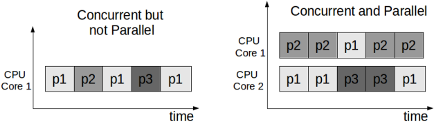
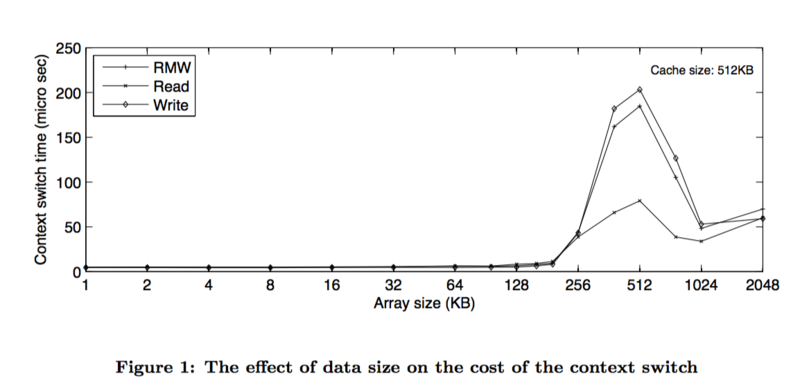
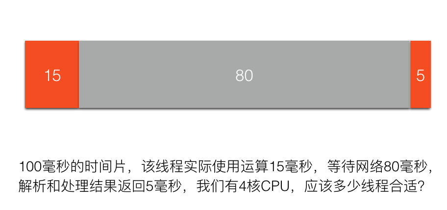
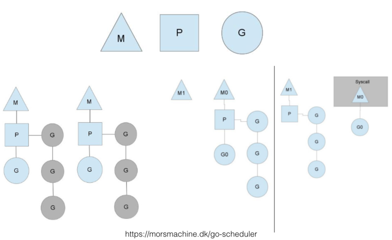

:::info

作者：`EasonShu`，转载请注明出处，一个小小的博客站，记录一些学习笔记，欢迎大家一起交流学习。

:::

# 一 协程的概述
:::info

我查看了网上的一些协程的资料，发现每个人对协程的概念都不一样，但是我认可的一种说法是：协程就是一种轻量级的线程框架（`Kotlin`），在我之前学到`Akka`框架，都是为了解决线程在高并发下能力不足的问题，这里参考了一下大神的文章《并发之痛 `Thread，Goroutine，Actor`》，也许你会有更深的理解。
文章地址：[并发之痛 Thread，Goroutine，Actor](https://jolestar.com/parallel-programming-model-thread-goroutine-actor/)

:::

## 1.1 并行与并发

- 并发（concurrency） 并发的关注点在于任务切分。举例来说，你是一个创业公司的CEO，开始只有你一个人，你一人分饰多角，一会做产品规划，一会写代码，一会见客户，虽然你不能见客户的同时写代码，但由于你切分了任务，分配了时间片，表现出来好像是多个任务一起在执行。
- 并行（parallelism） 并行的关注点在于同时执行。还是上面的例子，你发现你自己太忙了，时间分配不过来，于是请了工程师，产品经理，市场总监，各司一职，这时候多个任务可以同时执行了。
- 所以总结下，并发并不要求必须并行，可以用时间片切分的方式模拟，比如单核cpu上的多任务系统，并发的要求是任务能切分成独立执行的片段。而并行关注的是同时执行，必须是多（核）cpu，要能并行的程序必须是支持并发的。本文大多数情况下不会严格区分这两个概念，默认并发就是指并行机制下的并发。

## 1.2 线程

开始我们的程序是面向过程的，数据结构+`func`。后来有了面向对象，对象组合了数结构和`func`，我们想用模拟现实世界的方式，抽象出对象，有状态和行为。但无论是面向过程的`func`还是面向对象的`func`，本质上都是代码块的组织单元，本身并没有包含代码块的并发策略的定义。于是为了解决并发的需求，引入了Thread（线程）的概念。

**线程（Thread）**

1. 系统内核态，更轻量的进程
2. 由系统内核进行调度
3. 同一进程的多个线程可共享资源

- 线程的出现解决了两个问题，一个是GUI出现后急切需要并发机制来保证用户界面的响应。第二是互联网发展后带来的多用户问题。

-  最早的`CGI程`序很简单，将通过脚本将原来单机版的程序包装在一个进程里，来一个用户就启动一个进程。但明显这样承载不了多少用户，并且如果进程间需要共享资源还得通过进程间的通信机制，线程的出现缓解了这个问题。

- 线程的使用比较简单，如果你觉得这块代码需要并发，就把它放在单独的线程里执行，由系统负责调度，具体什么时候使用线程，要用多少个线程，由调用方决定，但定义方并不清楚调用方会如何使用自己的代码，很多并发问题都是因为误用导致的，比如Go中的map以及Java的`HashMap`都不是并发安全的，误用在多线程环境就会导致问题。另外也带来复杂度：

1. **竞态条件（race conditions）** 如果每个任务都是独立的，不需要共享任何资源，那线程也就非常简单。但世界往往是复杂的，总有一些资源需要共享，比如前面的例子，开发人员和市场人员同时需要和CEO商量一个方案，这时候CEO就成了竞态条件。
2. **依赖关系以及执行顺序** 如果线程之间的任务有依赖关系，需要等待以及通知机制来进行协调。比如前面的例子，如果产品和CEO讨论的方案依赖于市场和CEO讨论的方案，这时候就需要协调机制保证顺序。

为了解决上述问题，我们引入了许多复杂机制来保证：

- `Mutex(Lock)` （Go里的`sync`包, Java的`concurrent`包）通过互斥量来保护数据，但有了锁，明显就降低了并发度。
- `semaphore` 通过信号量来控制并发度或者作为线程间信号（`signal`）通知。
- `volatile` `Java`专门引入了`volatile`关键词来，来降低只读情况下的锁的使用。
- `compare-and-swap` 通过硬件提供的`CAS`机制保证原子性（`atomic`），也是降低锁的成本的机制。

如果说上面两个问题只是增加了复杂度，我们通过深入学习，严谨的`CodeReview`，全面的并发测试（比如Go语言中单元测试的时候加上-race参数），一定程度上能解决（当然这个也是有争议的，有论文认为当前的大多数并发程序没出问题只是并发度不够，如果CPU核数继续增加，程序运行的时间更长，很难保证不出问题）。但最让人头痛的还是下面这个问题：

> 系统里到底需要多少线程？

这个问题我们先从硬件资源入手，考虑下线程的成本：

- 内存（线程的栈空间）
  每个线程都需要一个栈（`Stack`）空间来保存挂起（`suspending`）时的状态。Java的栈空间（`64位VM`）默认是`1024k`，不算别的内存，只是栈空间，启动1024个线程就要`1G`内存。虽然可以用`-Xss`参数控制，但由于线程是本质上也是进程，系统假定是要长期运行的，栈空间太小会导致稍复杂的递归调用（比如复杂点的正则表达式匹配）导致栈溢出。所以调整参数治标不治本。

- 调度成本（`context-switch`）
  我在个人电脑上做的一个非严格测试，模拟两个线程互相唤醒轮流挂起，线程切换成本大约6000纳秒/次。这个还没考虑栈空间大小的影响。国外一篇论文专门分析线程切换的成本，基本上得出的结论是切换成本和栈空间使用大小直接相关。

  

- CPU使用率
  我们搞并发最主要的一个目标就是我们有了多核，想提高CPU利用率，最大限度的压榨硬件资源，从这个角度考虑，我们应该用多少线程呢？
  

  这个我们可以通过一个公式计算出来，100/(15+5)*4=20，用20个线程最合适。但一方面网络的时间不是固定的，另外一方面，如果考虑到其他瓶颈资源呢？比如锁，比如数据库连接池，就会更复杂。

作为一个1岁多孩子的父亲，认为这个问题的难度好比你要写个给孩子喂饭的程序，需要考虑『给孩子喂多少饭合适？』，这个问题有以下回答以及策略：

- 孩子不吃了就好了（但孩子贪玩，不吃了可能是想去玩了）
- 孩子吃饱了就好了（废话，你怎么知道孩子吃饱了？孩子又不会说话）
- 逐渐增量，长期观察，然后计算一个平均值（这可能是我们调整线程常用的策略，但增量增加到多少合适呢？）
- 孩子吃吐了就别喂了（如果用逐渐增量的模式，通过外部观察，可能会到达这个边界条件。系统性能如果因为线程的增加倒退了，就别增加线程了）
- 没控制好边界，把孩子给给撑坏了 （这熊爸爸也太恐怖了。但调整线程的时候往往不小心可能就把系统搞挂了）

通过这个例子我们可以看出，从外部系统来观察，或者以经验的方式进行计算，都是非常困难的。于是结论是：

> 让孩子会说话，吃饱了自己说，自己学会吃饭，自管理是最佳方案。

然并卵，计算机不会自己说话，如何自管理？

但我们从以上的讨论可以得出一个结论：

- 线程的成本较高（内存，调度）不可能大规模创建
- 应该由语言或者框架动态解决这个问题

**线程池方案**

------

`Java1.5`后，`Doug Lea`的`Executor`系列被包含在默认的`JDK`内，是典型的线程池方案。

线程池一定程度上控制了线程的数量，实现了线程复用，降低了线程的使用成本。但还是没有解决数量的问题，线程池初始化的时候还是要设置一个最小和最大线程数，以及任务队列的长度，自管理只是在设定范围内的动态调整。另外不同的任务可能有不同的并发需求，为了避免互相影响可能需要多个线程池，最后导致的结果就是`Java`的系统里充斥了大量的线程池。

## 1.3 新的思路

从前面的分析我们可以看出，如果线程是一直处于运行状态，我们只需设置和CPU核数相等的线程数即可，这样就可以最大化的利用CPU，并且降低切换成本以及内存使用。但如何做到这一点呢？

> 陈力就列，不能者止

这句话是说，能干活的代码片段就放在线程里，如果干不了活（需要等待，被阻塞等），就摘下来。通俗的说就是不要占着茅坑不拉屎，如果拉不出来，需要酝酿下，先把茅坑让出来，因为茅坑是稀缺资源。

要做到这点一般有两种方案：

1. `异步回调方案` 典型如`NodeJS`，遇到阻塞的情况，比如网络调用，则注册一个回调方法（其实还包括了一些上下文数据对象）给IO调度器（`linux`下是`libev`，调度器在另外的线程里），当前线程就被释放了，去干别的事情了。等数据准备好，调度器会将结果传递给回调方法然后执行，执行其实不在原来发起请求的线程里了，但对用户来说无感知。但这种方式的问题就是很容易遇到callback hell，因为所有的阻塞操作都必须异步，否则系统就卡死了。还有就是异步的方式有点违反人类思维习惯，人类还是习惯同步的方式。
2. `GreenThread/Coroutine/Fiber方案` 这种方案其实和上面的方案本质上区别不大，关键在于回调上下文的保存以及执行机制。为了解决回调方法带来的难题，这种方案的思路是写代码的时候还是按顺序写，但遇到IO等阻塞调用时，将当前的代码片段暂停，保存上下文，让出当前线程。等IO事件回来，然后再找个线程让当前代码片段恢复上下文继续执行，写代码的时候感觉好像是同步的，仿佛在同一个线程完成的，但实际上系统可能切换了线程，但对程序无感。

`GreenThread`

- 用户空间 首先是在用户空间，避免内核态和用户态的切换导致的成本。
- 由语言或者框架层调度
- 更小的栈空间允许创建大量实例（百万级别）

**几个概念**

- `Continuation `这个概念不熟悉`FP`编程的人可能不太熟悉，不过这里可以简单的顾名思义，可以理解为让我们的程序可以暂停，然后下次调用继续（`contine`）从上次暂停的地方开始的一种机制。相当于程序调用多了一种入口。
- `Coroutine `是`Continuation`的一种实现，一般表现为语言层面的组件或者类库。主要提供`yield`，`resume`机制。
- `Fiber` 和`Coroutine`其实是一体两面的，主要是从系统层面描述，可以理解成`Coroutine`运行之后的东西就是Fiber。

## 1.4 `Goroutine`

------

`Goroutine`其实就是前面`GreenThread`系列解决方案的一种演进和实现。

- 首先，它内置了`Coroutine`机制。因为要用户态的调度，必须有可以让代码片段可以暂停/继续的机制。
- 其次，它内置了一个调度器，实现了`Coroutine`的多线程并行调度，同时通过对网络等库的封装，对用户屏蔽了调度细节。
- 最后，提供了`Channel`机制，用于`Goroutine`之间通信，实现`CSP`并发模型（`Communicating Sequential Processes`）。
- 因为`Go`的`Channel`是通过语法关键词提供的，对用户屏蔽了许多细节。其实`Go`的`Channel`和`Java`中的`SynchronousQueue`是一样的机制，如果有buffer其实就是`ArrayBlockQueue`。

**Goroutine调度器**

这个图一般讲`Goroutine`调度器的地方都会引用，想要仔细了解的可以看看原博客。这里只说明几点：

1. M代表系统线程，P代表处理器（核），G代表`Goroutine`。Go实现了`M:N`的调度，也就是说线程和`Goroutine`之间是多对多的关系。这点在许多`GreenThread/Coroutine`的调度器并没有实现。比如`Java1.1`版本之前的线程其实是`GreenThread`（这个词就来源于Java），但由于没实现多对多的调度，也就是没有真正实现并行，发挥不了多核的优势，所以后来改成基于系统内核的Thread实现了。
2. 某个系统线程如果被阻塞，排列在该线程上的`Goroutine`会被迁移。当然还有其他机制，比如M空闲了，如果全局队列没有任务，可能会从其他M偷任务执行，相当于一种`rebalance`机制。这里不再细说，有需要看专门的分析文章。
3. 具体的实现策略和我们前面分析的机制类似。系统启动时，会启动一个独立的后台线程（不在`Goroutine`的调度线程池里），启动`netpoll`的轮询。当有`Goroutine`发起网络请求时，网络库会将`fd`（文件描述符）和`pollDesc`（用于描述`netpoll`的结构体，包含因为读/写这个`fd`而阻塞的`Goroutine`）关联起来，然后调用`runtime.gopark`方法，挂起当前的`Goroutine`。当后台的`netpoll`轮询获取到`epoll`（`linux`环境下）的event，会将event中的`pollDesc`取出来，找到关联的阻塞`Goroutine`，并进行恢复。

`Goroutine`是银弹么？

`Goroutine`很大程度上降低了并发的开发成本，是不是我们所有需要并发的地方直接`go func`就搞定了呢？

Go通过`Goroutine`的调度解决了CPU利用率的问题。但遇到其他的瓶颈资源如何处理？比如带锁的共享资源，比如数据库连接等。互联网在线应用场景下，如果每个请求都扔到一个`Goroutine`里，当资源出现瓶颈的时候，会导致大量的`Goroutine`阻塞，最后用户请求超时。这时候就需要用`Goroutine`池来进行控流，同时问题又来了：池子里设置多少个`Goroutine`合适？