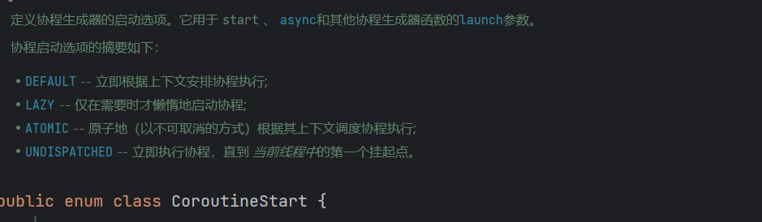
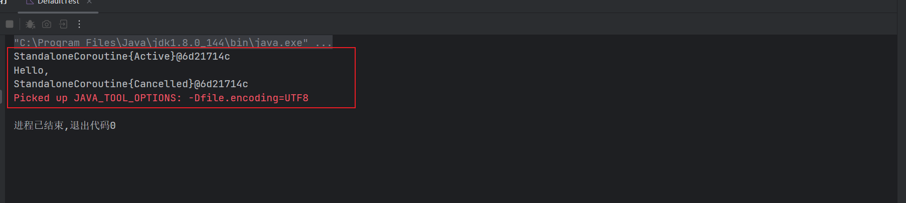
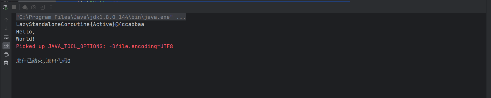
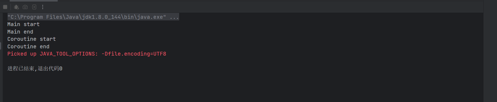
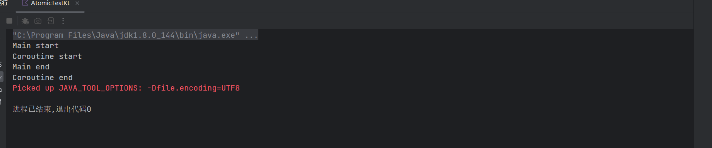
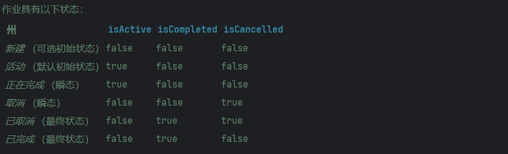
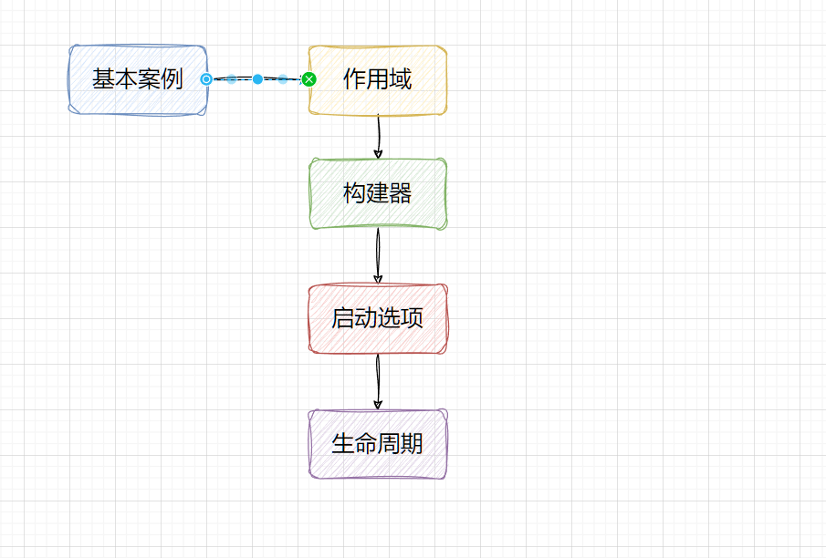

:::info

参考网站：https://www.kotlincn.net/docs/reference/coroutines/basics.html

:::

# 一 基本知识

回到我们的第一次编写代码，Hello，Word，也许我们在第一次初步认识的时候，发现这跟我们的线程好像没有好大的区别，但是在本质上是有很大的区别的

```kotlin
/**
 * @description:
 * @author: shu
 * @createDate: 2023/8/10 20:32
 * @version: 1.0
 */
import kotlinx.coroutines.*
import kotlin.concurrent.thread

@OptIn(DelicateCoroutinesApi::class)
fun main() {
    GlobalScope.launch {
        // 在后台启动一个新协程，并继续执行之后的代码
        delay(1000L)
        // 非阻塞式地延迟一秒
        println("World!")
        // 延迟结束后打印
    }
    println("Hello,")
    //主线程继续执行，不受协程 delay 所影响
    Thread.sleep(2000L)
// 主线程阻塞式睡眠2秒，以此来保证JVM存活
}

// 改用线程
//fun main() {
//    thread {
//        Thread.sleep(1000L)
//        println("World!")
//    }
//    println("Hello,")
//    Thread.sleep(2000L)
//}

```

本质上，协程是轻量级的线程。 它们在某些 [CoroutineScope](https://kotlin.github.io/kotlinx.coroutines/kotlinx-coroutines-core/kotlinx.coroutines/-coroutine-scope/index.html) 上下文中与 [launch](https://kotlin.github.io/kotlinx.coroutines/kotlinx-coroutines-core/kotlinx.coroutines/launch.html) *协程构建器* 一起启动。 这里我们在 [GlobalScope](https://kotlin.github.io/kotlinx.coroutines/kotlinx-coroutines-core/kotlinx.coroutines/-global-scope/index.html) 中启动了一个新的协程，这意味着新协程的生命周期只受整个应用程序的生命周期限制。

那我们先来看看CoroutineScope？

## 1.1 CoroutineScope 协程作用域

来看看官方解释：

Defines a scope for new coroutines. Every **coroutine builder** (like [launch](https://kotlinlang.org/api/kotlinx.coroutines/kotlinx-coroutines-core/kotlinx.coroutines/launch.html), [async](https://kotlinlang.org/api/kotlinx.coroutines/kotlinx-coroutines-core/kotlinx.coroutines/async.html), etc.) is an extension on [CoroutineScope](https://kotlinlang.org/api/kotlinx.coroutines/kotlinx-coroutines-core/kotlinx.coroutines/-coroutine-scope/index.html) and inherits its [coroutineContext](https://kotlinlang.org/api/kotlinx.coroutines/kotlinx-coroutines-core/kotlinx.coroutines/-coroutine-scope/coroutine-context.html) to automatically propagate all its elements and cancellation.

The best ways to obtain a standalone instance of the scope are CoroutineScope() and MainScope() factory functions, taking care to cancel these coroutine scopes when they are no longer needed (see section on custom usage below for explanation and example).

Kotlin 中的 `CoroutineScope` 是用于管理协程的上下文（Context）的接口。它定义了一些方法和属性，用于启动新的协程以及管理它们的生命周期。理解 `CoroutineScope` 可以帮助你更好地在 Kotlin 中使用协程。

在协程中，`CoroutineScope` 用于：

1. **启动协程：** 你可以通过调用 `launch`、`async` 等方法来在 `CoroutineScope` 内部启动新的协程。这些方法会自动将新协程添加到当前的协程作用域中。

2. **管理生命周期：** 协程的生命周期通常与其所属的 `CoroutineScope` 相关联。当 `CoroutineScope` 被取消时（例如，由于其父级协程的取消或手动调用 `cancel` 方法），该范围内的所有协程也会被取消。

3. **异常处理：** 通过 `CoroutineExceptionHandler`，你可以在 `CoroutineScope` 内部设置异常处理程序，以便在协程出现未捕获的异常时执行特定的操作。

4. **并发结构：** 使用 `CoroutineScope` 可以管理多个协程之间的并发关系。例如，你可以在一个作用域中启动多个协程，然后使用协程构建器（如 `async`）来协调它们的执行。

通常，`CoroutineScope` 可以通过直接实现接口或使用库中提供的构建器函数（如 `MainScope()`）来创建。在 Android 开发中，`ViewModel` 和 `Activity` 或 `Fragment` 通常是作为协程范围的好选择，因为它们的生命周期与协程的生命周期相匹配。

## 1.2 协程构建器

`Kotlin` 中的协程是一种轻量级的并发编程机制，它可以帮助你在异步任务中更简洁地处理并发操作。协程使用协程构建器来创建和启动协程。以下是一些常用的协程构建器：

1. `launch` 构建器：用于启动一个新的协程，不返回结果。

   ```kotlin
   GlobalScope.launch {
       // 协程代码块
   }
   ```

2. `async` 构建器：用于启动一个新的协程，可以返回一个 `Deferred` 对象，该对象可以在协程执行完成后获取结果。

   ```kotlin
   val result: Deferred<Int> = GlobalScope.async {
       // 协程代码块，返回一个整数结果
       42
   }
   ```

3. `runBlocking` 构建器：用于在阻塞的方式下启动一个新的协程，通常在 `main` 函数或测试中使用。

   ```kotlin
   runBlocking {
       // 协程代码块
   }
   ```

4. `withContext` 构建器：用于在指定的调度器上执行协程代码块，通常用于切换协程的上下文。

   ```kotlin
   val result = withContext(Dispatchers.IO) {
       // 在 IO 调度器上执行的协程代码块
       // 可以进行耗时的 IO 操作
       "Done"
   }
   ```

### 1.2.1 launch

-  源码

```kotlin
public fun CoroutineScope.launch(
    context: CoroutineContext = EmptyCoroutineContext,
    start: CoroutineStart = CoroutineStart.DEFAULT,
    block: suspend CoroutineScope.() -> Unit
): Job {
    val newContext = newCoroutineContext(context)
    val coroutine = if (start.isLazy)
        LazyStandaloneCoroutine(newContext, block) else
        StandaloneCoroutine(newContext, active = true)
    coroutine.start(start, coroutine, block)
    return coroutine
}
```

- 参数：
  - context：协程下下文，默认值：EmptyCoroutineContext
  - start：协程启动选项：默认值：DEFAULT
  - block：我们编写的协程需要执行代码块
- 返回值：Job对象，也叫做后台作业就是一个任务吧，后面我会详细介绍一下，当然通过源码你也能发现蛛丝马迹


- 接下来，无非就是如何创建一个JOB返回给我们呗，并启动一个JOB


- 返回值，我们可以看到它返回一个StandaloneCoroutine{Active}@77a567e1，我的猜想无非是Job的子类，而且有一个状态，那么我们可以改变他的状态吗？


- 好像可以的

```kotlin
/**
 * @description:
 * @author: shu
 * @createDate: 2023/8/10 20:32
 * @version: 1.0
 */
import kotlinx.coroutines.*
import kotlin.concurrent.thread

@OptIn(DelicateCoroutinesApi::class)
fun main() {
   val tem= GlobalScope.launch {
        // 在后台启动一个新协程，并继续执行之后的代码
        delay(1000L)
        // 非阻塞式地延迟一秒
        println("World!")
        // 延迟结束后打印
    }
    println(tem)
    // 改变协程的状态
    tem.cancel()
    // 打印
    println(tem)

    println("Hello,")
    //主线程继续执行，不受协程 delay 所影响
    Thread.sleep(2000L)
// 主线程阻塞式睡眠2秒，以此来保证JVM存活
}

// 改用线程
//fun main() {
//    thread {
//        Thread.sleep(1000L)
//        println("World!")
//    }
//    println("Hello,")
//    Thread.sleep(2000L)
//}

```


我们在想一下它肯定有一个生命周期的概念，或许他维护者一个状态，这个就是下一篇文章我们来探讨的，我们还是回到我们的主题，介绍协程构建器

### 1.2.2 async

- 测试代码

```kotlin
import kotlinx.coroutines.*

/**
 * @description:
 * @author: shu
 * @createDate: 2023/8/11 15:02
 * @version: 1.0
 */
class AsyncTest {
    companion object {
        @OptIn(DelicateCoroutinesApi::class, ExperimentalCoroutinesApi::class)
        @JvmStatic
        fun main(args: Array<String>) {
            // async 与 launch 的区别在于，async 会返回一个 Deferred 对象
            // 该对象可以通过 await() 方法来获取最终的计算结果
            val result: Deferred<String> = GlobalScope.async {
                delay(1000L)
                "World!"
            }
            println("Hello,")
            Thread.sleep(2000L)
            // 主线程阻塞式睡眠2秒，以此来保证JVM存活
            println(result.getCompleted())
        }
    }
}
```


- 源码

```kotlin
public fun <T> CoroutineScope.async(
    context: CoroutineContext = EmptyCoroutineContext,
    start: CoroutineStart = CoroutineStart.DEFAULT,
    block: suspend CoroutineScope.() -> T
): Deferred<T> {
    val newContext = newCoroutineContext(context)
    val coroutine = if (start.isLazy)
        LazyDeferredCoroutine(newContext, block) else
        DeferredCoroutine<T>(newContext, active = true)
    coroutine.start(start, coroutine, block)
    return coroutine
}
```

参数与上面的launch都是一样的最大的区别在于返回对象不就一样，Deferred


下面的创建我就不说了，与上面的大体过程一样，无非是创建的返回对象不一样罢了，那他可以终止不？

```kotlin
fun main() = runBlocking {
    val deferred = GlobalScope.async {
        // 协程代码块
        for (i in 1..10) {
            println("Step $i")
            delay(1000)
        }
        "Done"
    }
    // 等待一段时间，然后取消协程
    delay(5000)
    deferred.cancel()
    // 等待协程执行完成
    val result = deferred.await()
    println("Result: $result")
}
```


### 1.2.3 runBlocking

Runs a new coroutine and blocks the current thread interruptibly until its completion. This function should not be used from a coroutine. It is designed to bridge regular blocking code to libraries that are written in suspending style, to be used in main functions and in tests.

运行一个新的协程并且阻塞当前可中断的线程直至协程执行完成，该函数不应从一个协程中使用，该函数被设计用于桥接普通阻塞代码到以挂起风格（suspending style）编写的库，以用于主函数与测试。

```kotlin
import kotlinx.coroutines.*

/**
 * @description:
 * @author: shu
 * @createDate: 2023/8/11 15:28
 * @version: 1.0
 */

@OptIn(DelicateCoroutinesApi::class)
fun  main() = runBlocking {
    val job = GlobalScope.launch {
        // 在后台启动一个新协程，并继续执行之后的代码
        delay(1000L)
        // 非阻塞式地延迟一秒
        println("World!")
        // 延迟结束后打印
    }
    println("Hello,")
    //主线程继续执行，不受协程 delay 所影响
    Thread.sleep(2000L)
    // 主线程阻塞式睡眠2秒，以此来保证JVM存活
}
```

- 源码

```kotlin
@Throws(InterruptedException::class)
public actual fun <T> runBlocking(context: CoroutineContext, block: suspend CoroutineScope.() -> T): T {
    contract {
        callsInPlace(block, InvocationKind.EXACTLY_ONCE)
    }
    val currentThread = Thread.currentThread()
    val contextInterceptor = context[ContinuationInterceptor]
    val eventLoop: EventLoop?
    val newContext: CoroutineContext
    if (contextInterceptor == null) {
        // create or use private event loop if no dispatcher is specified
        eventLoop = ThreadLocalEventLoop.eventLoop
        newContext = GlobalScope.newCoroutineContext(context + eventLoop)
    } else {
        // See if context's interceptor is an event loop that we shall use (to support TestContext)
        // or take an existing thread-local event loop if present to avoid blocking it (but don't create one)
        eventLoop = (contextInterceptor as? EventLoop)?.takeIf { it.shouldBeProcessedFromContext() }
            ?: ThreadLocalEventLoop.currentOrNull()
        newContext = GlobalScope.newCoroutineContext(context)
    }
    val coroutine = BlockingCoroutine<T>(newContext, currentThread, eventLoop)
    coroutine.start(CoroutineStart.DEFAULT, coroutine, block)
    return coroutine.joinBlocking()
}
```

需要注意的是，`runBlocking` 主要用于测试和调试，或者在 `main` 函数中执行一些协程代码。在正式的应用程序中，通常更推荐使用其他协程构建器，如 `launch` 和 `async`，以更好地管理协程的作用域和并发执行。

### 1.2.4 withContext（常用）

`withContext` 是 Kotlin 协程库中的一个协程构建器，用于在指定的调度器上执行协程代码块。它在切换协程的上下文时非常有用，特别是在需要在不同的线程或调度器上执行代码块时。

```kotlin
import kotlinx.coroutines.Dispatchers
import kotlinx.coroutines.delay
import kotlinx.coroutines.withContext

/**
 * @description:
 * @author: shu
 * @createDate: 2023/8/11 15:56
 * @version: 1.0
 */

suspend fun main(){
    val result = withContext(Dispatchers.IO) {
        // 在 IO 调度器上执行的协程代码块
        // 可以进行耗时的 IO 操作
        "Done"
    }
    println(result)

}
```

模拟安卓请求更新

```kotlin
 private fun fetchData() {
        // 启动一个协程在后台线程执行网络请求
        GlobalScope.launch(Dispatchers.Main) {
            try {
                val result = withContext(Dispatchers.IO) {
                    // 模拟网络请求，实际应用中是执行实际的网络请求操作
                    simulateNetworkRequest()
                }
                // 在主线程上更新 UI
                updateUI(result)
            } catch (e: Exception) {
                // 处理异常
                updateUI("Error: ${e.message}")
            }
        }
    }

    private suspend fun simulateNetworkRequest(): String {
        // 模拟网络请求的延迟
        kotlinx.coroutines.delay(2000)
        return "Data from server"
    }

    private fun updateUI(data: String) {
        resultTextView.text = data
    }
```

- 源码

```kotlin
public suspend fun <T> withContext(
    context: CoroutineContext,
    block: suspend CoroutineScope.() -> T
): T {
    contract {
        callsInPlace(block, InvocationKind.EXACTLY_ONCE)
    }
    return suspendCoroutineUninterceptedOrReturn sc@ { uCont ->
        // compute new context
        val oldContext = uCont.context
        // Copy CopyableThreadContextElement if necessary
        val newContext = oldContext.newCoroutineContext(context)
        // always check for cancellation of new context
        newContext.ensureActive()
        // FAST PATH #1 -- new context is the same as the old one
        if (newContext === oldContext) {
            val coroutine = ScopeCoroutine(newContext, uCont)
            return@sc coroutine.startUndispatchedOrReturn(coroutine, block)
        }
        // FAST PATH #2 -- the new dispatcher is the same as the old one (something else changed)
        // `equals` is used by design (see equals implementation is wrapper context like ExecutorCoroutineDispatcher)
        if (newContext[ContinuationInterceptor] == oldContext[ContinuationInterceptor]) {
            val coroutine = UndispatchedCoroutine(newContext, uCont)
            // There are changes in the context, so this thread needs to be updated
            withCoroutineContext(coroutine.context, null) {
                return@sc coroutine.startUndispatchedOrReturn(coroutine, block)
            }
        }
        // SLOW PATH -- use new dispatcher
        val coroutine = DispatchedCoroutine(newContext, uCont)
        block.startCoroutineCancellable(coroutine, coroutine)
        coroutine.getResult()
    }
}
```

刚开始我也看不通，就留个印象吧，我们来看看他的调度器

- `Dispatchers.Default`：默认调度器。它使用JVM的共享线程池，该调度器的最大并发度是CPU的核心数，默认为2。
- `Dispatchers.Unconfined`：非受限调度器。该调度器不会限制代码在指定的线程上执行。即挂起函数后面的代码不会主动恢复到挂起之前的线程去执行，而是在执行挂起函数的线程上执行。
- `Dispatchers.IO`：IO调度器。它将阻塞的IO任务分流到一个共享的线程池中。该调度器和Dispatchers.Default共享线程。
- `Dispatchers.Main`：主线程调度器。一般用于操作与更新UI。
- 注意：`Dispatchers.Default`调度器和`Dispatchers.IO` 调度器分配的线程为守护线程。

## 1.3 启动模式

通过刚才的源码我们可以看到协程的启动模式中有其他设置，下面我们来看看区别



- `CoroutineStart.DEFAULT`：立即执行协程，可以随时取消。
- `CoroutineStart.LAZY`：创建一个协程，但不执行，在用户需要时手动触发执行。
- `CoroutineStart.ATOMIC`：立即执行协程，但在协程执行前无法取消。目前处于试验阶段。
- `CoroutineStart.UNDISPATCHED`：立即在当前线程执行协程，直到遇到第一个挂起。目前处于试验阶段。

### 1.3.1 DEFAULT

**DEFAULT**

```kotlin
package model

import kotlinx.coroutines.*

/**
 * @description: 指定协程启动模式为默认模式
 * @author: shu
 * @createDate: 2023/8/12 10:24
 * @version: 1.0
 */
class DefaultTest {
    companion object {
        @OptIn(DelicateCoroutinesApi::class)
        @JvmStatic
        fun main(args: Array<String>) {
          val result=  GlobalScope.launch(Dispatchers.Default, CoroutineStart.DEFAULT) {
                // 在后台启动一个新协程，并继续执行之后的代码
                delay(1000L)
                // 非阻塞式地延迟一秒
                println("World!")
                // 延迟结束后打印
            }
            println(result)
            // 取消
            result.cancel()
            println("Hello,")
            //主线程继续执行，不受协程 delay 所影响
            Thread.sleep(2000L)
            // 打印协程的状态
            println(result)
        }
    }
}
```



### 1.3.2 LAZY

```kotlin
package model

import kotlinx.coroutines.*

/**
 * @description: 指定协程启动模式为懒加载模式，只有在调用 start 或者 join 的时候才会真正启动协程
 * @author: shu
 * @createDate: 2023/8/12 10:34
 * @version: 1.0
 */
class LazyTest {
    companion object {
        @OptIn(DelicateCoroutinesApi::class)
        @JvmStatic
        fun main(args: Array<String>) {
            val result=  GlobalScope.launch(Dispatchers.Default, CoroutineStart.LAZY) {
                // 在后台启动一个新协程，并继续执行之后的代码
                delay(1000L)
                // 非阻塞式地延迟一秒
                println("World!")
                // 延迟结束后打印
            }
            // 需要手动启动
            result.start()
            println(result)
            println("Hello,")
            //主线程继续执行，不受协程 delay 所影响
            Thread.sleep(2000L)
        }
    }
}
```



### 1.3.3  ATOMIC

```kotlin
package model

import kotlinx.coroutines.*
import java.util.concurrent.atomic.AtomicInteger

/**
 * @description:
 * @author: shu
 * @createDate: 2023/8/12 10:37
 * @version: 1.0
 */
import kotlinx.coroutines.GlobalScope
import kotlinx.coroutines.delay
import kotlinx.coroutines.launch
import kotlinx.coroutines.runBlocking
import kotlinx.coroutines.CoroutineStart


@OptIn(DelicateCoroutinesApi::class, ExperimentalCoroutinesApi::class)
fun main() = runBlocking {
    println("Main start")
    val job = GlobalScope.launch(start = CoroutineStart.ATOMIC) {
        println("Coroutine start")
        delay(1000)
        println("Coroutine end")
    }
    println("Main end")
    job.join()
}
```

我们创建了一个协程，使用`CoroutineStart.ATOMIC`作为启动模式。`CoroutineStart.ATOMIC`启动模式确保协程在启动时不会被立即执行，而是等待其他协程或操作完成后再执行。



### 1.3.4 UNDISPATCHED

在 Kotlin 协程中，`UNDISPATCHED` 是一个用于启动模式的特殊常量。它表示在当前调用栈上立即启动协程，但不会进行调度。这意味着协程会立即执行，但不会被挂起，也不会在其他线程上运行，而是在当前调用的上下文中运行。

这个启动模式通常用于一些特定的场景，比如在调用协程的代码中进行同步调用，避免协程的挂起和线程切换开销，同时仍然能够利用协程的结构来组织异步代码。

以下是一个使用 `CoroutineStart.UNDISPATCHED` 的示例：

```kotlin
import kotlinx.coroutines.delay
import kotlinx.coroutines.launch
import kotlinx.coroutines.runBlocking
import kotlinx.coroutines.CoroutineStart

/**
 * @description:
 * @author: shu
 * @createDate: 2023/8/12 10:37
 * @version: 1.0
 */

fun main() = runBlocking {
    println("Main start")

    val job = launch(start = CoroutineStart.UNDISPATCHED) {
        println("Coroutine start")
        delay(1000)
        println("Coroutine end")
    }

    println("Main end")

    job.join()
}
```

协程使用了 `CoroutineStart.UNDISPATCHED` 启动模式。输出将会是：

```
Main start
Coroutine start
Main end
Coroutine end
```

可以看到，协程会立即启动，但是不会阻塞当前线程。由于协程使用了 `delay` 函数，它会在等待 1 秒后恢复执行。


### 1.3.5 总结

当选择协程的启动模式时，需要考虑代码的逻辑和需求，以便选择最合适的模式，下面对比一下不同的启动模式，以及它们在不同情况下的使用场景和优缺点。

1. **DEFAULT**:
   - **使用场景**：适用于大多数情况，不需要手动控制协程的启动时间和调度。
   - **优点**：自动处理协程的调度，适合通用的异步任务。
   - **缺点**：可能在某些情况下导致不必要的线程切换，不太适合需要精细控制的情况。

2. **LAZY**:

   - **使用场景**：适用于惰性初始化，只有在首次访问协程的属性时才需要启动。
   - **优点**：延迟协程的启动，减少不必要的协程创建和调度。
   - **缺点**：不适合需要立即执行的任务，首次访问可能引入一些延迟。

3. **ATOMIC**:

   - **使用场景**：适用于需要确保协程与其他操作有序执行的情况。
   - **优点**：确保协程的启动与其他操作的顺序一致，避免并发问题。
   - **缺点**：在启动时可能会引入一些等待时间，可能不适合实时性要求较高的任务。

4. **UNDISPATCHED**:

   - **使用场景**：适用于需要立即执行协程，但不希望进行线程切换的情况。
   - **优点**：立即在当前调用栈上执行协程，避免线程切换开销。
   - **缺点**：不适合长时间运行的任务，可能会阻塞调用栈。

## 1.4 Job的生命周期

上面我们可以看到协程的最小执行单位就是Job，而且我们发现其中他有状态的维护，下面我们来介绍一下他的生命周期吧，我们从源码中可以发现



状态的改变

```tex
                                     wait children
+-----+ start  +--------+ complete   +-------------+  finish  +-----------+
| New | -----> | Active | ---------> | Completing  | -------> | Completed |
+-----+        +--------+            +-------------+          +-----------+
                 |  cancel / fail       |
                 |     +----------------+
                 |     |
                 V     V
             +------------+                           finish  +-----------+
             | Cancelling | --------------------------------> | Cancelled |
             +------------+                                   +-----------+
```

这个图示描述了协程（或者可以理解为一个任务）的不同状态以及它们之间的转换过程。这种状态流转可以用于管理协程的生命周期。

1. **New（新建状态）**：协程刚刚被创建时的状态。在这个阶段，协程尚未启动执行。

2. **Active（活动状态）**：协程已经被启动并正在执行中。在这个状态下，协程的代码块被执行，它可能会执行一些计算、IO 操作等任务。

3. **Completing（即将完成状态）**：当协程内的任务即将完成时，它进入这个状态。在这个阶段，协程可能正在处理一些收尾工作，准备将任务标记为已完成。

4. **Completed（已完成状态）**：协程成功地完成了其任务。在这个状态下，协程的执行已经结束，并且可能已经生成了一些结果。

5. **Cancelling（取消中状态）**：在某些情况下，协程可能会被取消，比如用户主动取消或者任务执行过程中出现了错误。在这个状态下，协程正在进行取消操作，可能会进行一些清理工作。

6. **Cancelled（已取消状态）**：协程被取消了，可能是因为任务不再需要执行或者发生了错误。在这个状态下，协程的执行被中止，可能会进行一些清理操作。

这些状态之间的转换顺序可能因编程语言、协程库和应用场景的不同而有所不同。状态图中的箭头表示了可能的状态转换路径，如从 "New" 到 "Active" 表示协程被启动执行，从 "Active" 到 "Completing" 表示任务即将完成，等等。

:::warning

在**DEFAULT、ATOMIC、UNDISPATCHED**这三个模式下，启动协程会进入Active状态，而在**LAZY**模式下启动的协程会进入New状态，需要在手动调用start方法后进入Active状态。

:::

```kotlin
import kotlinx.coroutines.*

fun main() {
    val job: Job = GlobalScope.launch {
        println("Task started")
        delay(2000)
        println("Task completed")
    }

    println("Job state before await: ${job.state}")

    runBlocking {
        job.join()
        println("Job state after await: ${job.state}")
    }
}

```

结果：

```
Task started
Job state before await: ACTIVE
Task completed
Job state after await: COMPLETED
```

以上就是我们对Kotlin的初探，大体如下图，首先我们从官方案例下手，协程作用域，协程构建器，启动模式，生命周期


