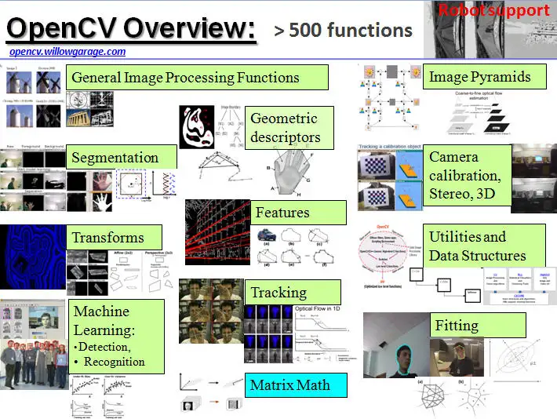

# OpenCV

- OpenCV（Open Source Computer Vision Library）是一个开源的计算机视觉和机器学习软件库，它由一系列的C函数和少量C++类构成，同时提供Python、Java和MATLAB等语言的接口，实现了图像处理和计算机视觉方面的很多通用算法。
- **人脸识别和[物体识别](https://zhida.zhihu.com/search?q=物体识别&zhida_source=entity&is_preview=1)**：这是OpenCV的一项重要功能，应用在许多领域，如安全监控、交互设计等。
- **图像和视频分析**：如[图像增强](https://zhida.zhihu.com/search?q=图像增强&zhida_source=entity&is_preview=1)、图像分割、视频跟踪等。
- **图像合成和3D重建**：在图像处理和计算机视觉领域，OpenCV可以用于创建AR或VR效果，生成3D模型等。
- **机器学习**：OpenCV内置了大量的机器学习算法，可以用于[图像分类](https://zhida.zhihu.com/search?q=图像分类&zhida_source=entity&is_preview=1)、聚类等任务。
- **深度学习**：OpenCV中的dnn模块提供了一系列深度学习模型的接口，用户可以加载预训练模型进行图像识别、目标检测等任务。

