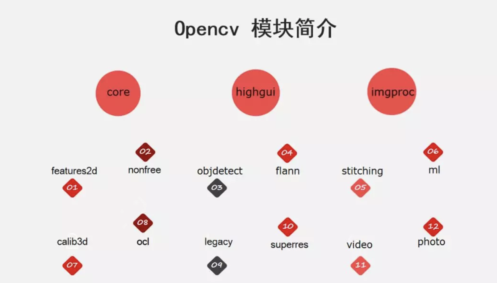

- 官网：https://apachecn.github.io/opencv-doc-zh/#/

# 一 介绍

## 1.1 基本介绍

- OpenCV（Open Source Computer Vision Library）是一个基于 BSD 许可开源发行的跨平台的计算机视觉库。可用于开发实时的图像处理、计算机视觉以及模式识别程序。由英特尔公司发起并参与开发，以 BSD 许可证授权发行，可以在商业和研究领域中免费使用。英特尔公司的 IPP 可以对 OpenCV 进行加速处理。
- OpenCV 拥有 C++，Python 和 Java 接口，并且支持 Windows， Linux， Mac OS， iOS 和 Android 系统。OpenCV 实现了图像处理和计算机视觉方面的很多通用算法

## 1.2 核心模块



1. Core：核心基础模块，提供基本函数、底层数据结构和算法函数，支持多维数组 Mat 等重要数据结构。
2. Imgproc：图像处理模块，涵盖了滤波、高斯模糊、形态学处理、几何变换、颜色空间转换和直方图计算等功能。
3. Highgui：高层用户交互模块，支持 GUI、图像和视频的输入输出操作。
4. Video：视频分析模块，专注于运动分析和目标跟踪。
5. Calib3d：3D 模块，涉及摄像机标定、立体匹配和 3D 重建技术。
6. Features2d：二维特征检测与描述模块，用于图像特征检测、描述和匹配。
7. Objdetect：目标检测模块，包括人脸检测在内的多种对象检测能力。
8. Machine Learning （MI）：机器学习模块，支持支持向量机、神经网络等算法。
9. Flann：最近邻算法库，提供快速查找机制。
10. Imgcodecs：图像编解码模块，用于图像文件的读写操作。
11. Photo：图像计算模块，专注于图像修复和去噪处理。
12. Shape：形状匹配算法模块，描述和比较形状。
13. Stitching：图像拼接模块。
14. Superres：超分辨率模块，提升图像分辨率。
15. Videoio：视频读写模块，支持视频文件和摄像头输入。
16. Videostab：视频稳定模块，提高拍摄视频的稳定性。
17. Dnn：深度神经网络模块，支持深度学习应用。
18. Contrib：额外模块，可以引入更多实验性的功能

## 1.3 OpenCV 与人工智能

- 计算机内部都是 0101，它是如何像人类那样认识判定事务的。简单来讲是通过模式匹配定位关键点。比如找人的眼睛，它的二进制排列方式是与其他事务不同的，将这种近似于眼睛的排列方式进行匹配即可定位到人的眼睛。此外，OpenCV 还可以用于图像建模、人工智能。
- 人类对于事务的认识源于从小到大的耳濡目染，计算机也是一样的，需要通过大量样本与素材的学习与训练，后续碰到未知元素时，将其套入到已有的模型中，从而进行判断与认知，这就是学习的过程，人工智能的本质就是学习。

## 1.4 图像分类

- 二值图像：一幅二值图像的二维矩阵仅由 0、1 两个值构成，“0”代表黑色，“1”代白色。由于每一像素（矩阵中每一元素）取值仅有 0、1 两种可能，所以计算机中二值图像的数据类型通常为 1 个二进制位。二值图像通常用于文字、线条图的扫描识别（OCR）和掩膜图像的存储。
- 灰度图：每个像素只有一个采样颜色的图像，这类图像通常显示为从最暗黑色到最亮的白色的灰度，尽管理论上这个采样可以任何颜色的不同深浅，甚至可以是不同亮度上的不同颜色。灰度图像与黑白图像不同，在计算机图像领域中黑白图像只有黑色与白色两种颜色；但是，灰度图像在黑色与白色之间还有许多级的颜色深度。灰度图像经常是在单个电磁波频谱如可见光内测量每个像素的亮度得到的，用于显示的灰度图像通常用每个采样像素 8 位的非线性尺度来保存，这样可以有 256 级灰度（如果用 16 位，则有 65536 级）。
- 彩色图：每个像素通常是由红（R）、绿（G）、蓝（B）三个分量来表示的，分量介于（0，255）。RGB 图像与索引图像一样都可以用来表示彩色图像。与索引图像一样，它分别用红（R）、绿（G）、蓝（B）三原色的组合来表示每个像素的颜色。但与索引图像不同的是，RGB 图像每一个像素的颜色值（由 RGB 三原色表示）直接存放在图像矩阵中，由于每一像素的颜色需由 R、G、B 三个分量来表示，M、N 分别表示图像的行列数，三个 M x N 的二维矩阵分别表示各个像素的 R、G、B 三个颜色分量。RGB 图像的数据类型一般为 8 位无符号整形，通常用于表示和存放真彩色图像。

# 二 环境搭建

## 2.1 Python 环境配置

```Python
pip install opencv-python
```

## 2.1 测试

```Python
import cv2
# 读一个图片并进行显示(图片路径需自己指定)
lena=cv2.imread("1.jpg")
cv2.imshow("image",lena)
cv2.waitKey(0)
```

# 三 图像的基本操作

## 3.1 读取图片

使用 [cv.imread（）](https://docs.opencv.org/4.0.0/d4/da8/group__imgcodecs.html#ga288b8b3da0892bd651fce07b3bbd3a56) 函数读取一张图像，图片应该在工作目录中，或者应该提供完整的图像路径。

第二个参数是一个 flag，指定了应该读取图像的方式

- [cv.IMREAD_COLOR](https://docs.opencv.org/4.0.0/d4/da8/group__imgcodecs.html#gga61d9b0126a3e57d9277ac48327799c80af660544735200cbe942eea09232eb822)：加载彩色图像，任何图像的透明度都会被忽略，它是默认标志
- [cv.IMREAD_GRAYSCALE](https://docs.opencv.org/4.0.0/d4/da8/group__imgcodecs.html#gga61d9b0126a3e57d9277ac48327799c80ae29981cfc153d3b0cef5c0daeedd2125)：以灰度模式加载图像
- [cv.IMREAD_UNCHANGED](https://docs.opencv.org/4.0.0/d4/da8/group__imgcodecs.html#gga61d9b0126a3e57d9277ac48327799c80aeddd67043ed0df14f9d9a4e66d2b0708)：加载图像，包括 alpha 通道

Note

- 你可以简单地分别传递整数 1、0 或 -1，而不是这三个 flag。

```Python
"""
 @Author: EasonShu
 @FileName: ReadImagesTest.py
 @DateTime: 2024/7/12 下午3:35
"""
import cv2

if __name__ == '__main__':
    path = "images/OIP-C.jpg"
    print(path)
    images = cv2.imread(path)
    cv2.imshow("images", images)
    cv2.waitKey(0)
    cv2.destroyAllWindows()
```

## 3.2 显示图像

- [cv.imshow（）](https://docs.opencv.org/4.0.0/d7/dfc/group__highgui.html#ga453d42fe4cb60e5723281a89973ee563) 函数在窗口中显示图像，窗口自动适应图像的大小。
- [cv.waitKey（）](https://docs.opencv.org/4.0.0/d7/dfc/group__highgui.html#ga5628525ad33f52eab17feebcfba38bd7) 是一个键盘绑定函数，它的参数是以毫秒为单位的时间。该函数为任意键盘事件等待指定毫秒。
- [cv.destroyAllWindows（）](https://docs.opencv.org/4.0.0/d7/dfc/group__highgui.html#ga6b7fc1c1a8960438156912027b38f481) 简单的销毁我们创建的所有窗口。

## 3.3  写入图像

- [cv.imwrite()](https://docs.opencv.org/4.0.0/d4/da8/group__imgcodecs.html#gabbc7ef1aa2edfaa87772f1202d67e0ce)：第一个参数是文件名，第二个参数是你要保存的图像。

```Python
"""
 @Author: EasonShu
 @FileName: ReadImagesTest.py
 @DateTime: 2024/7/12 下午3:35
"""
import cv2

'''
读取图像
'''
def readImages(image_file):
    image = cv2.imread(image_file)
    return image

'''
写入图像
'''
def writeImages(image_file):
    image = cv2.imread(image_file)
    cv2.imwrite("images/OIP-C1.jpg", image)


if __name__ == '__main__':
    path = "images/OIP-C.jpg"
    # readImages(path)
    writeImages(path)
```

## 2.4 绘制

> 直线：cv2.line

```Python
def drawLine(image_file):
    image = cv2.imread(image_file)
    # (x1, y1), (x2, y2): 直线的起点和终点, thickness: 线宽, color: 颜色
    cv2.line(image, (0, 0), (500, 500), (0, 0, 255), 2)
    cv2.imshow("line", image)
    cv2.waitKey(0)
```

> 矩形：cv2.rectangle

```Python
'''
绘制矩形
'''
def drawRectangle(image_file):
    image = cv2.imread(image_file)
    # (x1, y1), (x2, y2): 矩形的左上角和右下角坐标, thickness: 线宽, color: 颜色
    cv2.rectangle(image, (0, 0), (500, 500), (0, 0, 255), 2)
    cv2.imshow("rectangle", image)
    cv2.waitKey(0)
```

> 圆：cv2.circle

```Python
'''
绘制圆形
'''
def drawCircle(image_file):
    image = cv2.imread(image_file)
    # (x, y): 圆心坐标, radius: 半径, color: 颜色, thickness: 线宽
    cv2.circle(image, (250, 250), 100, (0, 0, 255), 2)
    cv2.imshow("circle", image)
    cv2.waitKey(0)
```

> 绘制文字：cv2.putText

```Python
'''
绘制文字
'''
def drawText(image_file):
    image = cv2.imread(image_file)
    # (x, y): 文字左上角坐标, text: 文字内容, fontFace: 字体, fontScale: 字体大小, color: 颜色, thickness: 线宽
    cv2.putText(image, "EasonShu", (0, 500), cv2.FONT_HERSHEY_SIMPLEX, 1, (0, 0, 255), 2)
    cv2.imshow("text", image)
    cv2.waitKey(0)
```

## 2.5 获取图片信息

- 获取像素点信息

```Python
'''
获取像素点信息
'''
def getPixel(image_file):
    image = cv2.imread(image_file)
    # 获取像素点信息
    pixel = image[100, 100]
    print(pixel)#  [B, G, R]
    print(image.shape) # (height, width, channel)
    print(image.size) # height * width * channel
```

- RGB:RGB 是指红色（Red）、绿色（Green）、蓝色（Blue）三种颜色通道的组合。在 RGB 格式中，每个像素都由这三种颜色的强度值来表示。RGB 通常是用 8 位表示一个通道，即每个颜色通道的强度范围是 0 到 255。因此，一个 RGB 像素通常由 24 位表示（8 位红色 + 8 位绿色 + 8 位蓝色）。在许多计算机图形系统中，RGB 是最常见的颜色表示方法之一。

## 2.6 图像通道的拆分与合并

> 拆分：cv2.split

```Python
'''
通道拆分
'''
def splitChannels(image_file):
    image = cv2.imread(image_file)
    # 通道拆分
    b, g, r = cv2.split(image)
    cv2.imshow("B", b)
    cv2.imshow("G", g)
    cv2.imshow("R", r)
    cv2.waitKey(0)
```

> 合并：cv2.merge

```Python
'''
通道合并
'''
def mergeChannels(image_file):
    image = cv2.imread(image_file)
    # 通道拆分
    b, g, r = cv2.split(image)
    # 通道合并
    image = cv2.merge([b, g, r])
    cv2.imshow("merge", image)
    cv2.waitKey(0)
```

## 2.7 灰度化

OpenCV中有150多种颜色空间转换方法。最广泛使用的转换方法有两种，BGR→ →→Gray 和 BGR→ →→HSV。

```Python
'''
灰度化
'''
def grayImage(image_file):
    image = cv2.imread(image_file)
    # 灰度化
    gray = cv2.cvtColor(image, cv2.COLOR_BGR2GRAY)
    cv2.imshow("gray", gray)
    cv2.waitKey(0)
```
