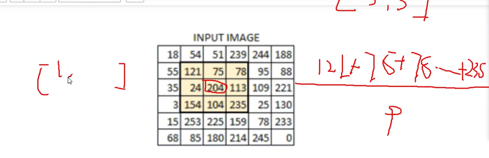

- 官网：https://apachecn.github.io/opencv-doc-zh/#/

# 一 介绍

## 1.1 基本介绍

- OpenCV（Open Source Computer Vision Library）是一个基于 BSD 许可开源发行的跨平台的计算机视觉库。可用于开发实时的图像处理、计算机视觉以及模式识别程序。由英特尔公司发起并参与开发，以 BSD 许可证授权发行，可以在商业和研究领域中免费使用。英特尔公司的 IPP 可以对 OpenCV 进行加速处理。
- OpenCV 拥有 C++，Python 和 Java 接口，并且支持 Windows， Linux， Mac OS， iOS 和 Android 系统。OpenCV 实现了图像处理和计算机视觉方面的很多通用算法

## 1.2 核心模块


1. Core：核心基础模块，提供基本函数、底层数据结构和算法函数，支持多维数组 Mat 等重要数据结构。
2. Imgproc：图像处理模块，涵盖了滤波、高斯模糊、形态学处理、几何变换、颜色空间转换和直方图计算等功能。
3. Highgui：高层用户交互模块，支持 GUI、图像和视频的输入输出操作。
4. Video：视频分析模块，专注于运动分析和目标跟踪。
5. Calib3d：3D 模块，涉及摄像机标定、立体匹配和 3D 重建技术。
6. Features2d：二维特征检测与描述模块，用于图像特征检测、描述和匹配。
7. Objdetect：目标检测模块，包括人脸检测在内的多种对象检测能力。
8. Machine Learning （MI）：机器学习模块，支持支持向量机、神经网络等算法。
9. Flann：最近邻算法库，提供快速查找机制。
10. Imgcodecs：图像编解码模块，用于图像文件的读写操作。
11. Photo：图像计算模块，专注于图像修复和去噪处理。
12. Shape：形状匹配算法模块，描述和比较形状。
13. Stitching：图像拼接模块。
14. Superres：超分辨率模块，提升图像分辨率。
15. Videoio：视频读写模块，支持视频文件和摄像头输入。
16. Videostab：视频稳定模块，提高拍摄视频的稳定性。
17. Dnn：深度神经网络模块，支持深度学习应用。
18. Contrib：额外模块，可以引入更多实验性的功能

## 1.3 OpenCV 与人工智能

- 计算机内部都是 0101，它是如何像人类那样认识判定事务的。简单来讲是通过模式匹配定位关键点。比如找人的眼睛，它的二进制排列方式是与其他事务不同的，将这种近似于眼睛的排列方式进行匹配即可定位到人的眼睛。此外，OpenCV 还可以用于图像建模、人工智能。
- 人类对于事务的认识源于从小到大的耳濡目染，计算机也是一样的，需要通过大量样本与素材的学习与训练，后续碰到未知元素时，将其套入到已有的模型中，从而进行判断与认知，这就是学习的过程，人工智能的本质就是学习。

## 1.4 图像分类

- 二值图像：一幅二值图像的二维矩阵仅由 0、1 两个值构成，“0”代表黑色，“1”代白色。由于每一像素（矩阵中每一元素）取值仅有 0、1 两种可能，所以计算机中二值图像的数据类型通常为 1 个二进制位。二值图像通常用于文字、线条图的扫描识别（OCR）和掩膜图像的存储。
- 灰度图：每个像素只有一个采样颜色的图像，这类图像通常显示为从最暗黑色到最亮的白色的灰度，尽管理论上这个采样可以任何颜色的不同深浅，甚至可以是不同亮度上的不同颜色。灰度图像与黑白图像不同，在计算机图像领域中黑白图像只有黑色与白色两种颜色；但是，灰度图像在黑色与白色之间还有许多级的颜色深度。灰度图像经常是在单个电磁波频谱如可见光内测量每个像素的亮度得到的，用于显示的灰度图像通常用每个采样像素 8 位的非线性尺度来保存，这样可以有 256 级灰度（如果用 16 位，则有 65536 级）。
- 彩色图：每个像素通常是由红（R）、绿（G）、蓝（B）三个分量来表示的，分量介于（0，255）。RGB 图像与索引图像一样都可以用来表示彩色图像。与索引图像一样，它分别用红（R）、绿（G）、蓝（B）三原色的组合来表示每个像素的颜色。但与索引图像不同的是，RGB 图像每一个像素的颜色值（由 RGB 三原色表示）直接存放在图像矩阵中，由于每一像素的颜色需由 R、G、B 三个分量来表示，M、N 分别表示图像的行列数，三个 M x N 的二维矩阵分别表示各个像素的 R、G、B 三个颜色分量。RGB 图像的数据类型一般为 8 位无符号整形，通常用于表示和存放真彩色图像。

# 二 环境搭建

## 2.1 Python 环境配置

```python
pip install opencv-python
```

## 2.1 测试

```python
import cv2
# 读一个图片并进行显示(图片路径需自己指定)
lena=cv2.imread("1.jpg")
cv2.imshow("image",lena)
cv2.waitKey(0)
```

# 三 图像的基本操作

## 3.1 读取图片

使用 [cv.imread（）](https://docs.opencv.org/4.0.0/d4/da8/group__imgcodecs.html#ga288b8b3da0892bd651fce07b3bbd3a56) 函数读取一张图像，图片应该在工作目录中，或者应该提供完整的图像路径。

第二个参数是一个 flag，指定了应该读取图像的方式

- [cv.IMREAD_COLOR](https://docs.opencv.org/4.0.0/d4/da8/group__imgcodecs.html#gga61d9b0126a3e57d9277ac48327799c80af660544735200cbe942eea09232eb822)：加载彩色图像，任何图像的透明度都会被忽略，它是默认标志
- [cv.IMREAD_GRAYSCALE](https://docs.opencv.org/4.0.0/d4/da8/group__imgcodecs.html#gga61d9b0126a3e57d9277ac48327799c80ae29981cfc153d3b0cef5c0daeedd2125)：以灰度模式加载图像
- [cv.IMREAD_UNCHANGED](https://docs.opencv.org/4.0.0/d4/da8/group__imgcodecs.html#gga61d9b0126a3e57d9277ac48327799c80aeddd67043ed0df14f9d9a4e66d2b0708)：加载图像，包括 alpha 通道

Note

- 你可以简单地分别传递整数 1、0 或 -1，而不是这三个 flag。

```python
"""
 @Author: EasonShu
 @FileName: ReadImagesTest.py
 @DateTime: 2024/7/12 下午3:35
"""
import cv2

if __name__ == '__main__':
    path = "images/OIP-C.jpg"
    print(path)
    images = cv2.imread(path)
    cv2.imshow("images", images)
    cv2.waitKey(0)
    cv2.destroyAllWindows()
```

## 3.2 显示图像

- [cv.imshow（）](https://docs.opencv.org/4.0.0/d7/dfc/group__highgui.html#ga453d42fe4cb60e5723281a89973ee563) 函数在窗口中显示图像，窗口自动适应图像的大小。
- [cv.waitKey（）](https://docs.opencv.org/4.0.0/d7/dfc/group__highgui.html#ga5628525ad33f52eab17feebcfba38bd7) 是一个键盘绑定函数，它的参数是以毫秒为单位的时间。该函数为任意键盘事件等待指定毫秒。
- [cv.destroyAllWindows（）](https://docs.opencv.org/4.0.0/d7/dfc/group__highgui.html#ga6b7fc1c1a8960438156912027b38f481) 简单的销毁我们创建的所有窗口。

## 3.3  写入图像

- [cv.imwrite()](https://docs.opencv.org/4.0.0/d4/da8/group__imgcodecs.html#gabbc7ef1aa2edfaa87772f1202d67e0ce)：第一个参数是文件名，第二个参数是你要保存的图像。

```python
"""
 @Author: EasonShu
 @FileName: ReadImagesTest.py
 @DateTime: 2024/7/12 下午3:35
"""
import cv2

'''
读取图像
'''
def readImages(image_file):
    image = cv2.imread(image_file)
    return image

'''
写入图像
'''
def writeImages(image_file):
    image = cv2.imread(image_file)
    cv2.imwrite("images/OIP-C1.jpg", image)


if __name__ == '__main__':
    path = "images/OIP-C.jpg"
    # readImages(path)
    writeImages(path)
```

## 3.4 绘制

> 直线：cv2.line

```python
def drawLine(image_file):
    image = cv2.imread(image_file)
    # (x1, y1), (x2, y2): 直线的起点和终点, thickness: 线宽, color: 颜色
    cv2.line(image, (0, 0), (500, 500), (0, 0, 255), 2)
    cv2.imshow("line", image)
    cv2.waitKey(0)
```

> 矩形：cv2.rectangle

```python
'''
绘制矩形
'''
def drawRectangle(image_file):
    image = cv2.imread(image_file)
    # (x1, y1), (x2, y2): 矩形的左上角和右下角坐标, thickness: 线宽, color: 颜色
    cv2.rectangle(image, (0, 0), (500, 500), (0, 0, 255), 2)
    cv2.imshow("rectangle", image)
    cv2.waitKey(0)
```

> 圆：cv2.circle

```python
'''
绘制圆形
'''
def drawCircle(image_file):
    image = cv2.imread(image_file)
    # (x, y): 圆心坐标, radius: 半径, color: 颜色, thickness: 线宽
    cv2.circle(image, (250, 250), 100, (0, 0, 255), 2)
    cv2.imshow("circle", image)
    cv2.waitKey(0)
```

> 绘制文字：cv2.putText

```python
'''
绘制文字
'''
def drawText(image_file):
    image = cv2.imread(image_file)
    # (x, y): 文字左上角坐标, text: 文字内容, fontFace: 字体, fontScale: 字体大小, color: 颜色, thickness: 线宽
    cv2.putText(image, "EasonShu", (0, 500), cv2.FONT_HERSHEY_SIMPLEX, 1, (0, 0, 255), 2)
    cv2.imshow("text", image)
    cv2.waitKey(0)
```

## 3.5 获取图片信息

- 获取像素点信息

```python
'''
获取像素点信息
'''
def getPixel(image_file):
    image = cv2.imread(image_file)
    # 获取像素点信息
    pixel = image[100, 100]
    print(pixel)#  [B, G, R]
    print(image.shape) # (height, width, channel)
    print(image.size) # height * width * channel
```

- RGB:RGB 是指红色（Red）、绿色（Green）、蓝色（Blue）三种颜色通道的组合。在 RGB 格式中，每个像素都由这三种颜色的强度值来表示。RGB 通常是用 8 位表示一个通道，即每个颜色通道的强度范围是 0 到 255。因此，一个 RGB 像素通常由 24 位表示（8 位红色 + 8 位绿色 + 8 位蓝色）。在许多计算机图形系统中，RGB 是最常见的颜色表示方法之一。

## 3.6 图像通道的拆分与合并

> 拆分：cv2.split

```python
'''
通道拆分
'''
def splitChannels(image_file):
    image = cv2.imread(image_file)
    # 通道拆分
    b, g, r = cv2.split(image)
    cv2.imshow("B", b)
    cv2.imshow("G", g)
    cv2.imshow("R", r)
    cv2.waitKey(0)
```

> 合并：cv2.merge

```python
'''
通道合并
'''
def mergeChannels(image_file):
    image = cv2.imread(image_file)
    # 通道拆分
    b, g, r = cv2.split(image)
    # 通道合并
    image = cv2.merge([b, g, r])
    cv2.imshow("merge", image)
    cv2.waitKey(0)
```

## 3.7 灰度化

OpenCV中有150多种颜色空间转换方法。最广泛使用的转换方法有两种，BGR→ →→Gray 和 BGR→ →→HSV。

```python
'''
灰度化
'''
def grayImage(image_file):
    image = cv2.imread(image_file)
    # 灰度化
    gray = cv2.cvtColor(image, cv2.COLOR_BGR2GRAY)
    cv2.imshow("gray", gray)
    cv2.waitKey(0)
```

## 3.8 边界填充

在OpenCV中，边界填充（或称为图像填充）通常是指在图像的边缘添加像素的过程。这可以用于多种目的，比如调整图像大小、增加图像边缘的平滑度等。填充可以使用不同的方法来实现，包括复制边缘像素、反射边缘像素、常数填充等。

设置边界框方法： cv2.copyMakeBorder(src, top, bottom, left, right, borderType, value)

- src： 输入的图片
- top, bottom, left, right： 相应方向上的边框宽度
- borderType： 定义添加边框的方法
- value：如果borderType为 cv2.BORDER_CONSTANT 时需要填充的常数值
- borderType方法如下：
- cv2.BORDER_REPLICATE：复制法，复制最边缘像素
- cv2.BORDER_REFLECT：反射法，在图像中指定像素的两边进行反射复制，如： gfedcba|abcdefgh|hgfedcb
- cv2.BORDER_REFLECT_101：反射法，以最边缘像素为轴，如：dcba|abcd|dcba
- cv2.BORDER_WRAP：外包装法，如：cdefgh|abcdefgh|abcdefg
- cv2.BORDER_CONSTANT：常量数值填充

```python
import cv2
import numpy as np

# 加载图像
image = cv2.imread('path_to_image.jpg')

# 填充图像的边界
top, bottom, left, right = [50]*4  # 定义上下左右填充的像素数量
border_type = cv2.BORDER_CONSTANT  # 使用常数填充类型
border_value = [0, 0, 0]           # 黑色填充颜色（BGR格式）

# 使用cv2.copyMakeBorder函数填充边界
padded_image = cv2.copyMakeBorder(image, top, bottom, left, right, border_type, value=border_value)

# 显示原图和填充后的图像
cv2.imshow('Original Image', image)
cv2.imshow('Padded Image', padded_image)
cv2.waitKey(0)
cv2.destroyAllWindows()
```

OpenCV提供了多种填充类型，例如：
- `cv2.BORDER_CONSTANT`: 添加常数值的边框。
- `cv2.BORDER_REFLECT`: 镜像反射的边框。
- `cv2.BORDER_REPLICATE`: 复制最边缘像素值。
- `cv2.BORDER_WRAP`: 对边缘像素进行环绕。

## 3.9 阈值处理

在OpenCV中，阈值处理是一种常见的图像处理技术，它用于将灰度图像转换为二值图像，即只有黑白两种颜色的图像。通过设置一个阈值，所有低于该阈值的像素被设定为一种颜色（通常是黑色），而高于或等于该阈值的像素则被设定为另一种颜色（通常是白色）。

图像阈值处理函数： ret, dst = cv2.threshold(src, thresh, maxval, type)

参数：

- src: 输入图，只能输入单通道图像，通常是[灰度图](https://zhida.zhihu.com/search?q=灰度图&zhida_source=entity&is_preview=1)
- dst: 输出图
- thresh: 阈值，是一个值，通常为127
- maxval: 当图像超过了阈值或低于阈值(由type决定)，所赋予的值
- type: [二值化](https://zhida.zhihu.com/search?q=二值化&zhida_source=entity&is_preview=1)操作的类型，包含：
- cv2.THRESH_BINARY 二值法，超过阈值thresh部分取maxval(设定的最大值)，否则取0
- cv2.THRESH_BINARY_INV 超过阈值的部分取0，小于阈值取maxval
- cv2.THRESH_TRUNC 截断，大于阈值的部分设为阈值，小于阈值的不变
- cv2.THRESH_TOZERO 大于阈值的部分不变，小于阈值的部分变成0。亮的部分不变，暗的部分变成黑点
- cv2.THRESH_TOZERO_INV 大于阈值的变成0，小于阈值的不变。暗的部分不变，亮的部分变成黑点

以下是一些基本的阈值处理方法：

**基本阈值处理**

基本阈值处理是最直接的方式，通过设置一个全局阈值来分割图像。OpenCV提供了`cv2.threshold()`函数来实现这一功能。

```python
import cv2
import numpy as np

# 读取图像并转换为灰度图
image = cv2.imread('path_to_image.jpg', cv2.IMREAD_GRAYSCALE)

# 设置阈值和最大值
threshold_value = 127
max_value = 255

# 应用阈值处理
ret, thresh_image = cv2.threshold(image, threshold_value, max_value, cv2.THRESH_BINARY)

# 显示结果
cv2.imshow('Thresholded Image', thresh_image)
cv2.waitKey(0)
cv2.destroyAllWindows()
```

**自适应阈值处理**

如果图像中的光照条件变化较大，那么使用全局阈值可能不会得到满意的结果。此时可以使用自适应阈值处理，它会根据图像的局部区域自动调整阈值。

```python
# 读取图像并转换为灰度图
image = cv2.imread('path_to_image.jpg', cv2.IMREAD_GRAYSCALE)

# 应用自适应阈值处理
max_value = 255
adaptive_method = cv2.ADAPTIVE_THRESH_GAUSSIAN_C  # 或者 cv2.ADAPTIVE_THRESH_MEAN_C
block_size = 11  # 块大小
c = 2  # 常数从均值中减去

thresh_image = cv2.adaptiveThreshold(image, max_value, adaptive_method, cv2.THRESH_BINARY, block_size, c)

# 显示结果
cv2.imshow('Adaptive Thresholded Image', thresh_image)
cv2.waitKey(0)
cv2.destroyAllWindows()
```

**Otsu's 二值化**

Otsu's方法是一种自动计算最佳全局阈值的方法，它可以根据图像的直方图找到一个阈值，使得前景和背景之间的差异最大化。

```python
# 读取图像并转换为灰度图
image = cv2.imread('path_to_image.jpg', cv2.IMREAD_GRAYSCALE)

# 使用Otsu's方法计算阈值
ret, otsu_image = cv2.threshold(image, 0, 255, cv2.THRESH_BINARY + cv2.THRESH_OTSU)

# 显示结果
cv2.imshow('Otsu Thresholded Image', otsu_image)
cv2.waitKey(0)
cv2.destroyAllWindows()
```


## 3.10 卷积核



**卷积核的基本概念**

卷积核（也称为滤波器或滤波核）是一个小的矩阵，它与图像中的每个像素进行运算，以产生新的像素值。这个过程通常被称为卷积（Convolution）。

**卷积核的作用**

卷积核可以用于执行多种图像处理任务，如边缘检测、锐化、模糊等。卷积核通过对图像中的像素值进行加权求和来改变图像的特性。

**卷积过程**

卷积过程可以分为以下几个步骤：

1. **放置卷积核**：将卷积核放在图像的一个位置上，通常以图像中的某个像素为中心。
2. **元素相乘**：将卷积核中的每个元素与对应位置的图像像素值相乘。
3. **求和**：将所有乘积相加起来，得到一个单一的值。
4. **更新中心像素值**：用上述求和的结果来更新图像中对应中心像素的位置。
5. **移动卷积核**：将卷积核移动到下一个位置，重复上述步骤直到覆盖整个图像。

**平滑（Smooth）/ 模糊（Blur）卷积核**

平滑卷积核通常包含正数，这些正数之和为1，这样可以确保输出图像的亮度大致保持不变。例如，一个3x3的均值滤波器核可以是这样的：

```
1/9 1/9 1/9
1/9 1/9 1/9
1/9 1/9 1/9
```

**边缘检测卷积核**

边缘检测卷积核强调图像中的突变，通常包含正值和负值。例如，Sobel算子是一个常用的边缘检测核：

```
-1  0  1
-2  0  2
-1  0  1
```

这个核用于检测垂直边缘，水平方向的核与此类似。

**卷积核的尺寸**

卷积核的大小通常是一个奇数，如3x3、5x5等。这是因为这样可以确保有一个中心点，而且对称性也有助于保持图像的对称性。

**实现卷积**

在OpenCV中，可以通过多种方式实现卷积，例如使用`cv2.filter2D()`函数进行自定义卷积核的卷积操作。

```python
import cv2
import numpy as np

# 加载图像
image = cv2.imread('path_to_image.jpg', cv2.IMREAD_GRAYSCALE)

# 定义一个3x3的卷积核
kernel = np.array([[0, -1, 0],
                   [-1, 5, -1],
                   [0, -1, 0]])

# 应用卷积
convolved_image = cv2.filter2D(image, -1, kernel)

# 显示结果
cv2.imshow('Convolved Image', convolved_image)
cv2.waitKey(0)
cv2.destroyAllWindows()
```

在这个例子中，我们定义了一个3x3的卷积核，并使用`cv2.filter2D()`函数将其应用于图像上。输出的图像展示了经过卷积后的效果。

## 3.11 图像平滑处理

**均值滤波（Mean Filtering）**

均值滤波通过计算窗口内的平均值来替换中心像素值。OpenCV中的`cv2.blur()`函数可以用来实现均值滤波。

**参数**:
- `src`: 输入图像。
- `ksize`: 卷积核大小，通常是一个奇数构成的元组，如`(3, 3)`或`(5, 5)`。如果使用偶数，则OpenCV会自动将其调整为下一个较大的奇数。

**示例代码**:！

```python
smoothed_image = cv2.blur(image, (5, 5))  # 使用5x5的窗口大小
```

**高斯滤波（Gaussian Filtering）**

高斯滤波使用高斯核进行卷积，核中的权重由高斯分布确定。OpenCV中的`cv2.GaussianBlur()`函数可以实现高斯滤波。

**参数**:

- `src`: 输入图像。
- `ksize`: 卷积核大小，同样是一个奇数构成的元组。
- `sigmaX`: 在X方向上的高斯核标准差。如果设置为0，OpenCV会基于核大小计算标准差。
- `sigmaY`: 在Y方向上的高斯核标准差。默认情况下与`sigmaX`相同。

**示例代码**:
```python
smoothed_image = cv2.GaussianBlur(image, (5, 5), 0)  # 使用5x5的窗口大小，标准差由OpenCV计算
```

 **中值滤波（Median Filtering）**

中值滤波使用邻域内的中值来替换中心像素值，对于去除椒盐噪声特别有效。OpenCV中的`cv2.medianBlur()`函数可以实现中值滤波。

**参数**:
- `src`: 输入图像。
- `ksize`: 卷积核大小，这里是一个整数，表示方形窗口的大小。

**示例代码**:
```python
smoothed_image = cv2.medianBlur(image, 5)  # 使用5x5的窗口大小
```

 **双边滤波（Bilateral Filtering）**

双边滤波是一种保边平滑算法，它不仅考虑空间邻近性，还考虑像素强度的相似性。

**参数**:
- `src`: 输入图像。
- `d`: 直径，即每个像素的邻域半径。
- `sigmaColor`: 在颜色空间上的高斯核标准差。
- `sigmaSpace`: 在坐标空间上的高斯核标准差。

**示例代码**:
```python
smoothed_image = cv2.bilateralFilter(image, 9, 75, 75)  # 使用直径为9，颜色空间和坐标空间的标准差均为75
```

## 3.12 腐蚀操作

腐蚀（Erosion）是数学形态学中的一种基本操作，常用于图像处理和计算机视觉领域。腐蚀操作可以用来去除图像中的小对象、细化结构或者消除噪点。在OpenCV中，可以使用`cv2.erode()`函数来实现腐蚀操作。

**腐蚀操作的基本原理**

腐蚀操作通过将一个结构元素（Structuring Element，SE）沿着图像滑动，并在每个位置寻找结构元素完全包含在前景（通常是白色）像素内的情况。如果在当前位置结构元素完全位于前景像素内，则该位置的中心像素被标记为前景；否则，该位置的中心像素被标记为背景（通常是黑色）。

**结构元素**

结构元素是一个小矩阵，通常是对称的，形状可以是矩形、圆形、十字形等。在OpenCV中，默认的结构元素是矩形，但也可以创建自定义的结构元素。

**参数**

以下是`cv2.erode()`函数的参数说明：

- `src`: 输入图像，通常是单通道的灰度图像。
- `kernel`: 结构元素，可以是预先定义好的形状，也可以是用户自定义的矩阵。
- `iterations`: 腐蚀迭代次数，默认为1。迭代次数越多，腐蚀的效果越明显。
- `anchor`: 结构元素的锚点位置，默认为中心点。
- `borderType`: 边界处理类型，默认为`cv2.BORDER_CONSTANT`。
- `borderValue`: 边界填充值，默认为黑色（0）。

```python
import cv2
import numpy as np

# 加载图像并转换为灰度图
image = cv2.imread('path_to_image.jpg', cv2.IMREAD_GRAYSCALE)

# 定义结构元素
kernel = np.ones((5, 5), np.uint8)  # 创建一个5x5的矩形结构元素

# 应用腐蚀操作
iterations = 1  # 迭代次数
eroded_image = cv2.erode(image, kernel, iterations=iterations)

# 显示原图和腐蚀后的图像
cv2.imshow('Original Image', image)
cv2.imshow('Eroded Image', eroded_image)
cv2.waitKey(0)
cv2.destroyAllWindows()
```

在这个例子中，我们创建了一个5x5的矩形结构元素，并使用一次迭代对图像进行了腐蚀操作。腐蚀后，图像中的白色区域（通常是前景）会被缩小，而黑色区域（通常是背景）会扩展。

**结构元素的创建**

除了使用默认的矩形结构元素之外，还可以创建圆形、十字形等其他形状的结构元素：

```python
# 创建圆形结构元素
kernel = cv2.getStructuringElement(cv2.MORPH_ELLIPSE, (5, 5))

# 创建十字形结构元素
kernel = cv2.getStructuringElement(cv2.MORPH_CROSS, (5, 5))
```

**腐蚀操作的应用**

腐蚀操作可以用于多种图像处理任务，例如：
- **去除噪点**：通过腐蚀可以去掉图像中的小噪点。
- **细化边缘**：腐蚀可以使边缘变得更细，有助于后续的特征提取。
- **分割前预处理**：在进行图像分割之前，可以先使用腐蚀操作去除一些不必要的小区域。

## 3.13 膨胀操作

膨胀（Dilation）是数学形态学中的另一个基本操作，通常与腐蚀操作一起使用。膨胀操作主要用于扩大图像中的前景区域，填补小孔洞，连接相邻的物体等。在OpenCV中，可以使用`cv2.dilate()`函数来实现膨胀操作。

**膨胀操作的基本原理**

膨胀操作通过将一个结构元素（Structuring Element，SE）沿着图像滑动，并在每个位置寻找结构元素与前景（通常是白色）像素重叠的情况。如果在当前位置结构元素与前景像素有重叠，则该位置的中心像素被标记为前景；否则，该位置的中心像素被标记为背景（通常是黑色）。

**结构元素**

结构元素是一个小矩阵，通常是对称的，形状可以是矩形、圆形、十字形等。在OpenCV中，默认的结构元素是矩形，但也可以创建自定义的结构元素。

**参数**

以下是`cv2.dilate()`函数的参数说明：

- `src`: 输入图像，通常是单通道的灰度图像。
- `kernel`: 结构元素，可以是预先定义好的形状，也可以是用户自定义的矩阵。
- `iterations`: 膨胀迭代次数，默认为1。迭代次数越多，膨胀的效果越明显。
- `anchor`: 结构元素的锚点位置，默认为中心点。
- `borderType`: 边界处理类型，默认为`cv2.BORDER_CONSTANT`。
- `borderValue`: 边界填充值，默认为黑色（0）。

```python
import cv2
import numpy as np

# 加载图像并转换为灰度图
image = cv2.imread('path_to_image.jpg', cv2.IMREAD_GRAYSCALE)

# 将图像二值化
_, binary_image = cv2.threshold(image, 127, 255, cv2.THRESH_BINARY)

# 定义结构元素
kernel = np.ones((5, 5), np.uint8)  # 创建一个5x5的矩形结构元素

# 应用膨胀操作
iterations = 1  # 膨胀迭代次数
dilated_image = cv2.dilate(binary_image, kernel, iterations=iterations)

# 显示原图和膨胀后的图像
cv2.imshow('Binary Image', binary_image)
cv2.imshow('Dilated Image', dilated_image)
cv2.waitKey(0)
cv2.destroyAllWindows()
```

在这个例子中，我们首先加载了一张图像，并将其转换为灰度图。然后使用全局阈值处理将图像转换为二值图像。接着，我们创建了一个5x5的矩形结构元素，并使用一次迭代对二值图像进行了膨胀操作。膨胀后，图像中的白色区域（通常是前景）会被扩大，而黑色区域（通常是背景）会缩小。

**结构元素的创建**

除了使用默认的矩形结构元素之外，还可以创建圆形、十字形等其他形状的结构元素：

```python
# 创建圆形结构元素
kernel = cv2.getStructuringElement(cv2.MORPH_ELLIPSE, (5, 5))

# 创建十字形结构元素
kernel = cv2.getStructuringElement(cv2.MORPH_CROSS, (5, 5))
```

**膨胀操作的应用**

膨胀操作可以用于多种图像处理任务，例如：
- **填补孔洞**：膨胀可以使图像中的小孔洞被填补。
- **连接物体**：膨胀可以用来连接彼此接近但未相连的物体。
- **去除边界**：在某些情况下，膨胀可以用来去除图像边缘的噪声。
- **形态学梯度**：结合膨胀和腐蚀操作，可以计算图像的形态学梯度，从而突出物体的边缘。

## 3.14 开运输与闭运算

开运算（Opening）和闭运算（Closing）是数学形态学中用于图像处理的两种基本操作。这两种操作通常用于去除图像中的噪声，平滑边界，填充孔洞等。它们都是通过组合腐蚀和膨胀操作来实现的。

**开运算（Opening）**

开运算通常用于去除图像中的小噪声斑点或小对象。它是先进行腐蚀操作，然后再进行膨胀操作。这种组合可以有效地去除小的对象而不影响图像的整体结构。

**步骤**：
1. **腐蚀**：使用一个结构元素对图像进行腐蚀操作，以去除小的对象或噪声。
2. **膨胀**：对腐蚀后的图像进行膨胀操作，以恢复一些因腐蚀而丢失的细节。

**应用**：
- 去除小的噪声点。
- 平滑物体边界，同时保持物体的大小基本不变。

```python
import cv2
import numpy as np

# 加载图像并转换为灰度图
image = cv2.imread('path_to_image.jpg', cv2.IMREAD_GRAYSCALE)

# 将图像二值化
_, binary_image = cv2.threshold(image, 127, 255, cv2.THRESH_BINARY)

# 定义结构元素
kernel = np.ones((5, 5), np.uint8)  # 创建一个5x5的矩形结构元素

# 应用开运算
opened_image = cv2.morphologyEx(binary_image, cv2.MORPH_OPEN, kernel)

# 显示原图和开运算后的图像
cv2.imshow('Binary Image', binary_image)
cv2.imshow('Opened Image', opened_image)
cv2.waitKey(0)
cv2.destroyAllWindows()
```

**闭运算（Closing）**

闭运算通常用于填充图像中的小孔洞或小间隙。它是先进行膨胀操作，然后再进行腐蚀操作。这种组合可以有效地填充小的孔洞而不影响图像的整体结构。

**步骤**：
1. **膨胀**：使用一个结构元素对图像进行膨胀操作，以填充小的孔洞。
2. **腐蚀**：对膨胀后的图像进行腐蚀操作，以恢复一些因膨胀而扩大的区域。

**应用**：
- 填补小的孔洞。
- 平滑物体边界，同时保持物体的大小基本不变。

```python
# 加载图像并转换为灰度图
image = cv2.imread('path_to_image.jpg', cv2.IMREAD_GRAYSCALE)

# 将图像二值化
_, binary_image = cv2.threshold(image, 127, 255, cv2.THRESH_BINARY)

# 定义结构元素
kernel = np.ones((5, 5), np.uint8)  # 创建一个5x5的矩形结构元素

# 应用闭运算
closed_image = cv2.morphologyEx(binary_image, cv2.MORPH_CLOSE, kernel)

# 显示原图和闭运算后的图像
cv2.imshow('Binary Image', binary_image)
cv2.imshow('Closed Image', closed_image)
cv2.waitKey(0)
cv2.destroyAllWindows()
```

**结构元素的创建**

除了使用默认的矩形结构元素之外，还可以创建圆形、十字形等其他形状的结构元素：

```python
# 创建圆形结构元素
kernel = cv2.getStructuringElement(cv2.MORPH_ELLIPSE, (5, 5))

# 创建十字形结构元素
kernel = cv2.getStructuringElement(cv2.MORPH_CROSS, (5, 5))
```

**综合应用**

开运算和闭运算可以综合应用于图像处理的不同阶段，以达到更好的效果。例如：

- **去噪**：可以先进行开运算去除小的噪声点，再进行闭运算填补孔洞。
- **边缘检测**：结合开运算和闭运算可以用于边缘检测，通过形态学梯度（闭运算减去开运算）来突出边缘。
- **形态学重建**：利用开运算和闭运算可以实现形态学重建，从而增强或减弱图像中的特定特征。

## 3.15 梯度运算

 梯度运算是数学形态学中的一种重要操作，它可以用来检测图像中的边缘或轮廓。梯度运算通常通过计算图像在膨胀和腐蚀之后的差异来实现。在OpenCV中，可以使用`cv2.morphologyEx()`函数来实现梯度运算。

**梯度运算的基本原理**

梯度运算的基本思想是在图像上应用两次不同的形态学操作，然后计算这两个操作结果之间的差异。具体来说，梯度运算可以定义为图像经过膨胀之后的结果减去图像经过腐蚀之后的结果。这个差值可以用来突出图像中的边缘或轮廓。

**梯度运算的步骤**

1. **膨胀**：使用一个结构元素对图像进行膨胀操作。
2. **腐蚀**：使用相同的结构元素对图像进行腐蚀操作。
3. **计算差异**：将膨胀后的图像减去腐蚀后的图像，得到的结果就是梯度图像。

```python
import cv2
import numpy as np

# 加载图像并转换为灰度图
image = cv2.imread('path_to_image.jpg', cv2.IMREAD_GRAYSCALE)

# 将图像二值化
_, binary_image = cv2.threshold(image, 127, 255, cv2.THRESH_BINARY)

# 定义结构元素
kernel = np.ones((5, 5), np.uint8)  # 创建一个5x5的矩形结构元素

# 应用膨胀操作
dilated_image = cv2.dilate(binary_image, kernel, iterations=1)

# 应用腐蚀操作
eroded_image = cv2.erode(binary_image, kernel, iterations=1)

# 计算梯度图像
gradient_image = cv2.subtract(dilated_image, eroded_image)

# 显示原图、膨胀后的图像、腐蚀后的图像以及梯度图像
cv2.imshow('Binary Image', binary_image)
cv2.imshow('Dilated Image', dilated_image)
cv2.imshow('Eroded Image', eroded_image)
cv2.imshow('Gradient Image', gradient_image)
cv2.waitKey(0)
cv2.destroyAllWindows()
```

**使用`cv2.morphologyEx()`函数**

OpenCV提供了`cv2.morphologyEx()`函数来直接计算梯度图像，这样可以简化代码：

```python
# 使用cv2.morphologyEx()函数直接计算梯度图像
gradient_image = cv2.morphologyEx(binary_image, cv2.MORPH_GRADIENT, kernel)

# 显示原图和梯度图像
cv2.imshow('Binary Image', binary_image)
cv2.imshow('Gradient Image using morphologyEx', gradient_image)
cv2.waitKey(0)
cv2.destroyAllWindows()
```

**结构元素的创建**

除了使用默认的矩形结构元素之外，还可以创建圆形、十字形等其他形状的结构元素：

```python
# 创建圆形结构元素
kernel = cv2.getStructuringElement(cv2.MORPH_ELLIPSE, (5, 5))

# 创建十字形结构元素
kernel = cv2.getStructuringElement(cv2.MORPH_CROSS, (5, 5))
```

**梯度运算的应用**

梯度运算可以用于多种图像处理任务，例如：
- **边缘检测**：梯度图像可以用来突出图像中的边缘或轮廓。
- **增强对比度**：通过梯度运算可以增强图像中物体的边界，从而提高对比度。
- **预处理**：在某些图像处理任务中，梯度运算可以作为预处理步骤，帮助后续的特征提取或分割。

## 3.16 礼帽与黑帽

礼帽（Top Hat）和黑帽（Black Hat）是数学形态学中的两种变换，它们分别用于增强图像中的局部细节和检测暗区域。这些变换通常用于图像预处理，以便更好地突出某些特征。

**礼帽变换（Top Hat Transform）**

礼帽变换通过从原始图像中减去开运算的结果来实现。这种变换可以用来增强图像中的亮区域或局部细节。

**步骤**：
1. **开运算**：使用一个结构元素对图像进行开运算。
2. **减法**：从原始图像中减去开运算的结果。

**应用**：
- **增强局部细节**：礼帽变换可以突出图像中的局部细节，特别是亮的细节。
- **去除阴影**：在某些情况下，礼帽变换可以帮助去除图像中的阴影。

```python
import cv2
import numpy as np

# 加载图像并转换为灰度图
image = cv2.imread('path_to_image.jpg', cv2.IMREAD_GRAYSCALE)

# 定义结构元素
kernel = np.ones((5, 5), np.uint8)  # 创建一个5x5的矩形结构元素

# 应用开运算
opened_image = cv2.morphologyEx(image, cv2.MORPH_OPEN, kernel)

# 应用礼帽变换
top_hat_image = cv2.subtract(image, opened_image)

# 显示原图和礼帽变换后的图像
cv2.imshow('Original Image', image)
cv2.imshow('Top Hat Transformed Image', top_hat_image)
cv2.waitKey(0)
cv2.destroyAllWindows()
```

**黑帽变换（Black Hat Transform）**

黑帽变换通过从闭运算的结果中减去原始图像来实现。这种变换可以用来检测图像中的暗区域或局部细节。

**步骤**：
1. **闭运算**：使用一个结构元素对图像进行闭运算。
2. **减法**：从闭运算的结果中减去原始图像。

**应用**：
- **检测暗区域**：黑帽变换可以突出图像中的暗区域或局部细节。
- **增强对比度**：在某些情况下，黑帽变换可以帮助增强图像中暗区域的对比度。


```python
# 应用闭运算
closed_image = cv2.morphologyEx(image, cv2.MORPH_CLOSE, kernel)

# 应用黑帽变换
black_hat_image = cv2.subtract(closed_image, image)

# 显示原图和黑帽变换后的图像
cv2.imshow('Original Image', image)
cv2.imshow('Black Hat Transformed Image', black_hat_image)
cv2.waitKey(0)
cv2.destroyAllWindows()
```

## 3.17 Sobel算子

Sobel算子是一种广泛使用的边缘检测算法，用于计算图像中的梯度向量幅度或方向。Sobel算子通过在图像上应用两个分离的一维滤波器来估计图像在水平和垂直方向上的梯度。这种方法可以有效地检测图像中的边缘。

**Sobel算子的基本原理**

Sobel算子通过两个3x3的卷积核（一个用于水平方向，另一个用于垂直方向）来计算图像在各个方向上的梯度。这两个卷积核如下所示：

**水平方向的Sobel核**：

```
-1  0  1
-2  0  2
-1  0  1
```

**垂直方向的Sobel核**：

```
-1 -2 -1
 0  0  0
 1  2  1
```

这两个核可以分别计算图像在水平和垂直方向上的梯度。通过将这两个方向的梯度组合起来，可以得到梯度的幅度和方向。

**计算梯度幅度和方向**

给定图像\( I \)，Sobel算子计算水平方向梯度 \( G_x \) 和垂直方向梯度 \( G_y \)，然后可以计算梯度的幅度 \( M \) 和方向 \( \theta \)：

1. **水平方向梯度**：
   \[
   G_x = I * \left[ \begin{array}{ccc}
   -1 & 0 & 1 \\
   -2 & 0 & 2 \\
   -1 & 0 & 1
   \end{array} \right]
   \]

2. **垂直方向梯度**：
   \[
   G_y = I * \left[ \begin{array}{ccc}
   -1 & -2 & -1 \\
    0 &  0 &  0 \\
    1 &  2 &  1
   \end{array} \right]
   \]

3. **梯度幅度**：
   \[
   M = \sqrt{G_x^2 + G_y^2}
   \]

4. **梯度方向**：
   \[
   \theta = \arctan\left(\frac{G_y}{G_x}\right)
   \]


```python
import cv2
import numpy as np

# 加载图像并转换为灰度图
image = cv2.imread('path_to_image.jpg', cv2.IMREAD_GRAYSCALE)

# 定义Sobel核
kernel_x = np.array([[-1, 0, 1], [-2, 0, 2], [-1, 0, 1]])
kernel_y = np.array([[-1, -2, -1], [0, 0, 0], [1, 2, 1]])

# 应用Sobel核
gx = cv2.filter2D(image, -1, kernel_x)
gy = cv2.filter2D(image, -1, kernel_y)

# 计算梯度幅度
magnitude = cv2.magnitude(gx, gy)

# 显示原图和梯度幅度图像
cv2.imshow('Original Image', image)
cv2.imshow('Sobel Gradient Magnitude', magnitude)
cv2.waitKey(0)
cv2.destroyAllWindows()
```

**使用OpenCV内置函数**

OpenCV提供了内置的函数`cv2.Sobel()`来简化Sobel算子的应用：

```python
# 使用cv2.Sobel()函数计算梯度
depth = cv2.CV_32F  # 输出深度为32位浮点数
gx = cv2.Sobel(image, depth, 1, 0, ksize=3)
gy = cv2.Sobel(image, depth, 0, 1, ksize=3)

# 计算梯度幅度
magnitude = cv2.magnitude(gx, gy)

# 将梯度幅度转换为8位无符号整数
magnitude = cv2.convertScaleAbs(magnitude)

# 显示原图和梯度幅度图像
cv2.imshow('Original Image', image)
cv2.imshow('Sobel Gradient Magnitude', magnitude)
cv2.waitKey(0)
cv2.destroyAllWindows()
```

