- 官网：https://apachecn.github.io/opencv-doc-zh/#/

## 1.1 Canny 边缘检测

Canny 边缘检测算法是由 John F. Canny 在 1986 年开发的一种多阶段边缘检测算法。这种算法旨在从图像中找出边缘，同时尽可能地减少错误检测和遗漏，并且确保边缘被准确地定位。以下是 Canny 边缘检测的基本步骤：

1. **高斯滤波**：首先对原始图像应用高斯滤波器以去除噪声。这是因为边缘检测本质上是对图像求导，而导数对噪声非常敏感。高斯滤波可以帮助平滑图像，从而减少噪声的影响。
2. **强度和方向计算**：接下来使用 Sobel 滤波器（或者其他如 Prewitt 滤波器）来计算图像中每个像素的梯度幅值和方向。梯度幅值可以用来估计边缘强度，而梯度方向则用于后续的非极大值抑制。
3. **非极大值抑制 (NMS)**：在这个步骤中，算法会检查每一个像素点在其梯度方向上的邻域是否是局部最大值。如果不是，则认为该点不是边缘的一部分，并将其梯度强度设为零。这一步骤有助于获得单像素宽的边缘。
4. **双阈值检测和连接分析**：在此之后，会对梯度幅值应用两个阈值：一个是较高的阈值用于确定强边缘点，另一个较低的阈值用于检测弱边缘点。如果一个弱边缘点与某个通过高阈值检测出的强边缘点相连，则认为它也是边缘的一部分，否则就被舍弃。

Canny 算法之所以流行，是因为它能够提供良好的边缘检测性能，包括良好的定位能力和较低的错误检测率。此外，由于其原理清晰，易于理解和实现，在计算机视觉领域得到了广泛应用。

在 Canny 边缘检测算法中，有几个关键参数影响着检测的结果：

1. **高斯滤波器的标准差 (sigma)**：虽然在使用 OpenCV 的 `cv2.Canny()` 时通常不会直接设置高斯核的标准差，但在某些情况下，如使用自定义高斯模糊，可能会涉及到标准差的设置。标准差越大，模糊效果越强，检测到的边缘也会更少。

2. **阈值 (`threshold1` 和 `threshold2`)**：
   - `threshold1`（低阈值）：低于此阈值的所有边缘都会被抑制。
   - `threshold2`（高阈值）：高于此阈值的所有边缘都会被标记为强边缘。介于两个阈值之间的边缘，如果与强边缘连接，则也被视为真实的边缘。

3. **孔径大小 (`apertureSize`)**：这是 Sobel 操作符的孔径大小，默认情况下为 3，即 3x3 的核。较大的孔径大小可以提高边缘检测的准确性，但也可能导致计算量增加。

在 OpenCV 中调用 `cv2.Canny()` 时，基本语法如下：

```python
edges = cv2.Canny(image, threshold1, threshold2, apertureSize=None, L2gradient=None)
```

- `image`：输入图像。通常需要是灰度图像。
- `threshold1`：弱边缘阈值。
- `threshold2`：强边缘阈值。
- `apertureSize`：Sobel 算子的大小，默认为 3。
- `L2gradient`：如果设置为 True，则使用 L2 范数来计算梯度幅度；如果是 False，则使用 L1 范数。默认情况下，OpenCV 使用 L1 范数。

**示例参数解释**

假设我们有以下参数设置：
```python
edges = cv2.Canny(image, threshold1=50, threshold2=150)
```

这里：
- `threshold1=50` 表示低于 50 的梯度值将被抑制。
- `threshold2=150` 表示高于 150 的梯度值被认为是强边缘。
- 介于 50 到 150 之间的边缘，如果它们与强边缘相连，则也将被保留下来。

**如何选择阈值？**

选择合适的阈值对于 Canny 边缘检测至关重要。一般而言：
- 较高的 `threshold2` 可能会导致更多的边缘被检测到，但也可能包含更多的噪声。
- 较低的 `threshold1` 会使更多的边缘通过非极大值抑制阶段，但如果太低，则可能导致太多虚假边缘。

```python
# _*_ coding: utf-8 _*_
"""
Time:     2024/9/17 下午7:13
Author:   EasonShu
Version:  V 0.1
File:     Canny.py
Describe: 
"""
if __name__ == '__main__':
    import cv2
    import numpy as np
    image_path = 'images/img_2.png'
    # 加载图像
    image = cv2.imread(image_path, cv2.IMREAD_GRAYSCALE)  # 以灰度模式读取图片

    # 如果图片没有正确加载，打印错误信息
    if image is None:
        print('Error: 图片未正确加载.')
    else:
        # 应用 Canny 边缘检测
        edges = cv2.Canny(image, threshold1=50, threshold2=50)

        # 显示原图和边缘检测结果
        cv2.imshow('Original Image', image)
        cv2.imshow('Edges', edges)

        # 等待按键后关闭窗口
        cv2.waitKey(0)
        cv2.destroyAllWindows()
```

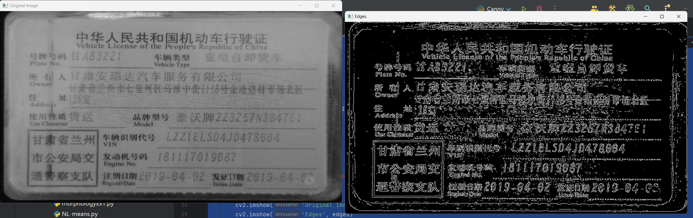

## 2.1 图像金字塔

图像金字塔（Image Pyramid）是一种在不同分辨率下表示同一图像的数据结构。图像金字塔广泛应用于计算机视觉中的多种任务，如特征匹配、目标检测、图像融合等。它通常由多个按比例缩小的图像组成，这些图像从原始图像开始，逐渐缩小分辨率。

**图像金字塔的类型**

主要有两种类型的图像金字塔：

1. **高斯金字塔（Gaussian Pyramid）**：
   高斯金字塔中的每一层都是前一层图像的一个降采样版本。每一层图像都是通过应用一个低通滤波器（通常是高斯滤波器）然后下采样得到的。这样可以保持图像的主要特征，同时降低分辨率。高斯金字塔通常用于图像融合、多分辨率分析等。

2. **拉普拉斯金字塔（Laplacian Pyramid）**：
   拉普拉斯金字塔是基于高斯金字塔构建的，它的每一层表示的是相邻两层高斯金字塔图像之间的差异。具体来说，每一层拉普拉斯金字塔都是通过对上一层高斯金字塔图像进行上采样后，与当前层高斯金字塔图像相减得到的结果。拉普拉斯金字塔主要用于图像压缩、图像融合等领域。

**应用场景**

图像金字塔的一些应用场景包括：

- **图像融合**：通过将不同来源的图像转换为拉普拉斯金字塔，可以在多个尺度上进行融合，最后重建得到融合后的图像。
- **目标检测**：在不同尺度的图像上进行目标检测可以提高检测的准确性，特别是在检测不同大小的目标时。
- **特征匹配**：在多尺度上进行特征匹配，可以增强匹配的鲁棒性。
- **图像压缩**：拉普拉斯金字塔可以用于无损或近似无损的图像压缩。

**使用 OpenCV 构建图像金字塔**

在 OpenCV 中，可以方便地构建高斯金字塔和拉普拉斯金字塔。以下是创建这两种金字塔的基本方法：

**创建高斯金字塔**

```python
# _*_ coding: utf-8 _*_
"""
Time:     2024/9/17 下午7:19
Author:   EasonShu
Version:  V 0.1
File:     pyrDown.py
Describe: 
"""
if __name__ == '__main__':
    import cv2
    import numpy as np
    image_path = 'images/img_2.png'
    # 读取图像
    image = cv2.imread(image_path)
    # 创建高斯金字塔
    level = 3  # 金字塔的层数
    gaussian_pyramid = [image]
    for i in range(level):
        image = cv2.pyrDown(image)
        gaussian_pyramid.append(image)
    cv2.imshow('Original Image', image)
    cv2.imshow('Gaussian Pyramid', gaussian_pyramid[level])
    cv2.waitKey(0)
    cv2.destroyAllWindows()

```

**创建拉普拉斯金字塔**

```python
# _*_ coding: utf-8 _*_
"""
Time:     2024/9/17 下午7:22
Author:   EasonShu
Version:  V 0.1
File:     pyrUp.py
Describe: 
"""
if __name__ == '__main__':
    import cv2
    import numpy as np
    image_path = 'images/img_2.png'
    # 读取图像
    image = cv2.imread(image_path)
    # 创建高斯金字塔
    level = 3  # 金字塔的层数
    gaussian_pyramid = [image]
    for i in range(level):
        image = cv2.pyrDown(image)
        gaussian_pyramid.append(image)

    # 基于上面创建的高斯金字塔创建拉普拉斯金字塔
    laplacian_pyramid = [gaussian_pyramid[level]]
    for i in range(level, 0, -1):
        size = (gaussian_pyramid[i - 1].shape[1], gaussian_pyramid[i - 1].shape[0])
        upsampled = cv2.pyrUp(gaussian_pyramid[i], dstsize=size)
        diff = cv2.subtract(gaussian_pyramid[i - 1], upsampled)
        laplacian_pyramid.append(diff)
    # 显示金字塔
    for i in range(level + 1):
        cv2.imshow(f'Level {i}', laplacian_pyramid[i])
        cv2.waitKey(0)
        cv2.destroyAllWindows()
```

## 3.1 轮廓

轮廓可以简单地解释为连接具有相同颜色或强度的所有连续点(沿边界)的曲线。轮廓是用于形状分析以及对象检测和识别的有用工具。

- 为了获得更高的准确性，请使用二进制图像。因此，在找到轮廓之前，请应用阈值或 **Canny** 边缘检测。
- 从OpenCV 3.2开始，**[findContours()](https://docs.opencv.org/4.0.0/d3/dc0/group__imgproc__shape.html#gadf1ad6a0b82947fa1fe3c3d497f260e0)** 不再修改源图像。
- 在OpenCV中，找到轮廓就像从黑色背景中找到白色物体。因此请记住，要找到的对象应该是白色，背景应该是黑色。

### 3.1.1 基本用法

`findContours` 是 OpenCV 提供的一个函数，用于查找图像中的轮廓。轮廓可以理解为图像中具有相同颜色或强度的连续边界。在计算机视觉和图像处理中，轮廓检测常用于对象分割、形状识别、手势识别等多种应用。

**`findContours` 函数的基本用法**

在 OpenCV 中，`findContours` 函数的调用方式如下：

```python
image, contours, hierarchy = cv2.findContours(image, mode, method, offset=None)
```

其中：
- `image`：输入图像应该是二值化的，通常是通过阈值化或其他二值化方法得到的单通道图像。
- `mode`：指定了轮廓检索的方式，常见的有：
  - `cv2.RETR_EXTERNAL`：只检测最外层轮廓。
  - `cv2.RETR_LIST`：检测所有轮廓，并返回一个列表。
  - `cv2.RETR_CCOMP`：检测所有轮廓，并建立层级关系（二级树形结构）。
  - `cv2.RETR_TREE`：检测所有轮廓，并建立层级关系（完全树形结构）。
- `method`：指定了轮廓近似的方法，常见的有：
  - `cv2.CHAIN_APPROX_NONE`：保存轮廓上的所有点。
  - `cv2.CHAIN_APPROX_SIMPLE`：压缩水平、垂直和对角方向的元素，只保留端点。
  - `cv2.CHAIN_APPROX_TC89_L1` 和 `cv2.CHAIN_APPROX_TC89_KCOS`：使用 Teh-Chin 近似算法。
- `offset`：轮廓点的偏移量，默认为 `(0, 0)`。

`findContours` 返回三个值：
- `contours`：是一个列表，包含了图像中的所有轮廓。每个轮廓都是一个 Numpy 数组，存储了轮廓点的坐标。
- `hierarchy`：是一个数组，提供了轮廓间的层次关系。对于每个轮廓，`hierarchy` 数组包含四个值，分别代表下一个轮廓、前一个轮廓、父轮廓和内嵌轮廓的索引。如果不存在对应的轮廓，则相应的值为 `-1`。

```python
# _*_ coding: utf-8 _*_
"""
Time:     2024/9/17 下午7:27
Author:   EasonShu
Version:  V 0.1
File:     findContours.py
Describe: 
"""
if __name__ == '__main__':
    import cv2
    image_path = 'images/img_2.png'
    # 加载图像并转换为灰度图
    image = cv2.imread(image_path)
    gray = cv2.cvtColor(image, cv2.COLOR_BGR2GRAY)
    # 二值化处理
    _, thresh = cv2.threshold(gray, 127, 255, cv2.THRESH_BINARY_INV + cv2.THRESH_OTSU)
    # 查找轮廓
    contours, hierarchy = cv2.findContours(thresh, cv2.RETR_EXTERNAL, cv2.CHAIN_APPROX_SIMPLE)
    # 绘制轮廓
    cv2.drawContours(image, contours, -1, (0, 255, 0), 3)
    # 显示结果
    cv2.imshow('Threshold', thresh)
    cv2.imshow('Contours', image)
    cv2.waitKey(0)
    cv2.destroyAllWindows()
```

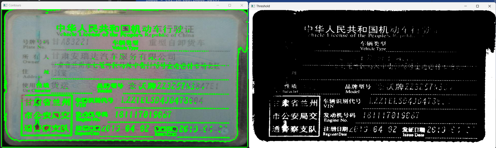

### 3.1.2 轮廓特征

轮廓特征是指从图像中提取的轮廓所具有的属性或特性，这些特征可以用于描述轮廓的几何属性、形状特征以及位置信息等。在计算机视觉和图像处理中，轮廓特征提取是许多任务的基础，比如物体识别、形状分类、手势识别等。以下是一些常用的轮廓特征：

**几何特征**

1. **面积（Area）**：
   - 计算轮廓所包围的面积大小。
   - 可以通过 `cv2.contourArea(contour)` 获取。

2. **周长（Perimeter）**：
   - 计算轮廓的周长。
   - 可以通过 `cv2.arcLength(contour, closed=True)` 获取。

3. **中心（Centroid）**：
   - 计算轮廓的质心位置。
   - 可以通过 `cv2.moments(contour)` 获取轮廓的矩（moments），然后根据矩计算质心。

4. **矩形包围盒（Bounding Box）**：
   - 计算最小的轴平行矩形，该矩形完全包围轮廓。
   - 可以通过 `cv2.boundingRect(contour)` 获取。

5. **旋转矩形包围盒（Rotated Bounding Box）**：
   - 计算最小的旋转矩形，该矩形完全包围轮廓。
   - 可以通过 `cv2.minAreaRect(contour)` 获取。

6. **最小外接圆（Min Enclosing Circle）**：
   - 计算最小的圆，该圆完全包围轮廓。
   - 可以通过 `cv2.minEnclosingCircle(contour)` 获取。

7. **凸包（Convex Hull）**：
   - 计算轮廓的凸包，即最小的凸多边形，该多边形完全包围轮廓。
   - 可以通过 `cv2.convexHull(contour)` 获取。

**形状特征**

8. **长宽比（Aspect Ratio）**：
   - 计算轮廓的长宽比，可以帮助区分长条形和圆形等形状。
   - 可以通过轮廓的边界框计算得出。

9. **扩展率（Extent）**：
   - 计算轮廓面积与其边界框面积的比例。
   - 可以通过轮廓面积和边界框面积计算得出。

10. **固体度（Solidity）**：
    - 计算轮廓面积与其凸包面积的比例。
    - 可以通过轮廓面积和凸包面积计算得出。

11. **等效直径（Equivalent Diameter）**：
    - 计算与轮廓面积相同的圆形的直径。
    - 可以通过轮廓面积计算得出。

12. **椭圆拟合（Ellipse Fit）**：
    - 计算拟合轮廓的最佳椭圆。
    - 可以通过 `cv2.fitEllipse(contour)` 获取。

13. **形状因子（Shape Factor）**：
    - 包括多种因子，如圆度（Circularity）、矩形度（Rectangularity）等。
    - 圆度可以通过轮廓周长和面积计算得出。

**方向特征**

14. **主轴方向（Major Axis Direction）**：
    - 计算轮廓的主轴方向。
    - 可以通过旋转矩形或者椭圆拟合获得。


```python
# _*_ coding: utf-8 _*_
"""
Time:     2024/9/17 下午7:27
Author:   EasonShu
Version:  V 0.1
File:     findContours.py
Describe: 
"""
if __name__ == '__main__':
    import cv2
    import numpy as np

    # 加载图像并转换为灰度图
    image_path = 'images/img_2.png'
    image = cv2.imread(image_path)
    gray = cv2.cvtColor(image, cv2.COLOR_BGR2GRAY)

    # 二值化处理
    _, thresh = cv2.threshold(gray, 127, 255, cv2.THRESH_BINARY_INV + cv2.THRESH_OTSU)

    # 查找轮廓
    contours, _ = cv2.findContours(thresh, cv2.RETR_EXTERNAL, cv2.CHAIN_APPROX_SIMPLE)

    # 遍历所有轮廓
    for contour in contours:
        # 计算轮廓面积
        area = cv2.contourArea(contour)

        # 计算轮廓周长
        perimeter = cv2.arcLength(contour, True)

        # 计算轮廓的质心
        M = cv2.moments(contour)
        if M["m00"] != 0:
            cX = int(M["m10"] / M["m00"])
            cY = int(M["m01"] / M["m00"])

        # 计算轮廓的边界框
        x, y, w, h = cv2.boundingRect(contour)

        # 计算轮廓的旋转矩形包围盒
        rect = cv2.minAreaRect(contour)

        # 计算轮廓的最小外接圆
        (cx, cy), radius = cv2.minEnclosingCircle(contour)

        # 计算轮廓的凸包
        hull = cv2.convexHull(contour)

        # # 计算轮廓的椭圆拟合
        # ellipse = cv2.fitEllipse(contour)

        # 绘制轮廓和相关特征
        # cv2.drawContours(image, [contour], -1, (0, 255, 0), 2)
        cv2.rectangle(image, (x, y), (x + w, y + h), (0, 0, 255), 2)
        # cv2.circle(image, (int(cx), int(cy)), int(radius), (255, 0, 0), 2)
        # cv2.ellipse(image, ellipse, (255, 0, 0), 2)
        # cv2.drawContours(image, [hull], -1, (0, 255, 255), 2)

    # 显示结果
    cv2.imshow('Contours and Features', image)
    cv2.waitKey(0)
    cv2.destroyAllWindows()
```

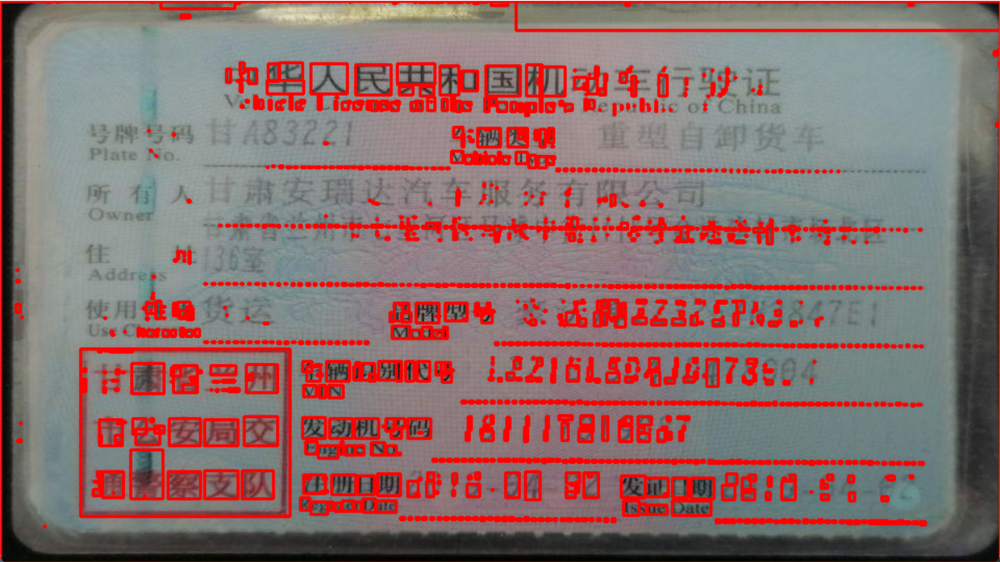

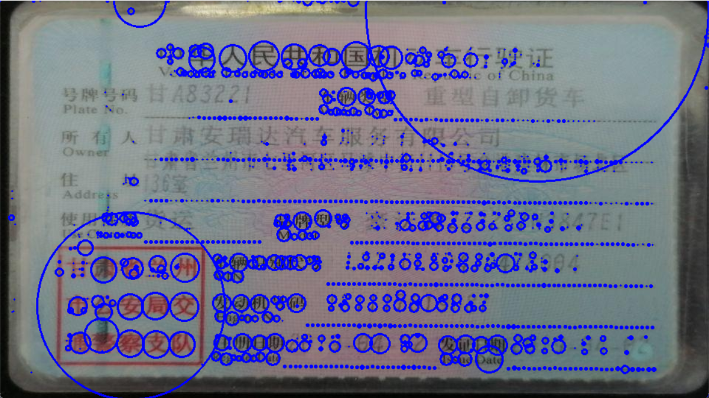

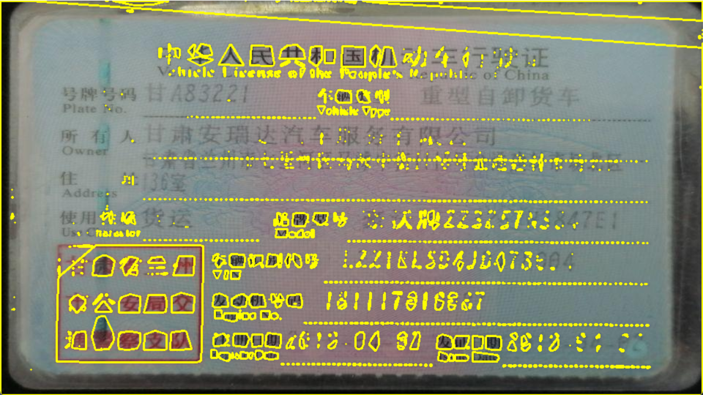

### 3.1.3 轮廓形状近似

轮廓形状近似是计算机视觉中一个重要的概念，它用于简化轮廓的表示，同时保留其主要特征。通过轮廓形状近似，可以减少计算成本，并使得轮廓更加易于分析和处理。在 OpenCV 中，可以使用 `cv2.approxPolyDP` 函数来实现轮廓的形状近似。

**`approxPolyDP` 函数详解**

`cv2.approxPolyDP` 函数的语法如下：

```python
approximated_contour = cv2.approxPolyDP(curve, epsilon, closed)
```

- **curve**：输入的轮廓，通常是一个二维数组，每一行代表一个点的坐标。
- **epsilon**：近似的精度参数。这是一个标量值，表示从原始轮廓到近似轮廓的最大距离。通常，它是轮廓长度的一个比例系数。
- **closed**：布尔值，指示轮廓是否闭合。

**参数 `epsilon` 的选择**

`epsilon` 参数的选择非常重要，它直接影响到近似轮廓的质量。如果 `epsilon` 设置得太大，近似后的轮廓将丢失很多细节；如果 `epsilon` 太小，近似轮廓将非常接近原始轮廓，但可能仍然包含不必要的点。

一个常用的经验公式是将 `epsilon` 设定为轮廓周长的一个小比例，例如：

```python
epsilon = 0.01 * cv2.arcLength(curve, True)
approximated_contour = cv2.approxPolyDP(curve, epsilon, True)
```

这里的 `0.01` 可以根据实际情况调整，以达到所需的近似程度。

```python
# _*_ coding: utf-8 _*_
"""
Time:     2024/9/17 下午7:38
Author:   EasonShu
Version:  V 0.1
File:     approxPolyDP.py
Describe: 
"""
if __name__ == '__main__':
    import cv2
    import numpy as np

    # 加载图像并转换为灰度图
    image_path = 'images/img_2.png'
    image = cv2.imread(image_path)
    # 加载图像
    gray = cv2.imread(image_path, cv2.IMREAD_GRAYSCALE)  # 以灰度模式读取图片

    # 二值化处理
    _, thresh = cv2.threshold(gray, 127, 255, cv2.THRESH_BINARY_INV + cv2.THRESH_OTSU)

    # 查找轮廓
    contours, _ = cv2.findContours(thresh, cv2.RETR_EXTERNAL, cv2.CHAIN_APPROX_SIMPLE)

    # 遍历所有轮廓并进行形状近似
    for contour in contours:
        # 计算轮廓的周长
        perimeter = cv2.arcLength(contour, True)

        # 设置近似精度为周长的一定比例
        epsilon = 0.01 * perimeter

        # 进行形状近似
        approximated_contour = cv2.approxPolyDP(contour, epsilon, True)

        # 绘制原始轮廓和近似轮廓
        cv2.drawContours(image, [contour], -1, (0, 255, 0), 2)
        cv2.drawContours(image, [approximated_contour], -1, (0, 0, 255), 2)

    # 显示结果
    cv2.imshow('Contours and Approximated Contours', image)
    cv2.waitKey(0)
    cv2.destroyAllWindows()
```

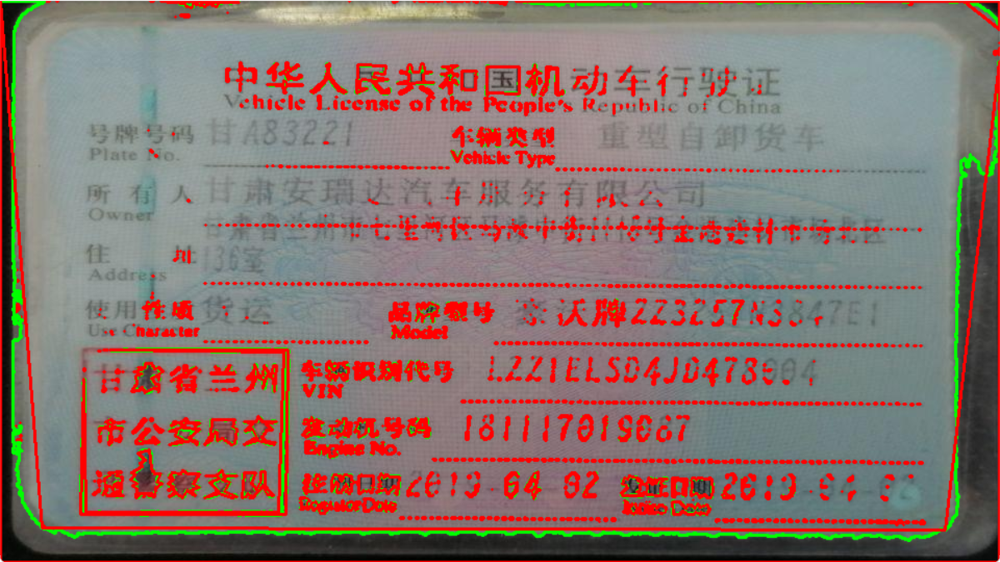

### 3.1.4 凸包

凸包（Convex Hull）是指一组点的最小凸多边形，它可以完全包含这些点。在计算机图形学、计算几何学以及计算机视觉中，凸包是一个非常有用的工具，用于描述点集的几何边界。凸包的应用范围非常广泛，包括但不限于物体轮廓分析、特征提取、形状识别等。

**凸包的概念**

给定一组点 \( P \)，凸包是所有包含 \( P \) 的凸多边形中边数最少的那个多边形。换句话说，凸包是通过连接这些点中的某些点形成的多边形，使得任何属于 \( P \) 的点都不会位于这个多边形之外。

**OpenCV 中的凸包函数**

在 OpenCV 中，可以使用 `cv2.convexHull()` 函数来计算轮廓的凸包。该函数的语法如下：

```python
hull = cv2.convexHull(points[, clockwise[, returnPoints]])
```

- **points**：输入的点集，通常是一个二维数组，每行表示一个点的坐标。
- **clockwise**：布尔值，指示输出的点是否按顺时针方向排序，默认为逆时针。
- **returnPoints**：布尔值，如果为 `True`，则返回原始输入点；如果为 `False`，则返回索引。

```python
# _*_ coding: utf-8 _*_
"""
Time:     2024/9/17 下午7:42
Author:   EasonShu
Version:  V 0.1
File:     convexHull.py
Describe: 
"""
if __name__ == '__main__':
    import cv2
    import numpy as np

    # 加载图像并转换为灰度图
    image_path = 'images/img_2.png'
    image = cv2.imread(image_path)
    gray = cv2.cvtColor(image, cv2.COLOR_BGR2GRAY)

    # 二值化处理
    _, thresh = cv2.threshold(gray, 127, 255, cv2.THRESH_BINARY_INV + cv2.THRESH_OTSU)

    # 查找轮廓
    contours, _ = cv2.findContours(thresh, cv2.RETR_EXTERNAL, cv2.CHAIN_APPROX_SIMPLE)

    # 遍历所有轮廓并计算凸包
    for contour in contours:
        # 计算轮廓的凸包
        hull = cv2.convexHull(contour)

        # 绘制原始轮廓
        cv2.drawContours(image, [contour], -1, (0, 255, 0), 2)

        # 绘制凸包
        cv2.drawContours(image, [hull], -1, (0, 0, 255), 2)

    # 显示结果
    cv2.imshow('Contours and Convex Hulls', image)
    cv2.waitKey(0)
    cv2.destroyAllWindows()
```

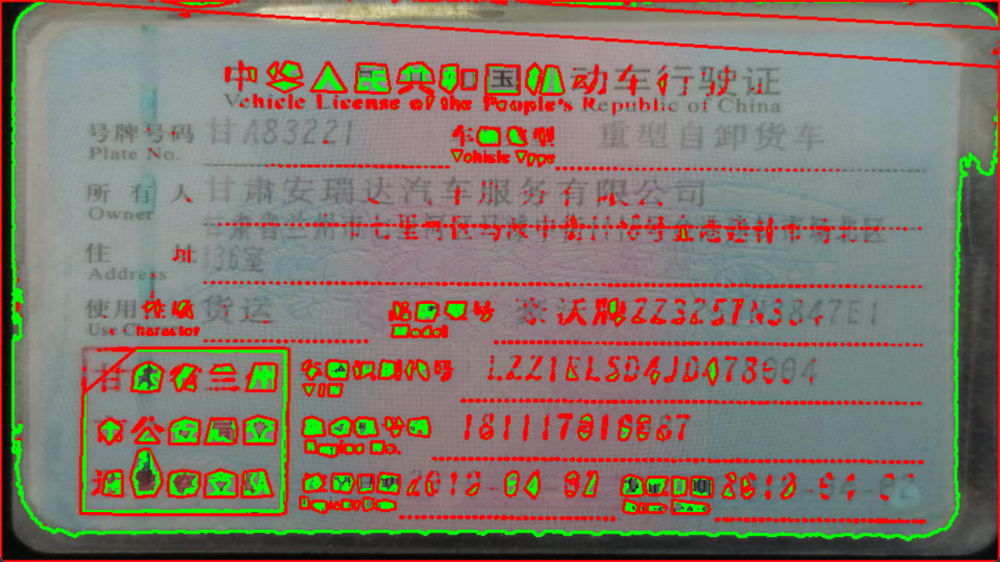

## 4.1 图像直方图


- 图像直方图是一种描述图像中亮度或颜色分布的统计图表。它显示了图像中不同强度级别（对于灰度图像）或颜色（对于彩色图像）的像素数量。直方图在图像处理和计算机视觉中非常有用，可以用来进行各种操作，比如图像增强、特征提取以及图像对比等。
- 在 OpenCV 中，可以通过 `cv2.calcHist()` 函数来计算图像的直方图。

```python
# _*_ coding: utf-8 _*_
"""
Time:     2024/9/18 下午7:37
Author:   EasonShu
Version:  V 0.1
File:     calcHist.py
Describe: 
"""
if __name__ == '__main__':
    import cv2
    import matplotlib.pyplot as plt

    # 读取图像
    image_path = 'images/img_2.png'
    image = cv2.imread(image_path)

    # 检查是否正确加载图像
    if image is None:
        print("无法加载图像，请检查路径是否正确")
    else:
        # 如果需要，可以转换颜色空间从 BGR 到 RGB
        image_rgb = cv2.cvtColor(image, cv2.COLOR_BGR2RGB)

        # 计算直方图
        hist = cv2.calcHist([image_rgb], [0], None, [256], [0, 256])

        # 绘制直方图
        plt.figure()
        plt.title("Grayscale Histogram")
        plt.xlabel("Bins")
        plt.ylabel("# of Pixels")
        plt.plot(hist)
        plt.xlim([0, 256])
        plt.show()
```

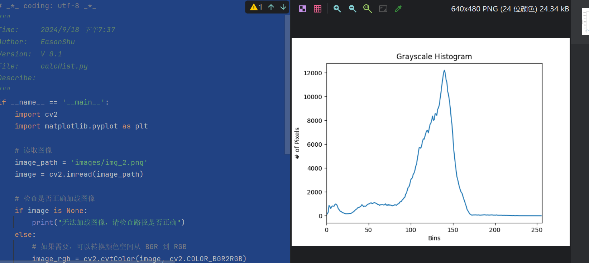

### 4.1.1 直方图均衡化

直方图均衡化（Histogram Equalization）是一种在图像处理中用来改善图像对比度的技术。它通过重新分配图像的亮度值来增强图像的整体对比度，从而使得图像看起来更加清晰。直方图均衡化通常适用于增强具有非均匀光照条件的图像中的细节。

```python
# _*_ coding: utf-8 _*_
"""
Time:     2024/9/18 下午7:37
Author:   EasonShu
Version:  V 0.1
File:     calcHist.py
Describe: 
"""
import cv2
import numpy as np
import matplotlib.pyplot as plt

if __name__ == '__main__':
    # 读取图像
    image_path = 'images/img_2.png'
    image = cv2.imread(image_path)

    # 检查是否正确加载图像
    if image is None:
        print("无法加载图像，请检查路径是否正确")
    else:
        # 转换为灰度图像
        gray_image = cv2.cvtColor(image, cv2.COLOR_BGR2GRAY)

        # 执行直方图均衡化
        equalized_image = cv2.equalizeHist(gray_image)

        # 显示原始图像及其直方图
        plt.figure(figsize=(12, 6))
        plt.subplot(1, 2, 1)
        plt.imshow(gray_image, cmap='gray')
        plt.title('Original Image')
        plt.axis('off')

        # 计算原始图像的直方图
        hist_original, bins = np.histogram(gray_image.flatten(), 256, [0, 256])
        cdf_original = hist_original.cumsum()
        cdf_normalized = cdf_original * hist_original.max() / cdf_original.max()

        plt.subplot(1, 2, 2)
        plt.plot(cdf_normalized, color='b')
        plt.hist(gray_image.flatten(), 256, [0, 256], color='r')
        plt.xlim([0, 256])
        plt.legend(('cdf', 'histogram'), loc='upper left')
        plt.title('Original Histogram')

        # 显示均衡化后的图像及其直方图
        plt.figure(figsize=(12, 6))
        plt.subplot(1, 2, 1)
        plt.imshow(equalized_image, cmap='gray')
        plt.title('Equalized Image')
        plt.axis('off')

        # 计算均衡化后图像的直方图
        hist_equalized, bins = np.histogram(equalized_image.flatten(), 256, [0, 256])
        cdf_equalized = hist_equalized.cumsum()
        cdf_equalized_normalized = cdf_equalized * hist_equalized.max() / cdf_equalized.max()

        plt.subplot(1, 2, 2)
        plt.plot(cdf_equalized_normalized, color='b')
        plt.hist(equalized_image.flatten(), 256, [0, 256], color='r')
        plt.xlim([0, 256])
        plt.legend(('cdf', 'histogram'), loc='upper left')
        plt.title('Equalized Histogram')

        plt.show()
```

## 5.1 图像转换

### 5.1.1 傅立叶变换（难点）

傅立叶变换用于分析各种滤波器的频率特性。对于图像，使用 **2D离散傅里叶变换（DFT）** 查找频域。快速算法称为 **快速傅立叶变换（FFT）** 用于计算DFT。

- 参考文章：https://www.cnblogs.com/h2zZhou/p/8405717.html
- 参考文章：https://zhuanlan.zhihu.com/p/19759362

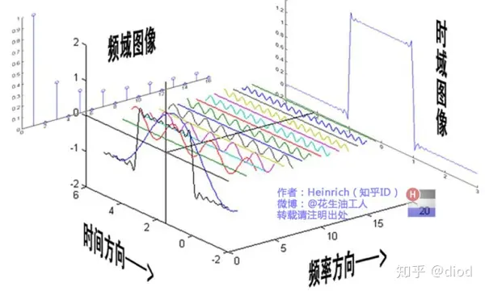

- 我们平时看到的函数图像是沿着时间方向的，所有的正弦波叠加的结果，即上图的时域图像所示，傅里叶变换之后得到的结果是沿着频率方向的所看到的结果，将一个随时间变化的波形分解成各个不同频率的正弦波图像，这些正弦波有不同的幅度和相位，幅度对应的图像是上图所示的频域图像，相位对应的是从下面往上看的时候每一个不同频率的波形的第一个波峰点的相对位置，上图没有表示出来， 结果将是一个类似上图频域图像的图像。

- 傅立叶变换（Fourier Transform）是其中一种非常重要的数学工具，它可以将信号从空间域转换到频率域，使得我们可以分析信号中的频率成分。
- 在 OpenCV 中，可以使用 `cv2.dft()` 和 `cv2.idft()` 函数来执行离散傅立叶变换（Discrete Fourier Transform, DFT）及其逆变换。此外，OpenCV 也提供了 `cv2.fft()` 和 `cv2.ifft()` 函数，它们是 `dft` 和 `idft` 的更高级封装，简化了调用过程。

## 6.1 模版匹配

- 模板匹配是一种在较大图像中搜索和查找模板图像位置的方法。为此，OpenCV 带有一个函数 **[cv.matchTemplate（）](https://apachecn.github.io/opencv-doc-zh/#/../../df/dfb/group__imgproc__object.html?id=ga586ebfb0a7fb604b35a23d85391329be)** 。
- 它只是在输入图像上滑动模板图像（如在 2D 卷积中），并比较模板图像下的模板和输入图像的补丁。

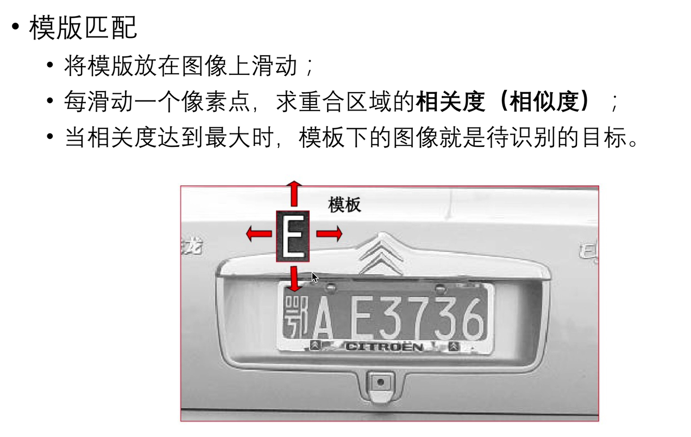

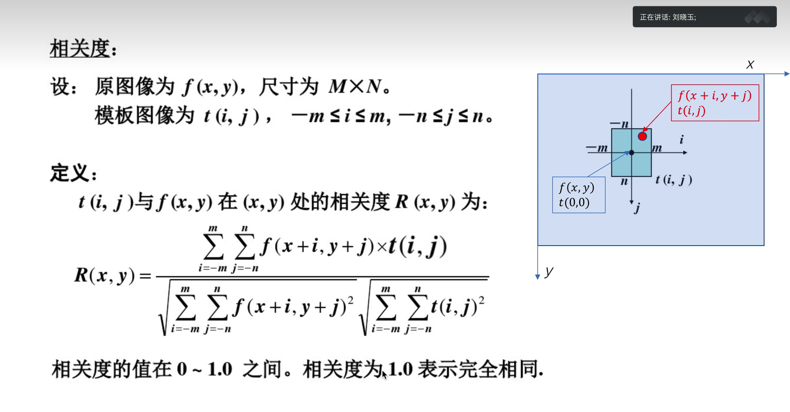
