- 官网：https://apachecn.github.io/opencv-doc-zh/#/

## 1.1 图像几何变换

- OpenCV 提供了两个转换函数，**[cv.warpAffine](https://docs.opencv.org/4.0.0/da/d54/group__imgproc__transform.html#ga0203d9ee5fcd28d40dbc4a1ea4451983)** 和 **[cv.warpPerspective](https://docs.opencv.org/4.0.0/da/d54/group__imgproc__transform.html#gaf73673a7e8e18ec6963e3774e6a94b87)\**，可以进行各种转换。***
- **[cv.warpAffine](https://docs.opencv.org/4.0.0/da/d54/group__imgproc__transform.html#ga0203d9ee5fcd28d40dbc4a1ea4451983)** 采用 2x3 变换矩阵，而 **[cv.warpPerspective](https://docs.opencv.org/4.0.0/da/d54/group__imgproc__transform.html#gaf73673a7e8e18ec6963e3774e6a94b87)** 采用 3x3 变换矩阵作为输入。

### 1.1.1 缩放

- 缩放是调整图片的大小。
- OpenCV 使用 **[cv.resize()](https://docs.opencv.org/4.0.0/da/d54/group__imgproc__transform.html#ga47a974309e9102f5f08231edc7e7529d)** 函数进行调整。
- 可以手动指定图像的大小，也可以指定比例因子。可以使用不同的插值方法。
- 对于下采样(图像上缩小)，最合适的插值方法是 **[cv.INTER_AREA](https://docs.opencv.org/4.0.0/da/d54/group__imgproc__transform.html#gga5bb5a1fea74ea38e1a5445ca803ff121acf959dca2480cc694ca016b81b442ceb)** 对于上采样(放大),最好的方法是 **[cv.INTER_CUBIC](https://docs.opencv.org/4.0.0/da/d54/group__imgproc__transform.html#gga5bb5a1fea74ea38e1a5445ca803ff121a55e404e7fa9684af79fe9827f36a5dc1)** （速度较慢）和 **[cv.INTER_LINEAR](https://docs.opencv.org/4.0.0/da/d54/group__imgproc__transform.html#gga5bb5a1fea74ea38e1a5445ca803ff121ac97d8e4880d8b5d509e96825c7522deb)** (速度较快)。默认情况下，所使用的插值方法都是 **[cv.INTER_AREA](https://docs.opencv.org/4.0.0/da/d54/group__imgproc__transform.html#gga5bb5a1fea74ea38e1a5445ca803ff121acf959dca2480cc694ca016b81b442ceb)** 。

```python
# _*_ coding: utf-8 _*_
"""
Time:     2024/9/17 下午2:01
Author:   EasonShu
Version:  V 0.1
File:     ResizeDemo.py
Describe: 
"""
import cv2

if __name__ == '__main__':
    image_path = 'images/img_2.png'
    image = cv2.imread(image_path)
    print(image.shape)
    imagesNew= cv2.resize(image, (640, 480), interpolation=cv2.INTER_AREA)
    cv2.imshow('resize', imagesNew)
    cv2.waitKey(0)
```

### 1.1.2 平移变换

- 平移变换是物体位置的移动。如果知道 **（x，y）** 方向的偏移量，假设为 **(t_x,t_y)\**，则可以创建如下转换矩阵 \**M**：

在 OpenCV 中使用 `warpAffine` 函数时，你需要提供三个主要参数：

1. **源图像（src）** - 你想转换的原始图像。
2. **输出图像（dst）** - 转换后的图像将会存储在这里。
3. **变换矩阵（M）** - 这是一个 2x3 的矩阵，包含了仿射变换的系数。这个矩阵可以由平移向量和旋转、缩放等操作的系数组成。

- opencv 提供了一个函数， **[cv.getRotationMatrix2D](https://docs.opencv.org/4.0.0/da/d54/group__imgproc__transform.html#gafbbc470ce83812914a70abfb604f4326)** 。

```python
# _*_ coding: utf-8 _*_
"""
Time:     2024/9/17 下午2:04
Author:   EasonShu
Version:  V 0.1
File:     WarpAffineDemo.py
Describe: 
"""
import cv2

if __name__ == '__main__':
    image_path = 'images/img_2.png'
    image = cv2.imread(image_path)
    image_height, image_width = image.shape[:2]
    print(image_height, image_width)
    center = (image_width / 2, image_height / 2)
    angle = 30
    scale = 1
    # 定义仿射变换矩阵:30度
    M = cv2.getRotationMatrix2D(center, angle, scale)
    rotated = cv2.warpAffine(image, M, (image_width, image_height))
    cv2.imshow('rotated', rotated)
    cv2.waitKey(0)
    cv2.destroyAllWindows()
```


### 1.1.3 仿射变换

1. **平移（Translation）**： 平移是将图像中的每一个像素都沿着水平和垂直方向移动固定的距离。

1. **旋转（Rotation）**： 绕着图像的某一点（通常是中心点）旋转一定的角度。变换矩阵为：
2. **缩放（Scaling）**： 按照特定的比例因子改变图像的大小。
3. **剪切（Shear）**： 在给定的方向上按照一定的比例改变形状。

**案例 1：图像平移**

假设我们需要将一幅图像在水平方向上向右平移 50 个像素，在垂直方向上向下平移 30 个像素。

```python
# _*_ coding: utf-8 _*_
"""
Time:     2024/9/17 下午2:04
Author:   EasonShu
Version:  V 0.1
File:     WarpAffineDemo.py
Describe: 
"""
import cv2
import numpy as np

if __name__ == '__main__':
    image_path = 'images/img_2.png'
    image = cv2.imread(image_path)
    # 设置平移矩阵
    tx = 50
    ty = 30
    M = np.float32([[1, 0, tx], [0, 1, ty]])
    # 应用仿射变换
    translated_image = cv2.warpAffine(image, M, (image.shape[1], image.shape[0]))
    # 显示结果
    cv2.imshow('Translated Image', translated_image)
    cv2.waitKey(0)
    cv2.destroyAllWindows()
```

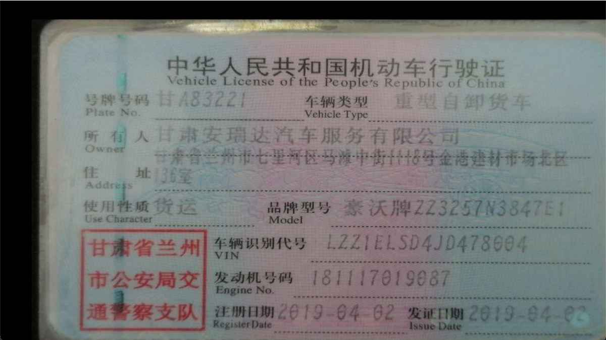

 **2：图像旋转**

如果我们想将图像顺时针旋转 45 度，并确保旋转后图像的尺寸不变。

```python
# _*_ coding: utf-8 _*_
"""
Time:     2024/9/17 下午2:04
Author:   EasonShu
Version:  V 0.1
File:     WarpAffineDemo.py
Describe: 
"""
import cv2
import numpy as np

if __name__ == '__main__':
    image_path = 'images/img_2.png'
    image = cv2.imread(image_path)
    # 获取图像尺寸
    rows, cols, _ = image.shape

    # 计算旋转中心
    center = (cols / 2, rows / 2)

    # 设置旋转矩阵
    angle = 45  # 旋转角度
    scale = 1.0  # 缩放比例
    M = cv2.getRotationMatrix2D(center, angle, scale)

    # 应用仿射变换
    rotated_image = cv2.warpAffine(image, M, (cols, rows))

    # 显示结果
    cv2.imshow('Rotated Image', rotated_image)
    cv2.waitKey(0)
    cv2.destroyAllWindows()
```


**案例 3：图像缩放**

如果我们要将图像按比例缩小到原来的 50%，并且保持图像的中心位置不变。


```python
# _*_ coding: utf-8 _*_
"""
Time:     2024/9/17 下午2:04
Author:   EasonShu
Version:  V 0.1
File:     WarpAffineDemo.py
Describe: 
"""
import cv2
import numpy as np

if __name__ == '__main__':
    image_path = 'images/img_2.png'
    image = cv2.imread(image_path)
    # 获取图像尺寸
    rows, cols, _ = image.shape

    # 计算缩放矩阵
    scale = 0.5
    M = np.float32([[scale, 0, (1 - scale) * cols / 2],
                    [0, scale, (1 - scale) * rows / 2]])

    # 应用仿射变换
    scaled_image = cv2.warpAffine(image, M, (int(cols * scale), int(rows * scale)))

    # 显示结果
    cv2.imshow('Scaled Image', scaled_image)
    cv2.waitKey(0)
    cv2.destroyAllWindows()
```

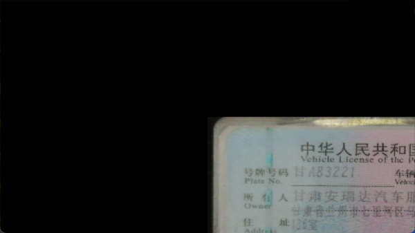

**案例 4：图像剪切**

如果我们要对图像进行剪切变换，使得图像的左侧向右倾斜。

```python
# _*_ coding: utf-8 _*_
"""
Time:     2024/9/17 下午2:04
Author:   EasonShu
Version:  V 0.1
File:     WarpAffineDemo.py
Describe: 
"""
import cv2
import numpy as np

if __name__ == '__main__':
    image_path = 'images/img_2.png'
    image = cv2.imread(image_path)
    # 设置剪切矩阵
    sh = 0.5  # 剪切因子
    M = np.float32([[1, sh, -sh * image.shape[1] / 2], [0, 1, 0]])

    # 应用仿射变换
    sheared_image = cv2.warpAffine(image, M, (int(image.shape[1] * (1 + abs(sh))), image.shape[0]))

    # 显示结果
    cv2.imshow('Sheared Image', sheared_image)
    cv2.waitKey(0)
    cv2.destroyAllWindows()
```


### 1.1.4 透视变换

透视转换（Perspective Transformation）是一种几何变换技术，用于模拟从一个视角观察到另一个视角的变化，常用于纠正图像中的透视失真。这种变换对于处理非平面场景尤其有用，比如校正倾斜的文档图像、调整摄像头视角或者进行虚拟现实中的视图变换等。

在二维空间中，透视变换通过一个 3x3 的矩阵来实现，这个矩阵能够描述四边形到四边形之间的映射。与仿射变换不同的是，透视变换能够处理图像中的非平行线，使其在变换后依然保持非平行状态。

**透视变换的原理**

透视变换的数学模型可以用以下方程表示：


$$
\begin{align*}
x' &= \frac{a_{11}x + a_{12}y + a_{13}}{a_{31}x + a_{32}y + a_{33}} \\
y' &= \frac{a_{21}x + a_{22}y + a_{23}}{a_{31}x + a_{32}y + a_{33}}
\end{align*}
$$


这里的 \((x, y)\) 是原图上的点，而 \((x', y')\) 是变换后的点。

**使用 OpenCV 进行透视变换**

在 OpenCV 中，可以使用 `cv2.getPerspectiveTransform()` 和 `cv2.warpPerspective()` 来实现透视变换。首先需要确定四个对应点，然后计算出透视变换矩阵，最后应用该矩阵进行变换。

假设我们有一张图片，其中包含一个矩形区域，但由于相机的角度问题，这个矩形看起来是倾斜的。我们希望将其校正为标准的矩形。

```python
# _*_ coding: utf-8 _*_
"""
Time:     2024/9/17 下午2:22
Author:   EasonShu
Version:  V 0.1
File:     PerspectiveTransform.py
Describe: 
"""
import cv2
import numpy as np

if __name__ == '__main__':
    image = cv2.imread('images/test02.jpeg')
    # 定义源图像中的四个角点
    src_points = np.float32([[100, 100], [300, 100], [300, 300], [100, 300]])
    # 定义目标图像中的四个角点
    dst_points = np.float32([[0, 0], [300, 0], [300, 300], [0, 300]])
    # 计算透视变换矩阵
    M = cv2.getPerspectiveTransform(src_points, dst_points)
    # 应用透视变换
    width, height = 1920, 1080
    transformed_image = cv2.warpPerspective(image, M, (width, height))
    # 显示结果
    cv2.imshow('Transformed Image', transformed_image)
    cv2.waitKey(0)
    cv2.destroyAllWindows()

```

在这个例子中，我们定义了源图像中的四个角点 `src_points` 和目标图像中的四个角点 `dst_points`。`cv2.getPerspectiveTransform()` 函数计算出透视变换所需的矩阵 `M`，然后使用 `cv2.warpPerspective()` 函数应用这个矩阵来产生变换后的图像。

## 2.1 图像阈值

### 2.1.1 普通阈值方法

图像阈值化（Thresholding）是图像处理中的一种基本技术，用于简化图像并提取感兴趣的信息。通过设定一个阈值，可以将图像分割成两部分：前景和背景。通常，如果像素值高于设定的阈值，则将其标记为前景（例如白色），否则标记为背景（例如黑色）。

在 OpenCV 中，可以使用 `cv2.threshold()` 函数来进行阈值化处理。这个函数接受几个参数，包括输入图像、阈值、最大值以及阈值类型。

**阈值类型**

OpenCV 支持几种不同的阈值类型：

1. **cv2.THRESH_BINARY**：如果像素值大于阈值，则设为最大值，否则设为零。
2. **cv2.THRESH_BINARY_INV**：如果像素值大于阈值，则设为零，否则设为最大值。
3. **cv2.THRESH_TRUNC**：如果像素值大于阈值，则设为阈值，否则保持不变。
4. **cv2.THRESH_TOZERO**：如果像素值大于阈值，则保持不变，否则设为零。
5. **cv2.THRESH_TOZERO_INV**：如果像素值大于阈值，则设为零，否则保持不变。
6. **cv2.THRESH_OTSU**：自动计算最佳阈值（适用于单峰直方图）。

```python
# _*_ coding: utf-8 _*_
"""
Time:     2024/9/17 下午2:26
Author:   EasonShu
Version:  V 0.1
File:     threshold.py
Describe: 
"""
import cv2
import numpy as np
if __name__ == '__main__':
    # 加载图像
    image = cv2.imread('images/test02.jpeg', cv2.IMREAD_GRAYSCALE)
    # 如果图像不是灰度图像，请先转换为灰度图像
    if image is None:
        print("Error: Image not found.")
    else:
        # 设定阈值和最大值
        threshold_value = 127  # 自定义阈值
        max_value = 255  # 最大值为255，即白色
        # 使用cv2.THRESH_BINARY进行二值化
        ret, binary_image = cv2.threshold(image, threshold_value, max_value, cv2.THRESH_BINARY)
        # 显示原始图像和阈值化后的图像
        cv2.imshow('Original Image', image)
        cv2.imshow('Binary Image', binary_image)
        cv2.waitKey(0)
        cv2.destroyAllWindows()

```

### 2.1.2 自适应阈值方法

- 自适应阈值方法（Adaptive Thresholding）是一种动态地为图像的不同区域选择阈值的方法。这种方法特别适用于图像的光照变化较大或背景复杂的情况，因为全局阈值在这种情况下可能无法很好地分割前景和背景。
- 在 OpenCV 中，可以使用 cv2.adaptiveThreshold() 函数来实现自适应阈值化。此函数支持两种自适应方法：
- cv2.ADAPTIVE_THRESH_MEAN_C：阈值是邻域内像素均值减去常数 C。
- cv2.ADAPTIVE_THRESH_GAUSSIAN_C：阈值是邻域内像素加权和减去常数 C，权重是像素距离中心的距离的高斯分布。

**参数说明**

`cv2.adaptiveThreshold()` 函数的基本参数包括：

- **src**：输入图像，通常是灰度图像。
- **maxValue**：超过阈值的最大值。
- **adaptiveMethod**：自适应方法的选择。
- **thresholdType**：二值化类型（例如 cv2.THRESH_BINARY 或 cv2.THRESH_BINARY_INV）。
- **blockSize**：邻域大小，通常是一个奇数，如 3、5、11 等。
- **C**：从均值或加权和中减去的常数值。

```python
# _*_ coding: utf-8 _*_
"""
Time:     2024/9/17 下午2:34
Author:   EasonShu
Version:  V 0.1
File:     Adaptive Thresholding.py
Describe: 
"""
import cv2
import numpy as np

if __name__ == '__main__':
    # 加载图像
    image_path = 'images/img_2.png'
    image = cv2.imread(image_path, cv2.IMREAD_GRAYSCALE)
    # 如果图像不是灰度图像，请先转换为灰度图像
    if image is None:
        print("Error: Image not found.")
    else:
        # 使用平均法进行自适应阈值化
        adaptive_mean = cv2.adaptiveThreshold(image, 255, cv2.ADAPTIVE_THRESH_MEAN_C, cv2.THRESH_BINARY, 11, 2)
        # 使用高斯法进行自适应阈值化
        adaptive_gaussian = cv2.adaptiveThreshold(image, 255, cv2.ADAPTIVE_THRESH_GAUSSIAN_C, cv2.THRESH_BINARY, 11, 2)

        # 显示原始图像、平均法自适应阈值化图像和高斯法自适应阈值化图像
        cv2.imshow('Original Image', image)
        cv2.imshow('Adaptive Mean Threshold', adaptive_mean)
        cv2.imshow('Adaptive Gaussian Threshold', adaptive_gaussian)

        cv2.waitKey(0)
        cv2.destroyAllWindows()
```


### 2.1.3 Otsu 二值化

- Otsu 二值化（Otsu's Binarization）是一种自动确定最佳全局阈值的方法，用于将图像分割成前景和背景。这种方法由日本学者 Nobuyuki Otsu 在 1979 年提出，其核心思想是通过最大化类间方差来找到最优的阈值。这种方法特别适合于具有双峰直方图的图像，即图像中有明显的前景和背景。

**Otsu 方法的工作原理**

Otsu 方法通过分析图像的灰度直方图来确定最佳的阈值。具体步骤如下：

1. **计算图像的灰度直方图**：统计图像中每个灰度级出现的频率。
2. **遍历所有可能的阈值**：从最小的灰度级开始，一直到最大的灰度级。
3. **计算类间方差**：对于每个可能的阈值，计算前景和背景的类间方差。
4. **选择最大类间方差对应的阈值**：选择使类间方差最大的那个阈值作为最佳阈值。

**使用 OpenCV 进行 Otsu 二值化**

在 OpenCV 中，可以通过 `cv2.threshold()` 函数结合 `cv2.THRESH_OTSU` 标志来实现 Otsu 二值化。

```python
# _*_ coding: utf-8 _*_
"""
Time:     2024/9/17 下午2:38
Author:   EasonShu
Version:  V 0.1
File:     Otsu.py
Describe: 
"""
if __name__ == '__main__':
    import cv2
    import numpy as np
    # 加载图像
    image_path = 'images/img_2.png'
    image = cv2.imread(image_path, cv2.IMREAD_GRAYSCALE)

    # 如果图像不是灰度图像，请先转换为灰度图像
    if image is None:
        print("Error: Image not found.")
    else:
        # 使用 Otsu 方法自动确定阈值
        ret, otsu_image = cv2.threshold(image, 0, 255, cv2.THRESH_BINARY + cv2.THRESH_OTSU)

        # 显示原始图像和 Otsu 二值化后的图像
        cv2.imshow('Original Image', image)
        cv2.imshow('Otsu Binarized Image', otsu_image)

        # 打印计算出的最佳阈值
        print(f"Optimal threshold value calculated by Otsu's method: {ret}")

        cv2.waitKey(0)
        cv2.destroyAllWindows()
```

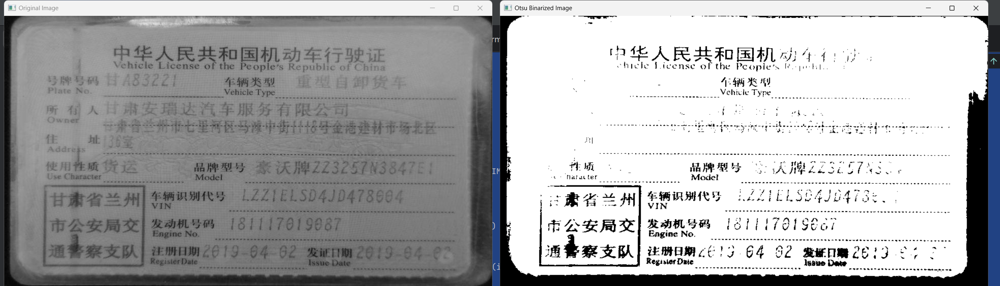

## 3.1 平滑图像

### 3.1.1 二维卷积(图像滤波)

二维卷积在数字图像处理中非常常见，尤其是在计算机视觉和图像识别领域。它主要用于图像滤波，可以实现诸如边缘检测、模糊、锐化等效果。下面是一个简要的介绍以及如何执行二维卷积的基本步骤。

**二维卷积的概念**

二维卷积涉及到两个函数的运算：一个较大的输入图像（通常称为输入信号）和一个小得多的矩阵（通常称为核或滤波器）。卷积运算会将这个小核在输入图像上滑动，并在每个位置与输入图像的一部分进行点积操作，产生一个新的输出值。这个过程重复直到覆盖整个图像区域，从而得到新的输出图像。

**卷积运算步骤**

1. **定义核**：选择一个合适的核大小（如3x3, 5x5等），并赋予特定的权重值。不同的核设计用于捕捉不同的特征，例如水平或垂直边缘。
2. **滑动核**：将核放置在输入图像的一角开始，并按照设定的步长移动（通常是逐像素移动，也可以是跳跃式的）。
3. **计算点积**：对于核覆盖的位置，在核与图像重叠的部分中的每个元素相乘，然后将结果相加得到一个值。
4. **生成输出值**：上述计算的结果就是输出图像的一个像素值。重复这个过程直到核覆盖了输入图像的所有可能的位置。
5. **边界处理**：由于核需要超出图像边界的情况，通常采用的方法有：填充边界（padding）、忽略边界之外的值、反射边界或者循环边界。

### 3.1.2 图像模糊（图像平滑）

图像模糊是通过将图像与低通滤波核卷积来实现的。它有助于消除噪音。它实际上从图像中删除高频内容（例如：噪声、边缘）。所以在这个操作中边缘有点模糊。（好吧，有一些模糊技术不会使边缘太模糊）。

#### 3.1.2.1 均值模糊

均值模糊（Mean Blur 或 Average Blur）是一种常见的图像处理技术，用于减少图像噪声或降低图像细节，使图像变得平滑。这种模糊方法通过使用一个特定大小的核（也叫掩模或滤波器）来实现，该核内的所有系数都是相同的，并且加起来等于1。

**均值模糊的过程**

1. **定义核大小**：首先确定模糊核的大小，通常是奇数大小的正方形矩阵，比如3x3、5x5等等。这是因为奇数尺寸的核中心可以自然地对齐到输入图像的像素中心。
2. **应用核**：将核在图像上滑动，对每个像素位置上的邻域做卷积操作。具体来说，对于每一个像素位置，将核覆盖该像素及其周围的n×n*n*×*n*个像素，然后计算这些像素值的平均值作为新图像对应位置的像素值。
3. **处理边界情况**：当核滑动到图像的边缘时，可以选择忽略部分核外的像素，或者通过扩展边界（例如复制边缘像素、镜像反射、周期性边界条件等）来保持核的完整应用。

```python
# _*_ coding: utf-8 _*_
"""
Time:     2024/9/17 下午3:19
Author:   EasonShu
Version:  V 0.1
File:     filter2D.py
Describe: 
"""
if __name__ == '__main__':
    import numpy as np
    import cv2

    image_path = 'images/img_2.png'
    # 加载图像
    image = cv2.imread(image_path, cv2.IMREAD_GRAYSCALE)
    if image is None:
        print("Error: Image not found.")
        exit()

    # 定义模糊核大小
    kernel_size = 3
    kernel = np.ones((kernel_size, kernel_size), np.float32) / (kernel_size * kernel_size)

    # 使用OpenCV的filter2D函数来应用模糊
    blurred_image = cv2.filter2D(image, -1, kernel)

    # 显示原始图像和模糊后的图像
    cv2.imshow('Original Image', image)
    cv2.imshow('Blurred Image', blurred_image)
    cv2.waitKey(0)
    cv2.destroyAllWindows()
```

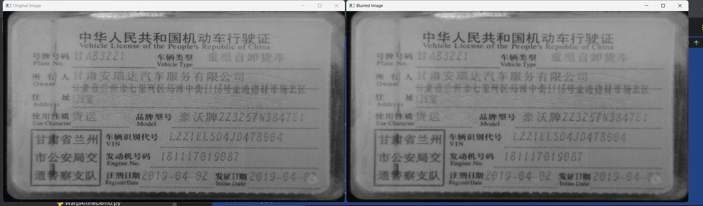

#### 3.1.2.2 高斯模糊

高斯模糊（Gaussian Blur）是一种常用的图像处理技术，它通过应用高斯核来进行图像的平滑处理。与均值模糊不同的是，高斯模糊在处理图像时会对每个像素点周围的像素赋予不同的权重，而不是统一使用相同的权重。

**高斯模糊的工作原理**

高斯模糊的核心在于高斯核（Gaussian Kernel），它是一个由高斯分布生成的矩阵。高斯核的中心值最大，越远离中心的值越小。这意味着在对图像进行模糊处理时，中心像素附近的像素将对结果贡献更大，而距离中心较远的像素贡献较小。

**高斯核的特点**

- **中心性**：高斯核的中心值最大，随着距离增加，值逐渐减小。
- **可分离性**：二维高斯核可以分解为两个一维高斯核的组合。这使得高斯模糊可以在时间和空间复杂度上更加高效。
- **平滑性**：高斯模糊能够有效地去除高频噪声，同时保留图像的大面积信息。

**如何生成高斯核**

给定标准差σ（sigma），可以使用以下公式来生成一个高斯核：

$$
 g(x,y) = \frac{1}{2\pi\sigma^2} e^{-\frac{x^2+y^2}{2\sigma^2}} 
$$
其中 \( x \) 和 \( y \) 是相对于核中心的坐标。

**高斯模糊的应用**

高斯模糊常用于图像预处理阶段，例如在边缘检测之前，通过高斯模糊去除噪声，以提高后续算法的效果。此外，它还广泛应用于图像的抗锯齿处理、模拟镜头光晕效果等方面。

```python
# _*_ coding: utf-8 _*_
"""
Time:     2024/9/17 下午3:25
Author:   EasonShu
Version:  V 0.1
File:     GaussianBlur.py
Describe: 
"""
if __name__ == '__main__':
    import cv2
    import numpy as np

    image_path = 'images/img_2.png'
    # 加载图像
    image = cv2.imread(image_path)
    if image is None:
        print("Error: Image not found.")
        exit()

    # 定义高斯模糊的核大小和标准差
    kernel_size = (15, 15)  # 核大小
    sigma = 0  # 如果设置为0，则标准差由OpenCV计算

    # 使用OpenCV的GaussianBlur函数来应用高斯模糊
    blurred_image = cv2.GaussianBlur(image, kernel_size, sigma)

    # 显示原始图像和模糊后的图像
    cv2.imshow('Original Image', image)
    cv2.imshow('Blurred Image', blurred_image)
    cv2.waitKey(0)
    cv2.destroyAllWindows()
```

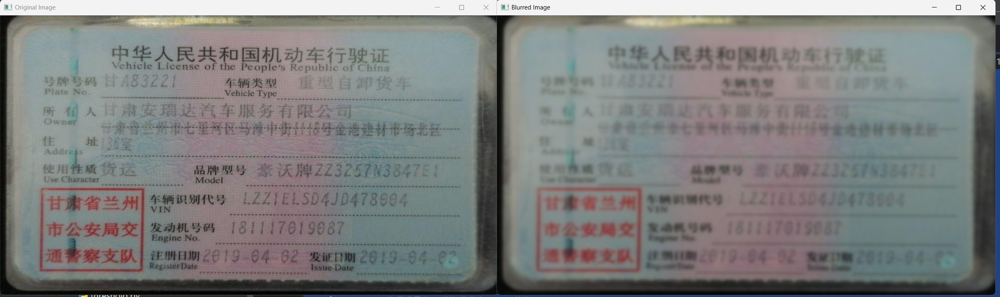

#### 3.1.2.3 中值滤波

中值滤波（Median Filtering）是一种非线性信号处理技术，通常用于图像处理中去除椒盐噪声（salt and pepper noise），并且在保护边缘的同时平滑图像。中值滤波的主要思想是在图像的每一个像素位置上，用该像素周围像素值的中值来替代原来的像素值。

**中值滤波的工作原理**

1. **选择核大小**：选择一个奇数大小的核（如3x3, 5x5等），这是因为奇数尺寸的核中心可以自然地对齐到输入图像的像素中心。
2. **滑动核**：将选定的核放在图像的每一个像素位置上。
3. **提取像素值**：对于每一个像素位置，提取核覆盖范围内所有的像素值。
4. **排序**：将提取到的像素值按从小到大的顺序排序。
5. **替换中心像素**：用排序后的中间值替换原来的中心像素值。
6. **重复**：继续对图像中剩余的像素重复上述步骤，直到处理完所有的像素。

**中值滤波的优点**

- **去噪能力强**：中值滤波特别擅长去除椒盐噪声，因为它能有效地忽略极端值（噪声）的影响。
- **边缘保护**：与均值模糊相比，中值滤波在去除噪声的同时，不会显著模糊图像中的边缘。

**中值滤波的局限性**

- **计算量较大**：排序操作相对耗时，尤其是对于较大的核尺寸。
- **细节损失**：虽然保护了边缘，但在某些情况下，中值滤波可能会导致图像细节的轻微损失。

```python
# _*_ coding: utf-8 _*_
"""
Time:     2024/9/17 下午3:29
Author:   EasonShu
Version:  V 0.1
File:     medianBlur.py
Describe: 
"""
if __name__ == '__main__':
    import cv2
    import numpy as np
    image_path = 'images/img_2.png'
    # 加载图像
    image = cv2.imread(image_path, cv2.IMREAD_GRAYSCALE)
    if image is None:
        print("Error: Image not found.")
        exit()

    # 定义核大小
    kernel_size = 3  # 可以调整为其他奇数值

    # 使用OpenCV的medianBlur函数来应用中值滤波
    filtered_image = cv2.medianBlur(image, kernel_size)

    # 显示原始图像和滤波后的图像
    cv2.imshow('Original Image', image)
    cv2.imshow('Filtered Image', filtered_image)
    cv2.waitKey(0)
    cv2.destroyAllWindows()
```

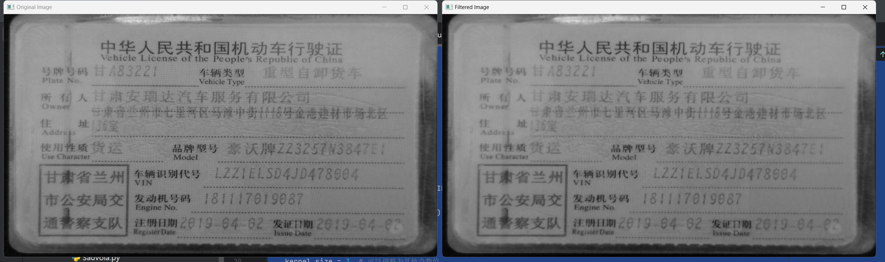

#### 3.1.3.4 双边滤波

双边滤波（Bilateral Filtering）是一种图像处理技术，它能够在保留图像边缘的同时平滑图像。与传统的高斯模糊或中值滤波不同，双边滤波结合了空间邻近性和像素值相似性两个因素来决定像素值的权重。

**双边滤波的工作原理**

双边滤波在处理图像时，不仅考虑了像素的位置关系，还考虑了像素强度的相似性。具体而言，双边滤波使用了两个高斯核：

1. **空间高斯核**：这个高斯核与普通高斯模糊中的高斯核类似，根据像素的空间位置给予权重。
2. **范围高斯核**：这个高斯核根据像素值（颜色强度）的相似性给予权重。

对于一个给定的像素 \( p \)，双边滤波计算出的新像素值 \( I'(p) \) 可以通过以下公式得出：

$$
 I'(p) = \frac{\sum_{q \in \Omega} I(q) f_s(d(p,q)) f_r(I(p), I(q))}{\sum_{q \in \Omega} f_s(d(p,q)) f_r(I(p), I(q))} 
$$
其中：

- \( I(p) \) 表示像素 \( p \) 的强度值。
- \( d(p,q) \) 表示像素 \( p \) 和 \( q \) 在空间上的距离。
- \( f_s(d(p,q)) \) 是空间高斯核，通常形式为 \( e^{-\frac{d(p,q)^2}{2\sigma_d^2}} \)，其中 \( \sigma_d \) 控制着空间邻近性的权重。
- \( f_r(I(p), I(q)) \) 是范围高斯核，形式为 \( e^{-\frac{(I(p)-I(q))^2}{2\sigma_r^2}} \)，其中 \( \sigma_r \) 控制着强度相似性的权重。
- \( \Omega \) 是以像素 \( p \) 为中心的邻域。

**双边滤波的特点**

- **保留边缘**：由于范围高斯核的存在，只有那些强度值相近的像素才会相互影响，因此边缘信息得以保留。
- **去除噪声**：空间高斯核确保只有邻近的像素才会影响目标像素，这样可以有效地去除噪声。
- **计算复杂度**：双边滤波比普通的高斯模糊更复杂，因为需要计算额外的范围高斯核。

**双边滤波的应用**

双边滤波经常用于图像降噪、边缘保护、纹理恢复等场景中。由于它可以很好地保留图像中的边缘信息，因此在许多图像处理和计算机视觉任务中都非常有用。

```python
# _*_ coding: utf-8 _*_
"""
Time:     2024/9/17 下午3:32
Author:   EasonShu
Version:  V 0.1
File:     bilateralFilter.py
Describe: 
"""
if __name__ == '__main__':
    import cv2
    import numpy as np
    image_path = 'images/img_2.png'
    # 加载图像
    image = cv2.imread(image_path)
    if image is None:
        print("Error: Image not found.")
        exit()

    # 定义双边滤波的参数
    diameter = 9  # 滤波核大小
    sigma_color = 75  # 色彩空间的标准差
    sigma_space = 75  # 坐标空间的标准差

    # 使用OpenCV的bilateralFilter函数来应用双边滤波
    filtered_image = cv2.bilateralFilter(image, diameter, sigma_color, sigma_space)

    # 显示原始图像和滤波后的图像
    cv2.imshow('Original Image', image)
    cv2.imshow('Filtered Image', filtered_image)
    cv2.waitKey(0)
    cv2.destroyAllWindows()
```

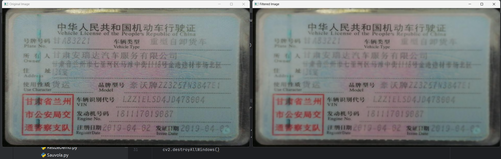

## 4.1 形态变换

形态学变换是基于图像形状的一些简单操作。它通常在二值图像上执行。它需要两个输入，一个是我们的原始图像，第二个是决定操作性质的结构元素或内核。两个基本的形态学操作是腐蚀和膨胀。

### 4.1.1 腐蚀

- 腐蚀的基本概念就像土壤侵蚀一样，只侵蚀前景对象的边界（总是尽量保持前景为白色）。那它有什么作用呢？内核在图像中滑动（如二维卷积）。只有当内核下的所有像素都为 1 时，原始图像中的像素（1 或 0）才会被视为 1，否则会被侵蚀（变为零）。

**腐蚀的操作原理**

- 假设有一个图像 A*A* 和一个结构元素 B*B*，结构元素 B*B* 通常是一个小的矩形或圆形核，它的原点通常位于核的中心。腐蚀操作可以定义为：

A⊖B={z∈D(A)∣Bz⊆A}*A*⊖*B*={*z*∈*D*(*A*)∣*B**z*⊆*A*}

- 其中 D(A)*D*(*A*) 是图像 A*A* 的定义域，Bz*B**z* 表示结构元素 B*B* 关于点 z*z* 的平移。简单来说，腐蚀操作会在图像的每个像素位置上检查，如果结构元素 B*B* 在该位置的所有元素都在 A*A* 中（即结构元素完全包含在前景像素内），则该位置被视为腐蚀结果的一部分。

**腐蚀的具体步骤**

1. **选择结构元素**：选择一个适合的结构元素 B*B*，大小和形状取决于想要达到的效果。
2. **放置结构元素**：将结构元素 B*B* 放置在图像的每个像素位置上。
3. **比较像素值**：检查结构元素覆盖的所有像素是否都是前景像素（通常是白色或非零值）。
4. **输出结果**：如果结构元素的所有像素都是前景像素，则输出图像中的对应位置标记为前景；否则标记为背景（通常是黑色或零值）。

**腐蚀的应用**

- **去噪**：腐蚀可以用来去除图像中的小噪点。
- **边界检测**：连续进行腐蚀操作可以逐渐侵蚀图像中的对象边界，用于边界检测。
- **形态学开运算**：腐蚀之后跟随膨胀操作，可以用来去除图像中的细小对象而不改变较大对象的形状。

```python
# _*_ coding: utf-8 _*_
"""
Time:     2024/9/17 下午3:38
Author:   EasonShu
Version:  V 0.1
File:     erode.py
Describe: 
"""
if __name__ == '__main__':
    import cv2
    import numpy as np
    image_path = 'images/img_2.png'
    # 加载图像
    image = cv2.imread(image_path, cv2.IMREAD_GRAYSCALE)
    if image is None:
        print("Error: Image not found.")
        exit()

    # 定义结构元素
    kernel = np.ones((5, 5), np.uint8)  # 创建一个5x5的矩形核

    # 使用OpenCV的erode函数来应用腐蚀
    eroded_image = cv2.erode(image, kernel, iterations=1)

    # 显示原始图像和腐蚀后的图像
    cv2.imshow('Original Image', image)
    cv2.imshow('Eroded Image', eroded_image)
    cv2.waitKey(0)
    cv2.destroyAllWindows()
```

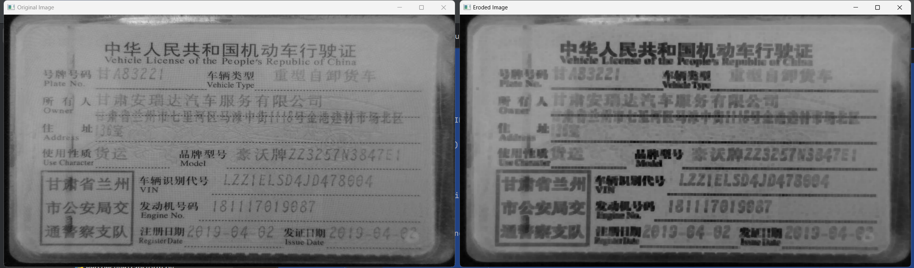

### 4.1.2 膨胀

- 它与腐蚀正好相反。这里，如果内核下至少有一个像素为“1”，则像素元素为“1”。所以它会增加图像中的白色区域，或者增加前景对象的大小。通常情况下，在去除噪音的情况下，腐蚀后会膨胀。
- 因为，腐蚀消除了白噪声，但它也缩小了我们的对象。所以我们扩大它。由于噪音消失了，它们不会再回来，但我们的目标区域会增加到腐蚀之前的状态。它还可用于连接对象的断开部分。

**膨胀的操作原理**

- 膨胀可以定义为：

A⊕B={z∈D(A)∣(∃b∈B):z−b∈A}*A*⊕*B*={*z*∈*D*(*A*)∣(∃*b*∈*B*):*z*−*b*∈*A*}

- 其中 A*A* 是图像，B*B* 是结构元素，D(A)*D*(*A*) 是图像 A*A* 的定义域。简单来说，膨胀操作会在图像的每个像素位置上检查，如果结构元素 B*B* 在该位置的任何一部分与图像 A*A* 的前景像素重叠，则该位置被视为膨胀结果的一部分。

**膨胀的具体步骤**

1. **选择结构元素**：选择一个适合的结构元素 B*B*，大小和形状取决于想要达到的效果。
2. **放置结构元素**：将结构元素 B*B* 放置在图像的每个像素位置上。
3. **比较像素值**：检查结构元素覆盖的任意一个像素是否为前景像素（通常是白色或非零值）。
4. **输出结果**：如果结构元素的任何一个像素是前景像素，则输出图像中的对应位置标记为前景；否则标记为背景。

**膨胀的应用**

- **填补空洞**：膨胀可以帮助填补图像中对象内部的小孔洞。
- **连接对象**：膨胀可以用来连接彼此接近的对象。
- **边界扩大**：膨胀可以使图像中的对象边界向外扩张。
- **形态学闭运算**：先膨胀后腐蚀的操作序列，可以用来封闭图像中的细长裂缝。

```python
# _*_ coding: utf-8 _*_
"""
Time:     2024/9/17 下午3:42
Author:   EasonShu
Version:  V 0.1
File:     dilate.py
Describe: 
"""
if __name__ == '__main__':
    import cv2
    import numpy as np
    image_path = 'images/img_2.png'
    # 加载图像
    image = cv2.imread(image_path, cv2.IMREAD_GRAYSCALE)
    if image is None:
        print("Error: Image not found.")
        exit()

    # 定义结构元素
    kernel = np.ones((2, 2), np.uint8)  # 创建一个5x5的矩形核

    # 使用OpenCV的dilate函数来应用膨胀
    dilated_image = cv2.dilate(image, kernel, iterations=1)

    # 显示原始图像和膨胀后的图像
    cv2.imshow('Original Image', image)
    cv2.imshow('Dilated Image', dilated_image)
    cv2.waitKey(0)
    cv2.destroyAllWindows()
```

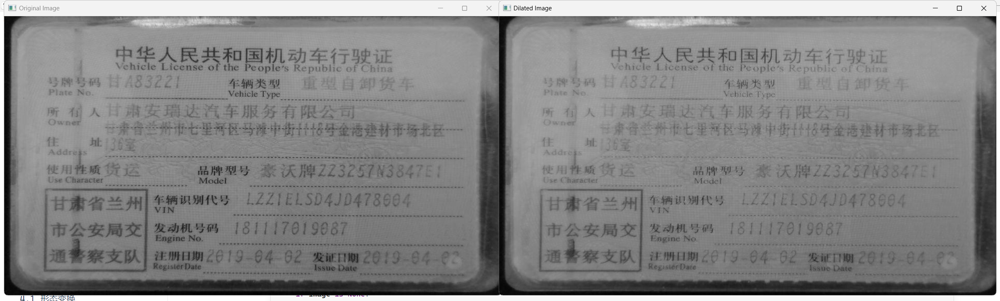

### 4.1.3 开运算

开运算（Opening）是数学形态学中的一种组合操作，它通常用于去除图像中的小噪点、平滑物体边界，并保持物体的大小不变。开运算是由腐蚀和随后的膨胀操作组成的序列，其顺序非常重要，不能颠倒。

**开运算的定义**

开运算可以定义为：

A∘B=(A⊖B)⊕B*A*∘*B*=(*A*⊖*B*)⊕*B*

其中 A*A* 是图像，B*B* 是结构元素。首先对图像 A*A* 进行腐蚀操作 A⊖B*A*⊖*B*，然后对腐蚀的结果再进行膨胀操作 (A⊖B)⊕B(*A*⊖*B*)⊕*B*。

**开运算的具体步骤**

1. **腐蚀操作**：选择一个结构元素 B*B*，并将它放置在图像 A*A* 的每一个像素位置上。如果结构元素在该位置下的所有像素都是前景像素，则该位置保留为前景像素。否则，该位置被标记为背景像素。
2. **膨胀操作**：对腐蚀后的图像进行膨胀操作。再次将结构元素 B*B* 放置在图像的每一个像素位置上。如果结构元素在该位置下有任何一个像素是前景像素，则该位置被标记为前景像素。否则，该位置被标记为背景像素。

**开运算的应用**

- **去噪**：开运算非常适合去除图像中的小噪点，尤其是椒盐噪声。
- **边界平滑**：开运算可以用来平滑图像中的物体边界，同时保持物体的形状和大小基本不变。
- **孔洞填补**：虽然膨胀本身可以填补孔洞，但开运算通常用于去除小的突出部分和孔洞。

```python
# _*_ coding: utf-8 _*_
"""
Time:     2024/9/17 下午3:42
Author:   EasonShu
Version:  V 0.1
File:     dilate.py
Describe: 
"""
if __name__ == '__main__':
    import cv2
    import numpy as np
    image_path = 'images/img_2.png'
    # 加载图像
    image = cv2.imread(image_path, cv2.IMREAD_GRAYSCALE)
    if image is None:
        print("Error: Image not found.")
        exit()

    # 定义结构元素
    kernel = np.ones((4, 4), np.uint8)  # 创建一个5x5的矩形核

    # 先进行腐蚀操作
    erosion = cv2.erode(image, kernel, iterations=1)

    # 对腐蚀结果进行膨胀操作
    opening = cv2.dilate(erosion, kernel, iterations=1)

    # 显示原始图像和开运算后的图像
    cv2.imshow('Original Image', image)
    cv2.imshow('Opened Image', opening)
    cv2.waitKey(0)
    cv2.destroyAllWindows()
```

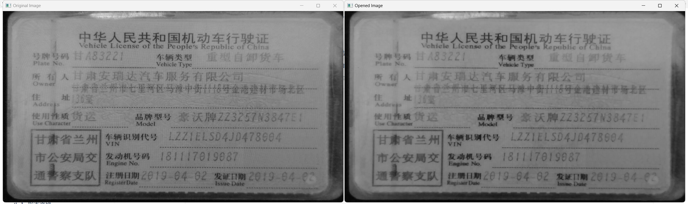

### 4.1.4 闭运算

闭运算（Closing）是数学形态学中的另一种组合操作，它通常用于填充图像中小的孔洞、连接接近的对象、以及平滑物体的边界。闭运算由膨胀操作后跟腐蚀操作组成，其顺序同样非常重要，不能颠倒。

**闭运算的定义**

闭运算可以定义为：

A∙B=(A⊕B)⊖B*A*∙*B*=(*A*⊕*B*)⊖*B*

其中 A*A* 是图像，B*B* 是结构元素。首先对图像 A*A* 进行膨胀操作 A⊕B*A*⊕*B*，然后对膨胀的结果再进行腐蚀操作 (A⊕B)⊖B(*A*⊕*B*)⊖*B*。

**闭运算的具体步骤**

1. **膨胀操作**：选择一个结构元素 B*B*，并将它放置在图像 A*A* 的每一个像素位置上。如果结构元素在该位置下有任何一个像素是前景像素，则该位置被标记为前景像素。
2. **腐蚀操作**：对膨胀后的图像进行腐蚀操作。再次将结构元素 B*B* 放置在图像的每一个像素位置上。如果结构元素在该位置下的所有像素都是前景像素，则该位置保留为前景像素。否则，该位置被标记为背景像素。

**闭运算的应用**

- **去噪**：闭运算可以用来填充图像中的小孔洞，特别是在二值图像中有很好的效果。
- **连接对象**：闭运算可以用来连接彼此接近的对象，使得它们形成一个整体。
- **边界平滑**：闭运算可以用来平滑图像中的物体边界，同时保持物体的形状和大小基本不变。
- **形态学闭运算**：闭运算通常用于闭合图像中的细长裂缝，使得对象之间的缝隙被填补。

```python
# _*_ coding: utf-8 _*_
"""
Time:     2024/9/17 下午3:42
Author:   EasonShu
Version:  V 0.1
File:     dilate.py
Describe: 
"""
if __name__ == '__main__':
    import cv2
    import numpy as np
    image_path = 'images/img_2.png'
    # 加载图像
    # 加载图像
    image = cv2.imread(image_path, cv2.IMREAD_GRAYSCALE)
    if image is None:
        print("Error: Image not found.")
        exit()

    # 定义结构元素
    kernel = np.ones((5, 5), np.uint8)  # 创建一个5x5的矩形核

    # 先进行膨胀操作
    dilation = cv2.dilate(image, kernel, iterations=1)

    # 对膨胀结果进行腐蚀操作
    closing = cv2.erode(dilation, kernel, iterations=1)

    # 显示原始图像和闭运算后的图像
    cv2.imshow('Original Image', image)
    cv2.imshow('Closed Image', closing)
    cv2.waitKey(0)
    cv2.destroyAllWindows()
```

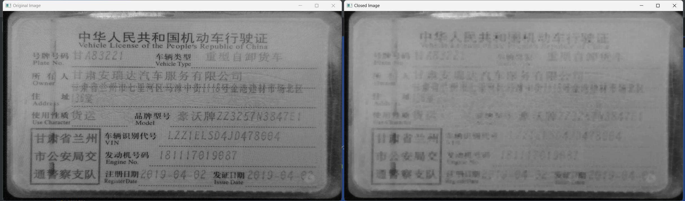

使用 `cv2.morphologyEx` 实现闭运算

```python
# _*_ coding: utf-8 _*_
"""
Time:     2024/9/17 下午3:42
Author:   EasonShu
Version:  V 0.1
File:     dilate.py
Describe: 
"""
if __name__ == '__main__':
    import cv2
    import numpy as np
    image_path = 'images/img_2.png'
    # 加载图像
    # 加载图像
    image = cv2.imread(image_path, cv2.IMREAD_GRAYSCALE)
    if image is None:
        print("Error: Image not found.")
        exit()

    # 定义结构元素
    kernel = np.ones((5, 5), np.uint8)  # 创建一个5x5的矩形核

    # # 先进行膨胀操作
    # dilation = cv2.dilate(image, kernel, iterations=1)
    # 
    # # 对膨胀结果进行腐蚀操作
    # closing = cv2.erode(dilation, kernel, iterations=1)
    # 使用cv2.morphologyEx函数来应用闭运算
    closing = cv2.morphologyEx(image, cv2.MORPH_CLOSE, kernel)
    # 显示原始图像和闭运算后的图像
    cv2.imshow('Original Image', image)
    cv2.imshow('Closed Image', closing)
    cv2.waitKey(0)
    cv2.destroyAllWindows()
```

### 4.1.5 形态梯度

- 它是图像的膨胀和腐蚀之间的差值。

形态梯度（Morphological Gradient）是数学形态学中的一种操作，它用来突出图像中的边缘信息。形态梯度通过计算图像经过膨胀操作后的结果与经过腐蚀操作后的结果之间的差异来实现。这种方法可以有效地增强图像中的边缘，使其更加明显。

**形态梯度的定义**

形态梯度可以定义为：

Gradient(A)=(A⊕B)−(A⊖B)Gradient(*A*)=(*A*⊕*B*)−(*A*⊖*B*)

其中 A*A* 是图像，B*B* 是结构元素。膨胀操作 A⊕B*A*⊕*B* 会使图像中的前景区域向外扩展，而腐蚀操作 A⊖B*A*⊖*B* 则会使图像中的前景区域向内收缩。形态梯度是膨胀结果与腐蚀结果之间的差集。

**形态梯度的具体步骤**

1. **膨胀操作**：选择一个结构元素 B*B*，并将它放置在图像 A*A* 的每一个像素位置上。如果结构元素在该位置下有任何一个像素是前景像素，则该位置被标记为前景像素。
2. **腐蚀操作**：对原始图像进行腐蚀操作。再次将结构元素 B*B* 放置在图像的每一个像素位置上。如果结构元素在该位置下的所有像素都是前景像素，则该位置保留为前景像素。否则，该位置被标记为背景像素。
3. **计算差集**：计算膨胀结果与腐蚀结果之间的差集，即膨胀结果中属于腐蚀结果以外的部分。

**形态梯度的应用**

- **边缘检测**：形态梯度可以用来检测图像中的边缘，因为它增强了图像中物体的边界。
- **去噪**：在一些情况下，形态梯度可以用来去除图像中的小噪点，特别是当使用适当大小的结构元素时。
- **边缘增强**：形态梯度可以用来增强图像中的边缘，使其在视觉上更加明显。

```python
# _*_ coding: utf-8 _*_
"""
Time:     2024/9/17 下午3:54
Author:   EasonShu
Version:  V 0.1
File:     morphologyEx1.py
Describe: 
"""
if __name__ == '__main__':
    import cv2
    import numpy as np
    image_path = 'images/img_2.png'
    # 加载图像
    image = cv2.imread(image_path, cv2.IMREAD_GRAYSCALE)
    if image is None:
        print("Error: Image not found.")
        exit()

    # 定义结构元素
    kernel = np.ones((5, 5), np.uint8)  # 创建一个5x5的矩形核

    # 使用cv2.morphologyEx函数来应用形态梯度
    gradient = cv2.morphologyEx(image, cv2.MORPH_GRADIENT, kernel)

    # 显示原始图像和形态梯度后的图像
    cv2.imshow('Original Image', image)
    cv2.imshow('Gradient Image', gradient)
    cv2.waitKey(0)
    cv2.destroyAllWindows()
```

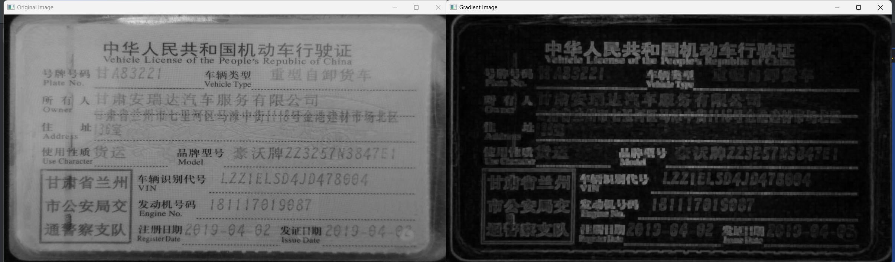

### 4.1.6 顶帽运算

- 它是原图像和原图像开运算结果的差值

顶帽运算（Top Hat Transform）是数学形态学中的一种操作，它主要用于增强图像中的明亮区域，并且可以用来去除图像中的亮斑或高亮噪声。顶帽运算通常用于图像的预处理阶段，以提高后续处理的效果。

**顶帽运算的定义**

顶帽运算可以定义为：

TopHat(A)=A−(A⊖B)TopHat(*A*)=*A*−(*A*⊖*B*)

其中 A*A* 是输入图像，B*B* 是结构元素。顶帽运算实质上是原始图像 A*A* 减去该图像经过腐蚀操作 A⊖B*A*⊖*B* 后的结果。

**顶帽运算的具体步骤**

1. **腐蚀操作**：选择一个结构元素 B*B*，并将它放置在图像 A*A* 的每一个像素位置上。如果结构元素在该位置下的所有像素都是前景像素，则该位置保留为前景像素。否则，该位置被标记为背景像素。
2. **计算差集**：计算原始图像 A*A* 与腐蚀结果之间的差集，即原始图像中不属于腐蚀结果的部分。

**顶帽运算的应用**

- **增强明亮区域**：顶帽运算可以用来增强图像中的明亮区域，使得这些区域更加突出。
- **去除亮斑噪声**：顶帽运算可以用来去除图像中的亮斑噪声或高光部分。
- **细节增强**：顶帽运算可以增强图像中的细节信息，特别是那些亮度较高的细节。

```python
# _*_ coding: utf-8 _*_
"""
Time:     2024/9/17 下午3:54
Author:   EasonShu
Version:  V 0.1
File:     morphologyEx1.py
Describe: 
"""
if __name__ == '__main__':
    import cv2
    import numpy as np
    image_path = 'images/img_2.png'
    # 加载图像
    image = cv2.imread(image_path, cv2.IMREAD_GRAYSCALE)
    if image is None:
        print("Error: Image not found.")
        exit()

    # 定义结构元素
    kernel = np.ones((5, 5), np.uint8)  # 创建一个5x5的矩形核

    # 使用cv2.morphologyEx函数来应用顶帽运算
    top_hat = cv2.morphologyEx(image, cv2.MORPH_TOPHAT, kernel)

    # 显示原始图像和顶帽运算后的图像
    cv2.imshow('Original Image', image)
    cv2.imshow('Top Hat Image', top_hat)
    cv2.waitKey(0)
    cv2.destroyAllWindows()
```

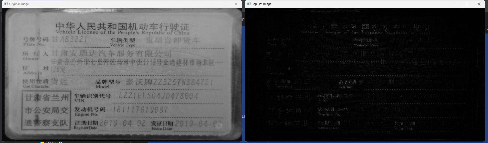

### 4.1.7 黑帽运算

- 它是原图像和原图像的闭的差值。

黑帽运算（Black Hat Transform）是数学形态学中的一种操作，它主要用于增强图像中的暗区域，并且可以用来突出图像中的暗斑或阴影。黑帽运算通常用于图像的预处理阶段，以提高后续处理的效果。

**黑帽运算的定义**

黑帽运算可以定义为：

BlackHat(A)=(A⊖B)−ABlackHat(*A*)=(*A*⊖*B*)−*A*

其中 A*A* 是输入图像，B*B* 是结构元素。黑帽运算实质上是图像经过腐蚀操作 A⊖B*A*⊖*B* 后的结果减去原始图像 A*A*。

**黑帽运算的具体步骤**

1. **腐蚀操作**：选择一个结构元素 B*B*，并将它放置在图像 A*A* 的每一个像素位置上。如果结构元素在该位置下的所有像素都是前景像素，则该位置保留为前景像素。否则，该位置被标记为背景像素。
2. **计算差集**：计算腐蚀结果与原始图像之间的差集，即腐蚀结果中不属于原始图像的部分。

**黑帽运算的应用**

- **增强暗区域**：黑帽运算可以用来增强图像中的暗区域，使得这些区域更加突出。
- **去除暗斑噪声**：黑帽运算可以用来突出图像中的暗斑或阴影，有助于后续的处理。
- **细节增强**：黑帽运算可以增强图像中的细节信息，特别是那些亮度较低的细节。

```python
# _*_ coding: utf-8 _*_
"""
Time:     2024/9/17 下午3:54
Author:   EasonShu
Version:  V 0.1
File:     morphologyEx1.py
Describe: 
"""
if __name__ == '__main__':
    import cv2
    import numpy as np
    image_path = 'images/img_2.png'
    # 加载图像
    image = cv2.imread(image_path, cv2.IMREAD_GRAYSCALE)
    if image is None:
        print("Error: Image not found.")
        exit()

    # 定义结构元素
    kernel = np.ones((5, 5), np.uint8)  # 创建一个5x5的矩形核

    # 使用cv2.morphologyEx函数来应用黑帽运算
    black_hat = cv2.morphologyEx(image, cv2.MORPH_BLACKHAT, kernel)

    # 显示原始图像和黑帽运算后的图像
    cv2.imshow('Original Image', image)
    cv2.imshow('Black Hat Image', black_hat)
    cv2.waitKey(0)
    cv2.destroyAllWindows()
```

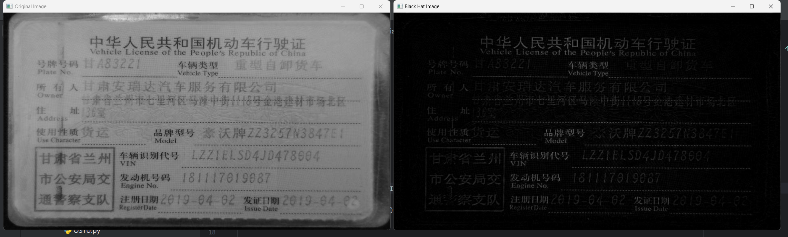

## 5.1 图像梯度

OpenCv 提供三种类型的梯度滤波器或高通滤波器，Sobel、Scharr 和 Laplacian。

### 5.1.1 Sobel算子

Sobel算子是一种在图像处理和计算机视觉领域广泛应用的边缘检测算法。它主要用于识别图像中的显著变化，即边缘，通过计算图像中的灰度变化率来实现。Sobel算子实际上是由两个3×3的卷积核（也称为掩模或滤镜）组成的，一个用于检测图像在X方向上的边缘，另一个用于检测Y方向上的边缘。

这两个掩模如下所示：

**Sobel X (Gx):**

深色版本

```
1-1  0  1
2-2  0  2
3-1  0  1
```

**Sobel Y (Gy):**

深色版本

```
1-1 -2 -1
2 0  0  0
3 1  2  1
```

应用这两个掩模到图像上之后，可以得到每个像素点在X方向和Y方向上的梯度近似值。接着，通常会将这两个方向上的梯度合并以得到总梯度幅度，这可以通过计算它们的欧几里得范数来完成：

G=Gx2+Gy2*G*=*G**x*2+*G**y*2

其中Gx*G**x*和Gy*G**y*分别是通过上述两个掩模得到的水平和垂直方向的梯度。在实际应用中，有时为了简化计算，会直接使用∣Gx∣+∣Gy∣∣*G**x*∣+∣*G**y*∣作为梯度幅度。

Sobel算子的优点包括简单易用，对噪声具有一定的抑制作用，因为它的滤波器设计包含了一定程度的平滑处理。不过，它的一个缺点是可能会导致边缘变宽，因为梯度计算可能会跨越整个边缘，从而导致边缘不是单个像素宽。

```python
# _*_ coding: utf-8 _*_
"""
Time:     2024/9/17 下午4:45
Author:   EasonShu
Version:  V 0.1
File:     Sobel.py
Describe: 
"""
if __name__ == '__main__':
    import cv2
    import numpy as np

    # 图像路径
    image_path = 'images/img_2.png'

    # 读取图像并转换为灰度图像
    image = cv2.imread(image_path, cv2.IMREAD_GRAYSCALE)
    if image is None:
        print("无法加载图像，请检查路径是否正确")
        exit()
    # 计算X方向上的梯度
    sobelx = cv2.Sobel(image, cv2.CV_64F, 1, 0, ksize=3)
    # 计算Y方向上的梯度
    sobely = cv2.Sobel(image, cv2.CV_64F, 0, 1, ksize=3)

    # 可以将两个方向上的梯度合并为一个结果
    gradient_magnitude = cv2.magnitude(sobelx, sobely)

    # 将梯度幅度转换为8位无符号整型，方便显示
    gradient_magnitude = cv2.normalize(gradient_magnitude, None, 0, 255, cv2.NORM_MINMAX).astype(np.uint8)

    # 显示原图像和梯度幅度图
    cv2.imshow('Original Image', image)
    cv2.imshow('Gradient Magnitude', gradient_magnitude)

    # 按任意键退出
    cv2.waitKey(0)
    cv2.destroyAllWindows()
```

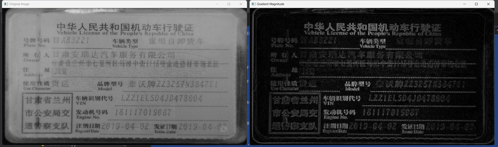

### 5.1.2 Scharr 算子

Scharr算子是另一种用于边缘检测的技术，它与Sobel算子相似，但是Scharr算子的精度更高，尤其是在边缘检测方面更为准确。Scharr算子同样用于计算图像中的梯度，但它使用了优化过的3x3卷积核。

**Scharr算子的核**

Scharr算子的核如下所示：

**Scharr X (Gx):**
```
  47   0 -47
 162   0 -162
  47   0 -47
```

**Scharr Y (Gy):**
```
  47  162   47
    0    0    0
 -47 -162  -47
```

但是在实际应用中，OpenCV使用了一个标准化的版本，即除以256后的版本，简化后的核如下：

**Scharr X (Gx):**
```
  1  0 -1
  2  0 -2
  1  0 -1
```

**Scharr Y (Gy):**
```
  1  2  1
  0  0  0
 -1 -2 -1
```

这些核用于计算图像在X和Y方向上的梯度。

```python
import cv2
import numpy as np

def main():
    # 图像路径
    image_path = 'images/img_2.png'
    
    # 读取图像并转换为灰度图像
    image = cv2.imread(image_path, cv2.IMREAD_GRAYSCALE)
    
    if image is None:
        print("无法加载图像，请检查路径是否正确")
        return
    
    # 计算X方向上的梯度
    scharrx = cv2.Scharr(image, cv2.CV_64F, 1, 0)
    # 计算Y方向上的梯度
    scharry = cv2.Scharr(image, cv2.CV_64F, 0, 1)
    
    # 可以将两个方向上的梯度合并为一个结果
    gradient_magnitude = cv2.magnitude(scharrx, scharry)
    
    # 将梯度幅度转换为8位无符号整型，方便显示
    gradient_magnitude = cv2.normalize(gradient_magnitude, None, 0, 255, cv2.NORM_MINMAX).astype(np.uint8)
    
    # 显示原图像和梯度幅度图
    cv2.imshow('Original Image', image)
    cv2.imshow('Scharr Gradient Magnitude', gradient_magnitude)
    
    # 按任意键退出
    cv2.waitKey(0)
    cv2.destroyAllWindows()

if __name__ == '__main__':
    main()
```

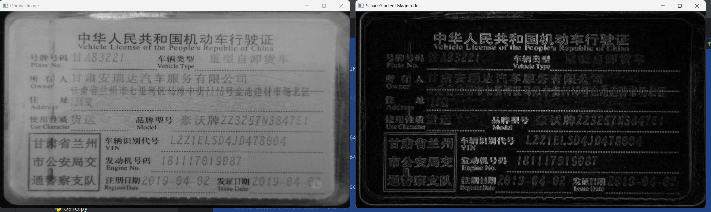

### 5.1.3 Laplacian 微分

Laplacian算子是一种用于图像处理中的二阶微分算子，它可以用来检测图像中的边缘。Laplacian算子不同于Sobel和Scharr算子，因为它使用单一的卷积核来检测图像中的突变（边缘），而不是分别检测X和Y方向上的梯度。

**Laplacian算子的原理**

Laplacian算子计算的是图像灰度值的二阶导数。简单来说，它寻找图像中灰度值急剧变化的地方。这些变化通常对应于边缘。Laplacian算子的核心思想是在图像中的每一个像素点上计算其邻域内灰度值的变化率。

**Laplacian算子的核**

常见的Laplacian核有几种形式，其中一种常见的形式是3×3的核：

```
0  1  0
1 -4  1
0  1  0
```

另一种常见的形式是5×5的核：

```
-1 -1 -1 -1 -1
-1  2  2  2 -1
-1  2 -8  2 -1
-1  2  2  2 -1
-1 -1 -1 -1 -1
```

在OpenCV中，默认使用的是3×3的核。

```python
# _*_ coding: utf-8 _*_
"""
Time:     2024/9/17 下午4:53
Author:   EasonShu
Version:  V 0.1
File:     Laplacian.py
Describe: 
"""
import cv2
import numpy as np


def main():
    # 图像路径
    image_path = 'images/img_2.png'

    # 读取图像并转换为灰度图像
    image = cv2.imread(image_path, cv2.IMREAD_GRAYSCALE)

    if image is None:
        print("无法加载图像，请检查路径是否正确")
        return

    # 应用Laplacian算子
    laplacian = cv2.Laplacian(image, cv2.CV_64F)

    # 将结果转换为8位无符号整型，方便显示
    laplacian_8u = cv2.convertScaleAbs(laplacian)

    # 显示原图像和Laplacian结果
    cv2.imshow('Original Image', image)
    cv2.imshow('Laplacian Result', laplacian_8u)

    # 按任意键退出
    cv2.waitKey(0)
    cv2.destroyAllWindows()


if __name__ == '__main__':
    main()
```

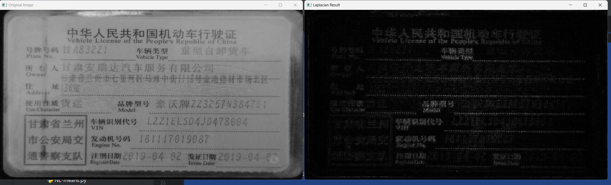