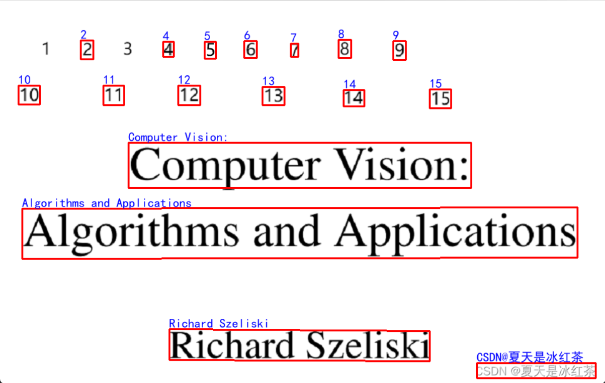

# Opencv项目实战：01 文字检测OCR（1）

- 参考文章：https://blog.csdn.net/bugang4663/article/details/131720149

## 1.1 tesseract

### 1.1.1 介绍

Tesserat OCR 是一款可在各种操作系统运行的 OCR 引擎，这是一款开源软件，在Apache 许可下发布。最初由惠普在20世纪80年代作为专有软件开发，在2005年以开源的形式发布，从2006年开始由谷歌赞助，开发语言为 C++。

- 官网：https://tesseract-ocr.github.io/tessdoc/ReleaseNotes.html

### 1.1.2 Window 安装

- 下载网址：https://sourceforge.net/projects/tesseract-ocr-alt/files/
- 新版下载地址：https://github.com/UB-Mannheim/tesseract/wiki


- 记住自己的安装位置


### 1.1.3 Opencv 安装

```bash
pip install opencv-python
```


### 1.1.4 pytesseract 安装

Python-tesseract 是一个用于Python的光学字符识别（OCR）工具。它能识别并“读取”嵌入在图像中的文本。

Python-tesseract 是 `谷歌Tesseract-OCR引擎 <https://github.com/tesseract-ocr/tesseract>`_ 的包装器。同时，作为一个独立的调用脚本，它也非常有用，因为它能够处理Pillow和Leptonica图像库支持的所有图像类型，包括jpeg、png、gif、bmp、tiff和其他格式。此外，如果作为脚本使用，Python-tesseract 将直接打印识别出的文本而不是写入文件。

`pytesseract` 库提供了几个主要的方法来处理 OCR（光学字符识别）任务。以下是三个最常用的方法：

1. **`image_to_string(image, lang=None, config='')`**:
   - 这是最基本也是最常用的方法，用于从图像中提取文本。
   - `image` 参数是需要进行 OCR 的图像对象（通常是 PIL.Image 对象）。
   - `lang` 参数指定 OCR 时使用的语言，默认为 `'eng'`（英文）。你可以使用其他语言代码，例如 `'chi_sim'` 表示简体中文。
   - `config` 参数允许你传递额外的配置选项给 Tesseract 引擎。
2. **`image_to_boxes(image, lang=None, config='')`**:
   - 该方法返回一个字符串，其中包含了每个识别到的字符的位置信息。
   - 每行包含一个字符的信息，格式如下：`character x_min y_min x_max y_max page_number block_num paragraph_num line_num word_num`
   - 这对于获取字符的具体位置非常有用，比如在图像上绘制边界框。
3. **`image_to_data(image, lang=None, config='', output_type=Output.DICT)`**:
   - 该方法返回一个结构化的数据输出，通常是一个字典，包含了关于识别结果的详细信息。
   - 字典中的键包括 `level`, `page_num`, `block_num`, `par_num`, `line_num`, `word_num`, `left`, `top`, `width`, `height`, `conf`, 和 `text` 等。
   - `output_type` 参数可以设置为 `Output.DICT` 来获取字典形式的结果，或者 `Output.STRING` 来获取原始字符串形式的结果。
   - 这个方法对于需要对 OCR 结果进行更精细控制的应用场景非常有用。

```bash
pip install pytesseract
```

- 文档：https://gitcode.com/gh_mirrors/py/pytesseract/overview?utm_source=highlight_word_gitcode&word=pytesseract&isLogin=1

```python
"""
 @Author: EasonShu
 @FileName: PytesseractTest.py
 @DateTime: 2024/9/20 下午4:42
"""
import cv2
import pytesseract

if __name__ == '__main__':
    # 设置tesseract可执行文件路径
    pytesseract.pytesseract.tesseract_cmd = 'D:\\Code-Environment\\Tesseract-OCR\\tesseract.exe'
    # 图片路径
    img_path = "./images/img_3.png"
    #简单图像转字符串
    img = cv2.imread(img_path)
    img = cv2.cvtColor(img, cv2.COLOR_BGR2RGB)
    # 缩放50
    img = cv2.resize(img, None, fx=0.5, fy=0.5)
    print(pytesseract.image_to_string(img))
    # 获取文字位置
    hImg, wImg, _ = img.shape
    # 获取文字位置
    boxes = pytesseract.image_to_boxes(img)
    for b in boxes.splitlines():
        print(b)
        b = b.split(' ')
        print(b)
        x, y, w, h = int(b[1]), int(b[2]), int(b[3]), int(b[4])
        # 利用cv2.rectangle画出文字位置
        cv2.rectangle(img, (x,hImg- y), (w,hImg- h), (50, 50, 255), 2)
        # 文字
        cv2.putText(img,b[0],(x,hImg- y+25),cv2.FONT_HERSHEY_SIMPLEX,1,(50,50,255),2)
    cv2.imshow('img', img)
    cv2.waitKey(0)


```


我们可以换图片试一试，发现对于印刷体的效果有些可以识别，有些不行，如果是中文更加不行

### 1.1.5 效果改进

```python
"""
 @Author: EasonShu
 @FileName: PytesseractTest.py
 @DateTime: 2024/9/20 下午4:42
"""
import cv2
import pytesseract

if __name__ == '__main__':
    # 设置tesseract可执行文件路径
    pytesseract.pytesseract.tesseract_cmd = 'D:\\Code-Environment\\Tesseract-OCR\\tesseract.exe'
    # 图片路径
    img_path = "./images/img.png"
    #简单图像转字符串
    img = cv2.imread(img_path)
    img = cv2.cvtColor(img, cv2.COLOR_BGR2RGB)
    # 缩放50
    img = cv2.resize(img, None, fx=0.5, fy=0.5)
    print(pytesseract.image_to_string(img))
    # 识别文字位置
    boxes = pytesseract.image_to_data(img)
    for a,b in enumerate(boxes.splitlines()):
        print(b)
        if a!=0:
            b = b.split()
            if len(b)==12:
                x,y,w,h = int(b[6]),int(b[7]),int(b[8]),int(b[9])
                cv2.putText(img,b[11],(x,y-5),cv2.FONT_HERSHEY_SIMPLEX,1,(50,50,255),2)
                cv2.rectangle(img, (x,y), (x+w, y+h), (50, 50, 255), 2)
    cv2.imshow('img', img)
    cv2.waitKey(0)
```


我们可以发现效果比刚才好了一点，但是我们可以发现他的识别效果不是很好

### 1.1.6 中文支持

```python
"""
 @Author: EasonShu
 @FileName: PytesseractTest3.py.py
 @DateTime: 2024/9/20 下午5:12
"""
"""
 @Author: EasonShu
 @FileName: PytesseractTest.py
 @DateTime: 2024/9/20 下午4:42
"""
import cv2
import pytesseract

if __name__ == '__main__':
    # 设置tesseract可执行文件路径
    pytesseract.pytesseract.tesseract_cmd = 'D:\\Code-Environment\\Tesseract-OCR\\tesseract.exe'
    # 打印支持的语言列表
    print(pytesseract.get_languages (config=""))
    # 图片路径
    img_path = "./images/img_4.png"
    #简单图像转字符串
    img = cv2.imread(img_path)
    img = cv2.cvtColor(img, cv2.COLOR_BGR2RGB)
    # 识别文字位置
    boxes = pytesseract.image_to_data(img)
    for a,b in enumerate(boxes.splitlines()):
        print(b)
        if a!=0:
            b = b.split()
            if len(b)==12:
                x,y,w,h = int(b[6]),int(b[7]),int(b[8]),int(b[9])
                cv2.putText(img,b[11],(x,y-5),cv2.FONT_HERSHEY_SIMPLEX,1,(50,50,255),2)
                cv2.rectangle(img, (x,y), (x+w, y+h), (50, 50, 255), 2)
    cv2.imshow('img', img)
    cv2.waitKey(0)
```


效果惨不忍睹

中文模型下载地址：https://gitcode.com/gh_mirrors/te/tessdata/overview?utm_source=csdn_github_accelerator&isLogin=1


但是也是支持简单中文，如果对于特殊的中文需要自己训练

## 2.1 Paddle OCR

### 2.1.1 介绍

PaddleOCR是飞浆开源[文字识别](https://so.csdn.net/so/search?q=文字识别&spm=1001.2101.3001.7020)模型，最新开源的超轻量PP-OCRv3模型大小仅为16.2M。同时支持中英文识别；支持倾斜、竖排等多种方向文字识别；支持GPU、CPU预测，并且支持使用paddle开源组件训练自己的超轻量模型，对于垂直领域的需求有很大帮助。

### 2.1.2 环境安装

- 参考我的文章：https://www.lottecoffee.com/PaddlePaddle/%E4%B8%80%20%E9%A3%9E%E6%B5%86%E4%BD%BF%E7%94%A8%E6%96%87%E6%A1%A3

### 2.1.3 使用

```python
"""
 @Author: EasonShu
 @FileName: PaddleOCRTest.py
 @DateTime: 2024/9/20 下午5:29
"""
import cv2
import numpy as np
from paddleocr import PaddleOCR

#
ocr = PaddleOCR(use_angle_cls=True, lang="ch")  # need to run only once to download and load model into memory
if __name__ == '__main__':
    img_path = "./images/img.png"
    img = cv2.imread(img_path)
    # 选择图片
    result = ocr.ocr(img_path, cls=True)
    for idx in range(len(result)):
        res = result[idx]
        for line in res:
            print(line)
            box = np.array(line[0], dtype=np.int32)
            cv2.polylines(img, [box], True, (0, 255, 0), 2)
            cv2.putText(img, line[1][0], (box[0][0], box[0][1] - 10), cv2.FONT_HERSHEY_COMPLEX, 0.5, (0, 0, 255), 1)
    cv2.imshow("img", img)
    cv2.waitKey(0)
    cv2.destroyAllWindows()
```


我们发现中文不显示，改写一下

```python
"""
 @Author: EasonShu
 @FileName: PaddleOCRTest.py
 @DateTime: 2024/9/20 下午5:29
"""
import cv2
import numpy as np
from paddleocr import PaddleOCR
from PIL import Image, ImageDraw, ImageFont

# 初始化OCR
ocr = PaddleOCR(use_angle_cls=True, lang="ch",
                det_model_dir="./model/ch_PP-OCRv4_det_server_infer/",
                rec_model_dir="./model/ch_PP-OCRv4_rec_server_infer/")  # 需要运行一次以下载并加载模型到内存

if __name__ == '__main__':
    img_path = "./images/img.png"
    img = cv2.imread(img_path)

    # OCR识别
    result = ocr.ocr(img_path, cls=True)
    # 在这里绘制所有多边形框
    for idx in range(len(result)):
        res = result[idx]
        for line in res:
            box = np.array(line[0], dtype=np.int32)

            # 在OpenCV图像上绘制多边形框，颜色为红色 (0, 0, 255)
            cv2.polylines(img, [box], True, (0, 0, 255), 2)

    # 转换为Pillow图像对象
    pil_img = Image.fromarray(cv2.cvtColor(img, cv2.COLOR_BGR2RGB))
    draw = ImageDraw.Draw(pil_img)

    # 加载一个支持中文的字体
    font_path = r'C:\Windows\Fonts\simhei.ttf'  # 使用黑体字体
    font = ImageFont.truetype(font_path, 20)  # 设置字体大小

    # 在Pillow图像上绘制中文文本
    for idx in range(len(result)):
        res = result[idx]
        for line in res:
            text = line[1][0]
            box = np.array(line[0], dtype=np.int32)
            draw.text((box[0][0], box[0][1] - 20), text, font=font, fill=(0, 0, 255))

    # 将Pillow图像转换回OpenCV格式
    img = cv2.cvtColor(np.array(pil_img), cv2.COLOR_RGB2BGR)

    # 显示图像
    cv2.imshow("img", img)
    cv2.waitKey(0)
    cv2.destroyAllWindows()
```




## 3.1 总结

我们使用Opencv 可以完成图像的加载，缩放，画框，划线