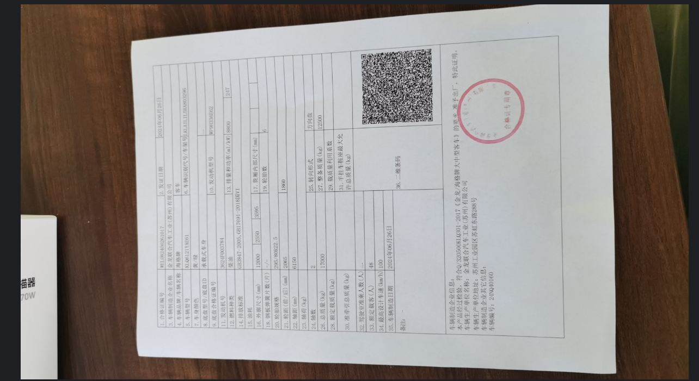
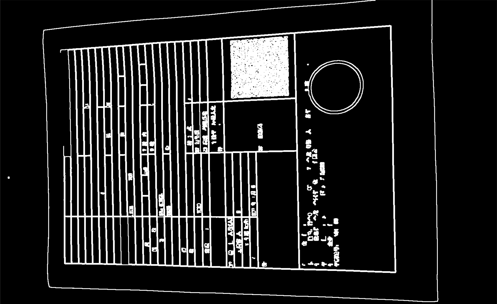
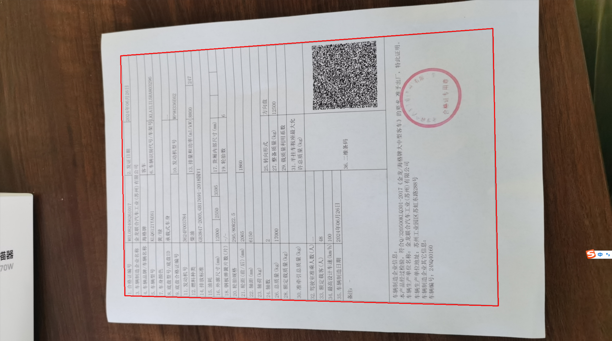
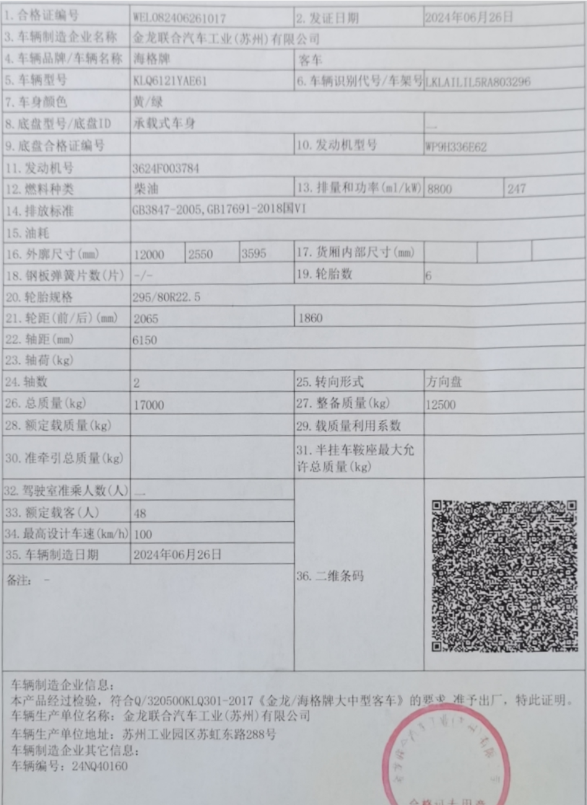

- 原始图片



## 1.1 Canny函数边缘检测

这一步通过opencv的Canny函数将边缘提取出来（具体的功能介绍请自己查阅），值得一提的是在canny前为防止一些噪点必须通过高斯模糊去噪点，然后也膨胀边缘使图像更容易闭合

```python
# 边缘检测
def getCanny(image):
    # 高斯模糊
    binary = cv2.GaussianBlur(image, (3, 3), 2, 2)
    # 边缘检测
    binary = cv2.Canny(binary, 60, 240, apertureSize=3)
    # 膨胀操作，尽量使边缘闭合
    kernel = np.ones((3, 3), np.uint8)
    binary = cv2.dilate(binary, kernel, iterations=1)
    return binary
```



## 1.2 最大轮廓提取

通过findContours拟合出所有的轮廓，然后找出最大的轮廓即是纸质的边缘（因为拍摄的时候，我们的目标图形一般是最大的）

```python

# 求出面积最大的轮廓
def findMaxContour(image):
    # 对于 OpenCV 4.x 及以上版本
    contours, _ = cv2.findContours(image, cv2.RETR_EXTERNAL, cv2.CHAIN_APPROX_NONE)
    # 找到面积最大的轮廓
    max_area = 0
    max_contour = None
    for contour in contours:
        area = cv2.contourArea(contour)
        if area > max_area:
            max_area = area
            max_contour = contour

    return max_contour, max_area

# 多边形拟合凸包的四个顶点
def getBoxPoint(contour):
    # 多边形拟合凸包
    hull = cv2.convexHull(contour)
    epsilon = 0.02 * cv2.arcLength(contour, True)
    approx = cv2.approxPolyDP(hull, epsilon, True)
    approx = approx.reshape((len(approx), 2))
    return approx
```



## 1.3 图像矫正

至此为止，我们都是在resize后的图片上找那四个顶点，我们还必须根据这4个点映射回原图的点。而且我们得到的图像是一个梯形形状，这时我们还要通过透视变化改成长方形的形状。

```python
def Perspective_transform(box, original_img):
    orignal_W = math.ceil(np.sqrt((box[3][1] - box[2][1]) ** 2 + (box[3][0] - box[2][0]) ** 2))
    orignal_H = math.ceil(np.sqrt((box[3][1] - box[0][1]) ** 2 + (box[3][0] - box[0][0]) ** 2))
    pts1 = np.float32([box[0], box[1], box[2], box[3]])
    pts2 = np.float32(
        [[int(orignal_W + 1), int(orignal_H + 1)], [0, int(orignal_H + 1)], [0, 0], [int(orignal_W + 1), 0]])
    # 生成透视变换矩阵；进行透视变换
    M = cv2.getPerspectiveTransform(pts1, pts2)
    result_img = cv2.warpPerspective(original_img, M, (int(orignal_W + 3), int(orignal_H + 1)))
    return result_img
```



## 1.4 完整代码

```python
# _*_ coding: utf-8 _*_
"""
Time:     2024/9/22 上午9:58
Author:   EasonShu
Version:  V 0.1
File:     clipper.py.py
Describe: 
"""
import math

#!/usr/bin/env python3
# -*- coding: utf-8 -*-
import cv2
import numpy as np


# 固定尺寸
def resizeImg(image, height=1920):
    h, w = image.shape[:2]
    pro = height / h
    size = (int(w * pro), int(height))
    img = cv2.resize(image, size)
    return img


# 边缘检测
def getCanny(image):
    # 高斯模糊
    binary = cv2.GaussianBlur(image, (3, 3), 2, 2)
    # 边缘检测
    binary = cv2.Canny(binary, 60, 240, apertureSize=3)
    # 膨胀操作，尽量使边缘闭合
    kernel = np.ones((3, 3), np.uint8)
    binary = cv2.dilate(binary, kernel, iterations=1)
    return binary


# 求出面积最大的轮廓
def findMaxContour(image):
    # 对于 OpenCV 4.x 及以上版本
    contours, _ = cv2.findContours(image, cv2.RETR_EXTERNAL, cv2.CHAIN_APPROX_NONE)
    # 找到面积最大的轮廓
    max_area = 0
    max_contour = None
    for contour in contours:
        area = cv2.contourArea(contour)
        if area > max_area:
            max_area = area
            max_contour = contour

    return max_contour, max_area

# 多边形拟合凸包的四个顶点
def getBoxPoint(contour):
    # 多边形拟合凸包
    hull = cv2.convexHull(contour)
    epsilon = 0.02 * cv2.arcLength(contour, True)
    approx = cv2.approxPolyDP(hull, epsilon, True)
    approx = approx.reshape((len(approx), 2))
    return approx


def Perspective_transform(box, original_img):
    orignal_W = math.ceil(np.sqrt((box[3][1] - box[2][1]) ** 2 + (box[3][0] - box[2][0]) ** 2))
    orignal_H = math.ceil(np.sqrt((box[3][1] - box[0][1]) ** 2 + (box[3][0] - box[0][0]) ** 2))
    pts1 = np.float32([box[0], box[1], box[2], box[3]])
    pts2 = np.float32(
        [[int(orignal_W + 1), int(orignal_H + 1)], [0, int(orignal_H + 1)], [0, 0], [int(orignal_W + 1), 0]])
    # 生成透视变换矩阵；进行透视变换
    M = cv2.getPerspectiveTransform(pts1, pts2)
    result_img = cv2.warpPerspective(original_img, M, (int(orignal_W + 3), int(orignal_H + 1)))
    return result_img


if __name__ == '__main__':
    img_path = './images/img_6.png'
    image = cv2.imread(img_path)
    # # 图像缩放 1920* 1080
    # image = resizeImg(image)
    binary_img = getCanny(image)
    max_contour, max_area = findMaxContour(binary_img)
    boxes = getBoxPoint(max_contour)
    warped = Perspective_transform(boxes,image)
    cv2.imshow('warpImage', warped)
    cv2.waitKey(0)
```

