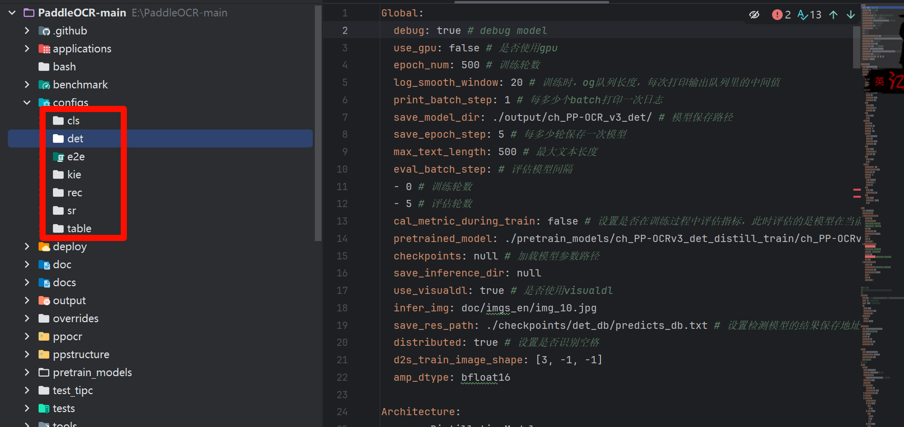

- 官网：https://www.paddlepaddle.org.cn/
- 教程：[PaddleOCR 模型训练及使用详细教程_paddleocr 使用-CSDN 博客](https://blog.csdn.net/qq_41273999/article/details/135692215?spm=1001.2101.3001.6650.1&utm_medium=distribute.pc_relevant.none-task-blog-2~default~BlogOpenSearchComplete~PaidSort-1-135692215-blog-131817619.235^v43^pc_blog_bottom_relevance_base5&depth_1-utm_source=distribute.pc_relevant.none-task-blog-2~default~BlogOpenSearchComplete~PaidSort-1-135692215-blog-131817619.235^v43^pc_blog_bottom_relevance_base5&utm_relevant_index=2)

# 一 环境查看

## 1.1 Python 环境

> Pyhton 环境

- 需要确认 python 的版本是否满足要求使用以下命令确认是 `3.8/3.9/3.10/3.11/3.12`

```python
python`` ``--``version
```


- 安装 Python 环境：参考教程：https://blog.csdn.net/qq_53280175/article/details/121107748

> pip 的版本

- 需要确认 pip 的版本是否满足要求，要求 pip 版本为 20.2.2 或更高版本

```python
python -m ensurepip
python -m pip --version
```


> 处理器架构

- 需要确认 Python 和 pip 是 64bit，并且处理器架构是 x86_64（或称作 x64、Intel 64、AMD64）架构。下面的第一行输出的是”64bit”，第二行输出的是”x86_64”、”x64”或”AMD64”即可

```python
python -c "import platform;print(platform.architecture()[0]);print(platform.machine())"
```


## 1.2 版本选择

- 简单来说分为 CPU 与 GPU 版本，我这里选择 CPU 版本
- CPU 的配置较简单，而 GPU 相对复杂，且配置繁琐
- 安装

```python
python -m pip install paddlepaddle==3.0.0b0 -i https://www.paddlepaddle.org.cn/packages/stable/cpu/
```

- 卸载

```python
python -m pip uninstall paddlepaddle
```


## 1.3 飞浆测试

```python
"""
 @Author: EasonShu
 @FileName: ImagesTest.py
 @DateTime: 2024/7/18 下午4:10
"""
import time

from paddleocr import PaddleOCR
from paddlenlp import Taskflow

from paddleocr import PaddleOCR
from sympy import true
#
# ocr = PaddleOCR(use_angle_cls=True,
#                 lang="ch",
#                 det_model_dir='model/mymodel/',
#                 rec_model_dir='model/recmodel/'
#                 )  # need to run only once to download and load model into memory
ocr = PaddleOCR(use_angle_cls=True,
                lang="ch"
                )  # need to run only once to download and load model into memory

if __name__ == '__main__':
    # 中文结果
    chinese_characters =""
    SatrtTime = time.time()
    # 选择图片
    result = ocr.ocr("./images/微信图片_20240801205243.jpg", cls=True)
    for idx in range(len(result)):
        res = result[idx]
        for line in res:
            # 识别结果, 如果与dict中no_orc.txt的识别字符匹配，则滤掉
            chinese_characters += line[1][0]+"\n"
    print(chinese_characters)
    print("识别时间：", time.time() - SatrtTime)
```

- 如果有结果表示安装成功可以进行下一步

# 二 数据集的标准备

## 2.1 PPOCRLabelv2

PPOCRLabel 是一款适用于 OCR 领域的半自动化图形标注工具，内置 PP-OCR 模型对数据自动标注和重新识别。使用 Python3 和 PyQT5 编写，支持矩形框标注、表格标注、不规则文本标注、关键信息标注模式，导出格式可直接用于 PaddleOCR 检测和识别模型的训练。

> 环境搭建

### 2.1.1 安装 PaddlePaddle

```python
pip3 install --upgrade pip
# 如果您的机器是CPU，请运行以下命令安装
python3 -m pip install paddlepaddle -i https://pypi.tuna.tsinghua.edu.cn/simple
```

- 我的机器就是 CPU

### 2.1.2 安装与运行 PPOCRLabel

- Window 平台

```python
pip install PPOCRLabel  # 安装
# 选择标签模式来启动
PPOCRLabel --lang ch  # 启动【普通模式】，用于打【检测+识别】场景的标签
PPOCRLabel --lang ch --kie True  # 启动 【KIE 模式】，用于打【检测+识别+关键字提取】场景的标签
```

- 运行


- 导入数据，自动标注：注意有些标注点组要自己修改


- 结果文件说明：

  - | Label.txt     | 检测标签，可直接用于PPOCR检测模型训练。用户每确认5张检测结果后，程序会进行自动写入。当用户关闭应用程序或切换文件路径后同样会进行写入。 |
    | ------------- | ------------------------------------------------------------ |
    | fileState.txt | 图片状态标记文件，保存当前文件夹下已经被用户手动确认过的图片名称。 |
    | Cache.cach    | 缓存文件，保存模型自动识别的结果。                           |
    | rec_gt.txt    | 识别标签。可直接用于PPOCR识别模型训练。需用户手动点击菜单栏“文件” - "导出识别结果"后产生。 |
    | crop_img      | 识别数据。按照检测框切割后的图片。与rec_gt.txt同时产生。     |

### 2.1.3 数据集划分

- 方案一：自己下载源码：https://github.com/PFCCLab/PPOCRLabel
- 安装依赖：


- **方案二：先查看下载的 ppocrlabel 库所在位置：pip show ppocrlabel**


- 进入该目录终端运行该命令

```python
python gen_ocr_train_val_test.py --trainValTestRatio 6:2:2 --datasetRootPath E:\PPOCRLabel-main\train_data --detRootPath E:\PPOCRLabel-main\train_data\det --recRootPath E:\PPOCRLabel-main\train_data\rec
```

- trainValTestRatio 是训练集、验证集、测试集的图像数量划分比例，根据实际情况设定，默认是 6:2:2
- datasetRootPath 是 PPOCRLabel 标注的完整数据集存放路径。默认路径是 …/train_data/ 就是步骤 6 的结果文件夹 train_data 文件夹。
- detRootPath 是输出训练文字检测的数据集存放路径。默认路径是 …/train_data/det
- recRootPath 是输出训练文字识别的数据集存放路径。默认路径是 …/train_data/rec

**编写脚本方便下次使用**

```bash
@echo off
setlocal enabledelayedexpansion

:: 打印系统信息
echo -------- System Information --------
echo Current Date and Time: !date! !time!
echo Python Version:
python --version

:: 指定数据分割脚本的路径和参数
set SCRIPT=gen_ocr_train_val_test.py
set TRAINVALTESTRATIO=6:2:2
set DATASETROOTPATH=E:\PPOCRLabel-main\train_data
set DETROOTPATH=E:\PPOCRLabel-main\train_data\det
set RECROOTPATH=E:\PPOCRLabel-main\train_data\rec

:: 打印数据集分割命令
echo --------
echo Data Split Command:
echo python !SCRIPT! --trainValTestRatio !TRAINVALTESTRATIO! --datasetRootPath !DATASETROOTPATH! --detRootPath !DETROOTPATH! --recRootPath !RECROOTPATH!

:: 执行Python数据集分割命令
echo --------
echo -------- begin data split --------
python !SCRIPT! --trainValTestRatio !TRAINVALTESTRATIO! --datasetRootPath !DATASETROOTPATH! --detRootPath !DETROOTPATH! --recRootPath !RECROOTPATH!
echo -------- end data split --------

endlocal
```


- 数据集划分结果：为下一步模型训练做准备


# 三 PaddleOCR 的环境搭建

## 3.1 环境搭建

- 下载地址：https://github.com/PaddlePaddle/PaddleOCR/tree/main
- 解压下载，用 Pycharm 打开


- 依赖下载

```
 pip install -i https://pypi.tuna.tsinghua.edu.cn/simple -r requirements.txt
```


## 3.2 模型下载

- 参考网站：https://github.com/PaddlePaddle/PaddleOCR/blob/main/doc/doc_ch/models_list.md
- 主要分为三类：文本检测，文本识别，文本方向
- det_model_dir 是检测模型的位置，rec_model_dir 是识别模型的位置，cls_model_dir 是分类模型的位置。


- 将上一步的训练数据集已入跟目录下


# 四 模型训练

- 参考配置文件：https://github.com/PaddlePaddle/PaddleOCR/blob/main/doc/doc_ch/config.md


- 新建 pretrain_models 文件夹，下载训练模型
- 模型下载地址：https://github.com/PaddlePaddle/PaddleOCR/blob/release/2.7/doc/doc_ch/models_list.md


- 注意：是训练模型，不是推理模型，而且有需要对应的配置文件，这个目录有




## 4.1 检测模型训练


- 关键参数

```yaml
Global:
  debug: false # debug model
  use_gpu: false # 是否使用gpu
  epoch_num: 500 # 训练轮数
  log_smooth_window: 20 # 训练时，og队列长度，每次打印输出队列里的中间值
  print_batch_step: 10 # 每多少个batch打印一次日志
  save_model_dir: ./output/ch_PP-OCR_v3_det/ # 模型保存路径
  save_epoch_step: 100 # 每多少轮保存一次模型
  max_text_length: 500 # 最大文本长度
  eval_batch_step: # 评估模型间隔
  - 0 # 训练轮数
  - 1 # 评估轮数
  cal_metric_during_train: false # 设置是否在训练过程中评估指标，此时评估的是模型在当前batch下的指标
  pretrained_model: ./pretrain_models/ch_PP-OCRv3_det_distill_train/ch_PP-OCRv3_det_distill_train/best_accuracy #设置加载预训练模型路径
  checkpoints: null # 加载模型参数路径
  save_inference_dir: null
  use_visualdl: true # 是否使用visualdl
  infer_img: doc/imgs_en/img_10.jpg
  save_res_path: ./checkpoints/det_db/predicts_db.txt # 设置检测模型的结果保存地址
  distributed: true # 设置是否识别空格
  d2s_train_image_shape: [3, -1, -1]
  amp_dtype: bfloat16

Architecture:
  name: DistillationModel
  algorithm: Distillation
  model_type: det
  Models:
    Student:
      pretrained:
      model_type: det
      algorithm: DB
      Transform: null
      Backbone:
        name: MobileNetV3
        scale: 0.5
        model_name: large
        disable_se: true
      Neck:
        name: RSEFPN
        out_channels: 96
        shortcut: True
      Head:
        name: DBHead
        k: 50
    Student2:
      pretrained:
      model_type: det
      algorithm: DB
      Transform: null
      Backbone:
        name: MobileNetV3
        scale: 0.5
        model_name: large
        disable_se: true
      Neck:
        name: RSEFPN
        out_channels: 96
        shortcut: True
      Head:
        name: DBHead
        k: 50
    Teacher:
      freeze_params: true
      return_all_feats: false
      model_type: det
      algorithm: DB
      Backbone:
        name: ResNet_vd
        in_channels: 3
        layers: 50
      Neck:
        name: LKPAN
        out_channels: 256
      Head:
        name: DBHead
        kernel_list: [7,2,2]
        k: 50

Loss:
  name: CombinedLoss
  loss_config_list:
  - DistillationDilaDBLoss:
      weight: 1.0
      model_name_pairs:
      - ["Student", "Teacher"]
      - ["Student2", "Teacher"]
      key: maps
      balance_loss: true
      main_loss_type: DiceLoss
      alpha: 5
      beta: 10
      ohem_ratio: 3
  - DistillationDMLLoss:
      model_name_pairs:
      - ["Student", "Student2"]
      maps_name: "thrink_maps"
      weight: 1.0
      model_name_pairs: ["Student", "Student2"]
      key: maps
  - DistillationDBLoss:
      weight: 1.0
      model_name_list: ["Student", "Student2"]
      balance_loss: true
      main_loss_type: DiceLoss
      alpha: 5
      beta: 10
      ohem_ratio: 3


####优化器类名###
###学习率是训练神经网络的重要超参数之一，它代表在每一次迭代中梯度向损失函数最优解移动的步长。
###
Optimizer:
  name: Adam # 目前支持Momentum,Adam,RMSProp, 见ppocr/optimizer/optimizer.py
  beta1: 0.9 # 设置一阶矩估计的指数衰减率
  beta2: 0.999 # 设置二阶矩估计的指数衰减率
  lr:
    name: Cosine
    learning_rate: 0.001
    warmup_epoch: 2
  regularizer:
    name: L2
    factor: 5.0e-05

PostProcess:
  name: DistillationDBPostProcess
  model_name: ["Student"]
  key: head_out
  thresh: 0.3
  box_thresh: 0.6
  max_candidates: 1000
  unclip_ratio: 1.5

Metric:
  name: DistillationMetric
  base_metric_name: DetMetric
  main_indicator: hmean
  key: "Student"
# 训练数据集配置
Train:
  dataset:
    name: SimpleDataSet
    data_dir: ./train_data/ # 数据集路径
    label_file_list:
      - ./train_data/det/train.txt # 训练数据标签文件
    ratio_list: [1.0]
    transforms:
    - DecodeImage:
        img_mode: BGR
        channel_first: false
    - DetLabelEncode: null
    - CopyPaste:
    - IaaAugment:
        augmenter_args:
        - type: Fliplr
          args:
            p: 0.5
        - type: Affine
          args:
            rotate:
            - -10
            - 10
        - type: Resize
          args:
            size:
            - 0.5
            - 3
    - EastRandomCropData:
        size:
        - 960
        - 960
        max_tries: 50
        keep_ratio: true
    - MakeBorderMap:
        shrink_ratio: 0.4
        thresh_min: 0.3
        thresh_max: 0.7
    - MakeShrinkMap:
        shrink_ratio: 0.4
        min_text_size: 8
    - NormalizeImage:
        scale: 1./255.
        mean:
        - 0.485
        - 0.456
        - 0.406
        std:
        - 0.229
        - 0.224
        - 0.225
        order: hwc
    - ToCHWImage: null
    - KeepKeys:
        keep_keys:
        - image
        - threshold_map
        - threshold_mask
        - shrink_map
        - shrink_mask
  loader:
    shuffle: true
    drop_last: false
    batch_size_per_card: 8
    num_workers: 4
# 评估数据集配置
Eval:
  dataset:
    name: SimpleDataSet
    data_dir: ./train_data/ # 数据集路径
    label_file_list:
      - ./train_data/det/val.txt # 训练数据标签文件
    transforms:
      - DecodeImage: # load image
          img_mode: BGR
          channel_first: False
      - DetLabelEncode: # Class handling label
      - DetResizeForTest:
      - NormalizeImage:
          scale: 1./255.
          mean: [0.485, 0.456, 0.406]
          std: [0.229, 0.224, 0.225]
          order: 'hwc'
      - ToCHWImage:
      - KeepKeys:
          keep_keys: ['image', 'shape', 'polys', 'ignore_tags']
  loader:
    shuffle: False
    drop_last: False
    batch_size_per_card: 1 # must be 1
    num_workers: 2
```

- 开始训练，注意在根目录下

```python
 python tools/train.py -c pretrain_models/ch_PP-OCRv3_det_cml.yml
```

- 编写运行脚本下次使用

```python
@echo off
setlocal enabledelayedexpansion

:: 指定Python解释器的路径，如果不在PATH中
:: set PYTHON_EXECUTABLE=C:\path\to\python.exe

:: 打印系统信息
echo -------- System Information --------
echo Current Date and Time: !date! !time!
echo Python Version:
python --version
echo PaddlePaddle Version:
python -c "import paddle; print(paddle.__version__)"

:: 指定训练脚本和配置文件的路径
set TRAIN_SCRIPT=tools\train.py
set CONFIG_FILE=pretrain_models\ch_PP-OCRv3_det_cml.yml

:: 打印训练命令
echo --------
echo Training Command:
echo python !TRAIN_SCRIPT! -c !CONFIG_FILE!

:: 执行Python训练命令
echo --------
echo -------- begin train --------
python !TRAIN_SCRIPT! -c !CONFIG_FILE!
echo -------- end train --------

endlocal
```

- 查看日志


- 评估模型中

```
hmean: 0.90104772991851, is_float16: False, precision: 0.8745762711864407, recall: 0.929171668667467, fps: 0.010587729849145846, best_epoch: 1 
```

1. hmean （调和平均数）: 这是精度（precision）和召回率（recall）的调和平均数，通常用于评估分类器的整体性能。它在两个指标都较高时才给出较高的值，因此是一个更全面的性能度量。0.90104772991851 是一个相当高的值，表明模型在预测方面表现良好。
2. is_float16: 这个布尔值表明模型是否使用了 float16 数据类型。False 意味着模型使用的是更高精度的数据类型，如 float32 或 float64。
3. precision （精确率）: 这是所有被模型预测为正类别的样本中，真正属于正类别的比例。0.8745762711864407 表示当模型预测某个样本为正类时，大约有 87.46% 的概率它是正确的。
4. recall （召回率）: 这是所有实际为正类别的样本中，被模型正确识别为正类别的比例。0.929171668667467 表示模型能够识别出大约 92.92% 的真实正类样本。
5. fps: 这可能指的是每秒帧数（Frames Per Second），如果这个上下文与图像处理或视频分析相关。但是，在机器学习模型评估中，这可能是指“假阳性每秒”（False Positives per Second），表示模型每秒钟产生的假阳性数量。0.010587729849145846 指的是模型每秒产生的假阳性非常低。
6. best_epoch: 这个值指示训练过程中哪个 epoch（训练轮次）的模型表现最佳。在这个例子中，best_epoch 是 1，意味着模型在第一个 epoch 结束时达到了最佳性能。

- 日志查看：经过 20 轮的训练，我们可以看到参数在发生变化，但是 CPU 运行效率有点慢


## 4.2 识别模型训练


- 配置文件

```python
Global:
  debug: true
  use_gpu: false
  epoch_num: 100
  log_smooth_window: 20
  print_batch_step: 1
  save_model_dir: ./output/rec_ppocr_v3_distillation
  save_epoch_step: 10
  eval_batch_step: [0, 10]
  cal_metric_during_train: true
  pretrained_model: ./pretrain_models/ch_PP-OCRv3_rec_train/ch_PP-OCRv3_rec_train/best_accuracy #设置加载预训练模型路径
  checkpoints:
  save_inference_dir:
  use_visualdl: false
  infer_img: doc/imgs_words/ch/word_1.jpg
  character_dict_path: ppocr/utils/ppocr_keys_v1.txt
  max_text_length: &max_text_length 1000
  infer_mode: false
  use_space_char: true
  distributed: true
  save_res_path: ./output/rec/predicts_ppocrv3_distillation.txt
  d2s_train_image_shape: [3, 48, -1]


Optimizer:
  name: Adam
  beta1: 0.9
  beta2: 0.999
  lr:
    name: Piecewise
    decay_epochs : [700]
    values : [0.0005, 0.00005]
    warmup_epoch: 5
  regularizer:
    name: L2
    factor: 3.0e-05


Architecture:
  model_type: &model_type "rec"
  name: DistillationModel
  algorithm: Distillation
  Models:
    Teacher:
      pretrained:
      freeze_params: false
      return_all_feats: true
      model_type: *model_type
      algorithm: SVTR_LCNet
      Transform:
      Backbone:
        name: MobileNetV1Enhance
        scale: 0.5
        last_conv_stride: [1, 2]
        last_pool_type: avg
        last_pool_kernel_size: [2, 2]
      Head:
        name: MultiHead
        head_list:
          - CTCHead:
              Neck:
                name: svtr
                dims: 64
                depth: 2
                hidden_dims: 120
                use_guide: True
              Head:
                fc_decay: 0.00001
          - SARHead:
              enc_dim: 512
              max_text_length: *max_text_length
    Student:
      pretrained:
      freeze_params: false
      return_all_feats: true
      model_type: *model_type
      algorithm: SVTR_LCNet
      Transform:
      Backbone:
        name: MobileNetV1Enhance
        scale: 0.5
        last_conv_stride: [1, 2]
        last_pool_type: avg
        last_pool_kernel_size: [2, 2]
      Head:
        name: MultiHead
        head_list:
          - CTCHead:
              Neck:
                name: svtr
                dims: 64
                depth: 2
                hidden_dims: 120
                use_guide: True
              Head:
                fc_decay: 0.00001
          - SARHead:
              enc_dim: 512
              max_text_length: *max_text_length
Loss:
  name: CombinedLoss
  loss_config_list:
  - DistillationDMLLoss:
      weight: 1.0
      act: "softmax"
      use_log: true
      model_name_pairs:
      - ["Student", "Teacher"]
      key: head_out
      multi_head: True
      dis_head: ctc
      name: dml_ctc
  - DistillationDMLLoss:
      weight: 0.5
      act: "softmax"
      use_log: true
      model_name_pairs:
      - ["Student", "Teacher"]
      key: head_out
      multi_head: True
      dis_head: sar
      name: dml_sar
  - DistillationDistanceLoss:
      weight: 1.0
      mode: "l2"
      model_name_pairs:
      - ["Student", "Teacher"]
      key: backbone_out
  - DistillationCTCLoss:
      weight: 1.0
      model_name_list: ["Student", "Teacher"]
      key: head_out
      multi_head: True
  - DistillationSARLoss:
      weight: 1.0
      model_name_list: ["Student", "Teacher"]
      key: head_out
      multi_head: True

PostProcess:
  name: DistillationCTCLabelDecode
  model_name: ["Student", "Teacher"]
  key: head_out
  multi_head: True

Metric:
  name: DistillationMetric
  base_metric_name: RecMetric
  main_indicator: acc
  key: "Student"
  ignore_space: False

Train:
  dataset:
    name: SimpleDataSet
    data_dir: ./train_data/ # 数据集路径
    ext_op_transform_idx: 1
    label_file_list:
    - ./train_data/rec/train.txt # 训练数据标签文件
    transforms:
    - DecodeImage:
        img_mode: BGR
        channel_first: false
    - RecConAug:
        prob: 0.5
        ext_data_num: 2
        image_shape: [48, 320, 3]
        max_text_length: *max_text_length
    - RecAug:
    - MultiLabelEncode:
    - RecResizeImg:
        image_shape: [3, 48, 320]
    - KeepKeys:
        keep_keys:
        - image
        - label_ctc
        - label_sar
        - length
        - valid_ratio
  loader:
    shuffle: true
    batch_size_per_card: 128
    drop_last: true
    num_workers: 4
Eval:
  dataset:
    name: SimpleDataSet
    data_dir: ./train_data
    label_file_list:
    - ./train_data/rec/val.txt # 训练数据标签文件
    transforms:
    - DecodeImage:
        img_mode: BGR
        channel_first: false
    - MultiLabelEncode:
    - RecResizeImg:
        image_shape: [3, 48, 320]
    - KeepKeys:
        keep_keys:
        - image
        - label_ctc
        - label_sar
        - length
        - valid_ratio
  loader:
    shuffle: false
    drop_last: false
    batch_size_per_card: 128
    num_workers: 4
```

- 执行训练

```
 python tools/train.py -c pretrain_models/ch_PP-OCRv3_rec_distillation.yml
```

- 编写脚本

```python
@echo off
setlocal enabledelayedexpansion

:: 指定Python解释器的路径，如果不在PATH中
:: set PYTHON_EXECUTABLE=C:\path\to\python.exe

:: 打印系统信息
echo -------- System Information --------
echo Current Date and Time: !date! !time!
echo Python Version:
python --version
echo PaddlePaddle Version:
python -c "import paddle; print(paddle.__version__)"

:: 指定训练脚本和配置文件的路径
set TRAIN_SCRIPT=tools\train.py
set CONFIG_FILE=pretrain_models\ch_PP-OCRv3_rec_distillation.yml

:: 打印训练命令
echo --------
echo Training Command:
echo python !TRAIN_SCRIPT! -c !CONFIG_FILE!

:: 执行Python训练命令
echo --------
echo -------- begin train --------
python !TRAIN_SCRIPT! -c !CONFIG_FILE!
echo -------- end train --------

endlocal
```

- 运行结果：我们可以发现准确率不高，需要多次训练


```
acc: 0.5774739545737373, norm_edit_dis: 0.8797479676734311, Teacher_acc: 0.5605468713506063, Teacher_norm_edit_dis: 0.8741167944408945, fps: 3.7627413423809424
```

**acc （Accuracy， 准确率）**:

- **值**： 0.5774739545737373
- **解释**： 准确率表示模型预测正确的比例。在这里，模型的准确率约为 57.75%，即模型在测试数据上有 57.75%的预测是正确的。

**norm_edit_dis （Normalized Edit Distance， 归一化编辑距离）**:

- **值**： 0.8797479676734311
- **解释**： 归一化编辑距离用于衡量模型预测与真实标签之间的差异，值越小表示预测越接近真实值。在这里，归一化编辑距离约为 0.88，表明模型预测与真实标签之间有一定的差异。

**Teacher_acc （Teacher Accuracy， 教师模型准确率）**:

- **值**： 0.5605468713506063
- **解释**： 教师模型是用于指导学生模型训练的参考模型。教师模型的准确率约为 56.05%。

**Teacher_norm_edit_dis （Teacher Normalized Edit Distance， 教师模型归一化编辑距离）**:

- **值**： 0.8741167944408945
- **解释**： 教师模型的归一化编辑距离约为 0.87，表示教师模型预测与真实标签之间的差异情况。

**fps （Frames per Second， 每秒帧数）**:

- **值**： 3.7627413423809424
- **解释**： 每秒帧数表示模型处理每帧图像的速度。在这里，模型每秒能处理约 3.76 帧图像，说明模型的计算速度。

# 五 模型转换

## 5.1 检测模型转换

- 执行命令

```
python tools/export_model.py -c pretrain_models/ch_PP-OCRv3_det_cml.yml -o Global.pretrained_model=./output/ch_PP-OCR_v3_det/best_accuracy  Global.save_inference_dir=./inference_model/det_model/
```

- -c 指定导出模型使用的配置文件，需与训练时使用的配置文件相同
- -o 指定配置文件中的某个参数，即在不修改配置文件的情况下修改参数
- Global.pretrained_model 此处是指要导出模型的参数文件路径
- Global.save_inference_dir 指导出模型的保存路径
- 导出结果


## 5.2 识别模型转换

- 执行命令

```
 python tools/export_model.py -c pretrain_models/ch_PP-OCRv3_det_cml.yml -o Global.pretrained_model=./output/rec_ppocr_v3_distillation/best_accuracy  Global.save_inference_dir=./inference_model/ret_model/

```

- -c 指定导出模型使用的配置文件，需与训练时使用的配置文件相同
- -o 指定配置文件中的某个参数，即在不修改配置文件的情况下修改参数
- Global.pretrained_model 此处是指要导出模型的参数文件路径
- Global.save_inference_dir 指导出模型的保存路径
- 导出结果，参考上面只是目录不一样

# 六 使用模型


```python
"""
 @Author: EasonShu
 @FileName: ImagesTest.py
 @DateTime: 2024/7/18 下午4:10
"""
import time

from paddleocr import PaddleOCR
from paddlenlp import Taskflow

from paddleocr import PaddleOCR
from sympy import true
#
ocr = PaddleOCR(use_angle_cls=True,
                lang="ch",
                det_model_dir='model/mymodel/',
                rec_model_dir='model/ch_PP-OCRv4_rec_server_infer/'
                )  # need to run only once to download and load model into memory
# ocr = PaddleOCR(use_angle_cls=True,
#                 lang="ch"
#                 )  # need to run only once to download and load model into memory
# 加载dict下的不识别字符，过滤掉


if __name__ == '__main__':
    # 中文结果
    chinese_characters =""
    SatrtTime = time.time()
    # 选择图片
    result = ocr.ocr("./images/810a19d8bc3eb1359aef8739a61ea8d3fd1f4403.jpg", cls=True)
    for idx in range(len(result)):
        res = result[idx]
        for line in res:
            # 识别结果, 如果与dict中no_orc.txt的识别字符匹配，则滤掉
            chinese_characters += line[1][0]+"\n"
    print(chinese_characters)
    print("识别时间：", time.time() - SatrtTime)
```


- 可以发现效果不是很好，可能需要更多数据集