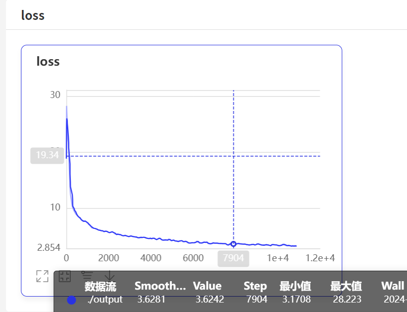

PaddleDetection是一个基于PaddlePaddle的目标检测端到端开发套件，在提供丰富的模型组件和测试基准的同时，注重端到端的产业落地应用，通过打造产业级特色模型|工具、建设产业应用范例等手段，帮助开发者实现数据准备、模型选型、模型训练、模型部署的全流程打通，快速进行落地应用。

- 效果


- 官方文档：https://gitee.com/paddlepaddle/PaddleDetection

## 1.1 准备数据集

- 官方支持`VOC`与`Coco`数据集

### 1.1.1  LabelMe标注格式

- 安装：

```bash
conda create –name=labelme python=3
conda activate labelme
pip install pyqt5
pip install labelme
```

- 启动

```bash
labelme
```


- 打开进行标注


- 进行标注


> 注意：如果是多边形只支持COCO数据集，在转换VOC的过程中会报错，VOC数据集支持矩形

- 这里我们需要大量的数据集进行标注，注意里面的图片需要每一个进行标注

### 1.1.2 数据集转换成COCO

- 脚本

```python
# _*_ coding: utf-8 _*_
"""
Time:     2024/9/29 下午8:47
Author:   EasonShu
Version:  V 0.1
File:     LableToCoCo.py
Describe: 
"""
#!/usr/bin/env python
# coding: utf-8
# Copyright (c) 2019 PaddlePaddle Authors. All Rights Reserved.
#
# Licensed under the Apache License, Version 2.0 (the "License");
# you may not use this file except in compliance with the License.
# You may obtain a copy of the License at
#
#     http://www.apache.org/licenses/LICENSE-2.0
#
# Unless required by applicable law or agreed to in writing, software
# distributed under the License is distributed on an "AS IS" BASIS,
# WITHOUT WARRANTIES OR CONDITIONS OF ANY KIND, either express or implied.
# See the License for the specific language governing permissions and
# limitations under the License.

import argparse
import glob
import json
import os
import os.path as osp
import shutil
import xml.etree.ElementTree as ET

import numpy as np
import PIL.ImageDraw
from tqdm import tqdm
import cv2

label_to_num = {}
categories_list = []
labels_list = []


class MyEncoder(json.JSONEncoder):
    def default(self, obj):
        if isinstance(obj, np.integer):
            return int(obj)
        elif isinstance(obj, np.floating):
            return float(obj)
        elif isinstance(obj, np.ndarray):
            return obj.tolist()
        else:
            return super(MyEncoder, self).default(obj)


def images_labelme(data, num):
    image = {}
    image['height'] = data['imageHeight']
    image['width'] = data['imageWidth']
    image['id'] = num + 1
    if '\\' in data['imagePath']:
        image['file_name'] = data['imagePath'].split('\\')[-1]
    else:
        image['file_name'] = data['imagePath'].split('/')[-1]
    return image


def images_cityscape(data, num, img_file):
    image = {}
    image['height'] = data['imgHeight']
    image['width'] = data['imgWidth']
    image['id'] = num + 1
    image['file_name'] = img_file
    return image


def categories(label, labels_list):
    category = {}
    category['supercategory'] = 'component'
    category['id'] = len(labels_list) + 1
    category['name'] = label
    return category


def annotations_rectangle(points, label, image_num, object_num, label_to_num):
    annotation = {}
    seg_points = np.asarray(points).copy()
    seg_points[1, :] = np.asarray(points)[2, :]
    seg_points[2, :] = np.asarray(points)[1, :]
    annotation['segmentation'] = [list(seg_points.flatten())]
    annotation['iscrowd'] = 0
    annotation['image_id'] = image_num + 1
    annotation['bbox'] = list(
        map(float, [
            points[0][0], points[0][1], points[1][0] - points[0][0], points[1][
                1] - points[0][1]
        ]))
    annotation['area'] = annotation['bbox'][2] * annotation['bbox'][3]
    annotation['category_id'] = label_to_num[label]
    annotation['id'] = object_num + 1
    return annotation


def annotations_polygon(height, width, points, label, image_num, object_num,
                        label_to_num):
    annotation = {}
    annotation['segmentation'] = [list(np.asarray(points).flatten())]
    annotation['iscrowd'] = 0
    annotation['image_id'] = image_num + 1
    annotation['bbox'] = list(map(float, get_bbox(height, width, points)))
    annotation['area'] = annotation['bbox'][2] * annotation['bbox'][3]
    annotation['category_id'] = label_to_num[label]
    annotation['id'] = object_num + 1
    return annotation


def get_bbox(height, width, points):
    polygons = points
    mask = np.zeros([height, width], dtype=np.uint8)
    mask = PIL.Image.fromarray(mask)
    xy = list(map(tuple, polygons))
    PIL.ImageDraw.Draw(mask).polygon(xy=xy, outline=1, fill=1)
    mask = np.array(mask, dtype=bool)
    index = np.argwhere(mask == 1)
    rows = index[:, 0]
    clos = index[:, 1]
    left_top_r = np.min(rows)
    left_top_c = np.min(clos)
    right_bottom_r = np.max(rows)
    right_bottom_c = np.max(clos)
    return [
        left_top_c, left_top_r, right_bottom_c - left_top_c,
        right_bottom_r - left_top_r
    ]


def deal_json(ds_type, img_path, json_path):
    data_coco = {}
    images_list = []
    annotations_list = []
    image_num = -1
    object_num = -1
    for img_file in os.listdir(img_path):
        img_label = os.path.splitext(img_file)[0]
        if img_file.split('.')[
                -1] not in ['bmp', 'jpg', 'jpeg', 'png', 'JPEG', 'JPG', 'PNG']:
            continue
        label_file = osp.join(json_path, img_label + '.json')
        print('Generating dataset from:', label_file)
        image_num = image_num + 1
        with open(label_file) as f:
            data = json.load(f)
            if ds_type == 'labelme':
                images_list.append(images_labelme(data, image_num))
            elif ds_type == 'cityscape':
                images_list.append(images_cityscape(data, image_num, img_file))
            if ds_type == 'labelme':
                for shapes in data['shapes']:
                    object_num = object_num + 1
                    label = shapes['label']
                    if label not in labels_list:
                        categories_list.append(categories(label, labels_list))
                        labels_list.append(label)
                        label_to_num[label] = len(labels_list)
                    p_type = shapes['shape_type']
                    if p_type == 'polygon':
                        points = shapes['points']
                        annotations_list.append(
                            annotations_polygon(data['imageHeight'], data[
                                'imageWidth'], points, label, image_num,
                                                object_num, label_to_num))

                    if p_type == 'rectangle':
                        (x1, y1), (x2, y2) = shapes['points']
                        x1, x2 = sorted([x1, x2])
                        y1, y2 = sorted([y1, y2])
                        points = [[x1, y1], [x2, y2], [x1, y2], [x2, y1]]
                        annotations_list.append(
                            annotations_rectangle(points, label, image_num,
                                                  object_num, label_to_num))
            elif ds_type == 'cityscape':
                for shapes in data['objects']:
                    object_num = object_num + 1
                    label = shapes['label']
                    if label not in labels_list:
                        categories_list.append(categories(label, labels_list))
                        labels_list.append(label)
                        label_to_num[label] = len(labels_list)
                    points = shapes['polygon']
                    annotations_list.append(
                        annotations_polygon(data['imgHeight'], data[
                            'imgWidth'], points, label, image_num, object_num,
                                            label_to_num))
    data_coco['images'] = images_list
    data_coco['categories'] = categories_list
    data_coco['annotations'] = annotations_list
    return data_coco


def voc_get_label_anno(ann_dir_path, ann_ids_path, labels_path):
    with open(labels_path, 'r') as f:
        labels_str = f.read().split()
    labels_ids = list(range(1, len(labels_str) + 1))

    with open(ann_ids_path, 'r') as f:
        ann_ids = [lin.strip().split(' ')[-1] for lin in f.readlines()]

    ann_paths = []
    for aid in ann_ids:
        if aid.endswith('xml'):
            ann_path = os.path.join(ann_dir_path, aid)
        else:
            ann_path = os.path.join(ann_dir_path, aid + '.xml')
        ann_paths.append(ann_path)

    return dict(zip(labels_str, labels_ids)), ann_paths


def voc_get_image_info(annotation_root, im_id):
    filename = annotation_root.findtext('filename')
    assert filename is not None
    img_name = os.path.basename(filename)

    size = annotation_root.find('size')
    width = float(size.findtext('width'))
    height = float(size.findtext('height'))

    image_info = {
        'file_name': filename,
        'height': height,
        'width': width,
        'id': im_id
    }
    return image_info


def voc_get_coco_annotation(obj, label2id):
    label = obj.findtext('name')
    assert label in label2id, "label is not in label2id."
    category_id = label2id[label]
    bndbox = obj.find('bndbox')
    xmin = float(bndbox.findtext('xmin'))
    ymin = float(bndbox.findtext('ymin'))
    xmax = float(bndbox.findtext('xmax'))
    ymax = float(bndbox.findtext('ymax'))
    assert xmax > xmin and ymax > ymin, "Box size error."
    o_width = xmax - xmin
    o_height = ymax - ymin
    anno = {
        'area': o_width * o_height,
        'iscrowd': 0,
        'bbox': [xmin, ymin, o_width, o_height],
        'category_id': category_id,
        'ignore': 0,
    }
    return anno


def voc_xmls_to_cocojson(annotation_paths, label2id, output_dir, output_file):
    output_json_dict = {
        "images": [],
        "type": "instances",
        "annotations": [],
        "categories": []
    }
    bnd_id = 1  # bounding box start id
    im_id = 0
    print('Start converting !')
    for a_path in tqdm(annotation_paths):
        # Read annotation xml
        ann_tree = ET.parse(a_path)
        ann_root = ann_tree.getroot()

        img_info = voc_get_image_info(ann_root, im_id)
        output_json_dict['images'].append(img_info)

        for obj in ann_root.findall('object'):
            ann = voc_get_coco_annotation(obj=obj, label2id=label2id)
            ann.update({'image_id': im_id, 'id': bnd_id})
            output_json_dict['annotations'].append(ann)
            bnd_id = bnd_id + 1
        im_id += 1

    for label, label_id in label2id.items():
        category_info = {'supercategory': 'none', 'id': label_id, 'name': label}
        output_json_dict['categories'].append(category_info)
    output_file = os.path.join(output_dir, output_file)
    with open(output_file, 'w') as f:
        output_json = json.dumps(output_json_dict)
        f.write(output_json)


def widerface_to_cocojson(root_path):
    train_gt_txt = os.path.join(root_path, "wider_face_split", "wider_face_train_bbx_gt.txt")
    val_gt_txt = os.path.join(root_path, "wider_face_split", "wider_face_val_bbx_gt.txt")
    train_img_dir = os.path.join(root_path, "WIDER_train", "images")
    val_img_dir = os.path.join(root_path, "WIDER_val", "images")
    assert train_gt_txt
    assert val_gt_txt
    assert train_img_dir
    assert val_img_dir
    save_path = os.path.join(root_path, "widerface_train.json")
    widerface_convert(train_gt_txt, train_img_dir, save_path)
    print("Wider Face train dataset converts sucess, the json path: {}".format(save_path))
    save_path = os.path.join(root_path, "widerface_val.json")
    widerface_convert(val_gt_txt, val_img_dir, save_path)
    print("Wider Face val dataset converts sucess, the json path: {}".format(save_path))


def widerface_convert(gt_txt, img_dir, save_path):
    output_json_dict = {
        "images": [],
        "type": "instances",
        "annotations": [],
        "categories": [{'supercategory': 'none', 'id': 0, 'name': "human_face"}]
    }
    bnd_id = 1  # bounding box start id
    im_id = 0
    print('Start converting !')
    with open(gt_txt) as fd:
        lines = fd.readlines()

    i = 0
    while i < len(lines):
        image_name = lines[i].strip()
        bbox_num = int(lines[i + 1].strip())
        i += 2
        img_info = get_widerface_image_info(img_dir, image_name, im_id)
        if img_info:
            output_json_dict["images"].append(img_info)
            for j in range(i, i + bbox_num):
                anno = get_widerface_ann_info(lines[j])
                anno.update({'image_id': im_id, 'id': bnd_id})
                output_json_dict['annotations'].append(anno)
                bnd_id += 1
        else:
            print("The image dose not exist: {}".format(os.path.join(img_dir, image_name)))
        bbox_num = 1 if bbox_num == 0 else bbox_num
        i += bbox_num
        im_id += 1
    with open(save_path, 'w') as f:
        output_json = json.dumps(output_json_dict)
        f.write(output_json)


def get_widerface_image_info(img_root, img_relative_path, img_id):
    image_info = {}
    save_path = os.path.join(img_root, img_relative_path)
    if os.path.exists(save_path):
        img = cv2.imread(save_path)
        image_info["file_name"] = os.path.join(os.path.basename(
            os.path.dirname(img_root)), os.path.basename(img_root),
            img_relative_path)
        image_info["height"] = img.shape[0]
        image_info["width"] = img.shape[1]
        image_info["id"] = img_id
    return image_info


def get_widerface_ann_info(info):
    info = [int(x) for x in info.strip().split()]
    anno = {
        'area': info[2] * info[3],
        'iscrowd': 0,
        'bbox': [info[0], info[1], info[2], info[3]],
        'category_id': 0,
        'ignore': 0,
        'blur': info[4],
        'expression': info[5],
        'illumination': info[6],
        'invalid': info[7],
        'occlusion': info[8],
        'pose': info[9]
    }
    return anno


def main():
    parser = argparse.ArgumentParser(
        formatter_class=argparse.ArgumentDefaultsHelpFormatter)
    parser.add_argument(
        '--dataset_type',
        help='the type of dataset, can be `voc`, `widerface`, `labelme` or `cityscape`')
    parser.add_argument('--json_input_dir', help='input annotated directory')
    parser.add_argument('--image_input_dir', help='image directory')
    parser.add_argument(
        '--output_dir', help='output dataset directory', default='./')
    parser.add_argument(
        '--train_proportion',
        help='the proportion of train dataset',
        type=float,
        default=1.0)
    parser.add_argument(
        '--val_proportion',
        help='the proportion of validation dataset',
        type=float,
        default=0.0)
    parser.add_argument(
        '--test_proportion',
        help='the proportion of test dataset',
        type=float,
        default=0.0)
    parser.add_argument(
        '--voc_anno_dir',
        help='In Voc format dataset, path to annotation files directory.',
        type=str,
        default=None)
    parser.add_argument(
        '--voc_anno_list',
        help='In Voc format dataset, path to annotation files ids list.',
        type=str,
        default=None)
    parser.add_argument(
        '--voc_label_list',
        help='In Voc format dataset, path to label list. The content of each line is a category.',
        type=str,
        default=None)
    parser.add_argument(
        '--voc_out_name',
        type=str,
        default='voc.json',
        help='In Voc format dataset, path to output json file')
    parser.add_argument(
        '--widerface_root_dir',
        help='The root_path for wider face dataset, which contains `wider_face_split`, `WIDER_train` and `WIDER_val`.And the json file will save in this path',
        type=str,
        default=None)
    args = parser.parse_args()
    try:
        assert args.dataset_type in ['voc', 'labelme', 'cityscape', 'widerface']
    except AssertionError as e:
        print(
            'Now only support the voc, cityscape dataset and labelme dataset!!')
        os._exit(0)

    if args.dataset_type == 'voc':
        assert args.voc_anno_dir and args.voc_anno_list and args.voc_label_list
        label2id, ann_paths = voc_get_label_anno(
            args.voc_anno_dir, args.voc_anno_list, args.voc_label_list)
        voc_xmls_to_cocojson(
            annotation_paths=ann_paths,
            label2id=label2id,
            output_dir=args.output_dir,
            output_file=args.voc_out_name)
    elif args.dataset_type == "widerface":
        assert args.widerface_root_dir
        widerface_to_cocojson(args.widerface_root_dir)
    else:
        try:
            assert os.path.exists(args.json_input_dir)
        except AssertionError as e:
            print('The json folder does not exist!')
            os._exit(0)
        try:
            assert os.path.exists(args.image_input_dir)
        except AssertionError as e:
            print('The image folder does not exist!')
            os._exit(0)
        try:
            assert abs(args.train_proportion + args.val_proportion \
                    + args.test_proportion - 1.0) < 1e-5
        except AssertionError as e:
            print(
                'The sum of pqoportion of training, validation and test datase must be 1!'
            )
            os._exit(0)

        # Allocate the dataset.
        total_num = len(glob.glob(osp.join(args.json_input_dir, '*.json')))
        if args.train_proportion != 0:
            train_num = int(total_num * args.train_proportion)
            out_dir = args.output_dir + '/train'
            if not os.path.exists(out_dir):
                os.makedirs(out_dir)
        else:
            train_num = 0
        if args.val_proportion == 0.0:
            val_num = 0
            test_num = total_num - train_num
            out_dir = args.output_dir + '/test'
            if args.test_proportion != 0.0 and not os.path.exists(out_dir):
                os.makedirs(out_dir)
        else:
            val_num = int(total_num * args.val_proportion)
            test_num = total_num - train_num - val_num
            val_out_dir = args.output_dir + '/val'
            if not os.path.exists(val_out_dir):
                os.makedirs(val_out_dir)
            test_out_dir = args.output_dir + '/test'
            if args.test_proportion != 0.0 and not os.path.exists(test_out_dir):
                os.makedirs(test_out_dir)
        count = 1
        for img_name in os.listdir(args.image_input_dir):
            if count <= train_num:
                if osp.exists(args.output_dir + '/train/'):
                    shutil.copyfile(
                        osp.join(args.image_input_dir, img_name),
                        osp.join(args.output_dir + '/train/', img_name))
            else:
                if count <= train_num + val_num:
                    if osp.exists(args.output_dir + '/val/'):
                        shutil.copyfile(
                            osp.join(args.image_input_dir, img_name),
                            osp.join(args.output_dir + '/val/', img_name))
                else:
                    if osp.exists(args.output_dir + '/test/'):
                        shutil.copyfile(
                            osp.join(args.image_input_dir, img_name),
                            osp.join(args.output_dir + '/test/', img_name))
            count = count + 1

        # Deal with the json files.
        if not os.path.exists(args.output_dir + '/annotations'):
            os.makedirs(args.output_dir + '/annotations')
        if args.train_proportion != 0:
            train_data_coco = deal_json(args.dataset_type,
                                        args.output_dir + '/train',
                                        args.json_input_dir)
            train_json_path = osp.join(args.output_dir + '/annotations',
                                       'instance_train.json')
            json.dump(
                train_data_coco,
                open(train_json_path, 'w'),
                indent=4,
                cls=MyEncoder)
        if args.val_proportion != 0:
            val_data_coco = deal_json(args.dataset_type,
                                      args.output_dir + '/val',
                                      args.json_input_dir)
            val_json_path = osp.join(args.output_dir + '/annotations',
                                     'instance_val.json')
            json.dump(
                val_data_coco,
                open(val_json_path, 'w'),
                indent=4,
                cls=MyEncoder)
        if args.test_proportion != 0:
            test_data_coco = deal_json(args.dataset_type,
                                       args.output_dir + '/test',
                                       args.json_input_dir)
            test_json_path = osp.join(args.output_dir + '/annotations',
                                      'instance_test.json')
            json.dump(
                test_data_coco,
                open(test_json_path, 'w'),
                indent=4,
                cls=MyEncoder)


if __name__ == '__main__':
    main()
```

- 执行转换命令

```bash
python  LableToCoCo.py --dataset_type labelme --json_input_dir H:\Datas\ --image_input_dir H:\Datas\ --output_dir H:\Datas\Data_CoCo\ --train_proportion 0.8  --val_proportion 0.2 --test_proportion 0.0
```

- `json_input_dir`:标注的Json文件地址
- `image_input_dir`:图片数据
- `output_dir`:输出路径
- `train_proportion`:训练数据集比例
- `val_proportion`:验证数据集比例
- `test_proportion`:测试数据集比例

生成的数据目录


## 1.2 开发环境搭建

- 下载地址：https://gitee.com/paddlepaddle/PaddleDetection

- 导入Pychar中，安装环境依赖，注意飞浆的环境


### 1.2.1 查看配置文件

> 建议先看一编配置文件的信息

- 参考文档：https://gitee.com/paddlepaddle/PaddleDetection/blob/release/2.7/docs/tutorials/config_annotation/faster_rcnn_r50_fpn_1x_coco_annotation.md
- https://gitee.com/paddlepaddle/PaddleDetection/blob/release/2.7/docs/tutorials/config_annotation/ppyolo_r50vd_dcn_1x_coco_annotation.md

## 1.3 配置训练文件

- 这里我已PP-PicoDet 超轻量实时目标检测模型为例


- `configs/picodet/picodet_l_640_coco_lcnet.yml`


- 修改数据集配置文件：

```yaml
metric: COCO
num_classes: 2

TrainDataset:
  name: COCODataSet
  # 刚才转换的数据集路径
  image_dir: H:\train_data\Data_CoCo\train
  # 转换的配置文件
  anno_path: H:\train_data\Data_CoCo\annotations\instance_train.json
  dataset_dir: H:\train_data\Data_CoCo
  data_fields: ['image', 'gt_bbox', 'gt_class', 'is_crowd']

EvalDataset:
  name: COCODataSet
  image_dir: H:\train_data\Data_CoCo\val
  anno_path: H:\train_data\Data_CoCo\annotations\instance_val.json
  dataset_dir: H:\train_data\Data_CoCo
  allow_empty: true

TestDataset:
  name: ImageFolder
  anno_path: H:\train_data\Data_CoCo\annotations\instance_val.json # also support txt (like VOC's label_list.txt)
  dataset_dir: H:\train_data\Data_CoCo # if set, anno_path will be 'dataset_dir/anno_path'
```

- 其他配置文件不懂参考官网

### 1.3.1 开始训练

- 命令

```bash
python tools/train.py -c configs/picodet/picodet_l_640_coco_lcnet.yml --eval
```


- 可视化训练过程

```bash
visualdl --logdir ./output --port 8080
```


- CMD 窗口定位到这


- 浏览器查看情况：http://localhost:8080


我们来关注几个参数：

> bbox-mAP 

bbox-mAP (mean Average Precision for bounding boxes) 是目标检测任务中一个常用的性能度量指标。mAP 的范围是从 0 到 1，或者以百分比表示时从 0% 到 100%。

- 当 mAP 值为 0 时，意味着模型的预测结果与真实标签完全不匹配。
- 当 mAP 值为 1 或 100% 时，意味着模型的预测结果与真实标签完美匹配。



> loss

在机器学习和深度学习中，损失（loss）值越低通常意味着模型的性能越好。这是因为损失函数是用来衡量模型预测结果与实际目标之间的差距的指标。一个较低的损失值表明模型的预测更加接近真实值，从而说明模型在训练数据上的拟合程度更好。

### 1.3.2 验证模型

```bash
python tools/eval.py -c configs/picodet/picodet_l_640_coco_lcnet.yml -o weights=output/best_model.pdparams
```


### 1.3.3 测试模型

```bash
python tools/infer.py -c configs/picodet/picodet_l_640_coco_lcnet.yml --infer_img=H:\PaddleDetection\demo\test9.png -o weights=output/best_model.pdparams  --draw_threshold=0.1
```


- 查看效果还不错，最后导出模型

### 1.3.4 导出模型

```bash
python tools/export_model.py -c configs/picodet/picodet_l_640_coco_lcnet.yml --output_dir=./inference_model -o weights=output/best_model 
```


### 1.3.5 测试导出的模型

```bash
python deploy/python/infer.py --threshold=0.1 --model_dir=./inference_model/picodet_l_640_coco_lcnet --image_file=H:\PaddleDetection\demo\test8.png --device=GPU
```


到此我们的模型训练到此结束，对拍摄很正的效果很好，对于倾斜的目标不是很有效，目前需要补充数据集

### 1.3.6 结合OCR进行测试代码

```python
# _*_ coding: utf-8 _*_
"""
Time:     2024/11/28 下午1:53
Author:   EasonShu
Version:  V 0.1
File:     TestModel.py
Describe: 
"""
import numpy as np
from deploy.python.infer import Detector
import cv2
from deploy.python.visualize import visualize_box_mask

# 模型地址
model_dir = "./inference_model/picodet_l_640_coco_lcnet"
#图片路径
img_path = "./demo/0a310b81_372F9922_xsz2.jpg"

'''
测试检测模型
'''
if __name__ == '__main__':
    detector = Detector(model_dir,
                        device='GPU',
                        run_mode='paddle',
                        batch_size=1,
                        trt_min_shape=1,
                        trt_max_shape=1280,
                        trt_opt_shape=640,
                        trt_calib_mode=False,
                        cpu_threads=1,
                        enable_mkldnn=False,
                        enable_mkldnn_bfloat16=False,
                        output_dir='demo/output',
                        threshold=0.5,
                        delete_shuffle_pass=False)
    frame = cv2.imread(img_path)
    results = detector.predict_image([frame[:, :, ::-1]], visual=False)  # bgr-->rgb
    rs = visualize_box_mask(frame, results, detector.pred_config.labels, detector.threshold)
    im = np.array(rs)
    cv2.imshow("result", im)
    cv2.waitKey(0)
```


```txt
D:\install\Python\python.exe H:\PaddleDetection\ContourModelTest.py 
-----------  Model Configuration -----------
Model Arch: GFL
Transform Order: 
--transform op: Resize
--transform op: NormalizeImage
--transform op: Permute
--------------------------------------------
Test iter 0
class_id:0, confidence:0.9637, left_top:[29.39,65.32],right_bottom:[1068.18,786.93]
[2024/12/01 17:09:33] ppocr DEBUG: Namespace(help='==SUPPRESS==', use_gpu=True, use_xpu=False, use_npu=False, use_mlu=False, ir_optim=True, use_tensorrt=False, min_subgraph_size=15, precision='fp32', gpu_mem=500, gpu_id=0, image_dir=None, page_num=0, det_algorithm='DB', det_model_dir='C:\\Users\\31380/.paddleocr/whl\\det\\ch\\ch_PP-OCRv4_det_infer', det_limit_side_len=960, det_limit_type='max', det_box_type='quad', det_db_thresh=0.3, det_db_box_thresh=0.6, det_db_unclip_ratio=1.5, max_batch_size=10, use_dilation=False, det_db_score_mode='fast', det_east_score_thresh=0.8, det_east_cover_thresh=0.1, det_east_nms_thresh=0.2, det_sast_score_thresh=0.5, det_sast_nms_thresh=0.2, det_pse_thresh=0, det_pse_box_thresh=0.85, det_pse_min_area=16, det_pse_scale=1, scales=[8, 16, 32], alpha=1.0, beta=1.0, fourier_degree=5, rec_algorithm='SVTR_LCNet', rec_model_dir='C:\\Users\\31380/.paddleocr/whl\\rec\\ch\\ch_PP-OCRv4_rec_infer', rec_image_inverse=True, rec_image_shape='3, 48, 320', rec_batch_num=6, max_text_length=25, rec_char_dict_path='D:\\install\\Python\\lib\\site-packages\\paddleocr\\ppocr\\utils\\ppocr_keys_v1.txt', use_space_char=True, vis_font_path='./doc/fonts/simfang.ttf', drop_score=0.5, e2e_algorithm='PGNet', e2e_model_dir=None, e2e_limit_side_len=768, e2e_limit_type='max', e2e_pgnet_score_thresh=0.5, e2e_char_dict_path='./ppocr/utils/ic15_dict.txt', e2e_pgnet_valid_set='totaltext', e2e_pgnet_mode='fast', use_angle_cls=False, cls_model_dir='C:\\Users\\31380/.paddleocr/whl\\cls\\ch_ppocr_mobile_v2.0_cls_infer', cls_image_shape='3, 48, 192', label_list=['0', '180'], cls_batch_num=6, cls_thresh=0.9, enable_mkldnn=False, cpu_threads=10, use_pdserving=False, warmup=False, sr_model_dir=None, sr_image_shape='3, 32, 128', sr_batch_num=1, draw_img_save_dir='./inference_results', save_crop_res=False, crop_res_save_dir='./output', use_mp=False, total_process_num=1, process_id=0, benchmark=False, save_log_path='./log_output/', show_log=True, use_onnx=False, return_word_box=False, output='./output', table_max_len=488, table_algorithm='TableAttn', table_model_dir=None, merge_no_span_structure=True, table_char_dict_path=None, layout_model_dir=None, layout_dict_path=None, layout_score_threshold=0.5, layout_nms_threshold=0.5, kie_algorithm='LayoutXLM', ser_model_dir=None, re_model_dir=None, use_visual_backbone=True, ser_dict_path='../train_data/XFUND/class_list_xfun.txt', ocr_order_method=None, mode='structure', image_orientation=False, layout=True, table=True, ocr=True, recovery=False, use_pdf2docx_api=False, invert=False, binarize=False, alphacolor=(255, 255, 255), lang='ch', det=True, rec=True, type='ocr', savefile=False, ocr_version='PP-OCRv4', structure_version='PP-StructureV2')
[2024/12/01 17:09:37] ppocr WARNING: Since the angle classifier is not initialized, it will not be used during the forward process
[2024/12/01 17:09:37] ppocr DEBUG: dt_boxes num : 19, elapsed : 0.2185652256011963
[2024/12/01 17:09:38] ppocr DEBUG: rec_res num  : 19, elapsed : 0.3419773578643799
识别结果：甘A9A546
620100021878
号牌号码
档案编号
9746检验有效期至2024年091775kg
5天
核定载人数
总质量
1325kg
整备质量
核定载质量
4600×1785×1435mm
外廊#寸4
准总质量
备注
检验有效期至2016年09月甘A（01）
检验记录
汽油
*6270003672113*
识别时间：0.5775136947631836
textbox:(50, 50, 350, 150)

```

