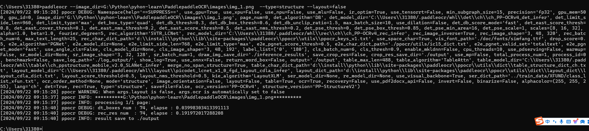

# PP-Structure 文档分析

PP-Structure是PaddleOCR团队自研的智能文档分析系统，旨在帮助开发者更好的完成版面分析、表格识别等文档理解相关任务。

PP-StructureV2的主要特性如下：

- 支持对图片/pdf形式的文档进行版面分析，可以划分**文字、标题、表格、图片、公式等**区域；
- 支持通用的中英文**表格检测**任务；
- 支持表格区域进行结构化识别，最终结果输出**Excel文件**；
- 支持基于多模态的关键信息抽取(Key Information Extraction，KIE)任务-**语义实体识别**(Semantic Entity Recognition，SER)和**关系抽取**(Relation Extraction，RE)；
- 支持**版面复原**，即恢复为与原始图像布局一致的word或者pdf格式的文件；
- 支持自定义训练及python whl包调用等多种推理部署方式，简单易用；
- 与半自动数据标注工具PPOCRLabel打通，支持版面分析、表格识别、SER三种任务的标注。

## 1.1 环境安装

- 参考教程：https://paddlepaddle.github.io/PaddleOCR/ppstructure/quick_start.html

## 1.2 快捷测试

**图像方向分类+版面分析+表格识别**

```bash
paddleocr --image_dir=G:\Python\pyhon-learn\PaddlepaddleOCR\images\img_1.png --type=structure --image_orientation=true
```


**版面分析+表格识别**

```bash
paddleocr --image_dir=G:\Python\pyhon-learn\PaddlepaddleOCR\images\img_1.png --type=structure
```


**2.1.3 版面分析**

```bash
paddleocr --image_dir=G:\Python\pyhon-learn\PaddlepaddleOCR\images\img_1.png  --type=structure --table=false --ocr=false
```


**2.1.4 表格识别**

```bash
paddleocr --image_dir=G:\Python\pyhon-learn\PaddlepaddleOCR\images\img_1.png  --type=structure --layout=false 
```



## 1.3 Python编码测试

**图像方向分类+版面分析+表格识别**

```python
# _*_ coding: utf-8 _*_
"""
Time:     2024/9/22 上午8:59
Author:   EasonShu
Version:  V 0.1
File:     PP-StructureTest.py
Describe: 
"""
import os
import cv2
from paddleocr import PPStructure, draw_structure_result, save_structure_res


if __name__ == '__main__':
    table_engine = PPStructure(show_log=True, image_orientation=False)
    save_folder = './output'
    img_path = './images/img_2.png'
    img = cv2.imread(img_path)
    result = table_engine(img)
    save_structure_res(result, save_folder, os.path.basename(img_path).split('.')[0])
    for line in result:
        line.pop('img')
        print(line)
    from PIL import Image
    font_path = 'doc/fonts/simfang.ttf'  # PaddleOCR下提供字体包
    image = Image.open(img_path).convert('RGB')
    im_show = draw_structure_result(image, result, font_path=font_path)
    im_show = Image.fromarray(im_show)
    im_show.save('result.jpg')
```


**版面分析+表格识别**

```python
# _*_ coding: utf-8 _*_
"""
Time:     2024/9/22 上午9:33
Author:   EasonShu
Version:  V 0.1
File:     PP-StructureTest1.py
Describe: 
"""
# _*_ coding: utf-8 _*_
"""
Time:     2024/9/22 上午8:59
Author:   EasonShu
Version:  V 0.1
File:     PP-StructureTest.py
Describe: 
"""
import os
import cv2
from paddleocr import PPStructure, draw_structure_result, save_structure_res


if __name__ == '__main__':
    table_engine = PPStructure(show_log=True)
    save_folder = './output'
    img_path = './images/img_5.png'
    img = cv2.imread(img_path)
    result = table_engine(img)
    # save result
    save_structure_res(result, save_folder, os.path.basename(img_path).split('.')[0])
    for line in result:
        line.pop('img')
        print(line)
    from PIL import Image
    font_path = r'C:\Windows\Fonts\simhei.ttf'  # 使用黑体字体
    image = Image.open(img_path).convert('RGB')
    im_show = draw_structure_result(image, result, font_path=font_path)
    im_show = Image.fromarray(im_show)
    im_show.save('result1.jpg')
```


**版面分析**

```python
# _*_ coding: utf-8 _*_
"""
Time:     2024/9/22 上午9:41
Author:   EasonShu
Version:  V 0.1
File:     PP-StructureTest2.py.py
Describe: 
"""
import os
import cv2
from paddleocr import PPStructure, draw_structure_result, save_structure_res


if __name__ == '__main__':
    table_engine = PPStructure(table=False, ocr=False, show_log=True)
    save_folder = './output'
    img_path = './images/test02.jpeg'
    img = cv2.imread(img_path)
    result = table_engine(img)
    # save result
    save_structure_res(result, save_folder, os.path.basename(img_path).split('.')[0])
    for line in result:
        line.pop('img')
        print(line)
    # from PIL import Image
    # font_path = r'C:\Windows\Fonts\simhei.ttf'  # 使用黑体字体
    # image = Image.open(img_path).convert('RGB')
    # im_show = draw_structure_result(image, result, font_path=font_path)
    # im_show = Image.fromarray(im_show)
    # im_show.save('result1.jpg')
```


## 1.4 返回结构

```tex
[
  {   'type': 'Text',
      'bbox': [34, 432, 345, 462],
      'res': ([[36.0, 437.0, 341.0, 437.0, 341.0, 446.0, 36.0, 447.0], [41.0, 454.0, 125.0, 453.0, 125.0, 459.0, 41.0, 460.0]],
                [('Tigure-6. The performance of CNN and IPT models using difforen', 0.90060663), ('Tent  ', 0.465441)])
  }
]
```

**dict 里各个字段说明如下：**

| 字段 | 说明                                                         |
| :--- | :----------------------------------------------------------- |
| type | 图片区域的类型                                               |
| bbox | 图片区域的在原图的坐标，分别[左上角x，左上角y，右下角x，右下角y] |
| res  | 图片区域的OCR或表格识别结果。 表格: 一个dict，字段说明如下         `html`: 表格的HTML字符串         在代码使用模式下，前向传入return_ocr_result_in_table=True可以拿到表格中每个文本的检测识别结果，对应为如下字段:         `boxes`: 文本检测坐标         `rec_res`: 文本识别结果。 OCR: 一个包含各个单行文字的检测坐标和识别结果的元组 |

## 1.5 PPStructure构造器参数说明

| 字段                    | 说明                                                         | 默认值                                        |       |
| :---------------------- | :----------------------------------------------------------- | :-------------------------------------------- | ----- |
| output                  | 结果保存地址                                                 | ./output/table                                |       |
| table_max_len           | 表格结构模型预测时，图像的长边resize尺度                     | 488                                           |       |
| table_model_dir         | 表格结构模型 inference 模型地址                              | None                                          |       |
| table_char_dict_path    | 表格结构模型所用字典地址                                     | ../ppocr/utils/dict/table_structure_dict.txt  |       |
| merge_no_span_structure | 表格识别模型中，是否对'\                                     | '和'\                                         | False |
| layout_model_dir        | 版面分析模型 inference 模型地址                              | None                                          |       |
| layout_dict_path        | 版面分析模型字典                                             | ../ppocr/utils/dict/layout_publaynet_dict.txt |       |
| layout_score_threshold  | 版面分析模型检测框阈值                                       | 0.5                                           |       |
| layout_nms_threshold    | 版面分析模型nms阈值                                          | 0.5                                           |       |
| kie_algorithm           | kie模型算法                                                  | LayoutXLM                                     |       |
| ser_model_dir           | ser模型 inference 模型地址                                   | None                                          |       |
| ser_dict_path           | ser模型字典                                                  | ../train_data/XFUND/class_list_xfun.txt       |       |
| mode                    | structure or kie                                             | structure                                     |       |
| image_orientation       | 前向中是否执行图像方向分类                                   | False                                         |       |
| layout                  | 前向中是否执行版面分析                                       | True                                          |       |
| table                   | 前向中是否执行表格识别                                       | True                                          |       |
| ocr                     | 对于版面分析中的非表格区域，是否执行ocr。当layout为False时会被自动设置为False | True                                          |       |
| recovery                | 前向中是否执行版面恢复                                       | False                                         |       |
| save_pdf                | 版面恢复导出docx文件的同时，是否导出pdf文件                  | False                                         |       |
| structure_version       | 模型版本，可选 PP-structure和PP-structurev2                  | PP-structure                                  |       |

