## 深入探索OCR技术：前沿算法与工业级部署方案揭秘

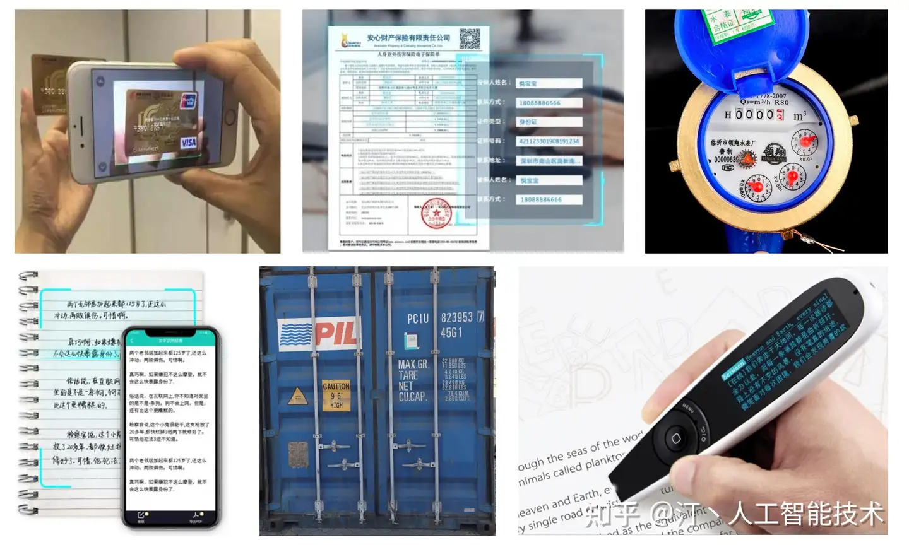

*注：以上图片来自网络*

## 1. OCR技术背景

### 1.1 OCR技术的应用场景

- **OCR是什么**

OCR（Optical Character Recognition，[光学字符识别](https://zhida.zhihu.com/search?q=光学字符识别&zhida_source=entity&is_preview=1)）是计算机视觉重要方向之一。传统定义的OCR一般面向扫描文档类对象，现在我们常说的OCR一般指场景文字识别（Scene Text Recognition，STR），主要面向自然场景，如下图中所示的牌匾等各种自然场景可见的文字。

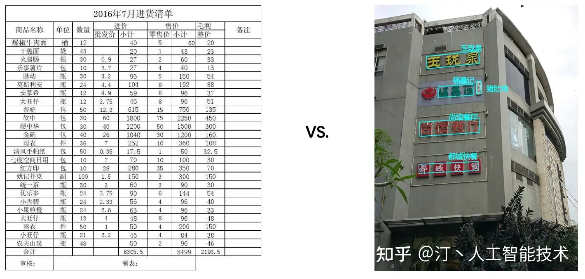

图1 文档场景文字识别 VS. 自然场景文字识别

- **OCR有哪些应用场景？**

OCR技术有着丰富的应用场景，一类典型的场景是日常生活中广泛应用的面向垂类的结构化文本识别，比如车牌识别、银行卡信息识别、身份证信息识别、火车票信息识别等等。这些小垂类的共同特点是格式固定，因此非常适合使用[OCR技术](https://zhida.zhihu.com/search?q=OCR技术&zhida_source=entity&is_preview=1)进行自动化，可以极大的减轻人力成本，提升效率。

这种面向垂类的结构化文本识别是目前[ocr](https://zhida.zhihu.com/search?q=ocr&zhida_source=entity&is_preview=1)应用最广泛、并且技术相对较成熟的场景。

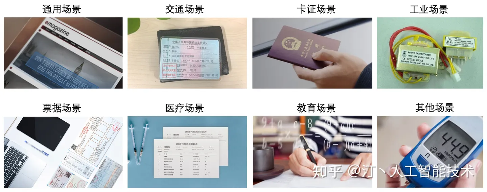

图2 OCR技术的应用场景

除了面向垂类的结构化文本识别，通用OCR技术也有广泛的应用，并且常常和其他技术结合完成多模态任务，例如在视频场景中，经常使用OCR技术进行字幕自动翻译、内容安全监控等等，或者与视觉特征相结合，完成视频理解、视频搜索等任务。

图3 多模态场景中的通用OCR

### 1.2 OCR技术挑战

OCR的技术难点可以分为算法层和应用层两方面。

- **算法层**

OCR丰富的应用场景，决定了它会存在很多技术难点。这里给出了常见的8种问题：

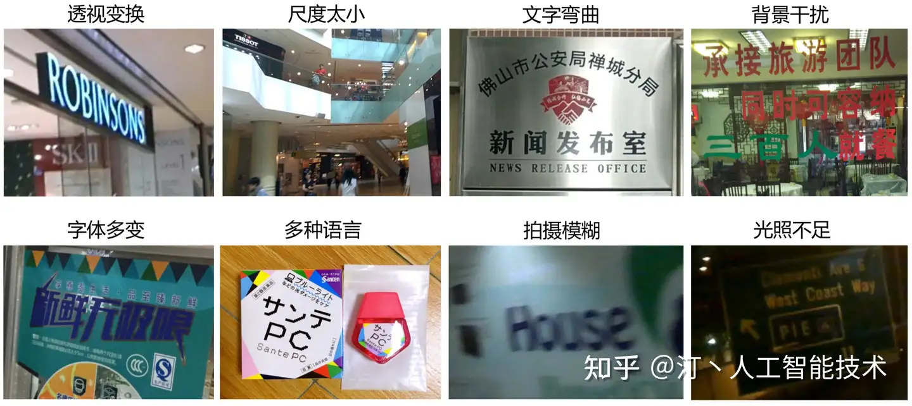

图4 OCR算法层技术难点

这些问题给文本检测和文本识别都带来了巨大的技术挑战，可以看到，这些挑战主要都是面向自然场景，目前学术界的研究也主要聚焦在自然场景，OCR领域在学术上的常用数据集也都是自然场景。针对这些问题的研究很多，相对来说，识别比检测面临更大的挑战。

- **应用层**

在实际应用中，尤其是在广泛的通用场景下，除了上一节总结的[仿射变换](https://zhida.zhihu.com/search?q=仿射变换&zhida_source=entity&is_preview=1)、尺度问题、光照不足、拍摄模糊等算法层面的技术难点，OCR技术还面临两大落地难点： 1. **海量数据要求OCR能够实时处理。** OCR应用常对接海量数据，我们要求或希望数据能够得到实时处理，模型的速度做到实时是一个不小的挑战。 2. **端侧应用要求OCR模型足够轻量，识别速度足够快。** OCR应用常部署在移动端或[嵌入式硬件](https://zhida.zhihu.com/search?q=嵌入式硬件&zhida_source=entity&is_preview=1)，端侧OCR应用一般有两种模式：上传到服务器 vs. 端侧直接识别，考虑到上传到服务器的方式对网络有要求，实时性较低，并且请求量过大时服务器压力大，以及数据传输的安全性问题，我们希望能够直接在端侧完成OCR识别，而端侧的存储空间和计算能力有限，因此对OCR模型的大小和预测速度有很高的要求。

图5 OCR应用层技术难点

## 2. OCR前沿算法

虽然OCR是一个相对具体的任务，但涉及了多方面的技术，包括文本检测、文本识别、端到端文本识别、文档分析等等。学术上关于OCR各项相关技术的研究层出不穷，下文将简要介绍OCR任务中的几种关键技术的相关工作。

### 2.1 文本检测

文本检测的任务是定位出输入图像中的文字区域。近年来学术界关于文本检测的研究非常丰富，一类方法将文本检测视为目标检测中的一个特定场景，基于通用[目标检测算法](https://zhida.zhihu.com/search?q=目标检测算法&zhida_source=entity&is_preview=1)进行改进适配，如TextBoxes[1]基于一阶段目标检测器SSD[2]算法，调整目标框使之适合极端长宽比的文本行，CTPN[3]则是基于Faster RCNN[4]架构改进而来。但是文本检测与目标检测在目标信息以及任务本身上仍存在一些区别，如文本一般长宽比较大，往往呈“条状”，文本行之间可能比较密集，弯曲文本等，因此又衍生了很多专用于文本检测的算法，如EAST[5]、PSENet[6]、DBNet[7]等等。

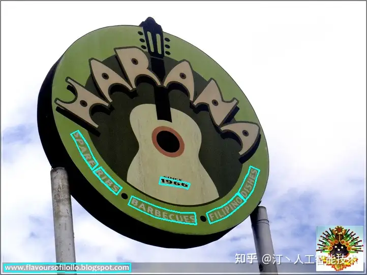

图6 文本检测任务示例

目前较为流行的文本检测算法可以大致分为**基于回归**和**基于分割**的两大类文本检测算法，也有一些算法将二者相结合。 * 基于回归的算法借鉴通用物体检测算法，通过设定anchor回归检测框，或者直接做像素回归，这类方法对规则形状文本检测效果较好，但是对不规则形状的文本检测效果会相对差一些，比如CTPN[3]对水平文本的检测效果较好，但对倾斜、弯曲文本的检测效果较差，SegLink[8]对长文本比较好，但对分布稀疏的文本效果较差；

- 基于分割的算法引入了Mask-RCNN[9]，这类算法在各种场景、对各种形状文本的检测效果都可以达到一个更高的水平，但缺点就是后处理一般会比较复杂，因此常常存在速度问题，并且无法解决重叠文本的检测问题。

图7 文本检测算法概览

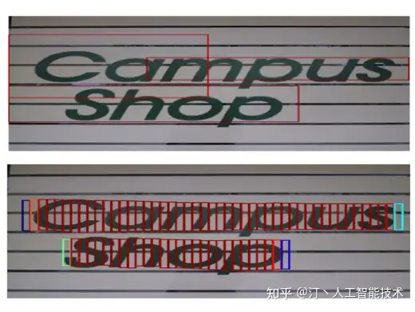

图9 （左）规则文本 VS. （右）不规则文本

规则文本识别的算法根据解码方式的不同可以大致分为基于CTC和Sequence2Sequence两种，将网络学习到的序列特征 转化为 最终的识别结果 的处理方式不同。基于CTC的算法以经典的CRNN[11]为代表。

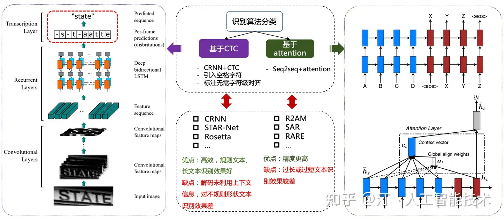

图10 基于CTC的识别算法 VS. 基于Attention的识别算法

不规则文本的识别算法相比更为丰富，如STAR-Net[12]等方法通过加入TPS等矫正模块，将不规则文本矫正为规则的矩形后再进行识别；RARE[13]等基于Attention的方法增强了对序列之间各部分相关性的关注；基于分割的方法将文本行的各字符作为独立个体，相比与对整个文本行做矫正后识别，识别分割出的单个字符更加容易；此外，随着近年来Transfomer[14]的快速发展和在各类任务中的有效性验证，也出现了一批基于Transformer的文本识别算法，这类方法利用transformer结构解决CNN在长依赖建模上的局限性问题，也取得了不错的效果。

图11 基于字符分割的识别算法[15]

### 2.3 文档结构化识别

传统意义上的OCR技术可以解决文字的检测和识别需求，但在实际应用场景中，最终需要获取的往往是结构化的信息，如身份证、发票的信息格式化抽取，表格的结构化识别等等，多在快递单据抽取、合同内容比对、金融保理单信息比对、物流业单据识别等场景下应用。OCR结果+后处理是一种常用的结构化方案，但流程往往比较复杂，并且后处理需要精细设计，泛化性也比较差。在OCR技术逐渐成熟、结构化信息抽取需求日益旺盛的背景下，[版面分析](https://zhida.zhihu.com/search?q=版面分析&zhida_source=entity&is_preview=1)、表格识别、关键信息提取等关于智能文档分析的各种技术受到了越来越多的关注和研究。

- **版面分析**

版面分析（Layout Analysis）主要是对文档图像进行内容分类，类别一般可分为纯文本、标题、表格、图片等。现有方法一般将文档中不同的板式当做不同的目标进行检测或分割，如Soto Carlos[16]在目标检测算法Faster R-CNN的基础上，结合上下文信息并利用文档内容的固有位置信息来提高区域检测性能；Sarkar Mausoom[17]等人提出了一种基于先验的分割机制，在非常高的分辨率的图像上训练文档分割模型，解决了过度缩小原始图像导致的密集区域不同结构无法区分进而合并的问题。

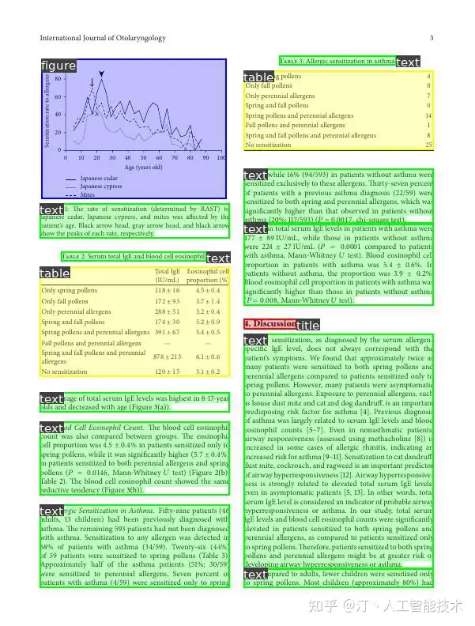

图12 版面分析任务[示意图](https://zhida.zhihu.com/search?q=示意图&zhida_source=entity&is_preview=1)

- **表格识别**

表格识别（Table Recognition）的任务就是将文档里的表格信息进行识别和转换到excel文件中。文本图像中表格种类和样式复杂多样，例如不同的行列合并，不同的内容文本类型等，除此之外文档的样式和拍摄时的光照环境等都为表格识别带来了极大的挑战。这些挑战使得表格识别一直是文档理解领域的研究难点。

图13 表格识别任务示意图

表格识别的方法种类较为丰富，早期的基于[启发式规则](https://zhida.zhihu.com/search?q=启发式规则&zhida_source=entity&is_preview=1)的传统算法，如Kieninger[18]等人提出的T-Rect等算法，一般通过人工设计规则，连通域检测分析处理；近年来随着深度学习的发展，开始涌现一些基于CNN的表格结构识别算法，如Siddiqui Shoaib Ahmed[19]等人提出的DeepTabStR，Raja Sachin[20]等人提出的TabStruct-Net等；此外，随着[图神经网络](https://zhida.zhihu.com/search?q=图神经网络&zhida_source=entity&is_preview=1)（Graph Neural Network）的兴起，也有一些研究者尝试将图神经网络应用到表格结构识别问题上，基于图神经网络，将表格识别看作图重建问题，如Xue Wenyuan[21]等人提出的TGRNet；基于端到端的方法直接使用网络完成表格结构的HTML表示输出，端到端的方法大多采用Seq2Seq方法来完成表格结构的预测，如一些基于Attention或Transformer的方法，如TableMaster[22]。

图14 表格识别方法示意图

- **关键信息提取**

关键信息提取（Key Information Extraction，KIE）是Document VQA中的一个重要任务，主要从图像中提取所需要的关键信息，如从身份证中提取出姓名和公民身份号码信息，这类信息的种类往往在特定任务下是固定的，但是在不同任务间是不同的。

图15 DocVQA任务示意图

KIE通常分为两个子任务进行研究：

- SER: 语义实体识别 (Semantic Entity Recognition)，对每一个检测到的文本进行分类，如将其分为姓名，身份证。如下图中的黑色框和红色框。
- RE: 关系抽取 (Relation Extraction)，对每一个检测到的文本进行分类，如将其分为问题和的答案。然后对每一个问题找到对应的答案。如下图中的红色框和黑色框分别代表问题和答案，黄色线代表问题和答案之间的对应关系。

图16 ser与re任务

一般的KIE方法基于[命名实体识别](https://zhida.zhihu.com/search?q=命名实体识别&zhida_source=entity&is_preview=1)(Named Entity Recognition,NER)[4]来研究，但是这类方法只利用了图像中的文本信息，缺少对视觉和结构信息的使用，因此精度不高。在此基础上，近几年的方法都开始将视觉和结构信息与文本信息融合到一起，按照对多模态信息进行融合时所采用的的原理可以将这些方法分为下面四种：

- 基于Grid的方法
- 基于Token的方法
- 基于GCN的方法
- 基于End to End 的方法

[链接]

### 2.4 其他相关技术

前面主要介绍了OCR领域的三种关键技术：文本检测、文本识别、文档结构化识别，更多其他OCR相关前沿技术介绍，包括端到端文本识别、OCR中的图像预处理技术、OCR数据合成等。后续会讲[链接]

## 3. OCR技术的产业实践

OCR技术最终还是要落到产业实践当中。虽然学术上关于OCR技术的研究很多，OCR技术的商业化应用相比于其他AI技术也已经相对成熟，但在实际的产业应用中，还是存在一些难点与挑战。下文将从技术和产业实践两个角度进行分析。

### 3.1 产业实践难点

在实际的产业实践中，开发者常常需要依托[开源社区](https://zhida.zhihu.com/search?q=开源社区&zhida_source=entity&is_preview=1)资源启动或推进项目，而开发者使用开源模型又往往面临三大难题：

图17 OCR技术产业实践三大难题

**1. 找不到、选不出**

开源社区资源丰富，但是信息不对称导致开发者并不能高效地解决痛点问题。一方面，开源社区资源过于丰富，开发者面对一项需求，无法快速从海量的代码仓库中找到匹配业务需求的项目，即存在“找不到”的问题；另一方面，在算法选型时，英文公开数据集上的指标，无法给开发者常常面对的中文场景提供直接的参考，逐个算法验证需要耗费大量时间和人力，且不能保证选出最合适的算法，即“选不出”。

**2. 不适用产业场景**

开源社区中的工作往往更多地偏向效果优化，如学术论文代码开源或复现，一般更侧重算法效果，平衡考虑模型大小和速度的工作相比就少很多，而模型大小和预测耗时在产业实践中是两项不容忽视的指标，其重要程度不亚于模型效果。无论是移动端和服务器端，待识别的图像数目往往非常多，都希望模型更小，精度更高，预测速度更快。GPU太贵，最好使用CPU跑起来更经济。在满足业务需求的前提下，模型越轻量占用的资源越少。

**3. 优化难、训练部署问题多**

直接使用开源算法或模型一般无法直接满足业务需求，实际业务场景中，OCR面临的问题多种多样，业务场景个性化往往需要自定义数据集重新训练，现有的[开源项目](https://zhida.zhihu.com/search?q=开源项目&zhida_source=entity&is_preview=1)上，实验各种优化方法的成本较高。此外，OCR应用场景十分丰富，服务端和各种移动端设备上都有着广泛的应用需求，硬件环境多样化就需要支持丰富的部署方式，而开源社区的项目更侧重算法和模型，在预测部署这部分明显支撑不足。要把OCR技术从论文上的算法做到技术落地应用，对开发者的算法和工程能力都有很高的要求。

### 3.2 产业级OCR开发套件PaddleOCR

OCR产业实践需要一套完整全流程的解决方案，来加快研发进度，节约宝贵的研发时间。也就是说，超轻量模型及其全流程解决方案，尤其对于算力、存储空间有限的移动端、嵌入式设备而言，可以说是刚需。

在此背景下，产业级OCR开发套件[PaddleOCR](https://link.zhihu.com/?target=https%3A//github.com/PaddlePaddle/PaddleOCR)应运而生。

PaddleOCR的建设思路从用户画像和需求出发，依托飞桨核心框架，精选并复现丰富的前沿算法，基于复现的算法研发更适用于产业落地的PP特色模型，并打通训推一体，提供多种预测部署方式，满足实际应用的不同需求场景。

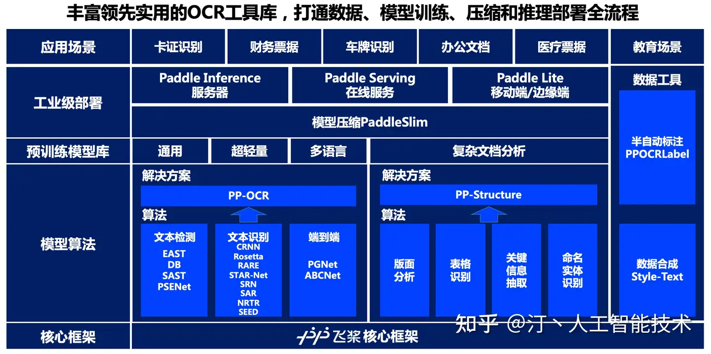

图18 PaddleOCR开发套件全景图

从全景图可以看出，PaddleOCR依托于飞桨核心框架，在模型算法、预训练模型库、工业级部署等层面均提供了丰富的解决方案，并且提供了数据合成、半自动数据[标注工具](https://zhida.zhihu.com/search?q=标注工具&zhida_source=entity&is_preview=1)，满足开发者的数据生产需求。

**在模型算法层面**，PaddleOCR对**文字检测识别**和**文档[结构化分析](https://zhida.zhihu.com/search?q=结构化分析&zhida_source=entity&is_preview=1)**两类任务分别提供了解决方案。在文字检测识别方面，PaddleOCR复现或开源了4种文本检测算法、8种文本识别算法、1种端到端文本识别算法，并在此基础上研发了PP-OCR系列的通用文本检测识别解决方案；在文档结构化分析方面，PaddleOCR提供了版面分析、表格识别、关键信息抽取、命名实体识别等算法，并在此基础提出了PP-Structure文档分析解决方案。丰富的精选算法可以满足开发者不同业务场景的需求，代码框架的统一也方便开发者进行不同算法的优化和性能对比。

**在预训练模型库层面**，基于PP-OCR和PP-Structure解决方案，PaddleOCR研发并开源了适用于产业实践的PP系列特色模型，包括通用、超轻量和多语言的文本检测识别模型，和复杂文档分析模型。PP系列特色模型均在原始算法上进行了深度优化，使其在效果和性能上均能达到产业实用级别，开发者既可以直接应用于业务场景，也可以用业务数据进行简单的finetune，便可以轻松研发出适用于自己业务需求的“实用模型”。

**在工业级部署层面**，PaddleOCR提供了基于Paddle Inference的服务器端预测方案，基于Paddle Serving的服务化部署方案，以及基于Paddle-Lite的端侧部署方案，满足不同硬件环境下的部署需求，同时提供了基于PaddleSlim的模型压缩方案，可以进一步压缩模型大小。以上部署方式都完成了训推一体全流程打通，以保障开发者可以高效部署，稳定可靠。

**在数据工具层面**，PaddleOCR提供了半自动数据标注工具PPOCRLabel和数据合成工具Style-Text，助力开发者更方便的生产模型训练所需的数据集和标注信息。PPOCRLabel作为业界首个开源的半自动OCR数据标注工具，针对标注过程枯燥繁琐、机械性高，大量训练数据所需人工标记，时间金钱成本昂贵的问题，内置PP-OCR模型实现预标注+人工校验的标注模式，可以极大提升标注效率，节省人力成本。数据合成工具Style-Text主要解决实际场景真实数据严重不足，传统合成算法无法合成文字风格（字体、颜色、间距、背景）的问题，只需要少许目标场景图像，就可以批量合成大量与目标场景风格相近的文本图像。

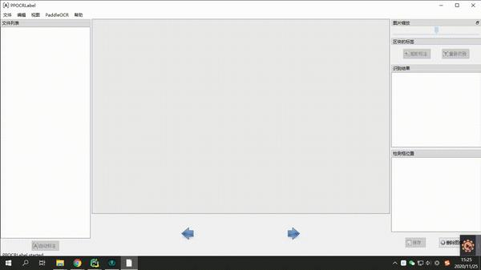

图19 PPOCRLabel使用示意图

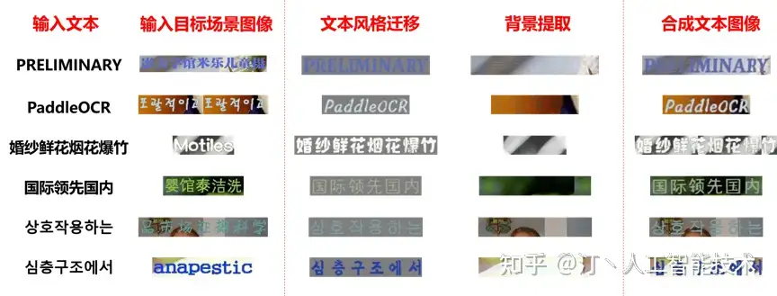

图20 Style-Text合成效果示例

### 3.2.1 PP-OCR与PP-Structrue

PP系列特色模型是飞桨各视觉开发套件针对产业实践需求进行深度优化的模型，力求速度与精度平衡。PaddleOCR中的PP系列特色模型包括针对文字检测识别任务的PP-OCR系列模型和针对文档分析的PP-Structure系列模型。

**（1）PP-OCR中英文模型**

图21 PP-OCR中英文模型识别结果示例

PP-OCR中英文模型采用的典型的两阶段OCR算法，即检测模型+识别模型的组成方式，具体的算法框架如下：

图22 PP-OCR系统pipeline示意图

可以看到，除输入输出外，PP-OCR核心框架包含了3个模块，分别是：文本检测模块、检测框矫正模块、文本识别模块。 - 文本检测模块：核心是一个基于[DB](https://link.zhihu.com/?target=https%3A//arxiv.org/abs/1911.08947)检测算法训练的文本检测模型，检测出图像中的文字区域； - 检测框矫正模块：将检测到的文本框输入检测框矫正模块，在这一阶段，将四点表示的文本框矫正为矩形框，方便后续进行文本识别，另一方面会进行文本方向判断和校正，例如如果判断文本行是倒立的情况，则会进行转正，该功能通过训练一个文本方向分类器实现； - 文本识别模块：最后文本识别模块对矫正后的检测框进行文本识别，得到每个文本框内的文字内容，PP-OCR中使用的经典文本识别算法[CRNN](https://link.zhihu.com/?target=https%3A//arxiv.org/abs/1507.05717)。

PaddleOCR先后推出了PP-OCR[23]和PP-OCRv2[24]模型。

PP-OCR模型分为mobile版（轻量版）和server版（通用版），其中mobile版模型主要基于轻量级骨干网络MobileNetV3进行优化，优化后模型（检测模型+文本方向分类模型+识别模型）大小仅8.1M，CPU上平均单张图像预测耗时350ms，T4 GPU上约110ms，裁剪量化后，可在精度不变的情况下进一步压缩到3.5M，便于端侧部署，在骁龙855上测试预测耗时仅260ms。更多的PP-OCR评估数据可参考[benchmark](https://link.zhihu.com/?target=https%3A//github.com/PaddlePaddle/PaddleOCR/blob/release/2.2/doc/doc_ch/benchmark.md)。

PP-OCRv2保持了PP-OCR的整体框架，主要做了效果上的进一步策略优化。提升包括3个方面： - 在模型效果上，相对于PP-OCR mobile版本提升超7%； - 在速度上，相对于PP-OCR server版本提升超过220%； - 在模型大小上，11.6M的总大小，服务器端和移动端都可以轻松部署。

PP-OCR和PP-OCRv2的具体优化策略将在第四章中进行详细解读。

除了中英文模型，PaddleOCR也基于不同的数据集训练并开源了英文数字模型、多语言识别模型，以上均为超轻量模型，适用于不同的语言场景。

图23 PP-OCR的英文数字模型和多语言模型识别效果示意图

**（2）PP-Structure文档分析模型**

PP-Structure支持版面分析（layout analysis）、表格识别（table recognition）、文档视觉问答（DocVQA）三种子任务。

PP-Structure核心功能点如下： - 支持对图片形式的文档进行版面分析，可以划分文字、标题、表格、图片以及列表5类区域（与Layout-Parser联合使用） - 支持文字、标题、图片以及列表区域提取为文字字段（与PP-OCR联合使用） - 支持表格区域进行结构化分析，最终结果输出Excel文件 - 支持Python whl包和命令行两种方式，简单易用 - 支持版面分析和表格结构化两类任务自定义训练 - 支持VQA任务-SER和RE

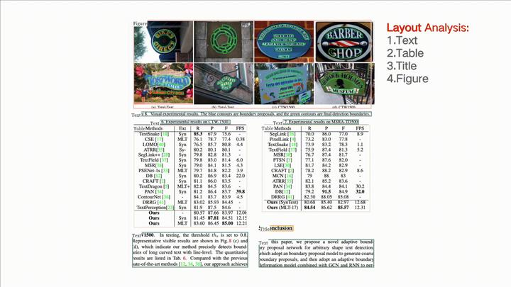

图24 PP-Structure系统示意图（本图仅含版面分析+表格识别）

### 3.2.2 工业级部署方案

飞桨支持全流程、全场景推理部署，模型来源主要分为三种，第一种使用PaddlePaddle API构建网络结构进行训练所得，第二种是基于飞桨套件系列，飞桨套件提供了丰富的模型库、简洁易用的API，具备开箱即用，包括视觉模型库PaddleCV、智能语音库PaddleSpeech以及自然语言处理库PaddleNLP等，第三种采用X2Paddle工具从第三方框架（PyTorh、ONNX、TensorFlow等）产出的模型。

飞桨模型可以选用PaddleSlim工具进行压缩、量化以及蒸馏，支持五种部署方案，分别为服务化Paddle Serving、服务端/云端Paddle Inference、移动端/边缘端Paddle Lite、网页前端Paddle.js, 对于Paddle不支持的硬件，比如MCU、地平线、鲲云等国产芯片，可以借助Paddle2ONNX转化为支持ONNX的第三方框架。

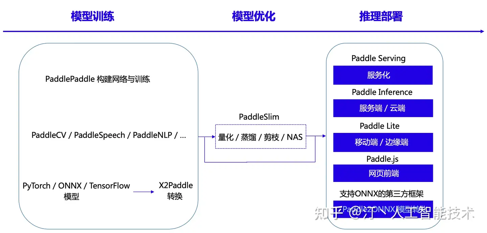

图25 飞桨支持部署方式

Paddle Inference支持服务端和云端部署，具备高性能与通用性，针对不同平台和不同应用场景进行了深度的适配和优化，Paddle Inference是飞桨的原生推理库，保证模型在服务器端即训即用，快速部署，适用于高性能硬件上使用多种应用语言环境部署算法复杂的模型，硬件覆盖x86 CPU、Nvidia GPU、以及百度昆仑XPU、华为昇腾等AI加速器。

Paddle Lite 是端侧推理引擎，具有轻量化和高性能特点，针对端侧设备和各应用场景进行了深度的设配和优化。当前支持Android、IOS、嵌入式Linux设备、macOS 等多个平台，硬件覆盖ARM CPU和GPU、X86 CPU和新硬件如百度昆仑、华为昇腾与麒麟、瑞芯微等。

Paddle Serving是一套高性能服务框架，旨在帮助用户几个步骤快速将模型在云端服务化部署。目前Paddle Serving支持自定义前后处理、模型组合、模型热加载更新、多机多卡多模型、分布式推理、K8S部署、安全网关和模型加密部署、支持多语言多客户端访问等功能，Paddle Serving官方还提供了包括PaddleOCR在内的40多种模型的部署示例，以帮助用户更快上手。

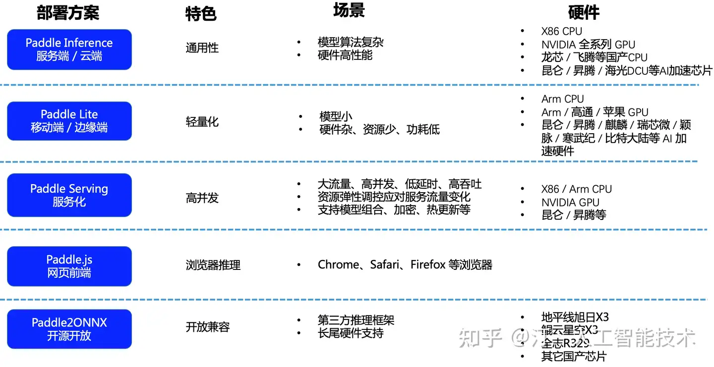

图26 飞桨支持部署方式

## 4. 总结

首先介绍了OCR技术的应用场景和前沿算法，然后分析了OCR技术在产业实践中的难点与三大挑战。 后续章节内容涉及：介绍检测、识别技术并实践；介绍PP-OCR优化策略； 进行预测部署实战； 文档结构化；端到端、数据预处理、数据合成等其他OCR相关算法； OCR相关数据集和数据合成工具。