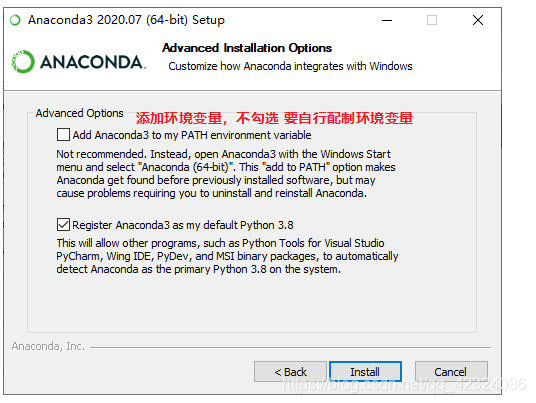
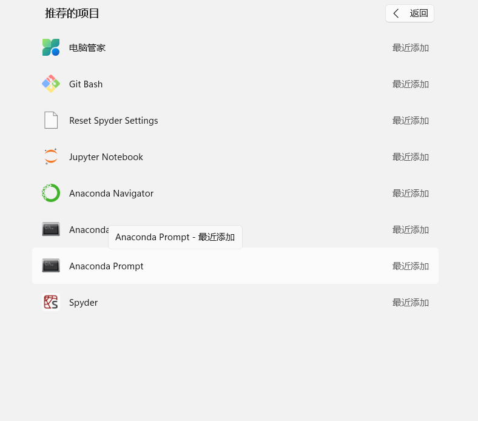
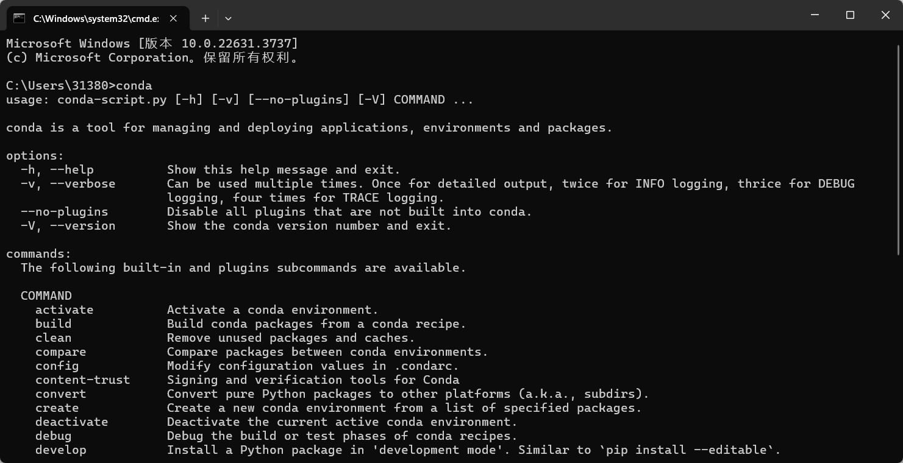
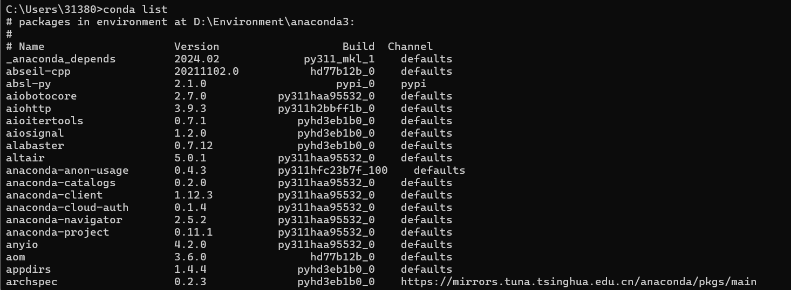
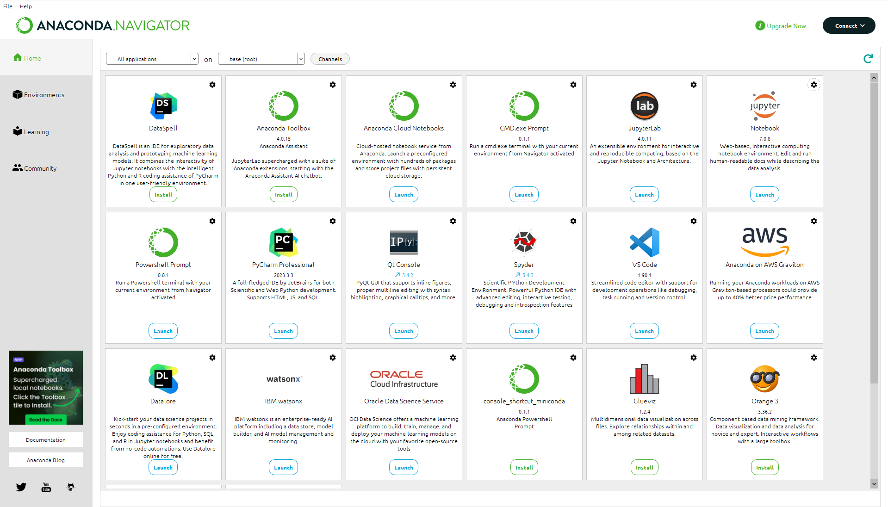
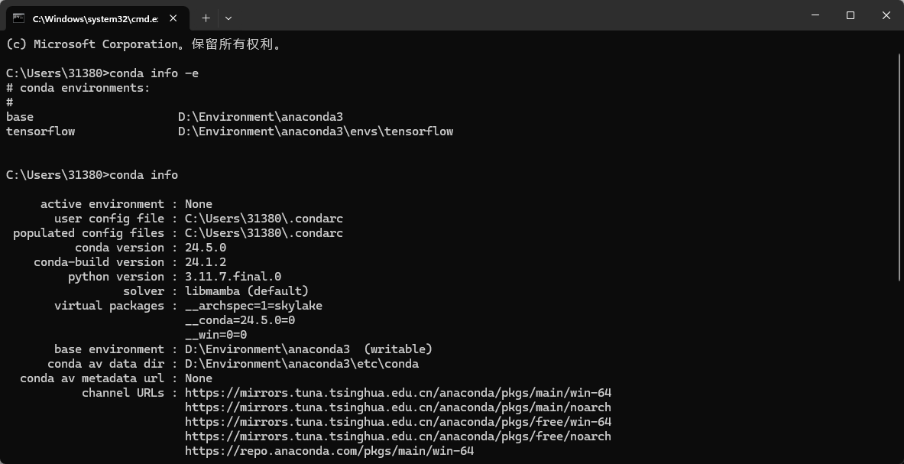
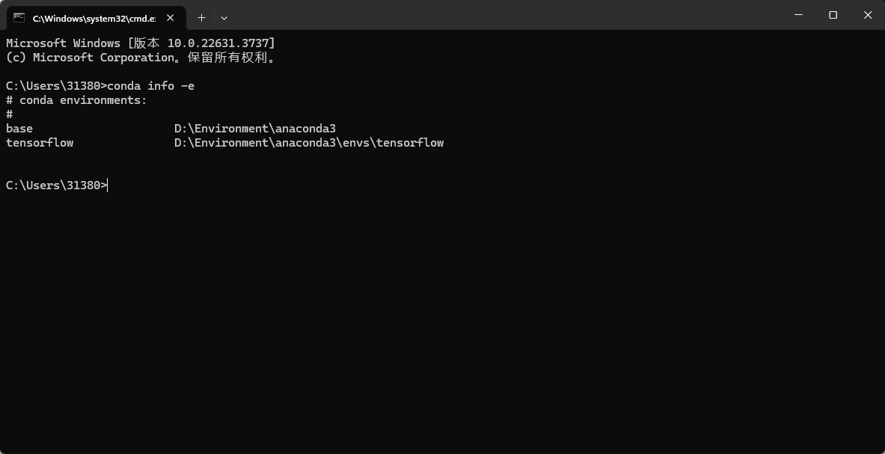
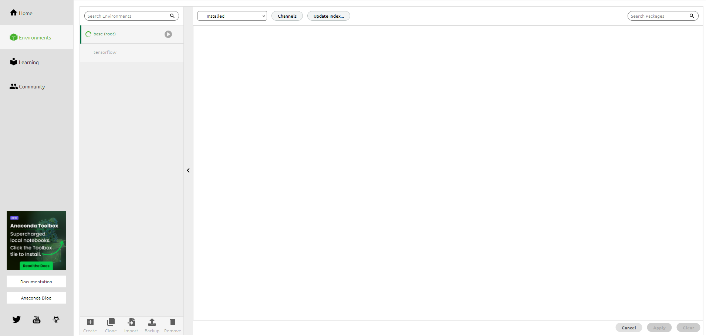

# Anaconda 环境配置

就是可以便捷获取包且对包能够进行管理，同时对环境可以统一管理的发行版本。Anaconda包含了conda、Python在内的超过180个科学包及其依赖项。即它可以在你的电脑上创建多个你想要的python环境，并为每个python环境安装不同的包，不同环境相互切换，操作简单，使用方便！

## 1.1 下载

- 下载地址： [Anaconda | Individual Edition](https://www.anaconda.com/products/individual)
- 下载地址：[Index of /anaconda/archive/ | 清华大学开源软件镜像站 | Tsinghua Open Source Mirror](https://mirrors.tuna.tsinghua.edu.cn/anaconda/archive/)

## 1.2 无脑安装

- 选择安装路径（默认是C盘），当然，改路径也无所谓，只要能配置好环境即可。且路径中不要出现中文字符。**此处最好把安装路径复制下来，无论是否修改安装路径**。（我就是改了路径）



- 下一步，下一步



## 1.3 环境配置

- 主要有三个环境的配置:
  - ①anaconda安装路径（为了Python检查正常）:前面安装时路径一定要记清楚，之前已提醒复制，我的是`D:\development\Python\anaconda3`
  - ②安装路径\Scripts（为了conda检查正常）:只需在上述路径中找到Scripts，然后复制路径即可，我的路径`D:\development\Python\anaconda3\Scripts`
  - ③另一个路径（加不加不知道有什么区别，不影响后边的检查）：安装路径`\Library\bin`，如我的是`D:\development\Python\anaconda3\Library\bin`
  - 上述三个环境变量都是通过：此电脑—右键—高级系统设置—环境变量—系统变量—双击path—新建变量即可。
- 校验安装是否成功：

```cmd
conda
```



- 查看安装了那些库：

```cmd
conda list
```



- Anaconda配置清华镜像源

```
conda config --set show_channel_urls yes
```

- 生成`.condarc`文件, 替换内容

```text
channels:
  - defaults
show_channel_urls: true
channel_alias: https://mirrors.tuna.tsinghua.edu.cn/anaconda
default_channels:
  - https://mirrors.tuna.tsinghua.edu.cn/anaconda/pkgs/main
  - https://mirrors.tuna.tsinghua.edu.cn/anaconda/pkgs/free
  - https://mirrors.tuna.tsinghua.edu.cn/anaconda/pkgs/r
  - https://mirrors.tuna.tsinghua.edu.cn/anaconda/pkgs/pro
  - https://mirrors.tuna.tsinghua.edu.cn/anaconda/pkgs/msys2
custom_channels:
  conda-forge: https://mirrors.tuna.tsinghua.edu.cn/anaconda/cloud
  msys2: https://mirrors.tuna.tsinghua.edu.cn/anaconda/cloud
  bioconda: https://mirrors.tuna.tsinghua.edu.cn/anaconda/cloud
  menpo: https://mirrors.tuna.tsinghua.edu.cn/anaconda/cloud
  pytorch: https://mirrors.tuna.tsinghua.edu.cn/anaconda/cloud
  simpleitk: https://mirrors.tuna.tsinghua.edu.cn/anaconda/cloud
```

- 或者

```
1.修改为清华源
直接打开cmd输入以下命令
conda config --add channels https://mirrors.tuna.tsinghua.edu.cn/anaconda/pkgs/free/
conda config --add channels https://mirrors.tuna.tsinghua.edu.cn/anaconda/pkgs/main/
conda config --add channels https://mirrors.tuna.tsinghua.edu.cn/anaconda/cloud//pytorch/
conda config --add channels https://mirrors.tuna.tsinghua.edu.cn/anaconda/cloud/conda-forge/
conda config --set show_channel_urls yes
2.移除清华源
输入：conda config --remove channels https://mirrors.tuna.tsinghua.edu.cn/anaconda/cloud/conda-forge/
这个命令是为了移除之前conda config --show channels显示的清华源。
```


## 1.4 卸载

-  `pip uninstall` **包的名称**，即可卸载

## 1.5 界面



## 1.6 使用

- 主要用的两个为Anaconda Prompt 和Anaconda Navigator，Anaconda Prompt 就是我们的cmd
- 查看环境信息命令：

```cmd
# conda info 查看当前环境的信息
```



- conda info -e 查看已经创建的所有虚拟环境



- set CONDA_FORCE_32BIT=1 # 切换到32位，set CONDA_FORCE_32BIT=0 # 切换到64位

- conda create -n xxx python=2.7 创建一个python2.7 名为xxx的虚拟环境，如要创建32位的python环境，先设置为32位在创建环境，这样创建好的环境即为32位的Python环境，先切换到创建好的环境中

- conda remove -n env_name --all 移除环境，也可在Anaconda Navigator中移除

