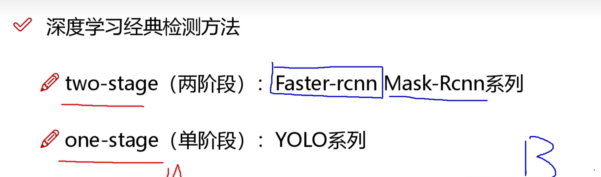
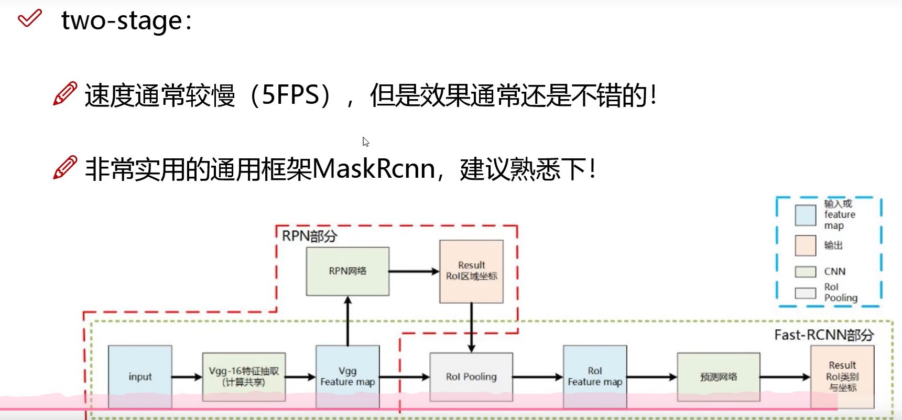
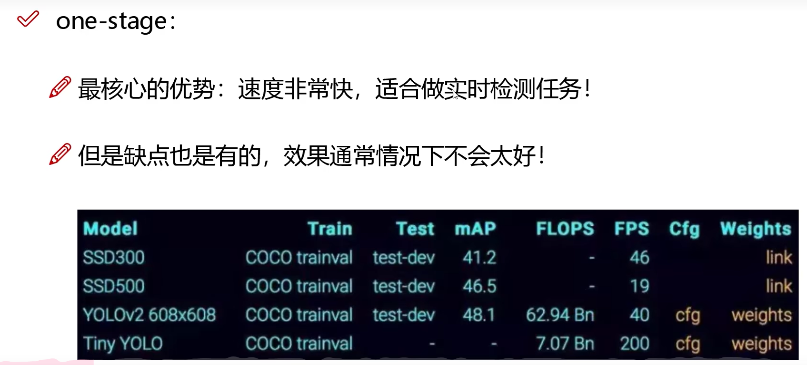
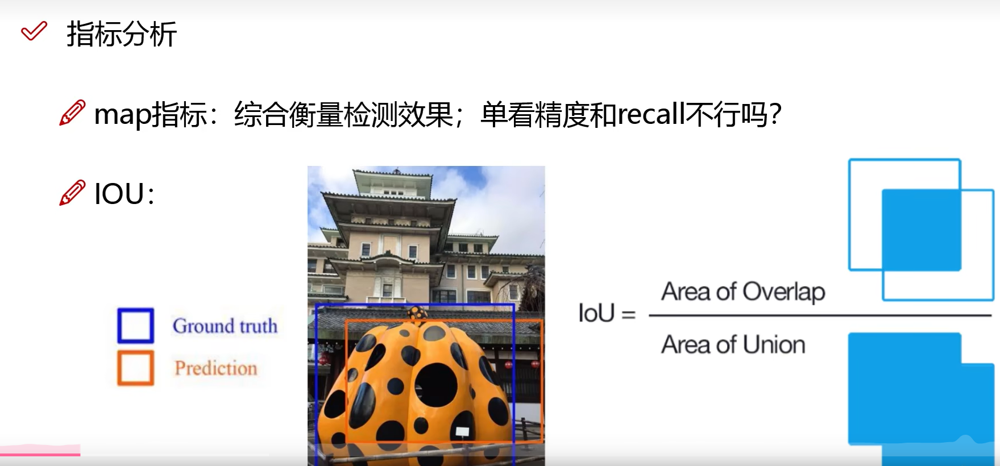
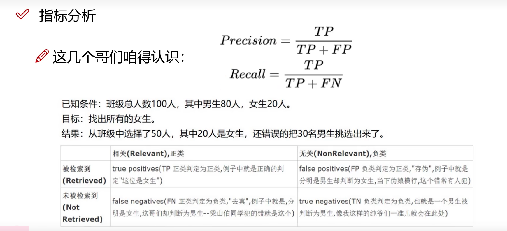
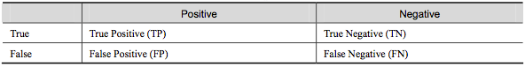
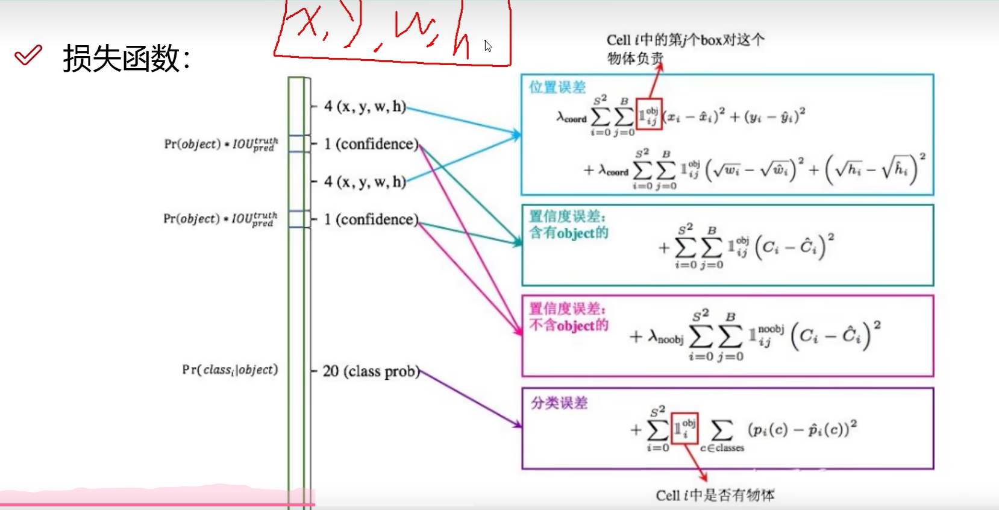

# YOLO 目标检测

- 参考文章：https://blog.csdn.net/weixin_42310154/article/details/119889682

## 1.1 优势

## 1.2 指标分析

- TP:=20;FP:30;FN=0;TN=50

> 详细解读

- True Positive(真正，TP)：将正类预测为正类数
- True Negative(真负，TN)：将负类预测为负类数
- False Positive(假正，FP)：将负类预测为正类数误报 (Type I error)
- False Negative(假负，FN)：将正类预测为负类数→漏报 (Type II error)

**1、准确率（Accuracy）**

准确率(accuracy)计算公式为：

- 注：准确率是我们最常见的评价指标，而且很容易理解，就是被分对的样本数除以所有的样本数，通常来说，正确率越高，分类器越好。
- 准确率确实是一个很好很直观的评价指标，但是有时候准确率高并不能代表一个算法就好。比如某个地区某天地震的预测，假设我们有一堆的特征作为地震分类的属性，类别只有两个：0：不发生地震、1：发生地震。一个不加思考的分类器，对每一个测试用例都将类别划分为0，那那么它就可能达到99%的准确率，但真的地震来临时，这个分类器毫无察觉，这个分类带来的损失是巨大的。为什么99%的准确率的分类器却不是我们想要的，因为这里数据分布不均衡，类别1的数据太少，完全错分类别1依然可以达到很高的准确率却忽视了我们关注的东西。再举个例子说明下。在正负样本不平衡的情况下，准确率这个评价指标有很大的缺陷。比如在互联网广告里面，点击的数量是很少的，一般只有千分之几，如果用acc，即使全部预测成负类（不点击）acc也有 99% 以上，没有意义。因此，单纯靠准确率来评价一个算法模型是远远不够科学全面的。

**2、错误率（Error rate）**

错误率则与准确率相反，描述被分类器错分的比例，error rate = (FP+FN)/(TP+TN+FP+FN)，对某一个实例来说，分对与分错是互斥事件，所以accuracy =1 - error rate。

**3、灵敏度（sensitive）**

sensitive = TP/P，表示的是所有正例中被分对的比例，衡量了分类器对正例的识别能力。

**4、特效度（specificity）**

specificity = TN/N，表示的是所有负例中被分对的比例，衡量了分类器对负例的识别能力。

**5、精确率、精度（Precision）**

精确率(precision)定义为：

表示被分为正例的示例中实际为正例的比例。

**6、召回率（recall）**

召回率是覆盖面的度量，度量有多个正例被分为正例，recall=TP/(TP+FN)=TP/P=sensitive，可以看到召回率与灵敏度是一样的。

## 1.3 损失函数

- 参考教程：https://blog.csdn.net/weixin_57643648/article/details/122704657

