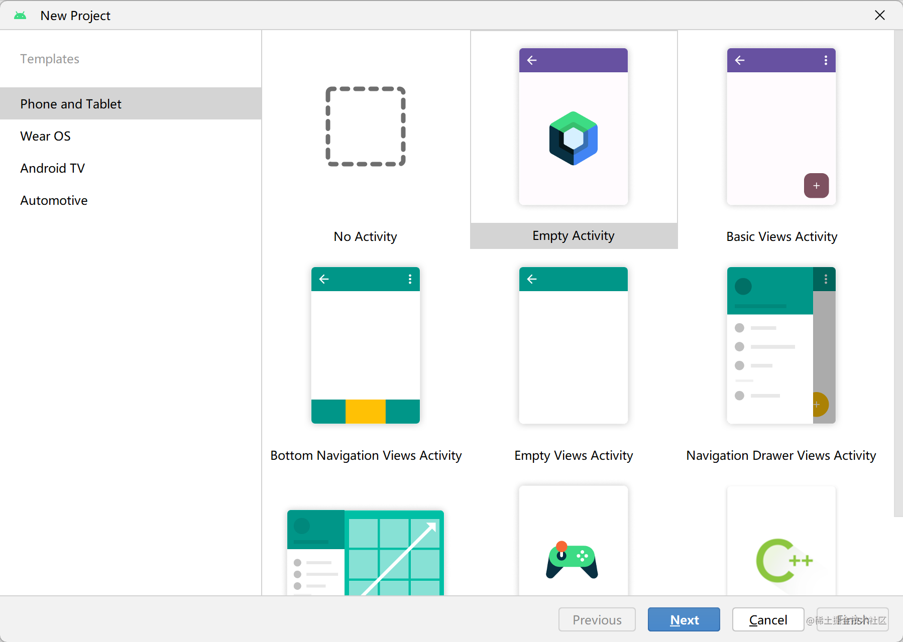
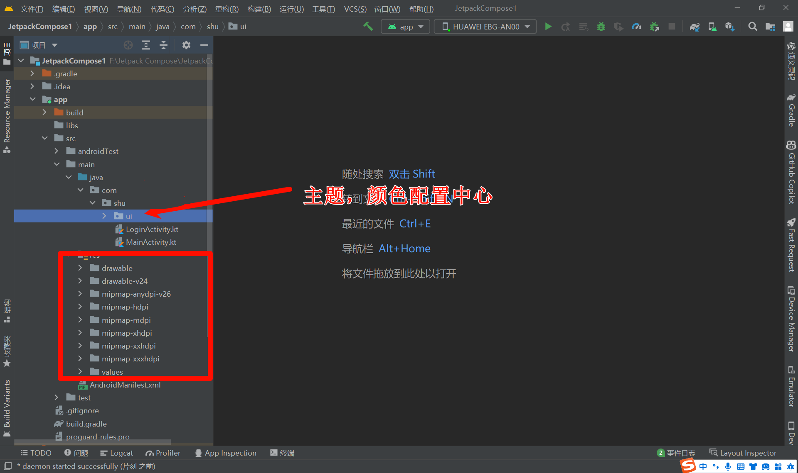
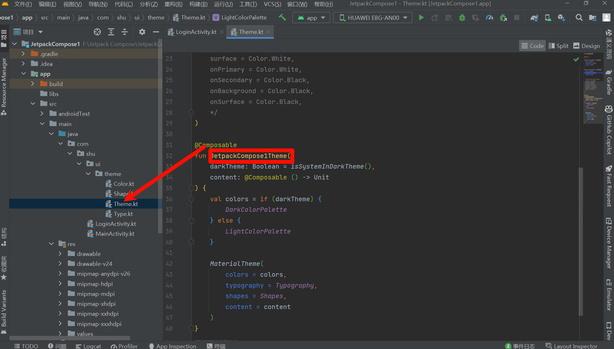
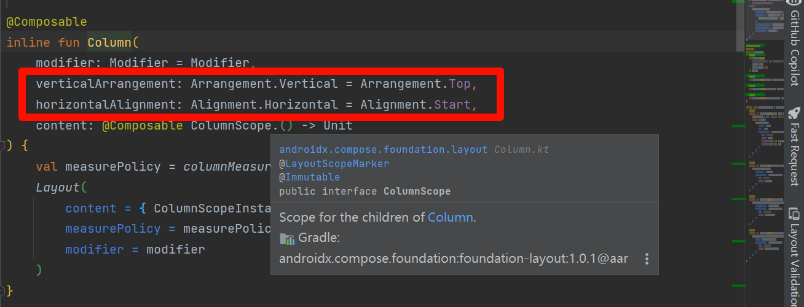
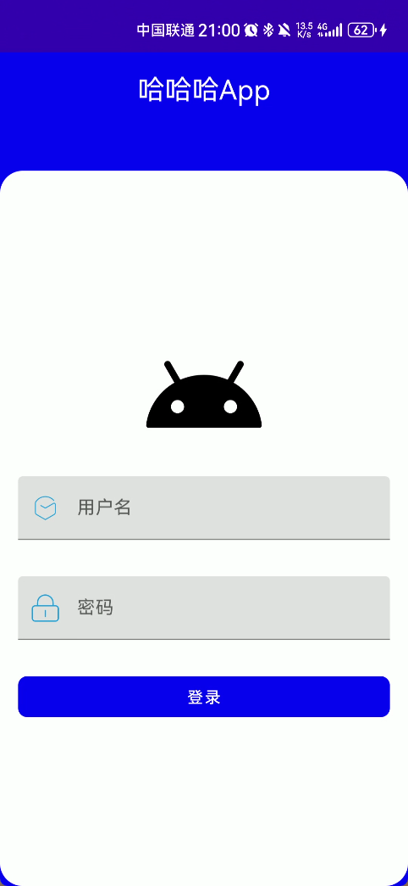

在开始用 Jetpack Compose 来编写软件之前，我们需要

### 1. 一台可以联网的电脑

### 2. **安装或更新到** [最新版的 Android Studio](https://developer.android.com/studio)

### 3. 选择创建 **Empty Activity**



> 如果你使用的 Android Studio 版本较旧，可能会看见多个 Compose 模板，请选择 `Empty Compose Activity (M3)`

### 4. 保持版本更新

尝试使用最新的 [Compose 稳定版](https://developer.android.com/jetpack/androidx/releases/compose) 和所要求的 [Kotlin 版本](https://developer.android.com/jetpack/androidx/releases/compose-kotlin)

`Gradle 版本`: [7.2](https://mvnrepository.com/artifact/com.android.tools.build/gradle?repo=google)

可手动在 `gradle-wrapper.properties` 中更新,下载很慢，需要多等一下

```groovy
distributionUrl=https\://services.gradle.org/distributions/gradle-7.2-bin.zip
```


```groovy
buildscript {
    ext {
        compose_version = '1.3.1'
        kotlin_version = "1.7.10"
    }
    repositories {
        google()
        mavenCentral()
    }
    dependencies {
        classpath "com.android.tools.build:gradle:7.1.3"
        classpath "org.jetbrains.kotlin:kotlin-gradle-plugin:$kotlin_version"
    }
}
```


```kotlin
buildscript {

    val compose_version by extra("1.3.1") // Compose 稳定版
    val kotlin_version by extra("1.7.10") // 对应的 Kotlin 版本

    repositories {
        google()
        mavenCentral()
    }
    dependencies {
        classpath("com.android.tools.build:gradle:7.1.3")
        // 注意：Compose 版本有时候需要要求 Kotlin 到达一定的版本，请同步更新
        classpath("org.jetbrains.kotlin:kotlin-gradle-plugin:$kotlin_version")
    }
}
```


### 5. 配置 Gradle（可忽略）

您需要将应用的最低 API 级别设置为 21 或更高级别，并在应用的 build.gradle 文件中启用 Jetpack Compose，如下所示。

```groovy title="build.gradle"
plugins {
    id 'com.android.application'
    id 'org.jetbrains.kotlin.android'
}

android {
    compileSdk 31

    defaultConfig {
        applicationId "yourAppId"
        minSdk 21
        targetSdk 31
        versionCode 1
        versionName "1.0"

        testInstrumentationRunner "androidx.test.runner.AndroidJUnitRunner"
        vectorDrawables {
            useSupportLibrary true
        }
    }

    buildTypes {
        release {
            minifyEnabled false
            proguardFiles getDefaultProguardFile('proguard-android-optimize.txt'), 'proguard-rules.pro'
        }
    }
    compileOptions {
        sourceCompatibility JavaVersion.VERSION_1_8
        targetCompatibility JavaVersion.VERSION_1_8
    }
    kotlinOptions {
        jvmTarget = '1.8'
    }
    buildFeatures {
        compose true
    }
    composeOptions {
        kotlinCompilerExtensionVersion compose_version
    }
    packagingOptions {
        resources {
            excludes += '/META-INF/{AL2.0,LGPL2.1}'
        }
    }
}

dependencies {
    implementation 'androidx.core:core-ktx:1.6.0'
    implementation "androidx.compose.ui:ui:$compose_version"
    implementation "androidx.compose.material:material:$compose_version"
    implementation "androidx.compose.ui:ui-tooling-preview:$compose_version"
    implementation 'androidx.lifecycle:lifecycle-runtime-ktx:2.3.1'
    implementation 'androidx.activity:activity-compose:1.3.1'
    testImplementation 'junit:junit:4.13.2'
    androidTestImplementation 'androidx.test.ext:junit:1.1.3'
    androidTestImplementation 'androidx.test.espresso:espresso-core:3.4.0'
    androidTestImplementation "androidx.compose.ui:ui-test-junit4:$compose_version"
    debugImplementation "androidx.compose.ui:ui-tooling:$compose_version"
}
```

:::warning
需要注意的是，如果你使用的 Jetpack Compose 版本不是稳定版而是最新版的时候，Compose Compiler 版本通常会和 `ui`, `animation` 等版本不一致，你需要在应用的 gradle 文件单独设置最新的编译器版本，否则会发生编译错误.

```groovy
android {
    buildFeatures {
        compose true
    }

    composeOptions {
        kotlinCompilerExtensionVersion = "1.3.0-rc01" // 单独设置 Compose Compiler 版本
    }

    kotlinOptions {
        jvmTarget = "1.8"
    }
}
```

:::

#### 使用 BOM

自 Jetpack Compose 1.3.0 起，Google 提供了 Compose BOM（Bill of Materials）用于快速指定版本。
> BOM 是一个 Maven 模块，它声明一组库和版本的对应关系，将能极大地简化你在 Gradle 依赖块中定义 Compose 库版本的方式。您现在只需要定义一个 BOM 版本，就可以同时指定所有的 Compose 库版本，而不是分别定义每个版本(当库版本开始不同时，这可能会变得很麻烦并且容易出错)。每当 Compose 有一个新的稳定版本时，我们都将发布一个新的 BOM 版本，因此从稳定版本迁移到新的稳定版本将会十分轻松

具体来说，当你在 `build.gradle` 中引入 `BOM` 后

```groovy
// Import the Compose BOM
implementation platform('androidx.compose:compose-bom:2022.11.00')
```

再引入其它 Compose 相关的库就不需要手动指定版本号了，它们会由 `BOM` 指定

```groovy
implementation "androidx.compose.ui:ui"
implementation "androidx.compose.material:material"
implementation "androidx.compose.ui:ui-tooling-preview"
```

`BOM` 指定的版本都是稳定版，你也可以选择覆写部分版本到 `alpha` 版本，如下：

```groovy
// Override Material Design 3 library version with a pre-release version
implementation 'androidx.compose.material3:material3:1.1.0-alpha01'
```

需要注意的是，这样可能会使部分其它的 Compose 库也升级为对应的 `alpha` 版本，以确保兼容性。  
`BOM` 和 库版本 的映射可以在 [Quick start  |  Jetpack Compose  |  Android Developers](https://developer.android.com/jetpack/compose/setup#bom-version-mapping) 找到，

### 6. 编写第一个 **Compose** 程序

现在，如果一切都正常，我们可以看到，**MainActivity.kt** 上显示以下代码

``` kotlin

class MainActivity : ComponentActivity() {
    override fun onCreate(savedInstanceState: Bundle?) {
        super.onCreate(savedInstanceState)
        setContent {
            MyApplicationTheme { // 注意：这里会根据你创建的项目名而不同
                // A surface container using the 'background' color from the theme
                Surface(color = MaterialTheme.colors.background) {
                    Greeting("Android") // ①
                }
            }
        }
    }
}

@Composable
fun Greeting(name: String) {
    Text(text = "Hello $name!")
}

@Preview(showBackground = true)
@Composable
fun DefaultPreview() {
    MyApplicationTheme {
        Greeting("Android")
    }
}
```

您可以尝试编译运行此项目，以确保各类环境已安装成功。在此基础上，您也可以尝试修改 `①`处字符串 "Android" 为其他值，在 debug 模式及较新的 Android Studio 版本下，您将看到修改实时显示到应用程序上——这是 Android Studio 提供的 `字面量编辑` 支持。您可以之后参阅 [官方文档](https://developer.android.com/jetpack/compose/tooling#live-edit-literals) 以了解更多。

现在，我们将 MainActivity.kt 修改成以下：

``` kotlin
class MainActivity : ComponentActivity() {
    override fun onCreate(savedInstanceState: Bundle?) {
        super.onCreate(savedInstanceState)
        setContent {
            
        }
    }
}
```

### 7. 目录结构了解



- 对比，java Android项目来说，没有布局文件目录，代替的是声明式布局
- App的主题配置，颜色配置代替的也是编码，保留了文件自由目录

### 8 一个登录页面案例

- 登录布局，头像，账号，密码，登录
- Row 组件能够将里面的子项按照从左到右的方向水平排列。
- Column 是一个布局组件，它能够将里面的子项按照从上到下的顺序垂直排列。
- `Jetpack Compose` 是围绕着 `Composable` 函数建立的。这些函数让你通过描述它的形状和数据依赖性，以编程方式定义你的 UI，而不是专注于 UI 的构建过程。要创建一个 `Composable` 函数，只需在函数名称中添加 `@Composable` 注解。
- `Android Studio` 可以让你在 `IDE` 中预览你的 `Composable` 函数，而不需要将应用下载到 `Android` 设备或模拟器上。但是有个限制, 需要预览的 `Composable` 函数必须不能有任何参数。因为这个限制，你不能直接预览 `MessageCard()` 函数。但是，你可以尝试写第一个叫 `PreviewMessageCard()` 的函数，它调用带有参数的 `MessageCard()`。在 `@Composable` 之前添加 `@Preview` 注解。

```kotlin
@Preview(showBackground = true) 
@Composable
fun LoginView() {
    // 
    JetpackCompose1Theme {
         Column(
            modifier = Modifier
                .fillMaxWidth()
                .fillMaxHeight()
                .drawBehind {
                    drawRect(DarkBlue)
                }
        ) {
            
            }
        }
        
    }
```

- JetpackCompose1Theme: 这个跟你的项目名称有关，简单来说就是主题



- Column的属性，我感觉只要熟悉Java的熟悉，看下源码们应该都知道，水平方向，垂直方向，Modifier简单理解CSS熟悉，后面会详细介绍，而且组件通用，上面我们首先定义了一个容器填充整个画布，颜色蓝色



- App标题组件：

```kotlin
@Composable
fun AppTitle(title: String) {
    Text(
        text = title,
        color = Color.White,
        modifier = Modifier
            .fillMaxWidth()
            .padding(vertical = 16.dp),
        textAlign = androidx.compose.ui.text.style.TextAlign.Center,
        fontSize = 24.sp
    )
}
```

- 头像组件

```kotlin
 Image(
          painter = painterResource(id = R.drawable.ic_android_black_24dp),
                    contentDescription = null,
                    modifier = Modifier
                        .size(120.dp)
                        .align(Alignment.CenterHorizontally)
                        .clip(RoundedCornerShape(50))
                        .padding(bottom = 8.dp)
```

- 用户名，密码 登录

```kotlin
@Composable
fun UserName(username: String, onValueChange: (String) -> Unit) {
    TextField(
        value = username,
        leadingIcon = {
            Image(
                painter = painterResource(id = R.drawable.ic_username),
                contentDescription = null,
                modifier = Modifier
                    .size(24.dp)
            )
        },
        onValueChange = onValueChange,
        label = { Text("用户名") },
        modifier = Modifier
            .fillMaxWidth()
            .padding(vertical = 16.dp)
    )
}

@Composable
fun Password(password: String, onValueChange: (String) -> Unit) {
    TextField(
        value = password,
        leadingIcon = {
            Image(
                painter = painterResource(id = R.drawable.ic_password),
                contentDescription = null,
                modifier = Modifier
                    .size(24.dp)
            )
        },
        onValueChange = onValueChange,
        label = { Text("密码") },

        modifier = Modifier
            .fillMaxWidth()
            .padding(vertical = 16.dp)
    )
}


@Composable
fun LoginButton(onClick: () -> Unit) {
    TextButton(
        onClick = onClick,
        modifier = Modifier
            .fillMaxWidth()
            .padding(vertical = 16.dp)
            .clip(RoundedCornerShape(8.dp))
            .background(DarkBlue)
    ) {
        Text(text = "登录", color = androidx.compose.ui.graphics.Color.White)
    }
}

```

- 组合

```kotlin
package com.shu


import android.os.Bundle
import android.util.Log
import androidx.activity.ComponentActivity
import androidx.activity.compose.setContent
import androidx.compose.foundation.Image
import androidx.compose.foundation.background
import androidx.compose.foundation.layout.*
import androidx.compose.foundation.shape.RoundedCornerShape
import androidx.compose.material.Text
import androidx.compose.material.TextButton
import androidx.compose.material.TextField
import androidx.compose.runtime.*
import androidx.compose.ui.Alignment
import androidx.compose.ui.Modifier
import androidx.compose.ui.draw.clip
import androidx.compose.ui.draw.drawBehind
import androidx.compose.ui.graphics.Color
import androidx.compose.ui.res.painterResource
import androidx.compose.ui.tooling.preview.Preview
import androidx.compose.ui.unit.dp
import androidx.compose.ui.unit.sp
import com.shu.ui.theme.DarkBlue
import com.shu.ui.theme.JetpackCompose1Theme
import com.shu.ui.theme.LightGreen


class LoginActivity : ComponentActivity() {
    override fun onCreate(savedInstanceState: Bundle?) {
        super.onCreate(savedInstanceState)
        setContent {
            LoginView()
        }
    }
}

@Preview(showBackground = true)
@Composable
fun LoginView() {
    JetpackCompose1Theme {
        var username by remember { mutableStateOf("") }
        var password by remember { mutableStateOf("") }
        Column(
            modifier = Modifier
                .fillMaxWidth()
                .fillMaxHeight()
                .drawBehind {
                    drawRect(DarkBlue)
                }
        ) {
            AppTitle("哈哈哈App")
            Column(
                verticalArrangement = Arrangement.Center,
                modifier = Modifier
                    .fillMaxHeight()
                    .padding(top = 40.dp)
                    .clip(RoundedCornerShape(20.dp))
                    .background(LightGreen)
            ) {
                Image(
                    painter = painterResource(id = R.drawable.ic_android_black_24dp),
                    contentDescription = null,
                    modifier = Modifier
                        .size(120.dp)
                        .align(Alignment.CenterHorizontally)
                        .clip(RoundedCornerShape(50))
                        .padding(bottom = 8.dp)
                )
                Column(
                    modifier = Modifier
                        .fillMaxWidth()
                        .padding(horizontal = 16.dp)
                ) {
                    UserName(username = username, onValueChange = { username = it })
                    Password(password = password, onValueChange = { password = it })
                    LoginButton {
                        Log.d("LoginActivity", "username:$username,password:$password")
                    }
                }
            }
        }
    }
}


@Composable
fun AppTitle(title: String) {
    Text(
        text = title,
        color = Color.White,
        modifier = Modifier
            .fillMaxWidth()
            .padding(vertical = 16.dp),
        textAlign = androidx.compose.ui.text.style.TextAlign.Center,
        fontSize = 24.sp
    )
}


@Composable
fun UserName(username: String, onValueChange: (String) -> Unit) {
    TextField(
        value = username,
        leadingIcon = {
            Image(
                painter = painterResource(id = R.drawable.ic_username),
                contentDescription = null,
                modifier = Modifier
                    .size(24.dp)
            )
        },
        onValueChange = onValueChange,
        label = { Text("用户名") },
        modifier = Modifier
            .fillMaxWidth()
            .padding(vertical = 16.dp)
    )
}

@Composable
fun Password(password: String, onValueChange: (String) -> Unit) {
    TextField(
        value = password,
        leadingIcon = {
            Image(
                painter = painterResource(id = R.drawable.ic_password),
                contentDescription = null,
                modifier = Modifier
                    .size(24.dp)
            )
        },
        onValueChange = onValueChange,
        label = { Text("密码") },

        modifier = Modifier
            .fillMaxWidth()
            .padding(vertical = 16.dp)
    )
}


@Composable
fun LoginButton(onClick: () -> Unit) {
    TextButton(
        onClick = onClick,
        modifier = Modifier
            .fillMaxWidth()
            .padding(vertical = 16.dp)
            .clip(RoundedCornerShape(8.dp))
            .background(DarkBlue)
    ) {
        Text(text = "登录", color = androidx.compose.ui.graphics.Color.White)
    }
}


```

- 效果



- 总结来说：第一次使用我们可以按照原来的思路进行布局，只是我们需要认识新的属性与样式写法
