Jetpack Compose 中的 常用组件

## 1.1 文字组件

### 1.1.1 Text

- 文本是UI中最常见的元素之一。在Compose中，Text是遵循Material Design规范设计的上层文本组件，如果想脱离Material Design使用，也可以直接使用更底层的文本组件BasicText。
- 我们知道Composable组件都是函数，所有的配置来自参数传递，通过参数列表就可以了解组件的所有功能。

```kotlin
fun Text(
    text: String,
    modifier: Modifier = Modifier,
    color: Color = Color.Unspecified,
    fontSize: TextUnit = TextUnit.Unspecified,
    fontStyle: FontStyle? = null,
    fontWeight: FontWeight? = null,
    fontFamily: FontFamily? = null,
    letterSpacing: TextUnit = TextUnit.Unspecified,
    textDecoration: TextDecoration? = null,
    textAlign: TextAlign? = null,
    lineHeight: TextUnit = TextUnit.Unspecified,
    overflow: TextOverflow = TextOverflow.Clip,
    softWrap: Boolean = true,
    maxLines: Int = Int.MAX_VALUE,
    onTextLayout: (TextLayoutResult) -> Unit = {},
    style: TextStyle = LocalTextStyle.current
)
```

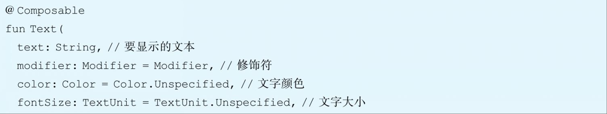

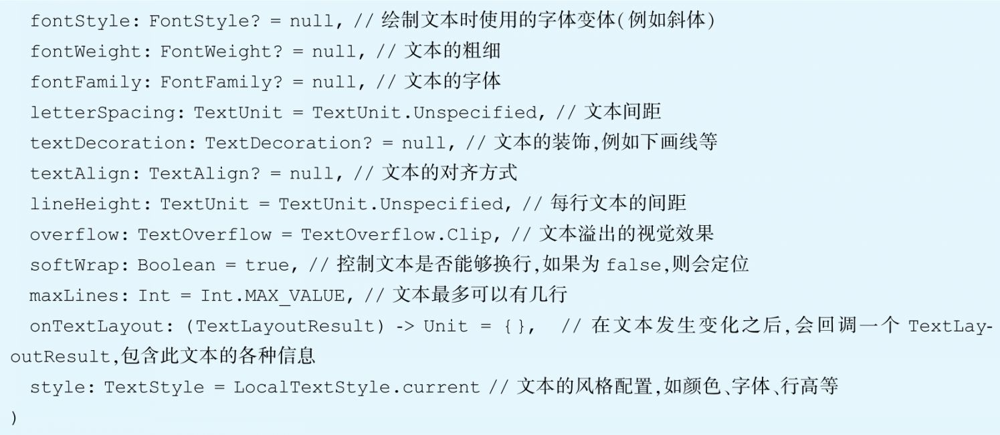

```kotlin
@Composable
fun AppTitle(title: String) {
    Text(
        text = title,
        color = Color.White,
        modifier = Modifier
            .fillMaxWidth()
            .padding(vertical = 16.dp),
        textAlign = androidx.compose.ui.text.style.TextAlign.Center,
        fontSize = 24.sp
    )
}
```

- style文字样式: style参数接受一个TextStyle类型，TextStyle中包含一系列设置文字样式的字段，例如行高、间距、字体大小、字体粗细等。

```kotlin
 Text(
            text = title,
            color = Color.White,
            modifier = Modifier
                .fillMaxWidth()
                .padding(vertical = 16.dp),
            textAlign = androidx.compose.ui.text.style.TextAlign.Center,
//        fontSize = 24.sp,
            style = androidx.compose.ui.text.TextStyle(
                fontSize = 24.sp,
                textDecoration = TextDecoration.LineThrough,
                fontFamily = FontFamily.Cursive
            )
        )
```

- Text自身默认是不能被长按选择的，否则在Button中使用时，Compose提供了专门的`SelectionContainer`组件，对包裹的Text进行选中。

```kotlin
@Composable
fun AppTitle(title: String) {
    // 显示选中文本
    SelectionContainer() {
        Text(
            text = title,
            color = Color.White,
            modifier = Modifier
                .fillMaxWidth()
                .padding(vertical = 16.dp),
            textAlign = androidx.compose.ui.text.style.TextAlign.Center,
//        fontSize = 24.sp,
            style = androidx.compose.ui.text.TextStyle(
                fontSize = 24.sp,
                textDecoration = TextDecoration.LineThrough,
                fontFamily = FontFamily.Cursive
            )
        )
    }
}
```

### 1.1.2 TextField

- TextField组件是我们最常使用的文本输入框，它也遵循着Material Design设计准则。它也有一个低级别的底层组件，叫作BasicTextField
- TextField有两种风格，一种是默认的，也就是filled，另一种是OutlinedTextField

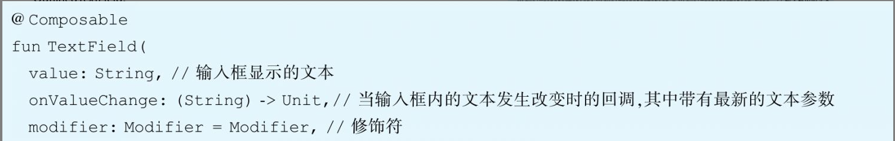

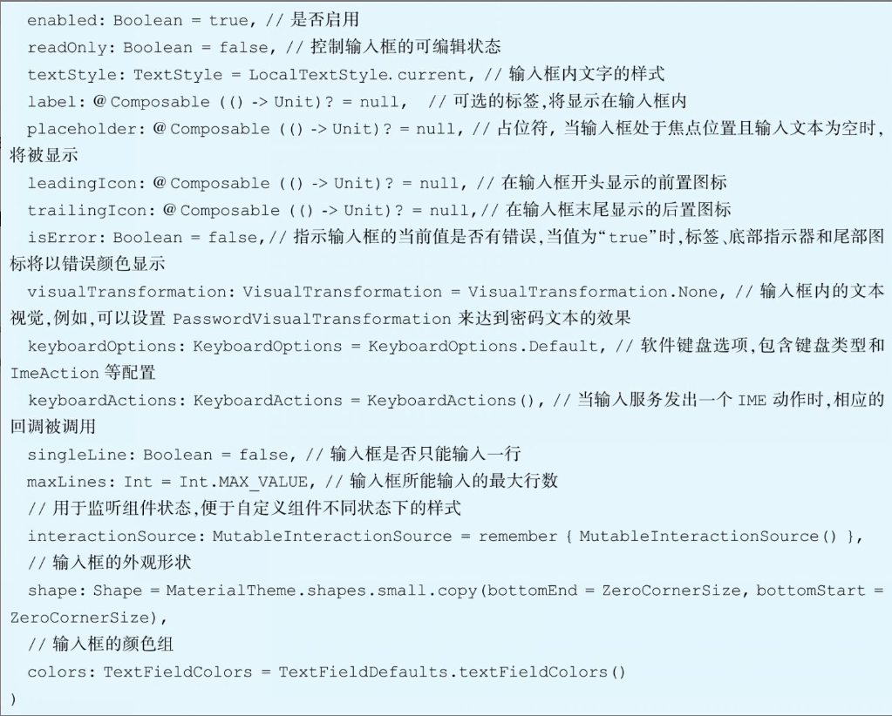

```kotlin
fun TextField(
    value: String,
    onValueChange: (String) -> Unit,
    modifier: Modifier = Modifier,
    enabled: Boolean = true,
    readOnly: Boolean = false,
    textStyle: TextStyle = LocalTextStyle.current,
    label: @Composable (() -> Unit)? = null,
    placeholder: @Composable (() -> Unit)? = null,
    leadingIcon: @Composable (() -> Unit)? = null,
    trailingIcon: @Composable (() -> Unit)? = null,
    isError: Boolean = false,
    visualTransformation: VisualTransformation = VisualTransformation.None,
    keyboardOptions: KeyboardOptions = KeyboardOptions.Default,
    keyboardActions: KeyboardActions = KeyboardActions(),
    singleLine: Boolean = false,
    maxLines: Int = Int.MAX_VALUE,
    interactionSource: MutableInteractionSource = remember { MutableInteractionSource() },
    shape: Shape =
        MaterialTheme.shapes.small.copy(bottomEnd = ZeroCornerSize, bottomStart = ZeroCornerSize),
    colors: TextFieldColors = TextFieldDefaults.textFieldColors()
)
```

```kotlin
@Composable
fun UserName(username: String, onValueChange: (String) -> Unit) {
    TextField(
        value = username,
        leadingIcon = {
            Image(
                painter = painterResource(id = R.drawable.ic_username),
                contentDescription = null,
                modifier = Modifier
                    .size(24.dp)
            )
        },
        onValueChange = onValueChange,
        label = { Text("用户名") },
        modifier = Modifier
            .fillMaxWidth()
            .padding(vertical = 16.dp)
    )
}
```

### 1.1.3 OutlinedTextField

OutlinedTextField: OutlinedTextField是按照Material Design规范设计的另一种风格的输入框，除了外观上它带有一个边框，其他用法和TextField基本一致。


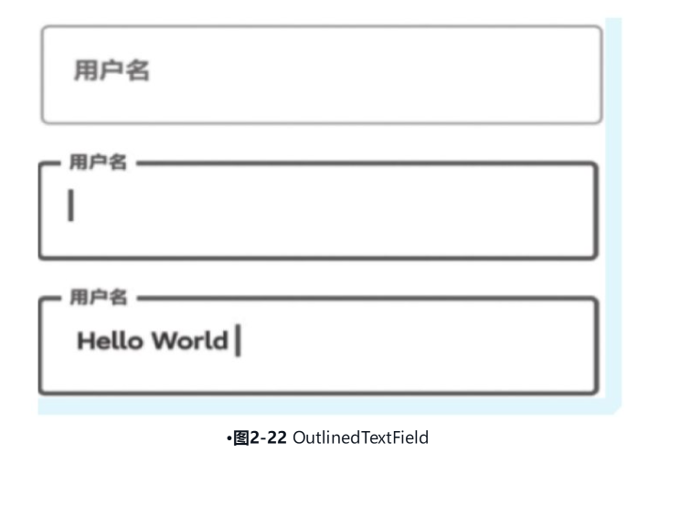

### 1.1.4 BasicTextField

- .BasicTextField: BasicTextField是一个更低级别的Composable组件，与TextField、OutlinedTextField不同的是，BasicTextField拥有更多的自定义效果。由于TextField和OutlinedTextField是根据Material Design准则设计的，我们无法直接修改输入框的高度，如果尝试修改高度，会看到输入区域被截断，影响正常输入。

```kotlin
fun BasicTextField(
    value: String,
    onValueChange: (String) -> Unit,
    modifier: Modifier = Modifier,
    enabled: Boolean = true,
    readOnly: Boolean = false,
    textStyle: TextStyle = TextStyle.Default,
    keyboardOptions: KeyboardOptions = KeyboardOptions.Default,
    keyboardActions: KeyboardActions = KeyboardActions.Default,
    singleLine: Boolean = false,
    maxLines: Int = Int.MAX_VALUE,
    visualTransformation: VisualTransformation = VisualTransformation.None,
    onTextLayout: (TextLayoutResult) -> Unit = {},
    interactionSource: MutableInteractionSource = remember { MutableInteractionSource() },
    cursorBrush: Brush = SolidColor(Color.Black),
    decorationBox: @Composable (innerTextField: @Composable () -> Unit) -> Unit =
        @Composable { innerTextField -> innerTextField() }
)
```

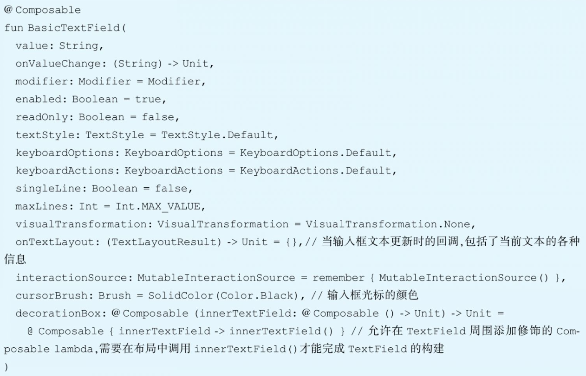

### 1.1.5 搜索框

首先我们分析一下，在这个输入框中，含有前置的搜索图标，在未输入文字之前，有个提示的文字(Placeholder)在输入框中，在输入框有文字之后，输入框尾部含有一个可单击的关闭按钮，用来清空输入框当前所有的文字。输入框的外观为：白色的背景+圆角。分析完输入框的特点后，可以开始着手制作了，首先来声明出输入框的外观。

```kotlin
fun SearchBarScreen() {
    var text by remember { mutableStateOf(TextFieldValue("")) }

    val searchIconColor = Color.Gray
    val hintTextColor = searchIconColor.copy(alpha = 0.5f)

    Box(
        modifier = Modifier
            .background(Color(0xFDD5D6D6))
            .fillMaxWidth(),
        contentAlignment = Alignment.CenterStart
    ) {
        BasicTextField(
            value = text,
            onValueChange = { text = it },
            singleLine = true,
            textStyle = TextStyle(fontSize = 16.sp),
            decorationBox = { innerTextField ->
                Row(
                    verticalAlignment = Alignment.CenterVertically,
                    modifier = Modifier.padding(horizontal = 16.dp)
                ) {
                    Icon(
                        imageVector = Icons.Default.Search,
                        contentDescription = "Search Icon",
                        tint = searchIconColor,
                        modifier = Modifier.size(24.dp)
                    )
                    Spacer(modifier = Modifier.width(8.dp))
                    if (text.text.isEmpty()) {
                        Text(
                            text = "请输入搜索内容",
                            color = hintTextColor,
                            fontSize = 12.sp
                        )
                    } else {
                        innerTextField()
                    }
                    Spacer(modifier = Modifier.weight(1f))
                    IconButton(
                        onClick = { text = TextFieldValue("") },
                        modifier = Modifier
                            .size(24.dp)
                    ) {
                        Icon(
                            imageVector = Icons.Default.Close,
                            contentDescription = "Clear Search",
                        )
                    }
                    
                }
            },
            modifier = Modifier
                .fillMaxWidth()
                .background(White, CircleShape)
                .padding(horizontal = 16.dp, vertical = 8.dp)
                .height(40.dp)
        )
    }
}
```

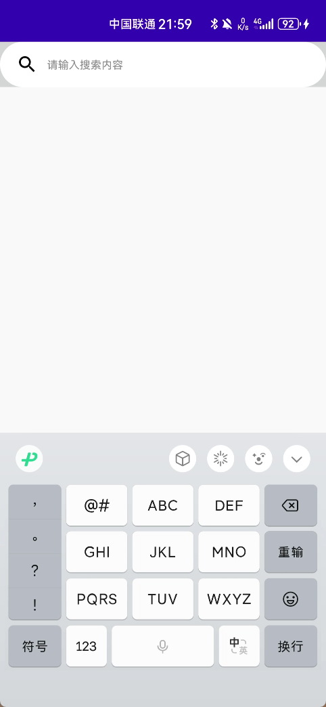


## 1.2  图片组件

### 1.2.1 Icon图标

- Icon组件用于显示一系列小图标。Icon组件支持三种不同类型的图片设置

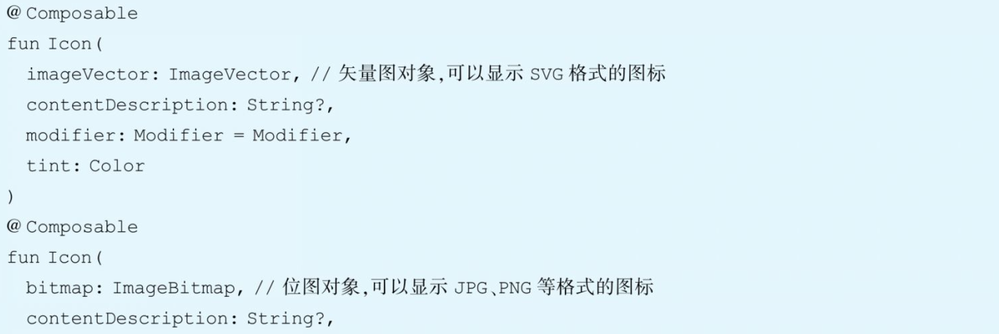

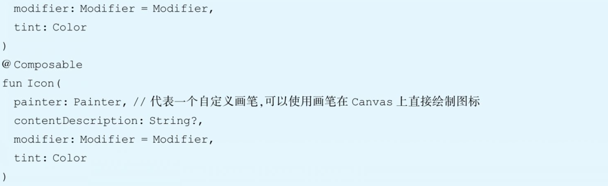

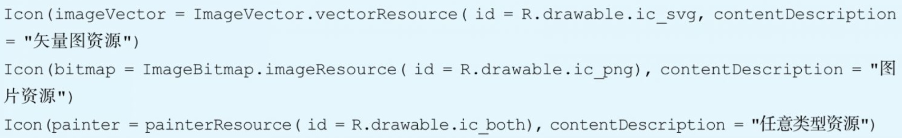

- ImageVector和ImageBitmap都提供了对应的加载Drawable资源的方法，vectorResource用来加载一个矢量XML, imageResource用来加载jpg或者png图片。

- painterResource对以上两种类型的Drawable都支持，内部会根据资源创建对应的画笔进行图标的绘制。

### 1.2.2 Image图片

- Image组件用来显示一张图片。它和Icon一样也支持三种类型的图片设置，这里以Painter类型的组件为例，展示一下它的参数列表


- contentScale参数用来指定图片在Image组件中的伸缩样式，类似传统视图ImageView的scaleType属性，它有以下几种类型

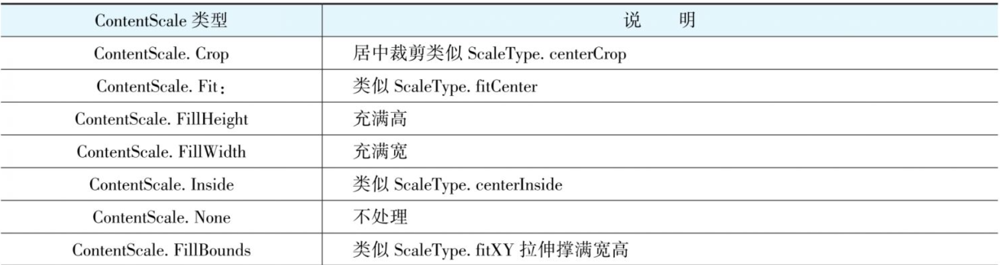

- colorFilter参数用来设置一个ColorFilter，它可以通过对绘制的图片的每个像素颜色进行修改，以实现不同的图片效果。ColorFilter有三种修改方式：tint、colorMatrix、lighting。

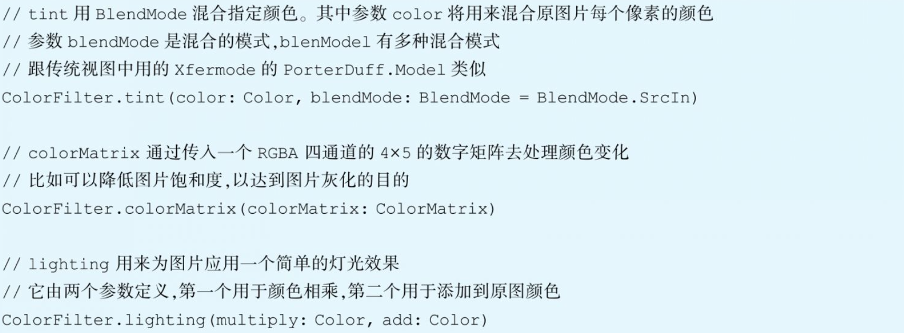

## 1.3 按钮组件

Button也是最常用的组件之一，它也是按照Material Design风格来实现的。本节让我们看看Button的基本使用，照例先看一下Button的参数列表，了解一下它的整体功能。

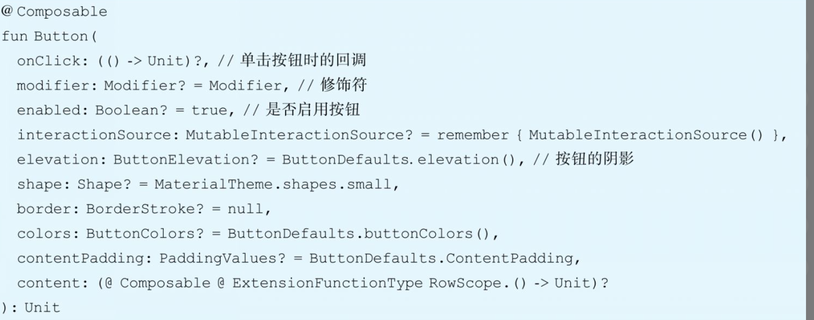

- Button的第一个参数onClick是必填项，这是其最重要的功能，通过回调响应用户点击事件。最后一个参数content也是一个必填项，也是其最重要的功能之一。Compose的Button默认没有任何UI。仅仅是一个响应onClick的容器，它的UI需要在content中通过其他组件来实现。

