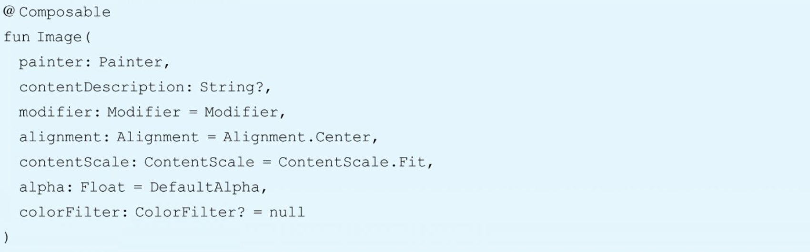

Jetpack Compose 中的 常用组件

## 1.1 文字组件

### 1.1.1 Text

- 文本是UI中最常见的元素之一。在Compose中，Text是遵循Material Design规范设计的上层文本组件，如果想脱离Material Design使用，也可以直接使用更底层的文本组件BasicText。
- 我们知道Composable组件都是函数，所有的配置来自参数传递，通过参数列表就可以了解组件的所有功能。

```kotlin
fun Text(
    text: String,
    modifier: Modifier = Modifier,
    color: Color = Color.Unspecified,
    fontSize: TextUnit = TextUnit.Unspecified,
    fontStyle: FontStyle? = null,
    fontWeight: FontWeight? = null,
    fontFamily: FontFamily? = null,
    letterSpacing: TextUnit = TextUnit.Unspecified,
    textDecoration: TextDecoration? = null,
    textAlign: TextAlign? = null,
    lineHeight: TextUnit = TextUnit.Unspecified,
    overflow: TextOverflow = TextOverflow.Clip,
    softWrap: Boolean = true,
    maxLines: Int = Int.MAX_VALUE,
    onTextLayout: (TextLayoutResult) -> Unit = {},
    style: TextStyle = LocalTextStyle.current
)
```


```kotlin
@Composable
fun AppTitle(title: String) {
    Text(
        text = title,
        color = Color.White,
        modifier = Modifier
            .fillMaxWidth()
            .padding(vertical = 16.dp),
        textAlign = androidx.compose.ui.text.style.TextAlign.Center,
        fontSize = 24.sp
    )
}
```

- style文字样式: style参数接受一个TextStyle类型，TextStyle中包含一系列设置文字样式的字段，例如行高、间距、字体大小、字体粗细等。

```kotlin
 Text(
            text = title,
            color = Color.White,
            modifier = Modifier
                .fillMaxWidth()
                .padding(vertical = 16.dp),
            textAlign = androidx.compose.ui.text.style.TextAlign.Center,
//        fontSize = 24.sp,
            style = androidx.compose.ui.text.TextStyle(
                fontSize = 24.sp,
                textDecoration = TextDecoration.LineThrough,
                fontFamily = FontFamily.Cursive
            )
        )
```

- Text自身默认是不能被长按选择的，否则在Button中使用时，Compose提供了专门的`SelectionContainer`组件，对包裹的Text进行选中。

```kotlin
@Composable
fun AppTitle(title: String) {
    // 显示选中文本
    SelectionContainer() {
        Text(
            text = title,
            color = Color.White,
            modifier = Modifier
                .fillMaxWidth()
                .padding(vertical = 16.dp),
            textAlign = androidx.compose.ui.text.style.TextAlign.Center,
//        fontSize = 24.sp,
            style = androidx.compose.ui.text.TextStyle(
                fontSize = 24.sp,
                textDecoration = TextDecoration.LineThrough,
                fontFamily = FontFamily.Cursive
            )
        )
    }
}
```

### 1.1.2 TextField

- TextField组件是我们最常使用的文本输入框，它也遵循着Material Design设计准则。它也有一个低级别的底层组件，叫作BasicTextField
- TextField有两种风格，一种是默认的，也就是filled，另一种是OutlinedTextField


```kotlin
fun TextField(
    value: String,
    onValueChange: (String) -> Unit,
    modifier: Modifier = Modifier,
    enabled: Boolean = true,
    readOnly: Boolean = false,
    textStyle: TextStyle = LocalTextStyle.current,
    label: @Composable (() -> Unit)? = null,
    placeholder: @Composable (() -> Unit)? = null,
    leadingIcon: @Composable (() -> Unit)? = null,
    trailingIcon: @Composable (() -> Unit)? = null,
    isError: Boolean = false,
    visualTransformation: VisualTransformation = VisualTransformation.None,
    keyboardOptions: KeyboardOptions = KeyboardOptions.Default,
    keyboardActions: KeyboardActions = KeyboardActions(),
    singleLine: Boolean = false,
    maxLines: Int = Int.MAX_VALUE,
    interactionSource: MutableInteractionSource = remember { MutableInteractionSource() },
    shape: Shape =
        MaterialTheme.shapes.small.copy(bottomEnd = ZeroCornerSize, bottomStart = ZeroCornerSize),
    colors: TextFieldColors = TextFieldDefaults.textFieldColors()
)
```

```kotlin
@Composable
fun UserName(username: String, onValueChange: (String) -> Unit) {
    TextField(
        value = username,
        leadingIcon = {
            Image(
                painter = painterResource(id = R.drawable.ic_username),
                contentDescription = null,
                modifier = Modifier
                    .size(24.dp)
            )
        },
        onValueChange = onValueChange,
        label = { Text("用户名") },
        modifier = Modifier
            .fillMaxWidth()
            .padding(vertical = 16.dp)
    )
}
```

### 1.1.3 OutlinedTextField

OutlinedTextField: OutlinedTextField是按照Material Design规范设计的另一种风格的输入框，除了外观上它带有一个边框，其他用法和TextField基本一致。


### 1.1.4 BasicTextField

- .BasicTextField: BasicTextField是一个更低级别的Composable组件，与TextField、OutlinedTextField不同的是，BasicTextField拥有更多的自定义效果。由于TextField和OutlinedTextField是根据Material Design准则设计的，我们无法直接修改输入框的高度，如果尝试修改高度，会看到输入区域被截断，影响正常输入。

```kotlin
fun BasicTextField(
    value: String,
    onValueChange: (String) -> Unit,
    modifier: Modifier = Modifier,
    enabled: Boolean = true,
    readOnly: Boolean = false,
    textStyle: TextStyle = TextStyle.Default,
    keyboardOptions: KeyboardOptions = KeyboardOptions.Default,
    keyboardActions: KeyboardActions = KeyboardActions.Default,
    singleLine: Boolean = false,
    maxLines: Int = Int.MAX_VALUE,
    visualTransformation: VisualTransformation = VisualTransformation.None,
    onTextLayout: (TextLayoutResult) -> Unit = {},
    interactionSource: MutableInteractionSource = remember { MutableInteractionSource() },
    cursorBrush: Brush = SolidColor(Color.Black),
    decorationBox: @Composable (innerTextField: @Composable () -> Unit) -> Unit =
        @Composable { innerTextField -> innerTextField() }
)
```


### 1.1.5 搜索框

首先我们分析一下，在这个输入框中，含有前置的搜索图标，在未输入文字之前，有个提示的文字(Placeholder)在输入框中，在输入框有文字之后，输入框尾部含有一个可单击的关闭按钮，用来清空输入框当前所有的文字。输入框的外观为：白色的背景+圆角。分析完输入框的特点后，可以开始着手制作了，首先来声明出输入框的外观。

```kotlin
fun SearchBarScreen() {
    var text by remember { mutableStateOf(TextFieldValue("")) }

    val searchIconColor = Color.Gray
    val hintTextColor = searchIconColor.copy(alpha = 0.5f)

    Box(
        modifier = Modifier
            .background(Color(0xFDD5D6D6))
            .fillMaxWidth(),
        contentAlignment = Alignment.CenterStart
    ) {
        BasicTextField(
            value = text,
            onValueChange = { text = it },
            singleLine = true,
            textStyle = TextStyle(fontSize = 16.sp),
            decorationBox = { innerTextField ->
                Row(
                    verticalAlignment = Alignment.CenterVertically,
                    modifier = Modifier.padding(horizontal = 16.dp)
                ) {
                    Icon(
                        imageVector = Icons.Default.Search,
                        contentDescription = "Search Icon",
                        tint = searchIconColor,
                        modifier = Modifier.size(24.dp)
                    )
                    Spacer(modifier = Modifier.width(8.dp))
                    if (text.text.isEmpty()) {
                        Text(
                            text = "请输入搜索内容",
                            color = hintTextColor,
                            fontSize = 12.sp
                        )
                    } else {
                        innerTextField()
                    }
                    Spacer(modifier = Modifier.weight(1f))
                    IconButton(
                        onClick = { text = TextFieldValue("") },
                        modifier = Modifier
                            .size(24.dp)
                    ) {
                        Icon(
                            imageVector = Icons.Default.Close,
                            contentDescription = "Clear Search",
                        )
                    }
                    
                }
            },
            modifier = Modifier
                .fillMaxWidth()
                .background(White, CircleShape)
                .padding(horizontal = 16.dp, vertical = 8.dp)
                .height(40.dp)
        )
    }
}
```


## 1.2  图片组件

### 1.2.1 Icon图标

- Icon组件用于显示一系列小图标。Icon组件支持三种不同类型的图片设置


- ImageVector和ImageBitmap都提供了对应的加载Drawable资源的方法，vectorResource用来加载一个矢量XML, imageResource用来加载jpg或者png图片。
- painterResource对以上两种类型的Drawable都支持，内部会根据资源创建对应的画笔进行图标的绘制。

```kotlin
 Icon(
                        imageVector = Icons.Default.Search,
                        contentDescription = "Search Icon",
                        tint = searchIconColor,
                        modifier = Modifier.size(24.dp)
   )
```

### 1.2.2 Image图片

- Image组件用来显示一张图片。它和Icon一样也支持三种类型的图片设置，这里以Painter类型的组件为例，展示一下它的参数列表



- contentScale参数用来指定图片在Image组件中的伸缩样式，类似传统视图ImageView的scaleType属性，它有以下几种类型


- colorFilter参数用来设置一个ColorFilter，它可以通过对绘制的图片的每个像素颜色进行修改，以实现不同的图片效果。ColorFilter有三种修改方式：tint、colorMatrix、lighting。


```kotlin
Image(
                    painter = painterResource(id = R.drawable.ic_android_black_24dp),
                    contentDescription = null,
                    modifier = Modifier
                        .size(120.dp)
                        .align(Alignment.CenterHorizontally)
                        .clip(RoundedCornerShape(50))
                        .padding(bottom = 8.dp)
                )
```

## 1.3 按钮组件

### 1.3.1 Button按钮组件

Button也是最常用的组件之一，它也是按照Material Design风格来实现的。本节让我们看看Button的基本使用，照例先看一下Button的参数列表，了解一下它的整体功能。


- Button的第一个参数onClick是必填项，这是其最重要的功能，通过回调响应用户点击事件。最后一个参数content也是一个必填项，也是其最重要的功能之一。Compose的Button默认没有任何UI。仅仅是一个响应onClick的容器，它的UI需要在content中通过其他组件来实现。
- content提供了RowScope的作用域，所以当我们想在文字前面水平摆放一个Icon时，只需要在content中顺序书写即可

```kotlin
fun ButtonView() {
    Button(onClick = {
    }) {
        Icon(imageVector = Icons.Default.Search, contentDescription ="ssss" )
        Spacer(modifier = Modifier.width(8.dp))
        Text(text = "Button")
    }
}
```


- Button有一个参数interactionSource，在前面的组件中也出现过。它是一个可以监听组件状态的事件源，通过它我们可以根据组件状态设置不同的样式，比如按钮按下时什么效果，正常时什么效果，类似传统视图中的Selector。interactionSource通过以下方法获取当前组件状态：
- interactionSource.collectIsPressedAsState()判断是否按下状态。
- interactionSource.collectIsFocusedAsState()判断是否获取焦点的状态。
- interactionSource.collectIsDraggedAsState()判断是否拖动。

```kotlin
fun ButtonView() {
    val interactionSource = remember { MutableInteractionSource() }
    val pressState = interactionSource.collectIsPressedAsState()
    val buttonColors = if (pressState.value) {
        Color.White
    } else {
        Color.Green
    }
    
    Button(onClick = {
    },
        interactionSource= interactionSource,
        border = BorderStroke(2.dp, color = buttonColors)
    ) {
        Icon(imageVector = Icons.Default.Search, contentDescription ="ssss" )
        Spacer(modifier = Modifier.width(8.dp))
        Text(text = "Button")
    }
}
```

- Button并非唯一可点击组件，理论上任何Composable组件都可以通过Modifier.clickable修饰符化身为可点击组件。而当Button被点击后，需要额外进行一些事件响应处理，比如显示Material Desgin风格的水波纹等，这些都是其内部通过拦截Modifier.clickable事件实现的处理，由于Modifier.clikable已经被内部实现所占用，Button需要提供单独的onClick参数供开发者使用。

### 1.3.2 IconButton图标按钮

- IconButton组件实际上只是Button组件的简单封装（一个可点击的图标），它一般用于应用栏中的导航或者其他行为。一般来说，我们需要在IconButton组件里提供一个图标组件，这个图标的默认尺寸一般为24×24dp。

```kotlin
fun IconButtonView() {
    IconButton(onClick = {
    }) {
        Icon(imageVector = Icons.Default.Search, contentDescription ="ssss" )
    }
}
```

### 1.3.3 FloatingActionButton悬浮按钮

- FloatingActionButton悬浮按钮(FAB)一般代表当前页面的主要行为。FAB组件也是需要我们提供一个Icon组件

## 1.4  选择器

### 1.4.1 Checkbox复选框


- CheckBox允许用户从一个集合中选择一个或多个项目。复选框可以将一个选项打开或关闭。

```kotlin
fun CheckboxView() {
    val checkedStatus = remember { mutableStateOf(false) }
    Checkbox(
        checked = checkedStatus.value,
        onCheckedChange = {
            checkedStatus.value = it
        },
        modifier = Modifier.padding(8.dp)
    )
}
```

### 1.4.2 TriStateCheckbox三态选择框

- 很多时候，我们的复选框会有很多个，并且希望能够统一选择或者取消，这个时候就可以用TriStateCheckBox组件

```kotlin
@Preview()
@Composable
fun triStateCheckboxTest(){
    val context = LocalContext.current
    val interactionSource = remember {
        MutableInteractionSource()
    }
    val pressState = interactionSource.collectIsPressedAsState()
    val borderColor = if (pressState.value) Color.Green else Color.Black
    var isCheck = remember {
        mutableStateOf(false)
    }

    var toggleState = remember {
        mutableStateOf(ToggleableState(false))
    }

    Column(modifier = Modifier.padding(10.dp,10.dp)) {
        TriStateCheckbox(
            state = toggleState.value,
            onClick = {
                toggleState.value = when(toggleState.value){
                    ToggleableState.On->{
                        ToggleableState.Indeterminate
                    }
                    ToggleableState.Off->ToggleableState.On
                    else-> ToggleableState.Off
                }
            },
            modifier = Modifier.size(50.dp),
            enabled = true,
            interactionSource = interactionSource,
            colors = CheckboxDefaults.colors(
                checkedColor= if(pressState.value) Color.Red else Color.Green,
                uncheckedColor = Color.Gray,
                disabledColor = Color.Gray,
                checkmarkColor = Color.White,
                disabledIndeterminateColor = Color.Yellow
            )
        )
    }
}
```

### 1.4.3 Switch单选开关

Switch组件可以控制单个项目的开启或关闭状态。


### 1.2.2 Slider滑竿组件

Slider类似于传统视图的Seekbar，可用来做音量、亮度之类的数值调整或者进度条。

```kotlin
// Slider
@Composable
@Preview
fun SliderView() {
    var sliderPosition by remember { mutableStateOf(0f) }
    Slider(
        value = sliderPosition,
        onValueChange = { sliderPosition = it },
        valueRange = 0f..10f,
        steps = 9,
        modifier = Modifier.padding(8.dp)
    )
}
```

其中colors参数用来设置滑竿各部位的颜色。滑竿组件中可设置颜色的区域很多，例如滑竿小圆球的颜色、滑竿进度颜色、滑竿底色等。step参数将进度条平分成(steps+1)段。比如当分成2段时，进度条在第一段之间拉动，超过第一段的一半就自动到第一段，没超过就退回到开始位置

## 1.5 对话框

### 1.5.1 Dialog对话框


- 其中content允许我们通过传入自己的Composable组件来描述Dialog页面。例如下面这样Dialog，是我们的Dialog宽度不受限制，达到全屏的效果。
- Compose的对话框不像传统视图的对话框那样通过show()、dismiss()等命令式的方式显隐，它像不同的Composable组件一样，显示与否要看是否在重组中被执行，所以它的显示与否要依赖状态控制。
- Dialog和普通Composable组件的不同在于其底层需要依赖独立的Window进行显示。

```kotlin
fun DialogView() {
    val openDialog = remember { mutableStateOf(true) }

    if (openDialog.value) {
        AlertDialog(
            onDismissRequest = {
                // 当用户点击对话框以外的地方或者按下系统返回键将会执行的代码
                openDialog.value = false
            },
            title = {
                Text(
                    text = "开启位置服务",
                    fontWeight = FontWeight.W700,
                    style = MaterialTheme.typography.h6
                )
            },
            text = {
                Text(
                    text = "这将意味着，我们会给您提供精准的位置服务，并且您将接受关于您订阅的位置信息",
                    fontSize = 16.sp
                )
            },
            confirmButton = {
                TextButton(
                    onClick = {
                        openDialog.value = false
                    },
                ) {
                    Text(
                        "确认",
                        fontWeight = FontWeight.W700,
                        style = MaterialTheme.typography.button
                    )
                }
            },
            dismissButton = {
                TextButton(
                    onClick = {
                        openDialog.value = false
                    }
                ) {
                    Text(
                        "取消",
                        fontWeight = FontWeight.W700,
                        style = MaterialTheme.typography.button
                    )
                }
            }
        )
    }
}

```

### 1.5.2 进度条

- Compose自带了两种Material Design的进度条，分别是圆形和直线的进度条，它们都有两种状态，一种是无限加载的，另一种是根据值来动态显示的，下面我们来看看一个圆形的进度条如何使用吧。

```kotlin
fun DialogView2() {
    var flag by remember { mutableStateOf(false) }
    Box(
        modifier = Modifier.fillMaxSize(),
        contentAlignment = Alignment.Center
    ) {
        Button(
            onClick = { flag = true }
        ) {
            Text("弹窗")
        }
    }
    if (flag) {
        Dialog(
            onDismissRequest = { flag = false }
        ) {
            Box(
                modifier = Modifier
                    .size(300.dp)
                    .background(Color.White),
                contentAlignment = Alignment.Center
            ) {
                Column {
                    LinearProgressIndicator()
                    Text("加载中 ing...")
                }
            }
        }
    }
}
```

## 1.6 卡片

- `Card` 是 Compose 中一个布局组件，我们用它可以来创造出一些类似于卡片界面

### 1.6.1 Card卡片

- 属性

```kotlin
@Composable
fun Card(
    modifier: Modifier = Modifier,
    shape: Shape = MaterialTheme.shapes.medium,
    backgroundColor: Color = MaterialTheme.colors.surface,
    contentColor: Color = contentColorFor(backgroundColor),
    border: BorderStroke? = null,
    elevation: Dp = 1.dp,
    content: @Composable () -> Unit
)
```

```kotlin
@Composable
fun CardDemo() {
    Card(
        modifier = Modifier
            .fillMaxWidth()
            .padding(15.dp) // 外边距
            .clickable{ },  

            // 设置点击波纹效果，注意如果 CardDemo() 函数不在 MaterialTheme 下调用
            // 将无法显示波纹效果

        elevation = 10.dp // 设置阴影
    ) {
        Column(
            modifier = Modifier.padding(15.dp) // 内边距
        ) {
            Text(
                buildAnnotatedString {
                    append("欢迎来到 ")
                    withStyle(style = SpanStyle(fontWeight = FontWeight.W900, color = Color(0xFF4552B8))
                    ) {
                        append("Jetpack Compose 博物馆")
                    }
                }
            )
            Text(
                buildAnnotatedString {
                    append("你现在观看的章节是 ")
                    withStyle(style = SpanStyle(fontWeight = FontWeight.W900)) {
                        append("Card")
                    }
                }
            )
        }
    }
}
```

