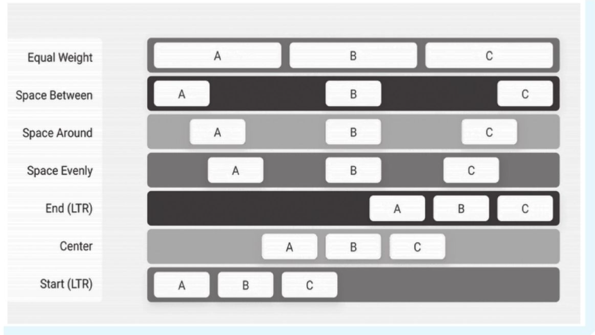
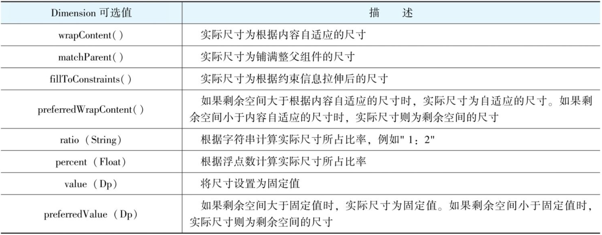
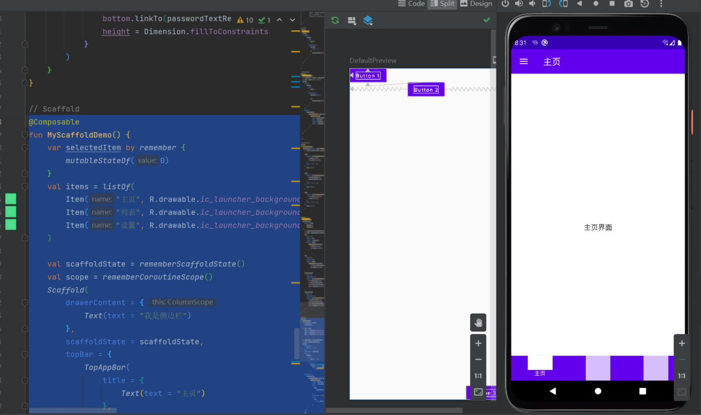

Jetpack Compose 中的 布局

## 1.1 线性布局

线性布局也是Android中最常用的布局方式，对应了传统视图中的LinearLayout,Compose根据orientation的不同又分为Column和Row，因为两者内部子元素在父容器中的布局和对齐方式不同，分成两个组件更有助于提供类型安全的Modifier修饰符。

### 1.1.1 Column

- Column是一个垂直线性布局组件，它能够将子项按照从上到下的顺序垂直排列。

```kotlin
@Composable
inline fun Column(
    modifier: Modifier? = Modifier,
    verticalArrangement: Arrangement.Vertical? = Arrangement.Top,
    horizontalAlignment: Alignment.Horizontal? = Alignment.Start,
    content: (@Composable @ExtensionFunctionType ColumnScope.() -> Unit)?
): Unit
```

- `verticalArrangment` 和 `horizontalAlignment` 参数分别可以帮助我们安排子项的垂直/水平位置，在默认的情况下，子项会以垂直方向上靠上（Arrangment.Top），水平方向上靠左（Alignment.Start）来排布。

- 只有指定了高度或者宽度，才能使用verticalArrangement或horizontalAlignment来定位子项在Column中的位置

```kotlin
@Composable
fun Greeting(name: String) {
    Text(text = "Hello $name!")
}

//Column
@Preview(showBackground = true)
@Composable
fun ColumnView() {
    Column(modifier = Modifier.fillMaxSize()) {
        Greeting("Android")
        Greeting("Android")
    }
}
```

### 1.1.2 Row

- Row组件能够将内部子项按照从左到右的方向水平排列，Row的horizontalArrangement参数帮助我们合理配置了按钮的水平位置。可以看到，喜欢和分享按钮呈左右两端对齐。Arrangment定义了很多子项位置的对齐方式，除了Center（居中）、Start（水平靠左）、End（水平靠右）等常见的对齐方式，还有一些特定场景下可能用到的对齐方式，例如Space Between、Space Evenly等

```kotlin
@Composable
fun CardView() {
    Surface(
        shape = RoundedCornerShape(8.dp),
        modifier = Modifier
            .padding(horizontal = 12.dp) // 设置 Surface 的外边距
            .fillMaxWidth(),
        elevation = 10.dp
    ) {
        Column(
            modifier = Modifier.padding(12.dp) // 里面内容的外边距
        ) {
            Text(
                text = "Jetpack Compose 是什么？",
                style = MaterialTheme.typography.h6
            )
            Spacer(Modifier.padding(vertical = 5.dp))
            Text(
                text = "Jetpack Compose 是用于构建原生 Android 界面的新工具包。它可简化并加快 Android 上的界面开发，使用更少的代码、强大的工具和直观的 Kotlin API，快速让应用生动而精彩。"
            )
            Row(
                modifier = Modifier.fillMaxWidth(),
                horizontalArrangement = Arrangement.SpaceBetween
            ) {
                IconButton(
                    onClick = { /*TODO*/ }
                ) {
                    Icon(Icons.Filled.Favorite, null)
                }
                IconButton(
                    onClick = { /*TODO*/ },
                ) {
                    Icon(painterResource(id = R.drawable.ic_launcher_background), null)
                }
                IconButton(
                    onClick = { /*TODO*/ },
                ) {
                    Icon(Icons.Filled.Share, null)
                }
            }
        }
    }
}
```



### 1.1.3 Box

- Box组件是一个能够将里面的子项依次按照顺序堆叠的布局组件，在使用上类似于传统视图中的FrameLayout。

```kotlin
Box {
    Box(
        modifier = Modifier.size(150.dp).background(Color.Green)
    )
    Box(
        modifier = Modifier.size(80.dp).background(Color.Red)
    )
    Text(
        text = "世界"
    )
}
```

### 1.1.4 Surface

- Surface从字面上来理解，是一个平面，在Material Design设计准则中也同样如此，我们可以将很多的组件摆放在这个平面之上，可以设置这个平面的边框、圆角、颜色等

```kotlin
@Composable
fun MySurfaceView() {
    Surface(
        shape = RoundedCornerShape(8.dp),
        elevation = 10.dp,
        modifier = Modifier
            .width(100.dp)
            .height(100.dp)
            .background(MaterialTheme.colors.primary)
            .padding(10.dp)
    ) {
        Row(
            modifier = Modifier
                .clickable {}
        ) {
            Image(
                painter = painterResource(id = R.drawable.ic_launcher_background),
                contentDescription = "xxx",
                modifier = Modifier.size(100.dp),
                contentScale = ContentScale.Crop
            )
            Spacer(Modifier.padding(horizontal = 12.dp))
            Column(
                modifier = Modifier.fillMaxHeight(),
                verticalArrangement = Arrangement.Center
            ) {
                Text(
                    text = "Liratie",
                    style = MaterialTheme.typography.h6
                )
                Spacer(Modifier.padding(vertical = 8.dp))
                Text(
                    text = "礼谙"
                )
            }
        }
    }
}
```

-  如果我们需要快速设置界面的形状、阴影、边框、颜色等，则用Surface更为合适，它可以减少Modifier的使用量。
- 如果只是需要简单地设置界面的背景颜色、大小，且有时候需要简单安排里面布局的位置，则可以使用Box。

### 1.1.5 Spacer

- `Spacer` 能够提供一个空白的布局，可以使用 `Modifier.width`, `Modifier.height` 和 `Modifier.size` 来填充

```kotlin
@Composable
fun MySpacerView() {
    Column {
        Text(text = "Hello World")
        Spacer(modifier = Modifier.padding(vertical = 10.dp))
        Text(text = "Hello World")
    }
}
```

### 1.1.6 Flow Layout

- Google 正式发布 [Jetpack Compose](https://link.juejin.cn?target=https%3A%2F%2Fd.android.com%2Fcompose) 的 1.4 版本，它是 Android 的现代原生 UI 工具包。此版本包括新功能，如 Pager 和 Flow Layouts，以及文本样式的新方式，例如连字号和换行行为。它还提高了修饰符的性能并修复了许多错误。

- Flow Layout 包括 `FlowRow` 和 `FlowColumn` ，当一行（或一列）放不下里面的内容时，会自动换行。这些流式布局还允许使用权重进行动态调整大小，以将项目分配到容器中。

```kotlin
@Composable
fun MyFlowLayout() {
    val filters = listOf(
        "Washer/Dryer", "Ramp access", "Garden", "Cats OK", "Dogs OK", "Smoke-free"
    )
    FlowRow(
        horizontalArrangement = Arrangement.spacedBy(8.dp)
    ) {
        filters.forEach { title ->
            var selected by remember { mutableStateOf(false) }
            val leadingIcon: @Composable () -> Unit = { Icon(Icons.Default.Check, null) }
            FilterChip(
                selected,
                onClick = { selected = !selected },
                label = { Text(title) },
                leadingIcon = if (selected) leadingIcon else null
            )
        }
    }
}
```

### 1.1.7 TopAppBar

- 风格设计的 `TopAppBar` 组件

```kotlin
fun MyTopAppBar() {
    Scaffold(
        topBar = {
            TopAppBar(
                title = {
                    Text("主页")
                },
                navigationIcon = {
                    IconButton(
                        onClick = { }
                    ) {
                        Icon(Icons.Filled.ArrowBack, null)
                    }
                }
            )
        },
    ) {

    }
}
```

### 1.1.8 BottomNavigation

- `Bottom navigation bars` 允许在一个应用程序的主要目的地之间移动

```kotlin
@Composable
fun MyBottomNavigation() {
    var selectedItem by remember { mutableStateOf(0) }
    val items = listOf("主页", "我喜欢的", "设置")
    Scaffold(
        topBar = {
            TopAppBar(
                title = {
                    Text("主页")
                },
                navigationIcon = {
                    IconButton(onClick = {

                    }) {
                        Icon(Icons.Filled.ArrowBack, null)
                    }
                }
            )
        },
        bottomBar = {
            BottomNavigation {
                items.forEachIndexed { index, item ->
                    BottomNavigationItem(
                        icon = { Icon(Icons.Filled.Favorite, contentDescription = null) },
                        label = { Text(item) },
                        selected = selectedItem == index,
                        onClick = { selectedItem = index }
                    )
                }
            }
        }
    ){

    }
   }
```

### 1.1.9 ConstraintLayout

在传统View系统中，我们在布局XML文件中可以给View设置资源的ID，并将资源ID作为索引来声明对应组件的摆放位置。而在Compose的约束布局中，可以主动创建引用并绑定到某个具体组件上，从而实现与资源ID相似的功能，每个组件都可以利用其他组件的引用获取到其他组件的摆放位置信息，从而确定自己摆放位置。

- 依赖: 

```xml
    implementation('androidx.constraintlayout:constraintlayout-compose:1.0.1')
```

#### 1.1.9.1 创建引用

- 在Compose中有两种创建引用的方式：createRef()和createRefs()。字面意思非常清楚，createRef()每次只会创建一个引用，而createRefs()每次可以创建多个引用（最多16个）。
- 接下来可以使用Modifier.constrainAs()修饰符将前面创建的引用绑定到某个具体组件上。

#### 1.1.9.2 绑定引用

- 当我们创建完引用后就可以使用Modifier.constrainAs()修饰符将我们创建的引用绑定到某个具体组件上，可以在contrainAs尾部Lambda内指定组件的约束信息。
- 我们需要注意的是，我们只能在ConstraintLayout尾部的Lambda中使用createRefer，createRefs函数创建引用，并使用Modifier.constrainAs函数来绑定引用，因为ConstrainScope尾部的Lambda的Reciever是一个ConstraintLayoutScope作用域对象。我们可以先看下面一段代码了解下约束布局的引用绑定：

```kotlin
@Composable
fun MyConstraintLayout() {
    ConstraintLayout(modifier = Modifier.fillMaxSize()) {
        val (button1, button2, button3) = createRefs()

        Button(
            modifier = Modifier.constrainAs(button1) {
                top.linkTo(parent.top)
                start.linkTo(parent.start)
            },
            onClick = { /* 点击事件 */ }
        ) {
            Text("Button 1")
        }

        Button(
            modifier = Modifier.constrainAs(button2) {
                top.linkTo(button1.bottom)
                centerHorizontallyTo(parent)
            },
            onClick = { /* 点击事件 */ }
        ) {
            Text("Button 2")
        }

        Button(
            modifier = Modifier.constrainAs(button3) {
                bottom.linkTo(parent.bottom)
                end.linkTo(parent.end)
            },
            onClick = { /* 点击事件 */ }
        ) {
            Text("Button 3")
        }
    }
}
```

- 也可以在ConstrainScope中为指定组件的宽高信息，在ConstrainScope中直接设置width与height即可，有几个可选值可供使用



#### 1.1.9.3 辅助布局工具

在传统View的约束布局中有Barrier,GuideLine等辅助布局的工具，在Compose中也继承了这些特性，方便我们完成各种复杂场景的布局需求。

- Barrier分界线

Barrier顾名思义就是一个屏障，使用它可以隔离UI布局上面的一些相互挤压的影响，举一个例子，比如我们希望两个输入框左对齐摆放，并且距离文本组件中的最长者仍保持着10dp的间隔，当用户名和密码等发生变化时，输入框的位置能够自适应调整。这里使用Barrier特性可以简单的实现这一需求

```kotlin
@Composable
fun InputFieldLayout(){
    ConstraintLayout(
        modifier = Modifier
            .width(400.dp)
            .padding(10.dp)
    ) {
        val (usernameTextRef, passwordTextRef, usernameInputRef, passWordInputRef) = remember { createRefs() }
        val barrier = createEndBarrier(usernameTextRef, passwordTextRef)
        Text(
            text = "用户名",
            fontSize = 14.sp,
            textAlign = TextAlign.Left,
            modifier = Modifier
                .constrainAs(usernameTextRef) {
                    top.linkTo(parent.top)
                    start.linkTo(parent.start)
                }
        )

        Text(
            text = "密码",
            fontSize = 14.sp,
            modifier = Modifier
                .constrainAs(passwordTextRef) {
                    top.linkTo(usernameTextRef.bottom, 20.dp)
                    start.linkTo(parent.start)
                }
        )
        OutlinedTextField(
            value = "",
            onValueChange = {},
            modifier = Modifier.constrainAs(usernameInputRef) {
                start.linkTo(barrier, 10.dp)
                top.linkTo(usernameTextRef.top)
                bottom.linkTo(usernameTextRef.bottom)
                height = Dimension.fillToConstraints
            }
        )
        OutlinedTextField(
            value = "",
            onValueChange = {},
            modifier = Modifier.constrainAs(passWordInputRef) {
                start.linkTo(barrier, 10.dp)
                top.linkTo(passwordTextRef.top)
                bottom.linkTo(passwordTextRef.bottom)
                height = Dimension.fillToConstraints
            }
        )
    }
}
```

- Barrier分界线需要依赖其他引用，从而确定自身的位置，而使用Guideline不依赖任何引用，例如，我们希望将用户头像摆放在距离屏幕顶部2：8的高度位置，头像以上是用户背景，以下是用户信息，这样的需求就可以使用Guideline实现

```kotlin
@Composable
fun GuidelineDemo(){
   ConstraintLayout(modifier = Modifier
       .height(300.dp)
       .background(color = Color.Gray)) {
       val guideline = createGuidelineFromTop(0.2f)
       val (userPortraitBackgroundRef,userPortraitImgRef,welcomeRef) = remember {
           createRefs()
       }

       Box(modifier = Modifier
           .constrainAs(userPortraitBackgroundRef) {
               top.linkTo(parent.top)
               bottom.linkTo(guideline)
               height = Dimension.fillToConstraints
               width = Dimension.matchParent
           }
           .background(Color(0xFF673AB7)))

       Image(painter = painterResource(id = R.drawable.portrait),
           contentDescription = null,
           modifier = Modifier
               .constrainAs(userPortraitImgRef) {
                   top.linkTo(guideline)
                   bottom.linkTo(guideline)
                   start.linkTo(parent.start)
                   end.linkTo(parent.end)
               }
               .size(100.dp)
               .clip(CircleShape)
               .border(width = 2.dp, color = Color(0xFF96659E), shape = CircleShape))

       Text(text = "不喝奶茶的小白兔",
       color = Color.White,
       fontSize = 26.sp,
       modifier = Modifier.constrainAs(welcomeRef){
           top.linkTo(userPortraitImgRef.bottom,10.dp)
           start.linkTo(parent.start)
           end.linkTo(parent.end)
       })

   }
}
```

- ContraintLayout的另一个好用的特性就是Chain链接约束，通过链接约束可以允许多个组件平均分配布局空间，类似于weight修饰符。
- Compose提供了三种Chain Style，• Spread：链条中每个元素平分整个parent空间。• SpreadInside：链条中首尾元素紧贴边界，剩下每个元素评分整个parent空间。• Packed：链条中所有元素聚集到中间。

```kotlin
@Composable
fun showQuotesDemo() {
    ConstraintLayout(
        modifier = Modifier
            .size(400.dp)
            .background(Color.Black)
    ) {
        val (quotesFirstLineRef, quotesSecondLineRef, quotesThirdLineRef, quotesForthLineRef) = remember {
            createRefs()
        }

        createVerticalChain(
            quotesFirstLineRef, quotesSecondLineRef, quotesThirdLineRef, quotesForthLineRef,
            chainStyle = ChainStyle.Spread
        )

        Text(text = "窗前明月光，",
            color = Color.White,
            fontSize = 20.sp,
            fontWeight = FontWeight.Bold,
            modifier = Modifier.constrainAs(quotesFirstLineRef) {
                start.linkTo(parent.start)
                end.linkTo(parent.end)
            })

        Text(text = "疑是地上霜。",
            color = Color.White,
            fontSize = 20.sp,
            fontWeight = FontWeight.Bold,
            modifier = Modifier.constrainAs(quotesSecondLineRef) {
                start.linkTo(parent.start)
                end.linkTo(parent.end)
            })

        Text(text = "举头望明月，",
            color = Color.White,
            fontSize = 20.sp,
            fontWeight = FontWeight.Bold,
            modifier = Modifier.constrainAs(quotesThirdLineRef) {
                start.linkTo(parent.start)
                end.linkTo(parent.end)
            })

        Text(text = "低头思故乡。",
            color = Color.White,
            fontSize = 20.sp,
            fontWeight = FontWeight.Bold,
            modifier = Modifier.constrainAs(quotesForthLineRef) {
                start.linkTo(parent.start)
                end.linkTo(parent.end)
            })
    }
}
```

### 1.1.10  Scaffold脚手架

- Scaffold组件实现了Material Design的布局结构，通过配合其他Material组件可以轻松地构建Material Design风格的界面。
- Scaffold会自动处理好各自的位置BottomNavigation组件创造了底部导航栏的总体布局，比如高度等，这些都是按照Material Design风格设计的，如果要修改整体的颜色，可以在BottomNavigation的其他参数上修改。
- BottomNavigationItem组件则创建了具体的导航图标及标签，在BottomNavigationItem组件中可以设置一些其他参数，例如选中或者是未选中时图标的颜色。在上述例子中，我们设置了alwaysShowLabel = false。即只有是选中当前页面时，才会展示标签的文字。
- 在上面的例子中我们还添加了一个侧边栏，通过Scaffold添加侧边栏非常简单，Scaffold有一个drawerContent参数，只需要传入一个自定义的Composable的content即可。侧边栏做好了后，我们还需要处理下按键事件，因为如果我们不做处理的情况下，按下系统的返回键，应用会直接退出，而此时我们希望是关闭侧边栏。所以Compose提供了用于拦截系统返回键的组件BackHandler。此外，我们通过ScaffoldState可以监听侧边栏是否打开。
- 具体的逻辑为：我们通过rememberScaffoldState()获取到包含侧边栏状态的ScaffoldState,当侧边栏被打开时，scaffoldState.drawerState.isOpen被更新为true,此时，BackHandler开始监听系统返回键事件，返回键事件被按下时会通过scaffoldState来关闭侧边栏。

```kotlin
@Composable
fun MyScaffoldDemo() {
    var selectedItem by remember {
        mutableStateOf(0)
    }
    val items = listOf(
        Item("主页", R.drawable.ic_launcher_background),
        Item("列表", R.drawable.ic_launcher_background),
        Item("设置", R.drawable.ic_launcher_background)
    )

    val scaffoldState = rememberScaffoldState()
    val scope = rememberCoroutineScope()
    Scaffold(
        drawerContent = {
            Text(text = "我是侧边栏")
        },
        scaffoldState = scaffoldState,
        topBar = {
            TopAppBar(
                title = {
                    Text(text = "主页")
                },
                navigationIcon = {
                    IconButton(onClick = { /*TODO*/ }) {
                        Icon(imageVector = Icons.Filled.Menu,
                            contentDescription = null);
                    }
                })
        }, bottomBar = {
            BottomNavigation {
                items.forEachIndexed { index, item ->
                    BottomNavigationItem(
                        selected = selectedItem == index,
                        onClick = { selectedItem = index },
                        icon = {
                            Icon(
                                painterResource(id = item.icon), null
                            )
                        },
                        alwaysShowLabel = false,
                        label = {
                            Text(
                                text = item.name
                            )
                        })
                }
            }
        }) {
        Box(
            modifier = Modifier.fillMaxSize(),
            contentAlignment = Alignment.Center
        ) {
            Text(text = "主页界面")
        }
        BackHandler(enabled = scaffoldState.drawerState.isOpen) {
            scope.launch {
                scaffoldState.drawerState.close()
            }
        }
    }

}


data class Item(
    val name: String,
    val icon: Int
)
```



### 1.1.11 列表

- 很多产品中都有展示一组数据的需求场景，如果数据数量是可以枚举的，则仅需通过Column组件来枚举列出
- 在Android的传统View中，当我们需要展示大量的数据时，一般都会使用ListView或者是更高级的RecyclerView。
- 在Compose中我们可以通过Column来实现这一需求，并且还可以让列表实现滚动，懒加载，快速定位到具体位置等功能。非常灵活，下文就是使用Column来实现列表的内容

