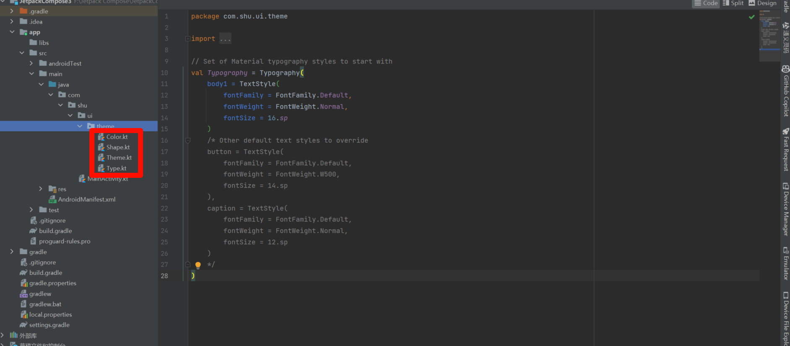
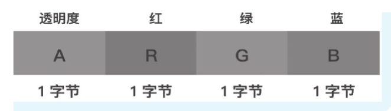
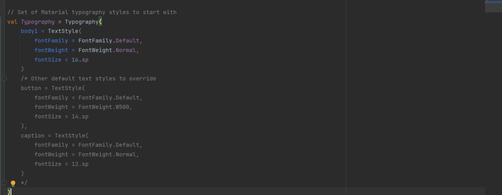
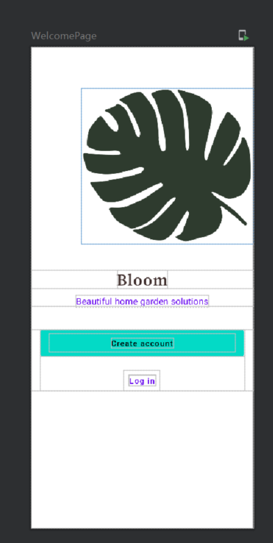

# 一 定制UI视图开发

## 1.1 资源目录

- 在使用Compose开发这三个UI页面之前，需要先对设计图稿中会用到的颜色、字体与形状等信息进行统一的配置，这样后续开发时就可以直接依赖这些配置信息了。
- 当创建一个新项目时，Compose会在项目中生成`ui/theme`目录，其中包含了如下四个文件
- `Color.kt`：颜色配置。
- `Shape:kt`：形状配置。
- `Theme.kt`：主题配置。
- `Type.kt`：字体配置。



## 1.2 最佳实践

- 在项目中使用的颜色、字体、形状、样式等资源应该使用`Color.kt、Shape.kt、Theme.kt、Type.kt`进行集中管理，无须额外定义XML。
- 官方建议我们把颜色、字体、形状等配置信息存放在这四个文件中，并以全局变量的形式提供。当然这不是强制的，但是当项目越来越庞大时，随意存放这些颜色信息，维护时可能会比较头疼，所以不妨统一存放统一管理。

> 颜色：https://www.zhongguose.com/#luanshizi



> 字体：https://www.zitijia.com/

- 可以看到这里需要用到`Nunito Sans`字体家族，可以在网上下载到这个字体家族中所用到的`ttf`字体文件，并将其放入`res/font`目录下。如果项目中没有`font`目录，可以自己新建一个。接下来需要先在`Type.kt`中声明这个字体家族。



> 形状：

- 同样可以根据设计图稿，在Shape.kt中配置形状信息，设计图稿对于形状的要求

# 二 实践开发

## 2.1 欢迎页面

### 2.1.1 基本配置

- 颜色配置： `Color.kt`，配置的颜色信息是一个四字节的Int整形数字，每个字节保存着ARGB对应的信息。例如Pink-100对应的值是0xFFF1F1,这里表示的只是低位RGB三种颜色对应的信息，如果希望添加透明度，那么就在最高位添加一个字节表示透明度，比如希望透明度是100%，那么就添加一个0xFF,最终的颜色值是0xFFFFF1F1 。0xFF对应的十进制是255，表示100%的透明度，如果要表示85%的透明度，则255x85%对应的16进制是0xD8,所以0xFFFFF1F1对应的透明度为85%的颜色值为0xD8FFF1F1。

```kotlin
val white = Color(0xFFFFFFFF)
val white150 = Color(0x26FFFFFF)
val white850 = Color(0xD9FFFFFF)
val pink100 = Color(0xFFFFF1F1)
val pink900 = Color(0xFF3F2C2C)
val green300 = Color(0xFFB8C9B8)
val green900 = Color(0xFF2D3B2D)
```

- 形状配置：`Shape.kt`,如今的主流APP中我们都可以看到很多的UI控件都使用了圆角，圆角的大小在传统的View开发时通常都是在drawable中新建一个xml定义按钮的圆角样式，这样很不方便，因为如果我们只是想改变圆角的大小时，就需要我们再定义一个xml样式，但是使用Shape.kt后就不存在这个问题，因为圆角大小的配置放到了一个统一的地方。使用的时候直接引用就行了

```kotlin
val Shapes = Shapes(
    small = RoundedCornerShape(4.dp),
    medium = RoundedCornerShape(4.dp),
    large = RoundedCornerShape(0.dp)
)
```

- 字体配置：`Type.kt`，我们想用的字体可以在Type.kt中配置，如果要引入新字体，可以将下载下来的字体文件放到res/font目录下，如果没有这个目录可以自己建一个，然后使用如下的方式引入字体

```kotlin
val Typography = Typography(
    body1 = TextStyle(
        fontFamily = FontFamily.Default,
        fontWeight = FontWeight.Normal,
        fontSize = 16.sp
    )
)

val nunitoSansFamily = FontFamily(
    Font(R.font.nunitosans_light, FontWeight.Light),
    Font(R.font.nunitosans_semibold, FontWeight.SemiBold),
    Font(R.font.nunitosans_bold, FontWeight.Bold)
)

val bloomTypoGraphy = Typography(
    h1 = TextStyle(
        fontSize = 18.sp,
        fontFamily = nunitoSansFamily,
        fontWeight = FontWeight.Bold
    ),
    h2 = TextStyle(
        fontSize = 14.sp,
        letterSpacing = 0.15.sp,
        fontFamily = nunitoSansFamily,
        fontWeight = FontWeight.Bold
    ),
    subtitle1 = TextStyle(
        fontSize = 16.sp,
        fontFamily = nunitoSansFamily,
        fontWeight = FontWeight.Light
    ),
    body1 = TextStyle(
        fontSize = 14.sp,
        fontFamily = nunitoSansFamily,
        fontWeight = FontWeight.Light
    ),
    body2 = TextStyle(
        fontSize = 12.sp,
        fontFamily = nunitoSansFamily,
        fontWeight = FontWeight.Light
    ),
    button = TextStyle(
        fontSize = 14.sp,
        letterSpacing = 1.sp,
        fontFamily = nunitoSansFamily,
        fontWeight = FontWeight.SemiBold,
        color = white
    ),
    caption = TextStyle(
        fontSize = 12.sp,
        fontFamily = nunitoSansFamily,
        fontWeight = FontWeight.SemiBold
    )
)
```

- 主题配置，

```kotlin

private val BloomDarkColorPalette = darkColors(
    primary = white,
    secondary = green300,
    background = green900,
    surface = white150,
    onPrimary =  white850,
    onSecondary = green900,
    onBackground = pink900,
    onSurface = white850,
)

private val BloomLightColorPalette = lightColors(
    primary = pink900,
    secondary = pink900,
    background = pink100,
    surface = white850,
    onPrimary = pink100,
    onSecondary = pink100,
    onBackground = pink900,
    onSurface = white150
)

open class WelcomePageAssets(var background:Int,var illos:Int,var logo:Int)

//亮色主题资源
object LightWelcomeAssets : WelcomePageAssets(
    background = R.drawable.ic_light_welcome_bg,
    illos = R.drawable.ic_light_welcome_illos,
    logo = R.drawable.ic_light_logo
)

// 暗色主提资源

object DarkWelcomeAssets : WelcomePageAssets(
    background = R.drawable.ic_dark_welcome_bg,
    illos = R.drawable.ic_dark_welcome_illos,
    logo = R.drawable.ic_dark_logo
)

internal var LocalWelcomeAssets = staticCompositionLocalOf { LightWelcomeAssets as WelcomePageAssets }

val welcomeAssets
    @Composable
    @ReadOnlyComposable
    get() = LocalWelcomeAssets.current

enum class BloomTheme{
    LIGHT,DARK
}

@Composable
fun JetpackCompose3Theme(theme:BloomTheme = BloomTheme.LIGHT,content:@Composable ()->Unit){
    val welcomeAssets = if(theme == BloomTheme.DARK) DarkWelcomeAssets else LightWelcomeAssets
    CompositionLocalProvider(
        LocalWelcomeAssets provides welcomeAssets
    ) {
        MaterialTheme(colors = if (theme == BloomTheme.DARK)
            BloomDarkColorPalette else BloomLightColorPalette,
            typography = bloomTypoGraphy,
            shapes = shapes,
            content = content,
        )
    }
}
```

### 2.1.2 沉浸式任务栏

- 所谓沉浸式主题栏适配就是指手机状态栏的颜色和我们的应用背景色相同，看起来感觉状态栏和我们的页面就像是一体的一样，有的做法是给标题栏设置一个透明的颜色，而本项目中使用的办法是将标题栏的颜色设置成和页面的背景色相同就可以了。设置标题栏的颜色需要用到一个库
- 注意Kotlin版本：https://oss.sonatype.org/content/repositories/snapshots/com/google/accompanist/accompanist-systemuicontroller/

```xml
implementation "com.google.accompanist:accompanist-systemuicontroller:0.31.0-alpha"
 // 系统UI控制库，实现沉浸式状态栏
implementation("com.google.accompanist:accompanist-systemuicontroller:0.24.0-alpha")
```

```kotlin
@Composable
fun TransparentSystemBars(color: Color) {
    val systemUiController = rememberSystemUiController()
    val useDarkIcons = !isSystemInDarkTheme()
    SideEffect {
        systemUiController.setSystemBarsColor(
            color = color,
            darkIcons = useDarkIcons,
            isNavigationBarContrastEnforced = false,
        )
    }
}
```

```kotlin
class MainActivity : ComponentActivity() {
    private lateinit var theme: BloomTheme
    override fun onCreate(savedInstanceState: Bundle?) {
        super.onCreate(savedInstanceState)
        actionBar?.apply { hide() }
        setContent {
            theme = if(isSystemInDarkTheme()){
                BloomTheme.DARK
            }else {
                BloomTheme.LIGHT
            }
            JetpackCompose3Theme(theme) {
                val color = MaterialTheme.colors.background
                TransparentSystemBars(color)
                // 展示界面，例如本项目中展示欢迎页：WelcomePage()

            }
        }
    }
}
```

- 在 Jetpack Compose 中，`SideEffect` 是一个 Compose API，用于在组合过程中执行副作用。`SideEffect` 是一种用于执行非持久性操作的机制，例如记录日志、触发一次性的操作、通知 ViewModel 状态变化等。

  ### 使用场景

  1. **日志记录**：记录某些状态变化或 UI 事件。
  2. **触发外部操作**：例如，触发网络请求、数据库操作等。
  3. **通知 ViewModel**：将 Compose 状态的变化通知给 ViewModel 或其他逻辑层。

  

### 2.1.3 页面

```kotlin
package com.shu


import android.os.Bundle
import androidx.activity.ComponentActivity
import androidx.activity.compose.setContent
import androidx.compose.foundation.Image
import androidx.compose.foundation.background
import androidx.compose.foundation.isSystemInDarkTheme
import androidx.compose.foundation.layout.*
import androidx.compose.material.*
import androidx.compose.runtime.Composable
import androidx.compose.runtime.SideEffect
import androidx.compose.ui.Alignment
import androidx.compose.ui.Modifier
import androidx.compose.ui.draw.clip
import androidx.compose.ui.graphics.Color
import androidx.compose.ui.graphics.vector.ImageVector
import androidx.compose.ui.graphics.vector.rememberVectorPainter
import androidx.compose.ui.res.vectorResource
import androidx.compose.ui.text.style.TextAlign
import androidx.compose.ui.tooling.preview.Preview
import androidx.compose.ui.unit.dp
import com.google.accompanist.systemuicontroller.rememberSystemUiController
import com.shu.ui.theme.BloomTheme
import com.shu.ui.theme.JetpackCompose3Theme
import com.shu.ui.theme.welcomeAssets


class MainActivity : ComponentActivity() {
    private lateinit var theme: BloomTheme
    override fun onCreate(savedInstanceState: Bundle?) {
        super.onCreate(savedInstanceState)
        actionBar?.apply { hide() }
        setContent {
            theme = if(isSystemInDarkTheme()){
                BloomTheme.DARK
            }else {
                BloomTheme.LIGHT
            }
            JetpackCompose3Theme(theme) {
                val color = MaterialTheme.colors.background
                TransparentSystemBars(color)
                // 展示界面，例如本项目中展示欢迎页：WelcomePage()
                WelcomePage()

            }
        }
    }
}


@Composable
@Preview
fun WelcomePage(){
    Box(modifier = Modifier
        .fillMaxSize()
        .background(MaterialTheme.colors.background)
    ){
        Image(
            painter = rememberVectorPainter(
                image = ImageVector.vectorResource(id = welcomeAssets.background)
            ),
            contentDescription = "welcome page",
            modifier = Modifier.fillMaxSize()
        )
        WelcomeContent()
    }
}


@Composable
fun WelcomeContent(){
    Column(modifier = Modifier.fillMaxSize()) {
        Spacer(modifier = Modifier.height(72.dp))
        LeafImage()
        Spacer(modifier = Modifier.height(48.dp))
        WelcomeTitle()
        Spacer(modifier = Modifier.height(40.dp))
        WelcomeButtons()
    }
}


@Composable
fun LeafImage(){
    Image(painter = rememberVectorPainter(
        image = ImageVector.vectorResource(id = welcomeAssets.illos)
    ),
        contentDescription = "welcome leaf image",
        modifier = Modifier
            .wrapContentSize()
            .padding(start = 88.dp))
}

@Composable
fun WelcomeTitle(){
    Column(horizontalAlignment = Alignment.CenterHorizontally,
        modifier = Modifier.fillMaxWidth()) {
        Image(painter = rememberVectorPainter(
            image = ImageVector.vectorResource(id = welcomeAssets.logo)),
            contentDescription = "welcome logo",
            modifier = Modifier
                .wrapContentSize()
                .height(32.dp))

        Box(modifier = Modifier
            .fillMaxWidth()
            .height(32.dp),
            contentAlignment = Alignment.BottomCenter){
            Text(text = "Beautiful home garden solutions",
                textAlign = TextAlign.Center,
                style = MaterialTheme.typography.subtitle1,
                color = MaterialTheme.colors.primary)
        }
    }
}

@Composable
fun WelcomeButtons(){
    Column(horizontalAlignment = Alignment.CenterHorizontally,
        modifier = Modifier.fillMaxWidth()) {
        Button(onClick = { /*TODO*/ },
            modifier = Modifier
                .height(48.dp)
                .padding(horizontal = 16.dp)
                .fillMaxWidth()
                .clip(MaterialTheme.shapes.medium),
            colors = ButtonDefaults.buttonColors(backgroundColor = MaterialTheme.colors.secondary)
        ) {
            Text(
                text = "Create account",
                style = MaterialTheme.typography.button,
                color = MaterialTheme.colors.onSecondary
            )
        }

        Spacer(modifier = Modifier.height(24.dp))
        TextButton(onClick = { /*TODO*/ }) {
            Text(
                text = "Log in",
                style = MaterialTheme.typography.button,
                color = MaterialTheme.colors.primary            )
        }
    }
}


@Composable
fun TransparentSystemBars(color: Color) {
    val systemUiController = rememberSystemUiController()
    val useDarkIcons = !isSystemInDarkTheme()
    SideEffect {
        systemUiController.setSystemBarsColor(
            color = color,
            darkIcons = useDarkIcons,
            isNavigationBarContrastEnforced = false,
        )
    }
}

```



## 2.2 登录页面

### 2.2.1 拆分

> 当我们要编写一个界面时，首先要做的就是做页面的拆分，将页面拆分成一个个的小组件,然后分别编码去实现这些小组件，有些组件例如底部的导航栏啥的分离出来还可以重复使用，所以能做到合理的拆分页面也是很重要的。

```kotlin
@Composable
@Preview
fun loginView(){
    Column(
        modifier =
        Modifier
            .fillMaxSize()
            .background(MaterialTheme.colors.background)
            .padding(horizontal = 16.dp)
    ) {
        LoginTitle()
        LoginInputBox()
        LoginHintWithUnderLine();
        LoginButton()
    }
}


@Composable
fun LoginTitle() {
    Text(
        text = "Log in with email",
        modifier = Modifier
            .fillMaxWidth()
            .paddingFromBaseline(
                top = 184.dp,
                bottom = 16.dp
            ),
        style = MaterialTheme.typography.h1,
        color = MaterialTheme.colors.primary,
        textAlign = TextAlign.Center
    )
}


@Composable
fun LoginInputBox() {
    Column {
        LoginTextField(placeHolder = "Email address")
        Spacer(modifier = Modifier.height(8.dp))
        LoginTextField(placeHolder = "Password(8+ Characters)")
    }
}


@Composable
fun LoginTextField(placeHolder: String) {
    OutlinedTextField(value = "", onValueChange = {},
        modifier = Modifier
            .fillMaxWidth()
            .height(56.dp)
            .clip(MaterialTheme.shapes.small)
            .border(1.dp, MaterialTheme.colors.primary),
        placeholder = {
            Text(
                text = placeHolder,
                style = MaterialTheme.typography.body1,
                color = MaterialTheme.colors.primary
            )
        }
    )
}


@Composable
fun LoginHintWithUnderLine() {
    Column(modifier = Modifier.paddingFromBaseline(top = 24.dp, bottom = 16.dp)) {
        TopText()
        BottomText()
    }
}


@Composable
fun TopText() {
    Row(
        modifier = Modifier.fillMaxWidth(),
        horizontalArrangement = Arrangement.SpaceBetween //设置两端对齐
    ) {
        val keyWorldPre = "By Clicking below you agree to our".split(" ")
        val keyWorldPost = "and consent".split(" ")

        for (word in keyWorldPre) {
            Text(
                text = word,
                style = MaterialTheme.typography.body2,
                color = MaterialTheme.colors.primary
            )
        }

        Text(
            text = "Terms of Use",
            style = MaterialTheme.typography.body2,
            color = MaterialTheme.colors.primary,
            textDecoration = TextDecoration.Underline
        )

        for (word in keyWorldPost) {
            Text(
                text = word,
                style = MaterialTheme.typography.body2,
                color = MaterialTheme.colors.primary
            )
        }
    }
}


@Composable
fun BottomText() {
    Row(
        modifier = Modifier.fillMaxWidth(),
        horizontalArrangement = Arrangement.Center
    ) {
        Text(
            text = " to Our",
            style = MaterialTheme.typography.body2,
            color = MaterialTheme.colors.primary
        )

        Text(
            text = "Privacy policy.",
            style = MaterialTheme.typography.body2,
            color = MaterialTheme.colors.primary
        )
    }
}

@Composable
fun LoginButton(){
    Button(onClick = { /*TODO*/ },
        modifier = Modifier
            .height(48.dp)
            .fillMaxWidth()
            .clip(MaterialTheme.shapes.medium),
        colors = ButtonDefaults.buttonColors(MaterialTheme.colors.onBackground)) {
        Text(text = "Log in", style = MaterialTheme.typography.button, color = MaterialTheme.colors.onPrimary)
    }
}
```

## 2.3 主页

```kotlin
package com.shu

import android.os.Bundle
import androidx.activity.ComponentActivity
import androidx.activity.compose.setContent
import androidx.compose.foundation.Image
import androidx.compose.foundation.background
import androidx.compose.foundation.isSystemInDarkTheme
import androidx.compose.foundation.layout.*
import androidx.compose.foundation.lazy.LazyColumn
import androidx.compose.foundation.lazy.LazyRow
import androidx.compose.foundation.shape.RoundedCornerShape
import androidx.compose.material.*
import androidx.compose.runtime.Composable
import androidx.compose.ui.Modifier
import androidx.compose.ui.draw.clip
import androidx.compose.ui.graphics.Color
import androidx.compose.ui.graphics.vector.ImageVector
import androidx.compose.ui.graphics.vector.rememberVectorPainter
import androidx.compose.ui.layout.ContentScale
import androidx.compose.ui.res.painterResource
import androidx.compose.ui.res.vectorResource
import androidx.compose.ui.tooling.preview.Preview
import androidx.compose.ui.unit.dp
import com.shu.data.ImageItem
import com.shu.data.bloomBannerList
import com.shu.data.bloomInfoList
import com.shu.data.navList
import com.shu.ui.theme.BloomTheme
import com.shu.ui.theme.JetpackCompose3Theme

/**
 *@description
 *@author shu
 *@create 2024/6/25 14:59
 */
class HomeActivity : ComponentActivity() {
    private lateinit var theme: BloomTheme
    override fun onCreate(savedInstanceState: Bundle?) {
        super.onCreate(savedInstanceState)
        actionBar?.apply { hide() }
        setContent {
            theme = if (isSystemInDarkTheme()) {
                BloomTheme.DARK
            } else {
                BloomTheme.LIGHT
            }
            JetpackCompose3Theme(theme) {
                val color = MaterialTheme.colors.background
                TransparentSystemBars(color)
                HomePage()

            }
        }
    }
}


@Composable
@Preview
fun HomePage() {
    Scaffold(bottomBar = { BottomBar()  }) {
        Column(
            Modifier
                .fillMaxSize()
                .background(MaterialTheme.colors.background)
                .padding(horizontal = 16.dp)
        ) {
            SearchBar() // 搜索栏
            BloomRowBanner() // banner 列表
            BloomInfoList() // 中间信息展示列表
        }
    }
}


@Composable
fun BottomBar() {
    BottomNavigation(
        elevation = 16.dp,
        modifier = Modifier
            .fillMaxWidth()
            .height(56.dp),
        backgroundColor = MaterialTheme.colors.secondary
    ) {
        navList.forEach {
            BottomNavigationItem(
                onClick = { /*TODO*/ },
                icon = {
                    Icon(
                        painterResource(id = it.resID),
                        contentDescription = null,
                        modifier = Modifier.size(24.dp)
                    )
                },
                label = {
                    Text(
                        text = it.name,
                        style = MaterialTheme.typography.caption,
                        color = MaterialTheme.colors.onPrimary
                    )
                }, selected = ("Home" == it.name)
            )
        }
    }
}


@Composable
fun SearchBar() {
    Box {
        TextField(
            value = "",
            onValueChange = {},
            modifier = Modifier
                .fillMaxWidth()
                .height(56.dp)
                .clip(RoundedCornerShape(4.dp)),
            leadingIcon = {
                Icon(
                    painter = rememberVectorPainter(
                        image = ImageVector.vectorResource(R.drawable.ic_search),
                    ),
                    contentDescription = "search",
                    modifier = Modifier.size(18.dp),
                    tint = Color.Gray
                )
            },
            placeholder = {
                Text(
                    text = "Search",
                    style = MaterialTheme.typography.body1,
                    color = Color.Gray
                )
            },
            colors = TextFieldDefaults.outlinedTextFieldColors(
                backgroundColor = Color.White,
                unfocusedBorderColor = Color.White,// 未选中时的下边框颜色
                focusedBorderColor = Color.White // 选中时下边框颜色
            )
        )
    }
}


@Composable
fun PlantCard(plant: ImageItem) {
    Card(
        modifier = Modifier
            .size(136.dp)
            .clip(RoundedCornerShape(4.dp))
    ) {
        Column {
            Image(
                painterResource(
                    id = plant.resID
                ),
                contentScale = ContentScale.Crop,
                contentDescription = "image",
                modifier = Modifier
                    .fillMaxWidth()
                    .height(96.dp)
            )
            Box(
                modifier = Modifier
                    .fillMaxWidth()
                    .padding(start = 16.dp)
            ) {
                Text(
                    text = plant.name,
                    style = MaterialTheme.typography.h2,
                    color = MaterialTheme.colors.primary,
                    modifier = Modifier
                        .fillMaxWidth()
                        .paddingFromBaseline(top = 24.dp, bottom = 16.dp)
                )
            }
        }
    }
}


@Composable
fun BloomRowBanner() {
    Column {
        Box(modifier = Modifier.fillMaxWidth()) {
            Text(
                text = "Browse themes",
                style = MaterialTheme.typography.h1,
                color = MaterialTheme.colors.primary,
                modifier = Modifier
                    .fillMaxWidth()
                    .paddingFromBaseline(top = 32.dp)
            )
        }

        Spacer(modifier = Modifier.height(16.dp))
        LazyRow(modifier = Modifier.height(136.dp)) {
            items(bloomBannerList.size) {
                if (it != 0) {
                    // 每个子元素之间水平间距为8.dp
                    Spacer(modifier = Modifier.width(8.dp))
                }

                PlantCard(plant = bloomBannerList[it])
            }
        }
    }
}


@Composable
fun DesignCard(plant: ImageItem) {
    Row(modifier = Modifier.fillMaxWidth()) {
        Image(
            painterResource(id = plant.resID),
            contentDescription = null,
            contentScale = ContentScale.Crop,
            modifier = Modifier
                .size(64.dp)
                .clip(RoundedCornerShape(4.dp))
        )

        Spacer(modifier = Modifier.width(16.dp))
        Column {
            Row(
                modifier = Modifier.fillMaxWidth(),
                horizontalArrangement = Arrangement.SpaceBetween
            )
            {
                Column {
                    Text(
                        text = plant.name,
                        style = MaterialTheme.typography.h2,
                        color = MaterialTheme.colors.primary,
                        modifier = Modifier.paddingFromBaseline(top = 24.dp)
                    )

                    Text(
                        text = "这是描述。。。。。。。",
                        style = MaterialTheme.typography.body1,
                        color = MaterialTheme.colors.primary,
                    )
                }

                Checkbox(
                    checked = false, onCheckedChange = {},
                    modifier = Modifier
                        .padding(top = 24.dp)
                        .size(24.dp),
                    colors = CheckboxDefaults.colors(checkmarkColor = Color.White)
                )

            }

            // 每个子元素下面画一根线
            Divider(
                color = Color.Gray,
                modifier = Modifier.padding(top = 16.dp),
                thickness = 0.5.dp
            )
        }
    }
}


@Composable
fun BloomInfoList() {
    Column {
        Row(
            modifier = Modifier.fillMaxWidth(),
            horizontalArrangement = Arrangement.SpaceBetween
        ) {
            Text(
                text = "Design your home garden",
                style = MaterialTheme.typography.h1,
                color = MaterialTheme.colors.primary,
                modifier = Modifier.paddingFromBaseline(top = 40.dp)
            )
            Icon(
                painterResource(id = R.drawable.ic_filter_list),
                contentDescription = "filter",
                modifier = Modifier
                    .padding(top = 24.dp)
                    .size(24.dp)
            )
        }

        Spacer(modifier = Modifier.height(16.dp))

        LazyColumn(
            modifier = Modifier.fillMaxWidth(),
            contentPadding = PaddingValues(bottom = 56.dp)
        ) {
            items(bloomInfoList.size) {
                if (it != 0) {
                    Spacer(modifier = Modifier.height(8.dp))
                }

                DesignCard(plant = bloomInfoList[it])
            }
        }
    }
}
```

