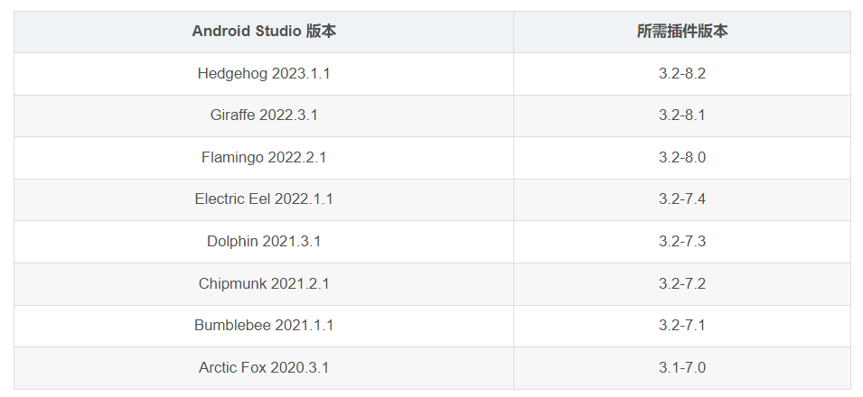
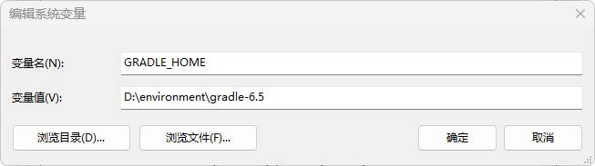
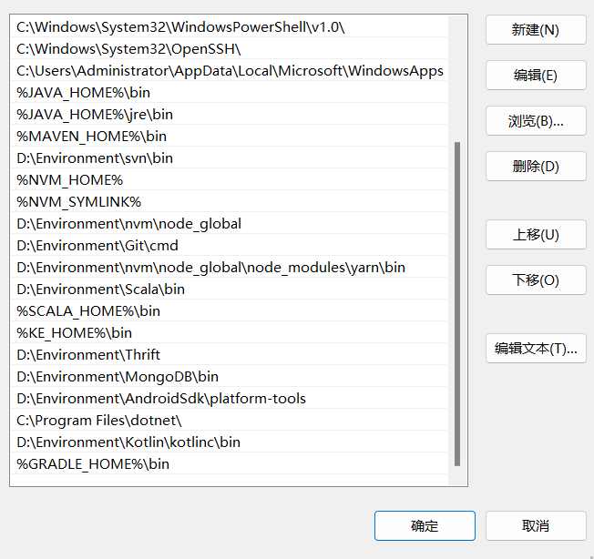
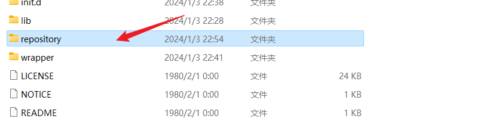
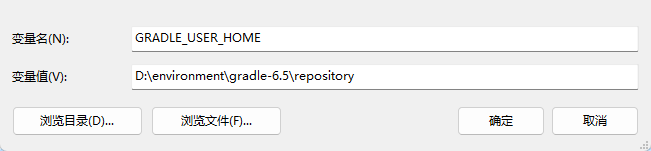
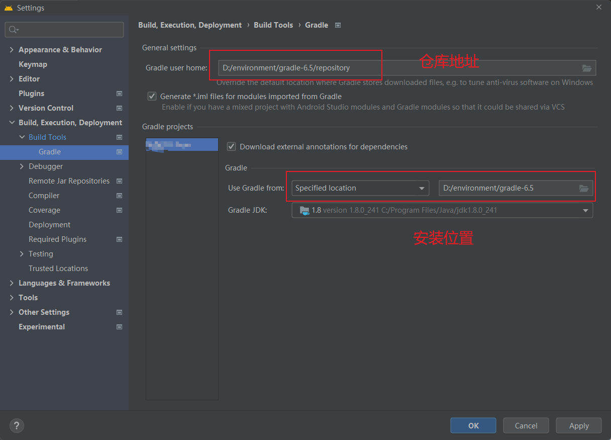

## 1.1 AndroidStudio 与Gradle 对应关系

下表列出了各个 Android Gradle 插件版本所需的 Gradle 版本：


| 插件版本 | 所需的最低 Gradle 版本 |
| -------- | ---------------------- |
| 8.2      | 8.1                    |
| 8.0      | 8.0                    |
| 7.4      | 7.5                    |
| 7.3      | 7.4                    |
| 7.2      | 7.3.3                  |
| 7.1      | 7.2                    |
| 7.0      | 7.0                    |
| 4.2.0+   | 6.7.1                  |

## 1.2 Android Gradle 插件和 Android Studio 兼容性

下表列出了各个 Android Studio 版本所需的 Android Gradle 插件版本。



## 1.3 Gradle 的安装与配置

### 1.3.1 安装

- 下载地址：https://gradle.org/releases/
- 解压到指定位置


- 配置环境变量

GRADLE_HOME： 位置



Path: 环境变量



- 配置仓库地址

先建一个仓库存储地址： [repository](D:\environment\gradle-6.5\repository)



- 配置环境变量仓库地址

GRADLE_USER_HOME：位置



- 配置国内镜像加速服务

[init.d](D:\environment\gradle-6.5\init.d) 目录下新建 [init.gradle](D:\environment\gradle-6.5\init.d\init.gradle) 文件

```
allprojects {
    repositories {
        maven { name "Alibaba" ; url "https://maven.aliyun.com/repository/public" }
        maven { name "google" ; url 'https://maven.aliyun.com/repository/google' }
        mavenCentral()
    }

    buildscript { 
        repositories { 
            maven { name "Alibaba" ; url 'https://maven.aliyun.com/repository/public' }
            maven { name "gradle-plugin" ; url 'https://maven.aliyun.com/repository/gradle-plugin' }
            maven { name "spring-plugin" ; url 'https://maven.aliyun.com/repository/spring-plugin' }
            maven { name "M2" ; url 'https://plugins.gradle.org/m2/' }
        }
    }
}
```

### 1.3.2 Android 配置


