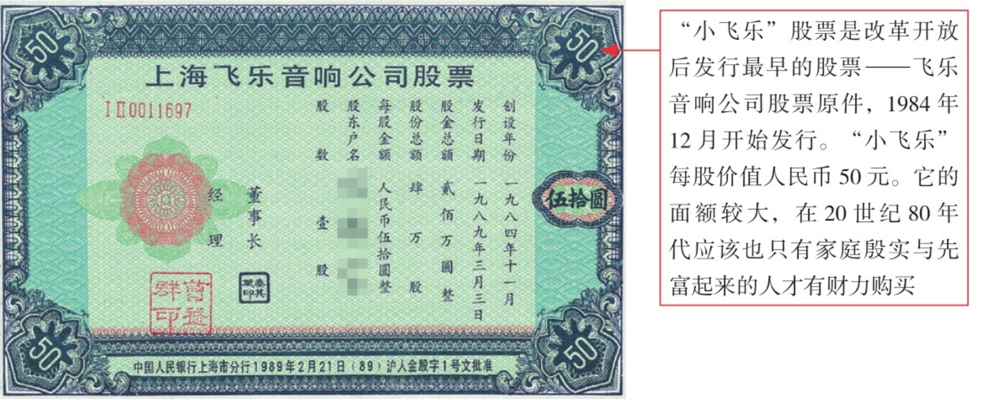
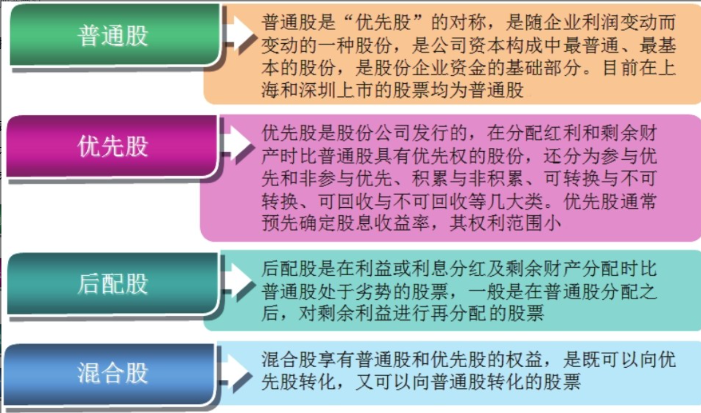
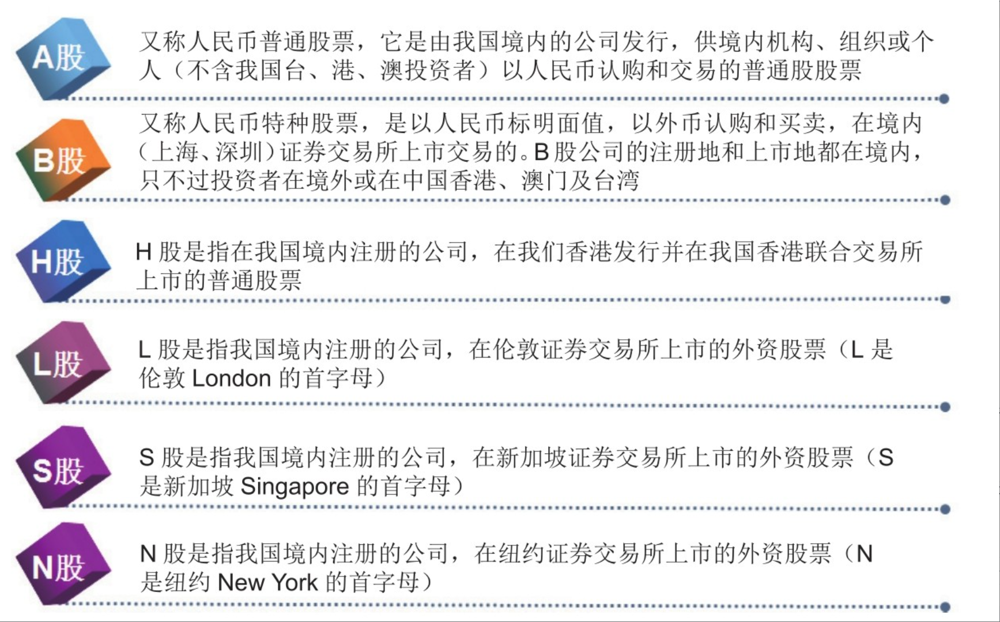
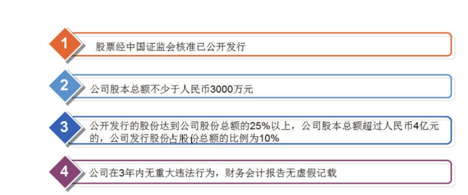
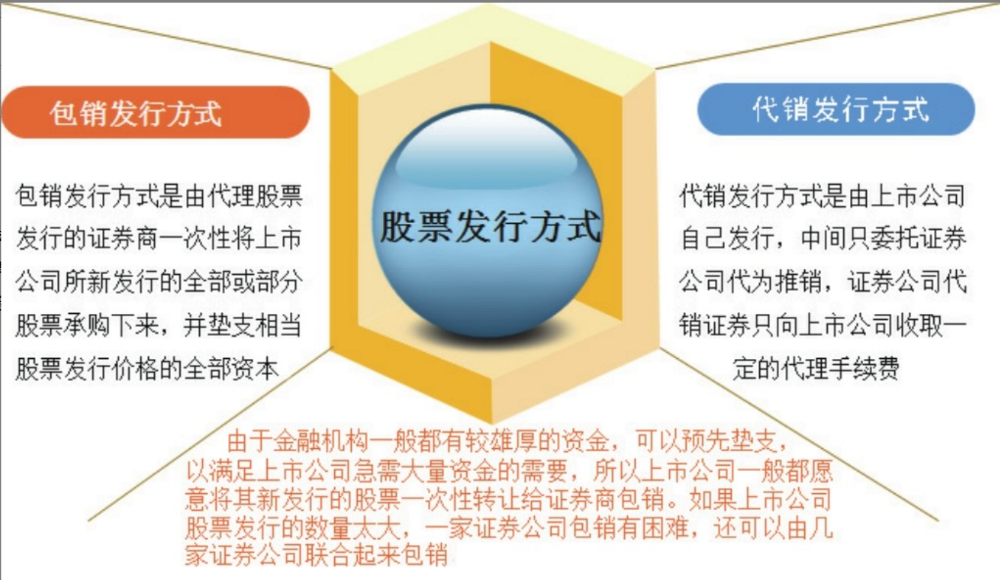
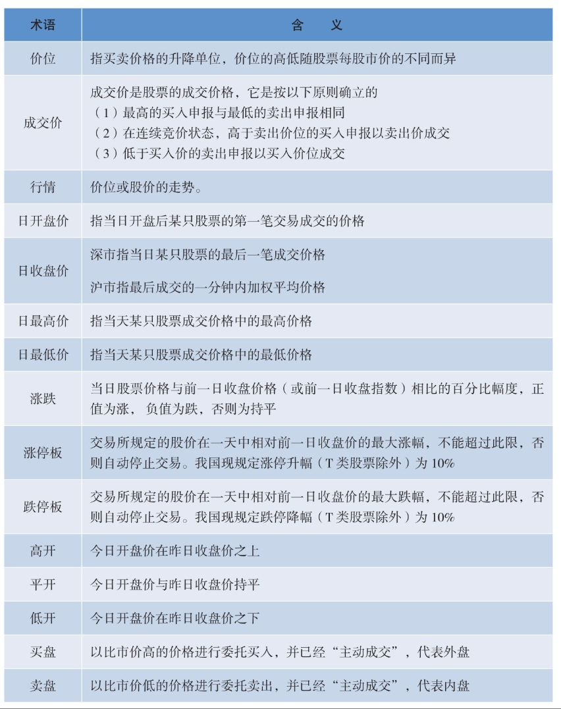
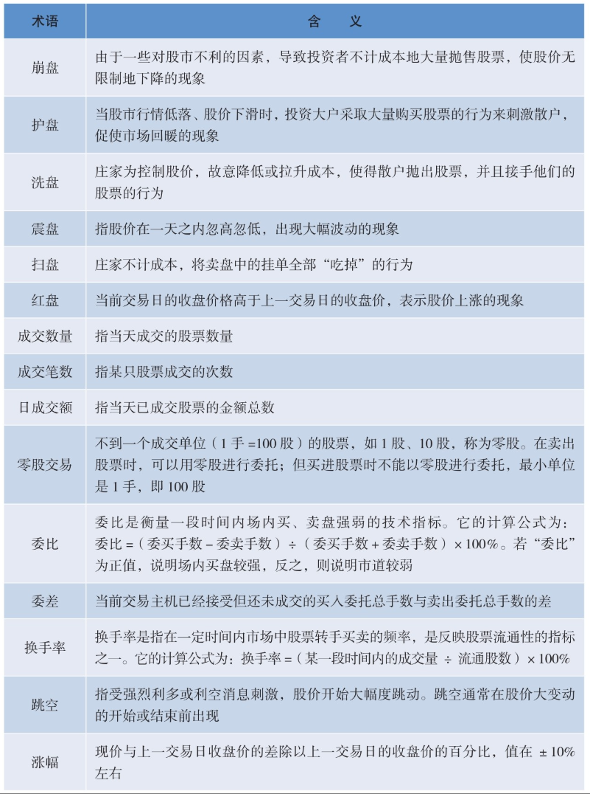
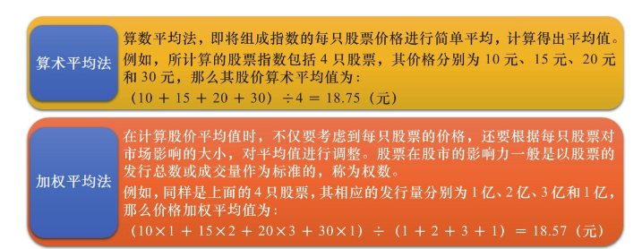
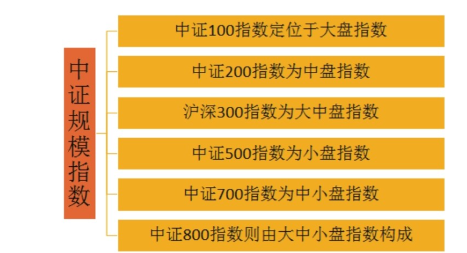

# 股票基本知识

## 1.1 认识股票

- 1986年11月，美国纽约证券交易所董事长约翰•范尔林先生访华，他向邓小平赠送了一枚纽交所徽章，凭它可以在纽交所自由进出。赠了一张50元面值的“小飞乐”股票。如图1-1所示。据悉，范尔林的这一股，通过多年的送配，一股变成了3183股，市场价值由50元变成最高时的10.76万元，回报率高达2152倍！

- 股票是一种有价证券。我们通常所说的股票指的是普通股，它是在公司的经营管理和赢利以及财产的分配上享有普通权利的股份。
- 从概念上讲，股票是股份有限公司在筹集资本时向出资人发行的股份凭证，代表着其持有者（即股东）对股份公司的所有权。
- 股票一般可以通过买卖方式有偿转让，股东能通过股票转让收回其投资，但不能要求公司返还其出资。
- 股东可以在股票市场上买卖这些股票，就形成了股票在不同投资者手中的流通以及所有人和持有份额的变更。股票像一般的商品一样，有价格，能买卖，可以作为质押品。拥有这些股票的人，都可以成为公司的股东。
- 股东与公司之间的关系不是债权债务关系，股东是公司的所有者，以其出资额为限对公司负有限责任、承担风险、分享收益。

## 1.2 股票类型

- 股票是由股份公司发行给股东，作为股东投资入股的所有权证书。在股票市场中，按照不同的分类方法，股票的分类也各不相同。

- 除了按分类先后原则对股票进行分类之外，我们在日常生活中还常常听到`A股``B股`等词汇，这实际上是按照股票的发行方式进行分类。

> A股（常说）

**蓝筹股**

- **定义**：经营业绩长期稳定，能长期分红的行业龙头企业。

- 特征

  ：

  - 连续三年分红率大于30%。
  - 连续三年ROE（净资产收益率）大于12%。
  - 主要集中在上证180指数和深证100指数的上市公司，流通市值一般大于100亿。

- **投资风格**：适合寻求稳定分红或作为打新股底仓的投资者。

**白马股**

- **定义**：具有长期绩优、分红稳定及更高成长预期的股票。

- 特征

  ：

  - ROE连续3年大于15%。
  - 净利润增速连续3年大于20-30%。

- **投资风格**：适合能耐心等候时机，追求较高回报的投资者。最佳买入时机是在股市极度低迷时或在财报公布后的调整期逢低买入。

**成长股**

- **定义**：比白马股更具成长性，业绩增速远高于同行平均的企业，通常为高新技术和科技类公司。
- **特征**：市盈率相对盈利增长比率控制在0.75左右，强劲的每股现金流，现金余额是正值等。
- **投资风格**：考验投资者眼力，适合愿意承担较高风险以追求高额回报的投资者。建议用“核心-卫星资产配置策略”。

**周期股**

- **定义**：业绩会跟随经济周期波动的股票，涉及大宗商品、制造业、航运业、非生活必需品等行业。
- **特征**：股价暴涨暴跌，与经济周期紧密相关。
- **投资风格**：重要的是选择正确的投资时点，在行业低谷时进入，在繁荣期退出；避免高负债率且经营现金流不佳的公司。

## 1.3 公司上市

> 公司上市

- 股票上市是指已经发行的股票经证券交易所批准后，在交易所公开挂牌交易的法律行为，股票上市，是连接股票发行和股票交易的“桥梁”。

> 公司退市

- 上市公司股本总额、股权分布等发生变化，不再具备上市条件，在证券交易所规定的期限内仍不能达到上市条件。
- 上市公司不按照规定公开其财务会计报告，或者对财务会计报告作虚假记载，且拒绝纠正。
- 上市公司3年连续亏损，在其后一个年度内未能恢复盈利。
- 上市公司解散或者被宣告破产。

## 1.4 股票发行方式

- 股票在上市发行前，上市公司与股票的代理发行证券商签订代理发行合同，确定股票发行的方式，明确各方的责任。股票代理发行的方式按发行承担的风险不同，一般分为包销发行方式和代销发行方式两种

## 1.5 常用话术

## 1.6 股票指数

- 股票指数即**股票价格指数**，也就是我们常说的“股指”，是**用于描述和衡量股票市场总的价格水平变化的指标**。
- **股票指数是由证券交易所或金融机构运用统计学中的指数方法编制而成的。不同股票市场有不同的股票指数，同一股票市场也可以有多个股票指数**。
- 如美国有三大知名指数：道琼斯指数、纳斯达克指数和标普500指数；中国有上证综指、深圳成指、恒生指数等
- A股市场上还有众多知名的指数，如上证50、沪深300、中证500等等。

> 计算方法

- 股价指数的计算有算术平均法和加权平均法两种

> 上证指数

- 上证股票指数是由上海证券交易所编制的股票指数，于1990年12月19日正式发布。该股票指数的样本为所有在上海证券交易所挂牌上市的股票，新上市的股票将在挂牌的第二天纳入股票指数的计算范围

> 深证指数

- 深圳综合股票指数是由深圳证券交易所编制的股票指数。如图1-8所示。该股票指数的计算方法基本与上证指数相同，其样本为所有在深圳证券交易所挂牌上市的股票，权数为股票的总股数。

> 中证指数

- 中证指数有限公司成立于2005年8月25日，它是由上海证券交易所和深圳证券交易所共同出资发起设立的一家专业从事证券指数及指数衍生产品开发服务的公司。

  

> 纳斯达克指数

- 纳斯达克综合指数是反映纳斯达克证券市场行情变化的股票价格平均指数，基本指数为 100。
- 纳斯达克（简称 NASDAQ，National Association of Securities Dealers Automated Quotations）是美国全国证券交易商协会于1968年着手创建的自动报价系统名称的英文简称。纳斯达克的特点是收集和发布场外交易非上市股票的证券商报价，它现已成为全球最大的证券交易市场。
