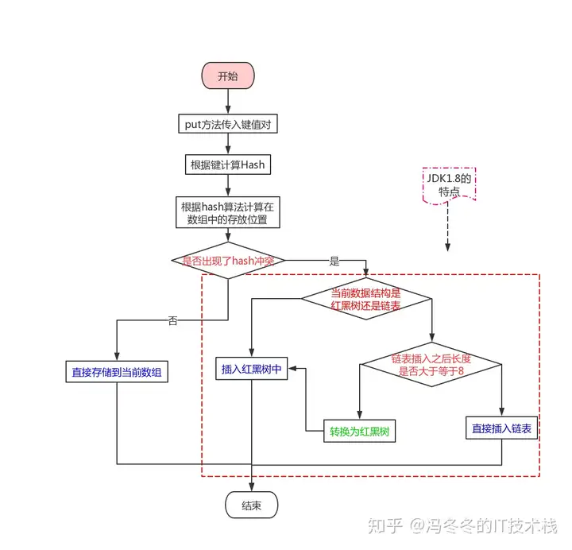

- 参考文章：https://zhuanlan.zhihu.com/p/91960960
- 参考文章：https://zhuanlan.zhihu.com/p/79219960

# HashMap 源码分析

 作为工作中最重要、最常用的容器之一，当然还是要自己动手写一篇 HashMap 的源码解析来加深对其的印象咯，而且它的设计与实现 也有很多值得学习的地方。

## 源码赏析

JDK1.8 的 HashMap 底层使用的是 动态数组，数组中元素存放的是 链表或红黑树。核心源码如下。

```java
public class HashMap<K,V> extends AbstractMap<K,V> implements Map<K,V>,
		Cloneable, Serializable {

    /**
     * 初始化容量，这里的 位运算 就不多解释咯，可以自行度娘
     */
    static final int DEFAULT_INITIAL_CAPACITY = 1 << 4; // aka 16

    /**
     * 最大容量
     */
    static final int MAXIMUM_CAPACITY = 1 << 30;

    /**
     * 扩容因子，使用的容量达到 当前容量的 75% 就扩容
     */
    static final float DEFAULT_LOAD_FACTOR = 0.75f;

    /**
     * 当前 HashMap 所能容纳键值对数量的最大值，超过这个值，则需扩容
     */
    int threshold;

    /**
     * 已使用的容量
     */
    transient int size;

    /**
     * Node数组，实际存放 键值对 的地方
     */
    transient Node<K,V>[] table;

    /**
     * 链表转红黑树的阈值，链表长度达到此值，会进化成红黑树
     */
    static final int TREEIFY_THRESHOLD = 8;

    /**
     * 系列构造方法，推荐在初始化时根据实际情况设置好初始容量，用好了可以显著减少 resize，提升效率
     */
    public HashMap(int initialCapacity, float loadFactor) {
        if (initialCapacity < 0)
            throw new IllegalArgumentException("Illegal initial capacity: " +
                                               initialCapacity);
        if (initialCapacity > MAXIMUM_CAPACITY)
            initialCapacity = MAXIMUM_CAPACITY;
        if (loadFactor <= 0 || Float.isNaN(loadFactor))
            throw new IllegalArgumentException("Illegal load factor: " +
                                               loadFactor);
        this.loadFactor = loadFactor;
        this.threshold = tableSizeFor(initialCapacity);
    }

    public HashMap(int initialCapacity) {
        this(initialCapacity, DEFAULT_LOAD_FACTOR);
    }

    public HashMap() {
        this.loadFactor = DEFAULT_LOAD_FACTOR; // all other fields defaulted
    }

    public HashMap(Map<? extends K, ? extends V> m) {
        this.loadFactor = DEFAULT_LOAD_FACTOR;
        putMapEntries(m, false);
    }

    public V put(K key, V value) {
        return putVal(hash(key), key, value, false, true);
    }

    final V putVal(int hash, K key, V value, boolean onlyIfAbsent,
                   boolean evict) {
        Node<K,V>[] tab; Node<K,V> p; int n, i;
        // 初始化桶数组 table，table 被延迟到插入新数据时再进行初始化
        if ((tab = table) == null || (n = tab.length) == 0)
            n = (tab = resize()).length;
        // 如果桶中不包含键值对节点引用，则将新键值对节点的引用存入桶中即可
        if ((p = tab[i = (n - 1) & hash]) == null)
            tab[i] = newNode(hash, key, value, null);
        else {
            Node<K,V> e; K k;
            // 如果键的值以及节点 hash 等于链表中的第一个键值对节点时，则将 e 指向该键值对
            if (p.hash == hash && ((k = p.key) == key || (key != null && key.equals(k))))
                e = p;
			// 如果桶中的引用类型为 TreeNode，则调用红黑树的插入方法
	        else if (p instanceof TreeNode)
	            e = ((TreeNode<K,V>)p).putTreeVal(this, tab, hash, key, value);
	        else {
	            // 对链表进行遍历，并统计链表长度
	            for (int binCount = 0; ; ++binCount) {
	                // 链表中不包含要插入的键值对节点时，则将该节点接在链表的最后
	                // ！！！ JDK1.7中 新增的Node节点采用头插入，而JDK1.8中改成了尾插入 ！！！
	                if ((e = p.next) == null) {
	                    p.next = newNode(hash, key, value, null);
	                    // 如果链表长度达到阈值，则进化成红黑树
	                    if (binCount >= TREEIFY_THRESHOLD - 1) // -1 for 1st
	                        treeifyBin(tab, hash);
	                    break;
	                }

	                // 条件为 true，表示当前链表包含要插入的键值对，终止遍历
	                if (e.hash == hash &&
	                    ((k = e.key) == key || (key != null && key.equals(k))))
	                    break;
	                p = e;
	            }
	        }

	        // 判断要插入的键值对是否存在 HashMap 中
	        if (e != null) { // existing mapping for key
	            V oldValue = e.value;
	            // onlyIfAbsent 表示是否仅在 oldValue 为 null 的情况下更新键值对的值
	            if (!onlyIfAbsent || oldValue == null)
	                e.value = value;
	            afterNodeAccess(e);
	            return oldValue;
	        }
	    }
	    ++modCount;
	    // 键值对数量超过阈值时，则进行扩容
	    if (++size > threshold)
	        resize();
	    afterNodeInsertion(evict);
	    return null;
    }

    /**
     * 扩容为原容量的两倍，并将存在的元素 放到新的数组上
     */
	final Node<K,V>[] resize() {
	    Node<K,V>[] oldTab = table;
	    int oldCap = (oldTab == null) ? 0 : oldTab.length;
	    int oldThr = threshold;
	    int newCap, newThr = 0;
	    // 如果 table 不为空，表明已经初始化过了
	    if (oldCap > 0) {
	        // 当 table 容量超过容量最大值，则不再扩容
	        if (oldCap >= MAXIMUM_CAPACITY) {
	            threshold = Integer.MAX_VALUE;
	            return oldTab;
	        }
	        // 按旧容量和阈值的2倍计算新容量和阈值的大小
	        else if ((newCap = oldCap << 1) < MAXIMUM_CAPACITY &&
	                 oldCap >= DEFAULT_INITIAL_CAPACITY)
	            newThr = oldThr << 1; // double threshold
	    } else if (oldThr > 0) // initial capacity was placed in threshold
	        // 初始化时，将 threshold 的值赋值给 newCap，
	        // HashMap 使用 threshold 变量暂时保存 initialCapacity 参数的值
	        newCap = oldThr;
	    else {               // zero initial threshold signifies using defaults
	        // 调用无参构造方法时，桶数组容量为默认容量，
	        // 阈值为默认容量与默认负载因子乘积
	        newCap = DEFAULT_INITIAL_CAPACITY;
	        newThr = (int)(DEFAULT_LOAD_FACTOR * DEFAULT_INITIAL_CAPACITY);
	    }

	    // newThr 为 0 时，按阈值计算公式进行计算
	    if (newThr == 0) {
	        float ft = (float)newCap * loadFactor;
	        newThr = (newCap < MAXIMUM_CAPACITY && ft < (float)MAXIMUM_CAPACITY ?
	                  (int)ft : Integer.MAX_VALUE);
	    }
	    threshold = newThr;
	    // 创建新的桶数组，桶数组的初始化也是在这里完成的
	    Node<K,V>[] newTab = (Node<K,V>[])new Node[newCap];
	    table = newTab;
	    if (oldTab != null) {
	        // 如果旧的桶数组不为空，则遍历桶数组，并将键值对映射到新的桶数组中
	        for (int j = 0; j < oldCap; ++j) {
	            Node<K,V> e;
	            if ((e = oldTab[j]) != null) {
	                oldTab[j] = null;
	                if (e.next == null)
	                    newTab[e.hash & (newCap - 1)] = e;
	                else if (e instanceof TreeNode)
	                    // 重新映射时，需要对红黑树进行拆分
	                    ((TreeNode<K,V>)e).split(this, newTab, j, oldCap);
	                else { // preserve order
	                    Node<K,V> loHead = null, loTail = null;
	                    Node<K,V> hiHead = null, hiTail = null;
	                    Node<K,V> next;
	                    // 遍历链表，并将链表节点按原顺序进行分组
	                    do {
	                        next = e.next;
	                        if ((e.hash & oldCap) == 0) {
	                            if (loTail == null)
	                                loHead = e;
	                            else
	                                loTail.next = e;
	                            loTail = e;
	                        }
	                        else {
	                            if (hiTail == null)
	                                hiHead = e;
	                            else
	                                hiTail.next = e;
	                            hiTail = e;
	                        }
	                    } while ((e = next) != null);
	                    // 将分组后的链表映射到新桶中
	                    if (loTail != null) {
	                        loTail.next = null;
	                        newTab[j] = loHead;
	                    }
	                    if (hiTail != null) {
	                        hiTail.next = null;
	                        newTab[j + oldCap] = hiHead;
	                    }
	                }
	            }
	        }
	    }
	    return newTab;
	}

    public V get(Object key) {
        Node<K,V> e;
        return (e = getNode(hash(key), key)) == null ? null : e.value;
    }

    /**
     * 根据 hash 和 key 获取相应的 Node节点
     */
	final Node<K,V> getNode(int hash, Object key) {
	    Node<K,V>[] tab; Node<K,V> first, e; int n; K k;
	    // 1. 定位键值对所在桶的位置，如果该位置有元素，则获取第一个元素
	    if ((tab = table) != null && (n = tab.length) > 0 &&
	        (first = tab[(n - 1) & hash]) != null) {
	        // 如果hash和key都与 第一个元素相同，则第一个元素就是我们要获取的，直接返回
	        if (first.hash == hash &&
	        		((k = first.key) == key || (key != null && key.equals(k))))
	            return first;
	        if ((e = first.next) != null) {
	            // 2. 如果 first 是 TreeNode 类型，则调用黑红树查找方法
	            if (first instanceof TreeNode)
	                return ((TreeNode<K,V>)first).getTreeNode(hash, key);
	            // 3. 对链表进行查找
	            do {
	                if (e.hash == hash &&
	                    ((k = e.key) == key || (key != null && key.equals(k))))
	                    return e;
	            } while ((e = e.next) != null);
	        }
	    }
	    return null;
	}

    /**
     * 还记HashMap底层的动态数组的定义吗 transient Node<K,V>[] table
     * 这里很明显是一个单向链表结构
     */
    static class Node<K,V> implements Map.Entry<K,V> {
        final int hash;
        final K key;
        V value;
        Node<K,V> next;

        Node(int hash, K key, V value, Node<K,V> next) {
            this.hash = hash;
            this.key = key;
            this.value = value;
            this.next = next;
        }

        public final K getKey()        { return key; }
        public final V getValue()      { return value; }
        public final String toString() { return key + "=" + value; }

        public final int hashCode() {
            return Objects.hashCode(key) ^ Objects.hashCode(value);
        }

        public final V setValue(V newValue) {
            V oldValue = value;
            value = newValue;
            return oldValue;
        }

        public final boolean equals(Object o) {
            if (o == this)
                return true;
            if (o instanceof Map.Entry) {
                Map.Entry<?,?> e = (Map.Entry<?,?>)o;
                if (Objects.equals(key, e.getKey()) &&
                    Objects.equals(value, e.getValue()))
                    return true;
            }
            return false;
        }
    }

    /**
     * JDK8 加入的 红黑树TreeNode内部类，红黑树的方法比较复杂，这里只展示一些重要的
     * 属性结构代码
     */
    static final class TreeNode<K,V> extends LinkedHashMap.Entry<K,V> {
        TreeNode<K,V> parent;  // red-black tree links
        TreeNode<K,V> left;
        TreeNode<K,V> right;
        TreeNode<K,V> prev;    // needed to unlink next upon deletion
        // 颜色，true红，false黑
        boolean red;
        TreeNode(int hash, K key, V val, Node<K,V> next) {
            super(hash, key, val, next);
        }
    }
}
```

## 底层数据结构

> JDK 1.7


- 在jdk1.7中，首先是把元素放在一个个数组里面，后来存放的数据元素越来越多，于是就出现了链表，对于数组中的每一个元素，都可以有一条链表来存储元素。这就是有名的“拉链式”存储方法。
- 就这样用了几年，后来存储的元素越来越多，链表也越来越长，在查找一个元素时候效率不仅没有提高（链表不适合查找，适合增删），反倒是下降了不少，于是就对这条链表进行了一个改进。如何改进呢？就是把这条链表变成一个适合查找的[树形结构](https://zhida.zhihu.com/search?q=树形结构&zhida_source=entity&is_preview=1)，没错就是红黑树。于是HashMap的存储数据结构就变成了下面的这种。


我们会发现优化的部分就是把链表结构变成了红黑树。原来jdk1.7的优点是增删效率高，于是在jdk1.8的时候，不仅仅增删效率高，而且查找效率也提升了。

**注意：不是说变成了红黑树效率就一定提高了，只有在链表的长度不小于8，而且数组的长度不小于64的时候才会将链表转化为红黑树，**

> 问题一：什么是红黑树呢？

红黑树是一个自平衡的[二叉查找树](https://zhida.zhihu.com/search?q=二叉查找树&zhida_source=entity&is_preview=1)，也就是说红黑树的查找效率是非常的高，查找效率会从链表的o(n)降低为o(logn)。如果之前没有了解过红黑树的话，也没关系，你就记住红黑树的查找效率很高就OK了。


> 问题二：为什么不一下子把整个链表变为红黑树呢？

这个问题的意思是这样的，就是说我们为什么非要等到链表的长度大于等于8的时候，才转变成红黑树？在这里可以从两方面来解释

- （1）构造红黑树要比构造链表复杂，在链表的节点不多的时候，从整体的性能看来， 数组+链表+红黑树的结构可能不一定比数组+[链表](https://zhida.zhihu.com/search?q=链表&zhida_source=entity&is_preview=1)的结构性能高。就好比[杀鸡焉用牛刀](https://zhida.zhihu.com/search?q=杀鸡焉用牛刀&zhida_source=entity&is_preview=1)的意思。
- （2）HashMap频繁的扩容，会造成底部红黑树不断的进行拆分和重组，这是非常耗时的。因此，也就是链表长度比较长的时候转变成红黑树才会显著提高效率。

OK，到这里[相信我们](https://zhida.zhihu.com/search?q=相信我们&zhida_source=entity&is_preview=1)对hashMap的底层数据结构有了一个认识。现在带着上面的结构图，看一下如何存储一个元素。

> 存储元素put

我们在存储一个元素的时候，大多是使用下面的这种方式。

```java
public class Test {
    public static void main(String[] args) {
        HashMap<String, Integer> map= new HashMap<>();
        //存储一个元素
        map.put("张三", 20);
    }
}

```

在这里HashMap<String, Integer>，第一个参数是键，第二个参数是值，合起来叫做[键值对](https://zhida.zhihu.com/search?q=键值对&zhida_source=entity&is_preview=1)。存储的时候只需要调用put方法即可。那底层的实现原理是怎么样的呢？这里还是先给出一个流程图



上面这个流程，不知道你能否看到，红色字迹的是三个判断框，也是转折点，我们使用文字来梳理一下这个流程：

（1）第一步：调用put方法传入键值对

（2）第二步：使用[hash算法](https://zhida.zhihu.com/search?q=hash算法&zhida_source=entity&is_preview=1)计算hash值

（3）第三步：根据hash值确定存放的位置，判断是否和其他键值对位置发生了冲突

（4）第四步：若没有发生冲突，直接存放在数组中即可

（5）第五步：若发生了冲突，还要判断此时的数据结构是什么？

（6）第六步：若此时的数据结构是红黑树，那就直接插入红黑树中

（7）第七步：若此时的数据结构是链表，判断插入之后是否大于等于8

（8）第八步：插入之后大于8了，就要先调整为红黑树，在插入

（9）第九步：插入之后不大于8，那么就直接插入到链表尾部即可。

上面就是插入数据的整个流程，光看流程还不行，我们还需要深入到源码中去看看底部是如何按照这个流程写代码的。

鼠标聚焦在put方法上面，按一下F3，我们就能进入put的源码。来看一下：

```java
public V put(K key, V value) {
     return putVal(hash(key), key, value, false, true);
}
```

也就是说，put方法其实调用的是putVal方法。putVal方法有5个参数：

（1）第一个参数hash：调用了hash方法计算hash值

（2）第二个参数key：就是我们传入的key值，也就是例子中的张三

（3）第三个参数value：就是我们传入的value值，也就是例子中的20

（4）第四个参数onlyIfAbsent：也就是当键相同时，不修改已存在的值

（5）第五个参数evict ：如果为false，那么数组就处于创建模式中，所以一般为true。

知道了这5个参数的含义，我们就进入到这个putVal方法中。

```java
    final V putVal(int hash, K key, V value, boolean onlyIfAbsent,
                   boolean evict) {
        Node<K,V>[] tab; Node<K,V> p; int n, i;
        //第一部分
        if ((tab = table) == null || (n = tab.length) == 0)
            n = (tab = resize()).length;
        //第二部分
        if ((p = tab[i = (n - 1) & hash]) == null)
            tab[i] = newNode(hash, key, value, null);
        //第三部分
        else {
            Node<K,V> e; K k;
            //第三部分第一小节
            if (p.hash == hash &&
                ((k = p.key) == key || (key != null && key.equals(k))))
                e = p;
            //第三部分第二小节
            else if (p instanceof TreeNode)
                e = ((TreeNode<K,V>)p).putTreeVal(this, tab, hash, key, value);
            //第三部分第三小节
            else {
                for (int binCount = 0; ; ++binCount) {
                    //第三小节第一段
                    if ((e = p.next) == null) {
                        p.next = newNode(hash, key, value, null);
                        if (binCount >= TREEIFY_THRESHOLD - 1) // -1 for 1st
                            treeifyBin(tab, hash);
                        break;
                    }
                    //第三小节第一段
                    if (e.hash == hash &&
                        ((k = e.key) == key || (key != null && key.equals(k))))
                        break;
                    //第三小节第三段
                    p = e;
                }
            }
            //第三部分第四小节
            if (e != null) { // existing mapping for key
                V oldValue = e.value;
                if (!onlyIfAbsent || oldValue == null)
                    e.value = value;
                afterNodeAccess(e);
                return oldValue;
            }
        }
        ++modCount;
        //第四部分
        if (++size > threshold)
            resize();
        afterNodeInsertion(evict);
        return null;
    }
```

乍一看，这代码完全没有读下去的欲望，第一次看的时候真实恶心到想吐，但是结合上一开始画的流程图再来分析，相信就会好很多。我们把代码进行拆分（整体分了四大部分）：

（1）Node<K,V>[] tab中tab表示的就是数组。Node<K,V> p中p表示的就是当前插入的节点

（2）第一部分：

```java
if ((tab = table) == null || (n = tab.length) == 0)
       n = (tab = resize()).length;
```

这一部分表示的意思是如果数组是空的，那么就通过resize方法来创建一个新的数组。在这里resize方法先不说明，在下一小节扩容的时候会提到。

（3）第二部分：

```java
if ((p = tab[i = (n - 1) & hash]) == null)
      tab[i] = newNode(hash, key, value, null);
```

i表示在数组中插入的位置，计算的方式为(n - 1) & hash。在这里需要判断插入的位置是否是冲突的，如果不冲突就直接newNode，插入到数组中即可，这就和流程图中第一个判断框对应了。

如果插入的hash值冲突了，那就转到第三部分，处理冲突

（4）第三部分：

```java
        else {
            Node<K,V> e; K k;
            //第三部分a
            if (p.hash == hash &&
                ((k = p.key) == key || (key != null && key.equals(k))))
                e = p;
            //第三部分b
            else if (p instanceof TreeNode)
                e = ((TreeNode<K,V>)p).putTreeVal(this, tab, hash, key, value);
            //第三部分c
            else {
                for (int binCount = 0; ; ++binCount) {
                    //第三小节第一段
                    if ((e = p.next) == null) {
                        p.next = newNode(hash, key, value, null);
                        if (binCount >= TREEIFY_THRESHOLD - 1) // -1 for 1st
                            treeifyBin(tab, hash);
                        break;
                    }
                    //第三小节第一段
                    if (e.hash == hash &&
                        ((k = e.key) == key || (key != null && key.equals(k))))
                        break;
                    //第三小节第三段
                    p = e;
                }
            }
            //第三部分d
            if (e != null) { // existing mapping for key
                V oldValue = e.value;
                if (!onlyIfAbsent || oldValue == null)
                    e.value = value;
                afterNodeAccess(e);
                return oldValue;
            }
        }
```

我们会看到，处理冲突还真是麻烦，好在我们对这一部分又进行了划分

a）第三部分第一小节：

```java
if (p.hash == hash 
     &&((k = p.key) == key || (key != null && key.equals(k))))
     e = p;
```

在这里判断table[i]中的元素是否与插入的key一样，若相同那就直接使用插入的值p替换掉旧的值e。

b）第三部分第二小节：

```java
else if (p instanceof TreeNode)
       e = ((TreeNode<K,V>)p).putTreeVal(this, tab, hash, key, value);
```

判断插入的数据结构是红黑树还是链表，在这里表示如果是红黑树，那就直接putTreeVal到红黑树中。这就和流程图里面的第二个判断框对应了。

c）第三部分第三小节：

```java
//第三部分c
else {
     for (int binCount = 0; ; ++binCount) {
        //第三小节第一段
         if ((e = p.next) == null) {
              p.next = newNode(hash, key, value, null);
              if (binCount >= TREEIFY_THRESHOLD - 1) // -1 for 1st
                  treeifyBin(tab, hash);
                  break;
         }
         //第三小节第一段
         if (e.hash == hash &&
               ((k = e.key) == key || (key != null && key.equals(k))))
              break;
         //第三小节第三段
         p = e;
    }
}
```

如果数据结构是链表，首先要遍历table数组是否存在，如果不存在直接newNode(hash, key, value, null)。如果存在了直接使用新的value替换掉旧的。

注意一点：不存在并且在链表末尾插入元素的时候，会判断binCount >= TREEIFY_THRESHOLD - 1。也就是判断当前链表的长度是否大于阈值8，如果大于那就会把当前链表转变成红黑树，方法是treeifyBin。这也就和[流程图](https://zhida.zhihu.com/search?q=流程图&zhida_source=entity&is_preview=1)中第三个判断框对应了。

（5）第四部分：

```java
if (++size > threshold)
        resize();
afterNodeInsertion(evict);
return null;
```

插入成功之后，还要判断一下实际存在的键值对数量size是否大于阈值threshold。如果大于那就开始扩容了。

> 扩容

为什么扩容呢？很明显就是当前容量不够，也就是put了太多的元素。为此我们还是先给出一个流程图，再来进行分析。


这个扩容就比较简单了，HaspMap扩容就是就是先计算 新的hash表容量和新的容量阀值，然后初始化一个新的hash表，将旧的键值对重新映射在新的hash表里。如果在旧的hash表里涉及到红黑树，那么在映射到新的hash表中还涉及到红黑树的拆分。整个流程也符合我们正常扩容一个容量的过程，我们根据流程图结合代码来分析：

```java
    final Node<K,V>[] resize() {
        Node<K,V>[] oldTab = table;
        int oldCap = (oldTab == null) ? 0 : oldTab.length;
        int oldThr = threshold;
        int newCap, newThr = 0;
        //第一部分：扩容
        if (oldCap > 0) {
            if (oldCap >= MAXIMUM_CAPACITY) {
                threshold = Integer.MAX_VALUE;
                return oldTab;
            }
            else if ((newCap = oldCap << 1) < MAXIMUM_CAPACITY &&
                     oldCap >= DEFAULT_INITIAL_CAPACITY)
                newThr = oldThr << 1; // double threshold
        }
        //第二部分：设置阈值
        else if (oldThr > 0) // initial capacity was placed in threshold
            newCap = oldThr;
        else {               // zero initial threshold signifies using defaults
            newCap = DEFAULT_INITIAL_CAPACITY;
            newThr = (int)(DEFAULT_LOAD_FACTOR * DEFAULT_INITIAL_CAPACITY);
        }
        if (newThr == 0) {
            float ft = (float)newCap * loadFactor;
            newThr = (newCap < MAXIMUM_CAPACITY && ft < (float)MAXIMUM_CAPACITY ?
                      (int)ft : Integer.MAX_VALUE);
        }
        threshold = newThr;
        @SuppressWarnings({"rawtypes","unchecked"})
            Node<K,V>[] newTab = (Node<K,V>[])new Node[newCap];
        table = newTab;
        //第三部分：旧数据保存在新数组里面
        if (oldTab != null) {
            for (int j = 0; j < oldCap; ++j) {
                Node<K,V> e;
                if ((e = oldTab[j]) != null) {
                    oldTab[j] = null;
                    //只有一个节点，通过索引位置直接映射
                    if (e.next == null)
                        newTab[e.hash & (newCap - 1)] = e;
                    //如果是红黑树，需要进行树拆分然后映射
                    else if (e instanceof TreeNode)
                        ((TreeNode<K,V>)e).split(this, newTab, j, oldCap);
                    else {
                         //如果是多个节点的链表，将原链表拆分为两个链表
                        Node<K,V> loHead = null, loTail = null;
                        Node<K,V> hiHead = null, hiTail = null;
                        Node<K,V> next;
                        do {
                            next = e.next;
                            if ((e.hash & oldCap) == 0) {
                                if (loTail == null)
                                    loHead = e;
                                else
                                    loTail.next = e;
                                loTail = e;
                            }
                            else {
                                if (hiTail == null)
                                    hiHead = e;
                                else
                                    hiTail.next = e;
                                hiTail = e;
                            }
                        } while ((e = next) != null);
                        //链表1存于原索引
                        if (loTail != null) {
                            loTail.next = null;
                            newTab[j] = loHead;
                        }
                        //链表2存于原索引加上原hash桶长度的偏移量
                        if (hiTail != null) {
                            hiTail.next = null;
                            newTab[j + oldCap] = hiHead;
                        }
                    }
                }
            }
        }
        return newTab;
    }
```

这代码量同样让人恶心，不过我们还是分段来分析：

（1）第一部分：

```java
//第一部分：扩容
if (oldCap > 0) {
      if (oldCap >= MAXIMUM_CAPACITY) {
           threshold = Integer.MAX_VALUE;
           return oldTab;
      }
      else if ((newCap = oldCap << 1) < MAXIMUM_CAPACITY &&
          oldCap >= DEFAULT_INITIAL_CAPACITY)
            newThr = oldThr << 1; // double threshold
}
```

根据代码也能看明白：首先如果超过了数组的最大容量，那么就直接将阈值设置为整数最大值，然后如果没有超过，那就扩容为原来的2倍，这里要注意是oldThr << 1，移位操作来实现的。

（2）第二部分：

```java
//第二部分：设置阈值
else if (oldThr > 0) //阈值已经初始化了，就直接使用
      newCap = oldThr;
else {    // 没有初始化阈值那就初始化一个默认的容量和阈值
      newCap = DEFAULT_INITIAL_CAPACITY;
      newThr = (int)(DEFAULT_LOAD_FACTOR * DEFAULT_INITIAL_CAPACITY);
}
if (newThr == 0) {
      float ft = (float)newCap * loadFactor;
      newThr = (newCap < MAXIMUM_CAPACITY && ft < (float)MAXIMUM_CAPACITY ?
                      (int)ft : Integer.MAX_VALUE);
}
//为当前的容量阈值赋值
threshold = newThr;
@SuppressWarnings({"rawtypes","unchecked"})
Node<K,V>[] newTab = (Node<K,V>[])new Node[newCap];
table = newTab;
```

首先第一个else if表示如果阈值已经初始化过了，那就直接使用旧的阈值。然后第二个else表示如果没有初始化，那就初始化一个新的数组容量和新的阈值。

（3）第三部分

第三部分同样也很复杂，就是把旧数据复制到新数组里面。这里面需要注意的有下面几种情况：

A：扩容后，若hash值新增参与运算的位=0，那么元素在扩容后的位置=原始位置

B：扩容后，若hash值新增参与运算的位=1，那么元素在扩容后的位置=原始位置+扩容后的旧位置。

hash值新增参与运算的位是什么呢？我们把[hash值](https://zhida.zhihu.com/search?q=hash值&zhida_source=entity&is_preview=1)转变成二进制数字，新增参与运算的位就是倒数第五位。

这里面有一个非常好的设计理念，扩容后长度为原[hash表](https://zhida.zhihu.com/search?q=hash表&zhida_source=entity&is_preview=1)的2倍，于是把hash表分为两半，分为低位和高位，如果能把原链表的键值对， 一半放在低位，一半放在高位，而且是通过e.hash & oldCap == 0来判断，这个判断有什么优点呢？

举个例子：n = 16，二进制为10000，第5位为1，e.hash & oldCap 是否等于0就取决于e.hash第5 位是0还是1，这就相当于有50%的概率放在新hash表低位，50%的概率放在新hash表高位。

OK，到这一步基本上就算是把扩容这一部分讲完了，还有一个问题没有解决，也就是说存储的原理讲明白了，存储的元素多了如何扩容也明白了，扩容之后出现了地址冲突怎么办呢？

> 解决地址冲突

解决地址冲突的前提是计算的hash值出现了重复，我们就先来看看HashMap中，是如何计算hash值的。

```java
static final int hash(Object key) {
     int h;
     return (key == null) ? 0 : (h = key.hashCode()) ^ (h >>> 16);
}
```

代码是超级简单，hash值其实就是通过hashcode与16异或计算的来的，为什么要使用异或运算呢？画一张图你就明白了：


也就是说，通过异或运算能够是的计算出来的hash比较均匀，不容易出现冲突。但是偏偏出现了冲突现象，这时候该如何去解决呢？

**在数据结构中，我们处理hash冲突常使用的方法有：开发定址法、再哈希法、链地址法、建立公共溢出区。而hashMap中处理hash冲突的方法就是链地址法。**

这种方法的基本思想是将所有哈希地址为i的元素构成一个称为同义词链的单链表，并将单链表的头指针存在[哈希表](https://zhida.zhihu.com/search?q=哈希表&zhida_source=entity&is_preview=1)的第i个单元中，因而查找、插入和删除主要在同义词链中进行。链地址法适用于经常进行插入和删除的情况。


相信大家都能看明白，出现地址冲突的时候，一个接一个排成一条链就OK了。正好与HashMap底层的数据结构相呼应。

**5、构造一个HashMap**

上面可能出现的问题，我们都已经说明了，关于他的构造方法却姗姗来迟。下面我们好好说一下他的构造方法：

他的构造方法一共有四个：

第一个：

```java
public HashMap() {
     this.loadFactor = DEFAULT_LOAD_FACTOR; 
}
```

第二个：

```java
public HashMap(int initialCapacity) {
     this(initialCapacity, DEFAULT_LOAD_FACTOR);
}
```

第三个：

```java
public HashMap(Map<? extends K, ? extends V> m) {
    this.loadFactor = DEFAULT_LOAD_FACTOR;
    putMapEntries(m, false);
}
```

第四个：

```java
   public HashMap(int initialCapacity, float loadFactor) {
        if (initialCapacity < 0)
            throw new IllegalArgumentException("Illegal initial capacity: " +
                                               initialCapacity);
        if (initialCapacity > MAXIMUM_CAPACITY)
            initialCapacity = MAXIMUM_CAPACITY;
        if (loadFactor <= 0 || Float.isNaN(loadFactor))
            throw new IllegalArgumentException("Illegal load factor: " +
                                               loadFactor);
        this.loadFactor = loadFactor;
        this.threshold = tableSizeFor(initialCapacity);
    }
```

这四个构造方法很明显第四个最麻烦，我们就来分析一下第四个构造方法，其他三个自然而然也就明白了。上面出现了两个新的名词：loadFactor和initialCapacity。我们一个一个来分析：

（1）initialCapacity初始容量

官方要求我们要输入一个2的N次幂的值，比如说2、4、8、16等等这些，但是我们忽然一个不小心，输入了一个20怎么办？没关系，虚拟机会根据你输入的值，找一个离20最近的2的[N次幂](https://zhida.zhihu.com/search?q=N次幂&zhida_source=entity&is_preview=1)的值，比如说16离他最近，就取16为初始容量。

（2）loadFactor负载因子

负载因子，默认值是0.75。负载因子表示一个散列表的空间的使用程度，有这样一个公式：initailCapacity*loadFactor=HashMap的容量。 所以负载因子越大则散列表的装填程度越高，也就是能容纳更多的元素，元素多了，链表大了，所以此时索引效率就会降低。反之，负载因子越小则链表中的数据量就越稀疏，此时会对空间造成烂费，但是此时索引效率高。

为什么默认值会是0.75呢？我们截取一段jdk文档：


英语不好的人看的我真是一脸懵逼，不过好在大概意思还能明白。看第三行Poisson_distribution这不就是泊淞分布嘛。而且最关键的就是

当桶中元素到达8个的时候，概率已经变得非常小，也就是说用0.75作为加载因子，每个碰撞位置的链表长度超过８个是几乎不可能的。当桶中元素到达8个的时候，概率已经变得非常小，也就是说用0.75作为加载因子，每个碰撞位置的链表长度超过８个是几乎不可能的。

> HashMap为什么是非线程安全的？

想要解决这个问题，答案很简单，因为源码里面方法全部都是非线程安全的呀，你根本找不到synchronized这样的关键字。保证不了线程安全。于是出现了ConcurrentHashMap。