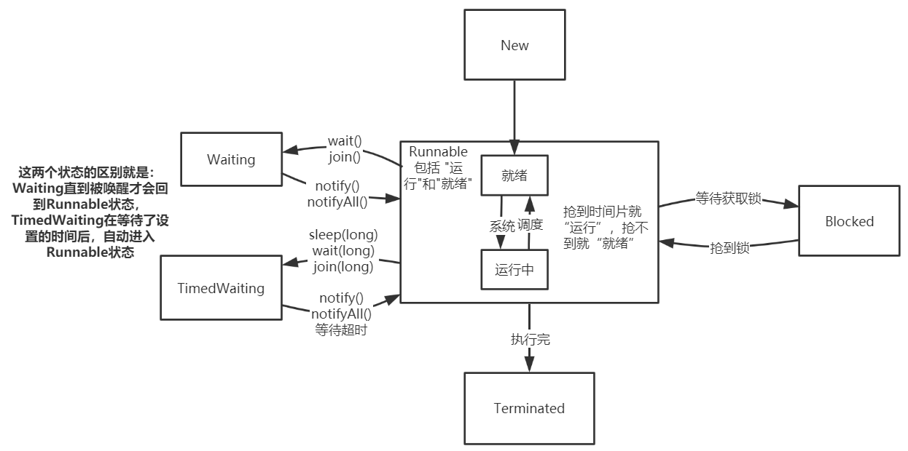
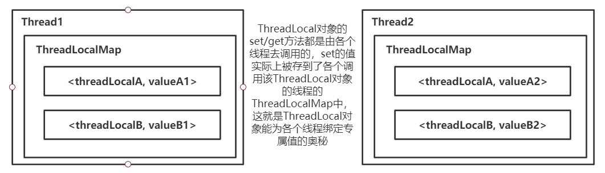

Java基础源码分析

## 1.1 String源码分析

**String 的源码大家应该都能看懂，这里就不一一分析咯，重点讲一下 equals()和 hashcode()方法，然后看一下 String 类常用方法的实现**

`String` 类在 Java 中是一个非常基础且重要的类，它用于表示文本字符串。由于 `String` 是不可变的，因此在创建后就不能改变其内容。这个特性使得 `String` 可以安全地在多线程环境中使用，并且有助于提高性能，因为多个程序可以共享同一个字符串对象。

**String 类定义**

Java 中的 `String` 类定义如下：

```java
public final class String
    implements java.io.Serializable, Comparable<String>, CharSequence {
}
```

这里我们可以看到 `String` 类是 `final` 的，这意味着你不能继承这个类。

**字符串常量池**

`String` 类利用了字符串常量池来存储字符串字面量，这有助于节省内存并提高效率。当创建一个字符串时，如果该字符串已经存在于常量池中，则将引用返回给调用者，而不是创建一个新的对象。

**构造函数**

`String` 类提供了多种构造函数来创建字符串实例，包括从字符数组、字节数组以及 `Reader` 对象等创建。

**字符串不可变性**

字符串的不可变性是由 `String` 类的设计决定的。`String` 类内部维护了一个私有的 `char[] value` 成员变量，用于存储实际的字符数据。这个数组一旦初始化就不能更改。

**常用方法**

`String` 类提供了大量的方法来处理字符串，如 `charAt()`, `getBytes()`, `compareTo()`, `concat()`, `equals()`, `equalsIgnoreCase()`, `indexOf()`, `lastIndexOf()`, `replace()`, `split()`, `substring()` 等。

实例方法分析

- **equals 方法**：用来比较两个字符串是否相等，这里的相等指的是两个字符串具有相同的字符序列。

- **hashCode 方法**：重写了 `Object` 类中的 `hashCode` 方法，确保当两个字符串相等时，它们的哈希码也相等。

- **concat 方法**：用于连接两个字符串，由于 `String` 是不可变的，所以 `concat` 方法会返回一个新的 `String` 实例。

```java
public final class String
    implements java.io.Serializable, Comparable<String>, CharSequence {

    /** 保存String的字节数组 */
    private final char value[];

    /** 缓存这个String的hash值 */
    private int hash; // Default to 0

    /** use serialVersionUID from JDK 1.0.2 for interoperability */
    private static final long serialVersionUID = -6849794470754667710L;

    /**
     * 1、Object的 hashCode()返回该对象的内存地址编号，而equals()比较的是内存地址是否相等；
     * 2、需要注意的是当equals()方法被重写时，hashCode()也要被重写；
     * 3、按照一般hashCode()方法的实现来说，equals()相等的两个对象，hashcode()必须保持相等；
     *    equals()不相等的两个对象，hashcode()未必不相等
     * 4、一个类如果要作为 HashMap 的 key，必须重写equals()和hashCode()方法
     */
    public boolean equals(Object anObject) {
        if (this == anObject) {
            return true;
        }
        if (anObject instanceof String) {
            String anotherString = (String)anObject;
            int n = value.length;
            if (n == anotherString.value.length) {
                char v1[] = value;
                char v2[] = anotherString.value;
                int i = 0;
                while (n-- != 0) {
                    if (v1[i] != v2[i])
                        return false;
                    i++;
                }
                return true;
            }
        }
        return false;
    }

    public int hashCode() {
        int h = hash;
        if (h == 0 && value.length > 0) {
            char val[] = value;

            for (int i = 0; i < value.length; i++) {
                h = 31 * h + val[i];
            }
            hash = h;
        }
        return h;
    }

    /**
     * 指定下标的char
     */
    public char charAt(int index) {
        if ((index < 0) || (index >= value.length)) {
            throw new StringIndexOutOfBoundsException(index);
        }
        return value[index];
    }

    /**
     * 是否以 prefix 为前缀
     */
    public boolean startsWith(String prefix) {
        return startsWith(prefix, 0);
    }

    /**
     * 是否以 suffix 为后缀
     */
    public boolean endsWith(String suffix) {
        return startsWith(suffix, value.length - suffix.value.length);
    }

    /**
     * 该String对象 是否满足 regex正则表达式
     */
    public boolean matches(String regex) {
        return Pattern.matches(regex, this);
    }

    /**
     * 字符替换
     */
    public String replace(char oldChar, char newChar) {
        if (oldChar != newChar) {
            int len = value.length;
            int i = -1;
            char[] val = value; /* avoid getfield opcode */

            while (++i < len) {
                if (val[i] == oldChar) {
                    break;
                }
            }
            if (i < len) {
                char buf[] = new char[len];
                for (int j = 0; j < i; j++) {
                    buf[j] = val[j];
                }
                while (i < len) {
                    char c = val[i];
                    buf[i] = (c == oldChar) ? newChar : c;
                    i++;
                }
                return new String(buf, true);
            }
        }
        return this;
    }

    /**
     * 子串替换
     */
    public String replaceAll(String regex, String replacement) {
        return Pattern.compile(regex).matcher(this).replaceAll(replacement);
    }

    /**
     * 子串替换，只替换第一个
     */
    public String replaceFirst(String regex, String replacement) {
        return Pattern.compile(regex).matcher(this).replaceFirst(replacement);
    }

    /**
     * 按 regex 切割成多个子串
     */
    public String[] split(String regex) {
        return split(regex, 0);
    }

    /**
     * 剪切指定范围的字符串
     */
    public String substring(int beginIndex) {
        if (beginIndex < 0) {
            throw new StringIndexOutOfBoundsException(beginIndex);
        }
        int subLen = value.length - beginIndex;
        if (subLen < 0) {
            throw new StringIndexOutOfBoundsException(subLen);
        }
        return (beginIndex == 0) ? this : new String(value, beginIndex, subLen);
    }

    public String substring(int beginIndex, int endIndex) {
        if (beginIndex < 0) {
            throw new StringIndexOutOfBoundsException(beginIndex);
        }
        if (endIndex > value.length) {
            throw new StringIndexOutOfBoundsException(endIndex);
        }
        int subLen = endIndex - beginIndex;
        if (subLen < 0) {
            throw new StringIndexOutOfBoundsException(subLen);
        }
        return ((beginIndex == 0) && (endIndex == value.length)) ? this
                : new String(value, beginIndex, subLen);
    }

    /**
     * 获取该String 对应的 char[]
     */
    public char[] toCharArray() {
        // Cannot use Arrays.copyOf because of class initialization order issues
        char result[] = new char[value.length];
        System.arraycopy(value, 0, result, 0, value.length);
        return result;
    }

    /**
     * 大小写转换
     */
    public String toLowerCase() {
        return toLowerCase(Locale.getDefault());
    }
    public String toUpperCase() {
        return toUpperCase(Locale.getDefault());
    }

    /**
     * str在本String对象中第一次出现的下标
     */
    public int indexOf(String str) {
        return indexOf(str, 0);
    }

    /**
     * str在本String对象中最后一次出现的下标
     */
    public int lastIndexOf(String str) {
        return lastIndexOf(str, value.length);
    }
}
```

## 1.2 Thread 源码分析

实现多线程从本质上都是由 Thread 类 来完成的，其源码量很多，本次只看一些常见且重要的部分，源码和解析如下。

在 Java 多线程环境中，线程在其生命周期内会经历不同的状态。以下是线程的状态及其之间的转换关系：

1. **新建 (New)**: 线程被创建后，但在调用 `start()` 方法之前的状态。
2. **就绪 (Runnable)**: 线程已经准备好并等待 CPU 分配给它的时间片。
3. **运行 (Running)**: 线程正在执行中。
4. **阻塞 (Blocked/Waiting)**: 线程由于等待某种条件满足而暂时停止执行，这可能是由于 I/O 操作、同步锁或其他原因。
5. **死亡 (Dead)**: 线程已执行完毕或被强制终止。

下面是这些状态之间的转换关系：

- **新建 -> 就绪**: 当 `new Thread(...).start()` 被调用时，线程从新建状态变为就绪状态。
- **就绪 -> 运行**: 当线程获得了 CPU 时间片时，它从就绪状态变为运行状态。
- **运行 -> 阻塞**: 如果线程执行过程中遇到阻塞操作（如 `Thread.sleep()`、`synchronized` 块等待、`wait()` 等），则它会从运行状态进入阻塞状态。
- **阻塞 -> 就绪**: 当阻塞条件解除后（例如 `sleep` 时间结束或 `notify` 被调用），线程返回到就绪状态，等待 CPU 时间片。
- **运行 -> 死亡**: 当线程执行完毕其 `run()` 方法或被 `Thread.stop()` 强制停止时，线程从运行状态变为死亡状态。

如果要用图形表示，可以用圆圈代表每一种状态，并用箭头连接各个状态来表示可能的状态转换方向。例如：

```
+------------+       +-----------+       +-----------+
| 新建 (New) | -->  | 就绪 (R)  | -->  | 运行 (R)   |
+------------+       +-----------+       +-----------+
                      |                          |
                      |                          v
                      +--------------------------+
                                               |
                                               v
                      +--------------------------+
                      |                         |
                      |                         |
                      |                         v
                      +-----------+           +-----------+
                      | 阻塞 (W) | <----    | 死亡 (D)  |
                      +-----------+           +-----------+
```

请注意，这里的 "W" 表示 Waiting（等待）或 Blocked（阻塞），而在实际的 Java 多线程模型中，阻塞状态可能会细分更多子状态，比如 `WAITING`、`TIMED_WAITING` 等。此外，线程状态转换的具体细节可能会受到操作系统和JVM实现的影响。

```java
public class Thread implements Runnable {
	/** 这里只看一些 常见的参数 */
	/** 线程名 */
	private volatile char name[];
	/** 优先级 */
	private int priority;
	/** 是否为守护线程 */
	private boolean daemon;
	/** 线程要执行的目标任务 */
	private Runnable target;
	/** 所属线程组 */
	private ThreadGroup group;
	/** 类加载器 */
	private ClassLoader contextClassLoader;
	/**
	 * ThreadLocal 能为线程设置线程私有变量 就是通过下面这个threadLocals变量完成的，
	 * ThreadLocal的get/set方法就是通过操作 各个线程的 threadLocals 变量实现的。
	 * 1、线程A持有一个 ThreadLocalMap 变量；
	 * 2、线程A调用一个类的 ThreadLocal变量 tlA 的 get/set方法；
	 * 3、tlA（ThreadLocal）的 get/set方法 获取当前线程A，调用 线程A 的 ThreadLocalMap变量 的get/put方法；
	 * 4、其它线程 调用 tlA（ThreadLocal）的 get/set方法 同理。
	 */
	ThreadLocal.ThreadLocalMap threadLocals;
	ThreadLocal.ThreadLocalMap inheritableThreadLocals;
	/** 线程栈的大小 */
	private long stackSize;
	/**
	 * Thread类定义了6个线程状态：New、Runnable、Blocked、Waiting、TimedWaiting、Terminated(终止)
	 * 实际上还会把 Runnable 再细分为 就绪(未抢到时间片) 和 运行中(抢到时间片)
	 */
	private volatile int threadStatus;
	/** 最小优先级 */
	public static final int MIN_PRIORITY = 1;
	/** 中等优先级 */
	public static final int NORM_PRIORITY = 5;
	/** 最大优先级 */
	public static final int MAX_PRIORITY = 10;

	/**
	 * 内部枚举类，用来描述线程状态，状态值有：
	 * NEW：          新建，还未调用start()方法；
	 * RUNNABLE：     运行，在java多线程模型中，就绪和运行都是运行状态；
	 * BLOCKED：      阻塞；
	 * WAITING：      等待，需要其他的线程来唤醒；
	 * TIMED_WAITING：超时等待，可以在指定的时间内自动醒来，如 sleep()方法；
	 * TERMINATED：   终止，线程执行完毕。
	 */
	public static final class State extends Enum {

		public static final State NEW;
		public static final State RUNNABLE;
		public static final State BLOCKED;
		public static final State WAITING;
		public static final State TIMED_WAITING;
		public static final State TERMINATED;
		private static final State VALUES[];

		static {
			NEW = new State("NEW", 0);
			RUNNABLE = new State("RUNNABLE", 1);
			BLOCKED = new State("BLOCKED", 2);
			WAITING = new State("WAITING", 3);
			TIMED_WAITING = new State("TIMED_WAITING", 4);
			TERMINATED = new State("TERMINATED", 5);
			VALUES = (new State[] { NEW, RUNNABLE, BLOCKED, WAITING, TIMED_WAITING, TERMINATED });
		}

		private State(String s, int i) {
			super(s, i);
		}
	}

	/**
	 * 一系列 构造方法 ------------------------------------------------------
	 * 可以看出来，其中都调用了init()方法，这也是一个约定俗成的规矩， 即，如果要在 new 时进行一些初始化操作，
	 * 那么请将初始化操作单独写在 init()方法中，然后在构造函数中调用该 init()方法
	 */
	public Thread() {
		daemon = false;
		stillborn = false;
		threadLocals = null;
		inheritableThreadLocals = null;
		threadStatus = 0;
		blockerLock = new Object();
		init(null, null, (new StringBuilder()).append("Thread-").append(nextThreadNum()).toString(), 0L);
	}

	public Thread(Runnable runnable) {
		daemon = false;
		stillborn = false;
		threadLocals = null;
		inheritableThreadLocals = null;
		threadStatus = 0;
		blockerLock = new Object();
		init(null, runnable, (new StringBuilder()).append("Thread-").append(nextThreadNum()).toString(), 0L);
	}

	Thread(Runnable runnable, AccessControlContext accesscontrolcontext) {
		daemon = false;
		stillborn = false;
		threadLocals = null;
		inheritableThreadLocals = null;
		threadStatus = 0;
		blockerLock = new Object();
		init(null, runnable, (new StringBuilder()).append("Thread-").append(nextThreadNum()).toString(), 0L,
				accesscontrolcontext);
	}

	public Thread(ThreadGroup threadgroup, Runnable runnable) {
		daemon = false;
		stillborn = false;
		threadLocals = null;
		inheritableThreadLocals = null;
		threadStatus = 0;
		blockerLock = new Object();
		init(threadgroup, runnable, (new StringBuilder()).append("Thread-").append(nextThreadNum()).toString(), 0L);
	}

	public Thread(String s) {
		daemon = false;
		stillborn = false;
		threadLocals = null;
		inheritableThreadLocals = null;
		threadStatus = 0;
		blockerLock = new Object();
		init(null, null, s, 0L);
	}

	public Thread(ThreadGroup threadgroup, String s) {
		daemon = false;
		stillborn = false;
		threadLocals = null;
		inheritableThreadLocals = null;
		threadStatus = 0;
		blockerLock = new Object();
		init(threadgroup, null, s, 0L);
	}

	public Thread(Runnable runnable, String s) {
		daemon = false;
		stillborn = false;
		threadLocals = null;
		inheritableThreadLocals = null;
		threadStatus = 0;
		blockerLock = new Object();
		init(null, runnable, s, 0L);
	}

	public Thread(ThreadGroup threadgroup, Runnable runnable, String s) {
		daemon = false;
		stillborn = false;
		threadLocals = null;
		inheritableThreadLocals = null;
		threadStatus = 0;
		blockerLock = new Object();
		init(threadgroup, runnable, s, 0L);
	}

	public Thread(ThreadGroup threadgroup, Runnable runnable, String s, long l) {
		daemon = false;
		stillborn = false;
		threadLocals = null;
		inheritableThreadLocals = null;
		threadStatus = 0;
		blockerLock = new Object();
		init(threadgroup, runnable, s, l);
	}

	private void init(ThreadGroup threadgroup, Runnable runnable, String s, long l) {
		init(threadgroup, runnable, s, l, null);
	}

	/**
	 * 初始化线程
	 */
	private void init(ThreadGroup threadgroup, Runnable runnable, String name, long l,
			AccessControlContext accesscontrolcontext) {

		// 参数校验，线程name不能为null
		if (name == null)
			throw new NullPointerException("name cannot be null");
		this.name = name.toCharArray();
		// 当前线程就是该线程的父线程
		Thread parent = currentThread();
		SecurityManager securitymanager = System.getSecurityManager();
		if (threadgroup == null) {
			if (securitymanager != null)
				threadgroup = securitymanager.getThreadGroup();
			if (threadgroup == null)
				threadgroup = parent.getThreadGroup();
		}
		threadgroup.checkAccess();
		if (securitymanager != null && isCCLOverridden(getClass()))
			securitymanager.checkPermission(SUBCLASS_IMPLEMENTATION_PERMISSION);
		threadgroup.addUnstarted();
		// 守护线程、优先级等设置为父线程的对应属性
		group = threadgroup;
		daemon = parent.isDaemon();
		priority = parent.getPriority();
		if (securitymanager == null || isCCLOverridden(parent.getClass()))
			contextClassLoader = parent.getContextClassLoader();
		else
			contextClassLoader = parent.contextClassLoader;
		inheritedAccessControlContext = accesscontrolcontext == null ? AccessController.getContext()
				: accesscontrolcontext;
		target = runnable;
		setPriority(priority);
		if (parent.inheritableThreadLocals != null)
			// 创建线程共享变量副本
			inheritableThreadLocals = ThreadLocal.createInheritedMap(parent.inheritableThreadLocals);
		stackSize = l;
		// 分配线程id
		tid = nextThreadID();
	}

	public synchronized void start() {
	    //假若当前线程初始化还未做好，不能start，0->NEW状态
	    if (threadStatus != 0)
	        throw new IllegalThreadStateException();

	    //通知group该线程即将启动，group的未启动线程数量减1
	    group.add(this);

	    boolean started = false;
	    try {
	    	// 调用native的start0()方法 启动线程，启动后执行run()方法
	        start0();
	        started = true;
	    } finally {
	        try {
	            //启动不成功，group设置当前线程启动失败
	            if (!started) {
	                group.threadStartFailed(this);
	            }
	        } catch (Throwable ignore) {

	        }
	    }
	}

	private native void start0();

	public void run() {
		if (target != null)
			target.run();
	}

	/**
	 * 请求终止线程。interrupt不会真正停止一个线程，它仅仅是给这个线程发了一个信号，
	 * 告诉它要结束了，具体要中断还是继续运行，将由被通知的线程自己处理
	 */
	public void interrupt() {
	    if (this != Thread.currentThread())
	        checkAccess();
	    synchronized (blockerLock) {
	        Interruptible b = blocker;
	        if (b != null) {
	            interrupt0();
	            b.interrupt(this);
	            return;
	        }
	    }
	    interrupt0();
	}

	private native void interrupt0();

	/**
	 * 线程main 调用了线程A的join方法，则 线程main 会被阻塞，直到线程A执行完毕
	 */
    public final void join() throws InterruptedException {
        join(0);
    }

	/**
	 * 实际上是利用 wait/notify机制 来实现的
	 */
    public final synchronized void join(long millis) throws InterruptedException {
        long base = System.currentTimeMillis();
        long now = 0;

        if (millis < 0) {
            throw new IllegalArgumentException("timeout value is negative");
        }
		// millis 为 0，所以走这个分支
        if (millis == 0) {
        	// 当前线程是否还在运行，还在运行 则main线程 进入等待状态，直到 A线程运行完毕，将其唤醒
            while (isAlive()) {
                wait(0);
            }
        } else {
            while (isAlive()) {
                long delay = millis - now;
                if (delay <= 0) {
                    break;
                }
                wait(delay);
                now = System.currentTimeMillis() - base;
            }
        }
    }

	/**
	 * 线程睡眠指定的时间，释放CPU资源，但不释放锁
	 */
	public static native void sleep(long millis) throws InterruptedException;

	/**
	 * 线程是否还在运行
	 */
	public final native boolean isAlive();
}
```

之前一直对线程状态 及 状态切换的概念模糊不清，现在通过源码中对线程状态的定义，我们可以画张图来重新回顾一下，以使我们对其有更加深刻的理解。



## 1.3 ThreadLocal 源码分析

- ThreadLocal 类 提供了 get/set 线程局部变量的实现，ThreadLocal 成员变量与正常的成员变量不同，每个线程都可以通过 ThreadLocal 成员变量 get/set 自己的专属值。ThreadLocal 实例 通常是类中的私有静态变量，常用于将状态与线程关联，例如：用户 ID 或事务 ID。

- `ThreadLocal` 是 Java 中的一个类，它位于 `java.lang` 包中。这个类提供了一种机制来创建线程局部变量，即这些变量对于每个线程来说都是独立的副本。这意味着每一个线程访问一个 `ThreadLocal` 变量的时候，实际上是在访问它自己线程的局部存储空间里的一个副本，而不是共享的全局对象。

  当你在一个类中定义 `ThreadLocal` 变量时，通常会这样做：

  ```java
  public class Example {
      private static final ThreadLocal<Integer> threadLocalVariable = new ThreadLocal<>();
  
      // 可以在需要的地方使用get()和set()方法
      public void someMethod() {
          int initialValue = 0;
          threadLocalVariable.set(initialValue);
  
          // 在线程中可以安全地获取或设置这个变量
          int value = threadLocalVariable.get();
          // 使用value...
      }
  }
  ```

  这里有几个要点需要注意：

  - `ThreadLocal` 变量通常被声明为 `private static` 的，因为它是为整个类服务的，并且每个线程都应该能够访问它而不会相互影响。
  - 当你创建一个 `ThreadLocal` 实例时，你可以选择在声明时立即实例化它，这样可以在类加载时就准备好这个 `ThreadLocal` 对象。
  - `ThreadLocal` 提供了 `get()` 方法来获取当前线程的副本，以及 `set()` 方法来设置该线程的副本。
  - `ThreadLocal` 也可以配合构造函数或者自定义的初始化逻辑来使用，以便在线程开始执行时为每个线程设置初始值。

  使用 `ThreadLocal` 可以帮助避免一些多线程编程中常见的问题，比如数据竞争条件（race conditions），因为每个线程都有自己的变量副本。但是，不当的使用也可能导致内存泄漏，如果 `ThreadLocal` 变量引用了非线程安全的对象，而且这些对象没有适当地清理。因此，在不再需要 `ThreadLocal` 变量中的值时，应该确保适当释放资源。

```java
public class ThreadLocal<T> {

    /**
     * ThreadLocal能为每个 Thread线程 绑定一个专属值的奥秘就是：
     * 每个Thread对象都持有一个 ThreadLocalMap类型的成员变量，其key为ThreadLocal对象，
     * value为绑定的值，所以每个线程调用 ThreadLocal对象 的set(T value)方法时，都会将
     * 该ThreadLocal对象和绑定的值 以键值对的形式存入当前线程，这样，同一个ThreadLocal对象
     * 就可以为每个线程绑定一个专属值咯。
     * 每个线程调用 ThreadLocal对象的get()方法时，就可以根据 当前ThreadLocal对象 get到 绑定的值。
     */
    public void set(T value) {
    	// 获取当前线程
        Thread t = Thread.currentThread();
        // 获取当前线程对象中持有的 ThreadLocalMap类型的成员变量
        // ThreadLocalMap，看名字也知道它是一个 Map类型的 类
        ThreadLocalMap map = getMap(t);
        if (map != null)
            map.set(this, value);
        else
            createMap(t, value);
    }

    ThreadLocalMap getMap(Thread t) {
    	// 经过前面对 Thread类 源码的分析，可以知道，Thread类中有一个 ThreadLocalMap 类型的
    	// threadLocals变量
        return t.threadLocals;
    }

    void createMap(Thread t, T firstValue) {
        t.threadLocals = new ThreadLocalMap(this, firstValue);
    }

    public T get() {
        Thread t = Thread.currentThread();
        ThreadLocalMap map = getMap(t);
        if (map != null) {
        	// 通过当前 ThreadLocal对象，获取绑定的值
            ThreadLocalMap.Entry e = map.getEntry(this);
            if (e != null) {
                @SuppressWarnings("unchecked")
                T result = (T)e.value;
                return result;
            }
        }
        return setInitialValue();
    }

     public void remove() {
     	 // 获取当前线程的ThreadLocalMap成员变量，不为空就将当前 ThreadLocal对象
     	 // 对应的 键值对 remove掉
         ThreadLocalMap m = getMap(Thread.currentThread());
         if (m != null)
             m.remove(this);
     }

    /**
     * 与大部分 Map 的实现相同，底层也是使用 动态数组来保存 键值对Entry，也有rehash、resize等
     * 操作
     */
    static class ThreadLocalMap {

        /**
         * 存储键值对，key 为 ThreadLocal对象，value 为 与该ThreadLocal对象绑定的值
         * Entry的key是对ThreadLocal的弱引用，当抛弃掉ThreadLocal对象时，垃圾收集器会
         * 忽略这个key的引用而清理掉ThreadLocal对象，防止了内存泄漏
         */
        static class Entry extends WeakReference<ThreadLocal<?>> {
            Object value;

            Entry(ThreadLocal<?> k, Object v) {
                super(k);
                value = v;
            }
        }

		// 看过 HashMap 或 ConcurrentHashMap 源码的同学 一定下面对这些代码很眼熟
        /**
         * 数组初始容量
         */
        private static final int INITIAL_CAPACITY = 16;

        /**
         * Entry数组，用于存储 <ThreadLocal<?> k, Object v>键值对
         */
        private Entry[] table;

        /**
         * Entry元素数量
         */
        private int size = 0;

        /**
         * 类似于 HashMap 扩容因子机制
         */
        private int threshold; // Default to 0
        private void setThreshold(int len) {
            threshold = len * 2 / 3;
        }

        private static int nextIndex(int i, int len) {
            return ((i + 1 < len) ? i + 1 : 0);
        }

        private static int prevIndex(int i, int len) {
            return ((i - 1 >= 0) ? i - 1 : len - 1);
        }

        /**
         * 系列构造方法
         */
        ThreadLocalMap(ThreadLocal<?> firstKey, Object firstValue) {
            table = new Entry[INITIAL_CAPACITY];
            int i = firstKey.threadLocalHashCode & (INITIAL_CAPACITY - 1);
            table[i] = new Entry(firstKey, firstValue);
            size = 1;
            setThreshold(INITIAL_CAPACITY);
        }

        private ThreadLocalMap(ThreadLocalMap parentMap) {
            Entry[] parentTable = parentMap.table;
            int len = parentTable.length;
            setThreshold(len);
            table = new Entry[len];

            for (int j = 0; j < len; j++) {
                Entry e = parentTable[j];
                if (e != null) {
                    @SuppressWarnings("unchecked")
                    ThreadLocal<Object> key = (ThreadLocal<Object>) e.get();
                    if (key != null) {
                        Object value = key.childValue(e.value);
                        Entry c = new Entry(key, value);
                        int h = key.threadLocalHashCode & (len - 1);
                        while (table[h] != null)
                            h = nextIndex(h, len);
                        table[h] = c;
                        size++;
                    }
                }
            }
        }

        /**
         * 根据 ThreadLocal对象 获取其对应的 Entry实例
         */
        private Entry getEntry(ThreadLocal<?> key) {
            int i = key.threadLocalHashCode & (table.length - 1);
            Entry e = table[i];
            if (e != null && e.get() == key)
                return e;
            else
                return getEntryAfterMiss(key, i, e);
        }

        /**
         * 常规Map实现类 的set()方法，只不过这里的 key被规定为 ThreadLocal类型
         */
        private void set(ThreadLocal<?> key, Object value) {

            Entry[] tab = table;
            int len = tab.length;
            // 根据哈希码和数组长度求元素放置的位置，如果该位置有其它元素，就依次尝试往后放
            int i = key.threadLocalHashCode & (len-1);

            for (Entry e = tab[i];
                 e != null;
                 e = tab[i = nextIndex(i, len)]) {
                ThreadLocal<?> k = e.get();
				// 如果key相等，覆盖value
                if (k == key) {
                    e.value = value;
                    return;
                }
				// 如果key为null，用新key、value覆盖，同时清理历史key=null的陈旧数据
                if (k == null) {
                    replaceStaleEntry(key, value, i);
                    return;
                }
            }

            tab[i] = new Entry(key, value);
            int sz = ++size;
            // 若超过阀值，则rehash
            if (!cleanSomeSlots(i, sz) && sz >= threshold)
                rehash();
        }

        /**
         * Remove the entry for key.
         */
        private void remove(ThreadLocal<?> key) {
            Entry[] tab = table;
            int len = tab.length;
            int i = key.threadLocalHashCode & (len-1);
            for (Entry e = tab[i];
                 e != null;
                 e = tab[i = nextIndex(i, len)]) {
                if (e.get() == key) {
                    e.clear();
                    expungeStaleEntry(i);
                    return;
                }
            }
        }

        /**
         * 调整当前table的容量。首先扫描整个容器，以删除过时的条目，如果这不能充分缩小表的大小，
         * 将进行扩容操作
         */
        private void rehash() {
        	// 扫描整个容器，删除过时的条目
            expungeStaleEntries();

            // 若未能充分缩小表的大小，则进行扩容操作
            if (size >= threshold - threshold / 4)
                resize();
        }

        /**
         * 扩容为原容量的两倍
         */
        private void resize() {
            Entry[] oldTab = table;
            int oldLen = oldTab.length;
            int newLen = oldLen * 2;
            Entry[] newTab = new Entry[newLen];
            int count = 0;
			// 遍历Entry[]数组
            for (int j = 0; j < oldLen; ++j) {
                Entry e = oldTab[j];
                if (e != null) {
                    ThreadLocal<?> k = e.get();
                    // 如果key=null，把value也置null,有助于GC回收对象
                    if (k == null) {
                        e.value = null; // Help the GC
                    } else {
                        int h = k.threadLocalHashCode & (newLen - 1);
                        while (newTab[h] != null)
                            h = nextIndex(h, newLen);
                        newTab[h] = e;
                        count++;
                    }
                }
            }
			// 设置新的阈值
            setThreshold(newLen);
            size = count;
            table = newTab;
        }
    }
}
```

简单画个图总结一下 ThreadLocal 的原理，如下。



最后强调一下 ThreadLocal 的使用注意事项：

1. ThreadLocal 不是用来解决线程安全问题的，多线程不共享，不存在竞争！其目的是使线程能够使用本地变量。

2. 项目如果使用了线程池，那么线程回收后 ThreadLocal 变量要 remove 掉，否则线程池回收线程后，变量还在内存中，可能会带来意想不到的后果！例如 Tomcat 容器的线程池，可以在拦截器中处理：继承 HandlerInterceptorAdapter，然后复写 afterCompletion()方法，remove 掉变量！！！

## 1.4 线程池的运用

Java 中的线程池是一种管理线程的方法，它通过重用预分配的线程来提高响应速度和避免创建新线程的成本。线程池的主要好处包括减少创建新线程的开销、提高响应时间和系统整体性能、以及简化并发任务的管理。

Java 在 `java.util.concurrent` 包中提供了强大的并发工具类，其中 `ExecutorService` 接口是创建和管理线程池的核心接口。`ExecutorService` 定义了一些基本的操作，如提交任务、关闭线程池等。

**创建线程池**

在 Java 中，最常用的创建线程池的方式是通过 `Executors` 工厂类或者直接使用 `ThreadPoolExecutor` 构建器来创建 `ExecutorService`。

**使用 `Executors` 创建线程池**

1. **固定大小的线程池**：
   ```java
   ExecutorService fixedThreadPool = Executors.newFixedThreadPool(5);
   ```
   这个线程池的大小是固定的，当一个工作完成后将会有另一个等待的工作被指派给这个线程。

2. **缓存线程池**：
   ```java
   ExecutorService cachedThreadPool = Executors.newCachedThreadPool();
   ```
   这种线程池可以创建新线程，但如果线程没有活动则会终止，适合执行很多短期异步任务的程序。

3. **单一线程的线程池**：
   ```java
   ExecutorService singleThreadExecutor = Executors.newSingleThreadExecutor();
   ```
   总是使用相同的线程执行任务，保证任务执行顺序。

4. **定时线程池**：
   ```java
   ScheduledExecutorService scheduledThreadPool = Executors.newScheduledThreadPool(5);
   ```
   提供了调度功能，能够定期或延迟执行任务。

**使用 `ThreadPoolExecutor` 构建器**

`ThreadPoolExecutor` 是 `ExecutorService` 的一个实现，提供了更多的灵活性来定制线程池的行为。

```java
int corePoolSize = 5;
int maximumPoolSize = 10;
long keepAliveTime = 5000;
 TimeUnit unit = TimeUnit.MILLISECONDS;
 BlockingQueue<Runnable> workQueue = new LinkedBlockingQueue<>(100);

 ThreadPoolExecutor executor = new ThreadPoolExecutor(
     corePoolSize,
     maximumPoolSize,
     keepAliveTime,
     unit,
     workQueue,
     Executors.defaultThreadFactory(),
     new ThreadPoolExecutor.AbortPolicy());
```

在这个例子中，我们设置了核心线程数为 5，最大线程数为 10，并且当线程数超过核心线程数时，多余的空闲线程的存活时间不超过 5000 毫秒。队列 `workQueue` 能够容纳最多 100 个任务。

**管理线程池**

使用线程池时，需要注意正确地启动和关闭线程池。正确的做法是在不再需要使用线程池时调用 `shutdown()` 方法，并且如果有必要的话，可以通过调用 `awaitTermination()` 方法等待所有任务完成。

```java
// 启动线程池
ExecutorService executorService = Executors.newFixedThreadPool(5);

// 提交任务
for (int i = 0; i < 10; i++) {
    final int taskNumber = i;
    Runnable worker = new Runnable() {
        @Override
        public void run() {
            System.out.println("Hello from task " + taskNumber);
        }
    };
    executorService.execute(worker);
}

// 关闭线程池
executorService.shutdown();

try {
    if (!executorService.awaitTermination(60, TimeUnit.SECONDS)) {
        executorService.shutdownNow(); // Cancel currently executing tasks
    }
} catch (InterruptedException e) {
    executorService.shutdownNow(); // (Re-)Cancel if current thread was interrupted
    Thread.currentThread().interrupt(); // Preserve interrupt status
}
```


