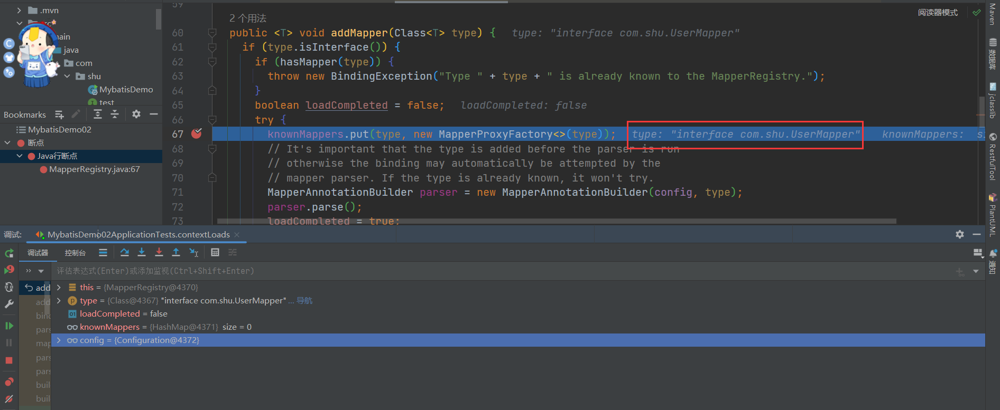

官网：[mybatis – MyBatis 3 | 简介](https://mybatis.org/mybatis-3/zh/index.html)
在上篇文章末尾，我们解析Mapper 文件，这篇文件我们来看看Mapper的详细解析过程，相对于其他文件的解析Mapper文件的解析过程比较复杂，所以单独用一篇文件来解析。废话不多说我们来看看。

> 学习的知识？

1. `Mybatis`的`SQL`映射语句的配置方式
2. 接口的动态代理
3. `XMLMapperBuilder`类来解析`Mapper.xml`文件

> 过程梳理

1. 首先判断我们的配置方式，`package， resource、url、class`
2. 如果是包扫描，通过配置的`name`属性获取包路径，通过`configuration`中的映射注册表注册接口方法，生成代理接口对象，配置到`configuration`中的`MapperRegistry`中
3. 如果是其他三种方式，只能选择其中一种方式进行配置，通过`XMLMapperBuilder`来解析配置文件
4. 首先通过`Resources`类来加载配置文件，创建`XMLMapperBuilder`对接进行对XML文件的处理
5. 接着调用`configurationElement`方法，注意必须以`/mapper`开头的`XML`文件，开始解析文件
6. 第一步解析我们命名的表空间，`namespace`，并设置当前命名空间
7. 第二步解析`cache-ref`元素，主要为了共享缓存，具体参考官网
8. 第三步解析`<cache>`元素，主要是缓存配置，具体参考官网
9. 第四步解析`/mapper/parameterMap`元素，未来版本会移除
10. 第五步解析`/mapper/resultMap`元素，主要完成数据库对象与JAVA对象的类型转换
11. 第六步解析`/mapper/sql`元素，主要是我们定义的一些可以复用的`Sql`片段
12. 第七步解析`select|insert|update|delete`元素，主要解析我们编写的`DDL`语句，通过`XMLStatementBuilder`类的帮助下解析各种语句，生成`MappedStatement`隐式语句
13. 最后完成了`Configuration`类的全部初始化，方便后面参数配置的调用

# 一 Mapper的使用

参考官方网站：[https://mybatis.org/mybatis-3/zh/configuration.html#mapper](https://mybatis.org/mybatis-3/zh/configuration.html#mappers)
既然 MyBatis 的行为已经由上述元素配置完了，我们现在就要来定义 SQL 映射语句了。 但首先，我们需要告诉 MyBatis 到哪里去找到这些语句。 在自动查找资源方面，Java 并没有提供一个很好的解决方案，所以最好的办法是直接告诉 MyBatis 到哪里去找映射文件。 你可以使用相对于类路径的资源引用，或完全限定资源定位符（包括 file:/// 形式的 URL），或类名和包名等。
mappers 标签下有许多 mapper 标签，每一个 mapper 标签中配置的都是一个独立的映射配置文件的路径，配置方式有以下几种。

> Mapper的接口配置

```java
<mappers>
    <mapper class="com.shu.mappers.UserMapper"/>
    ......
</mappers>
```

**注意：**这种方式必须保证接口名（例如UserMapper）和xml名（UserMapper.xml）相同，还必须在同一个包中。因为是通过获取mapper中的class属性，拼接上.xml来读取UserMapper.xml，如果xml文件名不同或者不在同一个包中是无法读取到xml的。
> 相对路径进行配置

```java
<mappers>
    <mapper resource="com/shu/mappers/UserMapper.xml"/>
    ......
</mappers>
```

**注意：**这种方式不用保证同接口同包同名。但是要保证xml中的namespase和对应的接口名相同。
> 接口所在配置（包扫描方式）

```java
<mappers>
    <package name="com.shu.mappers"/>
</mappers>
```

这种方式和第一种方式要求一致，保证接口名（例如UserMapper）和xml名（UserMapper.xml）相同，还必须在同一个包中。
**注意：**以上所有的配置都要保证xml中的namespase和对应的接口名相同。
> 使用完全限定资源定位符（URL）

```java
<mappers>
  <mapper url="file:///var/mappers/AuthorMapper.xml"/>
  <mapper url="file:///var/mappers/BlogMapper.xml"/>
  <mapper url="file:///var/mappers/PostMapper.xml"/>
</mappers>
```

# 二 MapperElement的解析

**XMLConfigBuilder**

```java
  mapperElement(root.evalNode("mappers"));
```

- 我们可以看到mapperElement方法来解析Mappers节点信息，其中就有上门的四种方法，package，url,class,resource来解析我们的Mappers节点信息。

```java
/**
   * 解析mappers节点，例如：
   * <mappers>
   *    <mapper resource="com/github/yeecode/mybatisDemo/UserDao.xml"/>
   *    <package name="com.github.yeecode.mybatisDemo" />
   * </mappers>
   * @param parent mappers节点
   * @throws Exception
   */
  private void mapperElement(XNode parent) throws Exception {

    if (parent != null) {
      for (XNode child : parent.getChildren()) {
          
        // 处理mappers的子节点，即mapper节点或者package节点
        if ("package".equals(child.getName())) { // package节点
          // 取出包的路径,其实就是包路径com.shu.mapper
          String mapperPackage = child.getStringAttribute("name");
          // 全部加入Mappers中
          configuration.addMappers(mapperPackage);
            
        } else {
            
          // resource、url、class这三个属性只有一个生效
          String resource = child.getStringAttribute("resource");
          String url = child.getStringAttribute("url");
          String mapperClass = child.getStringAttribute("class");
            // resource的解析方式
          if (resource != null && url == null && mapperClass == null) {
            ErrorContext.instance().resource(resource);
            // 获取文件的输入流
            InputStream inputStream = Resources.getResourceAsStream(resource);
            // 使用XMLMapperBuilder解析Mapper文件
            XMLMapperBuilder mapperParser = new XMLMapperBuilder(inputStream, configuration, resource, configuration.getSqlFragments());
            mapperParser.parse();
          } 
           // url 解析方式   
          else if (resource == null && url != null && mapperClass == null) {
            ErrorContext.instance().resource(url);
            // 从网络获得输入流
            InputStream inputStream = Resources.getUrlAsStream(url);
            // 使用XMLMapperBuilder解析Mapper文件
            XMLMapperBuilder mapperParser = new XMLMapperBuilder(inputStream, configuration, url, configuration.getSqlFragments());
            mapperParser.parse();
          } 
           // class 解析方式   
          else if (resource == null && url == null && mapperClass != null) {
            // 配置的不是Mapper文件，而是Mapper接口
            Class<?> mapperInterface = Resources.classForName(mapperClass);
            configuration.addMapper(mapperInterface);
          } 
          // 都没有的话，扔出异常
          else {
            throw new BuilderException("A mapper element may only specify a url, resource or class, but not more than one.");
          }
        }
      }
    }
  }
```

在 MyBatis 中，共有四种加载映射文件或信息的方式。第一种是从文件系统中加载映射文件；第二种是通过 URL 的方式加载和解析映射文件；第三种是通过 mapper 接口加载映射信息，映射信息可以配置在注解中，也可以配置在映射文件中。最后一种是通过包扫描的方式获取到某个包下的所有类，并使用第三种方式为每个类解析映射信息。

- 首先我们来看看包扫描的方式？交给映射器注册进行注册？，我们的目的通过我们的配置文件比如：com.shu.mapper获取到该包下面的接口信息？

**Configuration**

```java
// 全部加入Mappers中
configuration.addMappers(mapperPackage);


 public void addMappers(String packageName) {
    mapperRegistry.addMappers(packageName);
  }

```

- 我们可以看到调用了mapperRegistry#addMappers（）方法，我们来看看mapperRegistry这个类

**MapperRegistry**

```java

public class MapperRegistry {

  private final Configuration config;
    // 知道的Mapper 接口信息存储在knownMappers中
  private final Map<Class<?>, MapperProxyFactory<?>> knownMappers = new HashMap<>();

    
  public MapperRegistry(Configuration config) {
    this.config = config;
  }

// 添加方法，主要是通过ResolverUtil扫描报下的所有mapper接口信息
public void addMappers(String packageName, Class<?> superType) {
    // `ResolverUtil`是一个能够筛选出某个路径下满足指定条件的所有类的工具类
    ResolverUtil<Class<?>> resolverUtil = new ResolverUtil<>();
    // 筛选出某个包下Object的子类，其实就是包下所有类
    resolverUtil.find(new ResolverUtil.IsA(superType), packageName);
    // 拿到符合条件的类集合
    Set<Class<? extends Class<?>>> mapperSet = resolverUtil.getClasses();
    for (Class<?> mapperClass : mapperSet) {
      addMapper(mapperClass);
    }
  }


 // 获取方法 主要动态代理的时候使用
    public <T> T getMapper(Class<T> type, SqlSession sqlSession) {
    final MapperProxyFactory<T> mapperProxyFactory = (MapperProxyFactory<T>) knownMappers.get(type);
    if (mapperProxyFactory == null) {
      throw new BindingException("Type " + type + " is not known to the MapperRegistry.");
    }
    try {
      return mapperProxyFactory.newInstance(sqlSession);
    } catch (Exception e) {
      throw new BindingException("Error getting mapper instance. Cause: " + e, e);
    }
  }

}
```

- 调用ResolverUtil#find方法找到Mapper接口对象

**ResolverUtil**

```java
 /** The set of matches being accumulated. */
  private Set<Class<? extends T>> matches = new HashSet<>();


 /**
   * 筛选出指定路径下符合一定条件的类
   * @param test 测试条件
   * @param packageName 路径
   * @return ResolverUtil本身
   */
  public ResolverUtil<T> find(Test test, String packageName) {
    // 获取起始包路径
    String path = getPackagePath(packageName);
    try {
      // 找出包中的各个文件，其实就是通过 VFS（虚拟文件系统）获取指定包下的所有文件的Class，也就是所有的Mapper接口，
      List<String> children = VFS.getInstance().list(path);
      for (String child : children) {
        // 对类文件进行测试
        if (child.endsWith(".class")) { // 必须是类文件
          // 测试是否满足测试条件。如果满足，则将该类文件记录下来
          addIfMatching(test, child);
        }
      }
    } catch (IOException ioe) {
      log.error("Could not read package: " + packageName, ioe);
    }
    return this;
  }


  /**
   * 判断一个类文件是否满足条件。如果满足则记录下来
   * @param test 测试条件
   * @param fqn 类文件全名
   */
  @SuppressWarnings("unchecked")
  protected void addIfMatching(Test test, String fqn) {
    try {
      // 转化为外部名称
      String externalName = fqn.substring(0, fqn.indexOf('.')).replace('/', '.');
      // 类加载器
      ClassLoader loader = getClassLoader();
      if (log.isDebugEnabled()) {
        log.debug("Checking to see if class " + externalName + " matches criteria [" + test + "]");
      }
      // 加载类文件
      Class<?> type = loader.loadClass(externalName);
      if (test.matches(type)) { // 执行测试
        // 测试通过则记录到matches属性中
        matches.add((Class<T>) type);
      }
    } catch (Throwable t) {
      log.warn("Could not examine class '" + fqn + "'" + " due to a " +
          t.getClass().getName() + " with message: " + t.getMessage());
    }
  }
}


```

- 我们可以看到通过我们配置的接口的信息：比如com.shu.mapper，的字符串包信息，通过VFS以及类加载器拿到对应的Mapper接口信息，添加到matches之中，并返回给调用者

**MapperRegistry**

```java
// 已知的所有映射
// key:mapperInterface,即dao的数据库接口，不是方法
// value:MapperProxyFactory,即映射器代理工厂
private final Map<Class<?>, MapperProxyFactory<?>> knownMappers = new HashMap<>();


public <T> void addMapper(Class<T> type) {
    // 要加入的肯定是接口，否则不添加
    if (type.isInterface()) {
      // 加入的是接口
      if (hasMapper(type)) {
        // 如果添加重复
        throw new BindingException("Type " + type + " is already known to the MapperRegistry.");
      }
      boolean loadCompleted = false;
      try {
        knownMappers.put(type, new MapperProxyFactory<>(type));
        // It's important that the type is added before the parser is run
        // otherwise the binding may automatically be attempted by the
        // mapper parser. If the type is already known, it won't try.
        MapperAnnotationBuilder parser = new MapperAnnotationBuilder(config, type);
        parser.parse();
        loadCompleted = true;
      } finally {
        if (!loadCompleted) {
          knownMappers.remove(type);
        }
      }
    }
  }

```

- 通过ResolverUtil中的方法我们已经找到的我们写的接口信息并添加到knownMappers中，下面我们需要对

mapper.xml中的信息进行解析，因此调用了MapperAnnotationBuilder#parse（）方法进行解析
**MapperAnnotationBuilder**

```java
/**
   * 解析包含注解的接口文档
   */
  public void parse() {
    String resource = type.toString();
    // 防止重复分析
    if (!configuration.isResourceLoaded(resource)) {
      // 寻找类名对应的resource路径下是否有xml配置，如果有则解析掉。这样就支持注解和xml混合使用
      loadXmlResource();
      // 记录资源路径
      configuration.addLoadedResource(resource);
      // 设置命名空间
      assistant.setCurrentNamespace(type.getName());
      // 处理缓存
      parseCache();
      parseCacheRef();
      Method[] methods = type.getMethods();
      for (Method method : methods) {
        try {
          // 排除桥接方法
          // JDK 1.5 引入泛型后，为了使Java的泛型方法生成的字节码和 1.5 版本前的字节码相兼容，由编译器自动生成的方法，这个就是桥接方法。
          // 就是说一个子类在继承（或实现）一个父类（或接口）的泛型方法时，在子类中明确指定了泛型类型，那么在编译时编译器会自动生成桥接方法
          if (!method.isBridge()) {
            // 解析该方法
            parseStatement(method);
          }
        } catch (IncompleteElementException e) {
          // 解析异常的方法暂存起来
          configuration.addIncompleteMethod(new MethodResolver(this, method));
        }
      }
    }
    // 处理解析异常的方法
    parsePendingMethods();
  }


// 加载对应的mapper.xml文件
 private void loadXmlResource() {
    // Spring may not know the real resource name so we check a flag
    // to prevent loading again a resource twice
    // this flag is set at XMLMapperBuilder#bindMapperForNamespace
    if (!configuration.isResourceLoaded("namespace:" + type.getName())) {
      String xmlResource = type.getName().replace('.', '/') + ".xml";
      // #1347
      InputStream inputStream = type.getResourceAsStream("/" + xmlResource);
      if (inputStream == null) {
        // Search XML mapper that is not in the module but in the classpath.
        try {
          inputStream = Resources.getResourceAsStream(type.getClassLoader(), xmlResource);
        } catch (IOException e2) {
          // ignore, resource is not required
        }
      }
      if (inputStream != null) {
        XMLMapperBuilder xmlParser = new XMLMapperBuilder(inputStream, assistant.getConfiguration(), xmlResource, configuration.getSqlFragments(), type.getName());
        xmlParser.parse();
      }
    }
  }


/**
   * 解析Mapper.xml文件
   */
  public void parse() {
    // 该节点是否被解析过，。或将加载过
    if (!configuration.isResourceLoaded(resource)) {
      // 处理mapper节点
      configurationElement(parser.evalNode("/mapper"));
      // 加入到已经解析的列表，防止重复解析
      configuration.addLoadedResource(resource);
      // 将mapper注册给Configuration
      bindMapperForNamespace();
    }

    // 下面分别用来处理失败的<resultMap>、<cache-ref>、SQL语句
    parsePendingResultMaps();
    parsePendingCacheRefs();
    parsePendingStatements();
  }
```

- MapperAnnotationBuilder它的职责很简单，就是解析指定的mapper接口对应的Class对象中，包含的所有[mybatis](https://so.csdn.net/so/search?q=mybatis&spm=1001.2101.3001.7020)框架中定义的注解，并生成Cache、ResultMap、MappedStatement三种类型对象。

**MapperAnnotationBuilder**

```java
public class MapperAnnotationBuilder {

    // 语句注释类型
  private static final Set<Class<? extends Annotation>> statementAnnotationTypes = Stream
      .of(Select.class, Update.class, Insert.class, Delete.class, SelectProvider.class, UpdateProvider.class,
          InsertProvider.class, DeleteProvider.class)
      .collect(Collectors.toSet());
 // 配置信息
  private final Configuration configuration;
 // MapperBuilder的辅助类
  private final MapperBuilderAssistant assistant;
  // 传入mapper接口类  
  private final Class<?> type;

 // 构造方法
  public MapperAnnotationBuilder(Configuration configuration, Class<?> type) {
    // 把“.”换成“/”就从类名得到了Mapper的路径，当然，只是猜测。因为这是规范
    String resource = type.getName().replace('.', '/') + ".java (best guess)";
    this.assistant = new MapperBuilderAssistant(configuration, resource);
    this.configuration = configuration;
    this.type = type;
  }
}
```

- 接下来我们来看看MapperBuilderAssistant这个类

**MapperBuilderAssistant**

```java
public class MapperBuilderAssistant extends BaseBuilder {
  // 当前Mapper接口的命名空间
  private String currentNamespace;
  // Mapper接口文件的路径
  private final String resource;
  // 当前Mapper的缓存
  private Cache currentCache;
  // 共享的其他命名空间缓存是否还没解析成功
  private boolean unresolvedCacheRef; // issue #676

  public MapperBuilderAssistant(Configuration configuration, String resource) {
    super(configuration);
    ErrorContext.instance().resource(resource);
    this.resource = resource;
  }
}
```

- MapperBuilderAssistant作为MapperAnnotationBuilder的辅助类，十分重要，我们看看他的重要方法

**MapperBuilderAssistant**

```java
  /**
   * 设置当前的namespace,只允许设置一次不允许修改
   * @param currentNamespace 当前的namespace
   */
  public void setCurrentNamespace(String currentNamespace) {
    if (currentNamespace == null) {
      throw new BuilderException("The mapper element requires a namespace attribute to be specified.");
    }

    if (this.currentNamespace != null && !this.currentNamespace.equals(currentNamespace)) {
      throw new BuilderException("Wrong namespace. Expected '"
          + this.currentNamespace + "' but found '" + currentNamespace + "'.");
    }

    this.currentNamespace = currentNamespace;
  }


  /**
   * 使用当前的命名空间来确定base的命名空间
   * @param base 一个路径
   * @param isReference 是否参考当前命名空间
   * @return 在当前命名空间基础上的路径
   */
  public String applyCurrentNamespace(String base, boolean isReference) {
    if (base == null) {
      return null;
    }
    if (isReference) {
      // is it qualified with any namespace yet?
      if (base.contains(".")) {
        return base;
      }
    } else {
      // is it qualified with this namespace yet?
      if (base.startsWith(currentNamespace + ".")) {
        return base;
      }
      if (base.contains(".")) {
        throw new BuilderException("Dots are not allowed in element names, please remove it from " + base);
      }
    }
    return currentNamespace + "." + base;
  }


 /**
   * 使用其他namespace的缓存
   * @param namespace 其他的namespace
   * @return  其他namespace的缓存
   */
  public Cache useCacheRef(String namespace) {
    if (namespace == null) {
      throw new BuilderException("cache-ref element requires a namespace attribute.");
    }
    try {
      unresolvedCacheRef = true;
      // 获取其他namespace的缓存
      Cache cache = configuration.getCache(namespace);
      if (cache == null) {
        throw new IncompleteElementException("No cache for namespace '" + namespace + "' could be found.");
      }
      // 修改当前缓存为其他namespace的缓存，从而实现缓存共享
      currentCache = cache;
      unresolvedCacheRef = false;
      return cache;
    } catch (IllegalArgumentException e) {
      throw new IncompleteElementException("No cache for namespace '" + namespace + "' could be found.", e);
    }
  }


/**
   * 创建一个新的缓存
   * @param typeClass 缓存的实现类
   * @param evictionClass 缓存的清理类，即使用哪种包装类来清理缓存
   * @param flushInterval 缓存清理时间间隔
   * @param size 缓存大小
   * @param readWrite 缓存是否支持读写
   * @param blocking 缓存是否支持阻塞
   * @param props 缓存配置属性
   * @return 缓存
   */
  public Cache useNewCache(Class<? extends Cache> typeClass,
      Class<? extends Cache> evictionClass,
      Long flushInterval,
      Integer size,
      boolean readWrite,
      boolean blocking,
      Properties props) {
    Cache cache = new CacheBuilder(currentNamespace)
        .implementation(valueOrDefault(typeClass, PerpetualCache.class))
        .addDecorator(valueOrDefault(evictionClass, LruCache.class))
        .clearInterval(flushInterval)
        .size(size)
        .readWrite(readWrite)
        .blocking(blocking)
        .properties(props)
        .build();
    configuration.addCache(cache);
    currentCache = cache;
    return cache;
  }


 /**
   * 创建一个详细的参数映射
   * 相关入参请参照ParameterMapping的属性注释
   * @return 参数映射
   */
  public ParameterMapping buildParameterMapping(
      Class<?> parameterType,
      String property,
      Class<?> javaType,
      JdbcType jdbcType,
      String resultMap,
      ParameterMode parameterMode,
      Class<? extends TypeHandler<?>> typeHandler,
      Integer numericScale) {
    resultMap = applyCurrentNamespace(resultMap, true);

    // Class parameterType = parameterMapBuilder.type();
    Class<?> javaTypeClass = resolveParameterJavaType(parameterType, property, javaType, jdbcType);
    TypeHandler<?> typeHandlerInstance = resolveTypeHandler(javaTypeClass, typeHandler);

    return new ParameterMapping.Builder(configuration, property, javaTypeClass)
        .jdbcType(jdbcType)
        .resultMapId(resultMap)
        .mode(parameterMode)
        .numericScale(numericScale)
        .typeHandler(typeHandlerInstance)
        .build();
  }

  /**
   * 创建结果映射对象
   * 入参参照ResultMap属性
   * @return ResultMap对象
   */
  public ResultMap addResultMap(
      String id,
      Class<?> type,
      String extend,
      Discriminator discriminator,
      List<ResultMapping> resultMappings,
      Boolean autoMapping) {
    id = applyCurrentNamespace(id, false);
    extend = applyCurrentNamespace(extend, true);

    // 解析ResultMap的继承关系
    if (extend != null) { // 如果存在ResultMap的继承
      if (!configuration.hasResultMap(extend)) {
        throw new IncompleteElementException("Could not find a parent resultmap with id '" + extend + "'");
      }
      // 获取父级的ResultMap
      ResultMap resultMap = configuration.getResultMap(extend);
      // 获取父级的属性映射
      List<ResultMapping> extendedResultMappings = new ArrayList<>(resultMap.getResultMappings());
      // 删除当前ResultMap中已有的父级属性映射，为当前属性映射覆盖父级属性属性创造条件
      extendedResultMappings.removeAll(resultMappings);
      // 如果当前ResultMap设置有构建器，则移除父级构建器
      boolean declaresConstructor = false;
      for (ResultMapping resultMapping : resultMappings) {
        if (resultMapping.getFlags().contains(ResultFlag.CONSTRUCTOR)) {
          declaresConstructor = true;
          break;
        }
      }
      if (declaresConstructor) {
        extendedResultMappings.removeIf(resultMapping -> resultMapping.getFlags().contains(ResultFlag.CONSTRUCTOR));
      }
      // 最终从父级继承而来的所有属性映射
      resultMappings.addAll(extendedResultMappings);
    }
    // 创建当前的ResultMap
    ResultMap resultMap = new ResultMap.Builder(configuration, id, type, resultMappings, autoMapping)
        .discriminator(discriminator)
        .build();
    // 将当期的ResultMap加入到Configuration
    configuration.addResultMap(resultMap);
    return resultMap;
  }
```

- 接下来我们继续看MapperAnnotationBuilder#parse（）方法

**MapperAnnotationBuilder**

```java
/**
   * 解析包含注解的接口文档
   */
  public void parse() {
    String resource = type.toString();
    // 防止重复分析
    if (!configuration.isResourceLoaded(resource)) {
      // 寻找类名对应的resource路径下是否有xml配置，如果有则解析掉。这样就支持注解和xml混合使用
      loadXmlResource();
      // 记录资源路径
      configuration.addLoadedResource(resource);
      // 设置命名空间
      assistant.setCurrentNamespace(type.getName());
      // 处理缓存
      parseCache();
      parseCacheRef();
      Method[] methods = type.getMethods();
      for (Method method : methods) {
        try {
          // 排除桥接方法
          // JDK 1.5 引入泛型后，为了使Java的泛型方法生成的字节码和 1.5 版本前的字节码相兼容，由编译器自动生成的方法，这个就是桥接方法。
          // 就是说一个子类在继承（或实现）一个父类（或接口）的泛型方法时，在子类中明确指定了泛型类型，那么在编译时编译器会自动生成桥接方法
          if (!method.isBridge()) {
            // 解析该方法
            parseStatement(method);
          }
        } catch (IncompleteElementException e) {
          // 解析异常的方法暂存起来
          configuration.addIncompleteMethod(new MethodResolver(this, method));
        }
      }
    }
    // 处理解析异常的方法
    parsePendingMethods();
  }
```

- 下面调用loadXmlResource（）方法，调用Resources类的方法来加载我们写的Mapper.xml文件交给XMLMapperBuilder进行解析

```java
  private void loadXmlResource() {
    // Spring may not know the real resource name so we check a flag
    // to prevent loading again a resource twice
    // this flag is set at XMLMapperBuilder#bindMapperForNamespace
    if (!configuration.isResourceLoaded("namespace:" + type.getName())) {
      String xmlResource = type.getName().replace('.', '/') + ".xml";
      // #1347
      InputStream inputStream = type.getResourceAsStream("/" + xmlResource);
      if (inputStream == null) {
        // Search XML mapper that is not in the module but in the classpath.
        try {
          inputStream = Resources.getResourceAsStream(type.getClassLoader(), xmlResource);
        } catch (IOException e2) {
          // ignore, resource is not required
        }
      }
      if (inputStream != null) {
          // 构建XMLMapperBuilder
        XMLMapperBuilder xmlParser = new XMLMapperBuilder(inputStream, assistant.getConfiguration(), xmlResource, configuration.getSqlFragments(), type.getName());
          // 调用解析方法
        xmlParser.parse();
      }
    }
  }
```

我们回顾一下之前的知识：

●**XMLConfigBuilder：**解析mybatis配置文件
●**XMLMapperBuilder：**解析mybatis映射文件
●**MapperBuilderAssistant**：XMLMapperBuilder的帮助类
●**XMLStatementBuilder：**解析映射文件中的sql语句标签insert|update|delete|select
●**XMLScriptBuilder：** SQL语句在XML文件中，处理动态SQL语句标签
●**SQLSourceBuilder**：在RawSqlSource使用

- 我们来看看**XMLMapperBuilder的构造方法**

**XMLMapperBuilder**

```java
 public XMLMapperBuilder(InputStream inputStream, Configuration configuration, String resource, Map<String, XNode> sqlFragments, String namespace) {
    this(inputStream, configuration, resource, sqlFragments);
     // 设置当前命名空间，不可修改
    this.builderAssistant.setCurrentNamespace(namespace);
  }

// 调用重载方法
private XMLMapperBuilder(XPathParser parser, Configuration configuration, String resource, Map<String, XNode> sqlFragments) {
    super(configuration);
    this.builderAssistant = new MapperBuilderAssistant(configuration, resource);
    this.parser = parser;
    this.sqlFragments = sqlFragments;
    this.resource = resource;
  }

/**
   * 解析Mapper文件
   */
  public void parse() {
    // 该节点是否被解析过
    if (!configuration.isResourceLoaded(resource)) {
      // 处理mapper节点
      configurationElement(parser.evalNode("/mapper"));
      // 加入到已经解析的列表，防止重复解析
      configuration.addLoadedResource(resource);
      // 将mapper注册给Configuration
      bindMapperForNamespace();
    }

    // 下面分别用来处理失败的<resultMap>、<cache-ref>、SQL语句
    parsePendingResultMaps();
    parsePendingCacheRefs();
    parsePendingStatements();
  }
```

- 接下来与前面一样解析Xml文件中的节点信息，填充给configuration，方便系统后面使用

**XMLMapperBuilder**

```java
  /**
   * 解析Mapper文件的下层节点
   * @param context Mapper文件的根节点
   */
  private void configurationElement(XNode context) {
    try {
      // 读取当前Mapper文件的命名空间mapper.EmployeeMapper
      String namespace = context.getStringAttribute("namespace");
      if (namespace == null || namespace.equals("")) {
        throw new BuilderException("Mapper's namespace cannot be empty");
      }
      // 绑定当前命名空间
      builderAssistant.setCurrentNamespace(namespace);
      // mapper文件中其他配置节点的解析
      // 解析cache-ref节点
      cacheRefElement(context.evalNode("cache-ref"));
      // 解析cache节点
      cacheElement(context.evalNode("cache"));
      // 解析parameterMap节点
      parameterMapElement(context.evalNodes("/mapper/parameterMap"));
      // 解析resultMap节点
      resultMapElements(context.evalNodes("/mapper/resultMap"));
      // 解析sql
      sqlElement(context.evalNodes("/mapper/sql"));
      // 处理各个数据库操作语句
      buildStatementFromContext(context.evalNodes("select|insert|update|delete"));
    } catch (Exception e) {
      throw new BuilderException("Error parsing Mapper XML. The XML location is '" + resource + "'. Cause: " + e, e);
    }
  }
```

- 接下里我们依次来看看如何解析节点信息，关于缓存的那一块，后面会文章详细介绍Cache


# 三 解析cache-ref节点

参考官网：[mybatis – MyBatis 3 | XML 映射器](https://mybatis.org/mybatis-3/zh/sqlmap-xml.html#cache-ref)
对某一命名空间的语句，只会使用该命名空间的缓存进行缓存或刷新。 但你可能会想要在多个命名空间中共享相同的缓存配置和实例。要实现这种需求，你可以使用 cache-ref 元素来引用另一个缓存。

```java
<cache-ref namespace="com.someone.application.data.SomeMapper"/>
```

XMLMapperBuilder

```java
  private void cacheRefElement(XNode context) {
    if (context != null) {
      // 传入当前命令空间，配置的namespace属性：eg: com.shu.UserMapper
      configuration.addCacheRef(builderAssistant.getCurrentNamespace(), context.getStringAttribute("namespace"));
      // 缓存引用解析器
      CacheRefResolver cacheRefResolver = new CacheRefResolver(builderAssistant, context.getStringAttribute("namespace"));
      try {
          //解析缓存引用
        cacheRefResolver.resolveCacheRef();
      } catch (IncompleteElementException e) {
          
        configuration.addIncompleteCacheRef(cacheRefResolver);
      }
    }
  }
```

- 创建缓存解析器，来解析缓存引用，实际上调用了MapperBuilderAssistant#useCacheRef（）方法来达到缓存的共享

**MapperBuilderAssistant**

```java
/**
   * 使用其他namespace的缓存
   * @param namespace 其他的namespace
   * @return  其他namespace的缓存
   */
  public Cache useCacheRef(String namespace) {
    if (namespace == null) {
      throw new BuilderException("cache-ref element requires a namespace attribute.");
    }
    try {
      unresolvedCacheRef = true;
      // 获取其他namespace的缓存
      Cache cache = configuration.getCache(namespace);
      if (cache == null) {
        throw new IncompleteElementException("No cache for namespace '" + namespace + "' could be found.");
      }
      // 修改当前缓存为其他namespace的缓存，从而实现缓存共享
      currentCache = cache;
      unresolvedCacheRef = false;
      return cache;
    } catch (IllegalArgumentException e) {
      throw new IncompleteElementException("No cache for namespace '" + namespace + "' could be found.", e);
    }
  }
```

具体是实现细节我们后面在一级缓存，二级缓存中文字会详细介绍

# 四 解析Cache节点

官网：[mybatis – MyBatis 3 | XML 映射器](https://mybatis.org/mybatis-3/zh/sqlmap-xml.html#%E7%BC%93%E5%AD%98)
MyBatis 内置了一个强大的事务性查询缓存机制，它可以非常方便地配置和定制。 为了使它更加强大而且易于配置，我们对 MyBatis 3 中的缓存实现进行了许多改进。
默认情况下，只启用了本地的会话缓存，它仅仅对一个会话中的数据进行缓存。 要启用全局的二级缓存，只需要在你的 SQL 映射文件中添加一行：

```java
<cache/>
```

这个简单语句的效果如下:

- 映射语句文件中的所有 select 语句的结果将会被缓存。
- 映射语句文件中的所有 insert、update 和 delete 语句会刷新缓存。
- 缓存会使用最近最少使用算法（LRU, Least Recently Used）算法来清除不需要的缓存。
- 缓存不会定时进行刷新（也就是说，没有刷新间隔）。
- 缓存会保存列表或对象（无论查询方法返回哪种）的 1024 个引用。
- 缓存会被视为读/写缓存，这意味着获取到的对象并不是共享的，可以安全地被调用者修改，而不干扰其他调用者或线程所做的潜在修改。

也可以使用第三方缓存

```java
<cache type="org.mybatis.caches.redis.RedisCache"/>
```

其中有一些属性可以选择

```java
<cache eviction="LRU"  flushInterval="60000"  size="512" readOnly="true"/>
```

1. 根据数据的历史访问记录来进行淘汰数据，其核心思想是“如果数据最近被访问过，那么将来被访问的几率也更高”
2. 缓存的容量为 512 个对象引用
3. 缓存每隔60秒刷新一次
4. 缓存返回的对象是写安全的，即在外部修改对象不会影响到缓存内部存储对象

eviction可用的清除策略有：

- LRU – 最近最少使用：移除最长时间不被使用的对象。
- FIFO – 先进先出：按对象进入缓存的顺序来移除它们。
- SOFT – 软引用：基于垃圾回收器状态和软引用规则移除对象。
- WEAK – 弱引用：更积极地基于垃圾收集器状态和弱引用规则移除对象。

默认的清除策略是 LRU。
flushInterval（刷新间隔）属性可以被设置为任意的正整数，设置的值应该是一个以毫秒为单位的合理时间量。 默认情况是不设置，也就是没有刷新间隔，缓存仅仅会在调用语句时刷新。
size（引用数目）属性可以被设置为任意正整数，要注意欲缓存对象的大小和运行环境中可用的内存资源。默认值是 1024。
readOnly（只读）属性可以被设置为 true 或 false。只读的缓存会给所有调用者返回缓存对象的相同实例。 因此这些对象不能被修改。这就提供了可观的性能提升。而可读写的缓存会（通过序列化）返回缓存对象的拷贝。 速度上会慢一些，但是更安全，因此默认值是 false。
**XMLMapperBuilder**

```java
 // <mapper namespace="com.example.demo.UserDao">
  //    <cache
  //            eviction="FIFO"
  //            flushInterval="60000"
  //            size="512"
  //            readOnly="true"/>
  //    <select id="selectUser" resultType="com.example.demo.UserBean">
  //    select * from `user` where id = #{id}
  //  </select>
  //</mapper>

  // 这里处理其中的<cache>节点
  private void cacheElement(XNode context) {
    if (context != null) {
      //  获取type属性，如果type没有指定就用默认的PERPETUAL(早已经注册过的别名的PerpetualCache)
      String type = context.getStringAttribute("type", "PERPETUAL");
      根据type从早已经注册的别名中获取对应的Class,PERPETUAL对应的Class是PerpetualCache.class
        // 如果我们写了type属性，如type="org.mybatis.caches.redis.RedisCache"，这里将会得到RedisCache.class
      Class<? extends Cache> typeClass = typeAliasRegistry.resolveAlias(type);
      //  //获取淘汰方式，默认为LRU(早已经注册过的别名的LruCache)，最近最少使用到的先淘汰
      String eviction = context.getStringAttribute("eviction", "LRU");
      Class<? extends Cache> evictionClass = typeAliasRegistry.resolveAlias(eviction);
      // 解析刷新间隔
      Long flushInterval = context.getLongAttribute("flushInterval");
      // 大小
      Integer size = context.getIntAttribute("size");
      // 是否只读
      boolean readWrite = !context.getBooleanAttribute("readOnly", false);
    
      boolean blocking = context.getBooleanAttribute("blocking", false);
       // 获取子节点配置
        Properties props = context.getChildrenAsProperties();
        // 构建缓存对象
        builderAssistant.useNewCache(typeClass, evictionClass, flushInterval, size, readWrite, blocking, props);
    }
  }

```

- 从上面我们需要在配置文件中读取常见缓存的必要条件，从而创建一个新的缓存对象，我们首先来看看他是如何在typeAliasRegistry中获取在注册的对象？

```java
 registerAlias("map", Map.class);
// 通过注册的别名来获取在typeAliasRegistry注册的对象
public <T> Class<T> resolveAlias(String string) {
    try {
      if (string == null) {
        return null;
      }
      // issue #748
      String key = string.toLowerCase(Locale.ENGLISH);
      Class<T> value;
       // 是否注册过 
      if (typeAliases.containsKey(key)) {
        value = (Class<T>) typeAliases.get(key);
      }
       // 没有的话交给Resources来查找
      else {
        value = (Class<T>) Resources.classForName(string);
      }
      return value;
    } catch (ClassNotFoundException e) {
      throw new TypeException("Could not resolve type alias '" + string + "'.  Cause: " + e, e);
    }
  }
```

- 通过typeAliasRegistry#resolveAlias（）方法 ，我们拿到了构建先缓存的必要条件

**MapperBuilderAssistant**

```java
/**
   * 创建一个新的缓存
   * @param typeClass 缓存的实现类
   * @param evictionClass 缓存的清理类，即使用哪种包装类来清理缓存
   * @param flushInterval 缓存清理时间间隔
   * @param size 缓存大小
   * @param readWrite 缓存是否支持读写
   * @param blocking 缓存是否支持阻塞
   * @param props 缓存配置属性
   * @return 缓存
   */
  public Cache useNewCache(Class<? extends Cache> typeClass,
      Class<? extends Cache> evictionClass,
      Long flushInterval,
      Integer size,
      boolean readWrite,
      boolean blocking,
      Properties props) {
      // 当前命令空间
    Cache cache = new CacheBuilder(currentNamespace)
        .implementation(valueOrDefault(typeClass, PerpetualCache.class))
        .addDecorator(valueOrDefault(evictionClass, LruCache.class))
        .clearInterval(flushInterval)
        .size(size)
        .readWrite(readWrite)
        .blocking(blocking)
        .properties(props)
        .build();
    configuration.addCache(cache);
    currentCache = cache;
    return cache;
  }
```

- 上面使用了建造模式构建 Cache 实例?

**CacheBuilder**

```java
public class CacheBuilder {
  // Cache的编号
  private final String id;
  // Cache的实现类
  private Class<? extends Cache> implementation;
  // Cache的装饰器列表
  private final List<Class<? extends Cache>> decorators;
  // Cache的大小
  private Integer size;
  // Cache的清理间隔
  private Long clearInterval;
  // Cache是否可读写
  private boolean readWrite;
  // Cache的配置信息
  private Properties properties;
  // Cache是否阻塞
  private boolean blocking;


/**
   * 组建缓存
   * @return 缓存对象
   */
  public Cache build() {
    // 设置缓存的默认实现、默认装饰器（仅设置，并未装配）PerpetualCache
    setDefaultImplementations();
    // 创建默认的缓存
    Cache cache = newBaseCacheInstance(implementation, id);
    // 设置缓存的属性
    setCacheProperties(cache);
    if (PerpetualCache.class.equals(cache.getClass())) { // 缓存实现是PerpetualCache，即不是用户自定义的缓存实现
      // 为缓存逐级嵌套自定义的装饰器
      for (Class<? extends Cache> decorator : decorators) {
        // 生成装饰器实例，并装配。入参依次是装饰器类、被装饰的缓存
        cache = newCacheDecoratorInstance(decorator, cache);
        // 为装饰器设置属性
        setCacheProperties(cache);
      }
      // 为缓存增加标准的装饰器
      cache = setStandardDecorators(cache);
    } else if (!LoggingCache.class.isAssignableFrom(cache.getClass())) {
      // 增加日志装饰器
      cache = new LoggingCache(cache);
    }
    // 返回被包装好的缓存
    return cache;
  }


private void setDefaultImplementations() {
    if (this.implementation == null) {
        //设置默认缓存类型为PerpetualCache
        this.implementation = PerpetualCache.class;
        if (this.decorators.isEmpty()) {
            this.decorators.add(LruCache.class);
        }
    }
}


private Cache newBaseCacheInstance(Class<? extends Cache> cacheClass, String id) {
    //获取构造器
    Constructor cacheConstructor = this.getBaseCacheConstructor(cacheClass);
    try {
        //通过构造器实例化Cache
        return (Cache)cacheConstructor.newInstance(id);
    } catch (Exception var5) {
        throw new CacheException("Could not instantiate cache implementation (" + cacheClass + "). Cause: " + var5, var5);
    }
}

}

```

- 如上就创建好了一个Cache的实例，然后把它添加到Configuration中，并且设置到currentCache属性中，这个属性后面还要使用，也就是Cache实例后面还要使用，我们后面再看。

# 五 解析ParameterMap节点

       ParameterMap和resultMap类似，表示将查询结果集中列值的类型一一映射到java对象属性的类型上，在开发过程中不推荐这种方式。
    一般使用parameterType直接将查询结果列值类型自动对应到java对象属性类型上，不再配置映射关系一一对应，例如上述代码中下划线部分表示将查询结果类型自动对应到hdu.terence.bean.Message的Bean对象属性类型。（这里我们就 不解析了，我们重点来看看ResultMap）

```java
    <parameterMap class="java.util.Map" id="query_some_param">  
        <parameter property="firstName" javaType="java.lang.String" jdbcType="VARCHAR"/>  
        <parameter property="lastName" javaType="java.lang.String" jdbcType="VARCHAR"/>  
    </parameterMap>  
```


# 六 解析ResultMap节点

参考官网：[mybatis – MyBatis 3 | XML 映射器](https://mybatis.org/mybatis-3/zh/sqlmap-xml.html#%E7%BB%93%E6%9E%9C%E6%98%A0%E5%B0%84)
resultMap 元素是 MyBatis 中最重要最强大的元素。它可以让你从 90% 的 JDBC ResultSets 数据提取代码中解放出来，并在一些情形下允许你进行一些 JDBC 不支持的操作。实际上，在为一些比如连接的复杂语句编写映射代码的时候，一份 resultMap 能够代替实现同等功能的数千行代码。ResultMap 的设计思想是，对简单的语句做到零配置，对于复杂一点的语句，只需要描述语句之间的关系就行了。

```java
   <resultMap type="com.sundancersystem.model.SysRole" id="SysRoleMap">
        <id column="ROLE_ID" property="roleId"/>
        <result property="roleId" column="ROLE_ID" jdbcType="TINYINT"/>
        <result property="roleName" column="ROLE_NAME" jdbcType="VARCHAR"/>
        <result property="roleValue" column="ROLE_VALUE" jdbcType="VARCHAR"/>
        <result property="roleCreatTime" column="ROLE_CREAT_TIME" jdbcType="DATE"/>
        <result property="roleDelete" column="ROLE_DELETE" jdbcType="TINYINT"/>
    </resultMap>
```

resultMap 主要用于映射结果。通过 resultMap 和自动映射，可以让 MyBatis 帮助我们完成 ResultSet → Object 的映射。
**XMLMapperBuilder**

```java
  private void resultMapElements(List<XNode> list) throws Exception {
      // 遍历节点信息
    for (XNode resultMapNode : list) {
      try {
          // 解析resultMap元素
        resultMapElement(resultMapNode);
      } catch (IncompleteElementException e) {
        // ignore, it will be retried
      }
    }
  

private ResultMap resultMapElement(XNode resultMapNode) throws Exception {
    return resultMapElement(resultMapNode, Collections.emptyList(), null);
  }

      
  private ResultMap resultMapElement(XNode resultMapNode, List<ResultMapping> additionalResultMappings, Class<?> enclosingType) throws Exception {
    ErrorContext.instance().activity("processing " + resultMapNode.getValueBasedIdentifier());
      // 获取type属性
    String type = resultMapNode.getStringAttribute("type",
        resultMapNode.getStringAttribute("ofType",
            resultMapNode.getStringAttribute("resultType",
                resultMapNode.getStringAttribute("javaType"))));
      // 找到获取 type 属性对应的类型，就是我们的实体类对象
    Class<?> typeClass = resolveClass(type);

    if (typeClass == null) {
      typeClass = inheritEnclosingType(resultMapNode, enclosingType);
    }
    Discriminator discriminator = null;
      // 创建ResultMapping集合，对应resultMap子节点的id和result节点
    List<ResultMapping> resultMappings = new ArrayList<>();
    resultMappings.addAll(additionalResultMappings);
    List<XNode> resultChildren = resultMapNode.getChildren();
        // 获取并遍历 <resultMap> 的子节点列表
    for (XNode resultChild : resultChildren) {
        // 用于在实例化类时，注入结果到构造方法中
      if ("constructor".equals(resultChild.getName())) {
        processConstructorElement(resultChild, typeClass, resultMappings);
      } 
       // 使用结果值来决定使用哪个 resultMap
      else if ("discriminator".equals(resultChild.getName())) {
        discriminator = processDiscriminatorElement(resultChild, typeClass, resultMappings);
      } else {
        List<ResultFlag> flags = new ArrayList<>();
         if ("id".equals(resultChild.getName())) {
                // 添加 ID 到 flags 集合中
                flags.add(ResultFlag.ID);
            }
            // 解析 id 和 result 节点，将id或result节点生成相应的 ResultMapping，将ResultMapping添加到resultMappings集合中
            resultMappings.add(buildResultMappingFromContext(resultChild, typeClass, flags));
      }
    }
      // 获取id
    String id = resultMapNode.getStringAttribute("id",
            resultMapNode.getValueBasedIdentifier());
    String extend = resultMapNode.getStringAttribute("extends");
    Boolean autoMapping = resultMapNode.getBooleanAttribute("autoMapping");
      // 创建ResultMapResolver对象
    ResultMapResolver resultMapResolver = new ResultMapResolver(builderAssistant, id, typeClass, extend, discriminator, resultMappings, autoMapping);
    try {
        // 根据前面获取到的信息构建 ResultMap 对象
      return resultMapResolver.resolve();
    } catch (IncompleteElementException  e) {
      configuration.addIncompleteResultMap(resultMapResolver);
      throw e;
    }
  }

      

```

- 我们来看看XMLMapperBuilder#buildResultMappingFromContext（）解析过程

**XMLMapperBuilder**

```java
private ResultMapping buildResultMappingFromContext(XNode context, Class<?> resultType, List<ResultFlag> flags) throws Exception {
    String property;
    // 根据节点类型获取 name 或 property 属性
    if (flags.contains(ResultFlag.CONSTRUCTOR)) {
        // 构造方法形参的名字
        property = context.getStringAttribute("name");
    } else {
        // 映射到列结果的字段或属性
        property = context.getStringAttribute("property");
    }

    // 获取其他各种属性
    // 数据库中的列名
    String column = context.getStringAttribute("column");
    // 一个 Java 类的完全限定名，或一个类型别名（关于内置的类型别名，可以参考上面的表格）
    String javaType = context.getStringAttribute("javaType");
    // JDBC 类型，所支持的 JDBC 类型参见这个表格之前的“支持的 JDBC 类型”。
    String jdbcType = context.getStringAttribute("jdbcType");
    // 用于加载复杂类型属性的映射语句的 ID，它会从 column 属性指定的列中检索数据，作为参数传递给目标 select 语句。
    String nestedSelect = context.getStringAttribute("select");
    
    /*
     * 解析 resultMap 属性，该属性出现在 <association> 和 <collection> 节点中。
     * 若这两个节点不包含 resultMap 属性，则调用 processNestedResultMappings 方法,递归调用resultMapElement解析<association> 和 <collection>的嵌套节点，生成resultMap，并返回resultMap.getId();
     * 如果包含resultMap属性，则直接获取其属性值，这个属性值对应一个resultMap节点
     */
    String nestedResultMap = context.getStringAttribute("resultMap", processNestedResultMappings(context, Collections.<ResultMapping>emptyList()));
    // 默认情况下，在至少一个被映射到属性的列不为空时，子对象才会被创建。
    String notNullColumn = context.getStringAttribute("notNullColumn");
    // 当连接多个表时，你可能会不得不使用列别名来避免在 ResultSet 中产生重复的列名。
    String columnPrefix = context.getStringAttribute("columnPrefix");
    // 我们在前面讨论过默认的类型处理器。
    String typeHandler = context.getStringAttribute("typeHandler");
    // 指定用于加载复杂类型的结果集名字。
    String resultSet = context.getStringAttribute("resultSet");
    // 指定外键对应的列名，指定的列将与父类型中 column 的给出的列进行匹配。
    String foreignColumn = context.getStringAttribute("foreignColumn");
    // 可选的。有效值为 lazy 和 eager。 指定属性后，将在映射中忽略全局配置参数 lazyLoadingEnabled，使用属性的值。
    boolean lazy = "lazy".equals(context.getStringAttribute("fetchType", configuration.isLazyLoadingEnabled() ? "lazy" : "eager"));

    Class<?> javaTypeClass = resolveClass(javaType);
    Class<? extends TypeHandler<?>> typeHandlerClass = (Class<? extends TypeHandler<?>>) resolveClass(typeHandler);
    JdbcType jdbcTypeEnum = resolveJdbcType(jdbcType);

    // 构建 ResultMapping 对象
    return builderAssistant.buildResultMapping(resultType, property, column, javaTypeClass, jdbcTypeEnum, nestedSelect,
        nestedResultMap, notNullColumn, columnPrefix, typeHandlerClass, flags, resultSet, foreignColumn, lazy);
}
```

- 在上面的解析中我们需要重点关注一下复杂结构的嵌套过程，processNestedResultMappings（）方法

**XMLMapperBuilder**

```java
private String processNestedResultMappings(XNode context, List<ResultMapping> resultMappings) throws Exception {
    if (("association".equals(context.getName()) || "collection".equals(context.getName()) || "case".equals(context.getName())) && context.getStringAttribute("select") == null) {
        ResultMap resultMap = this.resultMapElement(context, resultMappings);
        return resultMap.getId();
    } else {
        return null;
    }
}
```

**只要此节点是**（**association或者collection）并且select为空,就说明是嵌套查询，那如果select不为空呢？那说明是延迟加载此节点的信息，并不属于嵌套查询，但是有可能有多个association或者collection，有一个设置为延迟加载也就是select属性不为空，有一个没有设置延迟加载，那说明resultMap中有嵌套查询的ResultMapping，也有延迟加载的ResultMapping，这个在后面结果集映射时会用到。**

- 下面分析 ResultMapping 的构建过程，我们依照官网来看看这些属性
| property    | 映射到列结果的字段或属性。如果 JavaBean 有这个名字的属性（property），会先使用该属性。否则 MyBatis 将会寻找给定名称的字段（field）。 无论是哪一种情形，你都可以使用常见的点式分隔形式进行复杂属性导航。 比如，你可以这样映射一些简单的东西：“username”，或者映射到一些复杂的东西上：“address.street.number”。 |
| ----------- | ------------------------------------------------------------ |
| column      | 数据库中的列名，或者是列的别名。一般情况下，这和传递给 resultSet.getString(columnName) 方法的参数一样。 |
| javaType    | 一个 Java 类的全限定名，或一个类型别名（关于内置的类型别名，可以参考上面的表格）。 如果你映射到一个 JavaBean，MyBatis 通常可以推断类型。然而，如果你映射到的是 HashMap，那么你应该明确地指定 javaType 来保证行为与期望的相一致。 |
| jdbcType    | JDBC 类型，所支持的 JDBC 类型参见这个表格之后的“支持的 JDBC 类型”。 只需要在可能执行插入、更新和删除的且允许空值的列上指定 JDBC 类型。这是 JDBC 的要求而非 MyBatis 的要求。如果你直接面向 JDBC 编程，你需要对可以为空值的列指定这个类型。 |
| typeHandler | 我们在前面讨论过默认的类型处理器。使用这个属性，你可以覆盖默认的类型处理器。 这个属性值是一个类型处理器实现类的全限定名，或者是类型别名。 |

**MapperBuilderAssistant**

```java
 public ResultMapping buildResultMapping(
      Class<?> resultType, // 当前隐射实例对象
      String property, // 实例字段名称
      String column, // 数据库字段名称
      Class<?> javaType, // Java 类的全限定名
      JdbcType jdbcType, // JDBC 类型，所支持的 JDBC 类型参见这个表格之后的“支持的 JDBC 类型”。
      String nestedSelect, // 复杂查询嵌套的选择
      String nestedResultMap, // 复杂查询嵌套的结果隐射
      String notNullColumn, // 非空列
      String columnPrefix,
      Class<? extends TypeHandler<?>> typeHandler, // 类型处理器，不同的类型对应着不同的类型处理器
      List<ResultFlag> flags, // 结果标识
      String resultSet, // 指定用于加载复杂类型的结果集名字。
      String foreignColumn, // 指定外键对应的列名，指定的列将与父类型中 column 的给出的列进行匹配。
      boolean lazy) { // 是否懒加载
     // 解析Java类型
    Class<?> javaTypeClass = resolveResultJavaType(resultType, property, javaType);
     // 类型处理器
    TypeHandler<?> typeHandlerInstance = resolveTypeHandler(javaTypeClass, typeHandler);
    List<ResultMapping> composites;
    if ((nestedSelect == null || nestedSelect.isEmpty()) && (foreignColumn == null || foreignColumn.isEmpty())) {
      composites = Collections.emptyList();
    } else {
      composites = parseCompositeColumnName(column);
    }
     //  通过建造模式构建 ResultMapping
    return new ResultMapping.Builder(configuration, property, column, javaTypeClass)
        .jdbcType(jdbcType)
        .nestedQueryId(applyCurrentNamespace(nestedSelect, true))
        .nestedResultMapId(applyCurrentNamespace(nestedResultMap, true))
        .resultSet(resultSet)
        .typeHandler(typeHandlerInstance)
        .flags(flags == null ? new ArrayList<>() : flags)
        .composites(composites)
        .notNullColumns(parseMultipleColumnNames(notNullColumn))
        .columnPrefix(columnPrefix)
        .foreignColumn(foreignColumn)
        .lazy(lazy)
        .build();
  }

    //略
}
```

- 通过buildResultMappingFromContext方法的解析我们已经拿到构建ResultMapping的必要条件，我们来看看resolveResultJavaType（）方法与resolveTypeHandler方法

```java
private Class<?> resolveResultJavaType(Class<?> resultType, String property, Class<?> javaType) {
    if (javaType == null && property != null) {
      try {
        MetaClass metaResultType = MetaClass.forClass(resultType, configuration.getReflectorFactory());
        javaType = metaResultType.getSetterType(property);
      } catch (Exception e) {
        //ignore, following null check statement will deal with the situation
      }
    }
    if (javaType == null) {
      javaType = Object.class;
    }
    return javaType;
  }
```

- 这个方法其实也很简单就是获取我们创建的实体类的字段的类型，如果没有的话，就返回一个Object的类型，为下面常见类型处理器提供构造参数，那我们首先来看看TypeHandler接口，采用模板模式来实现不同的类型不同的处理接口。

**TypeHandler**


```java
public interface TypeHandler<T> {

    /**
     * 设置参数
     * @param ps
     * @param i
     * @param parameter
     * @param jdbcType
     * @throws SQLException
     */
    void setParameter(PreparedStatement ps, int i, T parameter, JdbcType jdbcType) throws SQLException;

    /**
     * 获取结果
     * @param rs
     * @param columnName
     * @return
     * @throws SQLException
     */
    T getResult(ResultSet rs, String columnName) throws SQLException;

    T getResult(ResultSet rs, int columnIndex) throws SQLException;

    T getResult(CallableStatement cs, int columnIndex) throws SQLException;
}

```

在接口中它只是定义了他的方法，而实现在他的基类中
**BaseTypeHandler**

```java
public abstract class BaseTypeHandler<T> extends TypeReference<T> implements TypeHandler<T>{

    /**
     * 设置参数
     * @param ps
     * @param i
     * @param parameter
     * @param jdbcType SQL 参数类型
     * @throws SQLException
     */
    @Override
    public void setParameter(PreparedStatement ps, int i, T parameter, JdbcType jdbcType) throws SQLException {
        if (parameter == null) {
            if (jdbcType == null) {
                throw new TypeException("JDBC requires that the JdbcType must be specified for all nullable parameters.");
            }
            try {
                ps.setNull(i, jdbcType.TYPE_CODE);
            } catch (SQLException e) {
                throw new TypeException("Error setting null for parameter #" + i + " with JdbcType " + jdbcType + " . "
                        + "Try setting a different JdbcType for this parameter or a different jdbcTypeForNull configuration property. "
                        + "Cause: " + e, e);
            }
        } else {
            try {
                setNonNullParameter(ps, i, parameter, jdbcType);
            } catch (Exception e) {
                throw new TypeException("Error setting non null for parameter #" + i + " with JdbcType " + jdbcType + " . "
                        + "Try setting a different JdbcType for this parameter or a different configuration property. "
                        + "Cause: " + e, e);
            }
        }
    }

    /**
     * 从结果集中读出一个结果
     * @param rs 结果集
     * @param columnName 要读取的结果的列名称
     * @return 结果值
     * @throws SQLException
     */
    @Override
    public T getResult(ResultSet rs, String columnName) throws SQLException {
        try {
            return getNullableResult(rs, columnName);
        } catch (Exception e) {
            throw new ResultMapException("Error attempting to get column '" + columnName + "' from result set.  Cause: " + e, e);
        }
    }

    @Override
    public T getResult(ResultSet rs, int columnIndex) throws SQLException {
        try {
            return getNullableResult(rs, columnIndex);
        } catch (Exception e) {
            throw new ResultMapException("Error attempting to get column #" + columnIndex + " from result set.  Cause: " + e, e);
        }
    }

    @Override
    public T getResult(CallableStatement cs, int columnIndex) throws SQLException {
        try {
            return getNullableResult(cs, columnIndex);
        } catch (Exception e) {
            throw new ResultMapException("Error attempting to get column #" + columnIndex + " from callable statement.  Cause: " + e, e);
        }
    }

    /**
     * 向PreparedStatement对象中的指定变量位置写入一个不为 null的值；
     * @param ps
     * @param i
     * @param parameter
     * @param jdbcType
     * @throws SQLException
     */
    public abstract void setNonNullParameter(PreparedStatement ps, int i, T parameter, JdbcType jdbcType) throws SQLException;


    /**
     * 从 ResultSet 中按照字段名读出一个可能为null的数据；
     * @param rs
     * @param columnName
     * @return
     * @throws SQLException
     */
    public abstract T getNullableResult(ResultSet rs, String columnName) throws SQLException;

    /**
     * 从 ResultSet 中按照字段编号读出一个可能为null的数据；
     * @param rs
     * @param columnIndex
     * @return
     * @throws SQLException
     */
    public abstract T getNullableResult(ResultSet rs, int columnIndex) throws SQLException;

    /**
     * 从 CallableStatement中按照字段编号读出一个可能为 null的数据。
     * @param cs
     * @param columnIndex
     * @return
     * @throws SQLException
     */
    public abstract T getNullableResult(CallableStatement cs, int columnIndex) throws SQLException;
}

```

这些类型处理器在对配置文件解析的时候已经注册到了TypeHandlerRegistry（）中，我们只需要通过不同的类型在TypeHandlerRegistry中拿到对应的类型处理器就可以了
**BaseBuilder**

```java
protected TypeHandler<?> resolveTypeHandler(Class<?> javaType, Class<? extends TypeHandler<?>> typeHandlerType) {
    if (typeHandlerType == null) {
      return null;
    }
    // javaType ignored for injected handlers see issue #746 for full detail
    // 注意，这一次查询的地方变了，是去typeHandlerRegistry，里面存的是  key为typeHandler.getClass()  value为typeHandler
    TypeHandler<?> handler = typeHandlerRegistry.getMappingTypeHandler(typeHandlerType);
    if (handler == null) {
      // not in registry, create a new one
      handler = typeHandlerRegistry.getInstance(javaType, typeHandlerType);
    }
    return handler;
  }
```

- 构建ResultMap对象，调用Builder（）方法

**MapperBuilderAssistant**

```java
return new ResultMapping.Builder(configuration, property, column, javaTypeClass)
        .jdbcType(jdbcType)
        .nestedQueryId(applyCurrentNamespace(nestedSelect, true))
        .nestedResultMapId(applyCurrentNamespace(nestedResultMap, true))
        .resultSet(resultSet)
        .typeHandler(typeHandlerInstance)
        .flags(flags == null ? new ArrayList<>() : flags)
        .composites(composites)
        .notNullColumns(parseMultipleColumnNames(notNullColumn))
        .columnPrefix(columnPrefix)
        .foreignColumn(foreignColumn)
        .lazy(lazy)
        .build();
```

- 构建完成返回一个ResultMapping对象，我们他看看ResultMapping的成员变量

**ResultMapping**

```java
  private Configuration configuration;
  private String property;
  private String column;
  private Class<?> javaType;
  private JdbcType jdbcType;
  private TypeHandler<?> typeHandler;
  private String nestedResultMapId;
  private String nestedQueryId;
  private Set<String> notNullColumns;
  private String columnPrefix;
  private List<ResultFlag> flags;
  private List<ResultMapping> composites;
  private String resultSet;
  private String foreignColumn;
  private boolean lazy;
```

- 解析完成后我们回到resultMapElement（）方法中

**XMLMapperBuilder**

```java
 private ResultMap resultMapElement(XNode resultMapNode, List<ResultMapping> additionalResultMappings, Class<?> enclosingType) throws Exception {
    ErrorContext.instance().activity("processing " + resultMapNode.getValueBasedIdentifier());
    String type = resultMapNode.getStringAttribute("type",
        resultMapNode.getStringAttribute("ofType",
            resultMapNode.getStringAttribute("resultType",
                resultMapNode.getStringAttribute("javaType"))));
    Class<?> typeClass = resolveClass(type);
    if (typeClass == null) {
      typeClass = inheritEnclosingType(resultMapNode, enclosingType);
    }
    Discriminator discriminator = null;
    List<ResultMapping> resultMappings = new ArrayList<>();
    resultMappings.addAll(additionalResultMappings);
    List<XNode> resultChildren = resultMapNode.getChildren();
    for (XNode resultChild : resultChildren) {
      // 用于在实例化类时，注入结果到构造方法中
      if ("constructor".equals(resultChild.getName())) {
        processConstructorElement(resultChild, typeClass, resultMappings);
      }
      else if ("discriminator".equals(resultChild.getName())) {
        discriminator = processDiscriminatorElement(resultChild, typeClass, resultMappings);
      } else {
        List<ResultFlag> flags = new ArrayList<>();
        if ("id".equals(resultChild.getName())) {
          flags.add(ResultFlag.ID);
        }
        resultMappings.add(buildResultMappingFromContext(resultChild, typeClass, flags));
      }
    }
 
    String id = resultMapNode.getStringAttribute("id",
            resultMapNode.getValueBasedIdentifier());
    String extend = resultMapNode.getStringAttribute("extends");
    Boolean autoMapping = resultMapNode.getBooleanAttribute("autoMapping");
    // 创建ResultMapResolver解析器
    ResultMapResolver resultMapResolver = new ResultMapResolver(builderAssistant, id, typeClass, extend, discriminator, resultMappings, autoMapping);
    try {
      return resultMapResolver.resolve();
    } catch (IncompleteElementException  e) {
      configuration.addIncompleteResultMap(resultMapResolver);
      throw e;
    }
  }
```

接着上面代码我们可以发现：调用了ResultMapResolver#resolve（）
**ResultMapResolver**

```java
public class ResultMapResolver {
  // Mapper建造者辅助类
  private final MapperBuilderAssistant assistant;
  // ResultMap的id
  private final String id;
  // ResultMap的type属性，即目标对象类型
  private final Class<?> type;
  // ResultMap的extends属性，即继承属性
  private final String extend;
  // ResultMap中的Discriminator节点，即鉴别器
  private final Discriminator discriminator;
  // ResultMap中的属性映射列表
  private final List<ResultMapping> resultMappings;
  // ResultMap的autoMapping属性，即是否开启自动映射
  private final Boolean autoMapping;

  public ResultMapResolver(MapperBuilderAssistant assistant, String id, Class<?> type, String extend, Discriminator discriminator, List<ResultMapping> resultMappings, Boolean autoMapping) {
    this.assistant = assistant;
    this.id = id;
    this.type = type;
    this.extend = extend;
    this.discriminator = discriminator;
    this.resultMappings = resultMappings;
    this.autoMapping = autoMapping;
  }

  public ResultMap resolve() {
    return assistant.addResultMap(this.id, this.type, this.extend, this.discriminator, this.resultMappings, this.autoMapping);
  }

}
```

**MapperBuilderAssistant**

```java


/**
   * 创建结果映射对象
   * 入参参照ResultMap属性
   * @return ResultMap对象
   */
  public ResultMap addResultMap(
      String id,
      Class<?> type,
      String extend,
      Discriminator discriminator,
      List<ResultMapping> resultMappings,
      Boolean autoMapping) {
      // 验证当前命名空间
    id = applyCurrentNamespace(id, false);
    extend = applyCurrentNamespace(extend, true);

    // 解析ResultMap的继承关系
    if (extend != null) { // 如果存在ResultMap的继承
      if (!configuration.hasResultMap(extend)) {
        throw new IncompleteElementException("Could not find a parent resultmap with id '" + extend + "'");
      }
      // 获取父级的ResultMap
      ResultMap resultMap = configuration.getResultMap(extend);
      // 获取父级的属性映射
      List<ResultMapping> extendedResultMappings = new ArrayList<>(resultMap.getResultMappings());
      // 删除当前ResultMap中已有的父级属性映射，为当前属性映射覆盖父级属性属性创造条件
      extendedResultMappings.removeAll(resultMappings);
      // 如果当前ResultMap设置有构建器，则移除父级构建器
      boolean declaresConstructor = false;
      for (ResultMapping resultMapping : resultMappings) {
        if (resultMapping.getFlags().contains(ResultFlag.CONSTRUCTOR)) {
          declaresConstructor = true;
          break;
        }
      }
      if (declaresConstructor) {
        extendedResultMappings.removeIf(resultMapping -> resultMapping.getFlags().contains(ResultFlag.CONSTRUCTOR));
      }
      // 最终从父级继承而来的所有属性映射
      resultMappings.addAll(extendedResultMappings);
    }
    // 创建当前的ResultMap
    ResultMap resultMap = new ResultMap.Builder(configuration, id, type, resultMappings, autoMapping)
        .discriminator(discriminator)
        .build();
    // 将当期的ResultMap加入到Configuration
    configuration.addResultMap(resultMap);
    return resultMap;
  }


 /**
   * 使用当前的命名空间来确定base的命名空间
   * @param base 一个路径
   * @param isReference 是否参考当前命名空间
   * @return 在当前命名空间基础上的路径
   */
  public String applyCurrentNamespace(String base, boolean isReference) {
    if (base == null) {
      return null;
    }
    if (isReference) {
      // is it qualified with any namespace yet?
      if (base.contains(".")) {
        return base;
      }
    } else {
      // is it qualified with this namespace yet?
      if (base.startsWith(currentNamespace + ".")) {
        return base;
      }
      if (base.contains(".")) {
        throw new BuilderException("Dots are not allowed in element names, please remove it from " + base);
      }
    }
    return currentNamespace + "." + base;
  }


```

- 到了方法的后面调用了ResultMap#Builder（）方法来创建ResultMap对象，我们首先来看看ResultMap的成员方法。

```java
 // 全局配置信息
  private Configuration configuration;
  // resultMap的编号
  private String id;
  // 最终输出结果对应的Java类
  private Class<?> type;
  // XML中的<result>的列表，即ResultMapping列表
  private List<ResultMapping> resultMappings;
  // XML中的<id>的列表
  private List<ResultMapping> idResultMappings;
  // XML中的<constructor>中各个属性的列表
  private List<ResultMapping> constructorResultMappings;
  // XML中非<constructor>相关的属性列表
  private List<ResultMapping> propertyResultMappings;
  // 所有参与映射的数据库中字段的集合
  private Set<String> mappedColumns;
  // 所有参与映射的Java对象属性集合
  private Set<String> mappedProperties;
  // 鉴别器
  private Discriminator discriminator;
  // 是否存在嵌套映射
  private boolean hasNestedResultMaps;
  // 是否存在嵌套查询
  private boolean hasNestedQueries;
  // 是否启动自动映射
  private Boolean autoMapping;

```

- 最后将返回的ResultMap对象设置到Configuration中，并返回ResultMap，我们对ResultMap的解析就完成了

**MapperBuilderAssistant**

```java
 // 将当期的ResultMap加入到Configuration
    configuration.addResultMap(resultMap);
    return resultMap;
```

# 七 解析Sql节点

参考官网：[mybatis – MyBatis 3 | XML 映射器](https://mybatis.org/mybatis-3/zh/sqlmap-xml.html#sql)
`<sql>`节点用来定义一些可重用的 SQL 语句片段，比如表名，或表的列名等。在映射文件中，我们可以通过 `<include>` 节点引用 `<sql>`节点定义的内容。

```java
    <!-- 通过用户id查询具有的角色信息数据 -->
    <select id="queryByUserId" resultMap="SysRoleMap">
        select
            s1.ROLE_ID,s1.ROLE_NAME,s1.ROLE_VALUE
        from sys_role s1 inner join sys_user_role s2 on s2.ROLE_ID=s1.ROLE_ID
        where s2.USER_ID = #{userId} and s1.ROLE_DELETE=0
    </select>
```

**XMLMapperBuilder**

```java
private void sqlElement(List<XNode> list) throws Exception {
    if (configuration.getDatabaseId() != null) {
        // 调用 sqlElement 解析 <sql> 节点
        sqlElement(list, configuration.getDatabaseId());
    }

    // 再次调用 sqlElement，不同的是，这次调用，该方法的第二个参数为 null
    sqlElement(list, null);
}


private void sqlElement(List<XNode> list, String requiredDatabaseId) throws Exception {
    for (XNode context : list) {
        // 获取 id 和 databaseId 属性
        String databaseId = context.getStringAttribute("databaseId");
        String id = context.getStringAttribute("id");

        // id = currentNamespace + "." + id
        id = builderAssistant.applyCurrentNamespace(id, false);

        // 检测当前 databaseId 和 requiredDatabaseId 是否一致
        if (databaseIdMatchesCurrent(id, databaseId, requiredDatabaseId)) {
            // 将 <id, XNode> 键值对缓存到XMLMapperBuilder对象的 sqlFragments 属性中，以供后面的sql语句使用
            sqlFragments.put(id, context);
        }
    }
}


```

# 八 处理各个数据库操作语句

参考官网：[mybatis – MyBatis 3 | XML 映射器](https://mybatis.org/mybatis-3/zh/sqlmap-xml.html#insert-update-%E5%92%8C-delete)


| **属性**         | **描述**                                                     |
| ---------------- | ------------------------------------------------------------ |
| id               | 在命名空间中唯一的标识符，可以被用来引用这条语句。           |
| parameterType    | 将会传入这条语句的参数的类全限定名或别名。这个属性是可选的，因为 MyBatis 可以通过类型处理器（TypeHandler）推断出具体传入语句的参数，默认值为未设置（unset）。 |
| ~~parameterMap~~ | ~~用于引用外部 parameterMap 的属性，目前已被废弃。请使用行内参数映射和 parameterType 属性。~~ |
| flushCache       | 将其设置为 true 后，只要语句被调用，都会导致本地缓存和二级缓存被清空，默认值：（对 insert、update 和 delete 语句）true。 |
| timeout          | 这个设置是在抛出异常之前，驱动程序等待数据库返回请求结果的秒数。默认值为未设置（unset）（依赖数据库驱动）。 |
| statementType    | 可选 STATEMENT，PREPARED 或 CALLABLE。这会让 MyBatis 分别使用 Statement，PreparedStatement 或 CallableStatement，默认值：PREPARED。 |
| useGeneratedKeys | （仅适用于 insert 和 update）这会令 MyBatis 使用 JDBC 的 getGeneratedKeys 方法来取出由数据库内部生成的主键（比如：像 MySQL 和 SQL Server 这样的关系型数据库管理系统的自动递增字段），默认值：false。 |
| keyProperty      | （仅适用于 insert 和 update）指定能够唯一识别对象的属性，MyBatis 会使用 getGeneratedKeys 的返回值或 insert 语句的 selectKey 子元素设置它的值，默认值：未设置（unset）。如果生成列不止一个，可以用逗号分隔多个属性名称。 |
| keyColumn        | （仅适用于 insert 和 update）设置生成键值在表中的列名，在某些数据库（像 PostgreSQL）中，当主键列不是表中的第一列的时候，是必须设置的。如果生成列不止一个，可以用逗号分隔多个属性名称。 |
| databaseId       | 如果配置了数据库厂商标识（databaseIdProvider），MyBatis 会加载所有不带 databaseId 或匹配当前 databaseId 的语句；如果带和不带的语句都有，则不带的会被忽略。 |

```java
<insert
  id="insertAuthor"
  parameterType="domain.blog.Author"
  flushCache="true"
  statementType="PREPARED"
  keyProperty=""
  keyColumn=""
  useGeneratedKeys=""
  timeout="20">

<update
  id="updateAuthor"
  parameterType="domain.blog.Author"
  flushCache="true"
  statementType="PREPARED"
  timeout="20">

<delete
  id="deleteAuthor"
  parameterType="domain.blog.Author"
  flushCache="true"
  statementType="PREPARED"
  timeout="20">
```

```java
<insert id="insertAuthor">
  insert into Author (id,username,password,email,bio)
  values (#{id},#{username},#{password},#{email},#{bio})
</insert>

<update id="updateAuthor">
  update Author set
    username = #{username},
    password = #{password},
    email = #{email},
    bio = #{bio}
  where id = #{id}
</update>

<delete id="deleteAuthor">
  delete from Author where id = #{id}
</delete>
```

**XMLMapperBuilder**

```java
// 处理sq语句
private void buildStatementFromContext(List<XNode> list) {
    if (configuration.getDatabaseId() != null) {
      buildStatementFromContext(list, configuration.getDatabaseId());
    }
    buildStatementFromContext(list, null);
  }


// 解析语句
 private void buildStatementFromContext(List<XNode> list, String requiredDatabaseId) {
    for (XNode context : list) {
      // 单条语句的解析器，解析类似：
      // <select id="selectUser" resultType="com.example.demo.UserBean">
      //    select * from `user` where id = #{id}
      //  </select>
      final XMLStatementBuilder statementParser = new XMLStatementBuilder(configuration, builderAssistant, context, requiredDatabaseId);
      try {
        statementParser.parseStatementNode();
      } catch (IncompleteElementException e) {
        configuration.addIncompleteStatement(statementParser);
      }
    }
  }

```

从这我们我们可以看到XMLStatementBuilder对象：来帮助解析SQL语句，我们来仔细看看XMLStatementBuilder的创建
**XMLStatementBuilder**

```java
 public XMLStatementBuilder(Configuration configuration, MapperBuilderAssistant builderAssistant, XNode context, String databaseId) {
    super(configuration);
    this.builderAssistant = builderAssistant;
    this.context = context;
    this.requiredDatabaseId = databaseId;
  }
```

- 我们可以发现他先调用父类的方法， super(configuration)，完成对TypeAliasRegistry和TypeHandlerRegistry的初始化

**BaseBuilder**

```java
public BaseBuilder(Configuration configuration) {
    this.configuration = configuration;
    this.typeAliasRegistry = this.configuration.getTypeAliasRegistry();
    this.typeHandlerRegistry = this.configuration.getTypeHandlerRegistry();
  }
```

- 对象创建完毕，接着调用XMLStatementBuilder#parseStatementNode（）方法来进行解析

```java
 /**
   * 解析select、insert、update、delete这四类节点
   */
  public void parseStatementNode() {
    // 读取当前节点的id与databaseId
    String id = context.getStringAttribute("id");
    String databaseId = context.getStringAttribute("databaseId");
    // 验证id与databaseId是否匹配。MyBatis允许多数据库配置，因此有些语句只对特定数据库生效
    if (!databaseIdMatchesCurrent(id, databaseId, this.requiredDatabaseId)) {
      return;
    }

    // 读取节点名
    String nodeName = context.getNode().getNodeName();
    // 读取和判断语句类型
    SqlCommandType sqlCommandType = SqlCommandType.valueOf(nodeName.toUpperCase(Locale.ENGLISH));
    boolean isSelect = sqlCommandType == SqlCommandType.SELECT;
    boolean flushCache = context.getBooleanAttribute("flushCache", !isSelect);
    boolean useCache = context.getBooleanAttribute("useCache", isSelect);
    boolean resultOrdered = context.getBooleanAttribute("resultOrdered", false);

    // 处理语句中的Include节点
    XMLIncludeTransformer includeParser = new XMLIncludeTransformer(configuration, builderAssistant);
    includeParser.applyIncludes(context.getNode());
    // 参数类型
    String parameterType = context.getStringAttribute("parameterType");
    Class<?> parameterTypeClass = resolveClass(parameterType);
    // 语句类型
    String lang = context.getStringAttribute("lang");
    LanguageDriver langDriver = getLanguageDriver(lang);

    // 处理SelectKey节点，在这里会将KeyGenerator加入到Configuration.keyGenerators中
    processSelectKeyNodes(id, parameterTypeClass, langDriver);

    // 此时，<selectKey> 和 <include> 节点均已被解析完毕并被删除，开始进行SQL解析
    KeyGenerator keyGenerator;
    String keyStatementId = id + SelectKeyGenerator.SELECT_KEY_SUFFIX;
    keyStatementId = builderAssistant.applyCurrentNamespace(keyStatementId, true);
    // 判断是否已经有解析好的KeyGenerator
    if (configuration.hasKeyGenerator(keyStatementId)) {
      keyGenerator = configuration.getKeyGenerator(keyStatementId);
    } else {
      // 全局或者本语句只要启用自动key生成，则使用key生成
      keyGenerator = context.getBooleanAttribute("useGeneratedKeys",
          configuration.isUseGeneratedKeys() && SqlCommandType.INSERT.equals(sqlCommandType))
          ? Jdbc3KeyGenerator.INSTANCE : NoKeyGenerator.INSTANCE;
    }

    // 读取各个配置属性
    SqlSource sqlSource = langDriver.createSqlSource(configuration, context, parameterTypeClass);
    StatementType statementType = StatementType.valueOf(context.getStringAttribute("statementType", StatementType.PREPARED.toString()));
    Integer fetchSize = context.getIntAttribute("fetchSize");
    Integer timeout = context.getIntAttribute("timeout");
    String parameterMap = context.getStringAttribute("parameterMap");
    String resultType = context.getStringAttribute("resultType");
    Class<?> resultTypeClass = resolveClass(resultType);
    String resultMap = context.getStringAttribute("resultMap");
    String resultSetType = context.getStringAttribute("resultSetType");
    ResultSetType resultSetTypeEnum = resolveResultSetType(resultSetType);
    if (resultSetTypeEnum == null) {
      resultSetTypeEnum = configuration.getDefaultResultSetType();
    }
    String keyProperty = context.getStringAttribute("keyProperty");
    String keyColumn = context.getStringAttribute("keyColumn");
    String resultSets = context.getStringAttribute("resultSets");
    // 在MapperBuilderAssistant的帮助下创建MappedStatement对象，并写入到Configuration中
    builderAssistant.addMappedStatement(id, sqlSource, statementType, sqlCommandType,
        fetchSize, timeout, parameterMap, parameterTypeClass, resultMap, resultTypeClass,
        resultSetTypeEnum, flushCache, useCache, resultOrdered,
        keyGenerator, keyProperty, keyColumn, databaseId, langDriver, resultSets);
  }
```

我们来重点关注几个方法：

1. 判断语句类型
2. 处理语句中的Include节点
3. SqlSource的创建

- 他是判断是啥语句类型?


- 我们可以看到解析Node 解析的时候就获取他的语句类型，需要详细的过程需要自己去Bebug,下面我们看看他是怎样处理Include节点信息

**XMLIncludeTransformer**

```java
XMLIncludeTransformer includeParser = new XMLIncludeTransformer(configuration, builderAssistant);
includeParser.applyIncludes(context.getNode());

```

```java
 /**
   * 解析数据库操作节点中的include节点
   * @param source 数据库操作节点，即select、insert、update、delete这四类节点
   */
  public void applyIncludes(Node source) {
    Properties variablesContext = new Properties();
    // 读取全局属性信息
    Properties configurationVariables = configuration.getVariables();
    Optional.ofNullable(configurationVariables).ifPresent(variablesContext::putAll);
    applyIncludes(source, variablesContext, false);
  }

  /**
   * Recursively apply includes through all SQL fragments.
   * @param source Include node in DOM tree
   * @param variablesContext Current context for static variables with values
   */
  /**
   * 解析数据库操作节点中的include节点
   * @param source 数据库操作节点或其子节点
   * @param variablesContext 全局属性信息
   * @param included 是否嵌套
   */
  private void applyIncludes(Node source, final Properties variablesContext, boolean included) {
    if (source.getNodeName().equals("include")) { // 当前节点是include节点
      // 找出被应用的节点
      Node toInclude = findSqlFragment(getStringAttribute(source, "refid"), variablesContext);
      Properties toIncludeContext = getVariablesContext(source, variablesContext);
      // 递归处理被引用节点中的include节点
      applyIncludes(toInclude, toIncludeContext, true);
      if (toInclude.getOwnerDocument() != source.getOwnerDocument()) {
        toInclude = source.getOwnerDocument().importNode(toInclude, true);
      }
      // 完成include节点的替换
      source.getParentNode().replaceChild(toInclude, source);
      while (toInclude.hasChildNodes()) {
        toInclude.getParentNode().insertBefore(toInclude.getFirstChild(), toInclude);
      }
      toInclude.getParentNode().removeChild(toInclude);
    } else if (source.getNodeType() == Node.ELEMENT_NODE) { // 元素节点
      if (included && !variablesContext.isEmpty()) {
        // 用属性值替代变量
        NamedNodeMap attributes = source.getAttributes();
        for (int i = 0; i < attributes.getLength(); i++) {
          Node attr = attributes.item(i);
          attr.setNodeValue(PropertyParser.parse(attr.getNodeValue(), variablesContext));
        }
      }
      // 循环到下层节点递归处理下层的include节点
      NodeList children = source.getChildNodes();
      for (int i = 0; i < children.getLength(); i++) {
        applyIncludes(children.item(i), variablesContext, included);
      }
    } else if (included && source.getNodeType() == Node.TEXT_NODE
        && !variablesContext.isEmpty()) { // 文本节点
      // 用属性值替代变量
      source.setNodeValue(PropertyParser.parse(source.getNodeValue(), variablesContext));
    }
  }
```

- 我们可以看到对Included的解析主要是对Sql片段的加载Configuration.getSqlFragments()

- **接下来使用语言驱动来创建sqlSource，这个是否重要，这决定了后面BoundSql的处理，我们首先来看看**LanguageDriver接口

**LanguageDriver**

```java
// 脚本语言解释器
// 在接口上注解的SQL语句，就是由它进行解析的
// @Select("select * from `user` where id = #{id}")
//User queryUserById(Integer id);
public interface LanguageDriver {


  /**
   * 创建参数处理器。参数处理器能将实参传递给JDBC statement。
   * @param mappedStatement 完整的数据库操作节点
   * @param parameterObject 参数对象
   * @param boundSql 数据库操作语句转化的BoundSql对象
   * @return 参数处理器
   */
  ParameterHandler createParameterHandler(MappedStatement mappedStatement, Object parameterObject, BoundSql boundSql);


  /**
   * 创建SqlSource对象（基于映射文件的方式）。该方法在MyBatis启动阶段，读取映射接口或映射文件时被调用
   * @param configuration 配置信息
   * @param script 映射文件中的数据库操作节点
   * @param parameterType 参数类型
   * @return SqlSource对象
   */
  SqlSource createSqlSource(Configuration configuration, XNode script, Class<?> parameterType);


  /**
   * 创建SqlSource对象（基于注解的方式）。该方法在MyBatis启动阶段，读取映射接口或映射文件时被调用
   * @param configuration 配置信息
   * @param script 注解中的SQL字符串
   * @param parameterType 参数类型
   * @return SqlSource对象，具体来说是DynamicSqlSource和RawSqlSource中的一种
   */
  SqlSource createSqlSource(Configuration configuration, String script, Class<?> parameterType);
}

```


**XMLLanguageDriver**

```java
public class XMLLanguageDriver implements LanguageDriver {

  @Override
  public ParameterHandler createParameterHandler(MappedStatement mappedStatement, Object parameterObject, BoundSql boundSql) {
    return new DefaultParameterHandler(mappedStatement, parameterObject, boundSql);
  }

  /**
   * 创建SqlSource对象（基于映射文件的方式）。该方法在MyBatis启动阶段，读取映射接口或映射文件时被调用
   * @param configuration 配置信息
   * @param script 映射文件中的数据库操作节点
   * @param parameterType 参数类型
   * @return SqlSource对象
   */
  @Override
  public SqlSource createSqlSource(Configuration configuration, XNode script, Class<?> parameterType) {
    XMLScriptBuilder builder = new XMLScriptBuilder(configuration, script, parameterType);
    return builder.parseScriptNode();
  }

  // 创建SQL源码(注解方式)
  @Override
  public SqlSource createSqlSource(Configuration configuration, String script, Class<?> parameterType) {
    if (script.startsWith("<script>")) {
      // 如果注解中的内容以<script>开头
      XPathParser parser = new XPathParser(script, false, configuration.getVariables(), new XMLMapperEntityResolver());
      return createSqlSource(configuration, parser.evalNode("/script"), parameterType);
    } else {
      // 如果注解中的内容不以<script>开头
      script = PropertyParser.parse(script, configuration.getVariables());
      TextSqlNode textSqlNode = new TextSqlNode(script);
      // 是不是动态节点：就是<>
      if (textSqlNode.isDynamic()) {
        return new DynamicSqlSource(configuration, textSqlNode);
      } else {
        return new RawSqlSource(configuration, script, parameterType);
      }
    }
  }

}

```

我们可以看到创建XMLScriptBuilder对象，并调用了parseScriptNode（）方法
**XMLScriptBuilder**

```java
// 当前要处理的XML节点
  private final XNode context;
  // 当前节点是否为动态节点
  private boolean isDynamic;
  // 输入参数的类型
  private final Class<?> parameterType;
  // 节点类型和对应的处理器组成的Map
  private final Map<String, NodeHandler> nodeHandlerMap = new HashMap<>();

  public XMLScriptBuilder(Configuration configuration, XNode context) {
    this(configuration, context, null);
  }

  public XMLScriptBuilder(Configuration configuration, XNode context, Class<?> parameterType) {
    super(configuration);
    this.context = context;
    this.parameterType = parameterType;
    initNodeHandlerMap();
  }


  private void initNodeHandlerMap() {
    nodeHandlerMap.put("trim", new TrimHandler());
    nodeHandlerMap.put("where", new WhereHandler());
    nodeHandlerMap.put("set", new SetHandler());
    nodeHandlerMap.put("foreach", new ForEachHandler());
    nodeHandlerMap.put("if", new IfHandler());
    nodeHandlerMap.put("choose", new ChooseHandler());
    nodeHandlerMap.put("when", new IfHandler());
    nodeHandlerMap.put("otherwise", new OtherwiseHandler());
    nodeHandlerMap.put("bind", new BindHandler());
  }


 /**
   * 解析节点生成SqlSource对象
   * @return SqlSource对象
   */
  public SqlSource parseScriptNode() {
    // 解析XML节点节点，得到节点树MixedSqlNode
    MixedSqlNode rootSqlNode = parseDynamicTags(context);
    SqlSource sqlSource;
    // 根据节点树是否为动态，创建对应的SqlSource对象
    if (isDynamic) {
      sqlSource = new DynamicSqlSource(configuration, rootSqlNode);
    } else {
      sqlSource = new RawSqlSource(configuration, rootSqlNode, parameterType);
    }
    return sqlSource;
  }

```


1. DynamicSqlSource：针对动态 SQL 和 ${} 占位符的 SQL
2. RawSqlSource：针对 #{}占位符的 SQL
3. ProviderSqlSource：针对 @*Provider 注解 提供的 SQL
4. StaticSqlSource：仅包含有 ?占位符的 SQL

到这就决定了使用那种SqlSource，后面在Sqlsession的具体执行过程会有详细的介绍

- 我们已经将 XML 配置解析了 SqlSource，下面我们看看MappedStatement的构建。

```java
public MappedStatement addMappedStatement(
    String id, SqlSource sqlSource, StatementType statementType, 
    SqlCommandType sqlCommandType,Integer fetchSize, Integer timeout, 
    String parameterMap, Class<?> parameterType,String resultMap, 
    Class<?> resultType, ResultSetType resultSetType, boolean flushCache,
    boolean useCache, boolean resultOrdered, KeyGenerator keyGenerator, 
    String keyProperty,String keyColumn, String databaseId, 
    LanguageDriver lang, String resultSets) {

    if (unresolvedCacheRef) {
        throw new IncompleteElementException("Cache-ref not yet resolved");
    }
　　// 拼接上命名空间，如 <select id="findOne" resultType="User">，则id=java.mybaits.dao.UserMapper.findOne
    id = applyCurrentNamespace(id, false);
    boolean isSelect = sqlCommandType == SqlCommandType.SELECT;

    // 创建建造器，设置各种属性
    MappedStatement.Builder statementBuilder = new MappedStatement.Builder(configuration, id, sqlSource, sqlCommandType)
        .resource(resource).fetchSize(fetchSize).timeout(timeout)
        .statementType(statementType).keyGenerator(keyGenerator)
        .keyProperty(keyProperty).keyColumn(keyColumn).databaseId(databaseId)
        .lang(lang).resultOrdered(resultOrdered).resultSets(resultSets)
        .resultMaps(getStatementResultMaps(resultMap, resultType, id))
        .flushCacheRequired(valueOrDefault(flushCache, !isSelect))
        .resultSetType(resultSetType).useCache(valueOrDefault(useCache, isSelect))
        .cache(currentCache);//这里用到了前面解析<cache>节点时创建的Cache对象，设置到MappedStatement对象里面的cache属性中

    // 获取或创建 ParameterMap
    ParameterMap statementParameterMap = getStatementParameterMap(parameterMap, parameterType, id);
    if (statementParameterMap != null) {
        statementBuilder.parameterMap(statementParameterMap);
    }

    // 构建 MappedStatement
    MappedStatement statement = statementBuilder.build();
    // 添加 MappedStatement 到 configuration 的 mappedStatements 集合中
    // 通过UserMapper代理对象调用findOne方法时，就可以拼接UserMapper接口名java.mybaits.dao.UserMapper和findOne方法找到id=java.mybaits.dao.UserMapper的MappedStatement，然后执行对应的sql语句
    configuration.addMappedStatement(statement);
    return statement;
}
```

`这里我们要注意，MappedStatement对象中有一个cache属性，将前面解析<cache>`节点时创建的Cache对象，设置到MappedStatement对象里面的cache属性中，以备后面二级缓存使用，我们后面专门来讲这一块。我们还要注意一个地方，.resultMaps(getStatementResultMaps(resultMap, resultType, id))，设置MappedStatement的resultMaps，我们来看看是怎么获取resultMap的。
**MapperBuilderAssistant**

```java
private List<ResultMap> getStatementResultMaps(String resultMap, Class<?> resultType, String statementId) {
    //拼接上当前nameSpace
    resultMap = this.applyCurrentNamespace(resultMap, true);
    //创建一个集合
    List<ResultMap> resultMaps = new ArrayList();
    if (resultMap != null) {
        //通过,分隔字符串，一般resultMap只会是一个，不会使用逗号
        String[] resultMapNames = resultMap.split(",");
        String[] arr$ = resultMapNames;
        int len$ = resultMapNames.length;

        for(int i$ = 0; i$ < len$; ++i$) {
            String resultMapName = arr$[i$];

            try {
                //从configuration中通过resultMapName获取ResultMap对象加入到resultMaps中
                resultMaps.add(this.configuration.getResultMap(resultMapName.trim()));
            } catch (IllegalArgumentException var11) {
                throw new IncompleteElementException("Could not find result map " + resultMapName, var11);
            }
        }
    } else if (resultType != null) {
        ResultMap inlineResultMap = (new org.apache.ibatis.mapping.ResultMap.Builder(this.configuration, statementId + "-Inline", resultType, new ArrayList(), (Boolean)null)).build();
        resultMaps.add(inlineResultMap);
    }

    return resultMaps;
}
```

- 从configuration中获取到ResultMap并设置到MappedStatement中，文件解析之后，我们来看看

绑定接口文件类
**XMLMapperBuilder**

```java
  public void parse() {
    // 该节点是否被解析过
    if (!configuration.isResourceLoaded(resource)) {
      // 处理mapper节点
      configurationElement(parser.evalNode("/mapper"));
      // 加入到已经解析的列表，防止重复解析
      configuration.addLoadedResource(resource);
      // 将mapper注册给Configuration
      bindMapperForNamespace();
    }

    // 下面分别用来处理失败的<resultMap>、<cache-ref>、SQL语句
    parsePendingResultMaps();
    parsePendingCacheRefs();
    parsePendingStatements();
  }


private void bindMapperForNamespace() {
    // 获取映射文件的命名空间
    String namespace = builderAssistant.getCurrentNamespace();
    if (namespace != null) {
        Class<?> boundType = null;
        try {
            // 根据命名空间解析 mapper 类型
            boundType = Resources.classForName(namespace);
        } catch (ClassNotFoundException e) {
        }
        if (boundType != null) {
            // 检测当前 mapper 类是否被绑定过
            if (!configuration.hasMapper(boundType)) {
                configuration.addLoadedResource("namespace:" + namespace);
                // 绑定 mapper 类
                configuration.addMapper(boundType);
            }
        }
    }
}

```

**Configuration**

```java
 public <T> void addMapper(Class<T> type) {
    mapperRegistry.addMapper(type);
  }

```

**MapperRegistry**

```java
public <T> void addMapper(Class<T> type) {
    // 要加入的肯定是接口，否则不添加
    if (type.isInterface()) {
      // 加入的是接口
      if (hasMapper(type)) {
        // 如果添加重复
        throw new BindingException("Type " + type + " is already known to the MapperRegistry.");
      }
      boolean loadCompleted = false;
      try {
        knownMappers.put(type, new MapperProxyFactory<>(type));
        // It's important that the type is added before the parser is run
        // otherwise the binding may automatically be attempted by the
        // mapper parser. If the type is already known, it won't try.
        MapperAnnotationBuilder parser = new MapperAnnotationBuilder(config, type);
        parser.parse();
        loadCompleted = true;
      } finally {
        if (!loadCompleted) {
          knownMappers.remove(type);
        }
      }
    }
  }
```

其实就是获取当前映射文件的命名空间，并获取其Class，也就是获取每个Mapper接口，然后为每个Mapper接口创建一个代理类工厂，new MapperProxyFactory`<T>`(type)，并放进 knownMappers 这个HashMap中，我们来看看这个MapperProxyFactory。


```java
public class MapperProxyFactory<T> {

  // 对应SQL的java接口类
  private final Class<T> mapperInterface;
  private final Map<Method, MapperMethod> methodCache = new ConcurrentHashMap<>();

  /**
   * MapperProxyFactory构造方法
   * @param mapperInterface 映射接口
   */
  public MapperProxyFactory(Class<T> mapperInterface) {
    this.mapperInterface = mapperInterface;
  }

  public Class<T> getMapperInterface() {
    return mapperInterface;
  }

  public Map<Method, MapperMethod> getMethodCache() {
    return methodCache;
  }

  @SuppressWarnings("unchecked")
  protected T newInstance(MapperProxy<T> mapperProxy) {
    // 三个参数分别是：
    // 创建代理对象的类加载器、要代理的接口、代理类的处理器（即具体的实现）。
    return (T) Proxy.newProxyInstance(mapperInterface.getClassLoader(), new Class[] { mapperInterface }, mapperProxy);
  }

  public T newInstance(SqlSession sqlSession) {
    final MapperProxy<T> mapperProxy = new MapperProxy<>(sqlSession, mapperInterface, methodCache);
    return newInstance(mapperProxy);
  }

}

```

这里涉及到Java的动态代理，在下一篇文章我们来具体分析接口是如何具体执行的。
总结步骤：

1. **调用XMLMapperBuilder#parse（）对我们编写的Mybats.xml文件解析，主要包括：cache，resultMap，sql，select|insert|update|delete语句进行解析**
2. **resultMap进行解析是主要调用XMLMapperBuilder这个类进行解析返回ResultMapping**
3. **select|insert|update|delete解析主要调用XMLStatementBuilder这个类对数据库各个节点进行解析返回MappedStatement**
4. **绑定对应的接口，生成代理对象**