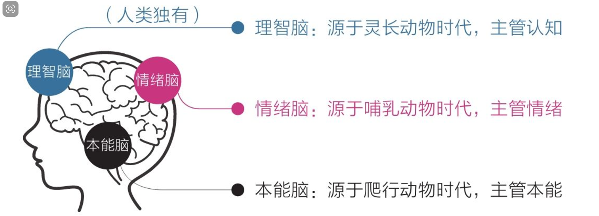
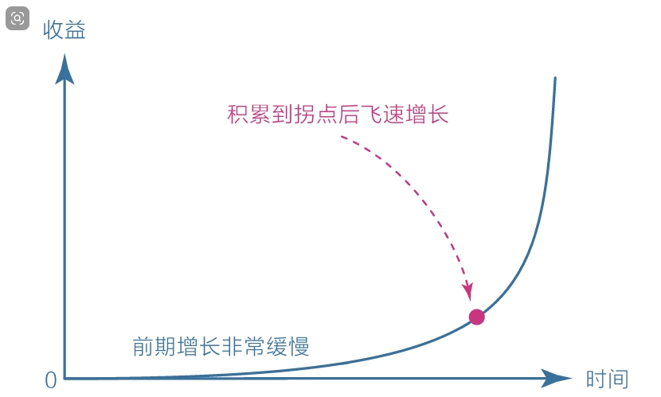
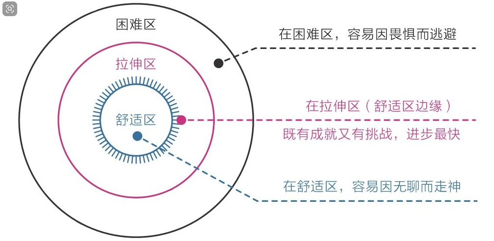
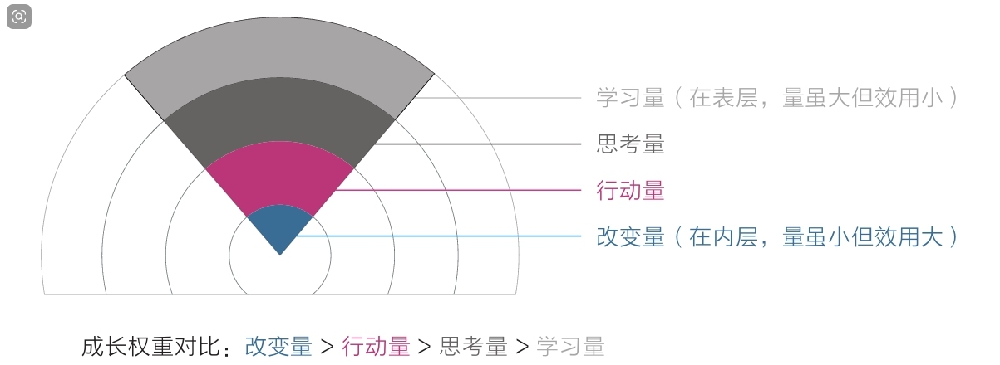

# 认知觉醒

# 第一节

## 1.1 大脑

- 我们在生活中做的大部分决策往往源于本能和情绪，而非理智
- 本能脑和情绪脑的基因一直被生存压力塑造着，所以它们的天性自然成了目光短浅、即时满足，又因它们主导着大脑的决策，所以这些天性也就成了人类的默认天性
- 避难趋易——只做简单和舒适的事，喜欢在核心区域周边打转，待在舒适区内逃避真正的困难
- 急于求成——凡事希望立即看到结果，对不能马上看到结果的事往往缺乏耐心，非常容易放弃
- 大多数时候我们以为自己在思考，其实都是在对自身的行为和欲望进行合理化
- 理智脑不是直接干活的，干活是本能脑和情绪脑的事情，因为它们的力气大；上天赋予理智脑智慧，是让它驱动本能和情绪，而不是直接取代它们

## 1.2 焦虑

- 人类的安全感都源于自己在某一方面拥有的独特优势：或能力，或财富，或权力，或影响力
- 简单来说：急于求成

> 方法：保持耐心

- 克制欲望，不要让自己同时做很多事
- 面对现实，看清自己真实的能力水平
- 要事优先，想办法只做最重要的事情
- 接受环境，在局限中做力所能及的事
- 直面核心，狠狠逼自己一把去突破它

## 1.3 耐心

- 小说中的男主角正是这种不用付出巨大努力就能获得超强能力的快感让人心驰神往，因为现实生活中无论读书、考试，还是工作、赚钱，要想表现出色都必须经受长时间的磨炼。可惜故事是故事，现实是现实，我们可以暂时沉浸在故事中，但终究要回到现实面对规则：要想有所成就，必须保持耐心，延迟满足。
- 复利效应显示了价值积累的普遍规律：前期增长非常缓慢，但到达一个拐点后会飞速增长。
- 这个世界第八大奇迹揭示的正是这种力量，不过要想获得这种力量，我们需要冷静面对前期缓慢的增长并坚持到拐点。认识复利曲线：

- 舒适区边缘另一个重要的规律是它揭示了能力成长的普遍法则：无论个体还是群体，其能力都以“舒适区—拉伸区—困难区”的形式分布，要想让自己高效成长，必须让自己始终处于舒适区的边缘，贸然跨到困难区会让自己受挫，而始终停留在舒适区会让自己停滞。

- 人类的天性却正好与这个规律相反。在欲望上急于求成，总想一口吃成个胖子，导致自己终日在困难区受挫；在行动上避难趋易，总是停留在舒适区，导致自己在现实中总是一无所获。如果我们学会在舒适区边缘努力，那么收获的效果和信心就会完全不同。

- 微观规律：对于学习成长而言，成长权重对比是每个人都应该首先认识的，它揭示了“学习、思考、行动和改变”在成长过程中的关系：即对于学习而言，学习之后的思考、思考之后的行动、行动之后的改变更重要，如果不盯住内层的改变量，那么在表层投入再多的学习量也会事倍功半；因此，从权重上看，改变量﹥行动量﹥思考量﹥学习量

- **多即是少，少即是多**的辩证关系在中也体现得淋漓尽致：停在表层，我们就会陷入欲望漩涡，什么都想学、什么都想要，忙忙碌碌却收效甚微；若是能深入底层，盯住实际改变，我们就能跳出盲目、焦虑、浮躁的怪圈。
- 耐心不是毅力带来的结果，而是具有长远目光的结果。

> 方法：与自己对话，询问内心该咋做？

- 首先，面对天性，放下心理包袱，坦然接纳自己
- 其次，面对诱惑，学会延迟满足，变对抗为沟通
- 最后，面对困难，主动改变视角，赋予行动意义。