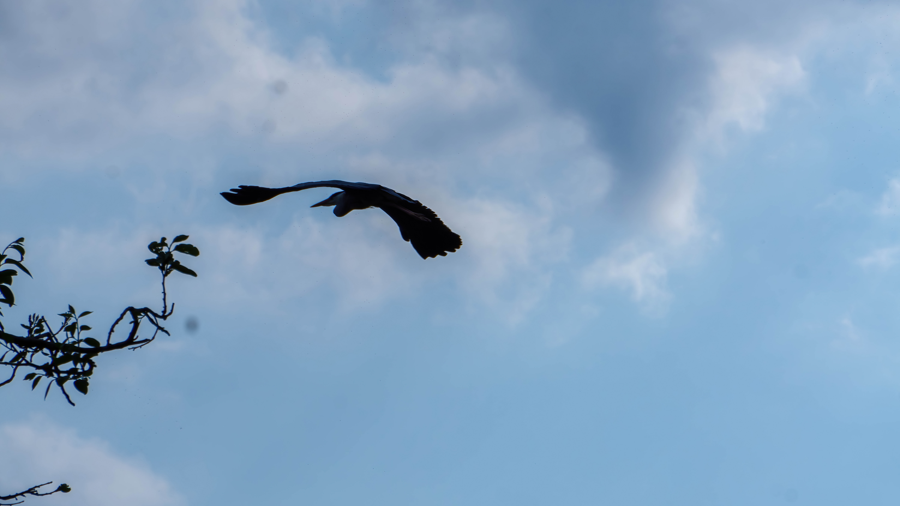
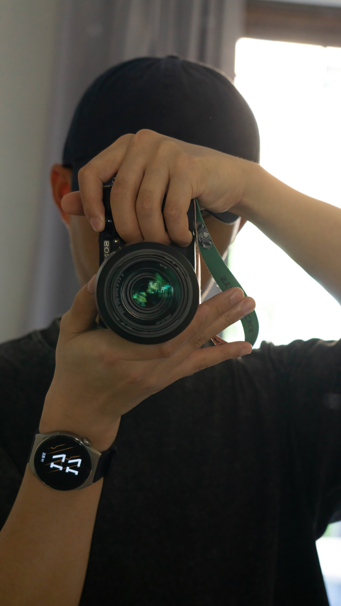
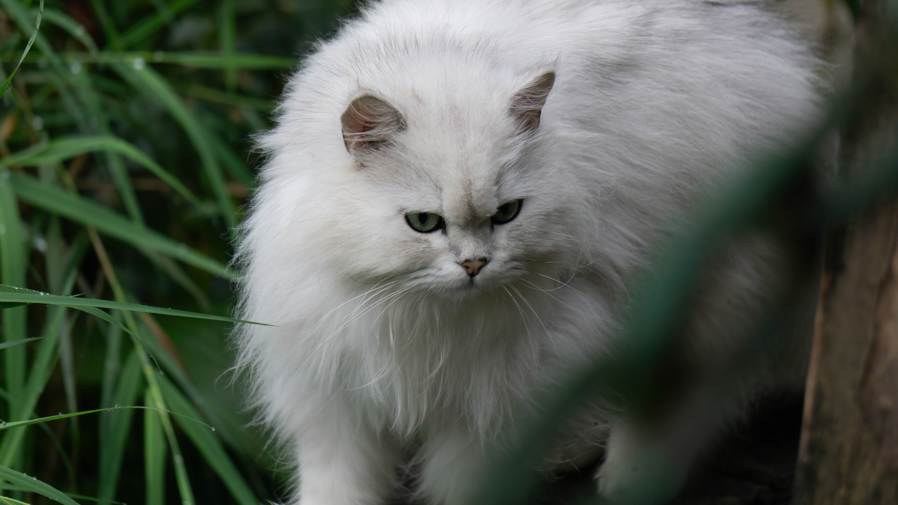
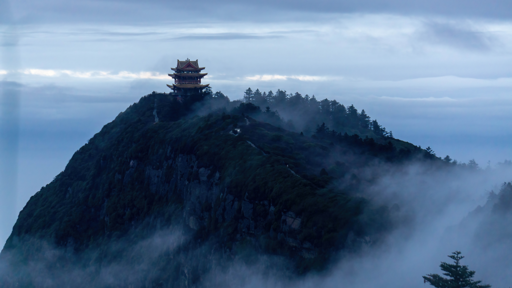

:::success
- 索尼摄影作品：生活摄影作品 by EasonShu
- 设备：索尼A6000
- 镜头：14-210mm, 50mm, 35mm
:::
import TOCInline from '@theme/TOCInline';

<TOCInline toc={toc} />

## 1.1  3 月
:::info
龙泉山的自然景观和人文景观主要有:龙泉山庙宇、楼亭、清泉、古战场遗址、古碾房遗迹、九百九十九级石径台阶以及山花烂漫的杜鹃花等。
:::

## 1.2 峨眉山
:::info
乐山市峨眉山景区位于四川省乐山市境内，景区面积154平方公里，最高峰万佛顶海拔3099米。具有“雄、秀、奇、险、幽”的特色，以优美的自然风光、悠久的佛教文化、丰富的动植物资源、独特的地质地貌著称于世，被人们誉为“仙山佛国”、“植物王国”、“动物乐园”、“地质博物馆”。 
:::

