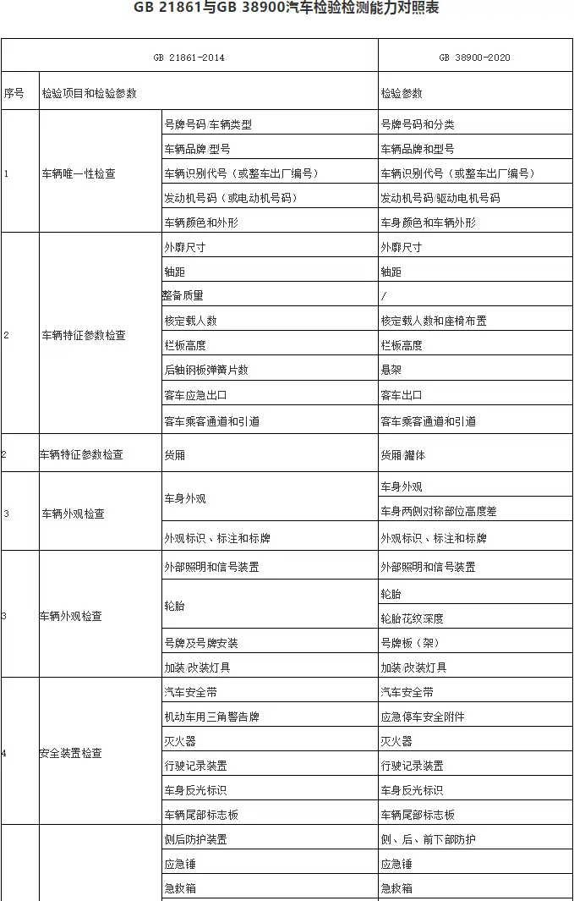

- 参考文章：https://www.zhihu.com/question/458001000

## 机动车检查

- 《[道路交通安全法](https://zhida.zhihu.com/search?q=道路交通安全法&zhida_source=entity&is_preview=1)实施条例》有关规定第十六条：机动车应当从注册登记之日起，按照下列期限进行安全技术检验：

> - （一）营运载客汽车5年以内每年检验1次；超过5年的，每6个月检验1次
> - （二）载货汽车和大型、中型非营运载客汽车10年以内每年检验1次；超过10年的，每6个月检验1次
> - （三）小型、微型非营运载客汽车6年以内每2年检验1次；超过6年的，每年检验1次；超过15年的，每6个月检验1次
> - （四）6年以内的摩托车免于到检验机构检验，需要定期检验时，机动车所有人可以直接到公安交管部门申领检验合格标志
> - （五）拖拉机和其他机动车每年检验1次。营运机动车在规定检验期限内经安全技术检验合格的，不再重复进行安全技术检验

## 三检合一

- 在三 检 合 一 新 政 策 出 台 之 前 ，我国机动车安全技术检验包括了环保尾气检测项目，后来将机动车环保尾气 检测从机动车安全技术检验中分离出来，分别隶属公安部 门和环保部门管辖，各自出具检验报告和核发检验合格标志。
- [三检合一](https://zhida.zhihu.com/search?q=三检合一&zhida_source=entity&is_preview=1)，是对原机动车安全技术检验、机动车综合性能检验和机动车[环保尾气检测](https://zhida.zhihu.com/search?q=环保尾气检测&zhida_source=entity&is_preview=1)三家各自为政的机动车检验检测机构进行整合。

## 检测流程

## GB 38900-2020

- 本标准规定了机动车安全技术检验的检验项目、检验方法、检验要求，以及检验结果判定、处置和资料存档。 
- 本标准适用于具备检验检测资质的机构对机动车进行安全技术检验。
- 本标准也适用于从事进口机动车检验检测的机构对入境机动车进行安全技术检验。经批准进行实际道路试验的机动车和临时入境的机动车，可参照本标准进行安全技术检验。 
- 本标准不适用于拖拉机运输机组等上道路行驶的拖拉机的安全技术检验。

