- 参考文章：https://www.zhihu.com/question/458001000

## 机动车检查

- 《[道路交通安全法](https://zhida.zhihu.com/search?q=道路交通安全法&zhida_source=entity&is_preview=1)实施条例》有关规定第十六条：机动车应当从注册登记之日起，按照下列期限进行安全技术检验：

> - （一）营运载客汽车5年以内每年检验1次；超过5年的，每6个月检验1次
> - （二）载货汽车和大型、中型非营运载客汽车10年以内每年检验1次；超过10年的，每6个月检验1次
> - （三）小型、微型非营运载客汽车6年以内每2年检验1次；超过6年的，每年检验1次；超过15年的，每6个月检验1次
> - （四）6年以内的摩托车免于到检验机构检验，需要定期检验时，机动车所有人可以直接到公安交管部门申领检验合格标志
> - （五）拖拉机和其他机动车每年检验1次。营运机动车在规定检验期限内经安全技术检验合格的，不再重复进行安全技术检验

## 三检合一

- 在三 检 合 一 新 政 策 出 台 之 前 ，我国机动车安全技术检验包括了环保尾气检测项目，后来将机动车环保尾气 检测从机动车安全技术检验中分离出来，分别隶属公安部 门和环保部门管辖，各自出具检验报告和核发检验合格标志。
- [三检合一](https://zhida.zhihu.com/search?q=三检合一&zhida_source=entity&is_preview=1)，是对原机动车安全技术检验、机动车综合性能检验和机动车[环保尾气检测](https://zhida.zhihu.com/search?q=环保尾气检测&zhida_source=entity&is_preview=1)三家各自为政的机动车检验检测机构进行整合。

## 检测流程

## GB 38900-2020

- 本标准规定了机动车安全技术检验的检验项目、检验方法、检验要求，以及检验结果判定、处置和资料存档。 
- 本标准适用于具备检验检测资质的机构对机动车进行安全技术检验。
- 本标准也适用于从事进口机动车检验检测的机构对入境机动车进行安全技术检验。经批准进行实际道路试验的机动车和临时入境的机动车，可参照本标准进行安全技术检验。 
- 本标准不适用于拖拉机运输机组等上道路行驶的拖拉机的安全技术检验。

## 联网查询

**注册登记安全检验和在用机动车安全检验时,联网查询送检机动车事故、违法、因安全缺陷召回等信息**

- 对发生过造成人员伤亡交通事故的送检机动车,人工检验时应重点检查损伤部位和损伤情况，属于使用年限在10年以内的非营运小型、微型载客汽车的,检验项目增加底盘动态检验、车辆底盘部件检查
- 对涉及尚未处理完毕的道路交通安全违法行为或道路交通事故的送检机动车,应提醒机动车所有人及时到公安机关交通管理部门处理
- 对送检机动车状态为被盗抢，注销，达到报废标准，事放逃逸，，锁定情形的,应报告当地公安机关交通管理部门处理
- 发现送检机车达到召回计划实施周期而未实施召回的,应提醒机动车所有人及时进行召回处置。

> **简单来说就是站端系统向联网商看这个车是否存在上面的这些情况，也返回了车辆的基本信息**

## 车辆唯一性

> **车辆的唯一标识，与出厂合格证，行驶证，车辆识别代号，号牌号码，发动机号码等信息是否一致**

- 在GB 38900—2020中明确规定机动车必须进行车辆唯一性检查，内容涵盖机动车的号牌号码和分类、车辆品牌和型号、车辆识别代号（或整车出厂编号）、发动机号码/驱动电机号码、车身颜色和车辆外形等特征，其目的是打击盗抢、走私、拼组装、非法改装及非法生产车辆等。
- 机动车检验机构采用人工检查的手段对车辆进行查验，但往往因外检人员技术水平的高低、经验是否充足，直接决定了车辆唯一性检查的检验质量。

> 车辆识别代号组成

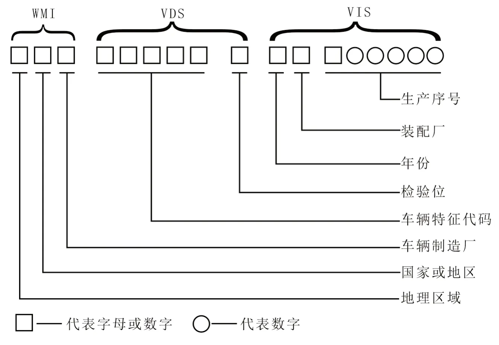

> 汽车型号的组成

- 根据《汽车产品型号编制规则》（GB 9417—88）规定，国产汽车型号应能表明厂牌、类型及主要特征参数等，该型号由拼音字母和阿拉伯数字组成，包括首部、中部、尾部）。
- 其中，首部代表企业名称代号，如CA代表第一汽车制造厂，EQ代表第二汽车制造厂，等等；中部则由4位数字组成，包括首位、中间2位和末位数字3部分，具体4位数字的含义见所列；尾部代表专用汽车分类或变型车与基本型的区别，如X表示厢式汽车，G表示罐式汽车，等等。

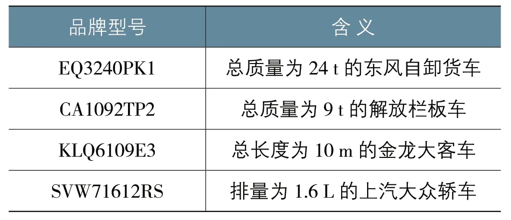

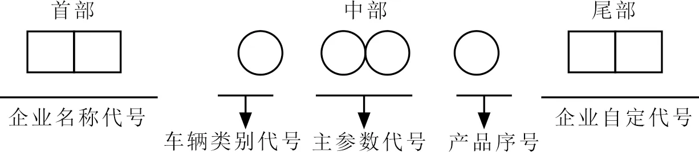

## 车辆特征参数

**GB38900-2020《机动车安全技术检验项目和方法》中规定了一系列的车辆特征参数检查项目，这些项目主要是为了确保机动车在注册登记或在用时符合安全技术要求。**

1. **外廓尺寸**：测量车辆的长、宽、高等基本尺寸，以确保车辆尺寸符合相应类型的车辆标准。
2. **轴距**：测量车辆前后两轴中心线之间的距离，以保证车辆的稳定性和操控性。
3. **核定载人量和座椅布置**：确认车辆能够合法承载的人数以及座椅的布局是否符合规定。
4. **栏板高度**：对于货车而言，检查车厢周围栏板的高度是否符合安全运输货物的标准。
5. **悬架**：评估车辆的悬挂系统是否完好，能否提供足够的支撑与减震效果。
6. **客车出口**：对于客车来说，检查紧急出口的设计是否合理，能否在紧急情况下快速疏散乘客。
7. **客车乘客通道和引道**：确保客车内部的通道足够宽敞，以便乘客安全通行。
8. **货箱/罐体**：对于货车和专用运输车辆，检查货箱或罐体是否符合运输物品的安全要求，不得私自改装。

## 车辆外观检测

**GB38900-2020《机动车安全技术检验项目和方法》对车辆的外观检查提出了明确的要求，目的是确保车辆的外部结构和部件处于良好状态，不影响交通安全。**

1. **车身完整性**：检查车身是否有严重损坏、变形或锈蚀等情况，这些情况可能会影响车辆的稳定性或造成安全隐患。
2. **车身颜色和喷涂标志**：检查车身的颜色和喷涂标志是否与登记信息一致，特别是对于营运车辆，还需检查其喷涂的企业标识和其他标志是否符合规定。
3. **号牌安装**：确认前后车牌是否齐全、清晰、固定牢靠，且未被遮挡或人为污损。
4. **灯具和反光标识**：检查前照灯、尾灯、转向灯、制动灯等灯具是否齐全、功能正常且无遮挡，同时还需要检查车身反光标识是否符合规定。
5. **轮胎状况**：检查轮胎的磨损程度、胎压、花纹深度以及是否有裂纹、鼓包等异常现象。
6. **玻璃状况**：检查风窗玻璃及其他车窗玻璃是否有裂纹、破损等影响视线的情况。
7. **外部附属设备**：检查后视镜、雨刮器等外部设备是否齐全且功能正常。
8. **车门状况**：检查车门是否开闭自如、锁止可靠。
9. **车身附件**：检查车身上的各种附件（如保险杠、装饰条等）是否牢固安装。

## 安全装置检查

**GB38900-2020《机动车安全技术检验项目和方法》针对机动车的安全装置检查设定了明确的标准，以确保机动车的安全性能。**

1. **制动系统**：
   - 制动效能：检查车辆的制动效能是否符合要求，包括制动力、制动协调时间等。
   - 制动间隙自动调整装置：对于配备自动调整装置的车辆，检查其是否正常工作。
2. **灯光和信号装置**：
   - 灯具：检查前照灯、转向灯、制动灯、后位灯、倒车灯、牌照灯等功能是否正常，灯光是否达标。
   - 反光标识：检查车身反光标识是否符合要求。
3. **轮胎**：
   - 检查轮胎的磨损情况，确保轮胎的花纹深度符合最低要求。
   - 检查轮胎是否有损伤、鼓包或异物刺入等情况。
4. **安全带**：
   - 检查所有座位的安全带是否齐全、有效，并且可以正常使用。
5. **车身结构和防护装置**：
   - 检查车身是否有变形、锈蚀等问题。
   - 对于货车和挂车，检查前下部防护装置是否符合要求。
   - 对于客车，检查驾驶区隔离设施是否符合要求。
6. **号牌安装**：
   - 检查前后号牌是否安装正确，清晰可见，无遮挡。
7. **车身附件**：
   - 检查后视镜、雨刷器等附件是否齐全、功能正常。
8. **危险品运输车的特殊要求**：
   - 对于危险品运输车，还需要检查其是否配备了符合规定的防火花装置、接地装置等。
9. **校车的特殊要求**：
   - 对于校车，还需检查其是否配备了符合要求的安全锤、灭火器、应急门窗等安全设施。
10. **客车的特殊要求**：
    - 对于客车，还需检查其是否配备了足够的安全锤、灭火器等应急设备。

## 检测项目

### GB38900-2020新标准注册登记安全检测项目表

**1、载客汽车一非营运小型、微型载客汽车的注册登记安全检验项目表**

**备注：**1、面包车（即发动机中置且宽高比小于或等于0.9的乘用车)、7座及7座以上车辆需要开展底盘动态检验、车辆底盘部件检查。2、驻车制动使用电子控制装置的汽车，不检验驻车制动。

**2、载客汽车一其他类型载客汽车的注册登记安全检验项目表**

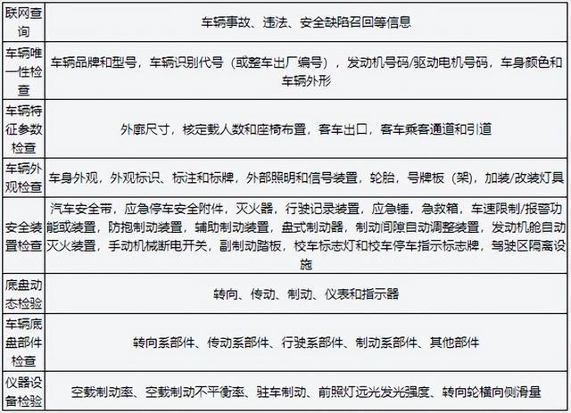

**备注：**1、车辆特征参数检查、安全装置检查时的具体适用项目应与本标准第6章提出的车型要求相结合。2、驻车制动使用电子控制装置的汽车，不检验驻车制动。

**3、货车(三轮汽车除外)、专项作业车的注册登记安全检验项目表**

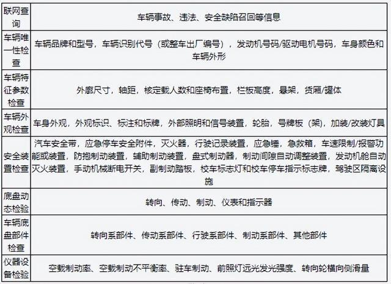

**备注：**1、车辆特征参数检查、安全装置检查时的具体适用项目应与本标准第6章提出的车型要求相结合。2、三轴及三轴以上的货车，对部分轴（最后一轴及货车第一轴除外）还应测试加载轴制动率和加载轴制动不平衡率﹔采用空气悬架的车辆、总质量为整备质量1.2倍以下的车辆不测试加载轴制动率和加载轴制动不平衡率。3、驻车制动使用电子控制装置的汽车，不检验驻车制动。

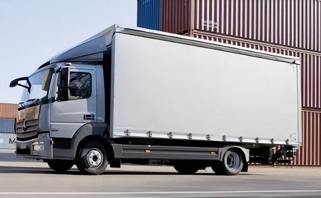

**4、挂车的注册登记安全检验项目表**

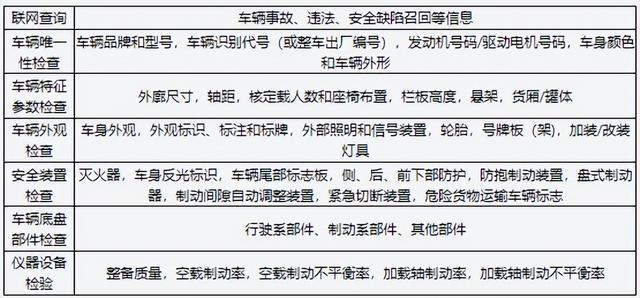

**备注：**1、车辆特征参数检查、安全装置检查时的具体适用项目应与本标准第6章提出的车型要求相结合。2、总质量大于3500kg的并装双轴或并装三轴挂车，对部分轴（最后一轴除外）还应测试加载轴制动率和加载轴制动不平衡率;采用空气悬架的车辆、总质量为整备质量1.2倍以下的车辆不测试加载轴制动率和加载轴制动不平衡率。

**5、三轮汽车的注册登记安全检验项目表**

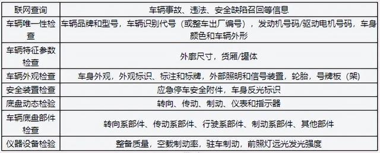

**备注：**驻车制动使用电子控制装置的汽车，不检验驻车制动。

**6、摩托车的注册登记安全检验项目表**

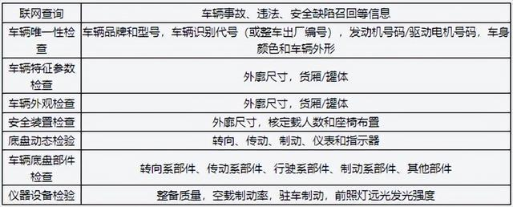

**备注：**外廓尺寸、核定载人数和座椅布置和整备质量项目仅适用于带驾驶室的正三轮摩托车以及不带驾驶室、不具有载运货物结构或功能且设计和制造上最多乘坐2人(包括驾驶人)的正三轮摩托车。

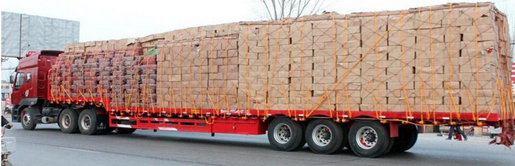

### GB38900-2020新标准再用安全检测项目表

**1、载客汽车一非营运小型、微型载客汽车的在用机动车安全检验项目表**

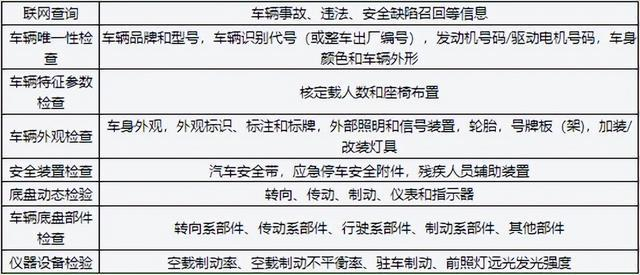

**备注：**1、面包车（即发动机中置且宽高比小于或等于0.9的乘用车)、7座及7座以上车辆，以及使用年限超过10年的车辆，需要开展底盘动态检验、车辆底盘部件检查。2、自学用车还应检验副制动踏板和辅助后视镜。3、驻车制动使用电子控制装置的汽车，不检验驻车制动。

**2、载客汽车一其他类型载客汽车的再用安全检验项目表**

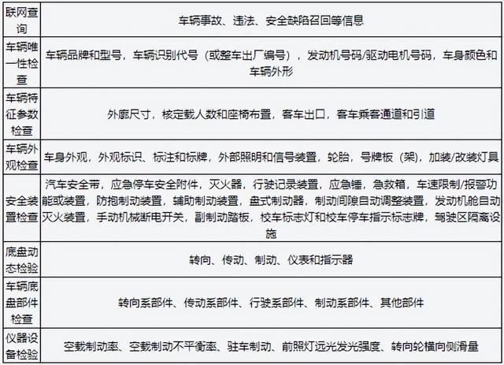

**备注：**1、车辆特征参数检查、安全装置检查时的具体适用项目应与本标准第6章提出的车型要求相结合。2、驻车制动使用电子控制装置的汽车，不检验驻车制动。

**3、货车(三轮汽车除外)、专项作业车的再用安全检验项目表**

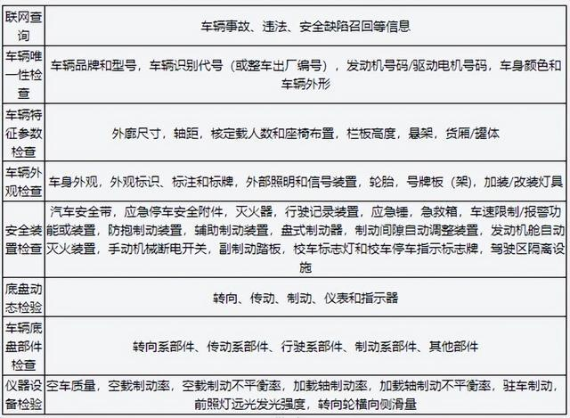

**备注：**1、车辆特征参数检查、安全装置检查时的具体适用项目应与本标准第6章提出的车型要求相结合。2、三轴及三轴以上的货车，对部分轴（最后一轴及货车第一轴除外）还应测试加载轴制动率和加载轴制动不平衡率。采用空气悬架的车辆、总质量为整备质量1.2倍以下的车辆不测试加载轴制动率和加载轴制动不平衡率。3、自学用车还应检验副制动踏板和辅助后视镜。4、驻车制动使用电子控制装置的汽车，不检验驻车制动。

**4、挂车的再用安全检验项目表**

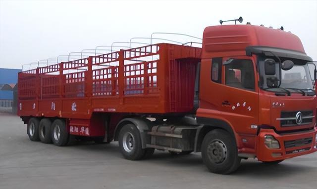

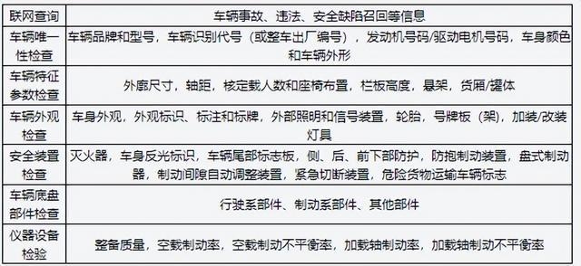

**备注：**1、车辆特征参数检查、安全装置检查时的具体适用项目应与本标准第6章提出的车型要求相结合。2、总质量大于3500kg的并装双轴或并装三轴挂车，对部分轴（最后一轴除外）还应测试加载轴制动率和加载轴制动不平衡率;采用空气悬架的车辆、总质量为整备质量1.2倍以下的车辆不测试加载轴制动率和加载轴制动不平衡率。

**5、三轮汽车的再用安全检验项目表**

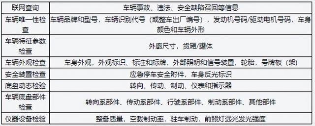

**备注：**驻车制动使用电子控制装置的汽车，不检验驻车制动。

**6、摩托车的注册登记安全检验项目表**

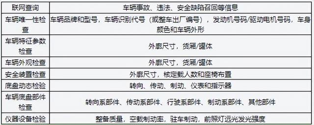

**备注：**核定载人数和座椅布置项目仅适用于带驾驶室的正三轮摩托车以及不带驾驶室、不具有载运货物结构或功能且设计和制造上最多乘坐2人（包括驾驶人）的正三轮
