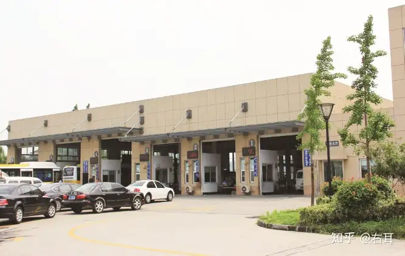
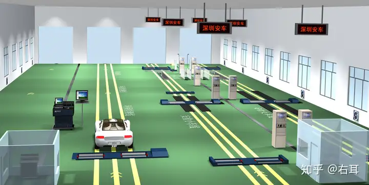
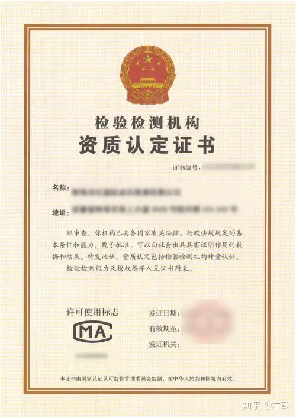

# 机动车检测站新建流程有哪些？

随着机动车[保有量](https://zhida.zhihu.com/search?q=保有量&zhida_source=entity&is_preview=1)持续快速增长，拉动了机动车检测需求，全国各地机动车检验检测机构不断涌现。在准备加入机动车检测行业前，我们应充分了解机动车检测站新建流程、当地的经济发展状况和机动车保有量、已有检测机构数量、行业运营环境、场地费用、机动车增长数量以及风险评估综合因素等，在充足[市场调研](https://zhida.zhihu.com/search?q=市场调研&zhida_source=entity&is_preview=1)基础上进行可行性规划与设计。

## 一、营业执照

1.企业法人营业执照（企业性质：[有限责任公司](https://zhida.zhihu.com/search?q=有限责任公司&zhida_source=entity&is_preview=1)；营业范围包含：机动车安全技术检验、排气污染物检验、机动车检测等）。

2.工商注册名称应含有机动车（汽车）检验检测等相关内容。

3.工商注册地址与租赁合同、[土地使用证](https://zhida.zhihu.com/search?q=土地使用证&zhida_source=entity&is_preview=1)地址必须一致。

4.企业法人设立[实验室](https://zhida.zhihu.com/search?q=实验室&zhida_source=entity&is_preview=1)的决定或通知。

## 二、场地资质

1.机动车汽车检测机构应有固定的工作场地，场地可[土地租赁](https://zhida.zhihu.com/search?q=土地租赁&zhida_source=entity&is_preview=1)和购买（房屋租赁合同、出租人房屋产权证等）。

2.土地性质符合[工业用地](https://zhida.zhihu.com/search?q=工业用地&zhida_source=entity&is_preview=1)和商业用地性质。

3.场地内基建建设应通过当地规划许可要求。

4.场地条件满足机动车检测需求，检测机构应依据所检车型和检测类别配置相应的[检测设备](https://zhida.zhihu.com/search?q=检测设备&zhida_source=entity&is_preview=1)。

## 三、项目建设

1.办理项目[环评](https://zhida.zhihu.com/search?q=环评&zhida_source=entity&is_preview=1)报告：到当地环保部门和有审核资质的第三方机构办理。

2.与设备供应商签订合同（对设备采购可优先选用守信誉重质量的设备提供商）。

3.设备供应商提供场地规划建议、设备布局图纸、设备基础图纸等，确认场地规划。

4.确定土建施工单位，土建施工项目负责人与设备供应商对接图纸事宜及施工注意事项。

5.进入施工阶段，并做设备基础和整体硬化。

## 四、检测设备安装

1.设备安装前，投资方需确认1-2名未来检测站技术人员，全程跟踪安装（安装过程培训）。

2.设备供应商安装调试设备。

3.安装调试完成前1周，投资方需确认检测站所有工作人员，以便设备供应商进行培训。

4.检测车间、检测场地标线，营业大厅装修。

## 五、检测设备检定（校准）

检测设备应具备检定校准证书，设备需通过专业计量检定后取得设备检定（校准）证书。

## 六、人员配备

1.人员[技能培训](https://zhida.zhihu.com/search?q=技能培训&zhida_source=entity&is_preview=1)考核证明。

2.机动车[检验机构](https://zhida.zhihu.com/search?q=检验机构&zhida_source=entity&is_preview=1)应配备机构负责人、技术负责人、质量负责人、授权签字人、引车员、外观[检验员](https://zhida.zhihu.com/search?q=检验员&zhida_source=entity&is_preview=1)、底盘动态检验员、车辆底盘检验员、登录员、设备操作员、设备管理员、网络维护员、质量监督员、资料管理员、内审员，其他服务人员等。

## 七、资质认定

1.整合检验检测机构资质认定申请材料，达到评审要求后提交验收申请。

2.市场监管局委托评审专家进行现场评审，现场评审后对基本符合项进行整改，并在规定的整改期间内向评审组提交整改报告。

3.获得资质认定许可证书。（下图为资质认定许可证书示例，仅供参考。）

## 八、主管部门联网及检测站营业

1.安装联网[监控设备](https://zhida.zhihu.com/search?q=监控设备&zhida_source=entity&is_preview=1)及站点服务器，申请环保联网、安检联网序列号。

2.向公安、交通、环保管理部门申请相关业务范围监管联网后，即可对外检测。