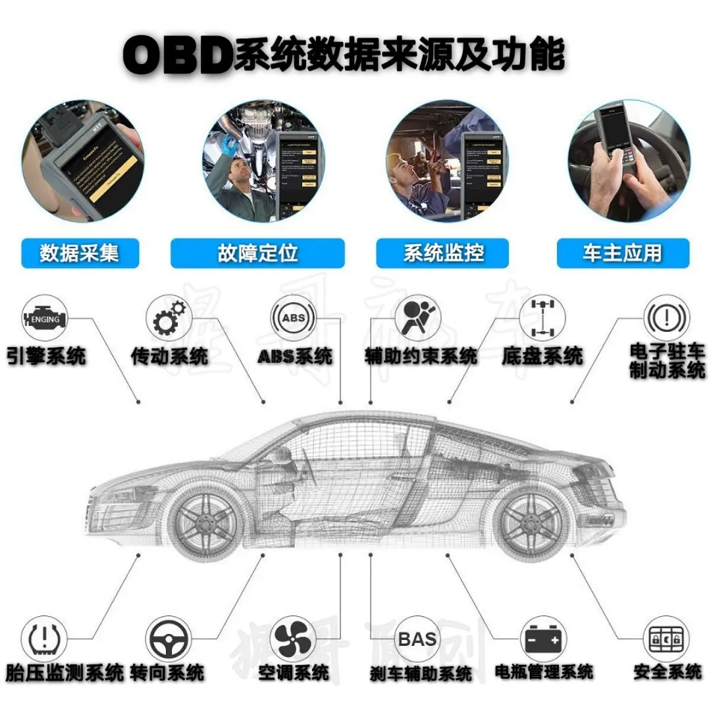

# 车载诊断OBD系统

## 1.1 介绍

- OBD（on-Board Diagnostics）全称车载诊断系统，起源于19世纪80年代的美国，当时美国为了控制汽车排放，规定加州销售车辆装备车载诊断系统，也是最早的[OBD系统](https://zhida.zhihu.com/search?content_id=103167827&content_type=Article&match_order=1&q=OBD系统&zhida_source=entity)。最早的OBD系统也称OBD-I，监控范围包括氧传感器、[排气再循环系统](https://zhida.zhihu.com/search?content_id=103167827&content_type=Article&match_order=1&q=排气再循环系统&zhida_source=entity)、然后供给系统和发动机控制模块，只能检测到与排放有关部件的连续性故障，无法监测其渐进损坏情况。同时系统没有同意的标准，使用的协议也不相同，投入之后效果并不好。
- 针对[OBD-I](https://zhida.zhihu.com/search?content_id=103167827&content_type=Article&match_order=2&q=OBD-I&zhida_source=entity) 出现的缺陷，SAE（美国汽车工程师协议）制定了[OBD-II](https://zhida.zhihu.com/search?content_id=103167827&content_type=Article&match_order=1&q=OBD-II&zhida_source=entity)系统，并制定了一系列相关的标准和规范。相对于之前的OBD-I， OBD-II采用了标准化的16针诊断座DL、相同的故障代码DTC和标准化通信协议，并且扩充了系统的检测项目，[欧洲共同体](https://zhida.zhihu.com/search?content_id=103167827&content_type=Article&match_order=1&q=欧洲共同体&zhida_source=entity)基于也在同时规定了欧洲版的EOBD，也采用统一的诊断座、通信协议和故障代码等，两者基本原理和诊断项目类似。
- OBD系统在我国发展较迟，在05年，国家环保总局颁布了规定在2007年7月1日实施国III排放法规，我国的排放法规与欧洲的排放标准类似。尽管OBD-II针对汽车排放起到明显的控制作用，为了更及时监测排放，[OBD-III](https://zhida.zhihu.com/search?content_id=103167827&content_type=Article&match_order=1&q=OBD-III&zhida_source=entity)也出现了。增加了无线通信方式来读取发送机、变速器和ABS系统ECU中的数据，将车辆识别代码（VIN）、故障码等一些数据自动传送到交通管理部分，不过由于该系统可能涉及侵犯用户隐私，所以在考察中。

## 1.2 OBD 是如何工作的

一个基本的 OBD 系统由一个中央系统、一个传感器网络、一个连接点和指示器组成，创建了一个具有标准化访问和可读性的完整监控系统。OBD系统由以下组件组成：

- **ECU**：OBD系统的核心部分是[电子控制单元](https://zhida.zhihu.com/search?content_id=192762372&content_type=Article&match_order=1&q=电子控制单元&zhida_source=entity)（ECU）。ECU收集来自整个车辆的各种传感器的输入。然后，ECU使用这些数据来控制车辆的部件，如燃油喷射器，或监控问题。
- **传感器**：整个车辆都有传感器，覆盖从发动机、底盘到电子系统的各个区域。这些系统中的每一个传感器都向ECU发送代码，指定信号的来源和参数。然后ECU“读取”并解释这个信号。
- **DTC**：如果传感器向ECU发送的信息超出正常范围，ECU会将信息保存为称为[诊断故障代码](https://zhida.zhihu.com/search?content_id=192762372&content_type=Article&match_order=1&q=诊断故障代码&zhida_source=entity)或DTC的代码。DTC代码本质上是一个字母和数字的列表，用于指示问题的来源和性质。DTC代码通常是标准化的，但也可能是制造商特定的。保存DTC后，ECU会向指示灯发送一个信号，表明已发现问题。也可以通过将传感器连接到 OBD系统的连接器来拉出DTC。
- **MIL**：当ECU收集到DTC代码时，它会向车辆仪表板发送信号以打开相应的指示灯。这些灯，规范地称为[故障指示灯](https://zhida.zhihu.com/search?content_id=192762372&content_type=Article&match_order=1&q=故障指示灯&zhida_source=entity)或MIL，是为车辆故障提供初步的预警系统。一般来说，如果灯打开并保持亮起，则问题很小。如果指示灯闪烁，则问题很紧急。
- **DLC**：ECU会收集的所有数据和DTC代码且可以通过诊断链路连接器或DLC访问。DLC端口是访问配备OBD系统车辆的接入点，通常位于车辆驾驶员一侧的仪表板下方，在商用车辆中，也可能位于其他位置。现在的车辆采用标准OBD-II系统制造，因此任何带有2类线缆的扫描工具都可以连接到2类连接器。

