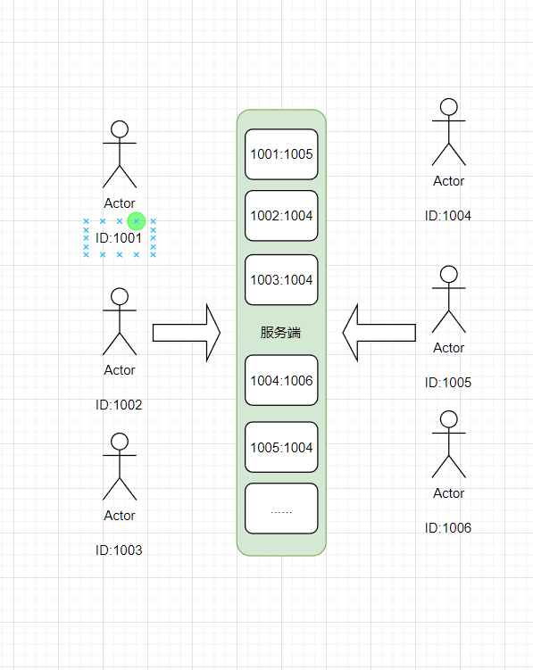
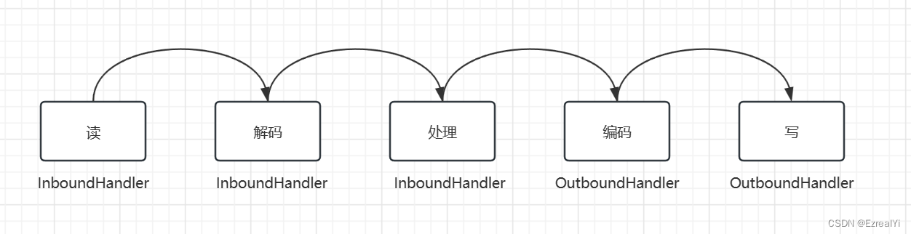
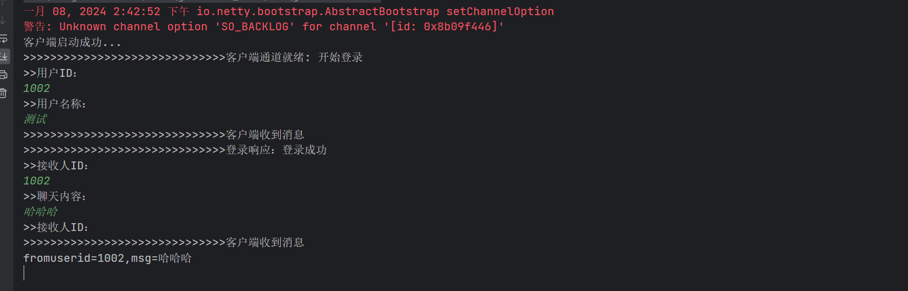
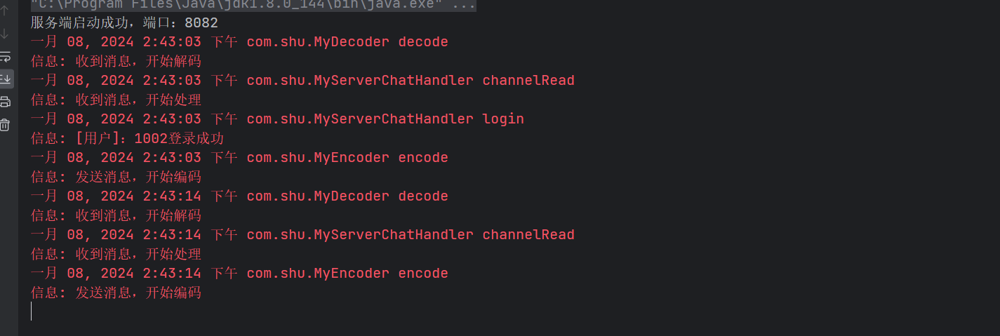

# Netty 实现单聊

## 1.1 思路分析

- 客户端01：表明自己的身份，属性（比如：我叫啥，我的身份证号码，姓名，住址等等）
- 服务端：验证客户端身份信息，保存客户端身份信息，保持登录状态，如果不在线，就无法接受信息
- 客户端02：表明自己的身份，属性（比如：我叫啥，我的身份证号码，姓名，住址等等），如果自身在服务端注册过，且有指定我的身份信息消息传递过来。就接受信息



## 1.2 分析

- 第一个点：序列化与反序列化（传输效率）：对于实体对象的序列化和反序列化，推荐使用 [Fastjson](https://github.com/alibaba/fastjson) 框架去实现，而不是[Netty官方示例](http://docs.52im.net/extend/docs/src/netty4_1/io/netty/example/echo/package-summary.html)所使用的对象流。
- 第二个点：通信协议实现（约定）：客户端和服务端之间的数据通讯，我们是基于实体对象去交互的，这样数据格式更加的方便。

## 1.3 过程

登录主要是为了让用户 ID 和通道（就是Netty中的[Channel](http://docs.52im.net/extend/docs/src/netty4_1/io/netty/channel/Channel.html)，也即网络连接）进行绑定。

**在登录成功之后为 Channel 通过 [attr()](http://docs.52im.net/extend/docs/api/netty4_1/io/netty/util/AttributeMap.html#attr-io.netty.util.AttributeKey-) 方法绑定该用户 ID，主要目的有三个：**

- ***1）***客户端A在发送消息时，服务端可以通过 Channel 获取消息发送者的用户ID，以便知道消息是“谁”发过来的；
- ***2）***服务端在收到客户端A发过来的消息时，通过消息中的接收者用户ID，可以获取接收者的Channel，以便知道消息该发给“谁”；
- ***3）***在 Channel 断开的时候，服务端可以监听到 Channel，并且获取 Channel 的属性，从而删除对应的用户ID和Chennel映射关系。

对于业务处理来说，用户登录和消息发送是两个不同的业务点，一般来说需要定义多个 Handler 来分别处理，但是这里为了减少 Handler 的数量，统一一个 Handler 处理。

## 1.4 实现

### 1.4.1 实体类

- 基础实体类

```java
package com.shu.model;

import lombok.Data;

import java.io.Serializable;

/**
 * @description: 基础bean
 * @author: shu
 * @createDate: 2024/1/5 9:36
 * @version: 1.0
 */
@Data
public abstract class BaseBean implements Serializable {
    /**
     * 协议标识：ox66
     */
    private Integer tag=0x66;

    /**
     * 业务指令
     *
     * @return
     */
    public abstract Byte code();

}
```

- 登录请求：表明自己的的身份

```java
package com.shu.model;

import lombok.Data;

import java.io.Serializable;

/**
 * @description:
 * @author: shu
 * @createDate: 2024/1/5 9:38
 * @version: 1.0
 */
@Data
public class LoginReqBean extends BaseBean implements Serializable {
    /**
     * 用户id
     */
    private Integer userId;
    /**
     * 用户名
     */
    private String userName;


    /**
     * 业务抽象方法
     *
     * @return
     */
    @Override
    public Byte code() {
        return 1;
    }


}

```

- 登录响应：服务器给客户端的确定登录信息，表明服务端收到了的客户端的信息

```java
package com.shu.model;

import lombok.Data;

import java.io.Serializable;

/**
 * @description:
 * @author: shu
 * @createDate: 2024/1/5 9:45
 * @version: 1.0
 */
@Data
public class LoginResBean extends BaseBean implements Serializable {

    private Integer status;//响应状态，0登录成功，1登录失败
    private String msg;//响应信息
    private Integer userid;//用户ID


    /**
     * 业务指令
     *
     * @return
     */
    @Override
    public Byte code() {
        return 2;
    }
}

```

- 消息发送请求：客户端需要发送给服务端的信息，需要给谁发信息

```java
package com.shu.model;

import lombok.Data;

import java.io.Serializable;

/**
 * @description:
 * @author: shu
 * @createDate: 2024/1/5 9:47
 * @version: 1.0
 */
@Data
public class MsgReqBean extends BaseBean implements Serializable {
    private Integer fromuserid;//发送人ID
    private Integer touserid;//接受人ID
    private String msg;//发送消息

    /**
     * 业务指令
     *
     * @return
     */
    @Override
    public Byte code() {
        return 3;
    }
}
```

- 服务端响应消息：服务器收到消息，并确定信息给客户端，可以通信，还是未登录信息

```java
package com.shu.model;

import lombok.Data;

import java.io.Serializable;

/**
 * @description: 消息响应bean
 * @author: shu
 * @createDate: 2024/1/5 10:53
 * @version: 1.0
 */
@Data
public class MsgResBean extends BaseBean implements Serializable {

    private Integer status;//响应状态，0发送成功，1发送失败
    private String msg;//响应信息

    /**
     * 业务指令
     *
     * @return
     */
    @Override
    public Byte code() {
        return 4;
    }
}
```

- 客户端发送的消息

```java
package com.shu.model;

import lombok.Data;

import java.io.Serializable;

/**
 * @description:
 * @author: shu
 * @createDate: 2024/1/5 10:08
 * @version: 1.0
 */
@Data
public class MsgRecBean extends BaseBean implements Serializable {
    private Integer fromuserid;//发送人ID
    private String msg;//消息

    /**
     * 业务指令
     *
     * @return
     */
    @Override
    public Byte code() {
        return 5;
    }
}

```

### 1.4.2 消息编解码

- 编码：比如将对象转换成二进制数据流

```java
package com.shu;

import com.alibaba.fastjson.JSON;
import com.shu.model.BaseBean;
import io.netty.buffer.ByteBuf;
import io.netty.channel.ChannelHandlerContext;
import io.netty.handler.codec.MessageToByteEncoder;

import java.util.logging.Logger;

/**
 * @description:
 * @author: shu
 * @createDate: 2024/1/5 10:32
 * @version: 1.0
 */
public class MyEncoder extends MessageToByteEncoder<BaseBean> {


    private static Logger logger = Logger.getLogger(MyEncoder.class.getName());


    /**
     * 编码器
     * @param channelHandlerContext
     * @param baseBean
     * @param byteBuf
     * @throws Exception
     */
    @Override
    protected void encode(ChannelHandlerContext channelHandlerContext, BaseBean baseBean, ByteBuf byteBuf) throws Exception {
            logger.info("发送消息，开始编码");
            //1.把实体序列化成字节数字
            byte[] bytes= JSON.toJSONBytes(baseBean);
            //2.根据协议组装数据
            byteBuf.writeInt(baseBean.getTag());//标识（4个字节）
            byteBuf.writeByte(baseBean.code());//指令（1个字节）
            byteBuf.writeInt(bytes.length);//长度（4个字节）
            byteBuf.writeBytes(bytes);//数据
    }
}
```

- 解码：将二进制数据转换成对象，继续交给下一个处理器处理

```java
package com.shu;

import com.alibaba.fastjson.JSON;
import io.netty.buffer.ByteBuf;
import io.netty.channel.ChannelHandlerContext;
import io.netty.handler.codec.ByteToMessageDecoder;
import com.shu.model.BaseBean;


import java.util.List;
import java.util.logging.Logger;

/**
 * @description:
 * @author: shu
 * @createDate: 2024/1/5 10:48
 * @version: 1.0
 */
public class MyDecoder extends ByteToMessageDecoder {

    private static Logger logger = Logger.getLogger(MyDecoder.class.getName());
    /**
     * 解码器
     * @param channelHandlerContext
     * @param byteBuf
     * @param list
     * @throws Exception
     */
    @Override
    protected void decode(ChannelHandlerContext channelHandlerContext, ByteBuf byteBuf, List<Object> list) throws Exception {
       logger.info("收到消息，开始解码");
        //1.根据协议取出数据
        int tag=byteBuf.readInt();//标识符
        byte code=byteBuf.readByte();//获取指令
        int len=byteBuf.readInt();//获取数据长度
        byte[] bytes=new byte[len];
        byteBuf.readBytes(bytes);
        //2.根据code获取类型
        Class<? extends BaseBean> c= MapUtils.getBean(code);
        //3.反序列化
        BaseBean baseBean= JSON.parseObject(bytes,c);
        list.add(baseBean);
    }
}
```

### 1.4.3 处理器

- 服务端处理器：接受不同的消息进行处理：登录验证，转发请求，验证身份等等

```java
package com.shu;

import com.shu.model.*;
import io.netty.channel.Channel;
import io.netty.channel.ChannelHandlerContext;
import io.netty.channel.ChannelInboundHandlerAdapter;
import io.netty.util.AttributeKey;

import java.util.HashMap;
import java.util.Map;
import java.util.logging.Logger;

/**
 * @description:
 * @author: shu
 * @createDate: 2024/1/5 11:02
 * @version: 1.0
 */
public class MyServerChatHandler extends ChannelInboundHandlerAdapter {
    //1.定义一个Map（key是用户ID，value是连接通道）
    private static Map<Integer, Channel> map=new HashMap<Integer, Channel>();

    private static Logger logger = Logger.getLogger(MyServerChatHandler.class.getName());


    @Override
    public void channelRead(ChannelHandlerContext ctx, Object msg) throws Exception {
        logger.info("收到消息，开始处理");
        if(msg instanceof LoginReqBean){
            //1.登录请求
            login((LoginReqBean) msg,ctx.channel());

        }else if(msg instanceof MsgReqBean){
            //2.发送消息请求
            sendMsg((MsgReqBean)msg,ctx.channel());
        }
    }


    //登录处理方法
    private void login(LoginReqBean bean, Channel channel){
        LoginResBean res=new LoginResBean();
        //从map里面根据用户ID获取连接通道
        Channel c=map.get(bean.getUserId());
        if(c==null){
            //通道为空，证明该用户没有在线
          logger.info("[用户]："+bean.getUserId()+"登录成功");
            //1.添加到map
            map.put(bean.getUserId(),channel);
            //2.给通道赋值
            channel.attr(AttributeKey.valueOf("userid")).set(bean.getUserId());
            //3.响应
            res.setStatus(0);
            res.setMsg("登录成功");
            res.setUserid(bean.getUserId());
            channel.writeAndFlush(res);
        }else{
            //通道不为空，证明该用户已经在线了
            res.setStatus(1);
            res.setMsg("该账户目前在线");
            channel.writeAndFlush(res);
        }
    }


    //消息发送处理方法
    private void sendMsg(MsgReqBean bean,Channel channel){
        Integer touserid=bean.getTouserid();
        Channel c=map.get(touserid);
        if(c==null){
            MsgResBean res=new MsgResBean();
            res.setStatus(1);
            res.setMsg(touserid+",不在线");
            channel.writeAndFlush(res);

        }else{
            MsgRecBean res=new MsgRecBean();
            res.setFromuserid(bean.getFromuserid());
            res.setMsg(bean.getMsg());
            c.writeAndFlush(res);
        }
    }
}
```

- 客户端处理器：根据不同的时机进行请求的处理，比如：建立连接处理，发送登录请求验证，收到服务端的消息进行处理

```java
package com.shu;

import com.shu.model.*;
import io.netty.channel.Channel;
import io.netty.channel.ChannelHandlerContext;
import io.netty.channel.ChannelInboundHandlerAdapter;
import io.netty.util.AttributeKey;
import lombok.extern.slf4j.Slf4j;

import java.util.Scanner;

/**
 * @description: 客户端处理器，用于处理客户端的请求和响应信息，继承ChannelInboundHandlerAdapter，重写channelRead方法，用于处理服务端响应的信息
 * @author: shu
 * @createDate: 2024/1/5 10:57
 * @version: 1.0
 */
public class MyClientChatHandler extends ChannelInboundHandlerAdapter {
    @Override
    public void channelActive(ChannelHandlerContext ctx) throws Exception {
        System.out.println(">>>>>>>>>>>>>>>>>>>>>>>>>>>>>>客户端通道就绪: 开始登录");
        //通道就绪时，发起登录请求
        login(ctx.channel());
    }

    @Override
    public void channelRead(ChannelHandlerContext ctx, Object msg) throws Exception {
        System.out.println(">>>>>>>>>>>>>>>>>>>>>>>>>>>>>>客户端收到消息 ");


        //根据msg做类型判断，不同的业务做不同的处理
        if(msg instanceof LoginResBean){
            //1.登录结果响应
            LoginResBean res=(LoginResBean) msg;
            System.out.println(">>>>>>>>>>>>>>>>>>>>>>>>>>>>>>登录响应："+res.getMsg());
            if(res.getStatus()==0){
                //1.登录成功，则给通道绑定属性
                ctx.channel().attr(AttributeKey.valueOf("userid")).set(res.getUserid());
                //2.调用发送消息方法
                sendMsg(ctx.channel());
            }else{
                //1.登录失败，调用登录方法
                login(ctx.channel());
            }

        }else if(msg instanceof MsgResBean){
            //1.发送消息结果响应
            MsgResBean res=(MsgResBean)msg;
            System.out.println(">>>>>>>>>>>>>>>>>>>>>>>>>>>>>>发送响应："+res.getMsg());

        }else if(msg instanceof MsgRecBean){
            //2.接受消息
            MsgRecBean res=(MsgRecBean)msg;
            System.out.println("fromuserid="+res.getFromuserid()+",msg="+res.getMsg());
        }else {
            System.out.println(">>>>>>>>>>>>>>>>>>>>>>>>>>>>>>未知响应");
        }

    }

    //登录方法
    private void login(Channel channel){
        Scanner scanner=new Scanner(System.in);
        System.out.println(">>用户ID：");
        Integer userid=scanner.nextInt();
        System.out.println(">>用户名称：");
        String username=scanner.next();
        LoginReqBean bean=new LoginReqBean();
        bean.setUserId(userid);
        bean.setUserName(username);
        channel.writeAndFlush(bean);
    }


    //发送消息方法
    private void sendMsg(final Channel channel){
        final Scanner scanner=new Scanner(System.in);
        new Thread(new Runnable() {
            public void run() {
                while (true){
                    System.out.println(">>接收人ID：");
                    Integer touserid=scanner.nextInt();
                    System.out.println(">>聊天内容：");
                    String msg=scanner.next();

                    MsgReqBean bean=new MsgReqBean();
                    //从通道属性获取发送人ID
                    Integer fromuserid=(Integer) channel.attr(
                            AttributeKey.valueOf("userid")
                    ).get();
                    //发送人ID
                    bean.setFromuserid(fromuserid);
                    //接受人ID
                    bean.setTouserid(touserid);
                    //发送消息
                    bean.setMsg(msg);
                    channel.writeAndFlush(bean);
                }
            }
        }).start();
    }
}
```

> 注意顺序

- 整个的IO处理操作环节的前后两个环节，包括从通道读数据包和由通道发送到对端，由Netty的底层负责完成，不需要用户程序负责。
- 用户程序主要涉及的Handler环节为：数据包解码、业务处理、目标数据编码、把数据包写到通道中。



### 1.4.4 服务端与客户端

- 服务端

```java
package com.shu;

import io.netty.bootstrap.ServerBootstrap;
import io.netty.channel.ChannelOption;
import io.netty.channel.nio.NioEventLoopGroup;
import io.netty.channel.socket.nio.NioServerSocketChannel;
import io.netty.handler.codec.LengthFieldBasedFrameDecoder;

/**
 * @description:
 * @author: shu
 * @createDate: 2024/1/5 10:45
 * @version: 1.0
 */
public class NettyServer {
    // 端口
    private int port;
    // 服务器地址
    private String host;
    // Worker线程组
    private NioEventLoopGroup workerGroup = new NioEventLoopGroup();
    // Boss线程组
    private NioEventLoopGroup bossGroup = new NioEventLoopGroup();

    public NettyServer(String host, int port) {
        this.port = port;
        this.host = host;
    }

    /**
     * 启动服务端
     *
     */
    public void start(){
        try {
            // 创建服务端
            ServerBootstrap serverBootstrap = new ServerBootstrap();
            // 设置线程组
            serverBootstrap.group(bossGroup,workerGroup)
                    // 设置NIO通讯模式
                    .channel(NioServerSocketChannel.class)
                    // 设置缓冲区大小
                    .option(ChannelOption.SO_BACKLOG,1024)
                    // 设置数据处理器
                    .childHandler(new io.netty.channel.ChannelInitializer<io.netty.channel.socket.SocketChannel>() {
                        @Override
                        protected void initChannel(io.netty.channel.socket.SocketChannel socketChannel) throws Exception {
                            //1.拆包器
                            socketChannel.pipeline().addLast(new LengthFieldBasedFrameDecoder(Integer.MAX_VALUE,5,4));
                            //2.自定义解码器
                            socketChannel.pipeline().addLast(new MyDecoder());
                            //3.业务Handler
                            socketChannel.pipeline().addLast(new MyServerChatHandler());
                            //4.自定义编码器
                            socketChannel.pipeline().addLast(new MyEncoder());

                        }
                    });
            // 启动服务端
            io.netty.channel.ChannelFuture channelFuture = serverBootstrap.bind(host, port).sync();
            System.out.println("服务端启动成功，端口：" + port);
            // 监听关闭的channel，设置为同步方式
            channelFuture.channel().closeFuture().sync();
        } catch (InterruptedException e) {
            e.printStackTrace();
        }
    }

}

```

- 客户端

```java
package com.shu;

import io.netty.bootstrap.Bootstrap;
import io.netty.channel.ChannelFuture;
import io.netty.channel.ChannelInitializer;
import io.netty.channel.ChannelOption;
import io.netty.channel.nio.NioEventLoopGroup;
import io.netty.channel.socket.SocketChannel;
import io.netty.channel.socket.nio.NioSocketChannel;
import io.netty.handler.codec.LengthFieldBasedFrameDecoder;

/**
 * @description:
 * @author: shu
 * @createDate: 2024/1/5 10:10
 * @version: 1.0
 */
public class NettyClient {

    /**
     * 端口
     */
    private int port;

    /**
     * 服务器地址
     */
    private String host;


    private NioEventLoopGroup group=new NioEventLoopGroup();

    public NettyClient(String host, int port) {
        this.port = port;
        this.host = host;
    }

    /**
     * 启动客户端连接服务器
     */
    public void start() {

        try {
            // 创建客户端启动助手
            Bootstrap bootstrap = new Bootstrap();
            // 设置线程组
            bootstrap.group(group)
                    // 设置NIO通讯模式
                    .channel(NioSocketChannel.class)
                    // 设置缓冲区大小
                    .option(ChannelOption.SO_BACKLOG, 1024)
                    // 设置数据处理器
                    .handler(new ChannelInitializer<SocketChannel>() {
                        @Override
                        protected void initChannel(SocketChannel socketChannel) throws Exception {
                            //1.拆包器
                            socketChannel.pipeline().addLast(new LengthFieldBasedFrameDecoder(Integer.MAX_VALUE,5,4));
                            //2.自定义解码器
                            socketChannel.pipeline().addLast(new MyDecoder());
                            //3.自定义业务
                            socketChannel.pipeline().addLast(new MyClientChatHandler());
                            //4.自定义编码器
                            socketChannel.pipeline().addLast(new MyEncoder());

                        }
                    });
            // 连接服务器
            ChannelFuture future = bootstrap.connect(host, port).sync();
            System.out.println("客户端启动成功...");
            // 等待连接关闭
            future.channel().closeFuture().sync();
        } catch (InterruptedException e) {
            e.printStackTrace();
        } finally {
            // 优雅关闭线程组
            group.shutdownGracefully();
        }
    }


    /**
     * 停止客户端
     */
    public void stop() {
        group.shutdownGracefully();
    }
}
```

### 1.4.5 效果





> 总结

- ***1）***不同的业务可设置不同的实体和指令，需要把指令和实体的关系管理起来，方便反序列化的时候，可以根据指令来反序列化到具体实体；
- ***2）***需要把用户 ID 和通道的关系管理起来（方便根据用户ID找到Channel通道，反过来也一样），并且灵活运用 Channel 的 attr () 方法，该方法可以绑定属性值，非常的有用。