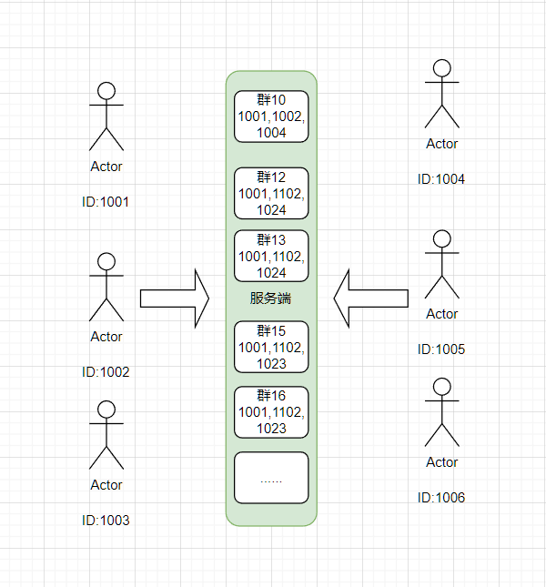
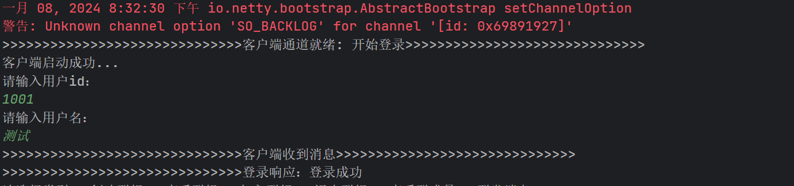
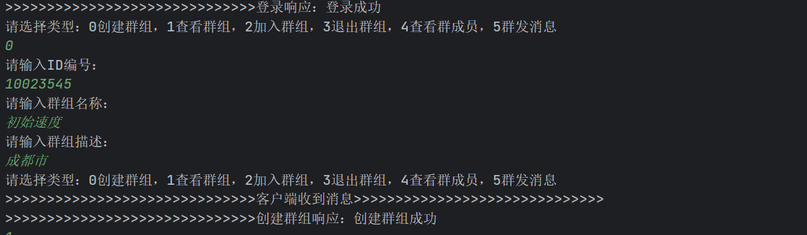

# Netty 实现群聊

## 1.1 分析

**本篇涉及的群聊核心功能，大致如下所示：**

- ***1）***登录：每个客户端连接服务端的时候，都需要输入自己的账号信息，以便和连接通道进行绑定；
- ***2）***创建群组：输入群组 ID 和群组名称进行创建群组。需要先根据群组 ID 进行校验，判断是否已经存在了；
- ***3）***查看群组：查看目前已经创建的群组列表；
- ***4）***加入群组：主要参数是群组 ID 和用户 ID，用户 ID 只需从 Channel 的绑定属性里面获取即。主要是判断群组 ID 是否存在，如果存在还需要判断该用户 ID 是否已经在群组里面了；
- ***5）***退出群组：主要是判断群组 ID 是否存在，如果存在则删除相应的关系；
- ***6）***查看组成员：根据群组 ID 去查询对应的成员列表；
- ***7）***群发消息：选择某个群进行消息发送，该群下的成员都能收到信息。主要判断群组 ID 是否存在，如果存在再去获取其对应的成员列表。



我们可以从分析出服务端应该需要维护两份关系：

- 用户信息跟通道的关系
- 群组ID跟群组成员的关系

## 1.2 登录

- 客户端：发送登录请求

```java
 /**
     * 发送登录请求
     */
    public void login(Channel channel) {
        //1.创建登录请求对象
        LoginReqBean req = new LoginReqBean();
        Scanner scanner = new Scanner(System.in);
        System.out.println("请输入用户id：");
        req.setUserId(scanner.nextInt());
        System.out.println("请输入用户名：");
        req.setUserName(scanner.next());
        //2.发送登录请求
        channel.writeAndFlush(req);
    }
```

- 服务端收到登录请求，添加到隐射关系汇中，保持登录状态

```java

    private static Map<Integer, Channel> map = new HashMap<Integer, Channel>();
    private static Map<Integer, Group> groups = new HashMap<Integer, Group>();

 private void login(LoginReqBean bean, Channel channel) {
        LoginResBean res = new LoginResBean();
        Channel c = map.get(bean.getUserId());
        if (c == null) {
            //通道为空，证明该用户没有在线
            System.out.println(">>>>>>>>>>>>>>>>>>>>>>>>>>>>>>用户登录成功>>>>>>>>>>>>>>>>>>>>>>>>>>>>>>");
            System.out.println(">>>>>>>>>>>>>>>>>>>>>>>>>>>>>>用户id：" + bean.getUserId() + ",用户名：" + bean.getUserName() + ">>>>>>>>>>>>>>>>>>>>>>>>>>>");
            //1.添加到map
            map.put(bean.getUserId(), channel);
            //2.给通道赋值
            channel.attr(AttributeKey.valueOf("userid")).set(bean.getUserId());
            //3.响应
            res.setStatus(0);
            res.setMsg("登录成功");
            res.setUserid(bean.getUserId());
            channel.writeAndFlush(res);
        } else {
            //通道不为空，证明该用户已经在线了
            res.setStatus(1);
            res.setMsg("该账户目前在线");
            channel.writeAndFlush(res);
        }
    }

```



## 1.2 创建群

- 客户端发送创建群请求：群ID，群名称，群描述

```java
 /**
     * 创建群组
     *
     * @param scanner
     * @param channel
     */
    private void createGroup(Scanner scanner, Channel channel) {
        GroupCreateReqBean req = new GroupCreateReqBean();
        Scanner scanner1 = new Scanner(System.in);
        System.out.println("请输入ID编号：");
        req.setGroupId(scanner1.nextInt());
        System.out.println("请输入群组名称：");
        req.setGroupName(scanner1.next());
        System.out.println("请输入群组描述：");
        req.setGruopDesc(scanner1.next());
        channel.writeAndFlush(req);
    }
```

- 服务端保存群ID与群成员ID的关系，并返回创建成功信息

```java
 /**
     * 创建群组： 1.判断群组是否已经存在 2.不存在，创建群组，响应创建成功 3.存在，响应已经存在
     * ：维护一个Map，key是群组ID，value是群组成员信息
     *
     * @param bean
     * @param channel
     */
    private void createGroup(GroupCreateReqBean bean, Channel channel) {
        //定义一个响应实体
        GroupCreateResBean res = new GroupCreateResBean();
        //查询groups是否已经存在
        Group group = groups.get(bean.getGroupId());
        //判断是否已经存在
        if (group == null) {
            //定义群组实体
            Group g = new Group();
            //定义一个集合，专门存储成员
            List<GroupMember> members = new ArrayList<GroupMember>();
            //属性赋值
            g.setGroupName(bean.getGroupName());
            g.setMembers(members);
            //添加到Map里面
            groups.put(bean.getGroupId(), g);
            //响应信息
            res.setGroupName(bean.getGroupName());
            res.setCode(0);
            res.setMsg("创建群组成功");
        } else {
            res.setCode(1);
            res.setMsg("该群组已经存在!");
        }
        channel.writeAndFlush(res);
    }

```



其他详细参考下面的关键代码：

- 客户端：

```java
package com.shu;

import com.shu.model.*;
import io.netty.channel.Channel;
import io.netty.channel.ChannelHandlerContext;
import io.netty.channel.ChannelInboundHandlerAdapter;
import io.netty.util.AttributeKey;

import java.util.Scanner;

/**
 * @description: 客户端处理器，用于处理客户端的请求和响应信息，继承ChannelInboundHandlerAdapter，重写channelRead方法，用于处理服务端响应的信息
 * @author: shu
 * @createDate: 2024/1/5 10:57
 * @version: 1.0
 */
public class MyClientChatHandler extends ChannelInboundHandlerAdapter {
    @Override
    public void channelActive(ChannelHandlerContext ctx) throws Exception {
        System.out.println(">>>>>>>>>>>>>>>>>>>>>>>>>>>>>>客户端通道就绪: 开始登录>>>>>>>>>>>>>>>>>>>>>>>>>>>>>>");
        //通道就绪时，发起登录请求
        login(ctx.channel());
    }

    /**
     * 收到消息
     *
     * @param ctx
     * @param msg
     * @throws Exception
     */
    @Override
    public void channelRead(ChannelHandlerContext ctx, Object msg) throws Exception {
        System.out.println(">>>>>>>>>>>>>>>>>>>>>>>>>>>>>>客户端收到消息>>>>>>>>>>>>>>>>>>>>>>>>>>>>>>");
        if (msg instanceof LoginResBean) {
            //1.登录结果响应
            LoginResBean res = (LoginResBean) msg;
            System.out.println(">>>>>>>>>>>>>>>>>>>>>>>>>>>>>>登录响应：" + res.getMsg());
            deal(ctx.channel());
        } else if (msg instanceof GroupCreateResBean) {
            //2.创建群组响应
            GroupCreateResBean res = (GroupCreateResBean) msg;
            System.out.println(">>>>>>>>>>>>>>>>>>>>>>>>>>>>>>创建群组响应：" + res.getMsg());

        } else if (msg instanceof GroupListResBean) {
            GroupListResBean res = (GroupListResBean) msg;
            System.out.println(">>>>>>>>>>>>>>>>>>>>>>>>>>>>>>获取群组列表响应：" + res.getGroupInfoList());
        }

    }

    /**
     * 发送登录请求
     */
    public void login(Channel channel) {
        //1.创建登录请求对象
        LoginReqBean req = new LoginReqBean();
        Scanner scanner = new Scanner(System.in);
        System.out.println("请输入用户id：");
        req.setUserId(scanner.nextInt());
        System.out.println("请输入用户名：");
        req.setUserName(scanner.next());
        //2.发送登录请求
        channel.writeAndFlush(req);
    }


    private void deal(final Channel channel) {
        final Scanner scanner = new Scanner(System.in);
        new Thread(new Runnable() {
            public void run() {
                while (true) {
                    System.out.println("请选择类型：0创建群组，1查看群组，2加入群组，3退出群组，4查看群成员，5群发消息");
                    int type = scanner.nextInt();
                    switch (type) {
                        case 0:
                            createGroup(scanner, channel);
                            break;
                        case 1:
                            listGroup(scanner, channel);
                            break;
                        case 2:
                            addGroup(scanner,channel);
                            break;
                        case 3:
                            quitGroup(scanner,channel);
                            break;
                        case 4:
                            listMembers(scanner,channel);
                            break;
                        case 5:
                            sendMsgToGroup(scanner,channel);
                            break;
                        default:
                            System.out.println("输入的类型不存在!");
                    }
                }
            }
        }).start();
    }


    /**
     * 群发消息
     * @param scanner
     * @param channel
     */
    private void sendMsgToGroup(Scanner scanner,Channel channel){
        System.out.println("请输入群组ID：");
        int groupId=scanner.nextInt();
        System.out.println("请输入发送消息内容：");
        String msg=scanner.next();
        Integer userId=(Integer) channel.attr(AttributeKey.valueOf("userid")).get();
        GroupSendMsgReqBean bean=new GroupSendMsgReqBean();
        bean.setFromuserid(userId);
        bean.setTogroupid(groupId);
        bean.setMsg(msg);
        channel.writeAndFlush(bean);
    }


    /**
     * 查看群成员
     * @param scanner
     * @param channel
     */
    private void listMembers(Scanner scanner,Channel channel){
        System.out.println("请输入群组ID：");
        int groupId=scanner.nextInt();
        GroupMemberReqBean bean=new GroupMemberReqBean();
        bean.setGroupId(groupId);
        channel.writeAndFlush(bean);
    }


    /**
     * 退出群组
     * @param scanner
     * @param channel
     */
    private void quitGroup(Scanner scanner, Channel channel) {
        System.out.println("请输入退出的群组ID");
        int groupId=scanner.nextInt();
        Integer userId=(Integer) channel.attr(AttributeKey.valueOf("userid")).get();
        GroupQuitReqBean bean=new GroupQuitReqBean();
        bean.setUserId(userId);
        bean.setGroupId(groupId);
        channel.writeAndFlush(bean);
    }


    /**
     * 添加群组
     * @param scanner
     * @param channel
     */
    private void addGroup(Scanner scanner, Channel channel) {
        System.out.println("请输入加入的群组ID");
        int groupId=scanner.nextInt();
        Integer userId=(Integer) channel.attr(AttributeKey.valueOf("userid")).get();
        GroupAddReqBean bean=new GroupAddReqBean();
        bean.setUserId(userId);
        bean.setGroupId(groupId);
        channel.writeAndFlush(bean);
    }


    /**
     * 查看群组
     *
     * @param scanner
     * @param channel
     */
    private void listGroup(Scanner scanner, Channel channel) {
        GroupListReqBean bean = new GroupListReqBean();
        bean.setType("list");
        channel.writeAndFlush(bean);
    }


    /**
     * 创建群组
     *
     * @param scanner
     * @param channel
     */
    private void createGroup(Scanner scanner, Channel channel) {
        GroupCreateReqBean req = new GroupCreateReqBean();
        Scanner scanner1 = new Scanner(System.in);
        System.out.println("请输入ID编号：");
        req.setGroupId(scanner1.nextInt());
        System.out.println("请输入群组名称：");
        req.setGroupName(scanner1.next());
        System.out.println("请输入群组描述：");
        req.setGruopDesc(scanner1.next());
        channel.writeAndFlush(req);
    }

}

```

- 服务端：

```java
package com.shu;

import com.shu.model.*;
import io.netty.channel.Channel;
import io.netty.channel.ChannelHandlerContext;
import io.netty.channel.ChannelInboundHandlerAdapter;
import io.netty.util.AttributeKey;

import java.util.ArrayList;
import java.util.HashMap;
import java.util.List;
import java.util.Map;
import java.util.logging.Logger;

/**
 * @description:
 * @author: shu
 * @createDate: 2024/1/5 11:02
 * @version: 1.0
 */
public class MyServerChatHandler extends ChannelInboundHandlerAdapter {
    private static Map<Integer, Channel> map = new HashMap<Integer, Channel>();
    private static Map<Integer, Group> groups = new HashMap<Integer, Group>();

    private static Logger logger = Logger.getLogger(MyServerChatHandler.class.getName());


    @Override
    public void channelRead(ChannelHandlerContext ctx, Object msg) throws Exception {
        if (msg instanceof LoginReqBean) {
            System.out.println(">>>>>>>>>>>>>>>>>>>>>>>>>>>>>>收到登录请求>>>>>>>>>>>>>>>>>>>>>>>>>>>>>>");
            //1.登录请求
            login((LoginReqBean) msg, ctx.channel());
        } else if (msg instanceof GroupCreateReqBean) {
            System.out.println(">>>>>>>>>>>>>>>>>>>>>>>>>>>>>>收到创建群组请求>>>>>>>>>>>>>>>>>>>>>>>>>>>>>>");
            //2.创建群组请求
            createGroup((GroupCreateReqBean) msg, ctx.channel());
        } else if (msg instanceof GroupListReqBean) {
            System.out.println(">>>>>>>>>>>>>>>>>>>>>>>>>>>>>>收到获取群组列表请求>>>>>>>>>>>>>>>>>>>>>>>>>>>>>>");
            //3.获取群组列表请求
            listGroup((GroupListReqBean) msg, ctx.channel());
        } else if (msg instanceof GroupAddReqBean) {
            System.out.println(">>>>>>>>>>>>>>>>>>>>>>>>>>>>>>收到加入群组请求>>>>>>>>>>>>>>>>>>>>>>>>>>>>>>");
            //4.加入群组请求
            addGroup((GroupAddReqBean) msg, ctx.channel());
        } else if (msg instanceof GroupQuitReqBean) {
            System.out.println(">>>>>>>>>>>>>>>>>>>>>>>>>>>>>>收到退出群组请求>>>>>>>>>>>>>>>>>>>>>>>>>>>>>>");
            //5.退出群组请求
            quitGroup((GroupQuitReqBean) msg, ctx.channel());
        } else if (msg instanceof GroupMemberReqBean) {
            System.out.println(">>>>>>>>>>>>>>>>>>>>>>>>>>>>>>收到查看群组成员请求>>>>>>>>>>>>>>>>>>>>>>>>>>>>>>");
            //6.查看群组成员请求
            listMember((GroupMemberReqBean) msg, ctx.channel());

        } else if (msg instanceof GroupSendMsgReqBean) {
            System.out.println(">>>>>>>>>>>>>>>>>>>>>>>>>>>>>>收到群发消息请求>>>>>>>>>>>>>>>>>>>>>>>>>>>>>>");
            //7.群发消息请求
            sendMsg((GroupSendMsgReqBean) msg, ctx.channel());
        }


    }


    private void sendMsg(GroupSendMsgReqBean bean, Channel channel) {
        GroupSendMsgResBean res = new GroupSendMsgResBean();
        //1.根据“群组ID”获取对应的“组信息”
        Group group = groups.get(bean.getTogroupid());
        //2.给“发送人”响应，通知其发送的消息是否成功
        if (group == null) {
            res.setCode(1);
            res.setMsg("groupId=" + bean.getTogroupid() + ",不存在!");
            channel.writeAndFlush(res);
            return;
        } else {
            res.setCode(0);
            res.setMsg("群发消息成功");
            channel.writeAndFlush(res);
        }
        //3.根据“组”下面的“成员”，变量并且逐个推送消息
        List<GroupMember> members = group.getMembers();
        for (GroupMember gm : members) {
            GroupRecMsgBean rec = new GroupRecMsgBean();
            rec.setFromuserid(bean.getFromuserid());
            rec.setMsg(bean.getMsg());
            gm.getChannel().writeAndFlush(rec);
        }
    }

    /**
     * 查看群组成员
     *
     * @param bean
     * @param channel
     */
    private void listMember(GroupMemberReqBean bean, Channel channel) {
        GroupMemberResBean res = new GroupMemberResBean();
        List<Integer> lists = new ArrayList<Integer>();
        //1.根据“群组ID”获取对应的“组信息”
        Group group = groups.get(bean.getGroupId());
        if (group == null) {
            //2.查询的群组不存在
            res.setCode(1);
            res.setMsg("groupId=" + bean.getGroupId() + ",不存在!");
            channel.writeAndFlush(res);
        } else {
            //3.群组存在，则变量其底层的成员
            for (Map.Entry<Integer, Group> entry : groups.entrySet()) {
                Group g = entry.getValue();
                List<GroupMember> members = g.getMembers();
                for (GroupMember gm : members) {
                    lists.add(gm.getUserid());
                }
            }
            res.setCode(0);
            res.setMsg("查询成功");
            res.setList(lists);
            channel.writeAndFlush(res);
        }
    }


    /**
     * 退出群组
     *
     * @param bean
     * @param channel
     */
    private void quitGroup(GroupQuitReqBean bean, Channel channel) {
        GroupQuitResBean res = new GroupQuitResBean();
        //1.根据“群组ID”获取对应的“组信息”
        Group group = groups.get(bean.getGroupId());
        if (group == null) {
            //2.群组不存在
            res.setCode(1);
            res.setMsg("groupId=" + bean.getGroupId() + ",不存在!");
            channel.writeAndFlush(res);
            return;
        }
        //3.群组存在，则获取其底下“成员集合”
        List<GroupMember> members = group.getMembers();
        //4.遍历集合，找到“当前用户”在集合的序号
        int index = -1;
        for (int i = 0; i < members.size(); i++) {
            if (members.get(i).getUserid() == bean.getUserId()) {
                index = i;
                break;
            }
        }
        //5.如果序号等于-1，则表示“当前用户”不存在集合里面
        if (index == -1) {
            res.setCode(1);
            res.setMsg("userid=" + bean.getUserId() + ",不存在该群组里面!");
            channel.writeAndFlush(res);
            return;
        }
        //6.从集合里面删除“当前用户”
        members.remove(index);
        //7.给“群组”的“成员列表”重新赋值
        group.setMembers(members);
        res.setCode(0);
        res.setMsg("退出群组成功");
        channel.writeAndFlush(res);
    }


    /**
     * 加入群组
     *
     * @param bean
     * @param channel
     */
    private void addGroup(GroupAddReqBean bean, Channel channel) {
        GroupAddResBean res = new GroupAddResBean();
        //1.根据“群组ID”获取对应的“组信息”
        Group group = groups.get(bean.getGroupId());
        //2.“群组”不存在
        if (group == null) {
            res.setCode(1);
            res.setMsg("groupId=" + bean.getGroupId() + ",不存在!");
            channel.writeAndFlush(res);
            return;
        }
        //3.“群组”存在，则获取其底下的“成员集合”
        List<GroupMember> members = group.getMembers();
        boolean flag = false;
        //4.遍历集合，判断“用户”是否已经存在了
        for (GroupMember gm : members) {
            if (gm.getUserid().equals(bean.getUserId())) {
                flag = true;
                break;
            }
        }
        if (flag) {
            res.setCode(1);
            res.setMsg("已经在群组里面,无法再次加入!");
        } else {
            //1.用户信息
            GroupMember gm = new GroupMember();
            gm.setUserid(bean.getUserId());
            gm.setChannel(channel);
            //2.添加到集合里面
            members.add(gm);
            //3.给“群组”重新赋值
            group.setMembers(members);
            res.setCode(0);
            res.setMsg("加入群组成功");
        }
        channel.writeAndFlush(res);
    }


    /**
     * 获取群组列表
     *
     * @param bean
     * @param channel
     */
    private void listGroup(GroupListReqBean bean, Channel channel) {
        if ("list".equals(bean.getType())) {
            //定义一个响应实体
            GroupListResBean res = new GroupListResBean();
            //定义一个集合
            List<GroupInfo> lists = new ArrayList<GroupInfo>();
            //变量groups Map集合
            for (Map.Entry<Integer, Group> entry : groups.entrySet()) {
                Integer mapKey = entry.getKey();
                Group mapValue = entry.getValue();
                GroupInfo gi = new GroupInfo();
                gi.setGroupId(mapKey);
                gi.setGroupName(mapValue.getGroupName());
                lists.add(gi);
            }
            //把集合添加到响应实体里面
            res.setGroupInfoList(lists);
            //开始写到客户端
            channel.writeAndFlush(res);
        }
    }


    /**
     * 登录请求
     *
     * @param bean
     * @param channel
     */
    private void login(LoginReqBean bean, Channel channel) {
        LoginResBean res = new LoginResBean();
        Channel c = map.get(bean.getUserId());
        if (c == null) {
            //通道为空，证明该用户没有在线
            System.out.println(">>>>>>>>>>>>>>>>>>>>>>>>>>>>>>用户登录成功>>>>>>>>>>>>>>>>>>>>>>>>>>>>>>");
            System.out.println(">>>>>>>>>>>>>>>>>>>>>>>>>>>>>>用户id：" + bean.getUserId() + ",用户名：" + bean.getUserName() + ">>>>>>>>>>>>>>>>>>>>>>>>>>>");
            //1.添加到map
            map.put(bean.getUserId(), channel);
            //2.给通道赋值
            channel.attr(AttributeKey.valueOf("userid")).set(bean.getUserId());
            //3.响应
            res.setStatus(0);
            res.setMsg("登录成功");
            res.setUserid(bean.getUserId());
            channel.writeAndFlush(res);
        } else {
            //通道不为空，证明该用户已经在线了
            res.setStatus(1);
            res.setMsg("该账户目前在线");
            channel.writeAndFlush(res);
        }
    }

    /**
     * 创建群组： 1.判断群组是否已经存在 2.不存在，创建群组，响应创建成功 3.存在，响应已经存在
     * ：维护一个Map，key是群组ID，value是群组成员信息
     *
     * @param bean
     * @param channel
     */
    private void createGroup(GroupCreateReqBean bean, Channel channel) {
        //定义一个响应实体
        GroupCreateResBean res = new GroupCreateResBean();
        //查询groups是否已经存在
        Group group = groups.get(bean.getGroupId());
        //判断是否已经存在
        if (group == null) {
            //定义群组实体
            Group g = new Group();
            //定义一个集合，专门存储成员
            List<GroupMember> members = new ArrayList<GroupMember>();
            //属性赋值
            g.setGroupName(bean.getGroupName());
            g.setMembers(members);
            //添加到Map里面
            groups.put(bean.getGroupId(), g);
            //响应信息
            res.setGroupName(bean.getGroupName());
            res.setCode(0);
            res.setMsg("创建群组成功");
        } else {
            res.setCode(1);
            res.setMsg("该群组已经存在!");
        }
        channel.writeAndFlush(res);
    }


    /**
     * 通道断开连接
     *
     * @param ctx
     * @throws Exception
     */
    @Override
    public void channelUnregistered(ChannelHandlerContext ctx) throws Exception {
        super.channelUnregistered(ctx);
        System.out.println(">>>>>>>>>>>>>>>>>>>>>>>>>>>>>>客户端断开连接>>>>>>>>>>>>>>>>>>>>>>>>>>>>>>");
        //1.获取通道中的userid
        Integer userid = (Integer) ctx.channel().attr(AttributeKey.valueOf("userid")).get();
        //2.移除map中的通道
        map.remove(userid);
    }
}
```

