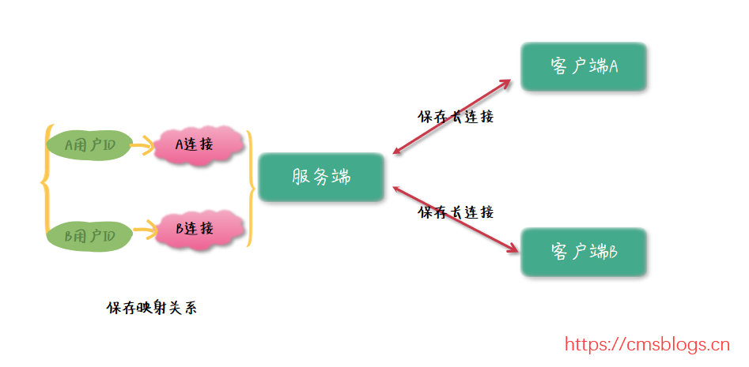
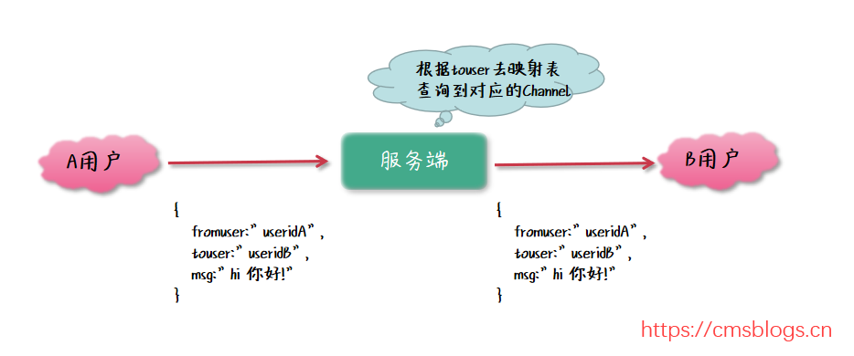
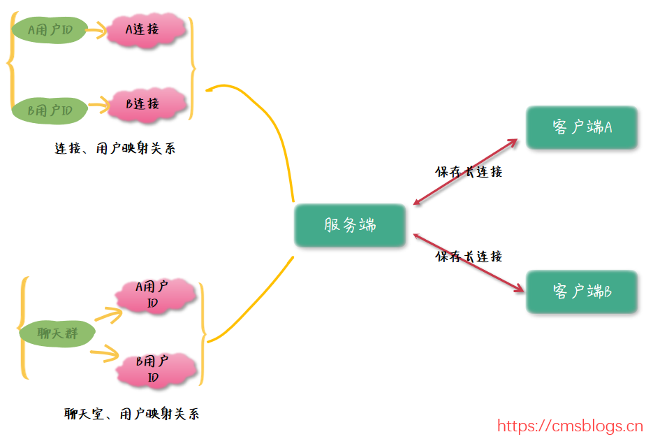

# 一 需求分析？

- **业务场景：** 本次实战就是模拟微信的IM聊天，每个客户端和服务端建立连接，并且可以实现点对点通信（单聊），点对多点通信（群聊）。

- **设计思路：** 我们要实现的是点（客户端）对点（客户端）的通讯，但是我们大部分情况下接触的业务都是客户端和服务端之间的通讯（所谓的C/S模式？），客户端只需要知道服务端的 IP 地址和端口号即可发起通讯了。**那么客户端和客户端应该怎么去设计呢？**

- **技术思考：**难道是手机和手机之间建立通讯连接（所谓的P2P），互相发送消息吗？

  **这种方案显然不是很好的方案：**

  - ***1）***首先： 客户端和客户端之间通讯，首先需要确定对方的 IP 地址和端口号，显然不是很现实；
  - ***2）***其次： 即使有办法拿到对方的 IP 地址和端口号，那么每个点（客户端）既作为服务端还得作为客户端，无形之中增加了客户端的压力。
  - **其实：**我们可以使用服务端作为IM聊天消息的中转站，由服务端主动往指定客户端推送消息。如果是这种模式的话，那么 Http 协议是无法支持的（因为Http 是无状态的，只能一请求一响应的模式），于是就只能使用 TCP 协议去实现了。

# 二 单聊设计思路？

**流程解析**

1. 实现客户端和客户端之间通讯，那么需要使用服务端作为通讯的中转站，每个客户端都必须和服务端建立连接；
2. 每个客户端和服务端建立连接之后，服务端保存用户 ID 和通道的映射关系，其中用户 ID 作为客户端的唯一标识；
3. 客户端 A 往客户端 B 发送消息时，先把消息发送到服务端，再有服务端往客户端 B 进行推送。但是，服务端如何找到客户端 B 呢？
   3.1 客户端 A 往服务端发送消息时，消息携带的信息有：客户端 A 用户 ID、客户端 B 用户 ID、消息内容。这样服务端就能顺利找到服务端 B 的通道并且进行推送消息了。

**消息推送流程**

每个客户端和服务端建立连接的时候，必须把个人用户信息上传到服务端，由服务端统一保存映射关系，如果某个客户端下线了，则服务端监听到连接断开，删除对应的映射关系。其次，发起群聊的时候，需要传递 touser 字段，服务端根据该字段在映射表里面查找到对应的连接通道并发起消息推送。

# 三 群聊设计思路？

群聊指的是一个组内多个用户之间的聊天，一个用户发到群组的消息会被组内任何一个成员接收 。

**群聊流程解析：**

1. 群聊其实和单聊整体上思路都是一致的，都是需要保存每个用户和通道的对应关系，方便后期通过用户 ID 去查找到对应的通道，再跟进通道推送消息；
2. 那么如何把消息发送给多个组内的成员呢？其实很简单，服务端再保存另外一份映射关系，那就是聊天室和成员的映射关系。发送消息时，首先根据聊天室 ID 找到对应的所有成员，然后再跟进各个成员的 ID 去查找到对应的通道，最后由每个通道进行消息的发送；
3. 成员加入某个群聊组的时候，往映射表新增一条记录，如果成员退群的时候则删除对应的映射记录；
4. 通过上面的架构图发现，群聊和单聊相比，其实就是多了一份映射关系而已。

**单聊：** 主要是服务器保存了一份用户和通道之间的映射关系，发送消息的时候，根据接收人 ID 找到其对应的通道 Channel，Channel 的 write () 可以给客户端发送消息；
**群聊：** 保存两份关系，分别是用户 ID 和 Channel 之间的关系、群组 ID 和用户 ID 的关系。推送消息的时候，首先根据聊天组 ID 找到其对应的成员，遍历每个成员再进行找出其对应的通道即可。

整体来说，思路还是很简单的，掌握了该设计思路以后，你会发现设计一款 IM 聊天软件其实也不是很复杂。