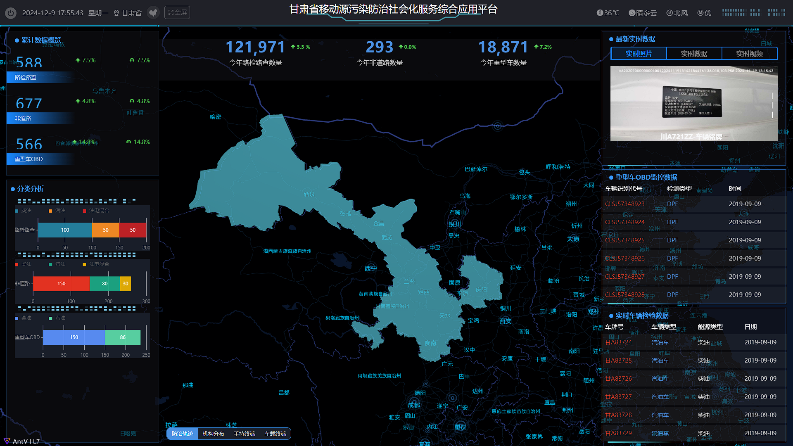
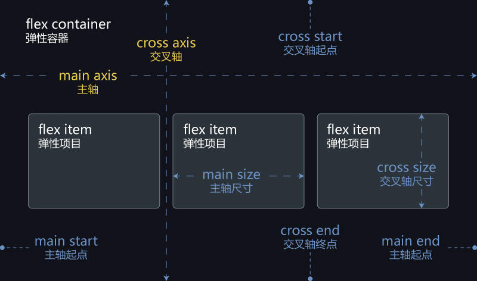
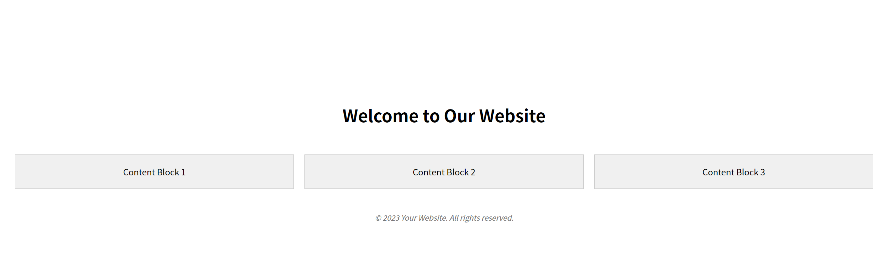

# CSS弹性布局

CSS [弹性布局](https://so.csdn.net/so/search?q=弹性布局&spm=1001.2101.3001.7020)（Flexbox）是一个强大的布局模型，旨在提供更有效的方式来布局、对齐和分配空间，尤其是在动态和复杂的网页设计中。Flexbox 能够处理**一维布局**，无论是横向还是纵向。



## 1.1 核心概念

- 在 Flex 布局中，设置了`display: flex`;的元素称为Flex 容器，而它的所有子元素称为Flex 项目。
- 容器默认会产生两条轴：水平的主轴（`main axis`）和垂直的交叉轴（cross axis）。
- 主轴的起始位置称为main start，结束位置称为main end；交叉轴的起始位置称为cross start，结束位置称为cross end。
- 项目会沿着主轴排列，每个项目占据的主轴空间称为main size，占据的交叉轴空间称为cross size。



- 弹性容器（Flex Container）：通过设置 display 属性为 flex 或 inline-flex，将元素变为弹性容器。
- 弹性子项（Flex Item）：弹性容器内的直接子元素称为弹性子项。
- 主轴（Main Axis）：弹性容器的主轴方向，默认为水平方向。
- 叉轴（Cross Axis）：垂直于主轴的轴称为交叉轴。

## 1.2 容器的属性

1. **flex-direction**:
   - 定义了弹性容器中弹性项目的主轴（即放置项目的方向）。它可以有以下值：
     - `row` (默认值)：左到右的水平行。
     - `row-reverse`：右到左的水平行。
     - `column`：上到下的垂直列。
     - `column-reverse`：下到上的垂直列。

1. **justify-content**:
   - 用于定义弹性项目沿主轴方向的对齐方式。它影响的是当弹性容器有多余空间时，多余空间如何分配给各个弹性项目。其值可以是：
     - `flex-start` (默认值)：向主轴起点对齐。
     - `flex-end`：向主轴终点对齐。
     - `center`：居中对齐。
     - `space-between`：项目均匀分布；第一项在起点，最后一项在终点。
     - `space-around`：项目均匀分布，每个项目两侧的间隔相等。
     - `space-evenly`：项目均匀分布，所有项目之间的间隔相同，包括与容器边缘之间的间隔。
2. **align-items**:
   - 定义了弹性项目在交叉轴（与主轴垂直的轴）上的对齐方式。它的可能值为：
     - `stretch` (默认值)：如果项目没有设置高度或设为自动，它们将被拉伸以适应容器。
     - `flex-start`：项目侧边与交叉轴起点对齐。
     - `flex-end`：项目侧边与交叉轴终点对齐。
     - `center`：项目中心点与交叉轴中心对齐。
     - `baseline`：项目基线对齐。
3. **flex-wrap**:
   - 定义了弹性项目是否应该换行。其值可以是：
     - `nowrap` (默认值)：所有的弹性项目都将在一行内显示。
     - `wrap`：允许弹性项目换行，第一行在上方。
     - `wrap-reverse`：允许弹性项目换行，但第一行会在下方。
4. **flex-flow**:
   - 是`flex-direction`和`flex-wrap`的简写形式。例如，`flex-flow: row wrap;`相当于同时设置了`flex-direction: row;`和`flex-wrap: wrap;`。
5. **align-content**:
   - 当有多根轴线（即弹性项目换行形成多行时），此属性定义了这些行在交叉轴上的对齐方式。它不会影响单行的情况。它的值类似于`justify-content`，但应用于行而不是单个项目。

```html
<!DOCTYPE html>
<html lang="en">

<head>
    <meta charset="UTF-8">
    <title>Flexbox Layout Example</title>
    <style>
        .container {
            display: flex;
            flex-direction: column;
            align-items: center;
            justify-content: center;
            min-height: 100vh;
            padding: 20px;
            box-sizing: border-box;
        }

        .header {
            width: 100%;
            text-align: center;
            margin-bottom: 20px;
        }

        .content-blocks {
            display: flex;
            flex-wrap: wrap;
            justify-content: space-around;
            width: 100%;
        }

        .block {
            background-color: #f0f0f0;
            border: 1px solid #ccc;
            padding: 20px;
            margin: 10px;
            flex: 1 1 calc(33.333% - 20px);
            /* Grow, Shrink and Basis */
            min-width: 200px;
            box-sizing: border-box;
            text-align: center;
        }

        @media (max-width: 600px) {
            .content-blocks {
                flex-direction: column;
            }

            .block {
                flex-basis: 100%;
                max-width: 100%;
            }
        }

        .footer {
            width: 100%;
            text-align: center;
            margin-top: 20px;
            font-size: 14px;
            color: #777;
            font-style: italic;
        }
    </style>
</head>

<body>
    <div class="container">
        <div class="header">
            <h1>Welcome to Our Website</h1>
        </div>
        <div class="content-blocks">
            <div class="block">Content Block 1</div>
            <div class="block">Content Block 2</div>
            <div class="block">Content Block 3</div>
        </div>
        <div class="footer">
            <p>&copy; 2023 Your Website. All rights reserved.</p>
        </div>
    </div>
</body>

</html>
```

