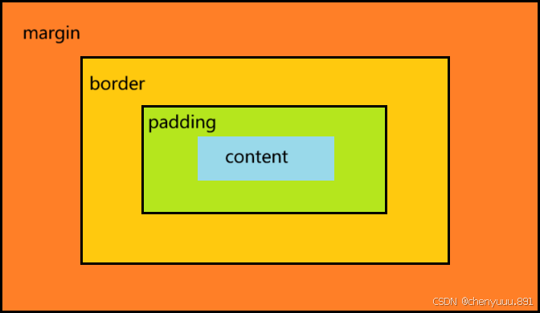

# CSS网页布局

- https://www.lingdaima.com/grid/
- https://cssgrid-generator.netlify.app/
- https://www.lingdaima.com/

在网页设计中，CSS（Cascading Style Sheets）起到了至关重要的作用。它不仅是用来定义颜色、字体和间距等样式的工具，它还是实现网页布局的关键技术之一。网页布局的核心本质就是利用 CSS 摆盒子，通过CSS开发者能够创造出丰富多样、响应式且用户友好的网页布局。本文将带领大家了解CSS网页布局的基础知识，并通过实例代码，掌握常见的布局方式。
## 1.1 盒模型

- CSS布局的核心是盒模型。每个HTML元素都可以看作是一个盒子，包括内容（content）、内边距（padding）、边框（border）和外边距（margin）



> 内容（Content）

- 内容区域是盒子模型的中心，它包含了元素的实际内容，比如文本、图片等。
- 内容的宽度和高度可以通过`width`和`height`属性来设置。

> 内边距（Padding）

- 内边距是内容区域与边框之间的空间。它可以通过padding属性来设置，该属性可以接受一到四个值（上、右、下、左）。

> 边框（Border）

- 边框围绕着内边距和内容。
- 它可以通过`border`属性来设置，该属性可以指定边框的宽度、样式和颜色。
- 例如，`border: 1px solid black;` 将创建一个1像素宽的实线黑色边框。

> 外边距（Margin）

- 外边距是盒子与其他元素之间的空间。
- 它可以通过`margin`属性来设置，与`padding`类似，`margin`也可以接受一到四个值。
- 例如，`margin: 20px;` 将为所有四个方向设置20像素的外边距。
- 外边距可以让块级盒子水平居中（盒子指定宽度后设左右外边距为auto）

> 案例

```css
p {
  width: 300px;          /* 设置内容区的宽度 */
  padding: 20px;         /* 内边距，控制内容与边框之间的距离 */
  border: 5px solid black; /* 边框，定义了边框的宽度、样式和颜色 */
  margin: 10px;          /* 外边距，控制盒子与其他元素之间的距离 */
  background-color: #f0f0f0; /* 背景颜色 */
}
```

> 扩展：box-sizing

`box-sizing`属性在CSS中用于定义元素的盒模型将如何计算宽度和高度。它影响了内边距（padding）和边框（border）是否被包含在设置的宽度和高度之内。`box-sizing`有三个可能的值：

1. `content-box`：这是默认行为，根据传统的CSS盒模型。当您为元素指定宽度和高度时，这些尺寸仅应用于内容区域。任何额外的内边距或边框都会增加元素的实际总宽度和高度。
2. `border-box`：这种情况下，元素的宽度和高度包括了内容、内边距和边框。这意味着，无论你添加多少内边距或边框，元素的最终宽度和高度都不会超过最初设定的尺寸。这使得布局更加直观和易于控制，因为你不需要每次都考虑内边距和边框对总尺寸的影响。
3. `inherit`：这个值让元素从其父元素继承`box-sizing`属性的值。

## 1.2 元素显示模式

网页的标签非常多，在不同地方会用到不同类型的标签，了解他们的特点可以更好的布局我们的网页。CSS中有三种基本的显示类型：块级元素（block）、行内元素（inline）和行内块元素（inline-block）。

> 块级元素（block）

- 常见的块元素有`<h1>~<h6>` ,`<p>`,`<div>`,`<ul>`,`<ol>`,`<li>`等，其中`<div>`标签是最典型的块元素。
- 块级元素特点：独占一行，可以设置宽度和高度，里面可以放行内或块级元素。
- 注意：文字类的元素里面不能使用块级元素。

> 行内元素（inline）

- 常见的行内元素有`<a>`,`<strong>`,`<b>`,`<em>`,`<i>`,`<del>`,`<s>`,`<ins>`,`<u>`,`<span>`等，其中`<span>`标签是最典型的行内元素。有的地方将行内元素称为内联元素。
- 行内元素的特点：与其他行内元素共享一行，不能设置宽度和高度。里面只能容纳文本或其他行内元素。
- 注意：特殊情况链接`<a>`里面可以放块级元素，但是一般情况下把`<a>`转换成块级元素最安全。

> 行内块元素（inline-block）

- 在行内元素中有几个特殊的标签——``,`<input />`,`<td>`,它们同时具有块元素和行内元素的特点，称为行内块元素。
- 行内块元素特点：一行可以显示多个，默认宽度就是它本身内容的宽度（行内元素特点），可以设置高度和宽度（块级元素特点）。

> 元素显示模式转换

- 转换为块元素：display:block;
- 转换为行内元素：display:inline; 
- 转换为行内块：display: inline-block;

## 1.3 浮动

浮动（Float）是CSS布局中一个非常重要的概念，它最初被设计用来实现文本环绕图片的效果，但随着Web的发展，浮动被广泛用于页面布局。

> 定义

浮动属性（`float`）用于指定一个元素是否应该浮动，以及它应该浮动到哪一侧。浮动元素会脱离常规的文档流，并向左或向右移动，直到它的外边缘碰到包含框或另一个浮动元素的边缘。

- 语法：选择器 { float：属性值 ；}

| **属性值** | **描述**             |
| ---------- | -------------------- |
| none       | 元素不浮动（默认值） |
| left       | 元素向左浮动         |
| right      | 元素向右浮动         |

> 特性

- 脱离文档流：
- 当一个元素浮动后，它将脱离常规文档流，不再占据文档流中的位置，但其内容仍然会按照文档流进行排列。（脱标，浮动的盒子不再保留原先的位置）
  内容环绕：
- 浮动元素周围的非浮动内容会环绕该浮动元素。行内块化：
- 浮动元素会变成行内块元素（inline-block），即使它是block元素。如果多个盒子都设置了浮动，则它们会按照属性值一行内显示并且顶端对齐排列。
  高度塌陷：
- 当一个元素浮动后，它的高度不会影响父元素的高度，这可能导致父元素的高度塌陷

> 清除浮动

由于浮动元素会导致父元素高度塌陷，因此需要清除浮动以恢复文档流的正常布局。清除浮动的本质是清除浮动元素造成的影响，清除浮动之后，父级就会根据浮动的子盒子自动检测高度。父级有了高度，就不会影响下面的标准流了。

> 额外标签法（隔墙法）

**实现：**
在最后一个浮动的子元素后面添加一个额外的空`<div>`标签，并设置`clear: both;`样式来清除浮动。

```html
<div class="container">
  <div class="float-child">浮动内容</div>
  <div style="clear: both;"></div> <!-- 清除浮动 -->
</div>
```

**优点：**

- 简单直接，容易理解。
  

**缺点：**

- 添加了无语义的HTML标签，对文档结构不利。
- 不符合现代最佳实践，因为增加了不必要的标记。

> 使用`overflow`属性

**实现：**
为包含浮动元素的父容器设置`overflow`属性值为`auto`或`hidden`。

```css
.container {
  overflow: auto; /* 或者 hidden */
}
```

**优点：**

- 代码简洁，不需要额外的HTML标签。
- 自动创建一个新的块格式化上下文(BFC)，可以有效地防止浮动元素影响布局。

**缺点：**

- 如果父元素有超出部分的内容，这些内容将被裁剪掉（当使用`hidden`时），这可能不是预期行为。
- 在某些情况下，可能会导致不必要的滚动条出现（当使用`auto`时）。

> 使用CSS伪元素（推荐方法）

**实现：**
通过`:after`伪元素在父元素之后插入一个虚拟元素，并对该元素应用`clear: both;`，同时需要确保这个伪元素是作为表格显示的，以保证它能够正确地清除浮动。

```css
.container::after {
  content: "";
  display: table;
  clear: both;
}
```

**优点：**
- 不需要改变HTML结构，保持了语义化的HTML。
- 是目前最常用和推荐的方式之一。
- 支持所有现代浏览器。

**缺点：**
- 对于不支持伪元素的老版本IE浏览器（如IE7及以下），这种方法不起作用。

## 1.4 定位

在CSS（层叠样式表）中，定位（Positioning）是一种布局机制，它允许你控制元素在页面上的精确位置。CSS提供了多种定位机制，每种机制都有其特定的用途和效果，它们分别是静态定位、相对定位、绝对定位和固定定位。

> 定位組成

- 定位 = 定位模式 + 边偏移 。
- 定位模式用于指定一个元素在文档中的定位方式。边偏移则决定了该元素的最终位置。
- top	top: 80px;	顶端偏移量，定义元素相对于父元素上边线的距离
- bottom	bottom: 80px;	底部偏移量，定义元素相对于父元素下边线的距离
- left	left: 80px;	左侧偏移量，定义元素相对于父元素左边线的距离
- right	right: 80px;	右侧偏移量，定义元素相对于父元素右边线的距离

> 静态定位

- 静态定位是元素的默认定位方式，无定位的意思。
- 它不会受到`top`、`right`、`bottom`和`left`属性的影响。静态定位的元素是按照文档流进行布局的。
- 语法： 选择器 { position: static; }

> 相对定位

- 相对定位的元素是基于其原来位置进行移动的。使用相对定位时，可以通过`top`、`right`、`bottom`和`left`属性来设置元素相对于其原始位置的偏移量。
- 相对定位的元素仍然占据在文档流中的原始空间，因此相对定位并没有脱标。
- 语法： 选择器{ position: relative; }

> 绝对定位

- 绝对定位的元素会完全脱离文档流，其位置是相对于最近的已定位祖先元素（非static定位的元素）来计算的。
- 如果没有祖先元素或者祖先元素没有定位，则以浏览器为准定位（Document 文档）。
- 绝对定位不再占有原先的位置。（脱标）
- 语法： 选择器{ position: absolute; }

> 固定定位

- 固定定位类似于绝对定位，但它是相对于浏览器的可视窗口进行定位的，这意味着即使页面滚动，固定定位的元素也会保持在相同的位置。
- 固定定位不在占有原先的位置。（脱标）
- 语法： 选择器{ position: fixed; }

> 子绝父相

- “子绝父相 ”是定位常见的口诀，是定位中最常用的一种方式：子级是绝对定位的话，父级要用相对定位。
- 子级绝对定位，不会占有位置，可以放到父盒子里面的任何一个地方，不会影响其他的兄弟盒子。
- 父盒子需要加定位限制子盒子在父盒子内显示。
- 父盒子布局时，需要占有位置，因此父亲只能是相对定位。
- 这就是子绝父相的由来，所以相对定位经常用来作为绝对定位的父级。
-  总结：因为父级需要占有位置，因此是相对定位，子盒子不需要占有位置，则是绝对定位 当然，子绝父相不是永远不变的，如果父元素不需要占有位置，子绝父绝也会遇到。

> 定位叠放次序 z-index

- 在使用定位布局时，可能会出现盒子重叠的情况。此时，可以使用 z-index 来控制盒子的前后次序 (z轴)
- 语法：选择器 { z-index: 1; }
-  数值可以是正整数、负整数或 0, 默认是 auto，数值越大，盒子越靠上
-  如果属性值相同，则按照书写顺序，后来居上
- 数字后面不能加单位
- 只有定位的盒子才有 z-index 属性

## 1.5 布局

1. 表格布局（不推荐）

早期网页常使用`<table>`标签进行布局，通过行（`<tr>`）、列（`<td>`或`<th>`）来划分页面区域。然而，这种方法不利于搜索引擎优化（SEO）和响应式设计，因此现代网页布局中已较少使用。

2. 浮动布局（Float）

通过CSS的float属性，可以让元素脱离其正常的文档流并向左或向右移动，直到它的外边缘碰到包含框或另一个浮动元素的边缘。浮动布局是实现多栏布局的一种经典方式，但需要注意清除浮动带来的影响。

3. 定位布局（Positioning）

CSS中的定位机制（包括`static、relative、absolute、fixed和sticky`）允许元素根据其正常位置进行偏移或固定位置显示。其中，absolute和relative定位常用于创建复杂的布局效果。

4 .弹性盒布局（Flexbox）

Flexbox布局提供了一种更为高效的方式来对容器中的项目进行布局、对齐和分配空间，即使它们的大小未知或是动态变化的。Flexbox主要思想是给予容器（flex container）内的项目（flex items）更多的灵活性，让布局能够在不同尺寸的屏幕和不同的显示设备上以最优的方式显示。

5 .网格布局（Grid）

CSS Grid布局是一种二维布局系统，旨在通过创建由行和列组成的网格来对元素进行布局。它提供了更为强大的布局控制能力，包括列宽、行高、对齐和分布等，非常适合用于复杂的页面布局设计。

