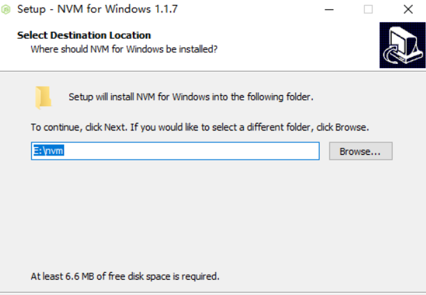
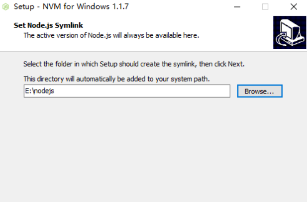
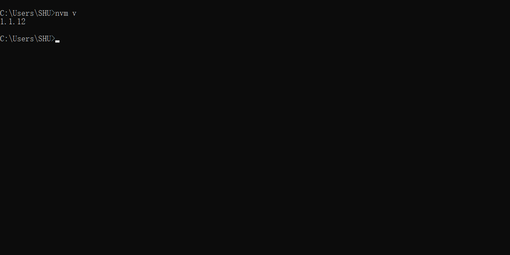
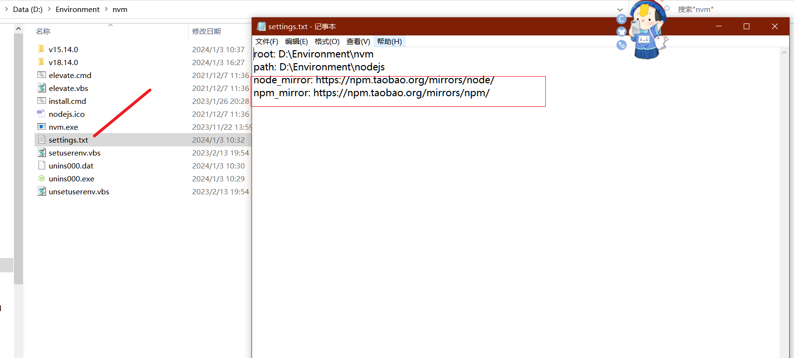
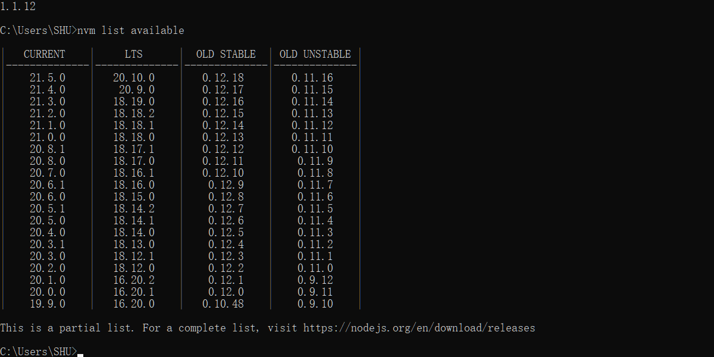
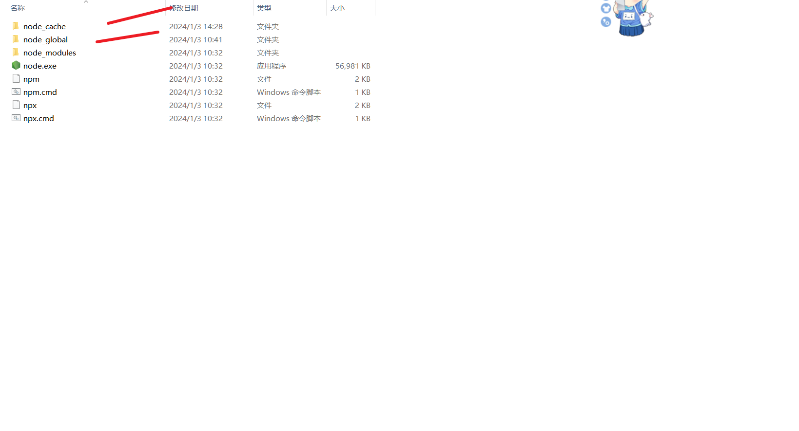
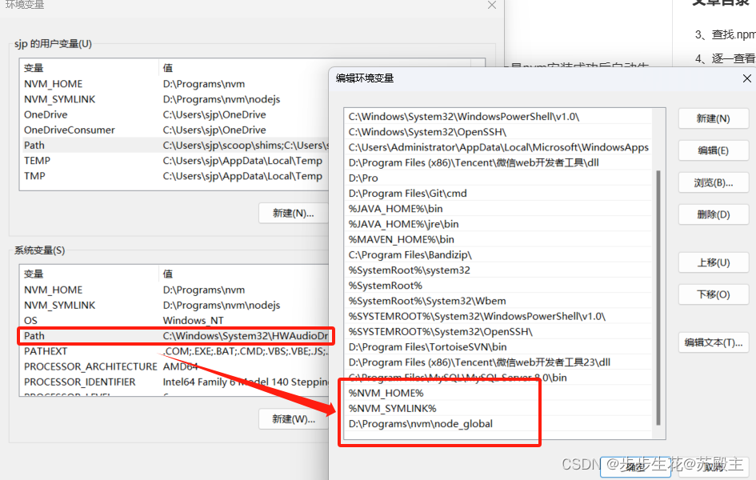
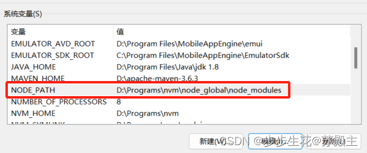

# 一 卸载node

## 1.1 卸载Node

- 如果你已经安装了node，那么你需要先卸载node，如果你没有安装那直接跳过这一步到下一步。
- 打开控制面板 -> 打开程序和功能 -> 右上角搜索输入node -> 右键卸载
- 为了确保彻底删除node在看看你的node安装目录中还有没有node文件夹，有的话一起删除。再看看C:\Users\用户名 文件夹下有没有`.npmrc`以及`.yarnrc`等等统统删除。再去看看你的环境变量有没有node相关的，有的话也一起删除了。

# 二 安装nvm

## 1.1 下载NVM

- 下载地址： https://github.com/coreybutler/nvm-windows/releases


- 傻瓜式安装，注意`nvm`安装路径与`nodejs`路径





- 点击next，安装完成后在终端输入`nvm version`，能查到版本号说明安装成功了。



## 1.2 配置路径和下载源

- 安装完nvm后先不要着急安装node。**找到nvm安装路径 -> 找到 `settings.txt` 文件 -> 配置下载源**



```
node_mirror: https://npm.taobao.org/mirrors/node/
npm_mirror: https://npm.taobao.org/mirrors/npm/
```

## 1.3 使用nvm安装node

- 在终端输入 `nvm list available`， 查看网络可以安装的版本。



- 安装node 版本 18.14.0 和 15.14.0

```
nvm install 版本号
```

- 查看安装了的Node

```
nvm ls
```

- 使用哪一个

```
nvm use 版本号
```

注意必须先使用了，才有nodejs目录


## 1.4 常用命令

- nvm install version：安装指定版本的Node.js。例如，nvm install 14.17.0将安装Node.js 14.17.0版本。
- nvm use version：切换到指定版本的Node.js。例如，nvm use 14.17.0将切换到Node.js 14.17.0版本。
- nvm ls：列出已安装的所有Node.js版本。
- nvm ls-remote：列出远程可用的所有Node.js版本。
- nvm current：显示当前正在使用的Node.js版本。
- nvm alias name version：为指定的版本创建一个别名。例如，nvm alias default 14.17.0将为Node.js 14.17.0版本创建一个名为"default"的别名。
- nvm unalias name：删除指定的版本别名。例如，nvm unalias default将删除名为"default"的别名。
- nvm uninstall version：卸载指定的Node.js版本。例如，nvm uninstall 14.17.0将卸载Node.js 14.17.0版本。
  

## 1.5 卸载

系统应用找到该服务，点击卸载

## 1.6 配置npm

#### 1 配置全局安装的模块路径和缓存路径

- 首先在NVM的安装目录**新建两个文件夹**`node_global`和`node_cache`



- 创建完两个文件夹后，在cmd窗口中输入以下命令（两个路径即是两个文件夹的路径）

```
npm config set prefix "D:\Programs\nvm\node_global"
npm config set cache "D:\Programs\nvm\node_cache"
```

#### 2 设置用户变量

- 【用户变量】中的path变量，%NVM_HOME% 和 %NVM_SYMLINK% 理论上是nvm安装成功后自动生成的。如果没有，新建进去。
  如果有C:\Users\用户名\AppData\Roaming\npm，则将其修改为D:\Programs\nvm\node_global(刚刚新建node_global文件夹的位置)，如果没有就自己新建D:\Programs\nvm\node_global，总之保证有以下图片中内容
  

- 新建环境变量 `NODE_PATH`，值为`D:\Programs\nvm\node_global\node_modules`，其中`D:\Programs\nvm\node_global\node_modules`是上述创建的全局模块安装路径文件夹



#### 3 配置镜像

```
npm config set registry https://registry.npm.taobao.org
 
npm config get registry

```

