# 微信小程序开发

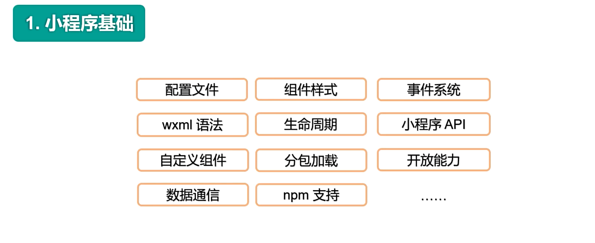

# 一 微信小程序

- 官网：https://mp.weixin.qq.com/cgi-bin/wx

- 小程序是一种新的开放能力，开发者可以快速地开发一个小程序。小程序可以在微信内被便捷地获取和传播，同时具有出色的使用体验。

## 1.1 注册

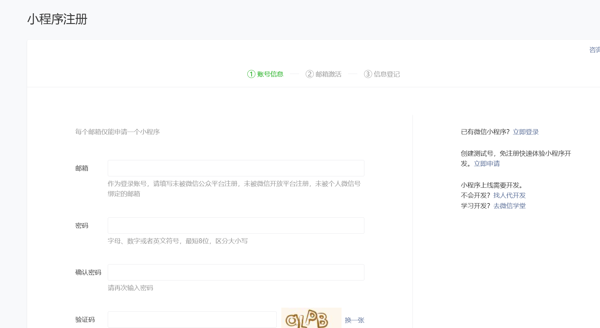

## 1.2 控制中心

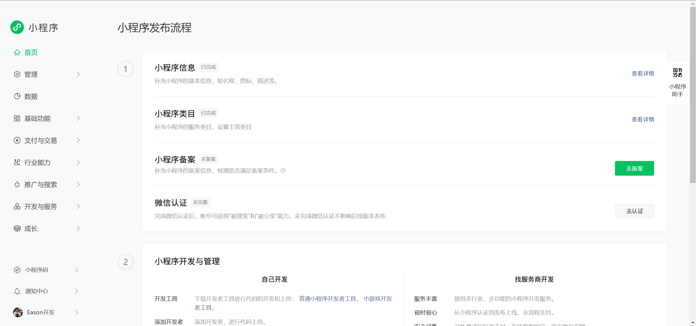

- 文档中心

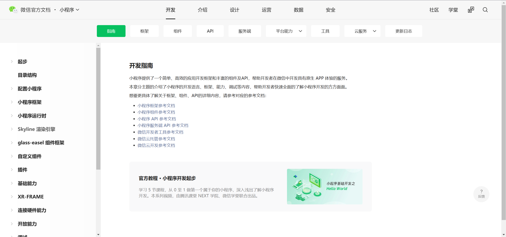

- 成员管理

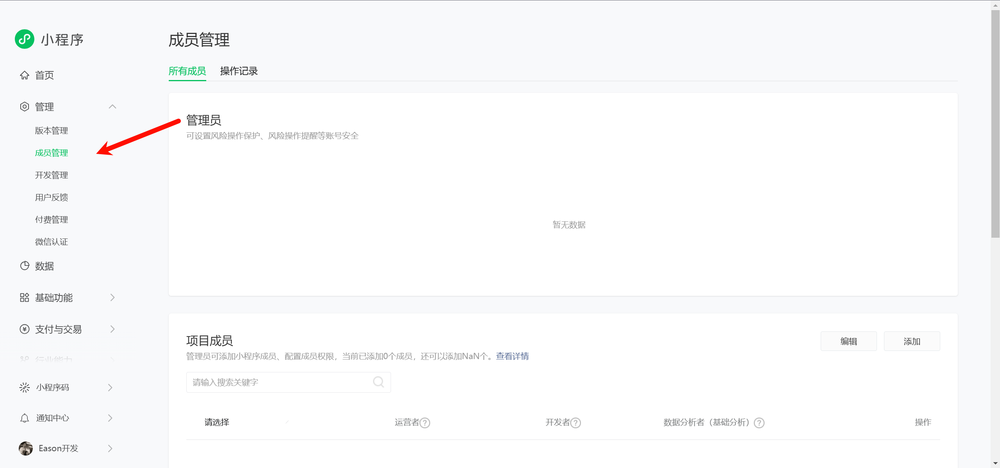

- 开发者ID

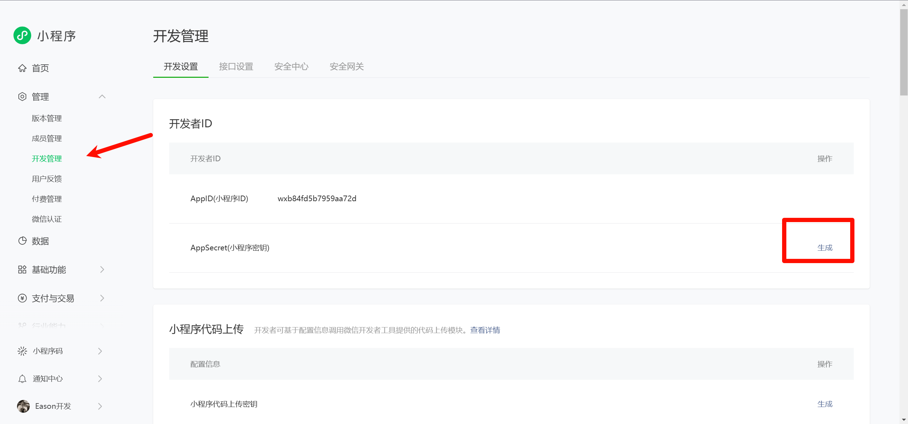

## 1.3 开发工具

- https://developers.weixin.qq.com/miniprogram/dev/devtools/devtools.html

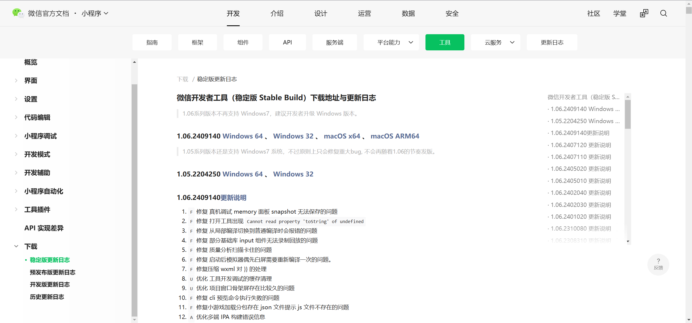

- 根据提示安装开发工具

# 二 开发工具认识

## 2.1 全局文件

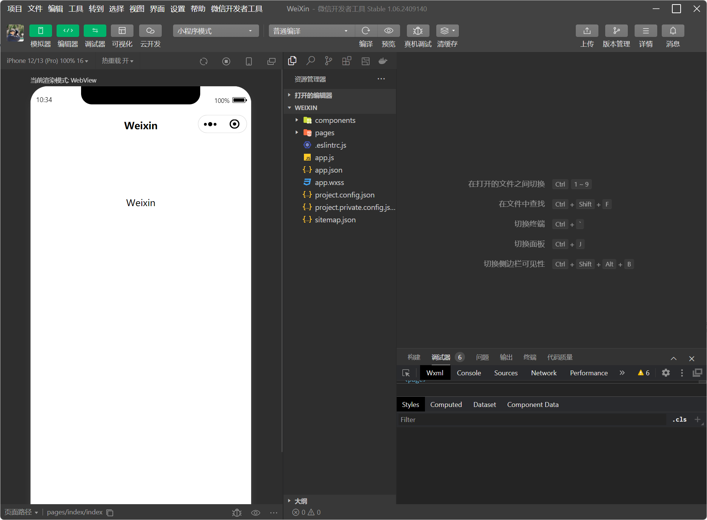


## 2.2 页面文件

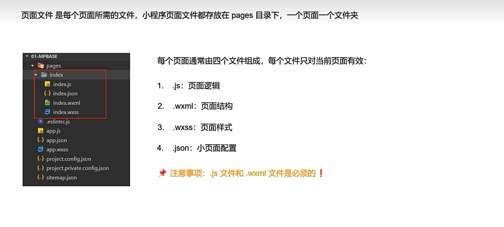

## 2.3 调试工具

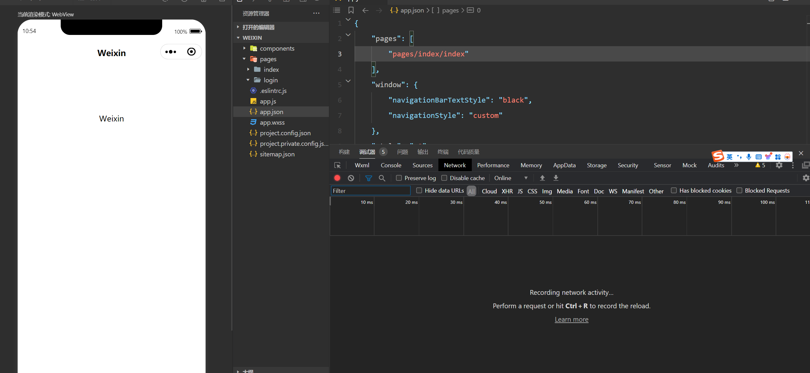

## 2.4 配置文件

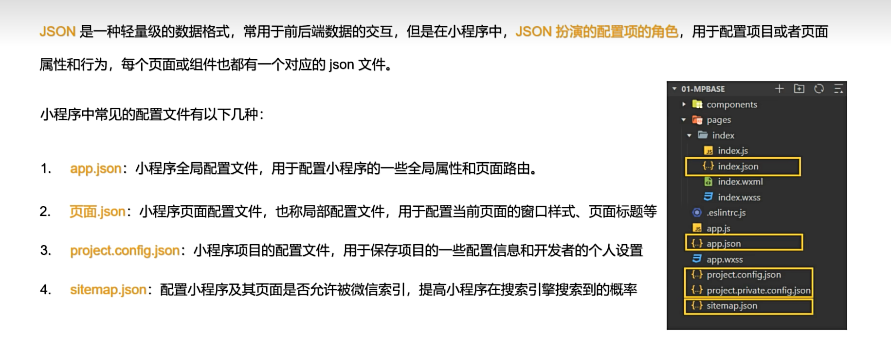

### 2.4.1 App.json

- pages

此处配置小程序的页面路径，以数组形式展示，数组长度最大为10，第一个元素为小程序的首页

```json
 "pages": [
    "pages/index/index",
    "pages/note/add",
    "pages/me/me",
    "pages/login/login",
    "pages/note/detail",
    "pages/note/myNote"
  ]
```

- window

此处配置小程序的窗口样式，包括导航栏、背景色、标题、颜色等等。

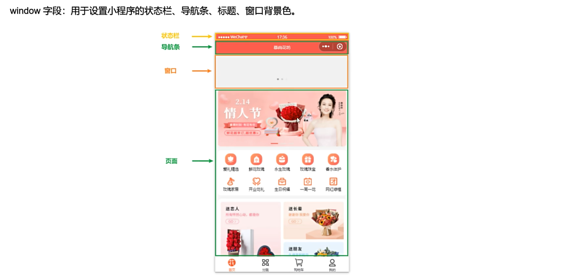

- 设置页面标题

```json
{
  "navigationBarTitleText": "页面标题"
}
```

### 2.4.2 配置文件

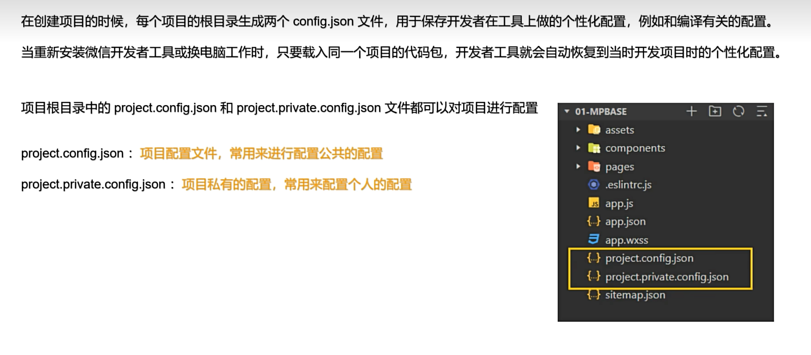