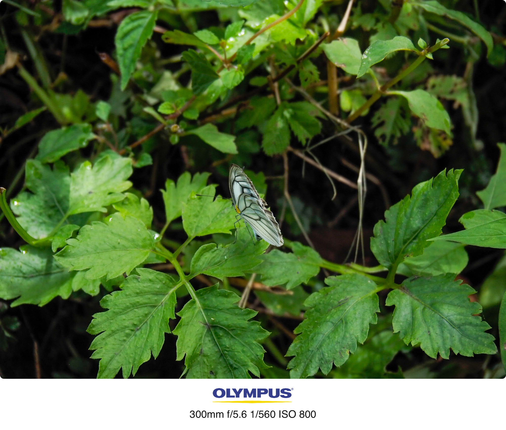
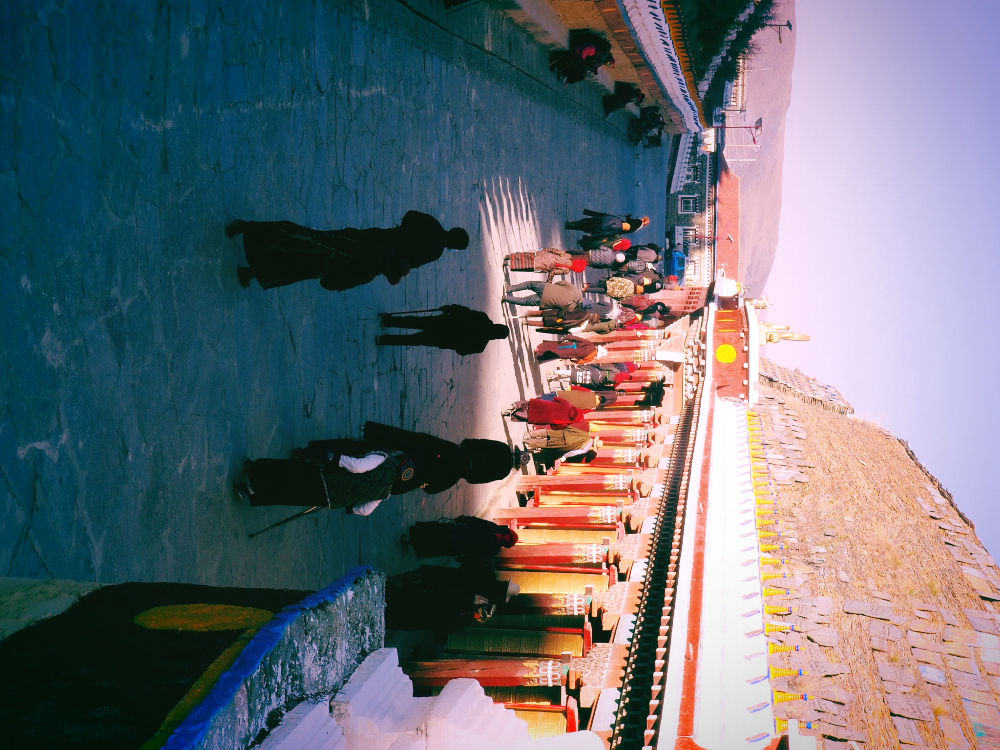

:::success
- 奥林巴斯摄影作品：Olympus 生活摄影作品 by EasonShu
- 设备：奥林巴斯EM1-MARK3,  EM10-3
- 镜头：12-40mm f2.8 PRO, 14-150mm f4.0-5.6 II, 75mm f1.8, ,35mm f1.8
:::
import TOCInline from '@theme/TOCInline';

<TOCInline toc={toc} />

## 1.1  青城山
:::info
青城山，位于四川省成都市西北部，距成都市区66公里，是中国道教名山之一，素有“巴蜀第一山水福地”之称。青城山主峰海拔1600米，山势雄伟，景色秀丽，素有“巴蜀第一山水福地”之称。青城山是中国道教圣地，道教始祖张陵曾在此讲道，故有“道教第一洞天”之称。青城山是中国道教圣地，道教始祖张陵曾在此讲道，故有“道教第一洞天”之称。
:::

## 1.2 乐山大佛

## 1.3 峨边彝族自治区

## 1.4 马里冷旧

## 1.5  昭觉寺

## 1.5 川西

## 1.6 都江堰

## 1.7 重庆

## 1.8 巴郎山

## 1.9 兴隆湖

