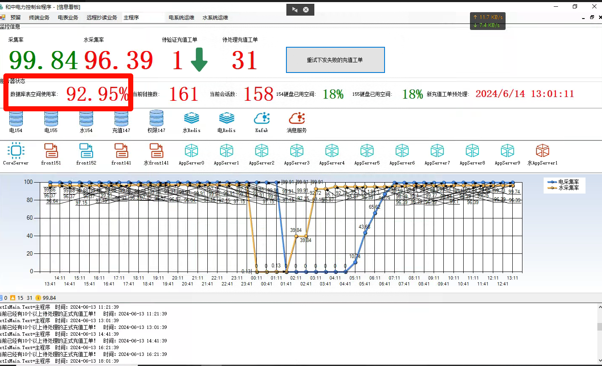
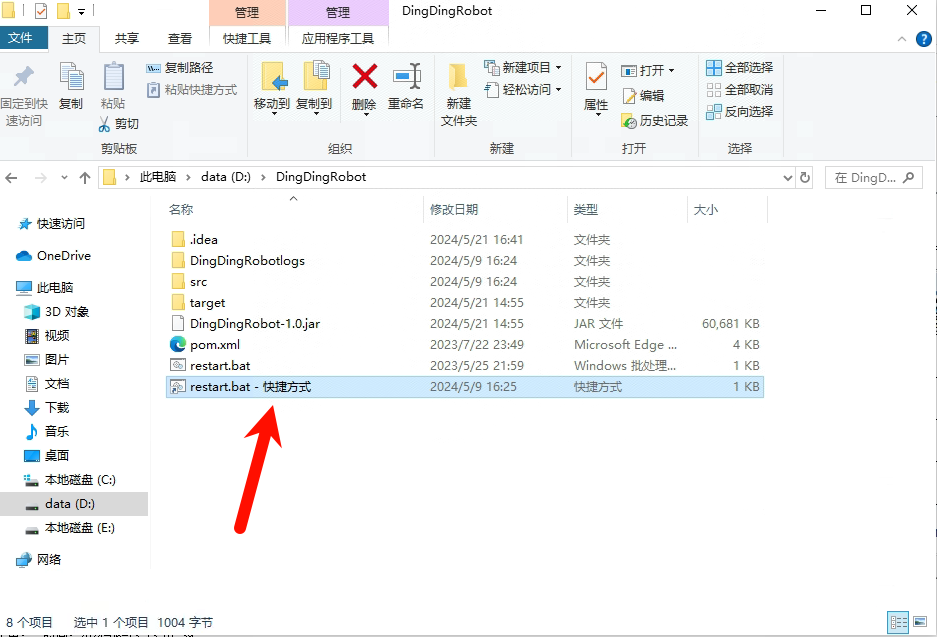

日常运维工作

# 一 日常运维

- 1.1 数据库备份（一周一次）
- 1.2 检查数据库表空间



```sql
-- 查询
select tablespace_name ,sum(bytes) / 1024 / 1024 / 1024 as GB from dba_data_files group by tablespace_name;
-- 查询
select * from dba_data_files where tablespace_name = 'LDJC_DATA';
--2024.3月新增表空间文件
alter tablespace LDJC_DATA add datafile '/home/oracle_space/ldjc_data21.dbf' size 50m autoextend on next 50m maxsize unlimited;
alter tablespace LDJC_DATA add datafile '/home/oracle_space/ldjc_data22.dbf' size 50m autoextend on next 50m maxsize unlimited;
alter tablespace LDJC_DATA add datafile '/home/oracle_space/ldjc_data23.dbf' size 50m autoextend on next 50m maxsize unlimited;
```

- 1.3 钉钉监控程序：启动监控程序



- 采集系统是否正常，采集率是否正常
- 新能源科技公司报表数据

```sql
--统计用电量
select c.COMM_ADDR1 as comAddr1,c.CUST_ID custId, e.ID,
            to_char( e.DATA_DATE, 'yyyy-mm-dd' ) AS data_Date,
            to_char( e.DATA_DATE, 'yyyy-mm-dd' ) AS data_Date,
            PAP_E * nvl(c.T_FACTOR,1) PAP_E,
            PAP_E1 * nvl(c.T_FACTOR,1) PAP_E1,
            PAP_E2 * nvl(c.T_FACTOR,1) PAP_E2,
            PAP_E3 * nvl(c.T_FACTOR,1) PAP_E3,
            PAP_E4 * nvl(c.T_FACTOR,1) PAP_E4,
            PAP_E5 * nvl(c.T_FACTOR,1) PAP_E5,
            PAP_E6 * nvl(c.T_FACTOR,1) PAP_E6,
            PAP_E7 * nvl(c.T_FACTOR,1) PAP_E7,
            PAP_E8 * nvl(c.T_FACTOR,1) PAP_E8,
            PAP_E9 * nvl(c.T_FACTOR,1) PAP_E9,
            PAP_E10 * nvl(c.T_FACTOR,1) PAP_E10,
            PAP_E11 * nvl(c.T_FACTOR,1) PAP_E11,
            PAP_E12 * nvl(c.T_FACTOR,1) PAP_E12,
            PAP_E13 * nvl(c.T_FACTOR,1) PAP_E13,
            PAP_E14 * nvl(c.T_FACTOR,1) PAP_E14,
            PRP_E * nvl(c.T_FACTOR,1) PRP_E,
            PRP_E1 * nvl(c.T_FACTOR,1) PRP_E1,
            PRP_E2 * nvl(c.T_FACTOR,1) PRP_E2,
            PRP_E3 * nvl(c.T_FACTOR,1) PRP_E3,
            PRP_E4 * nvl(c.T_FACTOR,1) PRP_E4,
            PRP_E5 * nvl(c.T_FACTOR,1) PRP_E5,
            PRP_E6 * nvl(c.T_FACTOR,1) PRP_E6,
            PRP_E7 * nvl(c.T_FACTOR,1) PRP_E7,
            PRP_E8 * nvl(c.T_FACTOR,1) PRP_E8,
            PRP_E9 * nvl(c.T_FACTOR,1) PRP_E9,
            PRP_E10 * nvl(c.T_FACTOR,1) PRP_E10,
            PRP_E11 * nvl(c.T_FACTOR,1) PRP_E11,
            PRP_E12 * nvl(c.T_FACTOR,1) PRP_E12,
            PRP_E13 * nvl(c.T_FACTOR,1) PRP_E13,
            PRP_E14 * nvl(c.T_FACTOR,1) PRP_E14,
            RAP_E * nvl(c.T_FACTOR,1) RAP_E,
            RAP_E1 * nvl(c.T_FACTOR,1) RAP_E1,
            RAP_E2 * nvl(c.T_FACTOR,1) RAP_E2,
            RAP_E3 * nvl(c.T_FACTOR,1) RAP_E3,
            RAP_E4 * nvl(c.T_FACTOR,1) RAP_E4,
            RAP_E5 * nvl(c.T_FACTOR,1) RAP_E5,
            RAP_E6 * nvl(c.T_FACTOR,1) RAP_E6,
            RAP_E7 * nvl(c.T_FACTOR,1) RAP_E7,
            RAP_E8 * nvl(c.T_FACTOR,1) RAP_E8,
            RAP_E9 * nvl(c.T_FACTOR,1) RAP_E9,
            RAP_E10 * nvl(c.T_FACTOR,1) RAP_E10,
            RAP_E11 * nvl(c.T_FACTOR,1) RAP_E11,
            RAP_E12 * nvl(c.T_FACTOR,1) RAP_E12,
            RAP_E13 * nvl(c.T_FACTOR,1) RAP_E13,
            RAP_E14 * nvl(c.T_FACTOR,1) RAP_E14,
            RRP_E * nvl(c.T_FACTOR,1) RRP_E,
            RRP_E1 * nvl(c.T_FACTOR,1) RRP_E1,
            RRP_E2 * nvl(c.T_FACTOR,1) RRP_E2,
            RRP_E3 * nvl(c.T_FACTOR,1) RRP_E3,
            RRP_E4 * nvl(c.T_FACTOR,1) RRP_E4,
            RRP_E5 * nvl(c.T_FACTOR,1) RRP_E5,
            RRP_E6 * nvl(c.T_FACTOR,1) RRP_E6,
            RRP_E7 * nvl(c.T_FACTOR,1) RRP_E7,
            RRP_E8 * nvl(c.T_FACTOR,1) RRP_E8,
            RRP_E9 * nvl(c.T_FACTOR,1) RRP_E9,
            RRP_E10 * nvl(c.T_FACTOR,1) RRP_E10,
            RRP_E11 * nvl(c.T_FACTOR,1) RRP_E11,
            RRP_E12 * nvl(c.T_FACTOR,1) RRP_E12,
            RRP_E13 * nvl(c.T_FACTOR,1) RRP_E13,
            RRP_E14 * nvl(c.T_FACTOR,1) RRP_E14,
            RP1_E * nvl(c.T_FACTOR,1) RP1_E,
            RP2_E * nvl(c.T_FACTOR,1) RP2_E,
            RP3_E * nvl(c.T_FACTOR,1) RP3_E,
            RP4_E * nvl(c.T_FACTOR,1) RP4_E,
            COL_TIME from e_mp_day_energy e inner join c_meter c on e.ID = c.METER_ID
				    WHERE c.CUST_ID IN('2113212648',
'2113212651',
'2113212652',
'2113212653',
'2113212656',
'2113212657',
'2113212660',
'2113212661',
'2113212664',
'2113212667',
'2113212668',
'2113212670',
'2113212672',
'2113212678',
'2113212682',
'2113212683',
'2113212685',
'2113212691',
'2113212692',
'2113212697',
'2113212700',
'2113212705',
'2113212709',
'2113212730',
'2113212731',
'2113212735',
'2113212736',
'2113212740',
'2113212742',
'2113212747',
'2113212749',
'2113212750',
'2113212757',
'2113212761',
'2113300973',
'2113311849',
'2113311850',
'2113345811',
'2113362258',
'2113364199',
'2113379611',
'2113387033',
'2113395186',
'2113395189',
'2113396289',
'2113396290',
'2113396771',
'2113398901',
'2113418085',
'2114000123',
'2114000137',
'2114000671',
'2114000672',
'2114000673',
'2114000675',
'2114001084',
'2114001086',
'2114001087',
'2114001219',
'2114001220',
'2114001295',
'2114001365',
'2114001489',
'2114001660',
'2114001889',
'2114002036',
'2114002126',
'2114002277',
'2114002279',
'2114002280',
'2114002299',
'2114002385',
'2114002386',
'2114002388',
'2114002389',
'2114002390',
'2114002391',
'2114002393',
'2114002394',
'2114002395',
'2114002465',
'2114010024',
'2114010090',
'2114010097',
'2114010534',
'2114010535',
'2114011077',
'2114011167',
'2114011507',
'2114011832',
'2114011867',
'56999',
'57019',
'889357',
'17440817',
'17450456',
'61586130',
'256564774',
'274210091',
'411674193',
'442817134',
'456397831',
'497937647',
'514097754',
'534024321',
'534029821',
'669131927',
'715235706',
'715758904',
'727101325',
'727107293',
'738242130',
'742814893',
'879146768',
'891064020',
'891068282',
'891077222',
'891082374',
'992538459',
'993438949',
'1042992328',
'1046182532',
'1048169937',
'1048171585',
'1048171699',
'1048171846',
'1049297026',
'1050250706',
'1067642110',
'1078683485',
'1079235935',
'1081823234',
'1081823579',
'1085075163',
'1103081851',
'1103313686',
'1105279793',
'1142109369',
'1146658096',
'1166390699',
'1194336702',
'1210909956',
'1213733541',
'1230308166',
'1334489817',
'1360244383',
'1360244396',
'1360244400',
'1364538606',
'1365659432',
'1367175367',
'1403190884',
'1404535189',
'1406026162',
'1406121971',
'2010002115',
'2010002645',
'2010003241',
'2010003706',
'2010011360',
'2010013009',
'2010015278',
'2010022461',
'2010022463',
'2010023189',
'2010024513',
'2010025031',
'2010028007',
'2010028071',
'2010028124',
'2010028619',
'2010028856',
'2010029093',
'2010029784',
'2010034181',
'2010044052',
'2010055561',
'2010061625',
'2010090036',
'2010090047',
'2010090050',
'2010090056',
'2010090067',
'2010090075',
'2010090087',
'2010090090',
'2010090091',
'2010090096',
'2010090120',
'2010090129',
'2010090132',
'2010090152',
'2010090161',
'2010090163',
'2010090165',
'2010090168',
'2010090171',
'2010090177',
'2010090183',
'2010090185',
'2010090192',
'2010090204',
'2010090212',
'2010090221',
'2010090222',
'2010090223',
'2010090225',
'2010090232',
'2010090241',
'2010090244',
'2010090245',
'2010090247',
'2010090256',
'2010090262',
'2010090266',
'2010090270',
'2010090275',
'2010090288',
'2010090302',
'2010090307',
'2010090308',
'2010090309',
'2010090311',
'2010090318',
'2010090321',
'2010105880',
'2010106943',
'2010111511',
'2010111512',
'2010111554',
'2010113705',
'2010125036',
'2010128936',
'2010129981',
'2010130812',
'2010130816',
'2010130820',
'2010130821',
'2010130822',
'2010131036',
'2010131205',
'2010131245',
'2010131309',
'2010131316',
'2010135003',
'2010137037',
'2010144409',
'2010150832',
'2010150847',
'2010151096',
'2010151098',
'2010151690',
'2010159051',
'2010159055',
'2010162953',
'2010171402',
'2010171976',
'2010171986',
'2010171987',
'2010173410',
'2010173512',
'2010185401',
'2010185402',
'2010185412',
'2010185414',
'2010186131',
'2010186132',
'2010186133',
'2010186135',
'2010186137',
'2010186138',
'2010186139',
'2010186141',
'2010186143',
'2010186144',
'2010186145',
'2010186147',
'2010186148',
'2010186149',
'2010186150',
'2010186151',
'2010186152',
'2010186153',
'2010186156',
'2010190041',
'2010230368',
'2010230370',
'2010230371',
'2010230372',
'2010230373',
'2010230374',
'2010230375',
'2010230376',
'2010231548',
'2010805525',
'2010900095',
'2010900236',
'2020000087',
'2020001502',
'2020001542',
'2020002027',
'2020002076',
'2020002578',
'2020002899',
'2020002908',
'2020002980',
'2020003021',
'2020003088',
'2020003122',
'2020003153',
'2020003249',
'2020003431',
'2020003594',
'2020003616',
'2020003712',
'2020003851',
'2020003870',
'2020003898',
'2020003913',
'2020003959',
'2020003960',
'2020003961',
'2020003962',
'2020004048',
'2020004069',
'2020004122',
'2020004133',
'2020004297',
'2020004327',
'2020004335',
'2020004466',
'2020004576',
'2020004622',
'2020004635',
'2020004641',
'2020004754',
'2020004826',
'2020004859',
'2020005043',
'2020005078',
'2020005122',
'2020005141',
'2020005149',
'2020005185',
'2020005226',
'2020005343',
'2020005373',
'2020005385',
'2020005471',
'2020005542',
'2020005564',
'2020005853',
'2020005880',
'2020005985',
'2020006162',
'2020006280',
'2020006332',
'2020006333',
'2020006544',
'2020006566',
'2020006639',
'2020006641',
'2020006703',
'2020006741',
'2020006785',
'2020006786',
'2020006833',
'2020006884',
'2020006983',
'2020007026',
'2020007075',
'2020007099',
'2020007187',
'2020007292',
'2020007304',
'2020007455',
'2020007470',
'2020007481',
'2020007486',
'2020007498',
'2020007552',
'2020007593',
'2020007601',
'2020007644',
'2020007686',
'2020007741',
'2020007800',
'2020007841',
'2020007922',
'2020007982',
'2020008005',
'2020008118',
'2020008119',
'2020008120',
'2020008123',
'2020008124',
'2020008206',
'2020008243',
'2020008276',
'2020008322',
'2020008370',
'2020008531',
'2020008561',
'2020008721',
'2020008868',
'2020008871',
'2020008875',
'2020008876',
'2020008877',
'2020008883',
'2020008884',
'2020008889',
'2020008899',
'2020008980',
'2020009094',
'2020009374',
'2020009428',
'2020009628',
'2020009629',
'2020009630',
'2020009730',
'2020009837',
'2020010516',
'2020010539',
'2020010706',
'2020100494',
'2020100719',
'2020100755',
'2020100799',
'2020100874',
'2020100878',
'2020100901',
'2020101005',
'2020101012',
'2020101014',
'2020101081',
'2020101112',
'2020101120',
'2020101412',
'2020158006',
'2020158617',
'2020159045',
'2020159503',
'2020159617',
'2020161030',
'2020161238',
'2020161239',
'2020161240',
'2020161704',
'2020162339',
'2020162420',
'2020166647',
'2020177940',
'2020178762',
'2020179436',
'2020179437',
'2020194486',
'2020196793',
'2020204423',
'2020204436',
'2020204577',
'2020208324',
'2020208511',
'2020209019',
'2020209273',
'2020216895',
'2020216940',
'2020235778',
'2020235779',
'2020235791',
'2020235798',
'2020235870',
'2020235906',
'2020235916',
'2020235926',
'2020235927',
'2020235928',
'2020235930',
'2020235937',
'2020235968',
'2020235969',
'2020235971',
'2020235980',
'2020235981',
'2020235984',
'2020235989',
'2020236001',
'2020236008',
'2020236009',
'2020236010',
'2020236011',
'2020236015',
'2020236016',
'2020236017',
'2020236018',
'2020236021',
'2020236022',
'2020236024',
'2020236026',
'2020236037',
'2020236038',
'2020236039',
'2020236045',
'2020236046',
'2020236047',
'2020236049',
'2020236054',
'2020236056',
'2020236057',
'2020236059',
'2020236061',
'2020236072',
'2020236087',
'2020236113',
'2020236118',
'2020236123',
'2020236129',
'2020236141',
'2021004645',
'2021004646',
'2021004647',
'2021004648',
'2021004649',
'2021004651',
'2021004658',
'2021004660',
'2021006422',
'2021008352',
'2021008371',
'2021008372',
'2021008373',
'2021008374',
'2021013925',
'2021013926',
'2021014873',
'2021014951',
'2021014952',
'2021014953',
'2021014954',
'2021014955',
'2021014956',
'2021017290',
'2022008012',
'2022008013',
'2022008014',
'2022008015',
'2022008016',
'2022008017',
'2022008018',
'2022008019',
'2022008020',
'2022008021',
'2022008022',
'2022008023',
'2022008024',
'2022008025',
'2022008026',
'2022008027',
'2022008028',
'2022008029',
'2022008030',
'2022008031',
'2022008032',
'2022008033',
'2022008034',
'2022008035',
'2022008036',
'2022008037',
'2022008038',
'2022008039',
'2022008040',
'2022008041',
'2022008042',
'2022008043',
'2022008046',
'2022008047',
'2022008048',
'2022008050',
'2022008949',
'2022008950',
'2022010310',
'2022010313',
'2022010314',
'2022010315',
'2022010316',
'2022010317',
'2022010318',
'2022010319',
'2022010320',
'2022010321',
'2022010322',
'2022010323',
'2022010324',
'2022010325',
'2022010327',
'2022010328',
'2022010329',
'2022010330',
'2022010331',
'2022010332',
'2022010333',
'2022010334',
'2022016982',
'2022021291',
'2022021292',
'2022021293',
'2022021294',
'2022021295',
'2022021296',
'2022021297',
'2022021298',
'2022021299',
'2022021300',
'2022021391',
'2022021392',
'2022021393',
'2022021394',
'2022021395',
'2022021396',
'2022021397',
'2022021398',
'2022021399',
'2022021403',
'2022021404',
'2022021405',
'2022023303',
'2022023304',
'2022023305',
'2022023306',
'2022024318',
'2022026210',
'2022026211',
'2022026212',
'2022026213',
'2030000001',
'2030000004',
'2030000007',
'2030000012',
'2030000014',
'2030000029',
'2030000053',
'2030000072',
'2030000221',
'2032001486',
'2032001487',
'2032001491',
'2032001492',
'2032001494',
'2032001497',
'2032001498',
'2032001502',
'2032001576',
'2040000008',
'2040000020',
'2040000021',
'2040000024',
'2040004948',
'2040006432',
'2040006523',
'2040006985',
'2040007938',
'2040009395',
'2040009693',
'2040012264',
'2040012307',
'2040012424',
'2040012882',
'2040084070',
'2040084076',
'2060000011',
'2060000014',
'2060000031',
'2060010484',
'2110211672',
'2110211869',
'2110212086',
'2112020918',
'2112020919',
'2112020920',
'2113212570',
'2113212575',
'2113212576',
'2113212577',
'2113212580',
'2113212587',
'2113212588',
'2113212591',
'2113212593',
'2113212594',
'2113212596',
'2113212597',
'2113212598',
'2113212600',
'2113212602',
'2113212603',
'2113212637',
'2113212643'
) and to_char(e.data_date,'yyyy-mm-dd') between '2024-05-01' and '2024-05-13' order by c.COMM_ADDR1,e.DATA_DATE asc
```

- 采集系统运维周报，月报

- 屏保电价

  ```sql
  
  insert into TASK_Change_price(TASK_NO,TERMINAL_ADDR,AMMETER_ADDR,DEAL_RESULT,REMARK,NOTE)
  select '2023100700010001' as taskno,r.TERMINAL_ADDR,c.comm_addr1,0 as dealresult,'2022本地改远程费控' as remark,'夹江10.07' as note from  C_METER c 
  INNER JOIN R_TMNL_RUN r on c.RTU_ID = r.terminal_id
  where c.COMM_ADDR1 in('250635696','250436955')
  ```

  屏蔽屏显，单相，三相

  ```sql
  -- 单相
  insert into TASK_SCreen_display (TASK_NO,TERMINAL_ADDR,AMMETER_ADDR,DEAL_RESULT,REMARK,NOTE)
  select task_no,TERMINAL_ADDR,AMMETER_ADDR,0 as dealresult,'三相表屏显2022' as remark,note from  TASK_Change_price 
  where DEAL_RESULT = 1 and note like '%4.02 夹江三相%' and AMMETER_ADDR not in 
  (select AMMETER_ADDR from TASK_SCreen_display )
  -- 三相
  insert into TASK_SCreen_display (TASK_NO,TERMINAL_ADDR,AMMETER_ADDR,DEAL_RESULT,REMARK,NOTE)
  select task_no,TERMINAL_ADDR,AMMETER_ADDR,0 as dealresult,'单相表屏显2022' as remark,note from  TASK_Change_price 
  where DEAL_RESULT = 1 and note like '%4.02 夹江三相%' and AMMETER_ADDR not in 
  (select AMMETER_ADDR from TASK_SCreen_display )
  
  ```

  - 下发工单

  ```sql
  
  update taskParam set dealResult=0 where dealResult = -100 and id>3956718
  select max(id) from taskParam
  
  ```

- 每天日报（年底要交）

# 二 采集问题

- 表采集不到数据？

  - 终端是否在线？
  - 档案是否下发？
  - 采集是否任务配置？
  - 终端内是否冻结？-》表计实时数据是否正常？-》现场排查？-》换表
  - 错过采集系统的抄表时间-》立即执行任务？
  - 终端自身问题，表问题

- 高频采集问题？
  - 终端需要支持高频采集，召测终端版本J262以上采集支持？
  - F200是否打开？
  - 曲线任务是否配置？
- 充值工单
  - 充值工单没有下发掌机？立即执行刷新按钮
  - 充值工单的回退，这个需要营销系统撤回
- 水系统
  - 系统档案维护
- 电压监测系统
  - 档案维护
  - 排查是否上线，采集是否正常


  


